# API接口文档

<cite>
**本文档中引用的文件**
- [src-tauri/src/main.rs](file://src-tauri/src/main.rs)
- [src-tauri/src/chat/service.rs](file://src-tauri/src/chat/service.rs)
- [src-tauri/src/chat/conversation_repo.rs](file://src-tauri/src/chat/conversation_repo.rs)
- [src-tauri/src/chat/message_repo.rs](file://src-tauri/src/chat/message_repo.rs)
- [src-tauri/src/chat/openai_client.rs](file://src-tauri/src/chat/openai_client.rs)
- [src-tauri/src/database/models.rs](file://src-tauri/src/database/models.rs)
- [src-tauri/src/database/connection.rs](file://src-tauri/src/database/connection.rs)
- [src-tauri/src/token_tracker/tracker.rs](file://src-tauri/src/token_tracker/tracker.rs)
- [src-tauri/src/config/mod.rs](file://src-tauri/src/config/mod.rs)
- [src/api/tauri-api.ts](file://src/api/tauri-api.ts)
- [src/api/config-api.ts](file://src/api/config-api.ts)
- [src-tauri/Cargo.toml](file://src-tauri/Cargo.toml)
- [src-tauri/tauri.conf.json](file://src-tauri/tauri.conf.json)
</cite>

## 目录
1. [简介](#简介)
2. [项目结构](#项目结构)
3. [核心组件](#核心组件)
4. [架构概览](#架构概览)
5. [详细组件分析](#详细组件分析)
6. [依赖关系分析](#依赖关系分析)
7. [性能考虑](#性能考虑)
8. [故障排除指南](#故障排除指南)
9. [结论](#结论)

## 简介

Malou Agent是一个基于Tauri框架开发的Windows桌面AI助手应用。本项目提供了完整的API接口文档，涵盖了会话管理、消息管理和配置管理三大核心功能模块。系统采用Rust作为后端语言，TypeScript作为前端语言，通过Tauri的IPC机制实现前后端通信。

## 项目结构

项目采用前后端分离的架构设计，主要分为以下层次：

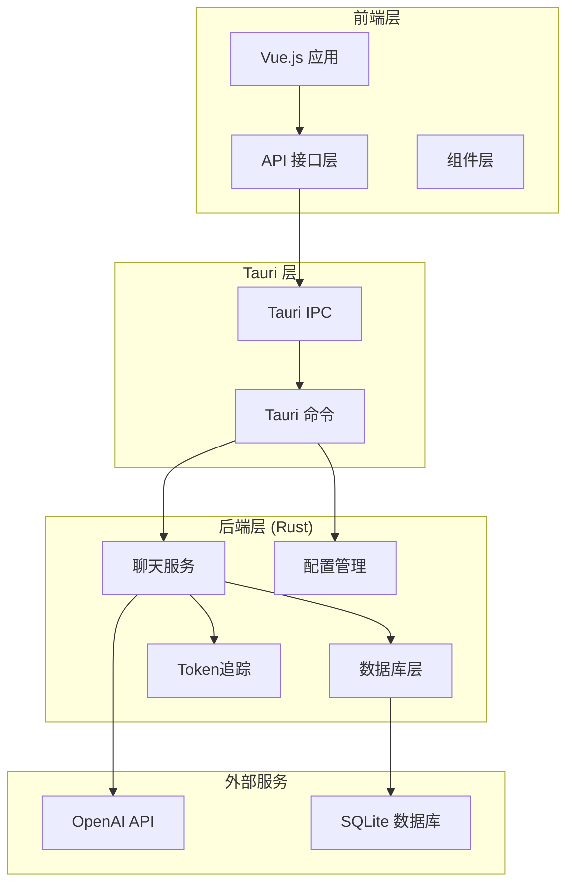

**图表来源**
- [src-tauri/src/main.rs](file://src-tauri/src/main.rs#L267-L340)
- [src/api/tauri-api.ts](file://src/api/tauri-api.ts#L1-L242)

**章节来源**
- [src-tauri/src/main.rs](file://src-tauri/src/main.rs#L1-L341)
- [src/api/tauri-api.ts](file://src/api/tauri-api.ts#L1-L242)

## 核心组件

### Tauri命令接口

系统通过Tauri的`#[tauri::command]`宏定义了完整的命令接口体系，所有命令都注册在主函数中统一管理。

### 数据模型

系统定义了完整的数据传输对象，确保前后端数据交换的一致性：

- **会话模型 (Conversation)**: 包含会话的基本信息和统计字段
- **消息模型 (Message)**: 包含消息内容、角色和Token统计
- **OpenAI配置 (OpenAIConfig)**: 包含API密钥、基础URL、模型和温度参数
- **Token使用模型**: 支持汇总统计和每日趋势分析

**章节来源**
- [src-tauri/src/database/models.rs](file://src-tauri/src/database/models.rs#L1-L110)
- [src-tauri/src/chat/openai_client.rs](file://src-tauri/src/chat/openai_client.rs#L1-L141)

## 架构概览

系统采用分层架构设计，各层职责明确，耦合度低：

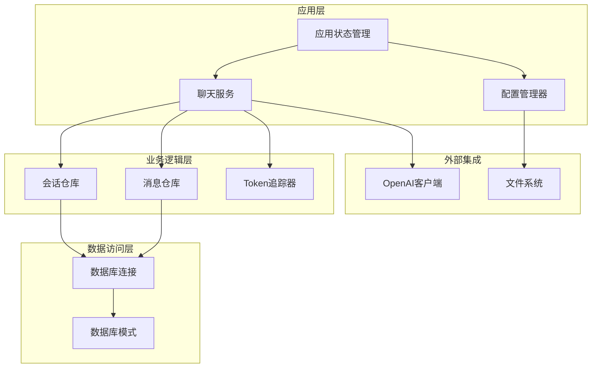

**图表来源**
- [src-tauri/src/main.rs](file://src-tauri/src/main.rs#L53-L56)
- [src-tauri/src/chat/service.rs](file://src-tauri/src/chat/service.rs#L11-L28)

## 详细组件分析

### 会话管理API

#### create_conversation (创建会话)

**接口定义**
- 方法: `create_conversation`
- 请求参数: `title: string` (会话标题)
- 响应: `Conversation` 对象
- 认证: 无特殊要求

**处理流程**
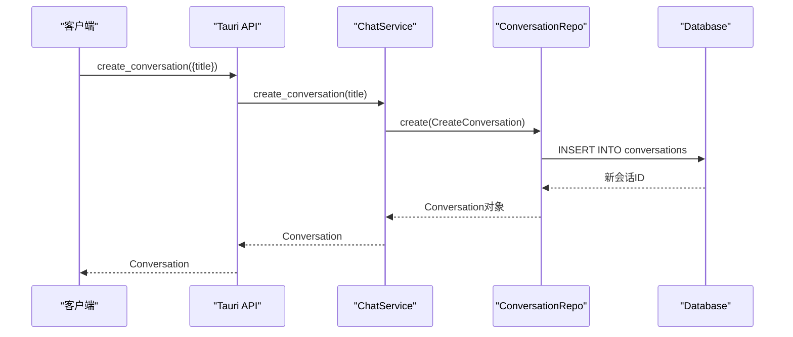

**图表来源**
- [src-tauri/src/chat/conversation_repo.rs](file://src-tauri/src/chat/conversation_repo.rs#L14-L37)
- [src-tauri/src/chat/service.rs](file://src-tauri/src/chat/service.rs#L37-L42)

**请求示例**
```typescript
const conversation = await createConversation("新会话标题");
```

**响应示例**
```json
{
  "id": "uuid字符串",
  "title": "会话标题",
  "model_id": null,
  "total_tokens": 0,
  "message_count": 0,
  "created_at": "ISO时间戳",
  "updated_at": "ISO时间戳"
}
```

**章节来源**
- [src-tauri/src/chat/conversation_repo.rs](file://src-tauri/src/chat/conversation_repo.rs#L1-L161)
- [src-tauri/src/chat/service.rs](file://src-tauri/src/chat/service.rs#L37-L42)
- [src/api/tauri-api.ts](file://src/api/tauri-api.ts#L68-L73)

#### list_conversations (获取会话列表)

**接口定义**
- 方法: `list_conversations`
- 请求参数: `limit?: number`, `offset?: number`
- 响应: `Conversation[]` 数组
- 认证: 无特殊要求

**处理流程**
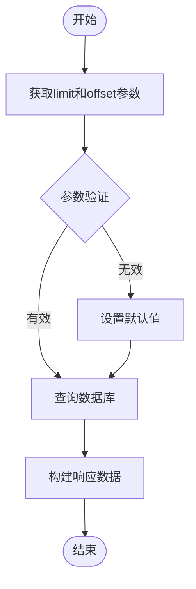

**图表来源**
- [src-tauri/src/chat/conversation_repo.rs](file://src-tauri/src/chat/conversation_repo.rs#L39-L63)

**请求示例**
```typescript
const conversations = await listConversations(50, 0);
```

**响应示例**
```json
[
  {
    "id": "uuid1",
    "title": "会话1",
    "total_tokens": 150,
    "message_count": 5,
    "created_at": "2024-01-01T00:00:00Z",
    "updated_at": "2024-01-01T00:00:00Z"
  }
]
```

**章节来源**
- [src-tauri/src/chat/conversation_repo.rs](file://src-tauri/src/chat/conversation_repo.rs#L39-L63)
- [src/api/tauri-api.ts](file://src/api/tauri-api.ts#L75-L80)

### 消息管理API

#### send_message (发送消息)

**接口定义**
- 方法: `send_message`
- 请求参数: `SendMessageRequest` 对象
- 响应: `SendMessageResponse` 对象
- 认证: 无特殊要求

**请求结构**
```typescript
interface SendMessageRequest {
  conversation_id: string;
  content: string;
}
```

**响应结构**
```typescript
interface SendMessageResponse {
  id: string;
  content: string;
  role: string;
  conversation_id: string;
  timestamp: string;
  prompt_tokens: number;
  completion_tokens: number;
  total_tokens: number;
}
```

**处理流程**
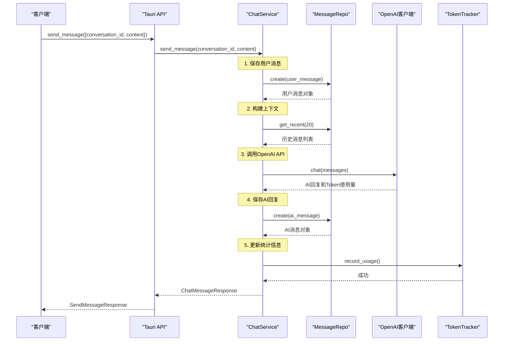

**图表来源**
- [src-tauri/src/chat/service.rs](file://src-tauri/src/chat/service.rs#L94-L177)
- [src-tauri/src/chat/openai_client.rs](file://src-tauri/src/chat/openai_client.rs#L74-L116)

**错误处理**
- OpenAI API调用失败时返回详细的错误信息
- 数据库操作异常时提供具体的错误描述
- Token追踪失败时不影响主要功能

**章节来源**
- [src-tauri/src/chat/service.rs](file://src-tauri/src/chat/service.rs#L94-L177)
- [src-tauri/src/chat/openai_client.rs](file://src-tauri/src/chat/openai_client.rs#L74-L116)
- [src/api/tauri-api.ts](file://src/api/tauri-api.ts#L105-L110)

#### get_messages (获取消息列表)

**接口定义**
- 方法: `get_conversation_messages`
- 请求参数: `conversationId: string`, `limit?: number`, `offset?: number`
- 响应: `Message[]` 数组
- 认证: 无特殊要求

**处理流程**
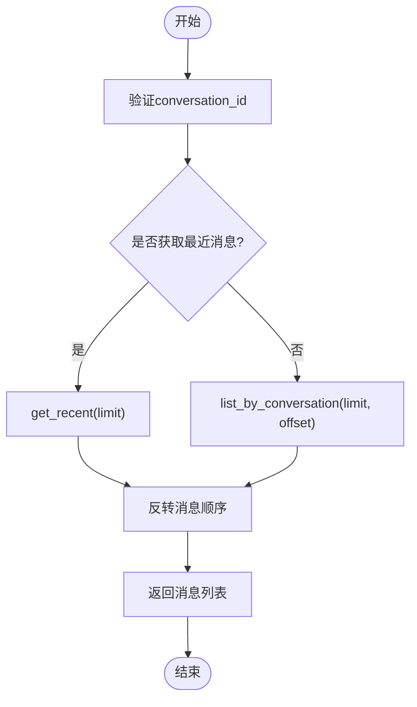

**图表来源**
- [src-tauri/src/chat/message_repo.rs](file://src-tauri/src/chat/message_repo.rs#L83-L113)

**请求示例**
```typescript
const messages = await getConversationMessages("conversation-id", 100, 0);
```

**响应示例**
```json
[
  {
    "id": "uuid1",
    "conversation_id": "conversation-id",
    "role": "user",
    "content": "用户消息内容",
    "prompt_tokens": 0,
    "completion_tokens": 0,
    "total_tokens": 0,
    "created_at": "2024-01-01T00:00:00Z"
  }
]
```

**章节来源**
- [src-tauri/src/chat/message_repo.rs](file://src-tauri/src/chat/message_repo.rs#L54-L81)
- [src/api/tauri-api.ts](file://src/api/tauri-api.ts#L112-L125)

### 配置管理API

#### get_openai_config (获取OpenAI配置)

**接口定义**
- 方法: `get_openai_config`
- 请求参数: 无
- 响应: `OpenAIConfig` 对象
- 认证: 无特殊要求

**配置结构**
```typescript
interface OpenAIConfig {
  api_key: string;
  api_base: string;
  model: string;
  temperature: number;
}
```

**处理流程**
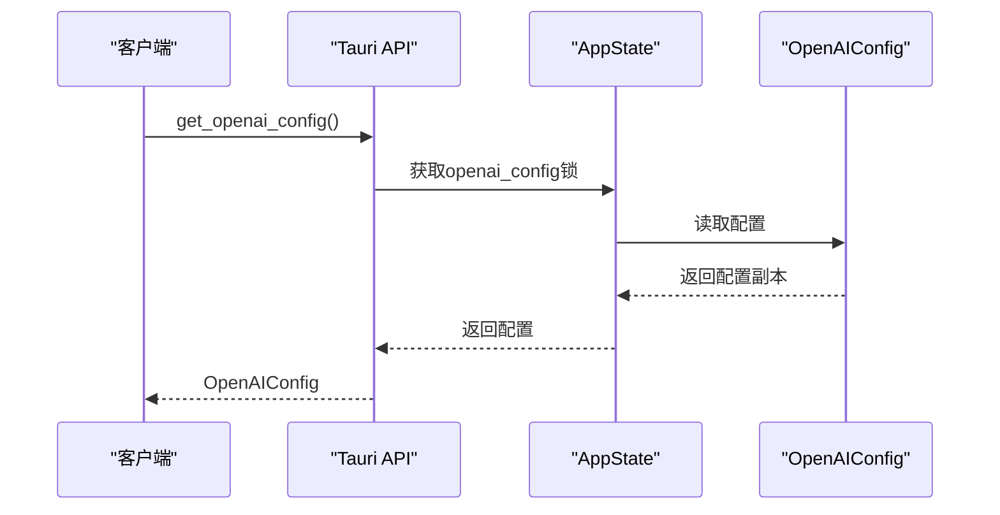

**图表来源**
- [src-tauri/src/main.rs](file://src-tauri/src/main.rs#L201-L207)

**请求示例**
```typescript
const config = await getOpenAIConfig();
```

**响应示例**
```json
{
  "api_key": "sk-...key",
  "api_base": "https://api.openai.com/v1",
  "model": "gpt-3.5-turbo",
  "temperature": 0.7
}
```

**章节来源**
- [src-tauri/src/main.rs](file://src-tauri/src/main.rs#L201-L207)
- [src/api/tauri-api.ts](file://src/api/tauri-api.ts#L155-L160)

#### save_openai_config (保存OpenAI配置)

**接口定义**
- 方法: `save_openai_config`
- 请求参数: `OpenAIConfig` 对象
- 响应: `void`
- 认证: 无特殊要求

**处理流程**
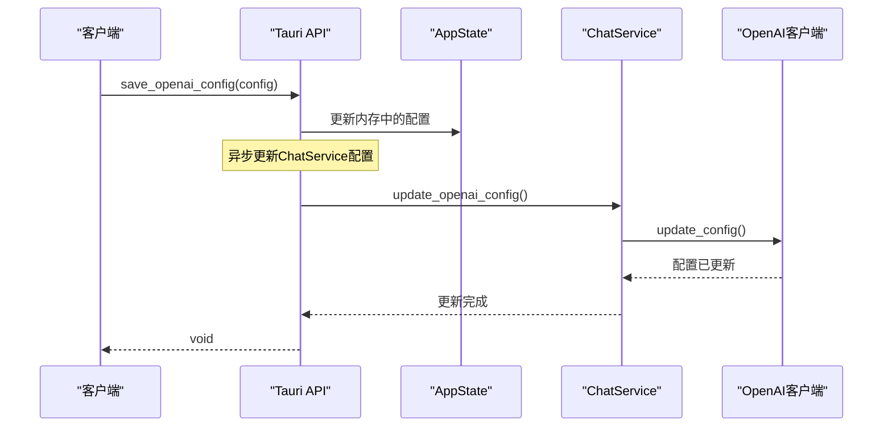

**图表来源**
- [src-tauri/src/main.rs](file://src-tauri/src/main.rs#L209-L240)
- [src-tauri/src/chat/service.rs](file://src-tauri/src/chat/service.rs#L31-L35)

**请求示例**
```typescript
await saveOpenAIConfig({
  api_key: "sk-...new-key",
  api_base: "https://api.openai.com/v1",
  model: "gpt-4",
  temperature: 0.8
});
```

**章节来源**
- [src-tauri/src/main.rs](file://src-tauri/src/main.rs#L209-L240)
- [src/api/tauri-api.ts](file://src/api/tauri-api.ts#L162-L167)

### Token统计API

#### get_token_usage_summary (获取Token使用汇总)

**接口定义**
- 方法: `get_token_usage_summary`
- 请求参数: `startDate?: string`, `endDate?: string`
- 响应: `TokenSummary` 对象
- 认证: 无特殊要求

**Token统计结构**
```typescript
interface TokenSummary {
  total_prompt_tokens: number;
  total_completion_tokens: number;
  total_tokens: number;
  total_requests: number;
}
```

**处理流程**
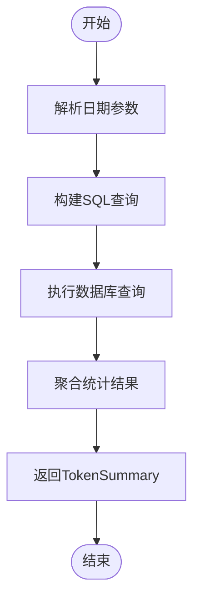

**图表来源**
- [src-tauri/src/token_tracker/tracker.rs](file://src-tauri/src/token_tracker/tracker.rs#L50-L113)

**请求示例**
```typescript
const summary = await getTokenUsageSummary("2024-01-01", "2024-01-31");
```

**响应示例**
```json
{
  "total_prompt_tokens": 1500,
  "total_completion_tokens": 2300,
  "total_tokens": 3800,
  "total_requests": 45
}
```

**章节来源**
- [src-tauri/src/token_tracker/tracker.rs](file://src-tauri/src/token_tracker/tracker.rs#L50-L113)
- [src/api/tauri-api.ts](file://src/api/tauri-api.ts#L136-L144)

#### get_token_usage_trend (获取Token使用趋势)

**接口定义**
- 方法: `get_token_usage_trend`
- 请求参数: `days?: number`
- 响应: `DailyTokenUsage[]` 数组
- 认证: 无特殊要求

**DailyTokenUsage结构**
```typescript
interface DailyTokenUsage {
  date: string;
  prompt_tokens: number;
  completion_tokens: number;
  total_tokens: number;
  request_count: number;
}
```

**请求示例**
```typescript
const trend = await getTokenUsageTrend(30);
```

**响应示例**
```json
[
  {
    "date": "2024-01-01",
    "prompt_tokens": 120,
    "completion_tokens": 180,
    "total_tokens": 300,
    "request_count": 3
  }
]
```

**章节来源**
- [src-tauri/src/token_tracker/tracker.rs](file://src-tauri/src/token_tracker/tracker.rs#L143-L168)
- [src/api/tauri-api.ts](file://src/api/tauri-api.ts#L146-L151)

## 依赖关系分析

### 外部依赖

系统的主要外部依赖包括：

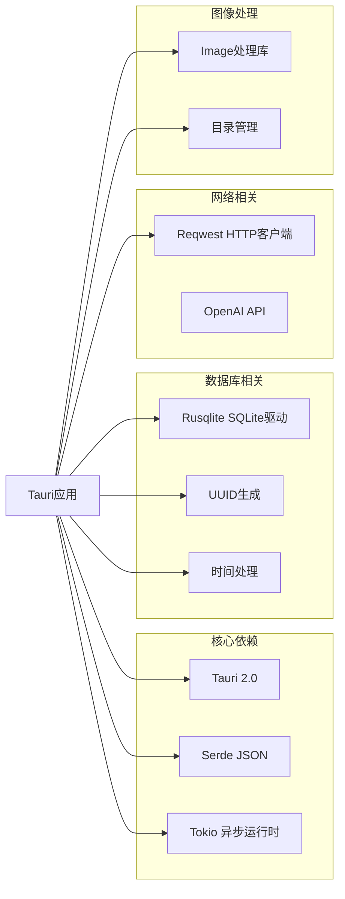

**图表来源**
- [src-tauri/Cargo.toml](file://src-tauri/Cargo.toml#L12-L25)

### 内部模块依赖

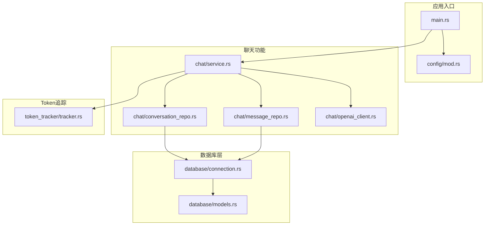

**图表来源**
- [src-tauri/src/main.rs](file://src-tauri/src/main.rs#L1-L14)
- [src-tauri/src/chat/service.rs](file://src-tauri/src/chat/service.rs#L1-L18)

**章节来源**
- [src-tauri/Cargo.toml](file://src-tauri/Cargo.toml#L1-L25)

## 性能考虑

### 异步处理策略

系统采用Tokio异步运行时处理I/O密集型操作：

1. **数据库操作**: 使用`tokio::task::spawn_blocking`处理阻塞的数据库操作
2. **API调用**: OpenAI API调用使用异步方式，避免阻塞主线程
3. **文件操作**: 配置文件读写采用异步模式

### 缓存和优化

1. **OpenAI客户端缓存**: 使用Arc和RwLock包装客户端实例
2. **数据库连接池**: 通过共享连接减少连接开销
3. **消息上下文优化**: 仅获取最近20条消息构建上下文

### 内存管理

1. **智能指针**: 使用Rc和Arc进行智能内存管理
2. **配置管理**: 内存中的配置与持久化配置分离
3. **错误处理**: 适当的错误传播避免内存泄漏

## 故障排除指南

### 常见错误及解决方案

#### OpenAI API错误

**错误类型**: `API 错误 (status): 错误详情`

**可能原因**:
- API密钥无效或过期
- 网络连接问题
- 请求频率过高

**解决方案**:
1. 验证API密钥的有效性
2. 检查网络连接状态
3. 实现重试机制和退避算法

#### 数据库连接错误

**错误类型**: `数据库初始化失败: 错误详情`

**可能原因**:
- 文件权限不足
- 磁盘空间不足
- 数据库文件损坏

**解决方案**:
1. 检查应用程序数据目录权限
2. 确保有足够的磁盘空间
3. 重新初始化数据库

#### Token追踪错误

**错误类型**: `获取 Token 统计失败: 错误详情`

**可能原因**:
- Token使用表结构不匹配
- 数据库查询异常

**解决方案**:
1. 检查数据库迁移状态
2. 验证Token使用表结构
3. 重新创建Token使用表

### 调试建议

1. **启用详细日志**: 在开发环境中启用详细的日志输出
2. **监控资源使用**: 定期检查内存和CPU使用情况
3. **性能基准测试**: 定期进行性能基准测试

**章节来源**
- [src-tauri/src/chat/openai_client.rs](file://src-tauri/src/chat/openai_client.rs#L94-L98)
- [src-tauri/src/main.rs](file://src-tauri/src/main.rs#L244-L263)

## 结论

Malou Agent的API接口设计遵循了清晰的分层架构原则，提供了完整的会话管理、消息管理和配置管理功能。系统采用异步编程模型，确保了良好的用户体验和性能表现。

### 主要优势

1. **模块化设计**: 清晰的模块划分便于维护和扩展
2. **异步处理**: 有效的异步编程模式提升了系统性能
3. **错误处理**: 完善的错误处理机制增强了系统稳定性
4. **配置灵活**: 支持动态配置更新和热重载

### 未来改进方向

1. **WebSocket支持**: 考虑添加实时通信功能
2. **API版本控制**: 实施API版本管理策略
3. **监控和日志**: 增强系统的可观测性
4. **安全性增强**: 实施更严格的安全措施

该API文档为开发者提供了完整的接口参考，有助于快速理解和使用Malou Agent的各项功能。