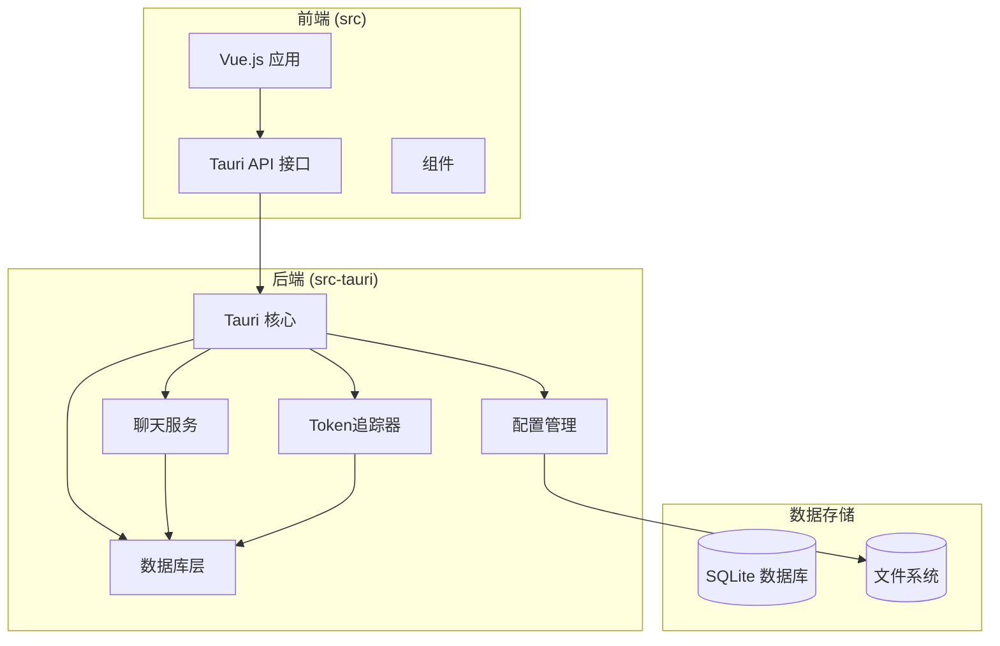
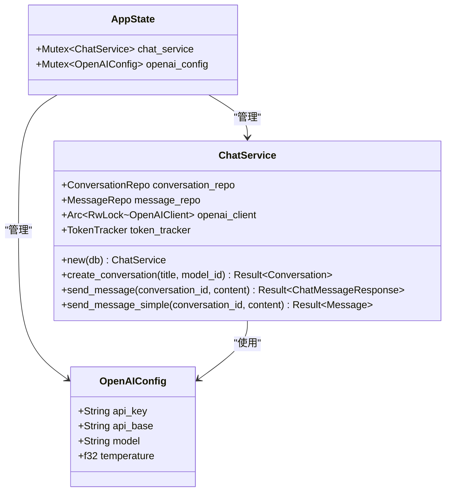
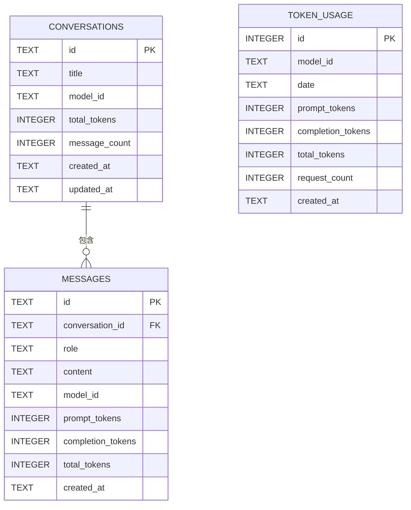
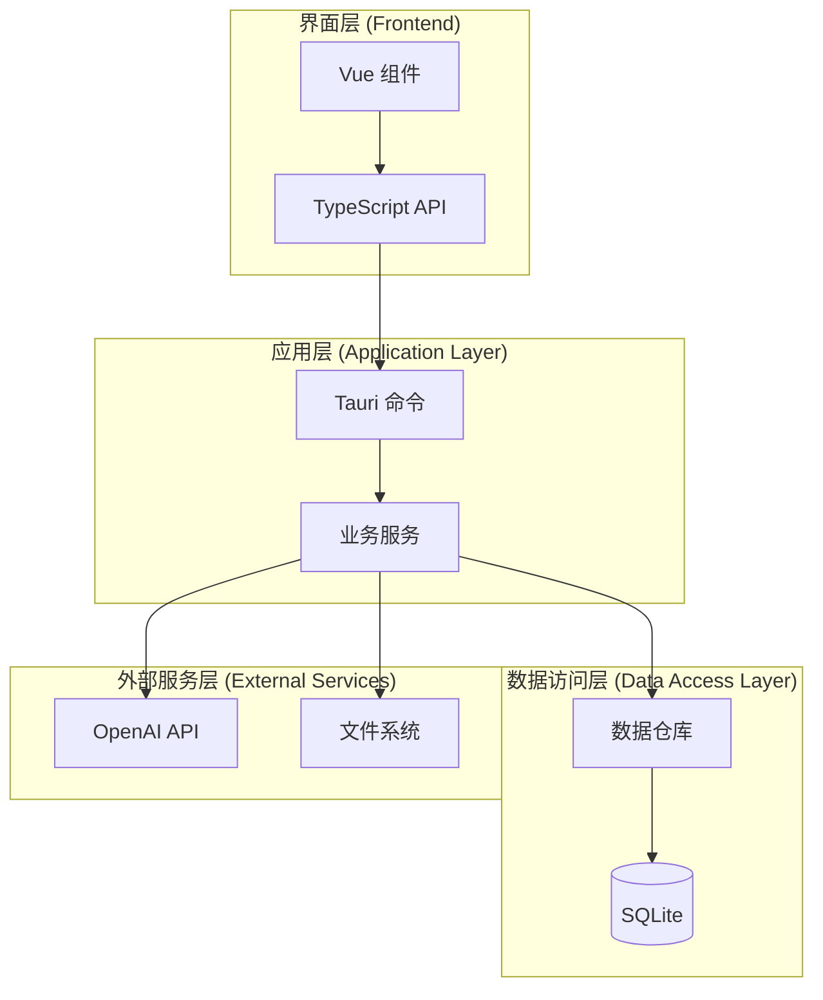
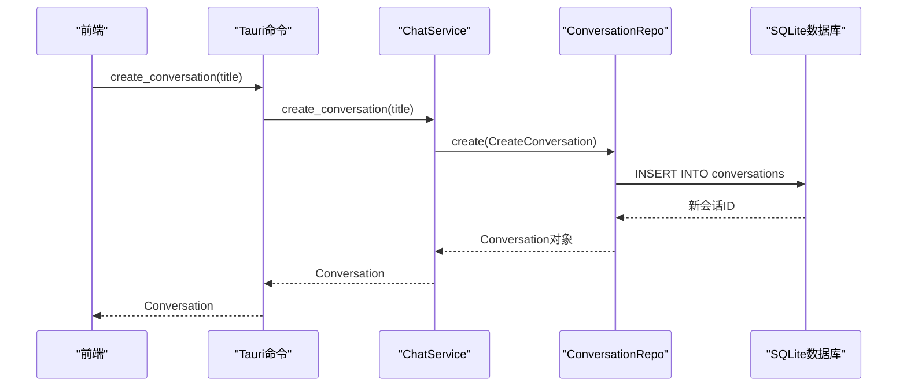
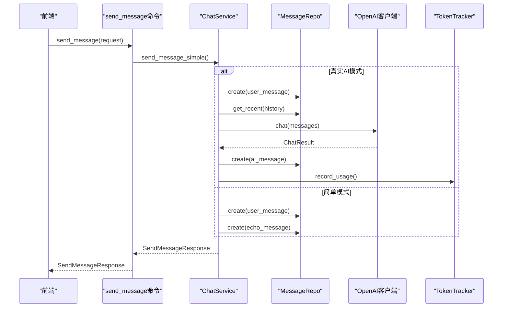
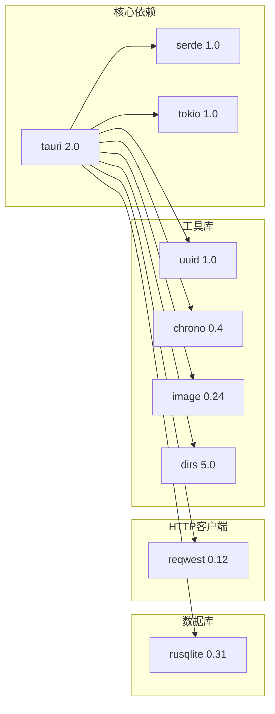
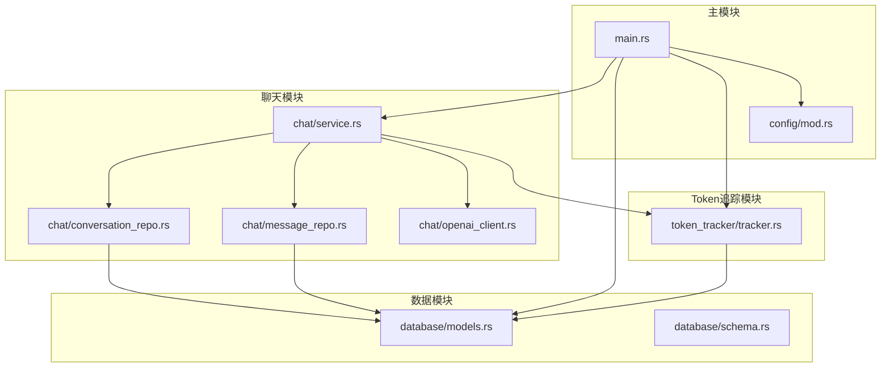
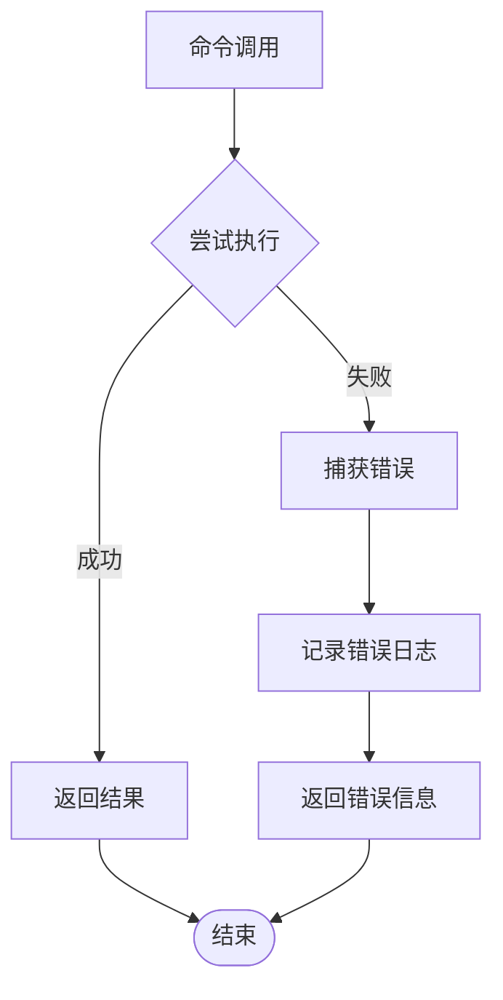

# Tauri命令接口

<cite>
**本文档引用的文件**
- [src-tauri/src/main.rs](file://src-tauri/src/main.rs)
- [src/api/tauri-api.ts](file://src/api/tauri-api.ts)
- [src-tauri/src/chat/service.rs](file://src-tauri/src/chat/service.rs)
- [src-tauri/src/chat/conversation_repo.rs](file://src-tauri/src/chat/conversation_repo.rs)
- [src-tauri/src/chat/message_repo.rs](file://src-tauri/src/chat/message_repo.rs)
- [src-tauri/src/token_tracker/tracker.rs](file://src-tauri/src/token_tracker/tracker.rs)
- [src-tauri/src/chat/openai_client.rs](file://src-tauri/src/chat/openai_client.rs)
- [src-tauri/src/database/models.rs](file://src-tauri/src/database/models.rs)
- [src-tauri/src/database/schema.rs](file://src-tauri/src/database/schema.rs)
- [src-tauri/src/config/mod.rs](file://src-tauri/src/config/mod.rs)
- [src-tauri/Cargo.toml](file://src-tauri/Cargo.toml)
</cite>

## 目录
1. [简介](#简介)
2. [项目结构](#项目结构)
3. [核心组件](#核心组件)
4. [架构概览](#架构概览)
5. [详细组件分析](#详细组件分析)
6. [依赖关系分析](#依赖关系分析)
7. [性能考虑](#性能考虑)
8. [故障排除指南](#故障排除指南)
9. [结论](#结论)

## 简介

Malou Agent是一个基于Tauri框架开发的Windows桌面AI助手应用。该应用提供了完整的对话式AI交互功能，包括会话管理、消息处理和Token使用统计等功能。本文档详细介绍了所有Tauri命令接口，包括会话管理、消息管理和Token统计相关的命令。

## 项目结构

Malou Agent采用前后端分离的架构设计，前端使用Vue.js和TypeScript，后端使用Rust和Tauri框架。主要目录结构如下：



**图表来源**
- [src-tauri/src/main.rs](file://src-tauri/src/main.rs#L242-L315)
- [src/api/tauri-api.ts](file://src/api/tauri-api.ts#L1-L242)

**章节来源**
- [src-tauri/src/main.rs](file://src-tauri/src/main.rs#L1-L316)
- [src/api/tauri-api.ts](file://src/api/tauri-api.ts#L1-L242)

## 核心组件

### 应用状态管理

应用使用AppState结构体管理全局状态，包含聊天服务和OpenAI配置：



**图表来源**
- [src-tauri/src/main.rs](file://src-tauri/src/main.rs#L53-L56)
- [src-tauri/src/main.rs](file://src-tauri/src/main.rs#L260-L268)
- [src-tauri/src/chat/service.rs](file://src-tauri/src/chat/service.rs#L13-L29)

### 数据模型

应用使用标准化的数据模型进行前后端通信：



**图表来源**
- [src-tauri/src/database/schema.rs](file://src-tauri/src/database/schema.rs#L3-L62)
- [src-tauri/src/database/models.rs](file://src-tauri/src/database/models.rs#L3-L109)

**章节来源**
- [src-tauri/src/main.rs](file://src-tauri/src/main.rs#L53-L56)
- [src-tauri/src/database/models.rs](file://src-tauri/src/database/models.rs#L1-L110)
- [src-tauri/src/database/schema.rs](file://src-tauri/src/database/schema.rs#L1-L68)

## 架构概览

Malou Agent采用分层架构设计，确保代码的可维护性和扩展性：



**图表来源**
- [src-tauri/src/main.rs](file://src-tauri/src/main.rs#L285-L312)
- [src-tauri/src/chat/service.rs](file://src-tauri/src/chat/service.rs#L1-L224)

## 详细组件分析

### 会话管理命令

会话管理是应用的核心功能之一，提供了完整的对话生命周期管理。

#### 命令列表

| 命令名 | 参数 | 返回值 | 描述 |
|--------|------|--------|------|
| create_conversation | title: string, model_id?: string | Conversation | 创建新会话 |
| list_conversations | limit?: number, offset?: number | Conversation[] | 获取会话列表 |
| get_conversation | id: string | Conversation \| null | 获取单个会话 |
| update_conversation_title | id: string, title: string | void | 更新会话标题 |
| delete_conversation | id: string | boolean | 删除会话 |

#### TypeScript调用示例

```typescript
// 创建新会话
const conversation = await createConversation("我的第一个会话");

// 获取会话列表
const conversations = await listConversations(50, 0);

// 获取单个会话
const conversation = await getConversation("conversation-id");

// 更新会话标题
await updateConversationTitle("conversation-id", "新标题");

// 删除会话
const deleted = await deleteConversation("conversation-id");
```

#### Rust后端实现

会话管理命令通过ChatService的ConversationRepo实现：



**图表来源**
- [src-tauri/src/main.rs](file://src-tauri/src/main.rs#L71-L78)
- [src-tauri/src/chat/service.rs](file://src-tauri/src/chat/service.rs#L37-L42)
- [src-tauri/src/chat/conversation_repo.rs](file://src-tauri/src/chat/conversation_repo.rs#L14-L37)

**章节来源**
- [src-tauri/src/main.rs](file://src-tauri/src/main.rs#L69-L116)
- [src/api/tauri-api.ts](file://src/api/tauri-api.ts#L66-L101)
- [src-tauri/src/chat/service.rs](file://src-tauri/src/chat/service.rs#L37-L70)
- [src-tauri/src/chat/conversation_repo.rs](file://src-tauri/src/chat/conversation_repo.rs#L14-L161)

### 消息管理命令

消息管理功能提供了完整的对话消息处理能力。

#### 命令列表

| 命令名 | 参数 | 返回值 | 描述 |
|--------|------|--------|------|
| send_message | request: SendMessageRequest | SendMessageResponse | 发送消息并获取AI回复 |
| get_conversation_messages | conversation_id: string, limit?: number, offset?: number | Message[] | 获取会话消息 |
| clear_conversation_messages | conversation_id: string | number | 清空会话消息 |

#### TypeScript调用示例

```typescript
// 发送消息
const response = await sendMessage({
    conversation_id: "conversation-id",
    content: "你好，AI助手"
});

// 获取会话消息
const messages = await getConversationMessages("conversation-id", 100, 0);

// 清空会话消息
const deletedCount = await clearConversationMessages("conversation-id");
```

#### Rust后端实现

消息管理涉及复杂的异步处理流程：



**图表来源**
- [src-tauri/src/main.rs](file://src-tauri/src/main.rs#L140-L161)
- [src-tauri/src/chat/service.rs](file://src-tauri/src/chat/service.rs#L94-L177)
- [src-tauri/src/chat/openai_client.rs](file://src-tauri/src/chat/openai_client.rs#L74-L116)

**章节来源**
- [src-tauri/src/main.rs](file://src-tauri/src/main.rs#L118-L161)
- [src/api/tauri-api.ts](file://src/api/tauri-api.ts#L103-L132)
- [src-tauri/src/chat/service.rs](file://src-tauri/src/chat/service.rs#L94-L217)

### Token统计命令

Token统计功能提供了详细的使用情况监控和分析。

#### 命令列表

| 命令名 | 参数 | 返回值 | 描述 |
|--------|------|--------|------|
| get_token_usage_summary | start_date?: string, end_date?: string | TokenSummary | 获取Token使用汇总 |
| get_token_usage_trend | days?: number | DailyTokenUsage[] | 获取Token使用趋势 |

#### TypeScript调用示例

```typescript
// 获取Token使用汇总
const summary = await getTokenUsageSummary("2024-01-01", "2024-12-31");

// 获取Token使用趋势
const trend = await getTokenUsageTrend(30);
```

#### Rust后端实现

Token统计通过TokenTracker实现：

```mermaid
flowchart TD
Start([调用Token统计命令]) --> CheckParams{检查参数}
CheckParams --> |有日期范围| QueryRange[查询指定日期范围]
CheckParams --> |无参数| QueryAll[查询全部数据]
QueryRange --> SumAggregation[聚合统计]
QueryAll --> SumAggregation
SumAggregation --> ReturnSummary[返回TokenSummary]
QueryRange --> TrendQuery[查询每日趋势]
QueryAll --> TrendQuery
TrendQuery --> TrendAggregation[按日期聚合]
TrendAggregation --> ReturnTrend[返回DailyTokenUsage[]]
```

**图表来源**
- [src-tauri/src/main.rs](file://src-tauri/src/main.rs#L163-L186)
- [src-tauri/src/token_tracker/tracker.rs](file://src-tauri/src/token_tracker/tracker.rs#L50-L113)
- [src-tauri/src/token_tracker/tracker.rs](file://src-tauri/src/token_tracker/tracker.rs#L143-L168)

**章节来源**
- [src-tauri/src/main.rs](file://src-tauri/src/main.rs#L163-L186)
- [src/api/tauri-api.ts](file://src/api/tauri-api.ts#L134-L151)
- [src-tauri/src/token_tracker/tracker.rs](file://src-tauri/src/token_tracker/tracker.rs#L14-L195)

### OpenAI配置命令

配置管理功能允许动态调整AI服务设置。

#### 命令列表

| 命令名 | 参数 | 返回值 | 描述 |
|--------|------|--------|------|
| get_openai_config | 无 | OpenAIConfig | 获取OpenAI配置 |
| save_openai_config | config: OpenAIConfig | void | 保存OpenAI配置 |

#### TypeScript调用示例

```typescript
// 获取OpenAI配置
const config = await getOpenAIConfig();

// 保存OpenAI配置
await saveOpenAIConfig({
    api_key: "your-api-key",
    api_base: "https://api.openai.com/v1",
    model: "gpt-3.5-turbo",
    temperature: 0.7
});
```

**章节来源**
- [src-tauri/src/main.rs](file://src-tauri/src/main.rs#L188-L215)
- [src/api/tauri-api.ts](file://src/api/tauri-api.ts#L153-L167)

## 依赖关系分析

### 外部依赖

应用使用以下关键外部依赖：



**图表来源**
- [src-tauri/Cargo.toml](file://src-tauri/Cargo.toml#L12-L25)

### 内部模块依赖



**图表来源**
- [src-tauri/src/main.rs](file://src-tauri/src/main.rs#L5-L9)
- [src-tauri/src/chat/service.rs](file://src-tauri/src/chat/service.rs#L1-L10)

**章节来源**
- [src-tauri/Cargo.toml](file://src-tauri/Cargo.toml#L1-L25)
- [src-tauri/src/main.rs](file://src-tauri/src/main.rs#L5-L9)

## 性能考虑

### 异步处理机制

应用采用异步编程模型来处理长时间运行的操作：

1. **Tokio运行时**: 使用Tokio作为异步运行时，支持高效的并发处理
2. **Arc + RwLock**: 对OpenAI客户端使用Arc和RwLock包装，支持Send + Sync
3. **Mutex保护**: 对共享状态使用Mutex保护，确保线程安全

### 数据库优化

1. **索引优化**: 为常用查询字段建立索引
   - 会话表: `updated_at`索引
   - 消息表: `(conversation_id, created_at)`复合索引
   - Token统计表: `(model_id, date)`复合索引

2. **批量操作**: 支持分页查询，避免一次性加载大量数据

### 缓存策略

1. **内存缓存**: OpenAI配置在内存中缓存
2. **会话缓存**: 最近消息缓存在内存中，减少数据库查询

### 错误处理

应用实现了完善的错误处理机制：



## 故障排除指南

### 常见问题及解决方案

#### 数据库连接问题

**症状**: 命令执行失败，提示数据库连接错误

**解决方案**:
1. 检查数据库文件权限
2. 验证数据库路径是否正确
3. 确认SQLite依赖已正确安装

#### OpenAI API调用失败

**症状**: 发送消息时出现API错误

**解决方案**:
1. 验证API密钥是否正确
2. 检查网络连接
3. 确认API基础URL配置正确
4. 查看具体的错误状态码

#### Token统计异常

**症状**: Token使用统计显示异常值

**解决方案**:
1. 检查Token记录是否正确写入
2. 验证日期格式是否正确
3. 确认聚合查询逻辑

**章节来源**
- [src-tauri/src/chat/openai_client.rs](file://src-tauri/src/chat/openai_client.rs#L94-L98)
- [src-tauri/src/token_tracker/tracker.rs](file://src-tauri/src/token_tracker/tracker.rs#L25-L48)

## 结论

Malou Agent的Tauri命令接口提供了完整、高效且易于使用的API。通过清晰的分层架构设计和完善的错误处理机制，该接口能够满足桌面AI助手应用的各种需求。

### 主要优势

1. **模块化设计**: 清晰的模块划分便于维护和扩展
2. **异步处理**: 高效的异步编程模型提升用户体验
3. **数据持久化**: 完善的数据库设计确保数据安全
4. **配置灵活**: 支持动态配置管理
5. **监控完善**: 全面的Token使用统计功能

### 未来改进方向

1. **并发优化**: 进一步优化并发处理性能
2. **缓存策略**: 实现更智能的缓存机制
3. **监控增强**: 添加更详细的性能监控指标
4. **错误恢复**: 实现自动化的错误恢复机制

该接口为Malou Agent提供了坚实的技术基础，能够支持未来的功能扩展和性能优化需求。