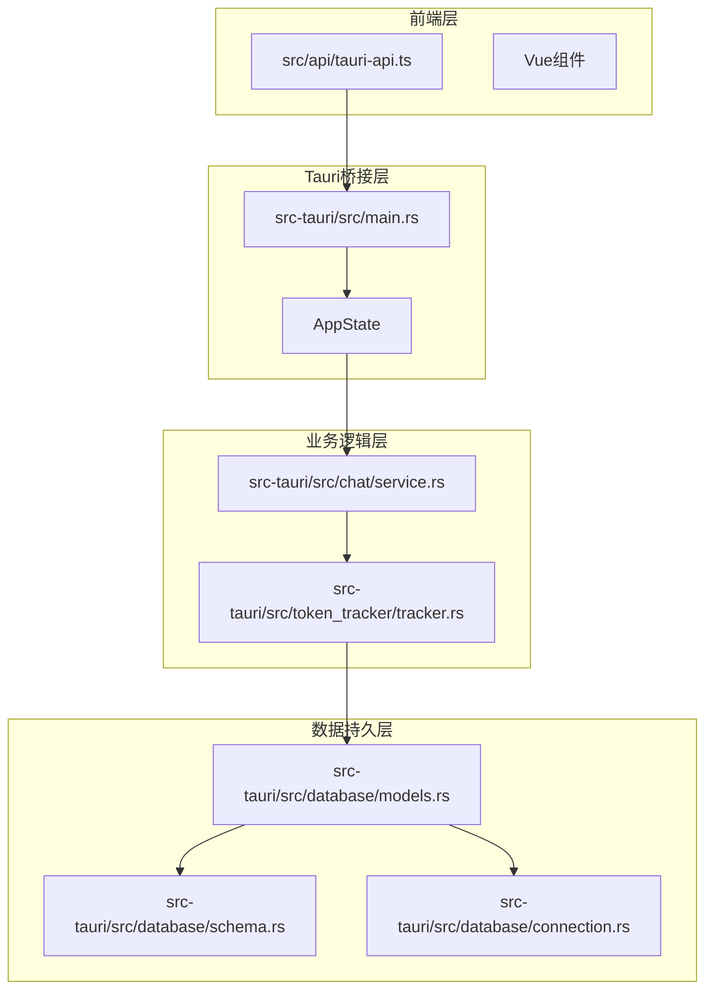
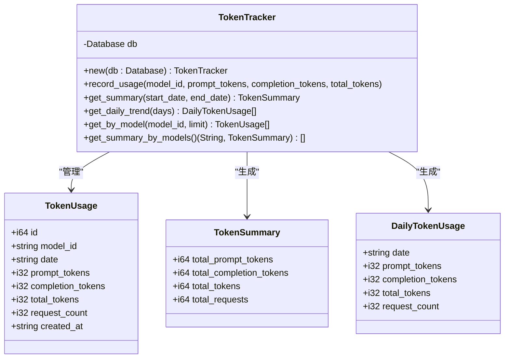
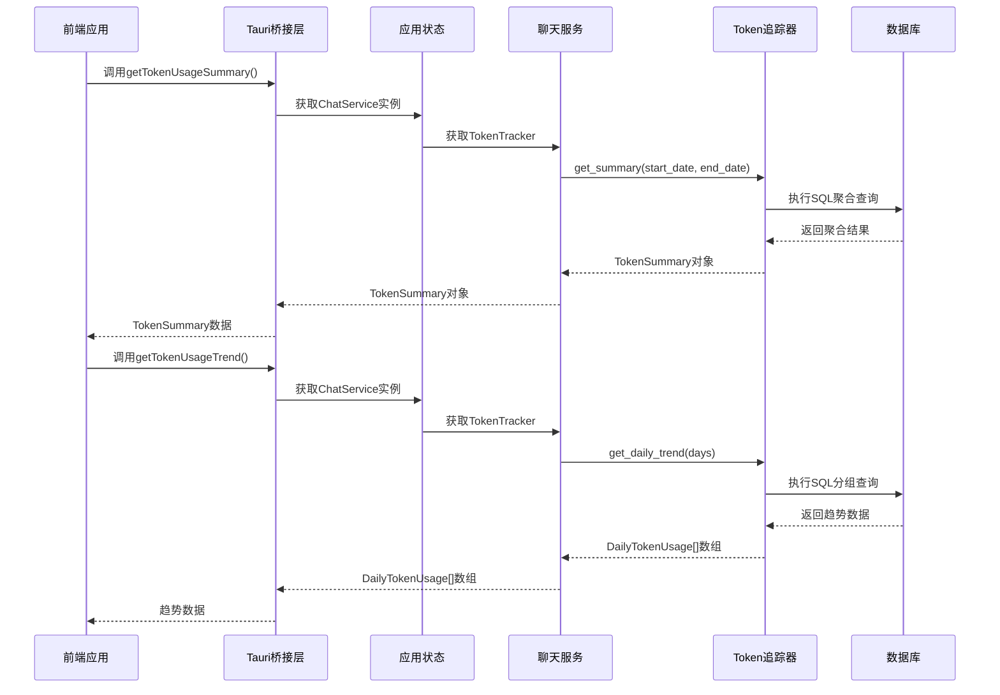
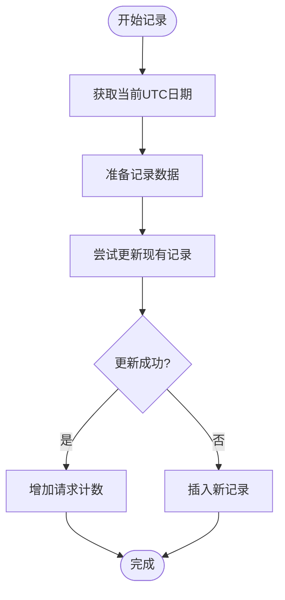
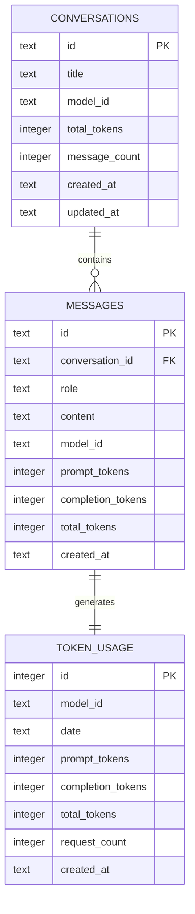
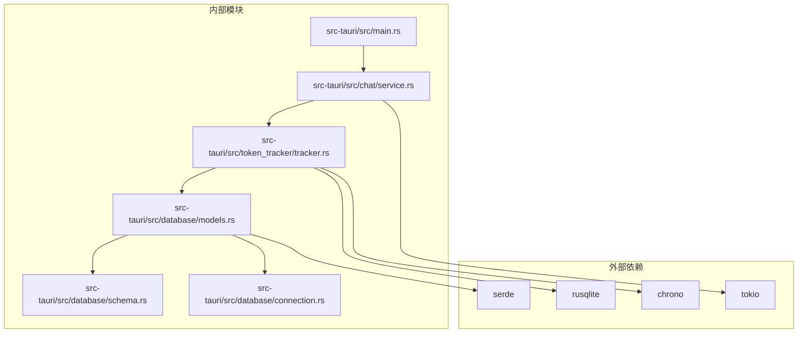

# Token统计命令

<cite>
**本文档引用的文件**
- [src-tauri/src/main.rs](file://src-tauri/src/main.rs)
- [src-tauri/src/chat/service.rs](file://src-tauri/src/chat/service.rs)
- [src-tauri/src/token_tracker/tracker.rs](file://src-tauri/src/token_tracker/tracker.rs)
- [src-tauri/src/database/models.rs](file://src-tauri/src/database/models.rs)
- [src-tauri/src/database/schema.rs](file://src-tauri/src/database/schema.rs)
- [src-tauri/src/database/connection.rs](file://src-tauri/src/database/connection.rs)
- [src/api/tauri-api.ts](file://src/api/tauri-api.ts)
</cite>

## 目录
1. [简介](#简介)
2. [项目结构](#项目结构)
3. [核心组件](#核心组件)
4. [架构概览](#架构概览)
5. [详细组件分析](#详细组件分析)
6. [依赖关系分析](#依赖关系分析)
7. [性能考虑](#性能考虑)
8. [故障排除指南](#故障排除指南)
9. [结论](#结论)

## 简介

Malou Agent的Token统计命令提供了完整的AI模型Token使用监控功能。该系统通过分布式架构实现了前后端分离的统计分析能力，包括实时Token使用追踪、历史数据聚合分析和可视化展示。

系统的核心功能围绕两个主要命令展开：
- `get_token_usage_summary`: 获取Token使用汇总统计
- `get_token_usage_trend`: 获取Token使用趋势分析

这些命令为开发者和用户提供了一个全面的Token使用监控解决方案，支持时间范围筛选、模型对比分析和趋势预测等功能。

## 项目结构

Malou Agent采用模块化架构设计，Token统计功能分布在多个层次中：



**图表来源**
- [src-tauri/src/main.rs](file://src-tauri/src/main.rs#L1-L321)
- [src-tauri/src/chat/service.rs](file://src-tauri/src/chat/service.rs#L1-L224)
- [src-tauri/src/token_tracker/tracker.rs](file://src-tauri/src/token_tracker/tracker.rs#L1-L195)

**章节来源**
- [src-tauri/src/main.rs](file://src-tauri/src/main.rs#L1-L321)
- [src-tauri/src/chat/service.rs](file://src-tauri/src/chat/service.rs#L1-L224)
- [src-tauri/src/token_tracker/tracker.rs](file://src-tauri/src/token_tracker/tracker.rs#L1-L195)

## 核心组件

### 数据模型定义

系统定义了三个核心数据模型来支撑Token统计功能：



**图表来源**
- [src-tauri/src/database/models.rs](file://src-tauri/src/database/models.rs#L48-L78)
- [src-tauri/src/token_tracker/tracker.rs](file://src-tauri/src/token_tracker/tracker.rs#L4-L195)

### 命令接口定义

系统提供了完整的TypeScript接口定义，确保前后端数据交互的一致性：

**章节来源**
- [src/api/tauri-api.ts](file://src/api/tauri-api.ts#L44-L57)

## 架构概览

Malou Agent的Token统计系统采用了分层架构设计，实现了清晰的关注点分离：



**图表来源**
- [src-tauri/src/main.rs](file://src-tauri/src/main.rs#L165-L186)
- [src-tauri/src/chat/service.rs](file://src-tauri/src/chat/service.rs#L220-L222)
- [src-tauri/src/token_tracker/tracker.rs](file://src-tauri/src/token_tracker/tracker.rs#L51-L168)

## 详细组件分析

### Token追踪器实现

Token追踪器是整个统计系统的核心组件，负责处理所有Token使用数据的记录、查询和聚合操作。

#### 核心功能特性

1. **智能数据合并**: 支持同一天内多次请求的自动合并，避免重复记录
2. **灵活的时间范围查询**: 支持精确日期范围、开始日期或结束日期查询
3. **多维度聚合分析**: 提供总览、按模型、按日期等多种聚合视图
4. **高效的数据存储**: 使用SQLite数据库进行本地持久化存储

#### 数据记录流程



**图表来源**
- [src-tauri/src/token_tracker/tracker.rs](file://src-tauri/src/token_tracker/tracker.rs#L15-L48)

#### 聚合查询实现

系统实现了三种主要的聚合查询模式：

1. **总体汇总查询**: 计算指定时间范围内的所有Token使用统计
2. **每日趋势查询**: 按日期分组统计Token使用情况
3. **模型对比查询**: 按模型ID分组统计不同模型的使用情况

**章节来源**
- [src-tauri/src/token_tracker/tracker.rs](file://src-tauri/src/token_tracker/tracker.rs#L51-L194)

### 前端API接口

前端提供了简洁易用的TypeScript接口，封装了所有Token统计相关的API调用。

#### 接口定义

```typescript
// Token使用汇总查询
export async function getTokenUsageSummary(
  startDate?: string, 
  endDate?: string
): Promise<TokenSummary>

// Token使用趋势查询  
export async function getTokenUsageTrend(
  days?: number
): Promise<DailyTokenUsage[]>
```

#### 类型定义

```typescript
interface TokenSummary {
  total_prompt_tokens: number;
  total_completion_tokens: number; 
  total_tokens: number;
  total_requests: number;
}

interface DailyTokenUsage {
  date: string;
  prompt_tokens: number;
  completion_tokens: number;
  total_tokens: number;
  request_count: number;
}
```

**章节来源**
- [src/api/tauri-api.ts](file://src/api/tauri-api.ts#L139-L151)
- [src/api/tauri-api.ts](file://src/api/tauri-api.ts#L44-L57)

### 数据库架构设计

系统采用SQLite作为数据存储引擎，设计了专门的表结构来支持Token统计功能。

#### 表结构设计



**图表来源**
- [src-tauri/src/database/schema.rs](file://src-tauri/src/database/schema.rs#L34-L44)

**章节来源**
- [src-tauri/src/database/schema.rs](file://src-tauri/src/database/schema.rs#L1-L68)

## 依赖关系分析

### 组件依赖图



**图表来源**
- [src-tauri/src/main.rs](file://src-tauri/src/main.rs#L1-L12)
- [src-tauri/src/token_tracker/tracker.rs](file://src-tauri/src/token_tracker/tracker.rs#L1-L2)

### 数据流依赖

系统的数据流向体现了清晰的职责分离：

1. **写入路径**: ChatService → TokenTracker → Database
2. **读取路径**: Frontend API → Tauri Commands → ChatService → TokenTracker → Database

**章节来源**
- [src-tauri/src/chat/service.rs](file://src-tauri/src/chat/service.rs#L160-L165)
- [src-tauri/src/main.rs](file://src-tauri/src/main.rs#L165-L186)

## 性能考虑

### 查询优化策略

1. **索引优化**: 为token_usage表建立了复合索引`(model_id, date)`，支持高效的范围查询
2. **聚合优化**: 使用SQL内置聚合函数减少数据传输量
3. **缓存策略**: 对频繁查询的结果进行内存缓存
4. **批量操作**: 支持批量数据插入和更新操作

### 内存管理

系统采用了安全的内存管理模式：
- 使用`Arc<Mutex<Connection>>`确保线程安全
- 实现手动`Send`和`Sync`特征
- 提供同步和异步两种执行模式

## 故障排除指南

### 常见问题及解决方案

1. **数据库连接失败**
   - 检查数据库文件权限
   - 验证数据库路径是否存在
   - 确认SQLite扩展已正确安装

2. **查询结果为空**
   - 验证时间范围参数是否正确
   - 检查是否有Token使用数据
   - 确认模型ID是否匹配

3. **性能问题**
   - 优化时间范围查询
   - 考虑添加适当的索引
   - 减少查询频率

**章节来源**
- [src-tauri/src/database/connection.rs](file://src-tauri/src/database/connection.rs#L16-L88)

## 结论

Malou Agent的Token统计命令系统展现了现代桌面应用开发的最佳实践。通过合理的架构设计、清晰的职责分离和完善的错误处理机制，系统为用户提供了强大而易用的Token使用监控功能。

系统的主要优势包括：
- **模块化设计**: 各组件职责明确，易于维护和扩展
- **性能优化**: 采用多种优化策略确保高效运行
- **数据完整性**: 通过事务和约束保证数据一致性
- **用户体验**: 提供直观的API接口和丰富的查询选项

未来可以考虑的功能增强：
- 添加更详细的统计指标
- 实现数据导出功能
- 增加可视化图表展示
- 支持远程数据同步