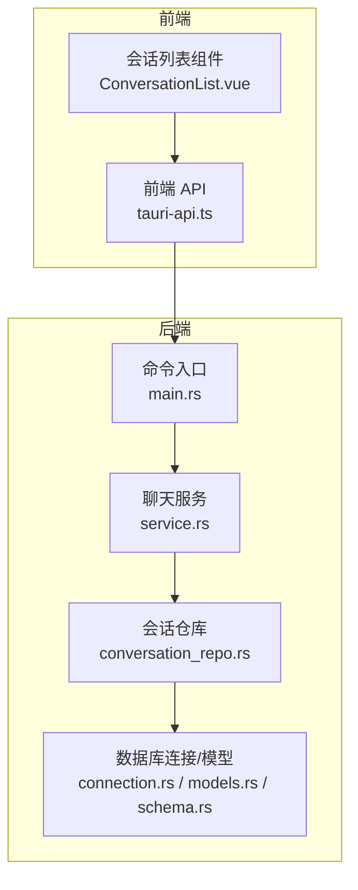
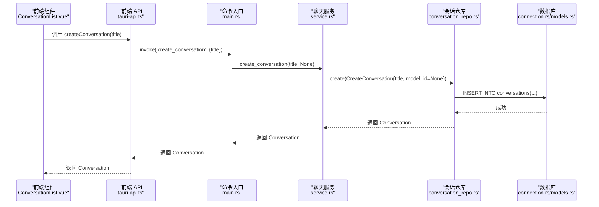
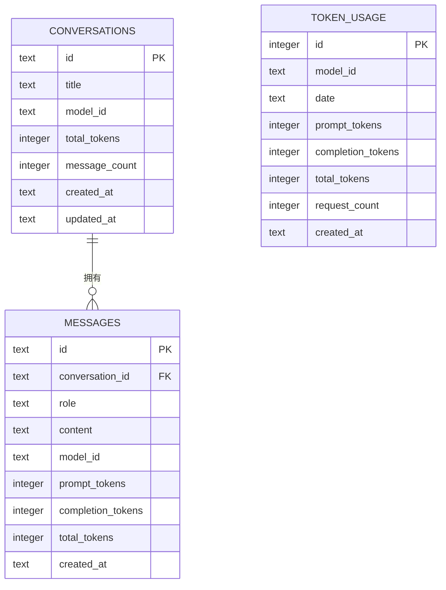
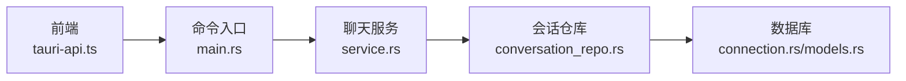

# 会话管理命令

<cite>
**本文引用的文件**
- [main.rs](file://src-tauri/src/main.rs)
- [conversation_repo.rs](file://src-tauri/src/chat/conversation_repo.rs)
- [service.rs](file://src-tauri/src/chat/service.rs)
- [models.rs](file://src-tauri/src/database/models.rs)
- [schema.rs](file://src-tauri/src/database/schema.rs)
- [connection.rs](file://src-tauri/src/database/connection.rs)
- [tauri-api.ts](file://src/api/tauri-api.ts)
- [ConversationList.vue](file://src/components/business/ConversationList.vue)
</cite>

## 目录
1. [简介](#简介)
2. [项目结构](#项目结构)
3. [核心组件](#核心组件)
4. [架构总览](#架构总览)
5. [详细组件分析](#详细组件分析)
6. [依赖关系分析](#依赖关系分析)
7. [性能考量](#性能考量)
8. [故障排查指南](#故障排查指南)
9. [结论](#结论)
10. [附录](#附录)

## 简介
本文件面向 Malou Agent 的“会话管理命令”，系统性地梳理并说明以下五个命令的实现与使用：
- create_conversation：创建新会话
- list_conversations：获取会话列表
- get_conversation：获取单个会话
- update_conversation_title：更新会话标题
- delete_conversation：删除会话

内容涵盖：
- TypeScript 接口定义与参数说明
- Rust 后端命令实现与错误处理
- 会话数据模型与数据库操作流程
- 异步处理细节与并发安全
- 前端调用示例与最佳实践

## 项目结构
围绕会话管理的关键文件组织如下：
- 后端（Rust/Tauri）
  - 命令入口与状态管理：src-tauri/src/main.rs
  - 会话服务与仓库：src-tauri/src/chat/service.rs、src-tauri/src/chat/conversation_repo.rs
  - 数据模型与数据库：src-tauri/src/database/models.rs、src-tauri/src/database/schema.rs、src-tauri/src/database/connection.rs
- 前端（TypeScript/Vue）
  - API 封装：src/api/tauri-api.ts
  - UI 组件调用：src/components/business/ConversationList.vue

图表来源
- [main.rs](file://src-tauri/src/main.rs#L71-L116)
- [service.rs](file://src-tauri/src/chat/service.rs#L37-L70)
- [conversation_repo.rs](file://src-tauri/src/chat/conversation_repo.rs#L14-L160)
- [connection.rs](file://src-tauri/src/database/connection.rs#L8-L58)
- [models.rs](file://src-tauri/src/database/models.rs#L3-L13)
- [schema.rs](file://src-tauri/src/database/schema.rs#L2-L62)
- [tauri-api.ts](file://src/api/tauri-api.ts#L66-L101)
- [ConversationList.vue](file://src/components/business/ConversationList.vue#L53-L147)

章节来源
- [main.rs](file://src-tauri/src/main.rs#L71-L116)
- [tauri-api.ts](file://src/api/tauri-api.ts#L66-L101)
- [ConversationList.vue](file://src/components/business/ConversationList.vue#L53-L147)

## 核心组件
- 命令入口（main.rs）
  - 提供 create_conversation、list_conversations、get_conversation、update_conversation_title、delete_conversation 五个命令
  - 通过 tauri::State 获取全局状态 AppState，进而调用 ChatService
- 聊天服务（service.rs）
  - 封装会话 CRUD 与统计更新逻辑
  - 调用 ConversationRepo 执行数据库操作
- 会话仓库（conversation_repo.rs）
  - 实现 create/list/get/update_title/delete/count 等数据库操作
  - 使用 Database.execute 执行事务性 SQL
- 数据模型与数据库（models.rs、schema.rs、connection.rs）
  - Conversation/Message/CreateConversation 等模型
  - conversations 表结构与索引
  - 数据库初始化、WAL 模式、外键约束

章节来源
- [main.rs](file://src-tauri/src/main.rs#L71-L116)
- [service.rs](file://src-tauri/src/chat/service.rs#L37-L70)
- [conversation_repo.rs](file://src-tauri/src/chat/conversation_repo.rs#L14-L160)
- [models.rs](file://src-tauri/src/database/models.rs#L3-L13)
- [schema.rs](file://src-tauri/src/database/schema.rs#L2-L62)
- [connection.rs](file://src-tauri/src/database/connection.rs#L8-L58)

## 架构总览
下面的序列图展示了从前端到后端的典型调用链路（以创建会话为例）：

图表来源
- [ConversationList.vue](file://src/components/business/ConversationList.vue#L66-L79)
- [tauri-api.ts](file://src/api/tauri-api.ts#L68-L73)
- [main.rs](file://src-tauri/src/main.rs#L71-L78)
- [service.rs](file://src-tauri/src/chat/service.rs#L37-L42)
- [conversation_repo.rs](file://src-tauri/src/chat/conversation_repo.rs#L14-L37)
- [connection.rs](file://src-tauri/src/database/connection.rs#L50-L57)
- [models.rs](file://src-tauri/src/database/models.rs#L3-L13)

## 详细组件分析

### TypeScript 接口与前端调用
- 会话数据模型（Conversation）
  - 字段：id、title、model_id、total_tokens、message_count、created_at、updated_at
  - 类型：字符串（id、model_id 可为空）、数字（tokens、count）、字符串（时间戳）
- 前端 API 函数
  - createConversation(title: string): Promise<Conversation>
  - listConversations(limit?: number, offset?: number): Promise<Conversation[]>
  - getConversation(id: string): Promise<Conversation | null>
  - updateConversationTitle(id: string, title: string): Promise<void>
  - deleteConversation(id: string): Promise<boolean>
- 前端调用示例（基于组件）
  - 创建会话：在 ConversationList.vue 中，点击新建按钮触发 createConversation 并更新本地列表
  - 列表加载：首次挂载或刷新时调用 listConversations(50, 0)
  - 编辑标题：双击标题进入编辑模式，调用 updateConversationTitle 并更新视图
  - 删除会话：弹出确认框后调用 deleteConversation，并从列表移除

章节来源
- [tauri-api.ts](file://src/api/tauri-api.ts#L6-L14)
- [tauri-api.ts](file://src/api/tauri-api.ts#L68-L101)
- [ConversationList.vue](file://src/components/business/ConversationList.vue#L53-L147)

### Rust 命令与服务实现
- 命令入口（main.rs）
  - create_conversation(title, state)：转发至 ChatService.create_conversation
  - list_conversations(limit, offset, state)：转发至 ChatService.list_conversations
  - get_conversation(id, state)：转发至 ChatService.get_conversation
  - update_conversation_title(id, title, state)：转发至 ChatService.update_conversation_title
  - delete_conversation(id, state)：转发至 ChatService.delete_conversation
- 聊天服务（service.rs）
  - create_conversation：调用 ConversationRepo.create，返回 Conversation
  - list_conversations：调用 ConversationRepo.list，返回列表
  - get_conversation：调用 ConversationRepo.get，返回可选值
  - update_conversation_title：调用 ConversationRepo.update_title
  - delete_conversation：调用 ConversationRepo.delete，返回布尔值
- 会话仓库（conversation_repo.rs）
  - create：生成 UUID、写入当前时间、插入 conversations 表，返回新会话对象
  - list：按 updated_at 降序分页查询
  - get：按 id 查询单条会话
  - update_title：更新 title 与 updated_at
  - delete：删除会话（注意：消息表由外键级联删除）
  - count：统计会话总数
- 数据库与模型（models.rs、schema.rs、connection.rs）
  - conversations 表：主键 id，字段包含 title、model_id、统计字段与时间戳
  - 索引：按 updated_at 降序索引，提升列表查询性能
  - 初始化：PRAGMA foreign_keys=ON；WAL 模式；自动建表

章节来源
- [main.rs](file://src-tauri/src/main.rs#L71-L116)
- [service.rs](file://src-tauri/src/chat/service.rs#L37-L70)
- [conversation_repo.rs](file://src-tauri/src/chat/conversation_repo.rs#L14-L160)
- [models.rs](file://src-tauri/src/database/models.rs#L3-L13)
- [schema.rs](file://src-tauri/src/database/schema.rs#L2-L62)
- [connection.rs](file://src-tauri/src/database/connection.rs#L8-L58)

### 错误处理机制
- 命令层（main.rs）
  - ChatService 方法返回 Result，内部错误统一转换为字符串错误
  - invoke 返回 Result，前端捕获错误并提示
- 服务层（service.rs）
  - 所有数据库操作均包裹 map_err，将底层错误转为可读字符串
- 仓库层（conversation_repo.rs）
  - 所有 rusqlite 操作返回 SqliteResult，最终转换为 Result
- 前端（tauri-api.ts + ConversationList.vue）
  - invoke 返回 Promise，catch 捕获异常并显示错误消息
  - 对删除等危险操作使用 ElMessageBox 确认

章节来源
- [main.rs](file://src-tauri/src/main.rs#L71-L116)
- [service.rs](file://src-tauri/src/chat/service.rs#L37-L70)
- [conversation_repo.rs](file://src-tauri/src/chat/conversation_repo.rs#L14-L160)
- [tauri-api.ts](file://src/api/tauri-api.ts#L68-L101)
- [ConversationList.vue](file://src/components/business/ConversationList.vue#L57-L78)

### 数据模型与数据库流程
- 会话模型（models.rs）
  - Conversation：会话实体
  - CreateConversation：创建请求体
- 表结构（schema.rs）
  - conversations：id 主键、title、model_id、统计字段、时间戳
  - 索引：idx_conversations_updated
- 初始化与连接（connection.rs）
  - PRAGMA foreign_keys=ON；WAL 模式；自动建表
  - Database.execute 提供互斥访问与执行闭包

图表来源
- [models.rs](file://src-tauri/src/database/models.rs#L3-L34)
- [schema.rs](file://src-tauri/src/database/schema.rs#L2-L62)

章节来源
- [models.rs](file://src-tauri/src/database/models.rs#L3-L34)
- [schema.rs](file://src-tauri/src/database/schema.rs#L2-L62)
- [connection.rs](file://src-tauri/src/database/connection.rs#L8-L58)

### 异步处理与并发安全
- 命令函数为同步函数，但通过 ChatService 内部持有 Arc<RwLock<OpenAIClient>> 支持并发读写
- 数据库访问通过 Database.execute 在互斥锁内执行，避免并发冲突
- 前端调用 invoke 为异步 Promise，配合 Element Plus 的消息提示与加载状态

章节来源
- [service.rs](file://src-tauri/src/chat/service.rs#L12-L29)
- [connection.rs](file://src-tauri/src/database/connection.rs#L50-L57)
- [tauri-api.ts](file://src/api/tauri-api.ts#L68-L101)
- [ConversationList.vue](file://src/components/business/ConversationList.vue#L53-L64)

## 依赖关系分析
- 前端依赖
  - tauri-api.ts 依赖 @tauri-apps/api/core 的 invoke
  - ConversationList.vue 依赖 tauri-api.ts 的会话 API
- 后端依赖
  - main.rs 依赖 chat::ChatService
  - service.rs 依赖 database::Conversation/Message/Database
  - conversation_repo.rs 依赖 database::Database/Conversation/CreateConversation
  - database 层依赖 rusqlite、uuid、chrono、dirs

图表来源
- [tauri-api.ts](file://src/api/tauri-api.ts#L1)
- [main.rs](file://src-tauri/src/main.rs#L1-L14)
- [service.rs](file://src-tauri/src/chat/service.rs#L1-L18)
- [conversation_repo.rs](file://src-tauri/src/chat/conversation_repo.rs#L1-L2)
- [connection.rs](file://src-tauri/src/database/connection.rs#L1-L5)

章节来源
- [tauri-api.ts](file://src/api/tauri-api.ts#L1)
- [main.rs](file://src-tauri/src/main.rs#L1-L14)
- [service.rs](file://src-tauri/src/chat/service.rs#L1-L18)
- [conversation_repo.rs](file://src-tauri/src/chat/conversation_repo.rs#L1-L2)
- [connection.rs](file://src-tauri/src/database/connection.rs#L1-L5)

## 性能考量
- 列表查询
  - conversations 表按 updated_at 降序索引，list_conversations 支持 limit/offset 分页
- 数据库模式
  - WAL 模式提升并发读写性能
  - 外键约束确保数据一致性
- 建议
  - 前端分页参数建议固定合理上限（如 50），避免一次性加载过多
  - 频繁更新标题仅触发一次 UPDATE，开销较小

章节来源
- [schema.rs](file://src-tauri/src/database/schema.rs#L14-L15)
- [connection.rs](file://src-tauri/src/database/connection.rs#L22-L27)
- [conversation_repo.rs](file://src-tauri/src/chat/conversation_repo.rs#L40-L63)

## 故障排查指南
- 前端错误
  - 调用失败：检查 invoke 是否抛错，查看控制台错误与 Element Plus 提示
  - 删除确认：确认 ElMessageBox 的返回值，避免误删
- 后端错误
  - create_conversation：检查 CreateConversation 参数与数据库连接
  - list_conversations：确认 limit/offset 合法范围
  - update_conversation_title：确认 id 存在且非空
  - delete_conversation：确认会话存在，消息表由外键级联删除
- 数据库问题
  - 外键约束：确保 conversations 存在后再插入消息
  - WAL 模式：避免多进程同时写入导致锁竞争

章节来源
- [tauri-api.ts](file://src/api/tauri-api.ts#L68-L101)
- [ConversationList.vue](file://src/components/business/ConversationList.vue#L57-L78)
- [main.rs](file://src-tauri/src/main.rs#L71-L116)
- [service.rs](file://src-tauri/src/chat/service.rs#L37-L70)
- [conversation_repo.rs](file://src-tauri/src/chat/conversation_repo.rs#L146-L152)
- [connection.rs](file://src-tauri/src/database/connection.rs#L22-L27)

## 结论
Malou Agent 的会话管理命令通过清晰的分层设计实现了稳定的 CRUD 能力：
- 前端以 invoke 为核心，封装了易用的 TypeScript 接口
- 后端以 ChatService 为中心，ConversationRepo 负责具体数据库操作
- 数据库采用 WAL 模式与外键约束，兼顾性能与一致性
- 错误处理贯穿前后端，保障用户体验与系统稳定性

## 附录

### 命令完整接口定义与使用说明

- create_conversation
  - TypeScript 接口
    - 输入：title: string
    - 返回：Promise<Conversation>
    - 示例：await createConversation("我的新会话")
  - Rust 命令
    - 参数：title: String, state: State<AppState>
    - 返回：Result<Conversation, String>
    - 实现：转发至 ChatService.create_conversation
  - 数据库流程
    - 生成 UUID 与时间戳，插入 conversations 表
  - 错误处理
    - 数据库异常统一转换为字符串错误
  - 前端示例
    - ConversationList.vue 中新建按钮触发，成功后加入列表并选中

- list_conversations
  - TypeScript 接口
    - 输入：limit?: number, offset?: number
    - 返回：Promise<Conversation[]>
    - 示例：await listConversations(50, 0)
  - Rust 命令
    - 参数：limit: Option<i32>, offset: Option<i32>, state: State<AppState>
    - 返回：Result<Vec<Conversation>, String>
    - 实现：转发至 ChatService.list_conversations
  - 数据库流程
    - 按 updated_at 降序分页查询
  - 错误处理
    - 数据库异常统一转换为字符串错误
  - 前端示例
    - 首次挂载与刷新时调用，设置加载状态

- get_conversation
  - TypeScript 接口
    - 输入：id: string
    - 返回：Promise<Conversation | null>
    - 示例：await getConversation("会话ID")
  - Rust 命令
    - 参数：id: String, state: State<AppState>
    - 返回：Result<Option<Conversation>, String>
    - 实现：转发至 ChatService.get_conversation
  - 数据库流程
    - 按 id 查询单条会话
  - 错误处理
    - 数据库异常统一转换为字符串错误

- update_conversation_title
  - TypeScript 接口
    - 输入：id: string, title: string
    - 返回：Promise<void>
    - 示例：await updateConversationTitle("会话ID", "新标题")
  - Rust 命令
    - 参数：id: String, title: String, state: State<AppState>
    - 返回：Result<(), String>
    - 实现：转发至 ChatService.update_conversation_title
  - 数据库流程
    - 更新 title 与 updated_at
  - 错误处理
    - 数据库异常统一转换为字符串错误
  - 前端示例
    - 双击标题进入编辑模式，失焦或回车保存

- delete_conversation
  - TypeScript 接口
    - 输入：id: string
    - 返回：Promise<boolean>
    - 示例：await deleteConversation("会话ID")
  - Rust 命令
    - 参数：id: String, state: State<AppState>
    - 返回：Result<bool, String>
    - 实现：转发至 ChatService.delete_conversation
  - 数据库流程
    - 删除会话；消息表由外键级联删除
  - 错误处理
    - 数据库异常统一转换为字符串错误
  - 前端示例
    - 删除确认对话框，成功后从列表移除并可能切换到其他会话

章节来源
- [tauri-api.ts](file://src/api/tauri-api.ts#L68-L101)
- [main.rs](file://src-tauri/src/main.rs#L71-L116)
- [service.rs](file://src-tauri/src/chat/service.rs#L37-L70)
- [conversation_repo.rs](file://src-tauri/src/chat/conversation_repo.rs#L14-L160)
- [ConversationList.vue](file://src/components/business/ConversationList.vue#L66-L147)