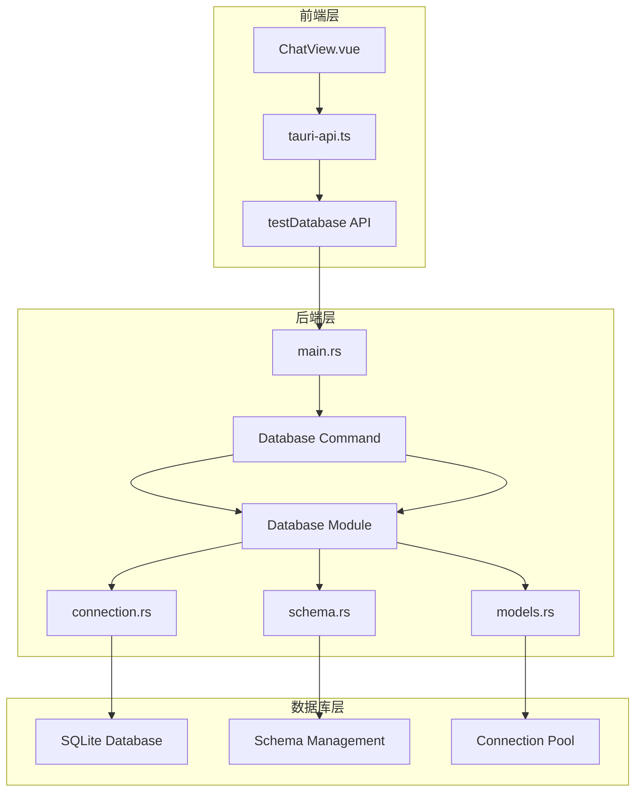
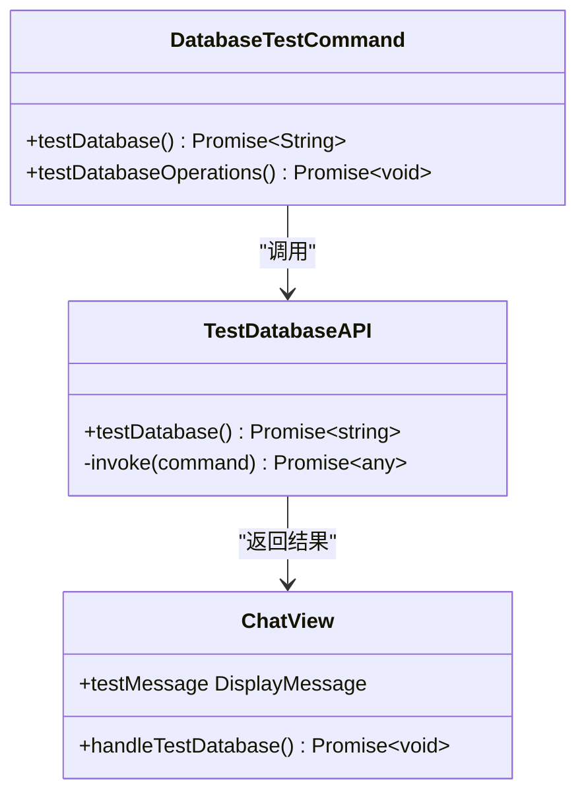
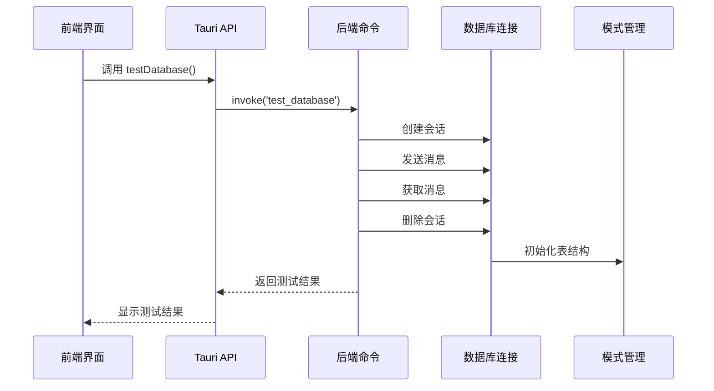
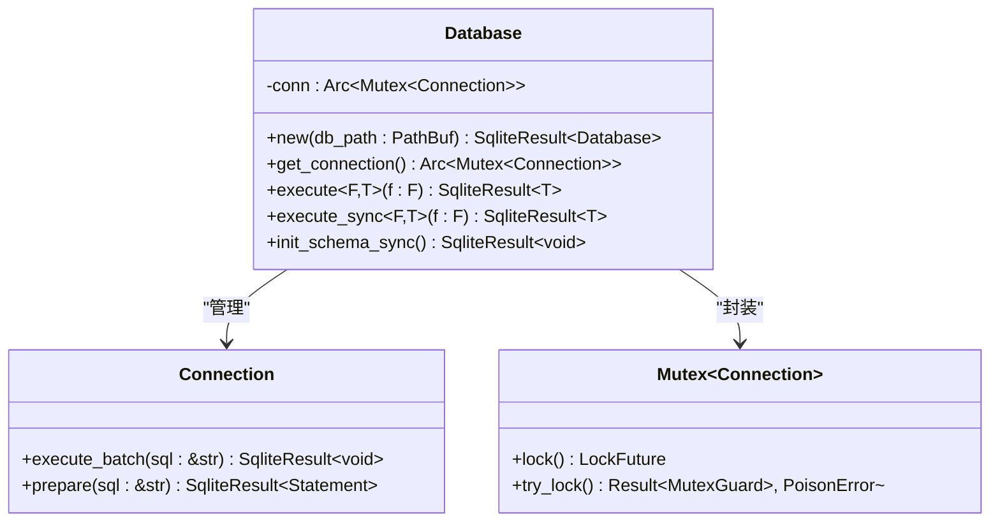
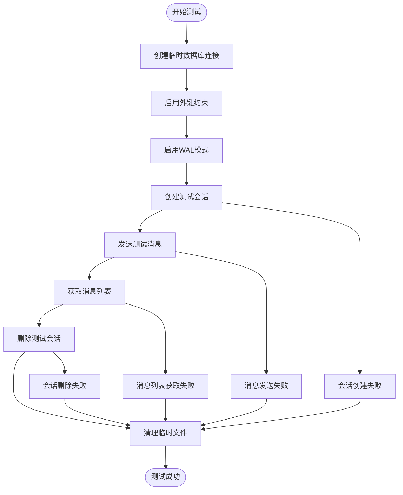
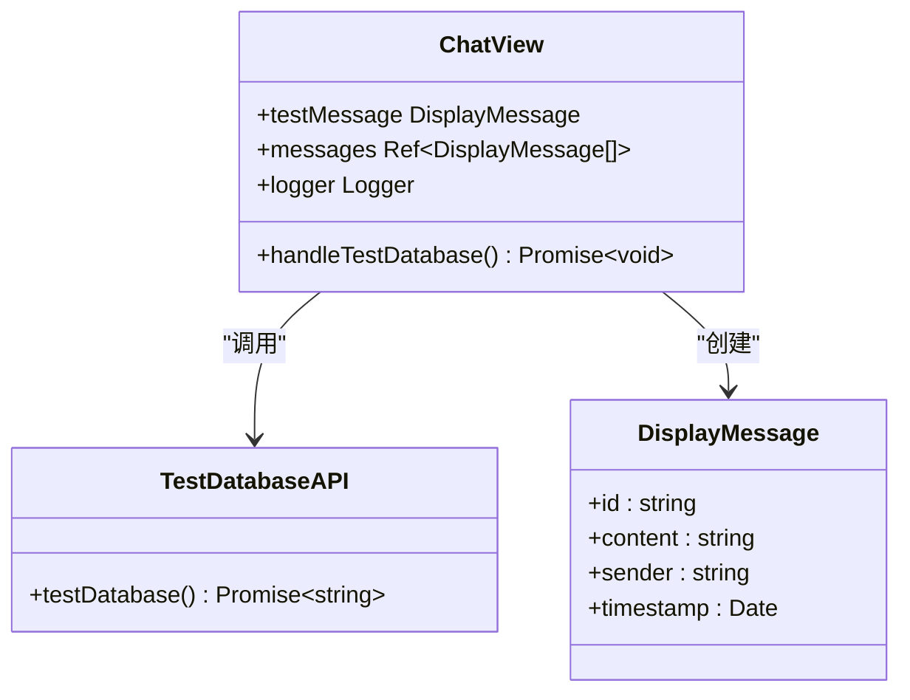
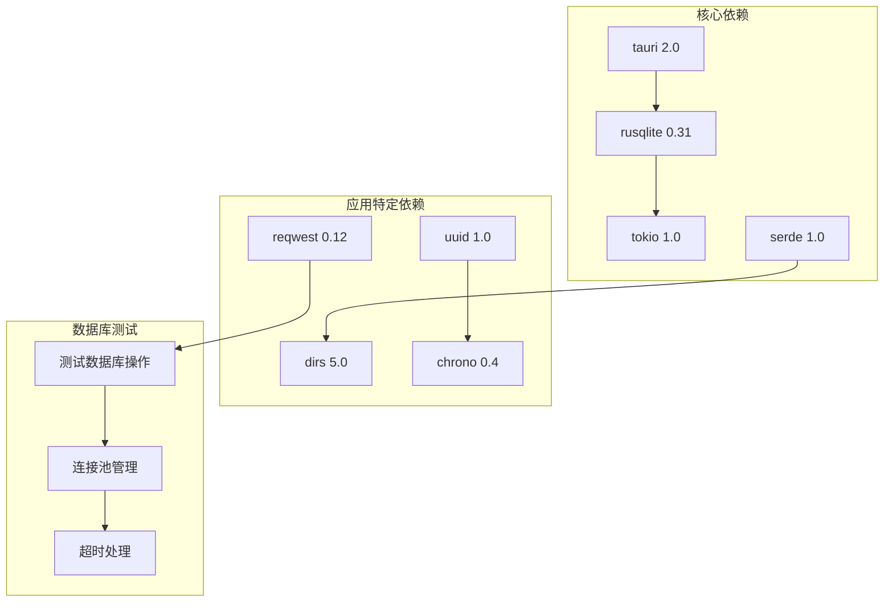
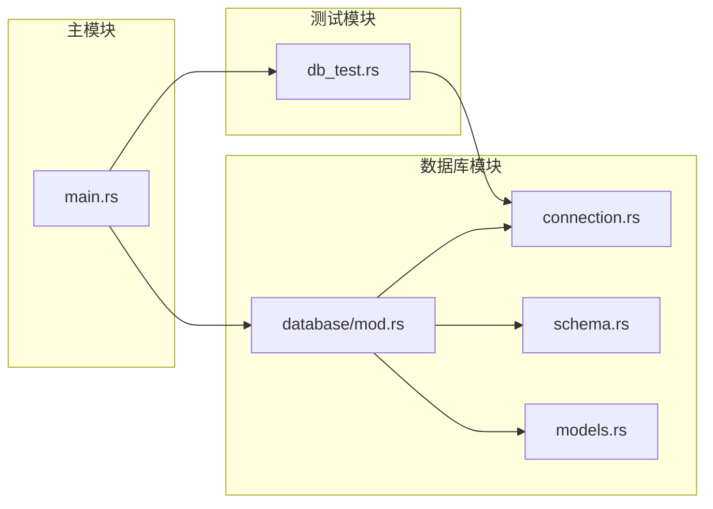
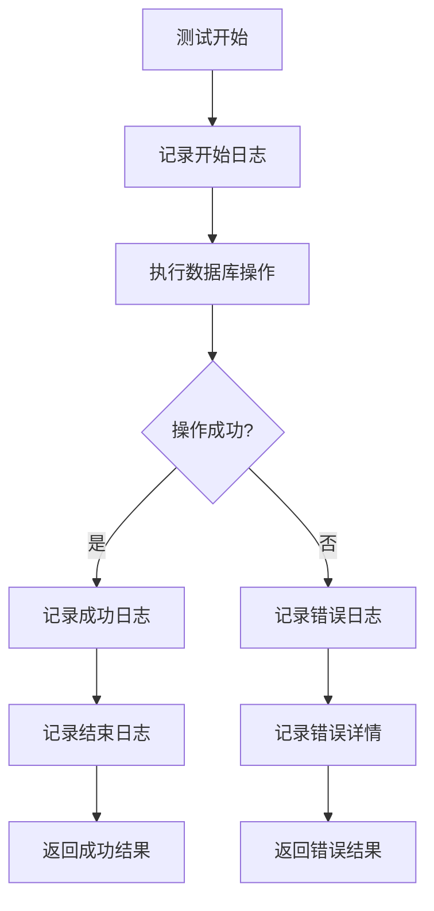

# 数据库测试命令

<cite>
**本文档引用的文件**
- [src-tauri/src/db_test.rs](file://src-tauri/src/db_test.rs)
- [src-tauri/src/main.rs](file://src-tauri/src/main.rs)
- [src-tauri/src/database/connection.rs](file://src-tauri/src/database/connection.rs)
- [src-tauri/src/database/mod.rs](file://src-tauri/src/database/mod.rs)
- [src-tauri/src/database/models.rs](file://src-tauri/src/database/models.rs)
- [src-tauri/src/database/schema.rs](file://src-tauri/src/database/schema.rs)
- [src/api/tauri-api.ts](file://src/api/tauri-api.ts)
- [src/components/business/ChatView.vue](file://src/components/business/ChatView.vue)
- [src/utils/config-test.ts](file://src/utils/config-test.ts)
- [src-tauri/Cargo.toml](file://src-tauri/Cargo.toml)
</cite>

## 目录
1. [简介](#简介)
2. [项目结构](#项目结构)
3. [核心组件](#核心组件)
4. [架构概览](#架构概览)
5. [详细组件分析](#详细组件分析)
6. [依赖关系分析](#依赖关系分析)
7. [性能考虑](#性能考虑)
8. [故障排除指南](#故障排除指南)
9. [结论](#结论)

## 简介

Malou Agent 的数据库测试命令是一个关键的功能模块，用于验证应用程序与 SQLite 数据库的连接状态和基本操作能力。该命令不仅检查数据库连接是否正常，还验证了完整的 CRUD（创建、读取、更新、删除）操作流程，确保数据库系统的完整性和可靠性。

本文档将详细介绍数据库测试命令的实现原理、使用方法、TypeScript 接口定义、参数说明、返回值类型、连接状态检查机制，以及前端连接状态显示和后端数据库健康检查的实现细节。

## 项目结构

Malou Agent 采用前后端分离的架构设计，数据库测试功能分布在多个层次中：



**图表来源**
- [src-tauri/src/main.rs](file://src-tauri/src/main.rs#L217-L238)
- [src-tauri/src/database/mod.rs](file://src-tauri/src/database/mod.rs#L1-L7)

**章节来源**
- [src-tauri/src/main.rs](file://src-tauri/src/main.rs#L1-L321)
- [src-tauri/src/database/mod.rs](file://src-tauri/src/database/mod.rs#L1-L7)

## 核心组件

### 数据库测试命令实现

数据库测试命令的核心实现位于 Rust 后端，通过 Tauri 命令系统暴露给前端使用。该命令执行完整的数据库操作流程，包括会话创建、消息发送、消息获取和会话删除。

### TypeScript 接口定义

前端通过 TypeScript 接口定义与后端进行类型安全的通信：



**图表来源**
- [src-tauri/src/main.rs](file://src-tauri/src/main.rs#L217-L238)
- [src/api/tauri-api.ts](file://src/api/tauri-api.ts#L169-L176)
- [src/components/business/ChatView.vue](file://src/components/business/ChatView.vue#L224-L243)

**章节来源**
- [src-tauri/src/main.rs](file://src-tauri/src/main.rs#L217-L238)
- [src/api/tauri-api.ts](file://src/api/tauri-api.ts#L169-L176)
- [src/components/business/ChatView.vue](file://src/components/business/ChatView.vue#L224-L243)

## 架构概览

### 数据库连接架构

Malou Agent 的数据库架构采用了现代化的设计模式，确保线程安全和高性能：

```mermaid
graph LR
subgraph "连接管理层"
A[Database Struct]
B[Mutex<Connection>]
C[Arc<Mutex<Connection>>]
end
subgraph "初始化流程"
D[new() Method]
E[enableForeignKeys]
F[enableWALMode]
G[createDirAll]
end
subgraph "执行流程"
H[execute() Async]
I[execute_sync() Sync]
J[init_schema_sync()]
end
A --> B
B --> C
D --> E
D --> F
D --> G
C --> H
C --> I
A --> J
```

**图表来源**
- [src-tauri/src/database/connection.rs](file://src-tauri/src/database/connection.rs#L8-L35)
- [src-tauri/src/database/connection.rs](file://src-tauri/src/database/connection.rs#L67-L88)

### 命令执行流程

数据库测试命令的完整执行流程如下：



**图表来源**
- [src-tauri/src/main.rs](file://src-tauri/src/main.rs#L217-L238)
- [src/api/tauri-api.ts](file://src/api/tauri-api.ts#L174-L176)

**章节来源**
- [src-tauri/src/main.rs](file://src-tauri/src/main.rs#L217-L238)
- [src-tauri/src/database/connection.rs](file://src-tauri/src/database/connection.rs#L37-L60)

## 详细组件分析

### 数据库连接管理器

数据库连接管理器是整个系统的核心组件，负责管理 SQLite 连接的生命周期和线程安全：

#### 核心数据结构



**图表来源**
- [src-tauri/src/database/connection.rs](file://src-tauri/src/database/connection.rs#L10-L12)
- [src-tauri/src/database/connection.rs](file://src-tauri/src/database/connection.rs#L67-L74)

#### 初始化流程

数据库连接的初始化过程包含多个关键步骤：

1. **目录创建**: 确保数据库文件所在目录存在
2. **连接建立**: 使用 rusqlite 建立 SQLite 连接
3. **外键约束**: 启用外键约束确保数据完整性
4. **WAL 模式**: 启用 Write-Ahead Logging 提高并发性能

**章节来源**
- [src-tauri/src/database/connection.rs](file://src-tauri/src/database/connection.rs#L14-L35)

### 数据库测试操作流程

数据库测试命令执行完整的 CRUD 操作流程：



**图表来源**
- [src-tauri/src/db_test.rs](file://src-tauri/src/db_test.rs#L5-L58)
- [src-tauri/src/main.rs](file://src-tauri/src/main.rs#L225-L235)

#### 测试操作详解

每个测试步骤都有明确的验证逻辑：

1. **会话创建测试**: 验证数据库能够正确创建新的对话记录
2. **消息发送测试**: 确认消息能够正确存储到数据库中
3. **消息获取测试**: 验证查询功能的正确性
4. **会话删除测试**: 确认级联删除功能正常工作

**章节来源**
- [src-tauri/src/db_test.rs](file://src-tauri/src/db_test.rs#L14-L51)

### 前端集成实现

前端通过 Vue 组件集成数据库测试功能：

#### ChatView 组件集成



**图表来源**
- [src/components/business/ChatView.vue](file://src/components/business/ChatView.vue#L224-L243)
- [src/api/tauri-api.ts](file://src/api/tauri-api.ts#L174-L176)

**章节来源**
- [src/components/business/ChatView.vue](file://src/components/business/ChatView.vue#L224-L243)
- [src/api/tauri-api.ts](file://src/api/tauri-api.ts#L169-L176)

## 依赖关系分析

### 外部依赖

Malou Agent 的数据库功能依赖于以下关键库：



**图表来源**
- [src-tauri/Cargo.toml](file://src-tauri/Cargo.toml#L12-L25)

### 内部模块依赖



**图表来源**
- [src-tauri/src/main.rs](file://src-tauri/src/main.rs#L1-L13)
- [src-tauri/src/database/mod.rs](file://src-tauri/src/database/mod.rs#L1-L7)

**章节来源**
- [src-tauri/Cargo.toml](file://src-tauri/Cargo.toml#L1-L25)
- [src-tauri/src/database/mod.rs](file://src-tauri/src/database/mod.rs#L1-L7)

## 性能考虑

### 连接池管理

虽然当前实现使用单个数据库连接，但架构设计支持未来的连接池扩展：

1. **线程安全性**: 使用 `Arc<Mutex<Connection>>` 确保多线程环境下的安全访问
2. **异步支持**: 提供 `execute()` 和 `execute_sync()` 两种执行模式
3. **WAL 模式**: 启用 Write-Ahead Logging 提高并发性能

### 性能优化策略

1. **预编译语句**: 在重复执行的查询中使用预编译语句
2. **批量操作**: 对于大量数据操作考虑使用事务
3. **索引优化**: 合理使用数据库索引提高查询性能
4. **连接复用**: 避免频繁创建和销毁数据库连接

## 故障排除指南

### 常见问题及解决方案

#### 数据库连接失败

**症状**: 调用 `test_database` 命令时抛出连接异常

**可能原因**:
1. 数据库文件权限不足
2. 数据库路径不存在
3. 外键约束冲突
4. WAL 模式初始化失败

**解决步骤**:
1. 检查数据库文件路径和权限
2. 确认应用程序具有写入权限
3. 验证数据库文件格式
4. 检查磁盘空间

#### 数据库操作超时

**症状**: 数据库操作在指定时间内未完成

**可能原因**:
1. 数据库锁竞争
2. 查询语句效率低下
3. 磁盘 I/O 性能问题
4. 内存不足

**解决步骤**:
1. 优化慢查询语句
2. 添加适当的索引
3. 考虑分页查询
4. 检查系统资源使用情况

#### 数据完整性错误

**症状**: 外键约束违反或数据不一致

**可能原因**:
1. 删除父记录导致子记录孤立
2. 数据类型不匹配
3. 空值约束违反
4. 唯一约束冲突

**解决步骤**:
1. 检查数据关系完整性
2. 验证输入数据格式
3. 实施适当的事务管理
4. 添加数据验证逻辑

### 调试工具和方法

#### 日志记录

系统提供了完善的日志记录机制：



**图表来源**
- [src/components/business/ChatView.vue](file://src/components/business/ChatView.vue#L227-L241)

#### 错误处理最佳实践

1. **具体错误信息**: 提供详细的错误描述帮助诊断
2. **回滚机制**: 在事务失败时自动回滚更改
3. **重试逻辑**: 对临时性错误实施智能重试
4. **降级策略**: 在数据库不可用时提供功能降级

**章节来源**
- [src/components/business/ChatView.vue](file://src/components/business/ChatView.vue#L224-L243)

## 结论

Malou Agent 的数据库测试命令是一个设计精良的功能模块，它不仅验证了数据库连接的基本功能，还通过完整的 CRUD 操作流程确保了数据库系统的完整性和可靠性。该实现展现了现代 Rust 应用开发的最佳实践，包括：

1. **类型安全**: 完整的 TypeScript 接口定义确保前后端通信的类型安全
2. **线程安全**: 使用 Arc<Mutex<Connection>> 确保多线程环境下的数据一致性
3. **异步支持**: 提供异步和同步两种执行模式适应不同的使用场景
4. **错误处理**: 完善的错误处理机制和用户友好的错误提示
5. **可维护性**: 模块化的架构设计便于后续的功能扩展和维护

通过本文档的详细分析，开发者可以深入理解数据库测试命令的实现原理，并在此基础上进行功能扩展和性能优化。该系统为类似的应用程序提供了优秀的参考实现，展示了如何在桌面应用程序中集成可靠的数据库功能。