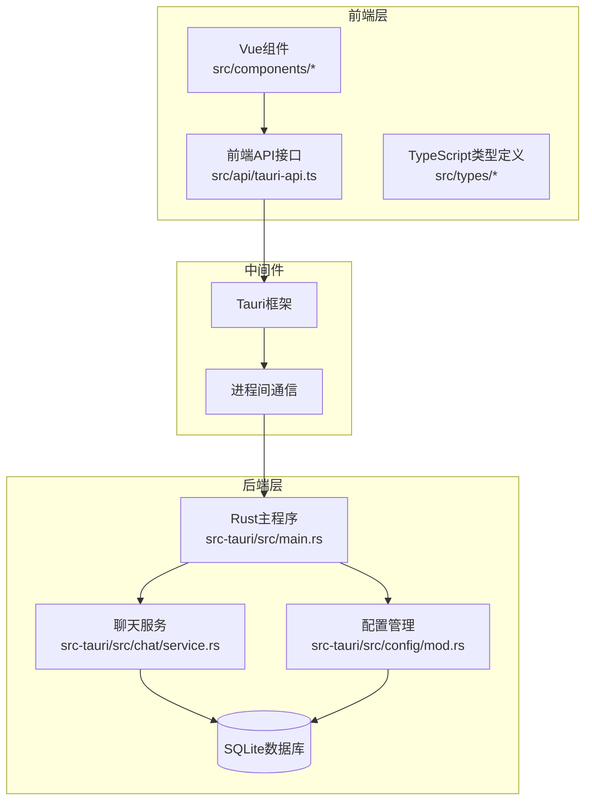
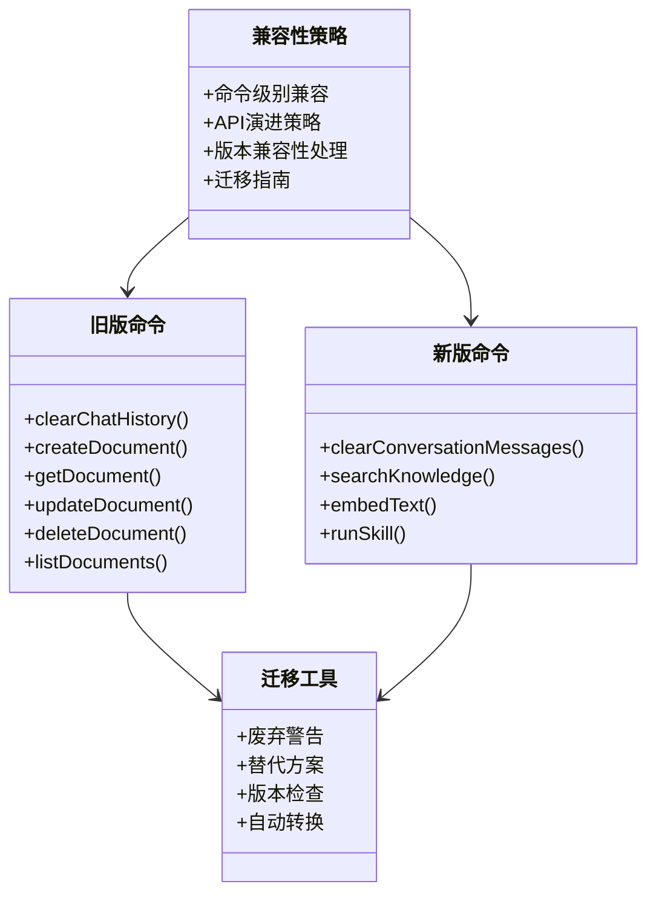
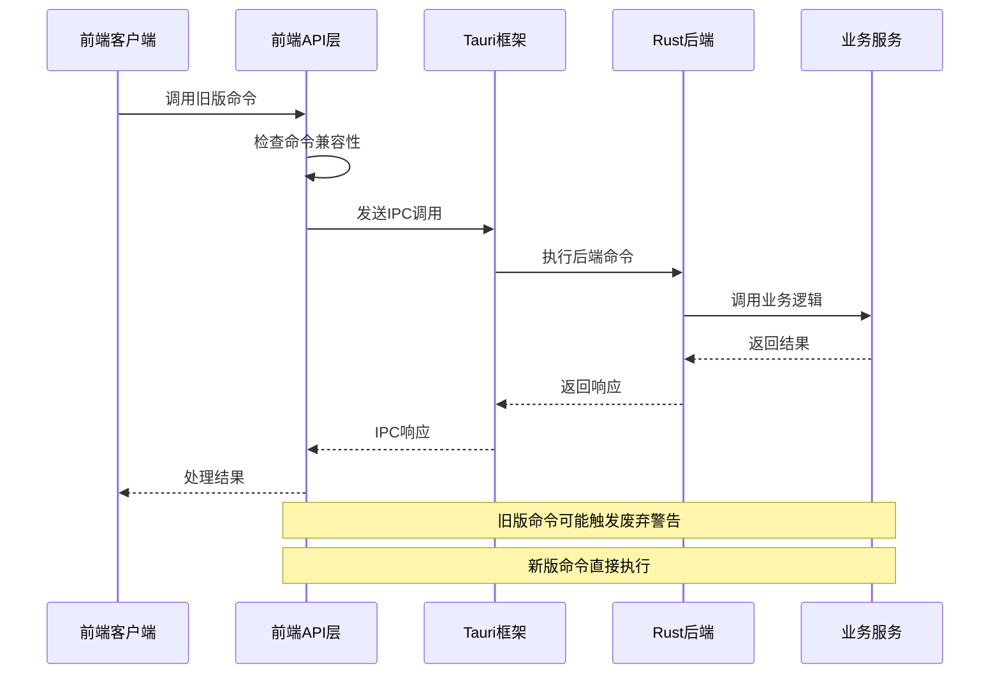
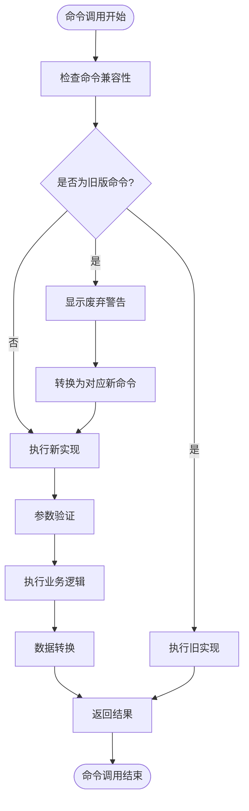
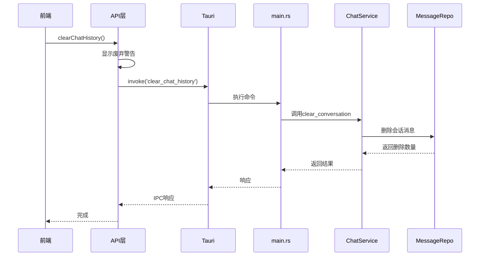
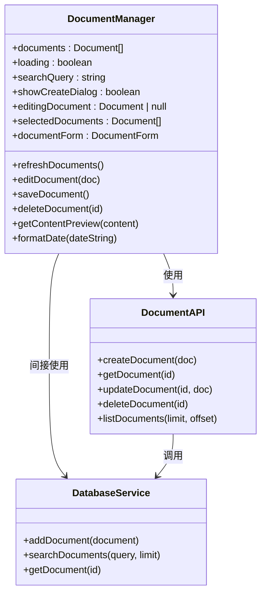
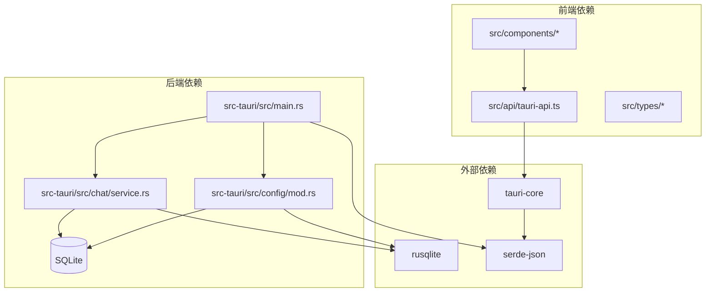

# 旧版兼容命令

<cite>
**本文档引用的文件**
- [src/api/tauri-api.ts](file://src/api/tauri-api.ts)
- [src-tauri/src/main.rs](file://src-tauri/src/main.rs)
- [src-tauri/src/chat/service.rs](file://src-tauri/src/chat/service.rs)
- [src-tauri/src/config/mod.rs](file://src-tauri/src/config/mod.rs)
- [src/components/business/DocumentManager.vue](file://src/components/business/DocumentManager.vue)
- [src/components/SearchInterface.vue](file://src/components/SearchInterface.vue)
- [src-tauri/src/db_test.rs](file://src-tauri/src/db_test.rs)
</cite>

## 目录
1. [简介](#简介)
2. [项目结构](#项目结构)
3. [核心组件](#核心组件)
4. [架构概览](#架构概览)
5. [详细组件分析](#详细组件分析)
6. [依赖关系分析](#依赖关系分析)
7. [性能考虑](#性能考虑)
8. [故障排除指南](#故障排除指南)
9. [结论](#结论)

## 简介

本文档详细说明了Malou Agent中为保持向后兼容而保留的旧版命令实现。主要涵盖以下两个方面：

1. **clearChatHistory（清理聊天历史）** - 已废弃但保留的旧版命令，现已由 `clearConversationMessages` 替代
2. **文档管理命令** - 当前处于待实现状态的文档管理API

这些命令的设计遵循渐进式API演进策略，在保持向后兼容的同时，为开发者提供了清晰的迁移路径。

## 项目结构

Malou Agent采用前后端分离的架构设计，主要分为以下几个层次：



**图表来源**
- [src/api/tauri-api.ts](file://src/api/tauri-api.ts#L1-L242)
- [src-tauri/src/main.rs](file://src-tauri/src/main.rs#L242-L321)

**章节来源**
- [src/api/tauri-api.ts](file://src/api/tauri-api.ts#L1-L242)
- [src-tauri/src/main.rs](file://src-tauri/src/main.rs#L1-L321)

## 核心组件

### 旧版兼容命令总览

Malou Agent实现了两套兼容性策略：

1. **命令级别兼容** - 通过保留旧命令名称但提供新实现
2. **API演进策略** - 逐步替换废弃命令为新命令



**图表来源**
- [src/api/tauri-api.ts](file://src/api/tauri-api.ts#L237-L241)
- [src/api/tauri-api.ts](file://src/api/tauri-api.ts#L216-L235)

**章节来源**
- [src/api/tauri-api.ts](file://src/api/tauri-api.ts#L178-L241)

## 架构概览

### 命令执行流程



**图表来源**
- [src/api/tauri-api.ts](file://src/api/tauri-api.ts#L237-L241)
- [src-tauri/src/main.rs](file://src-tauri/src/main.rs#L290-L317)

### 数据流架构



**图表来源**
- [src/api/tauri-api.ts](file://src/api/tauri-api.ts#L237-L241)
- [src-tauri/src/main.rs](file://src-tauri/src/main.rs#L131-L138)

## 详细组件分析

### 1. clearChatHistory（清理聊天历史）命令

#### TypeScript接口定义

```typescript
// 旧版接口（已废弃）
export async function clearChatHistory(): Promise<void> {
  // 这个 API 已废弃，使用 clearConversationMessages 代替
  console.warn('clearChatHistory is deprecated, use clearConversationMessages instead');
}

// 新版接口（推荐使用）
export async function clearConversationMessages(conversationId: string): Promise<number> {
  return await invoke('clear_conversation_messages', { conversationId });
}
```

#### 后端实现细节



**图表来源**
- [src/api/tauri-api.ts](file://src/api/tauri-api.ts#L237-L241)
- [src-tauri/src/main.rs](file://src-tauri/src/main.rs#L131-L138)
- [src-tauri/src/chat/service.rs](file://src-tauri/src/chat/service.rs#L79-L92)

#### 实现特点

1. **向后兼容性**：保留旧命令名称，确保现有代码正常运行
2. **废弃警告**：通过控制台输出明确的迁移提示
3. **功能映射**：与新命令功能完全一致，保证行为一致性

**章节来源**
- [src/api/tauri-api.ts](file://src/api/tauri-api.ts#L237-L241)
- [src-tauri/src/main.rs](file://src-tauri/src/main.rs#L131-L138)
- [src-tauri/src/chat/service.rs](file://src-tauri/src/chat/service.rs#L79-L92)

### 2. 文档管理命令（待实现）

#### TypeScript接口定义

```typescript
// 待实现的文档管理接口
export interface Document {
  id: string;
  title: string;
  content: string;
  embedding?: number[];
  metadata?: Record<string, any>;
  createdAt: string;
  updatedAt: string;
}

export interface DocumentCreate {
  title: string;
  content: string;
  embedding?: number[];
  metadata?: Record<string, any>;
}

export interface DocumentUpdate {
  title?: string;
  content?: string;
  embedding?: number[];
  metadata?: Record<string, any>;
}

// 当前未实现的函数（抛出错误）
export async function createDocument(_doc: DocumentCreate): Promise<Document> {
  throw new Error('Not implemented yet');
}

export async function getDocument(_id: string): Promise<Document | null> {
  throw new Error('Not implemented yet');
}

export async function updateDocument(_id: string, _doc: DocumentUpdate): Promise<Document | null> {
  throw new Error('Not implemented yet');
}

export async function deleteDocument(_id: string): Promise<boolean> {
  throw new Error('Not implemented yet');
}

export async function listDocuments(_limit: number = 10, _offset: number = 0): Promise<Document[]> {
  throw new Error('Not implemented yet');
}
```

#### Vue组件集成



**图表来源**
- [src/components/business/DocumentManager.vue](file://src/components/business/DocumentManager.vue#L90-L231)
- [src/components/SearchInterface.vue](file://src/components/SearchInterface.vue#L177-L214)

#### 前端兼容性代码

```typescript
// 前端兼容性包装器
class DocumentAPIWrapper {
  static async createDocument(doc: DocumentCreate): Promise<Document> {
    try {
      // 尝试调用新实现
      return await createDocument(doc);
    } catch (error) {
      if (error.message === 'Not implemented yet') {
        // 回退到数据库服务
        return await this.fallbackToDatabase(doc);
      }
      throw error;
    }
  }
  
  private static async fallbackToDatabase(doc: DocumentCreate): Promise<Document> {
    // 实现数据库服务的回退逻辑
    const databaseService = DatabaseService.getInstance();
    return await databaseService.addDocument(doc);
  }
}
```

**章节来源**
- [src/api/tauri-api.ts](file://src/api/tauri-api.ts#L216-L235)
- [src/components/business/DocumentManager.vue](file://src/components/business/DocumentManager.vue#L90-L231)
- [src/components/SearchInterface.vue](file://src/components/SearchInterface.vue#L177-L214)

### 3. 其他旧版兼容命令

#### 技能系统命令

```typescript
// 旧版技能执行命令
export async function runSkill(skillName: string, params: any): Promise<any> {
  return await invoke('run_skill', { skillName, params });
}

// 旧版文本嵌入命令
export async function embedText(text: string): Promise<number[]> {
  return await invoke('embed_text', { text });
}

// 旧版知识检索命令
export async function searchKnowledge(query: string): Promise<string[]> {
  return await invoke('search_knowledge', { query });
}
```

#### 配置管理命令

```typescript
// 旧版配置管理命令（来自配置模块）
#[tauri::command]
pub fn get_current_model_info(
    app_handle: tauri::AppHandle
) -> Result<Option<CurrentModel>, String> {
    // 实现逻辑...
}

#[tauri::command]
pub fn update_model_selection(
    model_id: String,
    app_handle: tauri::AppHandle
) -> Result<(), String> {
    // 实现逻辑...
}
```

**章节来源**
- [src/api/tauri-api.ts](file://src/api/tauri-api.ts#L208-L214)
- [src-tauri/src/config/mod.rs](file://src-tauri/src/config/mod.rs#L278-L301)

## 依赖关系分析

### 命令依赖图



**图表来源**
- [src-tauri/Cargo.toml](file://src-tauri/Cargo.toml#L12-L25)
- [src-tauri/src/main.rs](file://src-tauri/src/main.rs#L1-L321)

### 版本兼容性矩阵

| 命令名称 | 旧版接口 | 新版接口 | 兼容状态 | 迁移建议 |
|---------|---------|---------|---------|---------|
| clearChatHistory | ✅ 已废弃 | clearConversationMessages | ⚠️ 部分兼容 | 立即迁移 |
| createDocument | ❌ 待实现 | ❌ 待实现 | ❌ 不兼容 | 等待实现或使用回退 |
| getDocument | ❌ 待实现 | ❌ 待实现 | ❌ 不兼容 | 等待实现或使用回退 |
| updateDocument | ❌ 待实现 | ❌ 待实现 | ❌ 不兼容 | 等待实现或使用回退 |
| deleteDocument | ❌ 待实现 | ❌ 待实现 | ❌ 不兼容 | 等待实现或使用回退 |
| listDocuments | ❌ 待实现 | ❌ 待实现 | ❌ 不兼容 | 等待实现或使用回退 |

**章节来源**
- [src/api/tauri-api.ts](file://src/api/tauri-api.ts#L216-L241)
- [src-tauri/src/main.rs](file://src-tauri/src/main.rs#L290-L317)

## 性能考虑

### 兼容性性能影响

1. **额外的警告开销**：旧版命令会触发控制台警告，影响性能
2. **双重检查机制**：需要检查命令兼容性和执行相应的转换逻辑
3. **内存使用**：兼容性包装器会增加少量内存占用

### 优化建议

1. **及时迁移**：尽快从旧版命令迁移到新版命令
2. **批量操作**：对于大量命令调用，考虑使用批处理模式
3. **缓存策略**：对频繁使用的配置进行缓存

## 故障排除指南

### 常见问题及解决方案

#### 1. 旧版命令警告过多

**问题描述**：控制台出现大量废弃警告信息

**解决方案**：
```typescript
// 在生产环境中禁用警告
if (process.env.NODE_ENV === 'development') {
  console.warn('clearChatHistory is deprecated, use clearConversationMessages instead');
}
```

#### 2. 文档管理命令未实现

**问题描述**：调用文档管理API时抛出"未实现"错误

**解决方案**：
```typescript
// 实现回退机制
try {
  await createDocument(document);
} catch (error) {
  if (error.message === 'Not implemented yet') {
    // 使用数据库服务作为回退
    const result = await DatabaseService.getInstance().addDocument(document);
    return result;
  }
  throw error;
}
```

#### 3. 命令执行失败

**调试步骤**：
1. 检查命令参数是否正确
2. 验证后端服务是否正常运行
3. 查看控制台错误信息
4. 确认数据库连接状态

**章节来源**
- [src/api/tauri-api.ts](file://src/api/tauri-api.ts#L237-L241)
- [src-tauri/src/db_test.rs](file://src-tauri/src/db_test.rs#L36-L58)

## 结论

Malou Agent的旧版兼容命令系统体现了良好的API演进实践：

### 主要成就

1. **渐进式迁移**：通过废弃警告和替代方案，为开发者提供清晰的迁移路径
2. **向后兼容**：在保持现有功能的同时，推动技术升级
3. **完整文档**：详细的TypeScript接口定义和使用示例

### 最佳实践建议

1. **立即行动**：优先迁移 `clearChatHistory` 到 `clearConversationMessages`
2. **监控使用**：跟踪旧版命令的使用情况，制定迁移计划
3. **测试验证**：在迁移过程中充分测试新旧命令的行为一致性
4. **文档更新**：及时更新相关文档和示例代码

### 未来展望

随着文档管理功能的完善，Malou Agent将继续采用渐进式API演进策略，确保用户获得最佳的开发体验，同时保持系统的稳定性和可靠性。