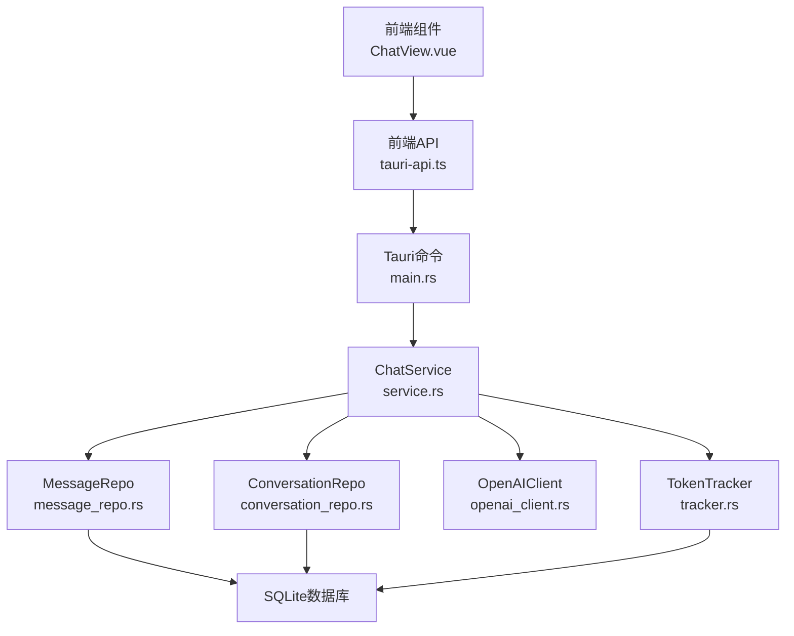
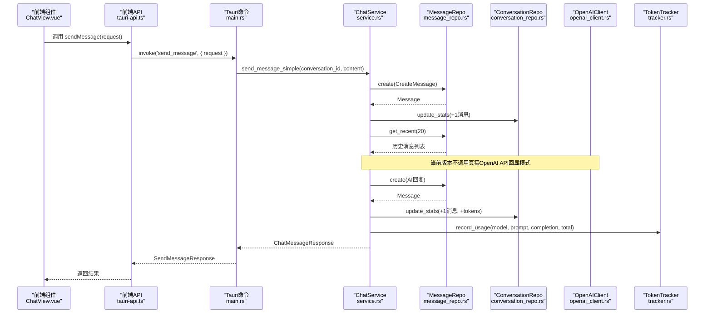
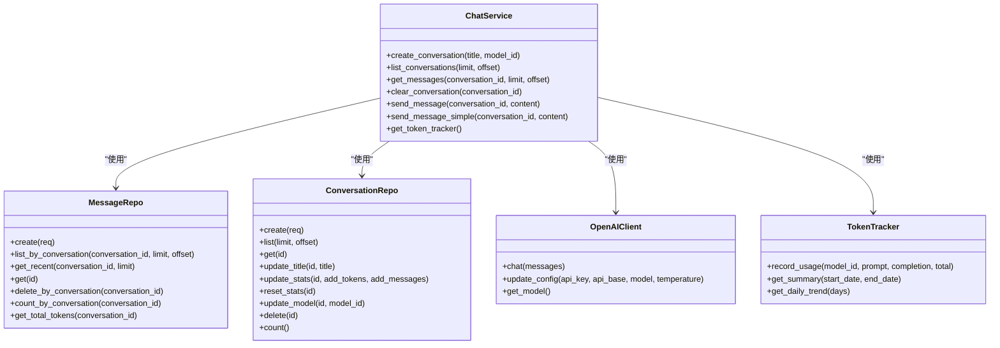
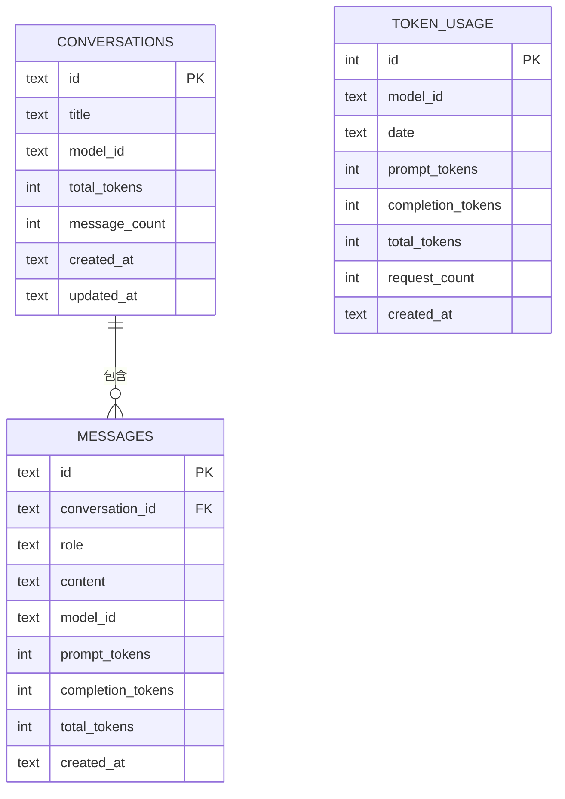

# 消息管理命令

<cite>
**本文引用的文件**
- [src-tauri/src/chat/mod.rs](file://src-tauri/src/chat/mod.rs)
- [src-tauri/src/chat/message_repo.rs](file://src-tauri/src/chat/message_repo.rs)
- [src-tauri/src/chat/conversation_repo.rs](file://src-tauri/src/chat/conversation_repo.rs)
- [src-tauri/src/chat/service.rs](file://src-tauri/src/chat/service.rs)
- [src-tauri/src/chat/openai_client.rs](file://src-tauri/src/chat/openai_client.rs)
- [src-tauri/src/database/models.rs](file://src-tauri/src/database/models.rs)
- [src-tauri/src/database/schema.rs](file://src-tauri/src/database/schema.rs)
- [src-tauri/src/token_tracker/tracker.rs](file://src-tauri/src/token_tracker/tracker.rs)
- [src-tauri/src/token_tracker/mod.rs](file://src-tauri/src/token_tracker/mod.rs)
- [src-tauri/src/main.rs](file://src-tauri/src/main.rs)
- [src/api/tauri-api.ts](file://src/api/tauri-api.ts)
- [src/components/business/ChatView.vue](file://src/components/business/ChatView.vue)
</cite>

## 目录
1. [简介](#简介)
2. [项目结构](#项目结构)
3. [核心组件](#核心组件)
4. [架构总览](#架构总览)
5. [详细组件分析](#详细组件分析)
6. [依赖关系分析](#依赖关系分析)
7. [性能考量](#性能考量)
8. [故障排查指南](#故障排查指南)
9. [结论](#结论)
10. [附录](#附录)

## 简介
本文件面向Malou Agent的消息管理命令，系统性梳理以下三类命令的实现与使用：
- send_message：发送消息并获取AI回复（当前版本为回显模式）
- get_conversation_messages：获取指定会话的历史消息
- clear_conversation_messages：清空指定会话的消息并重置统计

文档覆盖TypeScript接口定义、参数说明、返回值类型、错误处理机制、消息数据模型、上下文构建、Token统计与异步处理细节，并提供前后端集成示例与最佳实践。

## 项目结构
消息管理功能由前端API封装、Tauri命令桥接、Rust后端服务与数据库层协同完成。关键模块如下：
- 前端API：统一导出消息管理命令的TypeScript接口与调用方法
- Tauri命令：将前端调用映射到后端ChatService
- ChatService：协调消息仓库、会话仓库与OpenAI客户端
- 数据访问层：MessageRepo、ConversationRepo负责SQLite读写
- Token追踪：TokenTracker记录每日Token用量
- 数据模型：Message、Conversation、ChatMessageResponse等

图表来源
- [src/api/tauri-api.ts](file://src/api/tauri-api.ts#L105-L132)
- [src-tauri/src/main.rs](file://src-tauri/src/main.rs#L118-L161)
- [src-tauri/src/chat/service.rs](file://src-tauri/src/chat/service.rs#L20-L29)
- [src-tauri/src/chat/message_repo.rs](file://src-tauri/src/chat/message_repo.rs#L9-L175)
- [src-tauri/src/chat/conversation_repo.rs](file://src-tauri/src/chat/conversation_repo.rs#L9-L161)
- [src-tauri/src/chat/openai_client.rs](file://src-tauri/src/chat/openai_client.rs#L62-L130)
- [src-tauri/src/token_tracker/tracker.rs](file://src-tauri/src/token_tracker/tracker.rs#L9-L48)

章节来源
- [src-tauri/src/chat/mod.rs](file://src-tauri/src/chat/mod.rs#L1-L10)
- [src-tauri/src/database/schema.rs](file://src-tauri/src/database/schema.rs#L1-L68)

## 核心组件
- ChatService：消息管理的核心编排者，负责保存用户消息、构建上下文、调用AI、保存AI回复、更新会话统计与Token追踪
- MessageRepo：消息的增删查改、分页查询、最近N条消息、统计汇总
- ConversationRepo：会话的增删改查、统计更新（总Token、消息数）
- OpenAIClient：封装OpenAI聊天接口，支持配置更新与异步调用
- TokenTracker：按模型与日期聚合Token使用量，提供汇总与趋势查询
- 前端API：定义消息管理命令的TypeScript接口与调用方法

章节来源
- [src-tauri/src/chat/service.rs](file://src-tauri/src/chat/service.rs#L20-L224)
- [src-tauri/src/chat/message_repo.rs](file://src-tauri/src/chat/message_repo.rs#L9-L175)
- [src-tauri/src/chat/conversation_repo.rs](file://src-tauri/src/chat/conversation_repo.rs#L9-L161)
- [src-tauri/src/chat/openai_client.rs](file://src-tauri/src/chat/openai_client.rs#L62-L141)
- [src-tauri/src/token_tracker/tracker.rs](file://src-tauri/src/token_tracker/tracker.rs#L9-L195)
- [src/api/tauri-api.ts](file://src/api/tauri-api.ts#L105-L132)

## 架构总览
消息管理命令在前后端之间的调用链路如下：

图表来源
- [src/components/business/ChatView.vue](file://src/components/business/ChatView.vue#L162-L222)
- [src/api/tauri-api.ts](file://src/api/tauri-api.ts#L108-L110)
- [src-tauri/src/main.rs](file://src-tauri/src/main.rs#L140-L161)
- [src-tauri/src/chat/service.rs](file://src-tauri/src/chat/service.rs#L179-L217)
- [src-tauri/src/chat/message_repo.rs](file://src-tauri/src/chat/message_repo.rs#L14-L52)
- [src-tauri/src/chat/conversation_repo.rs](file://src-tauri/src/chat/conversation_repo.rs#L102-L116)
- [src-tauri/src/token_tracker/tracker.rs](file://src-tauri/src/token_tracker/tracker.rs#L14-L48)

## 详细组件分析

### send_message（发送消息）
- 功能概述：保存用户消息，更新会话统计；当前版本为回显模式（不调用真实OpenAI API），后续可扩展为真实调用
- 关键流程：
  1) 保存用户消息（role=user，tokens为空）
  2) 更新会话统计（+1消息）
  3) 获取最近20条消息作为上下文
  4) 回显生成AI回复（role=assistant，content为“AI回复: ...”）
  5) 更新会话统计（+1消息）
  6) 记录Token使用（当前回显无Token，可扩展时填入usage）
- 异步与并发：ChatService内部使用互斥锁保护共享状态，命令为同步包装；真实OpenAI调用需异步处理
- 错误处理：各步骤均返回Result，命令层捕获并格式化错误字符串

TypeScript接口定义
- 请求体：SendMessageRequest
  - conversation_id: string
  - content: string
- 响应体：SendMessageResponse
  - id: string
  - content: string
  - role: string
  - conversation_id: string
  - timestamp: string
  - prompt_tokens: number
  - completion_tokens: number
  - total_tokens: number

前端调用示例
- ChatView.vue中通过sendMessage发起请求，成功后更新界面消息列表并触发会话更新事件

章节来源
- [src-tauri/src/chat/service.rs](file://src-tauri/src/chat/service.rs#L179-L217)
- [src-tauri/src/main.rs](file://src-tauri/src/main.rs#L140-L161)
- [src/api/tauri-api.ts](file://src/api/tauri-api.ts#L28-L42)
- [src/components/business/ChatView.vue](file://src/components/business/ChatView.vue#L162-L222)

### get_conversation_messages（获取会话消息）
- 功能概述：按会话ID分页获取消息列表，支持limit与offset
- 关键流程：
  1) 调用MessageRepo.list_by_conversation(conversation_id, limit, offset)
  2) 按创建时间升序返回
- 性能特性：SQLite索引idx_messages_conv(conversation_id, created_at ASC)支持高效分页查询

TypeScript接口定义
- 请求参数：
  - conversationId: string
  - limit?: number
  - offset?: number
- 返回值：Message[]

前端调用示例
- ChatView.vue首次加载会话时调用getConversationMessages，将API消息转换为显示消息

章节来源
- [src-tauri/src/chat/message_repo.rs](file://src-tauri/src/chat/message_repo.rs#L54-L81)
- [src-tauri/src/main.rs](file://src-tauri/src/main.rs#L120-L129)
- [src/api/tauri-api.ts](file://src/api/tauri-api.ts#L115-L125)
- [src/components/business/ChatView.vue](file://src/components/business/ChatView.vue#L117-L144)

### clear_conversation_messages（清空会话消息）
- 功能概述：删除指定会话的所有消息，并重置会话统计（总Token与消息数归零）
- 关键流程：
  1) 调用MessageRepo.delete_by_conversation(conversation_id)
  2) 调用ConversationRepo.reset_stats(conversation_id)
  3) 返回删除数量

TypeScript接口定义
- 请求参数：conversationId: string
- 返回值：number（删除的消息条数）

前端调用示例
- ChatView.vue提供“清空聊天记录”按钮，调用clearConversationMessages并刷新界面

章节来源
- [src-tauri/src/chat/service.rs](file://src-tauri/src/chat/service.rs#L79-L92)
- [src-tauri/src/chat/message_repo.rs](file://src-tauri/src/chat/message_repo.rs#L142-L151)
- [src-tauri/src/chat/conversation_repo.rs](file://src-tauri/src/chat/conversation_repo.rs#L118-L132)
- [src-tauri/src/main.rs](file://src-tauri/src/main.rs#L131-L138)
- [src/api/tauri-api.ts](file://src/api/tauri-api.ts#L130-L132)
- [src/components/business/ChatView.vue](file://src/components/business/ChatView.vue#L245-L274)

### 消息数据模型与上下文管理
- 消息模型（Message）：包含id、conversation_id、role、content、model_id、prompt_tokens、completion_tokens、total_tokens、created_at
- 会话模型（Conversation）：包含id、title、model_id、total_tokens、message_count、created_at、updated_at
- 上下文构建：通过MessageRepo.get_recent(conversation_id, 20)取最近N条消息，按时间正序排列用于构造请求

章节来源
- [src-tauri/src/database/models.rs](file://src-tauri/src/database/models.rs#L22-L46)
- [src-tauri/src/database/models.rs](file://src-tauri/src/database/models.rs#L3-L13)
- [src-tauri/src/chat/message_repo.rs](file://src-tauri/src/chat/message_repo.rs#L84-L113)

### Token计算与统计
- Token统计字段：prompt_tokens、completion_tokens、total_tokens
- 会话统计：ConversationRepo.update_stats(conversation_id, add_tokens, add_messages)
- Token追踪：TokenTracker.record_usage(model_id, prompt, completion, total)，按日期聚合
- 汇总与趋势：支持按日期范围汇总与每日趋势查询

章节来源
- [src-tauri/src/chat/service.rs](file://src-tauri/src/chat/service.rs#L138-L165)
- [src-tauri/src/chat/conversation_repo.rs](file://src-tauri/src/chat/conversation_repo.rs#L102-L116)
- [src-tauri/src/token_tracker/tracker.rs](file://src-tauri/src/token_tracker/tracker.rs#L14-L48)
- [src-tauri/src/token_tracker/tracker.rs](file://src-tauri/src/token_tracker/tracker.rs#L50-L113)
- [src-tauri/src/token_tracker/tracker.rs](file://src-tauri/src/token_tracker/tracker.rs#L143-L168)

### 异步处理细节
- ChatService内部使用Arc<RwLock<OpenAIClient>>以支持并发读取；当前命令send_message采用同步包装
- OpenAIClient.chat为异步方法，返回ChatResult（content、role、usage）
- TokenTracker与数据库操作均为同步，但通过数据库事务保证一致性

章节来源
- [src-tauri/src/chat/service.rs](file://src-tauri/src/chat/service.rs#L13-L29)
- [src-tauri/src/chat/openai_client.rs](file://src-tauri/src/chat/openai_client.rs#L74-L116)
- [src-tauri/src/token_tracker/tracker.rs](file://src-tauri/src/token_tracker/tracker.rs#L25-L48)

## 依赖关系分析

图表来源
- [src-tauri/src/chat/service.rs](file://src-tauri/src/chat/service.rs#L20-L224)
- [src-tauri/src/chat/message_repo.rs](file://src-tauri/src/chat/message_repo.rs#L9-L175)
- [src-tauri/src/chat/conversation_repo.rs](file://src-tauri/src/chat/conversation_repo.rs#L9-L161)
- [src-tauri/src/chat/openai_client.rs](file://src-tauri/src/chat/openai_client.rs#L62-L141)
- [src-tauri/src/token_tracker/tracker.rs](file://src-tauri/src/token_tracker/tracker.rs#L9-L195)

## 性能考量
- 分页查询：get_conversation_messages使用索引idx_messages_conv，limit/offset控制返回量
- 上下文长度：get_recent限制为20条，避免过长上下文影响性能与成本
- Token统计：按天聚合，避免频繁写入热点
- 并发安全：ChatService对OpenAI客户端使用RwLock，读多写少场景友好

## 故障排查指南
- 常见错误
  - 数据库操作失败：检查数据库初始化与权限
  - 消息获取异常：确认conversation_id有效且存在
  - 清空失败：确认会话存在且MessageRepo.delete_by_conversation执行成功
- 日志与调试
  - 前端：ChatView.vue在发送失败时移除临时消息并弹出错误提示
  - 后端：main.rs中test_database命令可验证完整流程

章节来源
- [src/components/business/ChatView.vue](file://src/components/business/ChatView.vue#L209-L221)
- [src-tauri/src/main.rs](file://src-tauri/src/main.rs#L219-L238)

## 结论
Malou Agent的消息管理命令以清晰的分层设计实现了消息的持久化、分页查询、上下文构建与统计追踪。当前send_message为回显模式，便于开发与测试；后续可通过扩展ChatService与OpenAIClient实现真实AI交互，并完善Token统计与错误处理。前端通过统一的API封装简化了调用，配合组件化的消息展示与交互体验良好。

## 附录

### 数据模型图

图表来源
- [src-tauri/src/database/schema.rs](file://src-tauri/src/database/schema.rs#L2-L62)

### 命令与接口对照表
- send_message
  - 前端：sendMessage(request)
  - 后端：invoke('send_message', { request })
  - 返回：SendMessageResponse
- get_conversation_messages
  - 前端：getConversationMessages(conversationId, limit?, offset?)
  - 后端：invoke('get_conversation_messages', { conversationId, limit?, offset? })
  - 返回：Message[]
- clear_conversation_messages
  - 前端：clearConversationMessages(conversationId)
  - 后端：invoke('clear_conversation_messages', { conversationId })
  - 返回：number

章节来源
- [src/api/tauri-api.ts](file://src/api/tauri-api.ts#L108-L132)
- [src-tauri/src/main.rs](file://src-tauri/src/main.rs#L120-L161)