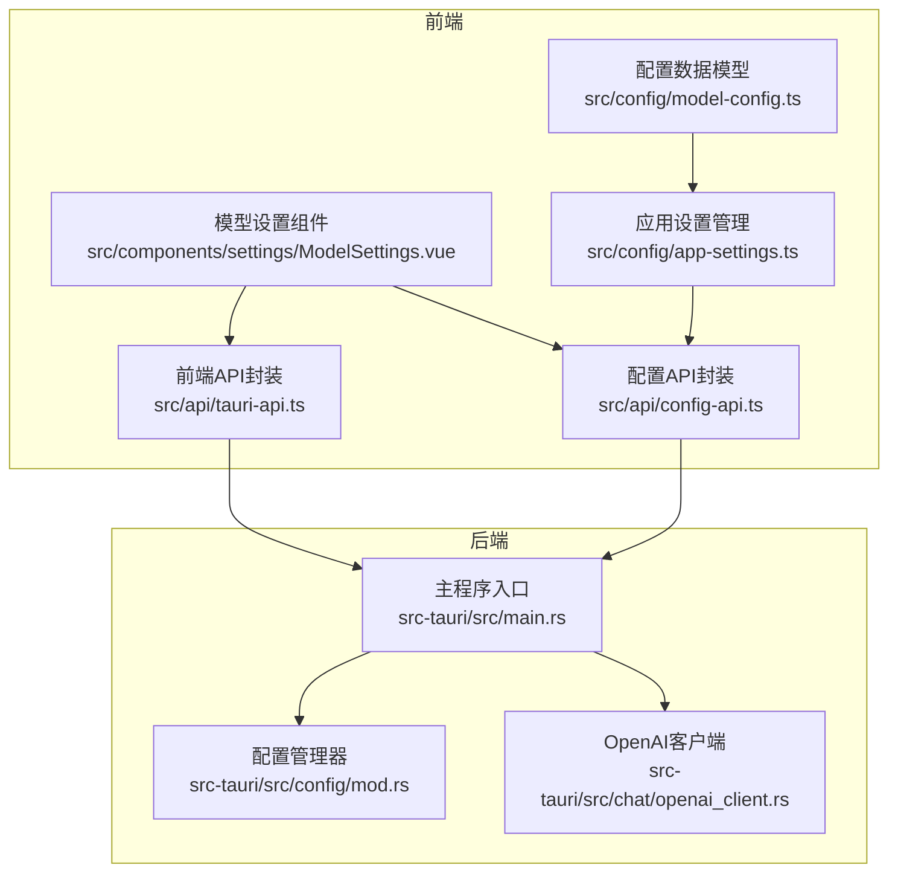
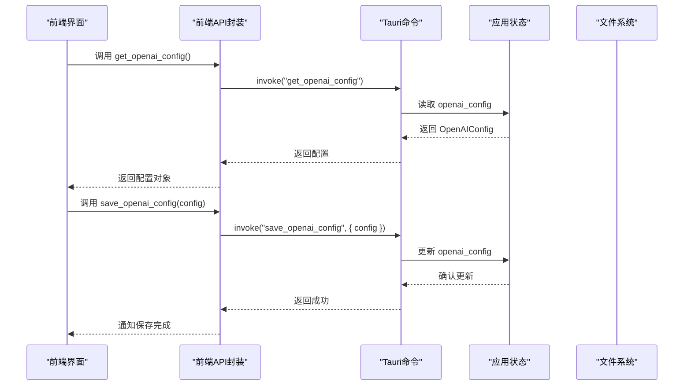
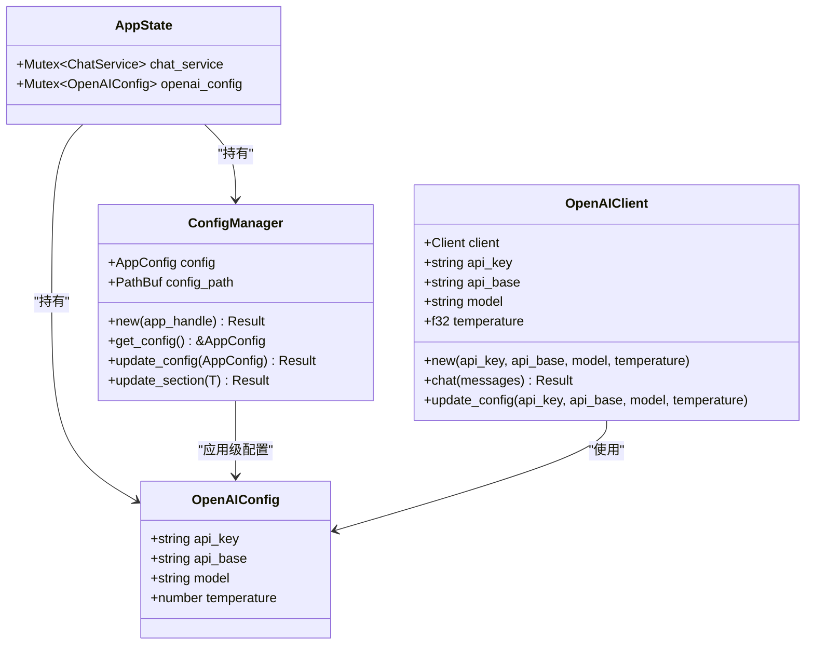

# 配置管理命令

<cite>
**本文档引用的文件**
- [src/api/tauri-api.ts](file://src/api/tauri-api.ts)
- [src/api/config-api.ts](file://src/api/config-api.ts)
- [src/config/model-config.ts](file://src/config/model-config.ts)
- [src/config/app-settings.ts](file://src/config/app-settings.ts)
- [src-tauri/src/main.rs](file://src-tauri/src/main.rs)
- [src-tauri/src/config/mod.rs](file://src-tauri/src/config/mod.rs)
- [src-tauri/src/chat/openai_client.rs](file://src-tauri/src/chat/openai_client.rs)
- [src/components/settings/ModelSettings.vue](file://src/components/settings/ModelSettings.vue)
- [src/utils/config-test.ts](file://src/utils/config-test.ts)
- [src/utils/logger.ts](file://src/utils/logger.ts)
</cite>

## 目录
1. [简介](#简介)
2. [项目结构](#项目结构)
3. [核心组件](#核心组件)
4. [架构总览](#架构总览)
5. [详细组件分析](#详细组件分析)
6. [依赖关系分析](#依赖关系分析)
7. [性能考虑](#性能考虑)
8. [故障排除指南](#故障排除指南)
9. [结论](#结论)
10. [附录](#附录)

## 简介
本文件面向Malou Agent的配置管理命令，重点围绕以下两个命令进行深入说明：
- get_openai_config：获取OpenAI配置（API密钥、基础URL、模型、温度等）
- save_openai_config：保存OpenAI配置

文档将提供TypeScript接口定义、参数说明、返回值类型、配置验证与错误处理机制，并结合前端配置界面与后端配置管理实现细节，帮助开发者快速理解与集成。

## 项目结构
Malou Agent采用前后端分离的架构：
- 前端（Vue + TypeScript）通过Tauri IPC调用后端命令
- 后端（Rust）负责配置存储与业务逻辑
- 配置数据模型在前后端分别定义，通过API层进行转换与同步

图表来源
- [src/api/tauri-api.ts](file://src/api/tauri-api.ts#L59-L167)
- [src/api/config-api.ts](file://src/api/config-api.ts#L1-L201)
- [src-tauri/src/main.rs](file://src-tauri/src/main.rs#L188-L215)
- [src-tauri/src/config/mod.rs](file://src-tauri/src/config/mod.rs#L1-L334)

章节来源
- [src/api/tauri-api.ts](file://src/api/tauri-api.ts#L1-L242)
- [src/api/config-api.ts](file://src/api/config-api.ts#L1-L201)
- [src-tauri/src/main.rs](file://src-tauri/src/main.rs#L1-L321)

## 核心组件
- 前端OpenAI配置接口定义与调用封装
- 后端OpenAI配置命令实现与状态管理
- 配置数据模型与默认值处理
- 前后端配置转换与同步机制
- 配置验证与错误处理

章节来源
- [src/api/tauri-api.ts](file://src/api/tauri-api.ts#L59-L167)
- [src-tauri/src/main.rs](file://src-tauri/src/main.rs#L24-L29)
- [src-tauri/src/config/mod.rs](file://src-tauri/src/config/mod.rs#L58-L142)

## 架构总览
前端通过Tauri命令调用后端，后端维护应用状态（含OpenAI配置），并在必要时持久化到文件系统或内存中。

图表来源
- [src/api/tauri-api.ts](file://src/api/tauri-api.ts#L158-L167)
- [src-tauri/src/main.rs](file://src-tauri/src/main.rs#L190-L215)

## 详细组件分析

### get_openai_config 命令
- 命令作用：从前端调用后端，获取当前OpenAI配置（API密钥、基础URL、模型、温度）
- 前端接口定义
  - 函数签名：getOpenAIConfig(): Promise<OpenAIConfig>
  - 参数：无
  - 返回值：Promise<OpenAIConfig>
  - 类型定义：见下方“TypeScript接口定义”
- 后端命令实现
  - 函数签名：get_openai_config(state: State<AppState>) -> Result<OpenAIConfig, String>
  - 参数：state（应用状态）
  - 返回值：Result<OpenAIConfig, String>
  - 实现要点：从AppState的openai_config锁中读取配置并返回克隆副本
- 配置验证与默认值
  - 默认值：api_key为空字符串，api_base为"https://api.openai.com/v1"，model为"gpt-3.5-turbo"，temperature为0.7
  - 前端调用时可直接使用返回的配置对象
- 错误处理
  - 后端返回Result类型，若出现异常会返回错误字符串；前端调用时需捕获异常并提示用户
- 实际使用示例
  - 前端调用：await getOpenAIConfig()
  - 后端调用：invoke("get_openai_config")

章节来源
- [src/api/tauri-api.ts](file://src/api/tauri-api.ts#L158-L160)
- [src-tauri/src/main.rs](file://src-tauri/src/main.rs#L190-L196)

### save_openai_config 命令
- 命令作用：从前端调用后端，保存OpenAI配置
- 前端接口定义
  - 函数签名：saveOpenAIConfig(config: OpenAIConfig): Promise<void>
  - 参数：config（OpenAIConfig对象）
  - 返回值：Promise<void>
  - 类型定义：见下方“TypeScript接口定义”
- 后端命令实现
  - 函数签名：save_openai_config(config: OpenAIConfig, state: State<AppState>) -> Result<(), String>
  - 参数：config（传入的OpenAI配置）、state（应用状态）
  - 返回值：Result<(), String>
  - 实现要点：
    - 更新AppState中的openai_config
    - 当前实现仅更新内存中的配置，未同步到ChatService（因ChatService不支持Send）
    - 打印提示信息表示内存中已更新
- 配置验证与默认值
  - 前端可先校验配置再调用保存；后端未对输入做额外校验
- 错误处理
  - 后端返回Result类型，异常会被转换为字符串错误；前端需捕获并提示
- 实际使用示例
  - 前端调用：await saveOpenAIConfig({ api_key, api_base, model, temperature })
  - 后端调用：invoke("save_openai_config", { config })

章节来源
- [src/api/tauri-api.ts](file://src/api/tauri-api.ts#L165-L167)
- [src-tauri/src/main.rs](file://src-tauri/src/main.rs#L198-L215)

### TypeScript接口定义
- OpenAIConfig
  - 字段：
    - api_key: string
    - api_base: string
    - model: string
    - temperature: number
  - 用途：作为get_openai_config/save_openai_config的参数与返回值类型
  - 默认值：由后端初始化时提供

章节来源
- [src/api/tauri-api.ts](file://src/api/tauri-api.ts#L59-L64)
- [src-tauri/src/main.rs](file://src-tauri/src/main.rs#L24-L29)

### 配置数据模型与默认值处理
- 前端配置模型（AppConfig）
  - 结构：localModels、remoteModels、onnx、modelSelector、general
  - 默认值：位于DEFAULT_CONFIG中，包含本地模型、远程模型（如OpenAI）、ONNX设置、模型选择器、通用设置等
  - 验证：validateConfig对远程模型的api_key、api_url进行校验
  - 合并：mergeConfig用于合并基础配置与覆盖配置
- 后端配置模型（AppConfig）
  - 结构：local_models、remote_models、onnx、model_selector、general
  - 默认值：Default实现，包含默认本地模型、默认远程模型（OpenAI）、ONNX设置、模型选择器、通用设置
- 前后端转换
  - 前端通过convertFromBackendConfig/convertToBackendConfig在前端与后端配置之间进行字段映射与默认值填充

章节来源
- [src/config/model-config.ts](file://src/config/model-config.ts#L43-L163)
- [src-tauri/src/config/mod.rs](file://src-tauri/src/config/mod.rs#L58-L142)
- [src/api/config-api.ts](file://src/api/config-api.ts#L12-L114)

### 安全存储与持久化
- OpenAI配置存储位置
  - 内存存储：AppState.openai_config（Mutex<OpenAIConfig>）
  - 文件存储：ConfigManager负责应用级配置的文件持久化（config.json）
- 安全建议
  - API密钥在前端不应明文显示或持久化到localStorage
  - 建议仅在内存中缓存敏感配置，避免写入文件系统
  - 若需持久化，请使用后端安全存储或加密存储方案

章节来源
- [src-tauri/src/main.rs](file://src-tauri/src/main.rs#L53-L56)
- [src-tauri/src/config/mod.rs](file://src-tauri/src/config/mod.rs#L144-L197)

### 前端配置界面集成
- ModelSettings.vue
  - 提供模型配置管理界面，包含模型选择、本地模型、远程模型、ONNX辅助等功能
  - 通过useConfig与configManager实现响应式配置管理
  - 支持配置导入导出、实时保存与错误提示
- 集成点
  - 通过getAppConfig/updateAppConfig与后端交互
  - 通过updateConfig同步到前端配置管理器

章节来源
- [src/components/settings/ModelSettings.vue](file://src/components/settings/ModelSettings.vue#L1-L580)
- [src/config/app-settings.ts](file://src/config/app-settings.ts#L1-L195)

### 后端配置管理实现细节
- AppState
  - 包含chat_service与openai_config两个关键状态
  - 初始化时设置默认OpenAI配置
- ConfigManager（应用级配置）
  - 负责应用级配置的文件读写与默认值生成
  - 提供get_config、update_config、update_section等方法
- OpenAI客户端
  - OpenAIClient封装了请求构建、发送与响应解析
  - 支持动态更新配置（api_key、api_base、model、temperature）

章节来源
- [src-tauri/src/main.rs](file://src-tauri/src/main.rs#L53-L56)
- [src-tauri/src/config/mod.rs](file://src-tauri/src/config/mod.rs#L144-L248)
- [src-tauri/src/chat/openai_client.rs](file://src-tauri/src/chat/openai_client.rs#L62-L130)

### 配置验证与错误处理机制
- 前端验证
  - validateConfig检查远程模型的api_key与api_url
  - updateConfig返回{ success: boolean, errors?: string[] }，便于前端展示错误
- 后端验证
  - 当前OpenAI配置命令未做额外校验，建议在save_openai_config中增加校验
- 错误处理
  - 前端：try/catch捕获invoke异常并提示用户
  - 后端：Result类型返回错误字符串，前端统一处理

章节来源
- [src/config/model-config.ts](file://src/config/model-config.ts#L119-L138)
- [src-tauri/src/main.rs](file://src-tauri/src/main.rs#L198-L215)

## 依赖关系分析

图表来源
- [src-tauri/src/main.rs](file://src-tauri/src/main.rs#L24-L56)
- [src-tauri/src/config/mod.rs](file://src-tauri/src/config/mod.rs#L144-L248)
- [src-tauri/src/chat/openai_client.rs](file://src-tauri/src/chat/openai_client.rs#L5-L130)

章节来源
- [src-tauri/src/main.rs](file://src-tauri/src/main.rs#L1-L321)
- [src-tauri/src/config/mod.rs](file://src-tauri/src/config/mod.rs#L1-L334)
- [src-tauri/src/chat/openai_client.rs](file://src-tauri/src/chat/openai_client.rs#L1-L141)

## 性能考虑
- 配置读取：get_openai_config为轻量操作，直接从内存读取
- 配置写入：save_openai_config仅更新内存，避免频繁IO
- 前端同步：ModelSettings.vue通过useConfig实现响应式更新，减少不必要的重渲染
- 后端并发：AppState使用Mutex保护共享状态，确保线程安全

## 故障排除指南
- 常见问题
  - 无法获取OpenAI配置：检查后端命令是否注册、AppState是否正确初始化
  - 保存配置失败：查看后端返回的错误字符串，确认前端调用是否正确
  - 前端配置不同步：确认updateConfig是否被调用，以及useConfig的响应式绑定是否生效
- 调试工具
  - 使用logger记录配置变更日志
  - 使用config-test进行功能测试

章节来源
- [src/utils/logger.ts](file://src/utils/logger.ts#L1-L95)
- [src/utils/config-test.ts](file://src/utils/config-test.ts#L1-L66)

## 结论
Malou Agent的配置管理命令围绕OpenAI配置提供了简洁高效的接口。前端通过Tauri命令与后端交互，后端在内存中维护OpenAI配置，具备良好的扩展性。建议后续增强save_openai_config的输入校验与安全存储策略，以提升系统的健壮性与安全性。

## 附录

### API定义与调用示例

- get_openai_config
  - 前端调用：await getOpenAIConfig()
  - 后端命令：invoke("get_openai_config")
  - 返回：OpenAIConfig对象

- save_openai_config
  - 前端调用：await saveOpenAIConfig({ api_key, api_base, model, temperature })
  - 后端命令：invoke("save_openai_config", { config })
  - 返回：void

章节来源
- [src/api/tauri-api.ts](file://src/api/tauri-api.ts#L158-L167)
- [src-tauri/src/main.rs](file://src-tauri/src/main.rs#L190-L215)