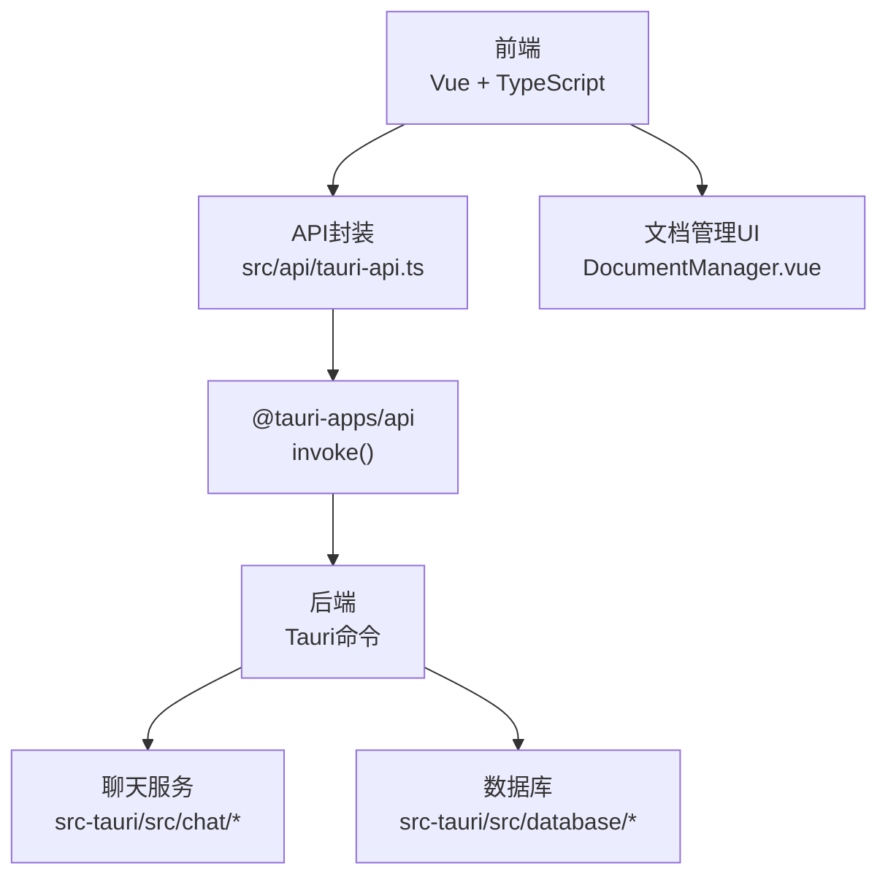
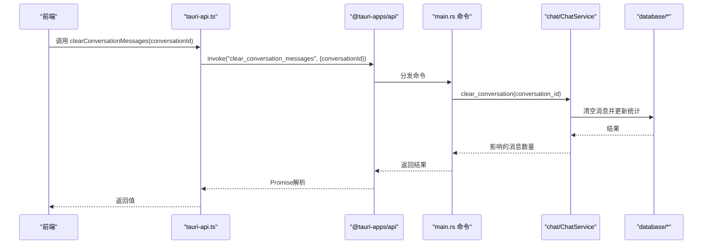
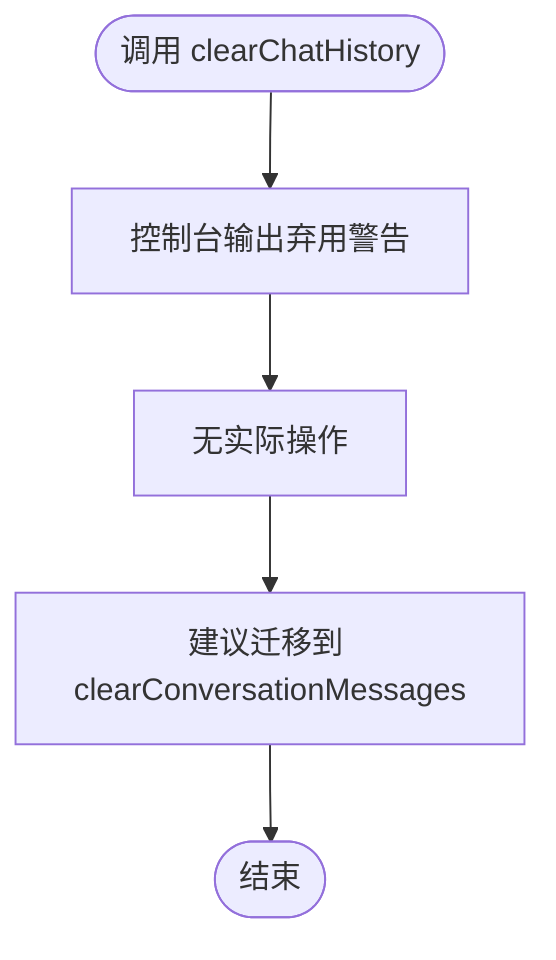
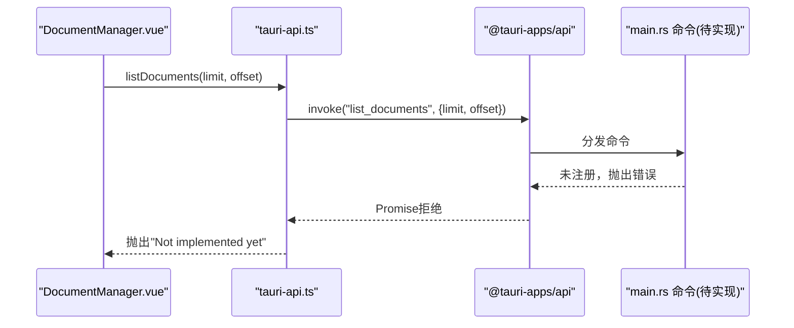
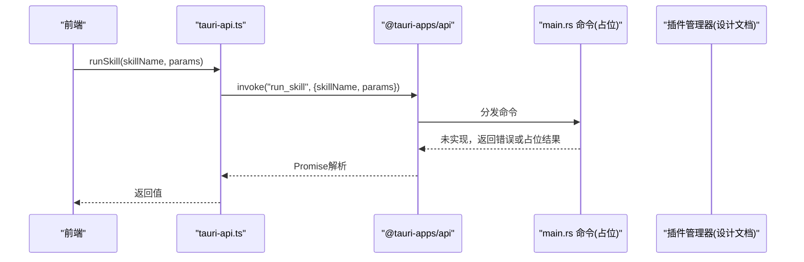
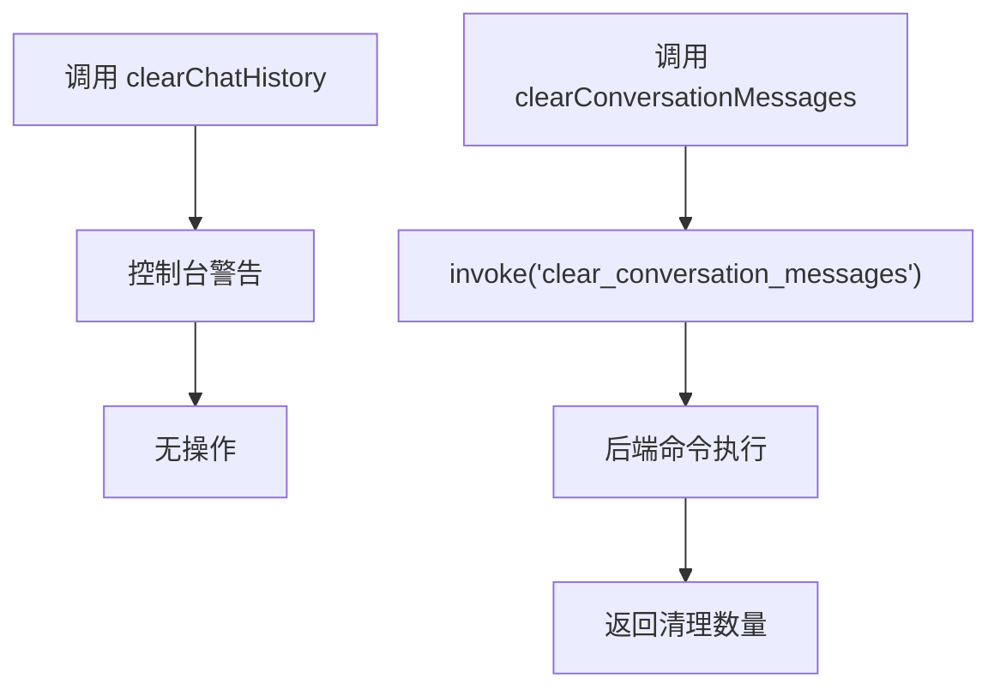
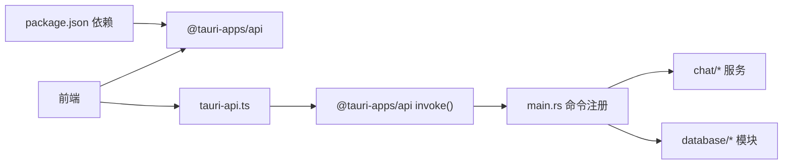

# 兼容性API

<cite>
**本文引用的文件**
- [src/api/tauri-api.ts](file://src/api/tauri-api.ts)
- [src-tauri/src/main.rs](file://src-tauri/src/main.rs)
- [src-tauri/src/chat/service.rs](file://src-tauri/src/chat/service.rs)
- [src-tauri/src/chat/conversation_repo.rs](file://src-tauri/src/chat/conversation_repo.rs)
- [src-tauri/src/chat/message_repo.rs](file://src-tauri/src/chat/message_repo.rs)
- [src-tauri/src/database/models.rs](file://src-tauri/src/database/models.rs)
- [src-tauri/src/database/schema.rs](file://src-tauri/src/database/schema.rs)
- [src-tauri/src/database/connection.rs](file://src-tauri/src/database/connection.rs)
- [src-tauri/src/db_test.rs](file://src-tauri/src/db_test.rs)
- [src/components/business/DocumentManager.vue](file://src/components/business/DocumentManager.vue)
- [src/components/SearchInterface.vue](file://src/components/SearchInterface.vue)
- [docs/skill-plugins-system.md](file://docs/skill-plugins-system.md)
- [docs/testing-and-optimization.md](file://docs/testing-and-optimization.md)
- [package.json](file://package.json)
</cite>

## 目录
1. [简介](#简介)
2. [项目结构](#项目结构)
3. [核心组件](#核心组件)
4. [架构总览](#架构总览)
5. [详细组件分析](#详细组件分析)
6. [依赖关系分析](#依赖关系分析)
7. [性能考量](#性能考量)
8. [故障排查指南](#故障排查指南)
9. [结论](#结论)
10. [附录](#附录)

## 简介
本文件聚焦 Malou Agent 的兼容性API，重点说明以下内容：
- 已废弃但仍可用的API：clearChatHistory（建议迁移至 clearConversationMessages）
- 文档管理API：当前处于“待实现”状态，前端已具备UI与调用入口，后端尚未暴露对应Tauri命令
- 技能运行API：run_skill 已在前端声明并在后端预留了命令占位，但后端未实现具体逻辑

同时提供迁移指南、向后兼容性保证、弃用时间表、警告处理与功能降级策略、替代方案推荐以及最佳实践。

## 项目结构
Malou Agent 采用 Tauri + Vue 3 架构，前端通过 @tauri-apps/api 调用后端 Rust 命令。兼容性API主要分布在：
- 前端API封装：src/api/tauri-api.ts
- 后端命令注册与实现：src-tauri/src/main.rs
- 会话/消息/数据库模型与仓库：src-tauri/src/chat/*、src-tauri/src/database/*
- 文档管理UI：src/components/business/DocumentManager.vue
- 技能插件系统设计文档：docs/skill-plugins-system.md

图表来源
- [src/api/tauri-api.ts](file://src/api/tauri-api.ts#L1-L242)
- [src-tauri/src/main.rs](file://src-tauri/src/main.rs#L285-L312)
- [src-tauri/src/chat/service.rs](file://src-tauri/src/chat/service.rs#L1-L200)
- [src-tauri/src/database/connection.rs](file://src-tauri/src/database/connection.rs#L1-L89)
- [src/components/business/DocumentManager.vue](file://src/components/business/DocumentManager.vue#L1-L256)

章节来源
- [src/api/tauri-api.ts](file://src/api/tauri-api.ts#L1-L242)
- [src-tauri/src/main.rs](file://src-tauri/src/main.rs#L242-L316)

## 核心组件
- 会话与消息管理：提供创建会话、列出会话、获取/更新/删除会话、获取消息列表、清空会话消息等能力
- Token 统计：提供汇总与趋势查询
- OpenAI 配置：提供读取/保存配置
- 旧版兼容API：clearChatHistory（已废弃）、runSkill（占位）、文档管理API（待实现）

章节来源
- [src/api/tauri-api.ts](file://src/api/tauri-api.ts#L68-L176)
- [src-tauri/src/main.rs](file://src-tauri/src/main.rs#L69-L186)

## 架构总览
前端通过 invoke 调用后端命令，命令在 main.rs 中注册，实际业务逻辑由 chat 与 database 模块实现。

图表来源
- [src/api/tauri-api.ts](file://src/api/tauri-api.ts#L127-L132)
- [src-tauri/src/main.rs](file://src-tauri/src/main.rs#L131-L138)
- [src-tauri/src/chat/service.rs](file://src-tauri/src/chat/service.rs#L1-L200)

## 详细组件分析

### 已废弃API：clearChatHistory
- 现状
  - 前端仍导出该函数，但实现为空，并输出弃用警告
  - 建议迁移至 clearConversationMessages
- 迁移指南
  - 将调用 clearChatHistory 替换为 clearConversationMessages
  - 传入参数保持一致（会话ID）
  - 后续版本将移除 clearChatHistory
- 兼容性与时间表
  - 当前版本仍可调用，但会打印控制台警告
  - 建议在下一个主版本中移除
- 警告处理与降级策略
  - 前端仅发出警告，不抛异常
  - 可在调用处捕获并忽略或记录，确保不影响主流程
- 替代方案
  - 使用 clearConversationMessages 并处理返回值（被清空的消息数）

图表来源
- [src/api/tauri-api.ts](file://src/api/tauri-api.ts#L237-L241)

章节来源
- [src/api/tauri-api.ts](file://src/api/tauri-api.ts#L237-L241)

### 文档管理API（待实现）
- 现状
  - 前端已提供 UI（DocumentManager.vue）与调用入口（listDocuments/createDocument/updateDocument/deleteDocument）
  - 前端API函数抛出“尚未实现”的错误
  - 后端数据库层已具备文档CRUD与测试用例，但未在 main.rs 中注册对应命令
- 前端调用链
  - DocumentManager.vue 调用 listDocuments/createDocument/updateDocument/deleteDocument
  - 这些函数通过 invoke 调用后端命令，当前会抛出错误
- 后端现状
  - 数据库模型与Schema已定义
  - 单元测试覆盖了 CRUD 操作
  - 未在 main.rs 中注册文档相关命令
- 迁移与实现建议
  - 在 main.rs 中注册文档相关命令（如 list_documents、create_document、update_document、delete_document）
  - 对接数据库层的 CRUD 方法
  - 前端保持现有调用方式不变
- 替代方案
  - 在后端实现前，可在前端进行本地缓存或占位逻辑，但需注意数据持久化风险

图表来源
- [src/components/business/DocumentManager.vue](file://src/components/business/DocumentManager.vue#L136-L146)
- [src/api/tauri-api.ts](file://src/api/tauri-api.ts#L216-L235)
- [src-tauri/src/db_test.rs](file://src-tauri/src/db_test.rs#L1-L58)

章节来源
- [src/components/business/DocumentManager.vue](file://src/components/business/DocumentManager.vue#L1-L256)
- [src/api/tauri-api.ts](file://src/api/tauri-api.ts#L216-L235)
- [src-tauri/src/db_test.rs](file://src-tauri/src/db_test.rs#L1-L58)

### 技能运行API：runSkill
- 现状
  - 前端声明了 runSkill 函数，调用 invoke('run_skill', { skillName, params })
  - 后端 main.rs 中预留了命令占位（未实现具体逻辑）
  - 技能插件系统设计文档提供了插件管理器与执行流程的架构说明
- 建议
  - 在后端实现 run_skill 命令，对接插件管理器
  - 前端保持现有调用方式不变
- 替代方案
  - 在后端未实现前，可使用占位实现返回固定结果或抛出提示错误

图表来源
- [src/api/tauri-api.ts](file://src/api/tauri-api.ts#L208-L210)
- [src-tauri/src/main.rs](file://src-tauri/src/main.rs#L285-L312)
- [docs/skill-plugins-system.md](file://docs/skill-plugins-system.md#L1-L186)

章节来源
- [src/api/tauri-api.ts](file://src/api/tauri-api.ts#L208-L210)
- [src-tauri/src/main.rs](file://src-tauri/src/main.rs#L285-L312)
- [docs/skill-plugins-system.md](file://docs/skill-plugins-system.md#L1-L186)

### 会话与消息管理（对比：clearChatHistory vs clearConversationMessages）
- clearChatHistory
  - 已废弃，仅输出警告，不执行任何操作
- clearConversationMessages
  - 正式API，调用后端命令清理会话消息
  - 返回被清理的消息数量

图表来源
- [src/api/tauri-api.ts](file://src/api/tauri-api.ts#L237-L241)
- [src/api/tauri-api.ts](file://src/api/tauri-api.ts#L127-L132)
- [src-tauri/src/main.rs](file://src-tauri/src/main.rs#L131-L138)

章节来源
- [src/api/tauri-api.ts](file://src/api/tauri-api.ts#L127-L132)
- [src/api/tauri-api.ts](file://src/api/tauri-api.ts#L237-L241)
- [src-tauri/src/main.rs](file://src-tauri/src/main.rs#L131-L138)

## 依赖关系分析
- 前端依赖 @tauri-apps/api 进行命令调用
- 后端通过 main.rs 注册命令，实际逻辑由 chat 与 database 模块承担
- 文档管理UI依赖前端API，当前因后端未实现而抛错

图表来源
- [package.json](file://package.json#L14-L29)
- [src/api/tauri-api.ts](file://src/api/tauri-api.ts#L1-L2)
- [src-tauri/src/main.rs](file://src-tauri/src/main.rs#L285-L312)

章节来源
- [package.json](file://package.json#L14-L29)
- [src-tauri/src/main.rs](file://src-tauri/src/main.rs#L285-L312)

## 性能考量
- 数据库层已启用 WAL 模式与索引，有助于提升并发与查询性能
- 文档管理测试文档提供了性能优化建议（PRAGMA 设置、索引创建）

章节来源
- [src-tauri/src/database/connection.rs](file://src-tauri/src/database/connection.rs#L22-L27)
- [docs/testing-and-optimization.md](file://docs/testing-and-optimization.md#L95-L127)

## 故障排查指南
- clearChatHistory 无效
  - 现象：调用后无任何副作用
  - 原因：该API已废弃，仅输出警告
  - 处理：替换为 clearConversationMessages
- 文档管理API报错“尚未实现”
  - 现象：listDocuments/createDocument/updateDocument/deleteDocument 抛出错误
  - 原因：后端未注册对应命令
  - 处理：等待后端实现；前端可先使用本地缓存作为临时方案
- 技能运行API返回错误或占位结果
  - 现象：runSkill 调用返回错误或非预期结果
  - 原因：后端命令占位未实现
  - 处理：等待后端实现；前端可增加重试与降级提示

章节来源
- [src/api/tauri-api.ts](file://src/api/tauri-api.ts#L216-L241)
- [src-tauri/src/main.rs](file://src-tauri/src/main.rs#L285-L312)
- [docs/skill-plugins-system.md](file://docs/skill-plugins-system.md#L1-L186)

## 结论
- clearChatHistory 已明确废弃，请尽快迁移至 clearConversationMessages
- 文档管理API目前处于“待实现”，前端UI已就绪，建议等待后端命令实现
- 技能运行API处于占位阶段，建议在后端完善后再上线使用
- 建议在迁移过程中保留向后兼容的警告提示，逐步引导用户升级

## 附录

### 迁移清单
- 将 clearChatHistory 替换为 clearConversationMessages
- 等待后端实现文档管理命令后，恢复前端调用
- 等待后端实现 run_skill 命令后，恢复前端调用

### 最佳实践
- 在调用兼容性API时，统一捕获并记录错误，避免影响主流程
- 对于“待实现”的API，前端可提供占位UI与提示，告知用户功能即将上线
- 对于已废弃API，保留警告输出，便于审计与追踪