# 数据库测试API

<cite>
**本文档引用的文件**
- [src-tauri/src/db_test.rs](file://src-tauri/src/db_test.rs)
- [src-tauri/src/main.rs](file://src-tauri/src/main.rs)
- [src-tauri/src/api/tauri-api.ts](file://src-tauri/src/api/tauri-api.ts)
- [src-tauri/src/database/connection.rs](file://src-tauri/src/database/connection.rs)
- [src-tauri/src/database/schema.rs](file://src-tauri/src/database/schema.rs)
- [src-tauri/src/database/models.rs](file://src-tauri/src/database/models.rs)
- [src-tauri/src/chat/service.rs](file://src-tauri/src/chat/service.rs)
- [src-tauri/src/chat/conversation_repo.rs](file://src-tauri/src/chat/conversation_repo.rs)
- [src-tauri/src/chat/message_repo.rs](file://src-tauri/src/chat/message_repo.rs)
- [src-tauri/src/token_tracker/tracker.rs](file://src-tauri/src/token_tracker/tracker.rs)
- [src-tauri/Cargo.toml](file://src-tauri/Cargo.toml)
- [docs/testing-and-optimization.md](file://docs/testing-and-optimization.md)
</cite>

## 目录
1. [简介](#简介)
2. [项目结构](#项目结构)
3. [核心组件](#核心组件)
4. [架构概览](#架构概览)
5. [详细组件分析](#详细组件分析)
6. [依赖关系分析](#依赖关系分析)
7. [性能考虑](#性能考虑)
8. [故障排除指南](#故障排除指南)
9. [结论](#结论)
10. [附录](#附录)

## 简介

Malou Agent 的数据库测试API提供了一个完整的数据库功能验证框架，专门用于测试SQLite数据库的连接性、CRUD操作和数据完整性。该API不仅验证基础的数据库连接，还深入测试会话管理、消息处理和Token统计等核心业务功能。

该测试框架采用分层架构设计，从底层的数据库连接管理到上层的业务逻辑验证，形成了一个完整的测试闭环。测试API支持多种测试场景，包括连接测试、性能基准测试和数据完整性验证，为开发者提供了全面的数据库质量保证工具。

## 项目结构

数据库测试API位于Malou Agent项目的Tauri后端部分，采用模块化组织方式：

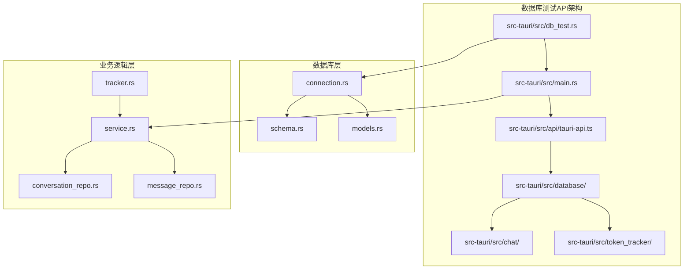

**图表来源**
- [src-tauri/src/db_test.rs](file://src-tauri/src/db_test.rs#L1-L58)
- [src-tauri/src/main.rs](file://src-tauri/src/main.rs#L217-L238)
- [src-tauri/src/database/connection.rs](file://src-tauri/src/database/connection.rs#L1-L89)

**章节来源**
- [src-tauri/src/db_test.rs](file://src-tauri/src/db_test.rs#L1-L58)
- [src-tauri/src/main.rs](file://src-tauri/src/main.rs#L217-L238)
- [src-tauri/src/api/tauri-api.ts](file://src-tauri/src/api/tauri-api.ts#L169-L176)

## 核心组件

### 数据库测试模块

数据库测试模块是整个测试框架的核心，提供了完整的数据库功能验证能力：

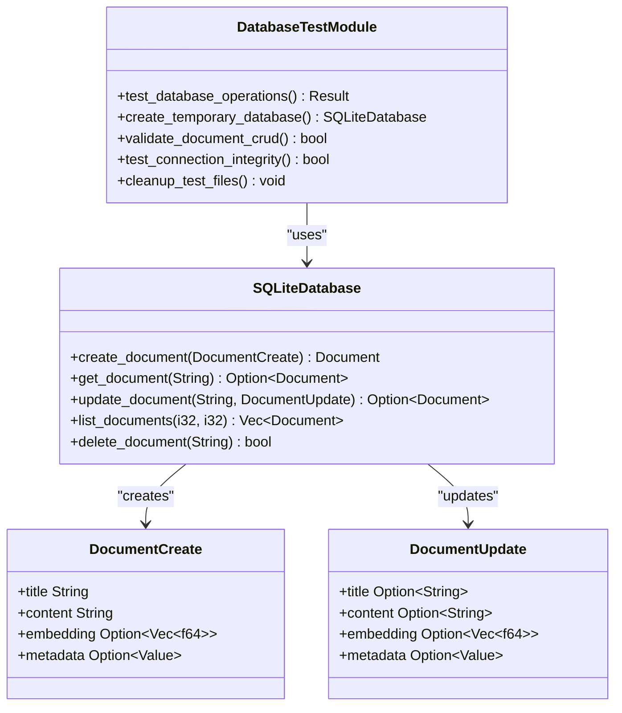

**图表来源**
- [src-tauri/src/db_test.rs](file://src-tauri/src/db_test.rs#L5-L58)
- [src-tauri/src/database/connection.rs](file://src-tauri/src/database/connection.rs#L8-L36)

### Tauri命令接口

Tauri命令接口提供了前端与后端数据库测试功能的桥梁：

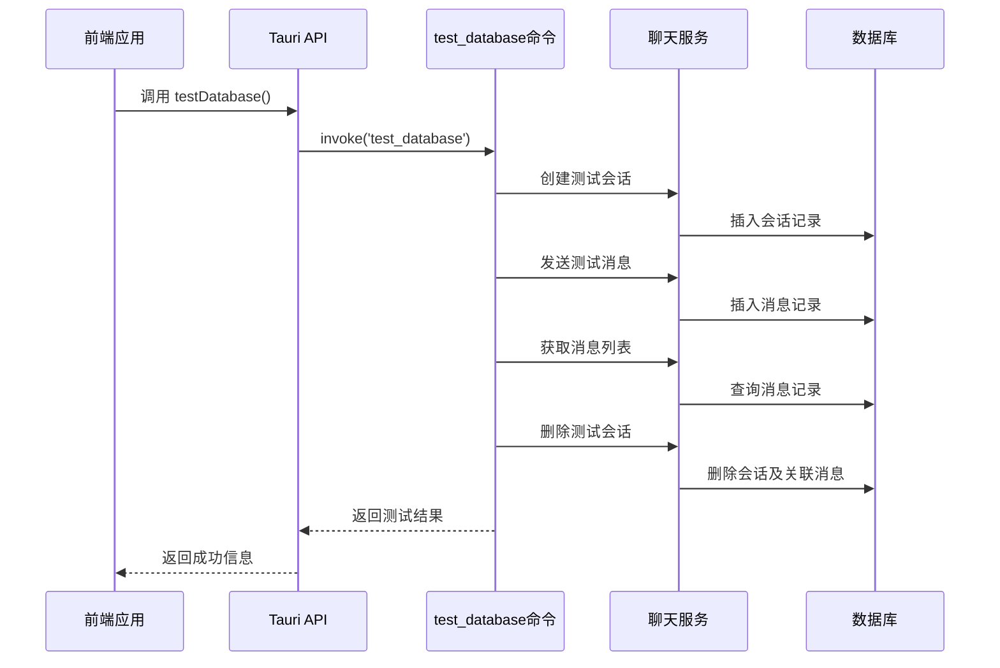

**图表来源**
- [src-tauri/src/api/tauri-api.ts](file://src-tauri/src/api/tauri-api.ts#L169-L176)
- [src-tauri/src/main.rs](file://src-tauri/src/main.rs#L219-L238)

**章节来源**
- [src-tauri/src/db_test.rs](file://src-tauri/src/db_test.rs#L5-L58)
- [src-tauri/src/api/tauri-api.ts](file://src-tauri/src/api/tauri-api.ts#L169-L176)
- [src-tauri/src/main.rs](file://src-tauri/src/main.rs#L219-L238)

## 架构概览

数据库测试API采用了分层架构设计，确保了测试功能的完整性和可维护性：

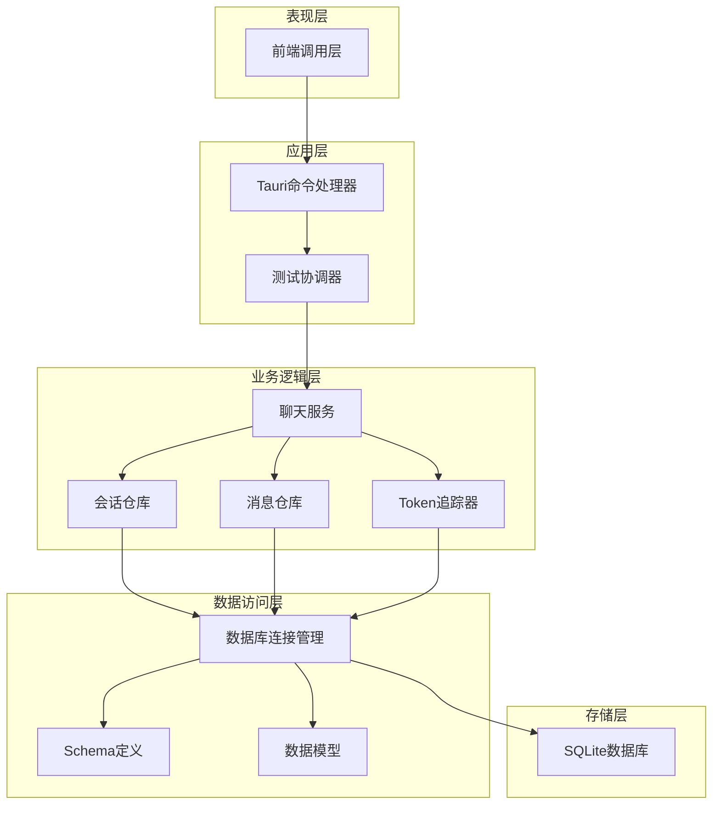

**图表来源**
- [src-tauri/src/main.rs](file://src-tauri/src/main.rs#L217-L238)
- [src-tauri/src/chat/service.rs](file://src-tauri/src/chat/service.rs#L11-L29)
- [src-tauri/src/database/connection.rs](file://src-tauri/src/database/connection.rs#L7-L36)

## 详细组件分析

### 数据库连接管理

数据库连接管理器负责SQLite数据库的初始化和连接池管理：

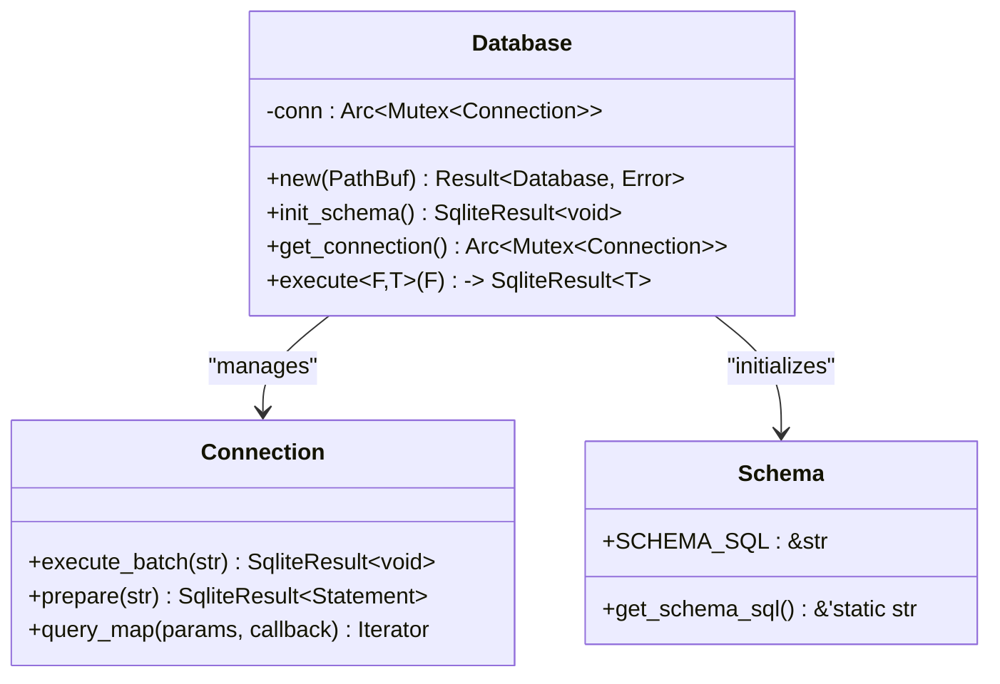

**图表来源**
- [src-tauri/src/database/connection.rs](file://src-tauri/src/database/connection.rs#L8-L58)
- [src-tauri/src/database/schema.rs](file://src-tauri/src/database/schema.rs#L1-L68)

数据库连接管理的关键特性包括：
- **线程安全**：使用Arc<Mutex<Connection>>确保多线程环境下的安全性
- **自动初始化**：创建数据库时自动启用外键约束和WAL模式
- **连接复用**：通过克隆Arc引用实现连接共享

**章节来源**
- [src-tauri/src/database/connection.rs](file://src-tauri/src/database/connection.rs#L12-L58)
- [src-tauri/src/database/schema.rs](file://src-tauri/src/database/schema.rs#L1-L68)

### 会话管理测试

会话管理测试验证了数据库中会话表的完整功能：

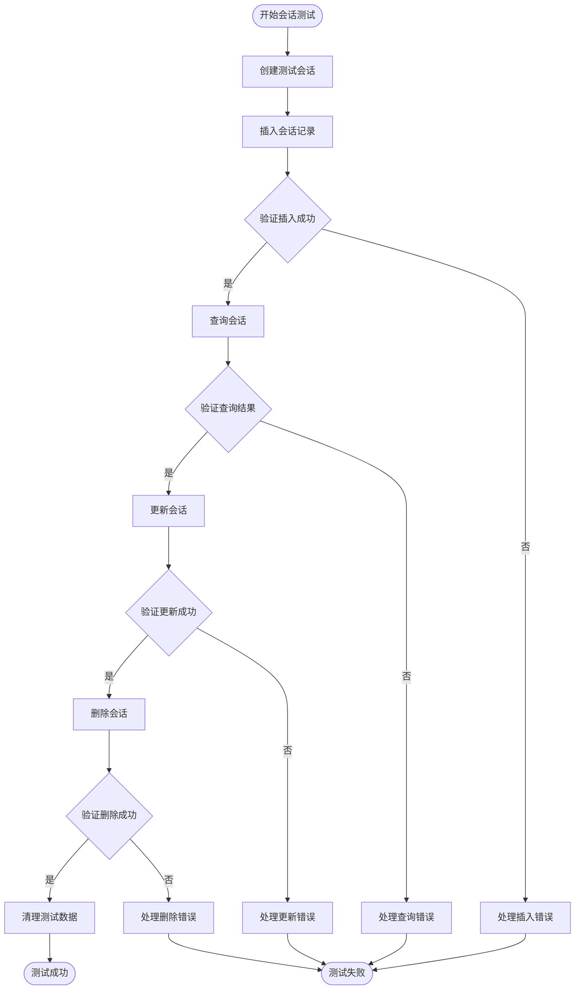

**图表来源**
- [src-tauri/src/chat/conversation_repo.rs](file://src-tauri/src/chat/conversation_repo.rs#L14-L37)
- [src-tauri/src/chat/conversation_repo.rs](file://src-tauri/src/chat/conversation_repo.rs#L146-L152)

会话管理测试涵盖了以下关键操作：
- **创建会话**：验证UUID生成和时间戳设置
- **查询会话**：测试主键查询和条件查询
- **更新会话**：验证字段更新和统计重置
- **删除会话**：测试级联删除和外键约束

**章节来源**
- [src-tauri/src/chat/conversation_repo.rs](file://src-tauri/src/chat/conversation_repo.rs#L14-L37)
- [src-tauri/src/chat/conversation_repo.rs](file://src-tauri/src/chat/conversation_repo.rs#L146-L152)

### 消息处理测试

消息处理测试验证了消息表的完整功能和外键约束：

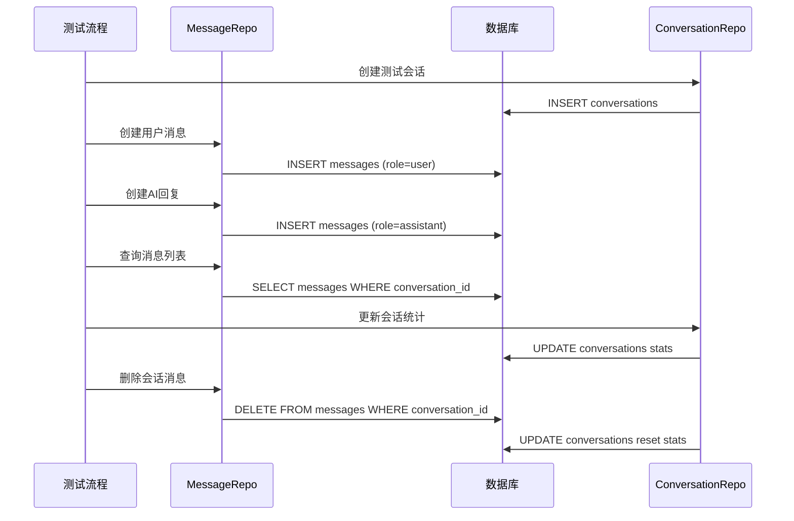

**图表来源**
- [src-tauri/src/chat/message_repo.rs](file://src-tauri/src/chat/message_repo.rs#L14-L52)
- [src-tauri/src/chat/service.rs](file://src-tauri/src/chat/service.rs#L179-L217)

消息处理测试的关键验证点：
- **消息创建**：验证UUID生成、角色分配和Token统计
- **消息查询**：测试按会话和时间排序的查询
- **消息删除**：验证级联删除机制
- **统计更新**：测试会话消息计数和Token统计

**章节来源**
- [src-tauri/src/chat/message_repo.rs](file://src-tauri/src/chat/message_repo.rs#L14-L52)
- [src-tauri/src/chat/service.rs](file://src-tauri/src/chat/service.rs#L179-L217)

### Token统计测试

Token统计测试验证了Token使用追踪功能的准确性：

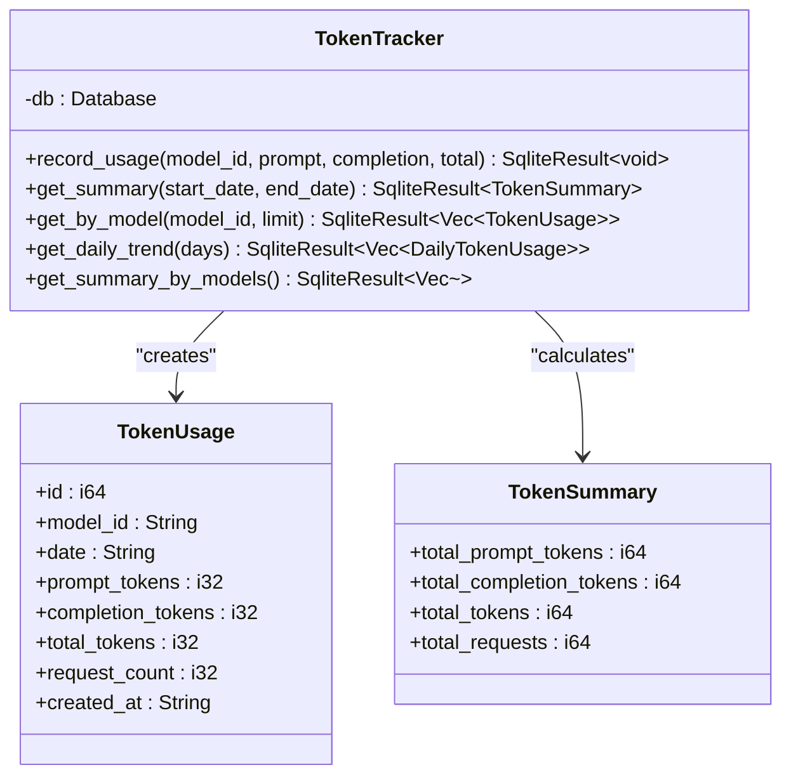

**图表来源**
- [src-tauri/src/token_tracker/tracker.rs](file://src-tauri/src/token_tracker/tracker.rs#L4-L48)
- [src-tauri/src/database/models.rs](file://src-tauri/src/database/models.rs#L48-L78)

Token统计测试的功能特性：
- **实时记录**：每次消息交互后自动更新Token使用情况
- **聚合统计**：支持按日期范围和模型维度的统计查询
- **趋势分析**：提供每日Token使用趋势的可视化数据

**章节来源**
- [src-tauri/src/token_tracker/tracker.rs](file://src-tauri/src/token_tracker/tracker.rs#L14-L48)
- [src-tauri/src/database/models.rs](file://src-tauri/src/database/models.rs#L48-L78)

## 依赖关系分析

数据库测试API的依赖关系展现了清晰的分层架构：

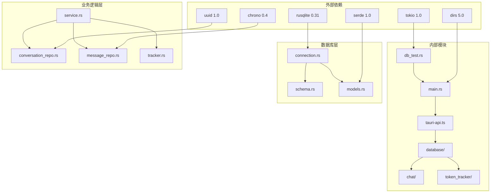

**图表来源**
- [src-tauri/Cargo.toml](file://src-tauri/Cargo.toml#L21-L25)
- [src-tauri/src/db_test.rs](file://src-tauri/src/db_test.rs#L1-L3)
- [src-tauri/src/main.rs](file://src-tauri/src/main.rs#L1-L11)

主要依赖关系特点：
- **核心数据库驱动**：rusqlite提供SQLite数据库访问能力
- **异步运行时**：tokio支持异步数据库操作
- **序列化支持**：serde实现数据模型的JSON序列化
- **唯一标识**：uuid生成全局唯一的数据库标识符

**章节来源**
- [src-tauri/Cargo.toml](file://src-tauri/Cargo.toml#L21-L25)
- [src-tauri/src/db_test.rs](file://src-tauri/src/db_test.rs#L1-L3)

## 性能考虑

数据库测试API在设计时充分考虑了性能优化：

### 连接池管理

虽然当前实现使用单个数据库连接，但架构设计支持连接池扩展：

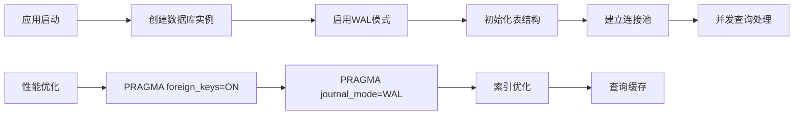

### 查询优化策略

数据库查询采用了多种优化技术：
- **外键约束**：确保数据一致性的同时维护引用完整性
- **WAL模式**：提高并发读写性能
- **索引策略**：为常用查询字段建立索引
- **批量操作**：支持批量插入和更新操作

### 内存管理

系统采用了高效的内存管理策略：
- **Arc<Mutex<Connection>>**：实现连接共享和线程安全
- **延迟加载**：按需加载数据库表结构
- **资源清理**：自动清理临时测试文件

## 故障排除指南

### 常见问题诊断

数据库测试API提供了完善的错误处理和诊断机制：

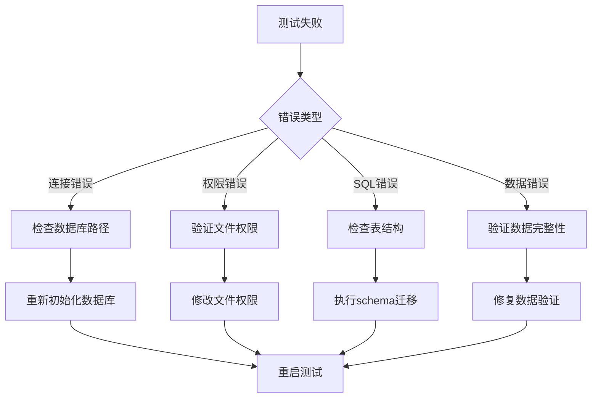

### 错误处理策略

系统实现了多层次的错误处理机制：

1. **连接层错误**：数据库连接失败、权限不足
2. **SQL层错误**：语法错误、约束违反
3. **业务层错误**：数据验证失败、业务规则冲突
4. **系统层错误**：文件系统问题、内存不足

### 调试工具

提供了丰富的调试和监控工具：
- **日志记录**：详细的测试执行日志
- **性能监控**：查询执行时间和资源使用
- **状态检查**：数据库连接和表结构验证
- **数据验证**：自动化的数据完整性检查

**章节来源**
- [docs/testing-and-optimization.md](file://docs/testing-and-optimization.md#L159-L197)

## 结论

Malou Agent的数据库测试API提供了一个完整、可靠的数据库功能验证框架。通过分层架构设计和全面的测试覆盖，该API能够有效验证数据库连接、CRUD操作和数据完整性。

主要优势包括：
- **全面测试覆盖**：从基础连接到复杂业务逻辑的完整验证
- **高性能设计**：采用WAL模式和索引优化提升查询性能
- **健壮错误处理**：多层次的错误捕获和恢复机制
- **易于扩展**：模块化设计支持功能扩展和定制

该测试API为Malou Agent的数据库稳定性提供了坚实保障，是确保应用质量和可靠性的关键基础设施。

## 附录

### 测试用例编写指南

#### 基础连接测试
```typescript
// 测试数据库连接
const result = await testDatabase();
console.log(result); // 输出测试结果
```

#### CRUD操作测试
```typescript
// 测试文档CRUD操作
const testData = {
  title: "测试文档",
  content: "测试内容",
  embedding: [0.1, 0.2, 0.3],
  metadata: { author: "test" }
};

// 创建、查询、更新、删除操作
```

#### 性能基准测试
```typescript
// 批量插入测试
const startTime = performance.now();
for (let i = 0; i < 1000; i++) {
  await createDocument(testData);
}
const endTime = performance.now();
console.log(`批量插入1000条记录耗时: ${endTime - startTime}ms`);
```

### 测试数据准备

测试数据准备的最佳实践：
- **隔离环境**：使用独立的测试数据库避免污染生产数据
- **数据清理**：测试完成后自动清理测试数据
- **边界测试**：包含空值、特殊字符、超长字符串等边界情况
- **并发测试**：模拟多用户并发访问场景

### 结果分析方法

测试结果分析的关键指标：
- **成功率**：测试用例通过率和失败率
- **性能指标**：查询响应时间、吞吐量、资源使用
- **数据完整性**：约束验证、数据一致性检查
- **稳定性评估**：长时间运行的稳定性表现