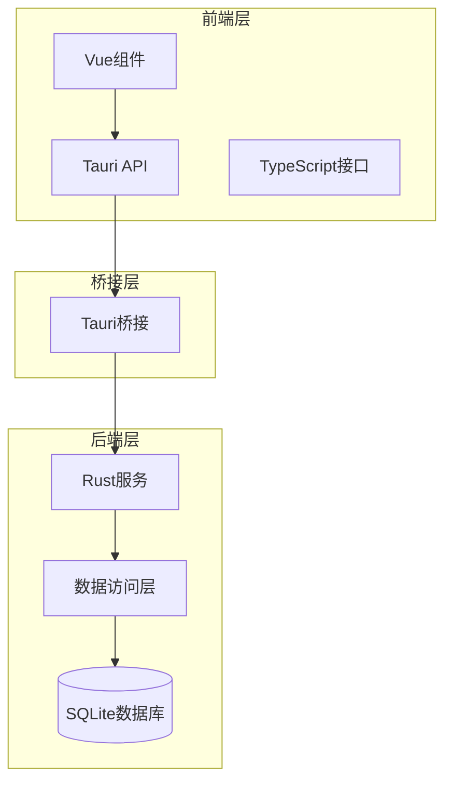
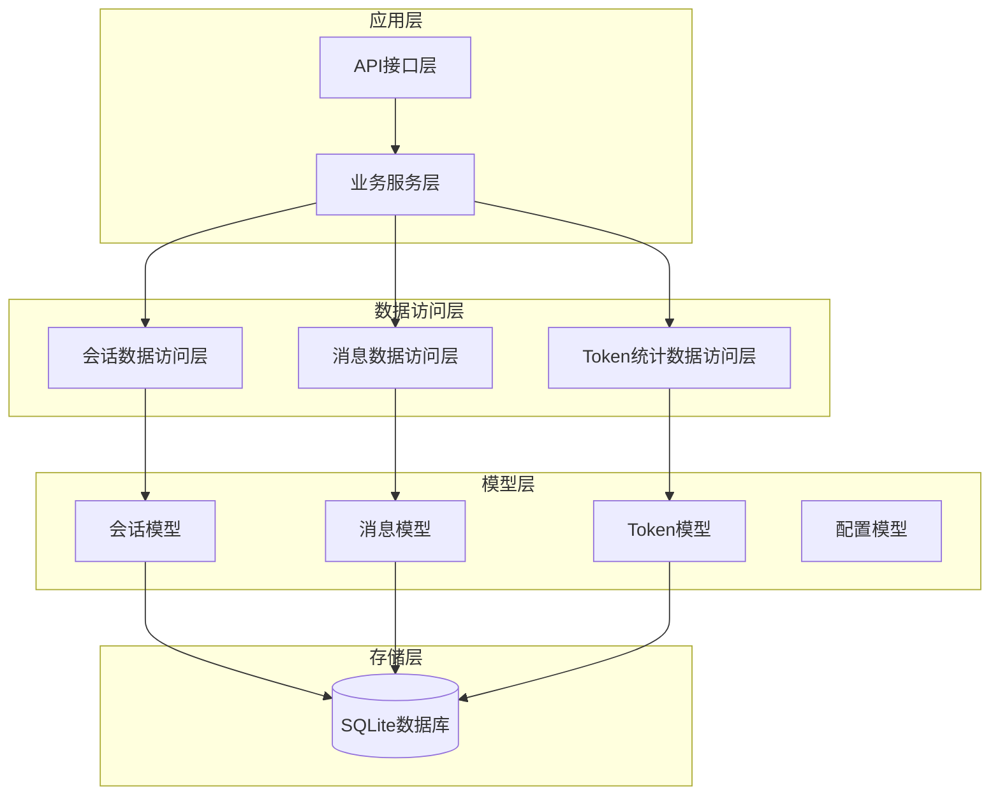
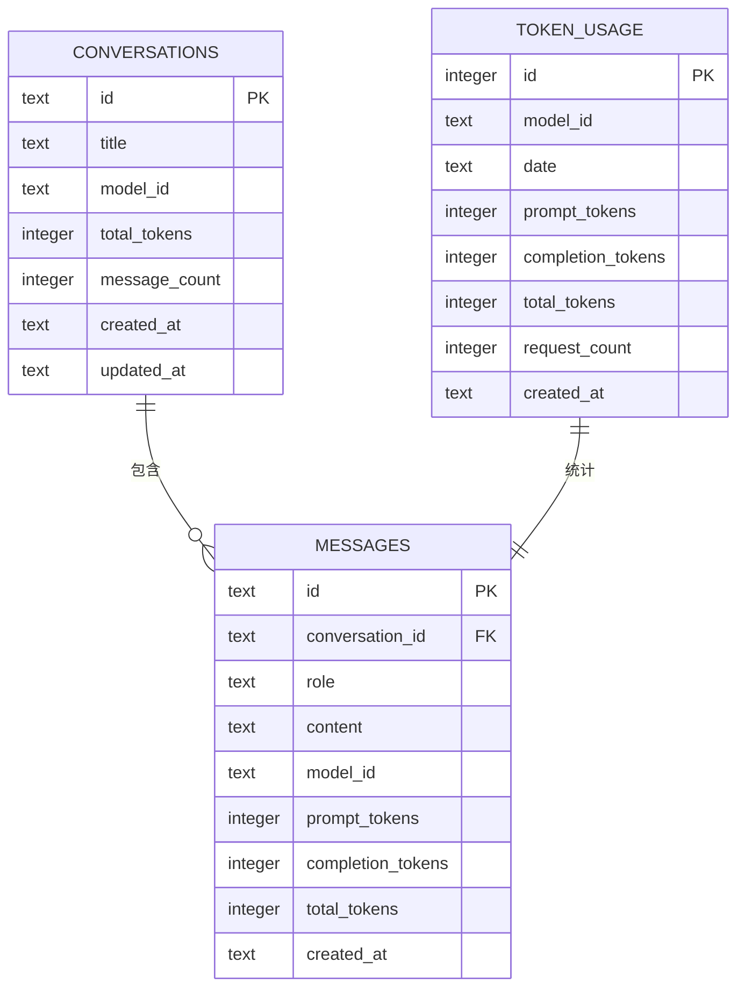
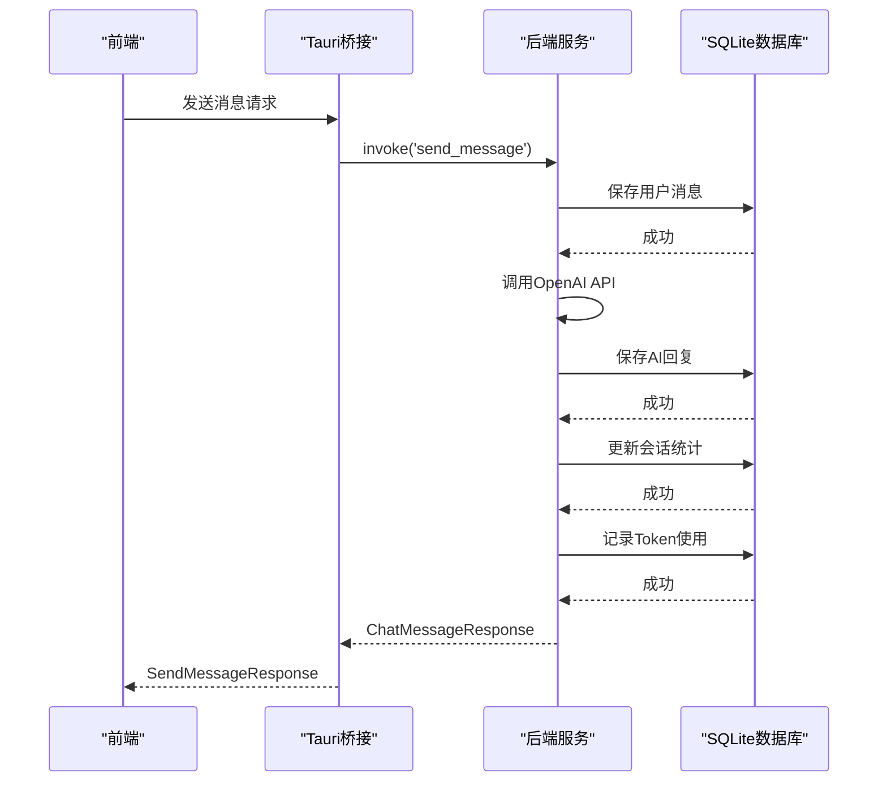
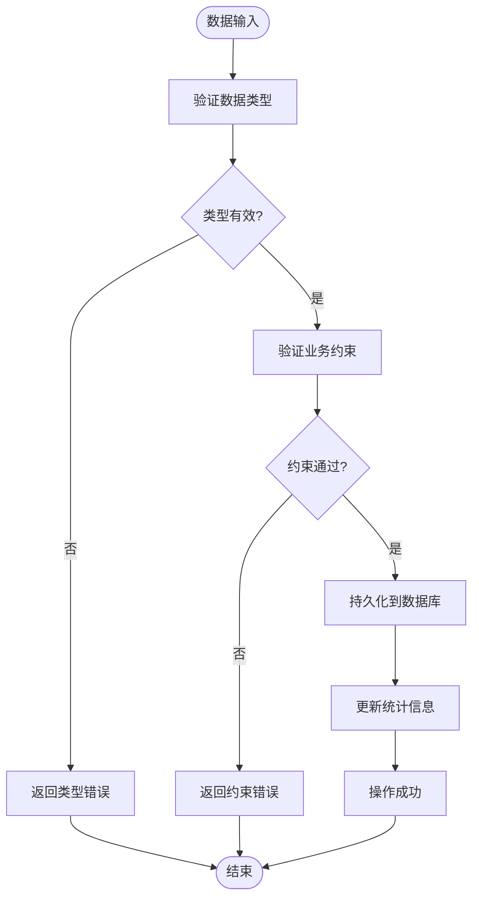
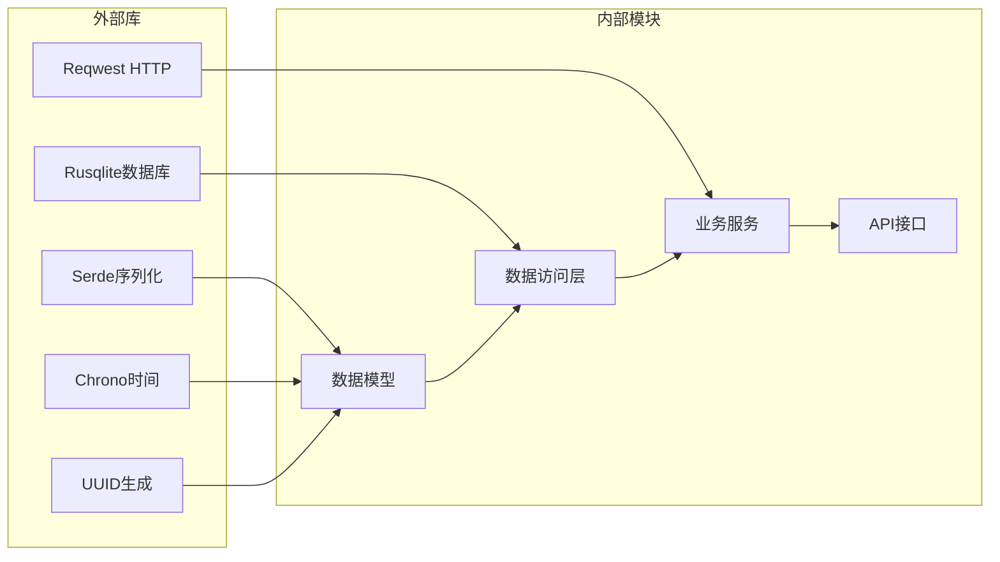

# 数据模型定义

<cite>
**本文引用的文件**
- [models.rs](file://src-tauri/src/database/models.rs)
- [schema.rs](file://src-tauri/src/database/schema.rs)
- [conversation_repo.rs](file://src-tauri/src/chat/conversation_repo.rs)
- [message_repo.rs](file://src-tauri/src/chat/message_repo.rs)
- [tracker.rs](file://src-tauri/src/token_tracker/tracker.rs)
- [service.rs](file://src-tauri/src/chat/service.rs)
- [openai_client.rs](file://src-tauri/src/chat/openai_client.rs)
- [main.rs](file://src-tauri/src/main.rs)
- [tauri-api.ts](file://src/api/tauri-api.ts)
- [model-config.ts](file://src/config/model-config.ts)
- [mod.rs](file://src-tauri/src/config/mod.rs)
</cite>

## 目录
1. [简介](#简介)
2. [项目结构](#项目结构)
3. [核心数据模型](#核心数据模型)
4. [架构概览](#架构概览)
5. [详细组件分析](#详细组件分析)
6. [依赖关系分析](#依赖关系分析)
7. [性能考虑](#性能考虑)
8. [故障排除指南](#故障排除指南)
9. [结论](#结论)

## 简介

Malou Agent是一个基于Tauri和Vue的桌面AI助手应用，本文件详细描述了其核心数据模型定义，包括会话、消息、消息发送、Token统计和配置等关键数据结构。文档提供了字段说明、数据类型、约束条件和使用场景，并展示了模型之间的关系图、序列化/反序列化规则和数据验证逻辑。

## 项目结构

Malou Agent采用前后端分离的架构设计，后端使用Rust实现，前端使用TypeScript/Vue开发，通过Tauri进行桥接。

**图表来源**
- [main.rs](file://src-tauri/src/main.rs#L1-L316)
- [tauri-api.ts](file://src/api/tauri-api.ts#L1-L242)

**章节来源**
- [main.rs](file://src-tauri/src/main.rs#L1-L316)
- [tauri-api.ts](file://src/api/tauri-api.ts#L1-L242)

## 核心数据模型

### 会话模型 (Conversation)

会话模型表示一次完整的对话历史，包含会话的基本信息和统计指标。

| 字段名 | 类型 | 允许为空 | 约束条件 | 描述 |
|--------|------|----------|----------|------|
| id | String | 否 | 主键 | 会话唯一标识符 |
| title | String | 否 | 非空 | 会话标题 |
| model_id | Option<String> | 是 | 外键引用模型 | 使用的模型标识符 |
| total_tokens | i32 | 否 | 默认值0 | 该会话累计使用的Token数 |
| message_count | i32 | 否 | 默认值0 | 该会话消息总数 |
| created_at | String | 否 | 非空 | 创建时间（RFC3339格式） |
| updated_at | String | 否 | 非空 | 更新时间（RFC3339格式） |

**章节来源**
- [models.rs](file://src-tauri/src/database/models.rs#L4-L13)
- [schema.rs](file://src-tauri/src/database/schema.rs#L4-L12)

### 消息模型 (Message)

消息模型表示对话中的单条消息，包含消息内容和Token使用统计。

| 字段名 | 类型 | 允许为空 | 约束条件 | 描述 |
|--------|------|----------|----------|------|
| id | String | 否 | 主键 | 消息唯一标识符 |
| conversation_id | String | 否 | 外键引用会话 | 所属会话标识符 |
| role | String | 否 | 枚举："user" \| "assistant" \| "system" | 消息角色 |
| content | String | 否 | 非空 | 消息内容 |
| model_id | Option<String> | 是 | 外键引用模型 | 使用的模型标识符 |
| prompt_tokens | i32 | 否 | 默认值0 | 提示Token数 |
| completion_tokens | i32 | 否 | 默认值0 | 补全Token数 |
| total_tokens | i32 | 否 | 默认值0 | 总Token数 |
| created_at | String | 否 | 非空 | 创建时间（RFC3339格式） |

**章节来源**
- [models.rs](file://src-tauri/src/database/models.rs#L23-L34)
- [schema.rs](file://src-tauri/src/database/schema.rs#L18-L29)

### 消息发送请求/响应模型

#### SendMessageRequest
- conversation_id: String - 会话标识符
- content: String - 消息内容

#### SendMessageResponse
- id: String - 消息标识符
- content: String - 消息内容
- role: String - 消息角色
- conversation_id: String - 会话标识符
- timestamp: String - 时间戳
- prompt_tokens: i32 - 提示Token数
- completion_tokens: i32 - 补全Token数
- total_tokens: i32 - 总Token数

**章节来源**
- [main.rs](file://src-tauri/src/main.rs#L32-L49)
- [tauri-api.ts](file://src/api/tauri-api.ts#L28-L42)

### Token统计模型

#### TokenUsage
- id: i64 - 自增主键
- model_id: String - 模型标识符
- date: String - 日期（YYYY-MM-DD）
- prompt_tokens: i32 - 提示Token数
- completion_tokens: i32 - 补全Token数
- total_tokens: i32 - 总Token数
- request_count: i32 - 请求次数
- created_at: String - 创建时间

#### TokenSummary
- total_prompt_tokens: i64 - 总提示Token数
- total_completion_tokens: i64 - 总补全Token数
- total_tokens: i64 - 总Token数
- total_requests: i64 - 总请求数

#### DailyTokenUsage
- date: String - 日期
- prompt_tokens: i32 - 提示Token数
- completion_tokens: i32 - 补全Token数
- total_tokens: i32 - 总Token数
- request_count: i32 - 请求次数

**章节来源**
- [models.rs](file://src-tauri/src/database/models.rs#L49-L78)

### OpenAI配置模型

#### OpenAIConfig
- api_key: String - API密钥
- api_base: String - API基础URL
- model: String - 模型名称
- temperature: f32 - 生成温度

**章节来源**
- [main.rs](file://src-tauri/src/main.rs#L24-L29)

## 架构概览

Malou Agent的数据架构采用分层设计，实现了清晰的职责分离和数据一致性保证。

**图表来源**
- [service.rs](file://src-tauri/src/chat/service.rs#L1-L224)
- [conversation_repo.rs](file://src-tauri/src/chat/conversation_repo.rs#L1-L161)
- [message_repo.rs](file://src-tauri/src/chat/message_repo.rs#L1-L175)
- [tracker.rs](file://src-tauri/src/token_tracker/tracker.rs#L1-L195)

## 详细组件分析

### 数据模型关系图

**图表来源**
- [schema.rs](file://src-tauri/src/database/schema.rs#L4-L62)

### 序列化/反序列化规则

所有数据模型都实现了Serde的Serialize和Deserialize特性，确保在Rust和JavaScript之间进行无缝转换。

**图表来源**
- [service.rs](file://src-tauri/src/chat/service.rs#L95-L177)
- [openai_client.rs](file://src-tauri/src/chat/openai_client.rs#L75-L116)

### 数据验证逻辑

系统实现了多层次的数据验证机制：

1. **数据库层面约束**：通过SQL约束确保数据完整性
2. **业务逻辑验证**：在服务层进行业务规则检查
3. **前端类型验证**：TypeScript接口定义确保类型安全

**图表来源**
- [conversation_repo.rs](file://src-tauri/src/chat/conversation_repo.rs#L103-L116)
- [message_repo.rs](file://src-tauri/src/chat/message_repo.rs#L18-L21)

**章节来源**
- [models.rs](file://src-tauri/src/database/models.rs#L1-L110)
- [schema.rs](file://src-tauri/src/database/schema.rs#L1-L68)

## 依赖关系分析

### Rust结构体与TypeScript接口映射

| Rust结构体 | TypeScript接口 | 映射关系 |
|------------|----------------|----------|
| Conversation | Conversation | 完全一致 |
| Message | Message | 完全一致 |
| TokenUsage | DailyTokenUsage | 字段映射 |
| TokenSummary | TokenSummary | 字段映射 |
| OpenAIConfig | OpenAIConfig | 字段映射 |

### 外部依赖

**图表来源**
- [models.rs](file://src-tauri/src/database/models.rs#L1-L2)
- [openai_client.rs](file://src-tauri/src/chat/openai_client.rs#L1-L2)

**章节来源**
- [main.rs](file://src-tauri/src/main.rs#L1-L13)
- [openai_client.rs](file://src-tauri/src/chat/openai_client.rs#L1-L141)

## 性能考虑

### 数据库优化策略

1. **索引优化**：
   - 会话表按updated_at降序索引
   - 消息表按conversation_id和created_at组合索引
   - Token统计表按model_id和date组合索引

2. **查询优化**：
   - 使用LIMIT和OFFSET实现分页
   - 限制历史消息获取数量（默认20条）
   - 使用聚合查询优化统计计算

3. **缓存策略**：
   - 内存中缓存OpenAI客户端配置
   - 会话统计信息实时更新

### 并发处理

系统采用Mutex和Arc进行并发控制，确保线程安全的数据访问。

**章节来源**
- [schema.rs](file://src-tauri/src/database/schema.rs#L14-L47)
- [service.rs](file://src-tauri/src/chat/service.rs#L1-L224)

## 故障排除指南

### 常见问题及解决方案

1. **数据库连接失败**
   - 检查数据库文件路径权限
   - 验证数据库文件完整性
   - 确认SQLite驱动正确安装

2. **Token统计异常**
   - 检查Token使用记录是否正确写入
   - 验证日期格式一致性
   - 确认统计查询逻辑正确

3. **消息同步问题**
   - 检查外键约束是否满足
   - 验证消息时序一致性
   - 确认会话统计更新逻辑

4. **配置加载失败**
   - 检查配置文件JSON格式
   - 验证配置项完整性
   - 确认默认配置回退机制

**章节来源**
- [main.rs](file://src-tauri/src/main.rs#L220-L238)
- [tracker.rs](file://src-tauri/src/token_tracker/tracker.rs#L14-L48)

## 结论

Malou Agent的数据模型设计体现了现代应用架构的最佳实践，通过清晰的分层设计、严格的类型约束和完善的错误处理机制，确保了系统的可靠性、可维护性和扩展性。数据模型之间的关系明确，序列化/反序列化规则统一，为后续的功能扩展和性能优化奠定了坚实的基础。