# 配置管理API

<cite>
**本文档引用的文件**
- [config-api.ts](file://src/api/config-api.ts)
- [tauri-api.ts](file://src/api/tauri-api.ts)
- [mod.rs](file://src-tauri/src/config/mod.rs)
- [main.rs](file://src-tauri/src/main.rs)
- [model-config.ts](file://src/config/model-config.ts)
- [app-settings.ts](file://src/config/app-settings.ts)
- [openai_client.rs](file://src-tauri/src/chat/openai_client.rs)
- [configuration-management.md](file://docs/configuration-management.md)
</cite>

## 目录
1. [简介](#简介)
2. [项目结构](#项目结构)
3. [核心组件](#核心组件)
4. [架构概览](#架构概览)
5. [详细组件分析](#详细组件分析)
6. [依赖关系分析](#依赖关系分析)
7. [性能考虑](#性能考虑)
8. [故障排除指南](#故障排除指南)
9. [结论](#结论)

## 简介

Malou Agent的配置管理API提供了完整的配置系统，支持OpenAI配置管理和应用配置管理两大核心功能。该系统采用前后端分离的设计模式，前端负责用户界面交互和配置验证，后端负责配置持久化和业务逻辑处理。

系统支持多种配置类型，包括OpenAI API配置、应用全局配置、本地模型配置、ONNX功能配置等，并提供了配置验证、安全存储、错误处理、热重载等高级特性。

## 项目结构

配置管理系统的整体架构分为三个层次：

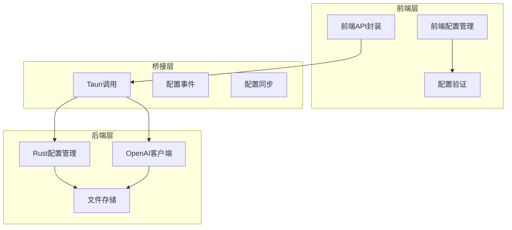

**图表来源**
- [config-api.ts](file://src/api/config-api.ts#L1-L201)
- [tauri-api.ts](file://src/api/tauri-api.ts#L1-L242)
- [mod.rs](file://src-tauri/src/config/mod.rs#L1-L334)
- [main.rs](file://src-tauri/src/main.rs#L1-L316)

**章节来源**
- [config-api.ts](file://src/api/config-api.ts#L1-L201)
- [tauri-api.ts](file://src/api/tauri-api.ts#L1-L242)
- [mod.rs](file://src-tauri/src/config/mod.rs#L1-L334)

## 核心组件

### 配置数据结构

系统定义了完整的配置数据结构，支持多层级配置管理：

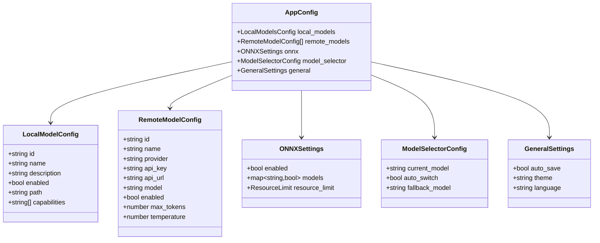

**图表来源**
- [model-config.ts](file://src/config/model-config.ts#L3-L56)
- [mod.rs](file://src-tauri/src/config/mod.rs#L8-L65)

### OpenAI配置结构

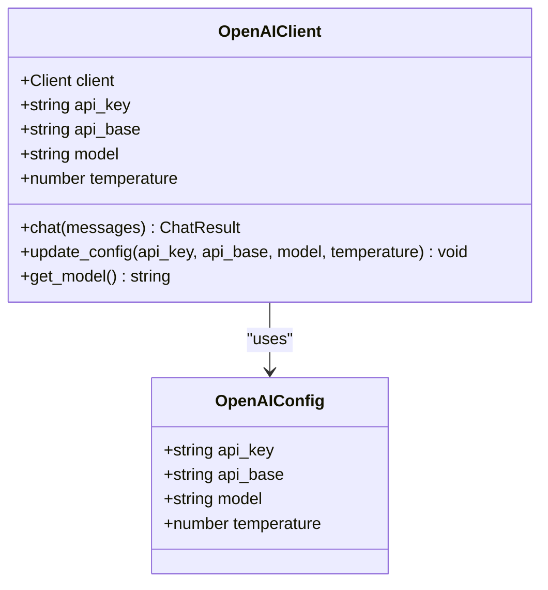

**图表来源**
- [tauri-api.ts](file://src/api/tauri-api.ts#L59-L64)
- [openai_client.rs](file://src-tauri/src/chat/openai_client.rs#L5-L11)

**章节来源**
- [model-config.ts](file://src/config/model-config.ts#L1-L163)
- [tauri-api.ts](file://src/api/tauri-api.ts#L59-L64)
- [openai_client.rs](file://src-tauri/src/chat/openai_client.rs#L1-L141)

## 架构概览

配置管理系统的整体架构采用分层设计，确保了良好的可维护性和扩展性：

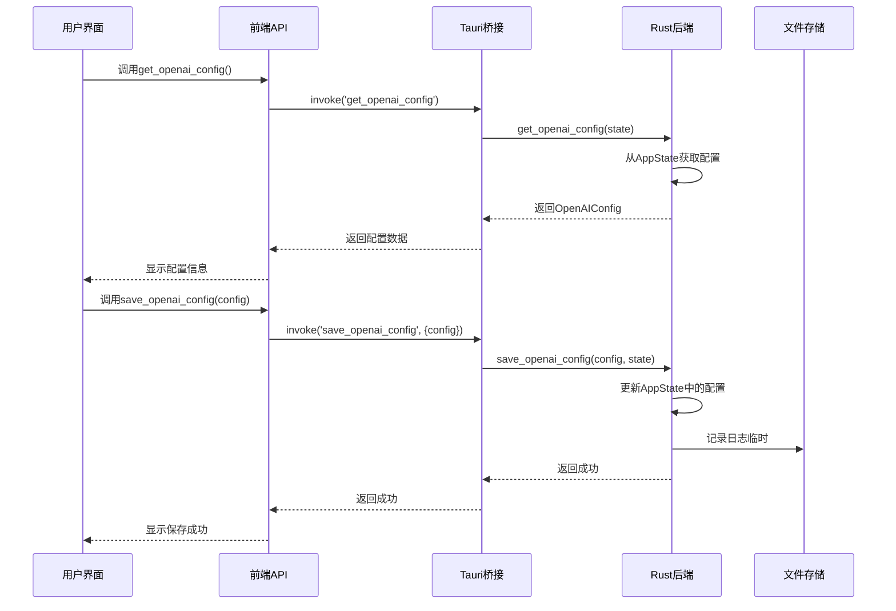

**图表来源**
- [main.rs](file://src-tauri/src/main.rs#L190-L215)
- [tauri-api.ts](file://src/api/tauri-api.ts#L155-L167)

## 详细组件分析

### OpenAI配置API

#### get_openai_config函数

OpenAI配置获取函数提供了安全的配置读取机制：

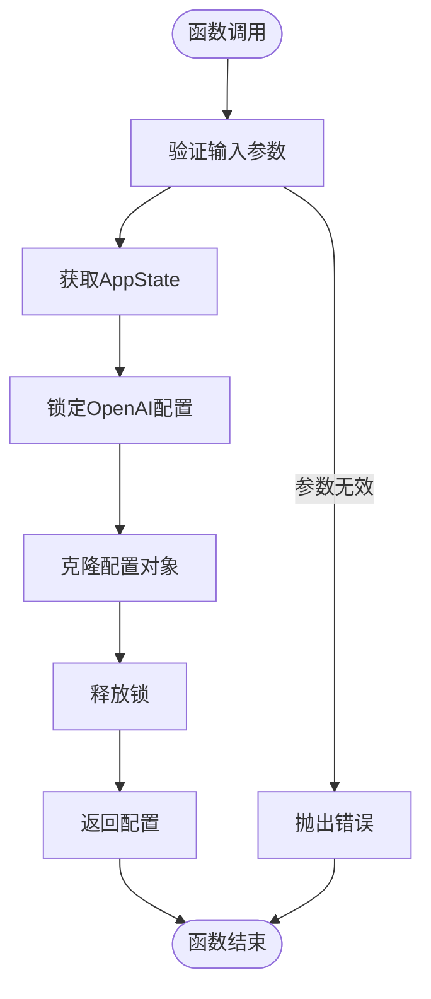

**图表来源**
- [main.rs](file://src-tauri/src/main.rs#L190-L196)

#### save_openai_config函数

配置保存函数实现了安全的配置更新机制：

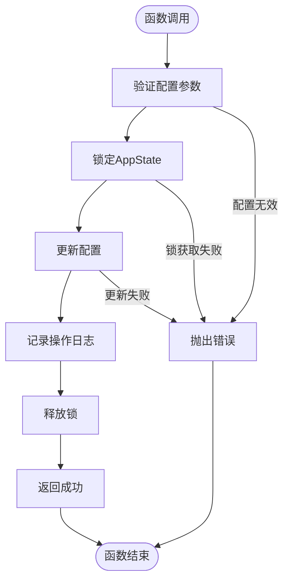

**图表来源**
- [main.rs](file://src-tauri/src/main.rs#L198-L215)

**章节来源**
- [main.rs](file://src-tauri/src/main.rs#L190-L215)
- [tauri-api.ts](file://src/api/tauri-api.ts#L155-L167)

### 应用配置API

#### 配置验证机制

应用配置验证提供了多层次的验证机制：

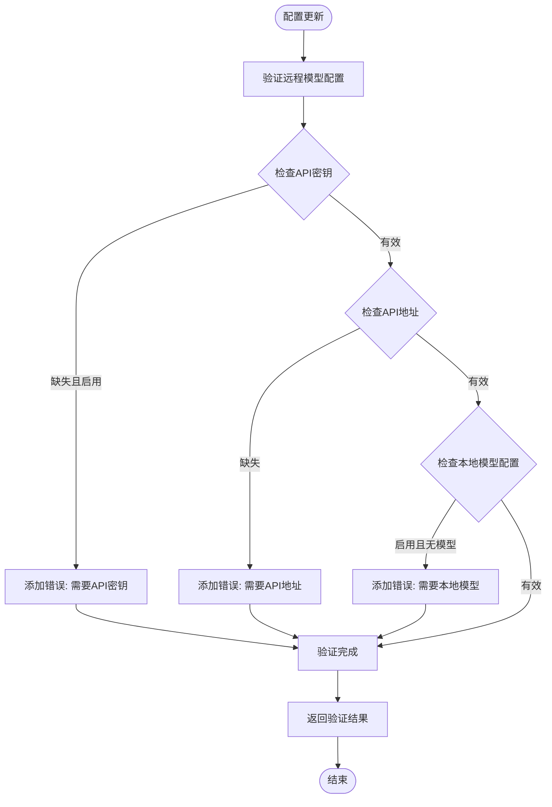

**图表来源**
- [model-config.ts](file://src/config/model-config.ts#L119-L138)

#### 配置合并策略

配置合并函数实现了智能的配置合并策略：

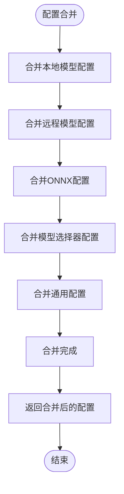

**图表来源**
- [model-config.ts](file://src/config/model-config.ts#L140-L163)

**章节来源**
- [model-config.ts](file://src/config/model-config.ts#L119-L163)
- [app-settings.ts](file://src/config/app-settings.ts#L25-L51)

### 配置存储与持久化

#### 文件存储机制

配置文件采用JSON格式进行持久化存储：

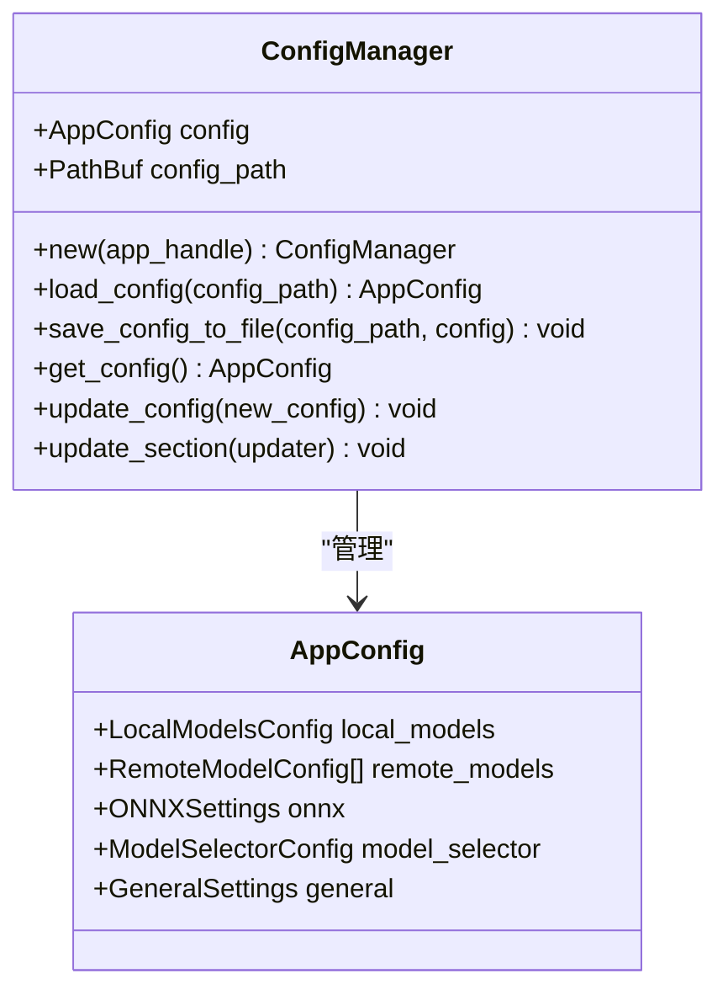

**图表来源**
- [mod.rs](file://src-tauri/src/config/mod.rs#L144-L248)

#### 默认配置策略

系统提供了完善的默认配置机制：

| 配置类别 | 默认值 | 描述 |
|---------|--------|------|
| 本地模型启用 | true | 启用本地模型功能 |
| GPT-3.5 Turbo | 启用 | 默认远程模型 |
| ONNX功能 | 启用 | 启用ONNX推理功能 |
| 嵌入模型 | true | 启用文本嵌入功能 |
| NER模型 | false | 命名实体识别模型禁用 |
| 分类模型 | false | 文本分类模型禁用 |
| 最大内存 | 512MB | ONNX资源限制 |
| 最大线程数 | 4 | ONNX并发限制 |
| 自动保存 | true | 启用自动保存功能 |
| 主题 | light | 默认浅色主题 |
| 语言 | zh | 默认中文界面 |

**章节来源**
- [mod.rs](file://src-tauri/src/config/mod.rs#L80-L142)

### 配置热重载机制

#### 配置同步管理器

配置同步管理器提供了实时的配置变更检测：

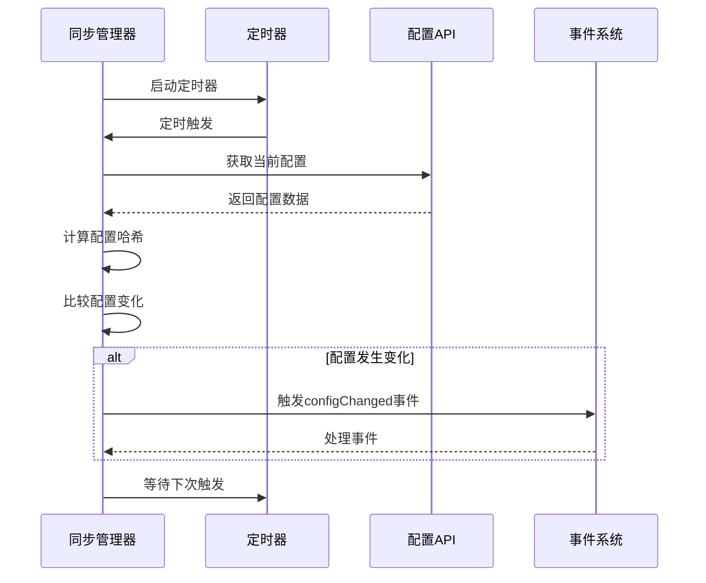

**图表来源**
- [config-api.ts](file://src/api/config-api.ts#L169-L199)

#### 配置事件系统

配置事件系统提供了灵活的配置变更通知机制：

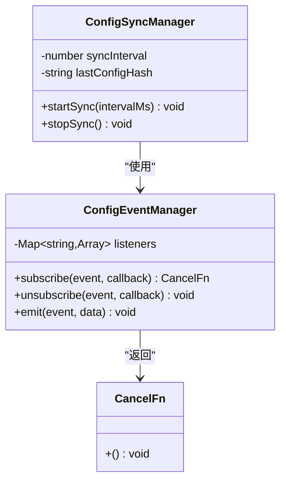

**图表来源**
- [config-api.ts](file://src/api/config-api.ts#L137-L166)

**章节来源**
- [config-api.ts](file://src/api/config-api.ts#L137-L199)

## 依赖关系分析

配置管理系统的依赖关系体现了清晰的分层架构：

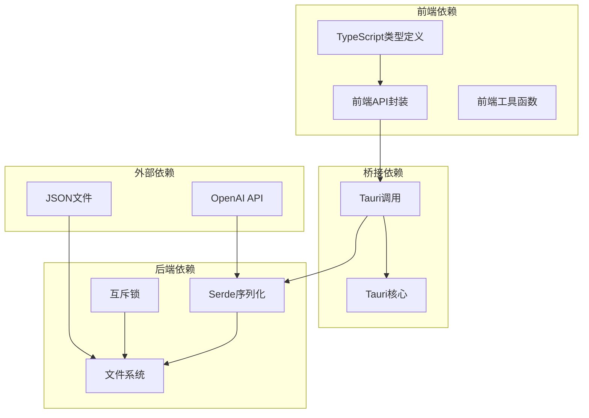

**图表来源**
- [config-api.ts](file://src/api/config-api.ts#L1-L201)
- [mod.rs](file://src-tauri/src/config/mod.rs#L1-L334)

**章节来源**
- [config-api.ts](file://src/api/config-api.ts#L1-L201)
- [mod.rs](file://src-tauri/src/config/mod.rs#L1-L334)

## 性能考虑

### 配置访问优化

系统采用了多种性能优化策略：

1. **缓存机制**: 配置管理器使用内存缓存减少磁盘I/O操作
2. **增量更新**: 支持部分配置更新，避免全量配置重写
3. **异步处理**: 所有配置操作都采用异步方式，避免阻塞UI线程
4. **哈希比较**: 使用配置哈希值快速检测配置变化

### 内存管理

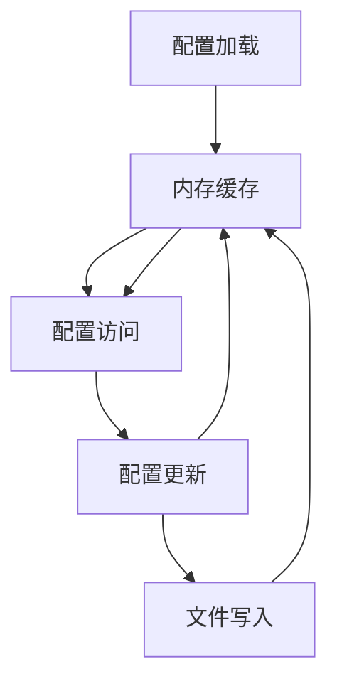

**图表来源**
- [mod.rs](file://src-tauri/src/config/mod.rs#L167-L187)

## 故障排除指南

### 常见问题及解决方案

#### 配置加载失败

**问题描述**: 应用启动时配置文件加载失败

**可能原因**:
1. 配置文件损坏或格式错误
2. 文件权限不足
3. 配置文件路径不存在

**解决方案**:
1. 检查配置文件格式是否正确
2. 确认应用程序具有文件读写权限
3. 验证配置文件路径的有效性

#### 配置验证错误

**问题描述**: 配置更新时出现验证错误

**常见错误类型**:
1. **API密钥缺失**: 远程模型启用但未配置API密钥
2. **API地址无效**: 远程模型API地址为空或格式错误
3. **本地模型配置错误**: 启用了本地模型但未配置任何模型

**解决步骤**:
1. 检查所有启用的远程模型是否都有有效的API密钥
2. 验证API地址格式是否符合要求
3. 确认至少配置了一个本地模型

#### 配置同步问题

**问题描述**: 配置变更后其他窗口未及时更新

**排查方法**:
1. 检查配置同步管理器是否正常启动
2. 验证配置事件系统是否正常工作
3. 确认定时器是否按预期执行

**章节来源**
- [model-config.ts](file://src/config/model-config.ts#L119-L138)
- [app-settings.ts](file://src/config/app-settings.ts#L152-L171)

## 结论

Malou Agent的配置管理API提供了完整、安全、高效的配置管理解决方案。系统通过前后端分离的设计模式，结合完善的配置验证、安全存储、错误处理和热重载机制，为用户提供了优秀的配置管理体验。

主要特点包括：
- **安全性**: 支持敏感信息的安全存储和传输
- **可靠性**: 提供完整的错误处理和恢复机制
- **可扩展性**: 模块化的架构设计便于功能扩展
- **易用性**: 直观的API接口和丰富的配置选项

未来可以考虑的功能增强：
1. 配置版本控制和回滚机制
2. 更强大的配置导入导出功能
3. 配置模板和预设方案
4. 配置同步到云端的能力