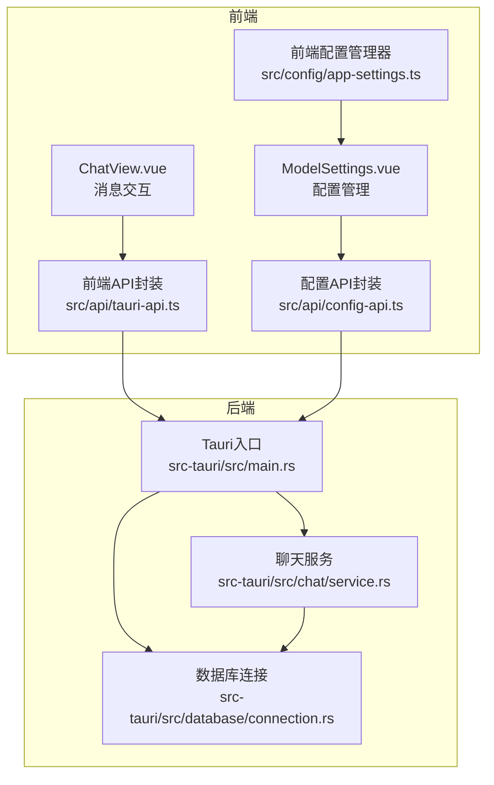
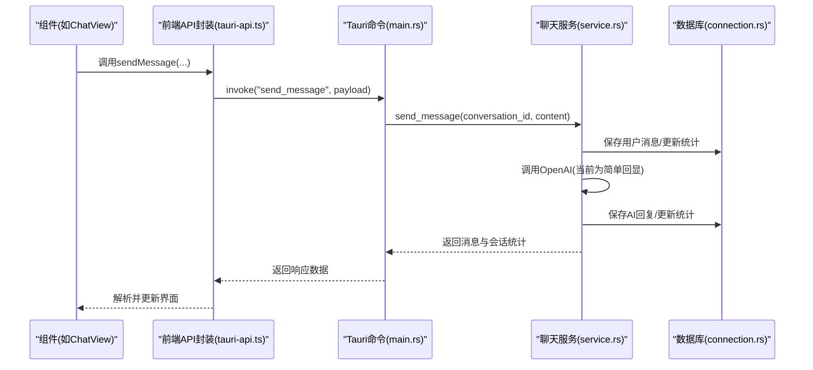
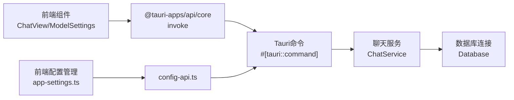

# API集成

<cite>
**本文引用的文件**
- [src/api/tauri-api.ts](file://src/api/tauri-api.ts)
- [src/api/config-api.ts](file://src/api/config-api.ts)
- [src-tauri/src/main.rs](file://src-tauri/src/main.rs)
- [src-tauri/tauri.conf.json](file://src-tauri/tauri.conf.json)
- [src-tauri/src/chat/service.rs](file://src-tauri/src/chat/service.rs)
- [src-tauri/src/database/connection.rs](file://src-tauri/src/database/connection.rs)
- [src/components/business/ChatView.vue](file://src/components/business/ChatView.vue)
- [src/components/settings/ModelSettings.vue](file://src/components/settings/ModelSettings.vue)
- [src/config/app-settings.ts](file://src/config/app-settings.ts)
- [src/config/model-config.ts](file://src/config/model-config.ts)
- [src/utils/logger.ts](file://src/utils/logger.ts)
- [TAURI_VUE_INTEGRATION_BEST_PRACTICES.md](file://TAURI_VUE_INTEGRATION_BEST_PRACTICES.md)
</cite>

## 目录
1. [简介](#简介)
2. [项目结构](#项目结构)
3. [核心组件](#核心组件)
4. [架构总览](#架构总览)
5. [详细组件分析](#详细组件分析)
6. [依赖关系分析](#依赖关系分析)
7. [性能考量](#性能考量)
8. [故障排查指南](#故障排查指南)
9. [结论](#结论)
10. [附录](#附录)

## 简介
本文件聚焦Malou Agent中基于Tauri的API集成方案，系统性阐述前端如何通过@tauri-apps/api调用后端命令，以及tauri-api.ts中的API封装模式。内容涵盖：
- 前后端命令映射与调用流程
- 请求参数校验、响应数据处理与错误处理机制
- 配置API的实现与模型配置、应用设置、数据库连接管理
- 异步处理模式（loading状态、并发控制、重试机制）
- 最佳实践（类型安全、错误边界、用户体验优化）
- 具体组件调用示例与异常处理策略

## 项目结构
Malou Agent采用前后端分离的Tauri架构：
- 前端（Vue 3 + TypeScript）通过@tauri-apps/api的invoke函数调用后端命令
- 后端（Rust）通过#[tauri::command]声明命令，并在main.rs中注册
- 数据库采用SQLite，通过rusqlite连接管理器统一访问
- 配置管理分为前端本地配置与后端配置命令两套体系

图表来源
- [src/api/tauri-api.ts](file://src/api/tauri-api.ts#L1-L242)
- [src/api/config-api.ts](file://src/api/config-api.ts#L1-L201)
- [src-tauri/src/main.rs](file://src-tauri/src/main.rs#L1-L316)
- [src-tauri/src/chat/service.rs](file://src-tauri/src/chat/service.rs#L1-L224)
- [src-tauri/src/database/connection.rs](file://src-tauri/src/database/connection.rs#L1-L89)

章节来源
- [src/api/tauri-api.ts](file://src/api/tauri-api.ts#L1-L242)
- [src-tauri/src/main.rs](file://src-tauri/src/main.rs#L242-L316)

## 核心组件
- 前端API封装（tauri-api.ts）：定义数据类型、封装会话/消息/Token统计/OpenAI配置/数据库测试等命令调用
- 配置API封装（config-api.ts）：封装应用配置获取/更新、模型选择、ONNX开关、配置事件监听与同步
- 后端命令（main.rs）：注册并实现所有Tauri命令，桥接聊天服务与数据库
- 聊天服务（service.rs）：封装会话/消息操作、OpenAI客户端、Token统计
- 数据库连接（connection.rs）：SQLite连接管理、WAL模式、外键约束、表结构初始化
- 前端配置管理（app-settings.ts）：本地持久化、响应式配置、模型选择逻辑
- 组件（ChatView.vue、ModelSettings.vue）：实际调用API并处理UI状态

章节来源
- [src/api/tauri-api.ts](file://src/api/tauri-api.ts#L6-L242)
- [src/api/config-api.ts](file://src/api/config-api.ts#L1-L201)
- [src-tauri/src/main.rs](file://src-tauri/src/main.rs#L60-L316)
- [src-tauri/src/chat/service.rs](file://src-tauri/src/chat/service.rs#L1-L224)
- [src-tauri/src/database/connection.rs](file://src-tauri/src/database/connection.rs#L1-L89)
- [src/config/app-settings.ts](file://src/config/app-settings.ts#L1-L195)

## 架构总览
前端通过invoke调用后端命令，后端命令委托给聊天服务执行数据库操作与OpenAI交互，最终返回统一的数据结构。

图表来源
- [src/api/tauri-api.ts](file://src/api/tauri-api.ts#L108-L110)
- [src-tauri/src/main.rs](file://src-tauri/src/main.rs#L140-L161)
- [src-tauri/src/chat/service.rs](file://src-tauri/src/chat/service.rs#L94-L177)
- [src-tauri/src/database/connection.rs](file://src-tauri/src/database/connection.rs#L50-L57)

## 详细组件分析

### 前端API封装（tauri-api.ts）
- 数据类型定义：Conversation、Message、SendMessageRequest/Response、TokenSummary、DailyTokenUsage、OpenAIConfig
- 会话管理API：创建、列表、获取、更新标题、删除
- 消息管理API：发送消息、获取消息列表、清空消息
- Token统计API：汇总、趋势
- OpenAI配置API：获取、保存
- 数据库测试API：test_database
- 兼容性API：搜索知识、运行技能、文本嵌入、文档管理（占位）、清理聊天历史（废弃）

请求参数验证与响应处理：
- 参数校验：前端未直接做参数校验，建议在调用处补充必要校验（如conversation_id非空）
- 响应处理：统一使用invoke返回Promise，调用方负责解析与转换（如ChatView中将API消息转为显示消息）

错误处理机制：
- 调用方捕获异常并提示用户（Element Plus消息提示）
- 日志记录：使用logger记录info/warn/error级别日志
- 失败回滚：发送失败时移除临时用户消息，恢复界面状态

异步处理模式：
- loading状态：组件内isLoading控制按钮禁用与输入框禁用
- 并发控制：当前未实现全局并发限制；建议在API层增加队列或信号量
- 重试机制：当前未实现自动重试；建议在关键命令上增加指数退避重试

章节来源
- [src/api/tauri-api.ts](file://src/api/tauri-api.ts#L6-L242)
- [src/components/business/ChatView.vue](file://src/components/business/ChatView.vue#L163-L222)
- [src/utils/logger.ts](file://src/utils/logger.ts#L1-L95)

### 配置API封装（config-api.ts）
- getAppConfig/updateAppConfig：前后端配置格式转换（convertFromBackendConfig/convertToBackendConfig）
- getCurrentModelInfo/updateModelSelection/toggleLocalModels/toggleONNXFeature：模型与功能开关
- 配置事件监听：ConfigEventManager订阅/发布事件
- 配置同步管理：ConfigSyncManager定时轮询后端配置，比较哈希触发变更事件

章节来源
- [src/api/config-api.ts](file://src/api/config-api.ts#L1-L201)
- [src/config/app-settings.ts](file://src/config/app-settings.ts#L1-L195)

### 后端命令与聊天服务（main.rs + service.rs）
- 命令注册：在main.rs中通过invoke_handler注册所有命令
- 聊天服务：封装会话/消息操作、OpenAI客户端、Token统计
- 数据库：通过Arc<Mutex<Connection>>提供线程安全访问，WAL模式提升并发

章节来源
- [src-tauri/src/main.rs](file://src-tauri/src/main.rs#L285-L312)
- [src-tauri/src/chat/service.rs](file://src-tauri/src/chat/service.rs#L1-L224)
- [src-tauri/src/database/connection.rs](file://src-tauri/src/database/connection.rs#L1-L89)

### 组件中的API调用示例
- ChatView.vue：发送消息、加载消息、清空聊天记录、测试数据库
- ModelSettings.vue：加载配置、保存配置、切换模型、开关本地模型与ONNX功能

章节来源
- [src/components/business/ChatView.vue](file://src/components/business/ChatView.vue#L163-L274)
- [src/components/settings/ModelSettings.vue](file://src/components/settings/ModelSettings.vue#L87-L219)

## 依赖关系分析
- 前端依赖
  - @tauri-apps/api/core：invoke调用后端命令
  - Element Plus：UI组件与消息提示
  - 自定义API封装：tauri-api.ts、config-api.ts
  - 前端配置管理：app-settings.ts
- 后端依赖
  - tauri::command：命令声明与注册
  - rusqlite：SQLite连接与事务
  - tokio::sync：Arc<RwLock>实现OpenAI客户端的Send+Sync
  - dirs：获取应用数据目录

图表来源
- [src/api/tauri-api.ts](file://src/api/tauri-api.ts#L1-L2)
- [src-tauri/src/main.rs](file://src-tauri/src/main.rs#L285-L312)
- [src-tauri/src/chat/service.rs](file://src-tauri/src/chat/service.rs#L12-L28)
- [src-tauri/src/database/connection.rs](file://src-tauri/src/database/connection.rs#L8-L35)
- [src/config/app-settings.ts](file://src/config/app-settings.ts#L1-L195)

章节来源
- [src-tauri/src/main.rs](file://src-tauri/src/main.rs#L1-L316)
- [src-tauri/tauri.conf.json](file://src-tauri/tauri.conf.json#L1-L32)

## 性能考量
- 数据库并发：WAL模式提升写入并发，外键约束保证一致性
- 线程安全：OpenAI客户端通过Arc<RwLock>实现Send+Sync，避免跨线程共享问题
- 前端渲染：ChatView使用虚拟滚动思路（仅渲染可见项），减少DOM压力
- 打包优化：参考最佳实践文档中的打包与内存管理建议

章节来源
- [src-tauri/src/database/connection.rs](file://src-tauri/src/database/connection.rs#L25-L26)
- [src-tauri/src/chat/service.rs](file://src-tauri/src/chat/service.rs#L12-L16)
- [TAURI_VUE_INTEGRATION_BEST_PRACTICES.md](file://TAURI_VUE_INTEGRATION_BEST_PRACTICES.md#L775-L836)

## 故障排查指南
常见问题与处理建议：
- 命令调用失败
  - 检查命令是否在invoke_handler中注册
  - 查看后端日志与错误字符串
- 数据库连接异常
  - 确认默认数据库路径存在且可写
  - 检查WAL模式与外键约束初始化
- OpenAI配置更新无效
  - 当前save_openai_config仅更新内存，需重构ChatService以支持Send
- 配置不同步
  - 检查ConfigSyncManager定时轮询与哈希比较逻辑
- 前端状态不一致
  - 确保调用方在finally中恢复isLoading
  - 使用logger记录错误以便定位

章节来源
- [src-tauri/src/main.rs](file://src-tauri/src/main.rs#L219-L238)
- [src-tauri/src/database/connection.rs](file://src-tauri/src/database/connection.rs#L14-L35)
- [src/api/config-api.ts](file://src/api/config-api.ts#L173-L198)
- [src/utils/logger.ts](file://src/utils/logger.ts#L1-L95)

## 结论
Malou Agent的API集成遵循清晰的分层设计：前端通过tauri-api.ts与config-api.ts封装命令调用，后端通过main.rs注册命令并与聊天服务、数据库协作。当前实现具备良好的类型安全与错误处理基础，建议在以下方面进一步完善：
- 前端参数校验与统一错误边界
- 并发控制与重试机制
- OpenAI配置的Send+Sync支持
- 配置同步的去抖与增量更新

## 附录

### API调用最佳实践清单
- 类型安全
  - 使用TypeScript接口定义请求/响应结构
  - 在API封装中导出明确的类型别名
- 错误边界
  - 组件内try/catch包裹invoke调用
  - 使用logger记录错误并提供用户提示
- 用户体验
  - 显示loading状态，禁用交互元素
  - 提供重试按钮与进度反馈
- 性能优化
  - 合理使用虚拟滚动与懒加载
  - 避免重复请求，使用缓存与去重

章节来源
- [TAURI_VUE_INTEGRATION_BEST_PRACTICES.md](file://TAURI_VUE_INTEGRATION_BEST_PRACTICES.md#L104-L197)
- [src/components/business/ChatView.vue](file://src/components/business/ChatView.vue#L163-L222)