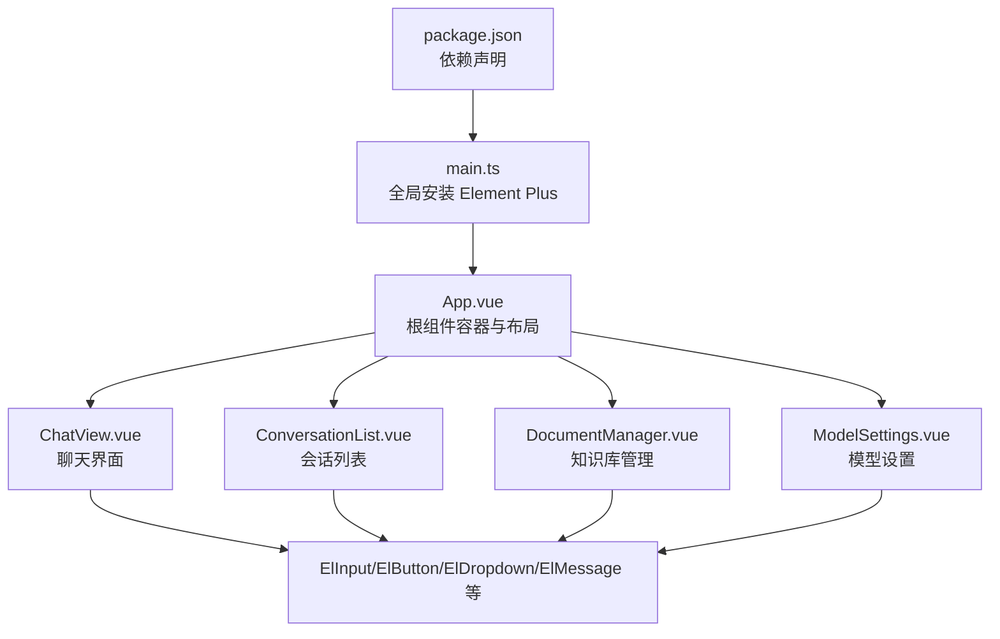
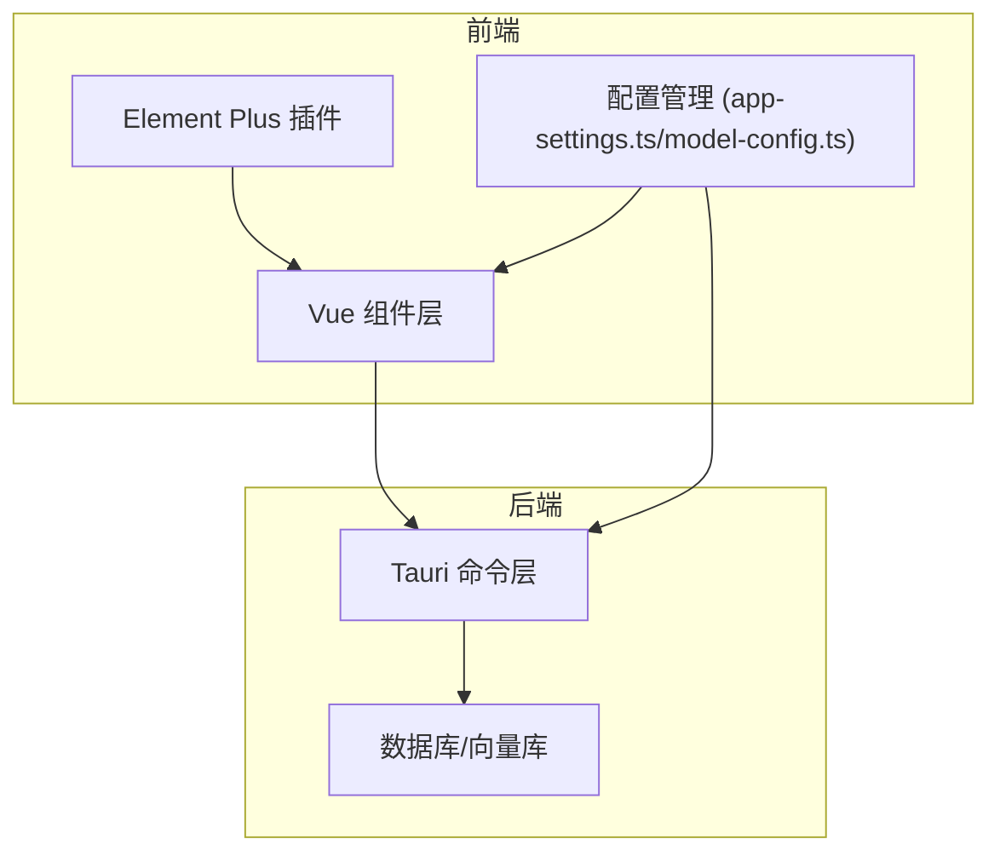
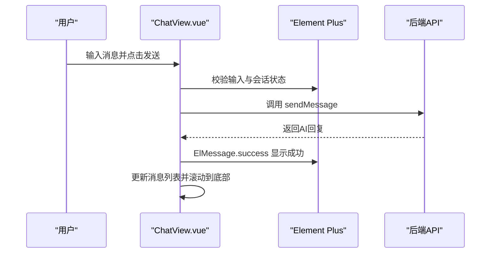
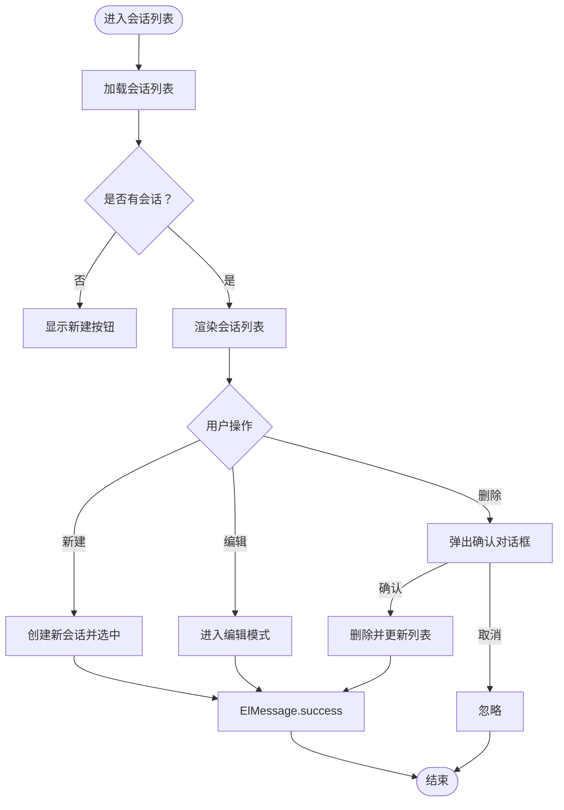
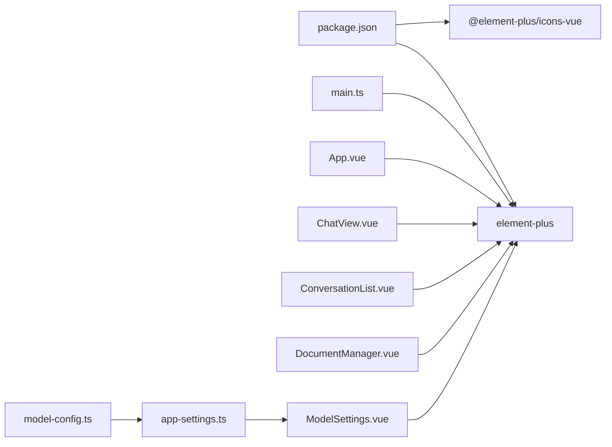

# UI框架集成

<cite>
**本文档引用的文件**
- [package.json](file://package.json)
- [main.ts](file://src/main.ts)
- [App.vue](file://src/App.vue)
- [ChatView.vue](file://src/components/business/ChatView.vue)
- [ConversationList.vue](file://src/components/business/ConversationList.vue)
- [DocumentManager.vue](file://src/components/business/DocumentManager.vue)
- [ModelSettings.vue](file://src/components/settings/ModelSettings.vue)
- [SearchInterface.vue](file://src/components/SearchInterface.vue)
- [app-settings.ts](file://src/config/app-settings.ts)
- [model-config.ts](file://src/config/model-config.ts)
- [configuration-management.md](file://docs/configuration-management.md)
- [development-setup.md](file://docs/development-setup.md)
</cite>

## 目录
1. [简介](#简介)
2. [项目结构](#项目结构)
3. [核心组件](#核心组件)
4. [架构总览](#架构总览)
5. [详细组件分析](#详细组件分析)
6. [依赖关系分析](#依赖关系分析)
7. [性能考虑](#性能考虑)
8. [故障排除指南](#故障排除指南)
9. [结论](#结论)
10. [附录](#附录)

## 简介
本文件系统性梳理 Malou Agent 中 Element Plus 组件库的集成与使用模式，覆盖以下方面：
- Element Plus 的全局安装与基础样式引入
- 在聊天界面、会话列表、文档管理、模型设置等组件中的典型使用
- 组件属性配置、事件处理与插槽使用模式
- 自定义样式的实现方式（CSS 变量、scoped 样式、主题定制）
- 最佳实践（响应式设计、无障碍访问、跨浏览器兼容性）
- 复杂用户交互模式的实现思路与参考路径

## 项目结构
Malou Agent 采用 Vue 3 + Tauri 架构，Element Plus 作为主要 UI 组件库被全局注册并在多处业务组件中使用。

**图表来源**
- [package.json](file://package.json#L14-L22)
- [main.ts](file://src/main.ts#L3-L4)
- [App.vue](file://src/App.vue#L34-L76)
- [ChatView.vue](file://src/components/business/ChatView.vue#L381-L398)
- [ConversationList.vue](file://src/components/business/ConversationList.vue#L169-L177)
- [DocumentManager.vue](file://src/components/business/DocumentManager.vue#L4-L19)
- [ModelSettings.vue](file://src/components/settings/ModelSettings.vue#L224-L247)

**章节来源**
- [package.json](file://package.json#L14-L22)
- [main.ts](file://src/main.ts#L1-L13)
- [App.vue](file://src/App.vue#L1-L121)

## 核心组件
本节概述 Element Plus 在项目中的核心使用点与职责边界。

- 全局安装与样式引入
  - 在应用入口通过插件方式注册 Element Plus，并引入全局样式，确保全站组件样式一致性。
  - 参考路径：[main.ts](file://src/main.ts#L3-L4)

- 根组件布局与容器
  - 使用 el-container/el-header/el-main 等布局容器组织页面骨架，结合 scoped 样式实现响应式布局。
  - 参考路径：[App.vue](file://src/App.vue#L36-L76)

- 业务组件中的典型元素
  - ElInput：输入消息、搜索、表单输入
  - ElButton：操作按钮、对话框触发、动作执行
  - ElDropdown：模型选择下拉菜单
  - ElMessage：全局提示反馈
  - ElMessageBox：确认对话框
  - ElTabs/ElTabPane：页面分组与导航
  - ElTable/ElDialog/ElForm：数据表格、对话框与表单
  - ElCard/ElAlert/ElSwitch/ElSelect/ElOption/ElSlider/ElInputNumber 等：设置页复杂表单与开关控制

**章节来源**
- [main.ts](file://src/main.ts#L1-L13)
- [App.vue](file://src/App.vue#L34-L76)
- [ChatView.vue](file://src/components/business/ChatView.vue#L381-L398)
- [ConversationList.vue](file://src/components/business/ConversationList.vue#L169-L177)
- [DocumentManager.vue](file://src/components/business/DocumentManager.vue#L4-L19)
- [ModelSettings.vue](file://src/components/settings/ModelSettings.vue#L224-L247)

## 架构总览
Element Plus 在 Malou Agent 中的集成遵循“全局注册 + 局部按需使用”的模式，配合 Tauri 的前后端通信实现复杂交互。

**图表来源**
- [main.ts](file://src/main.ts#L3-L4)
- [app-settings.ts](file://src/config/app-settings.ts#L1-L195)
- [model-config.ts](file://src/config/model-config.ts#L1-L163)

## 详细组件分析

### 聊天界面（ChatView）中的 Element Plus 使用
- 组件职责
  - 展示消息历史、输入消息、模型切换、数据库测试、清空记录等。
- 关键交互
  - ElInput + ElButton 实现消息输入与发送；支持 Enter 快捷键。
  - ElDropdown + ElButton 实现模型选择下拉菜单，点击项触发切换逻辑。
  - ElMessage 提供成功/失败/警告提示。
- 属性与事件
  - ElInput：v-model、placeholder、@keyup.enter、:disabled
  - ElButton：type、size、@click、:loading、:disabled
  - ElDropdown：trigger="click"、@command
  - ElMessage：ElMessage.success/error/warning
- 插槽使用
  - ElInput #append 插槽内放置发送按钮，形成“输入+按钮”复合控件。
- 自定义样式
  - scoped 样式控制消息气泡、时间戳、令牌数等视觉元素。
  - 动画类实现“正在输入”指示器。

**图表来源**
- [ChatView.vue](file://src/components/business/ChatView.vue#L163-L222)
- [ChatView.vue](file://src/components/business/ChatView.vue#L381-L398)
- [ChatView.vue](file://src/components/business/ChatView.vue#L299-L324)

**章节来源**
- [ChatView.vue](file://src/components/business/ChatView.vue#L1-L569)

### 会话列表（ConversationList）中的 Element Plus 使用
- 组件职责
  - 列出会话、创建/删除/编辑标题、选择会话。
- 关键交互
  - ElButton + ElIcon 实现新建、编辑、删除等操作。
  - ElInput 在编辑模式下直接修改标题。
  - ElMessageBox.confirm 实现删除确认。
  - v-loading 控制加载状态。
- 属性与事件
  - ElButton：type、:icon、circle、size、@click
  - ElInput：v-model、size、@blur/@keyup.enter/@keyup.escape、@click.stop、autofocus
  - ElMessageBox.confirm：确认/取消回调
- 自定义样式
  - scoped 样式实现 hover 效果、激活态高亮、动作按钮显隐等。

**图表来源**
- [ConversationList.vue](file://src/components/business/ConversationList.vue#L67-L79)
- [ConversationList.vue](file://src/components/business/ConversationList.vue#L118-L147)
- [ConversationList.vue](file://src/components/business/ConversationList.vue#L194-L203)

**章节来源**
- [ConversationList.vue](file://src/components/business/ConversationList.vue#L1-L367)

### 文档管理（DocumentManager）中的 Element Plus 使用
- 组件职责
  - 文档列表展示、搜索过滤、新增/编辑/删除、元数据编辑。
- 关键交互
  - ElInput + prefix icon 实现搜索输入框。
  - ElTable + selection 实现多选。
  - ElDialog + ElForm 实现新增/编辑对话框。
  - ElMessageBox.confirm 实现删除确认。
  - ElMessage 提供反馈。
- 属性与事件
  - ElInput：v-model、placeholder、clearable、#prefix
  - ElTable：:data、v-loading、@selection-change
  - ElDialog：v-model、title、width
  - ElForm/ElFormItem：表单项绑定
  - ElButton：@click、type、size
- 自定义样式
  - scoped 样式控制工具栏、表格列宽、预览文本溢出等。

**章节来源**
- [DocumentManager.vue](file://src/components/business/DocumentManager.vue#L1-L256)

### 模型设置（ModelSettings）中的 Element Plus 使用
- 组件职责
  - 模型选择、本地/远程模型配置、ONNX 辅助功能开关、配置导入导出、保存。
- 关键交互
  - ElTabs + ElTabPane 组织多面板设置。
  - ElForm + ElFormItem 实现复杂表单。
  - ElSelect/ElOption/ElSwitch/ElSlider/ElInputNumber 等丰富控件。
  - ElAlert/ElCard 提升可读性。
  - ElMessageBox.confirm 实现危险操作确认。
  - ElMessage 提供反馈。
- 属性与事件
  - ElTabs：type="border-card"
  - ElForm：:model、label-width
  - ElSelect/ElOption：v-model、@change
  - ElSwitch：v-model、@change
  - ElSlider/ElInputNumber：v-model、min/max/step/controls-position
  - ElButton：@click、type、loading、size
- 自定义样式
  - scoped 样式控制卡片、分隔线、标签与能力展示等。

**章节来源**
- [ModelSettings.vue](file://src/components/settings/ModelSettings.vue#L1-L580)

### 搜索界面（SearchInterface）中的 Element Plus 使用
- 组件职责
  - 本组件以原生 HTML/CSS 为主，展示 Element Plus 在其他场景的替代方案与对比。
- 关键交互
  - 输入框 + 按钮 + 防抖搜索；结果展示与空状态。
- 属性与事件
  - 原生 input + button，结合 Vue 响应式实现搜索流程。
- 自定义样式
  - scoped 样式控制输入框焦点态、按钮禁用态、结果项等。

**章节来源**
- [SearchInterface.vue](file://src/components/SearchInterface.vue#L386-L611)

## 依赖关系分析
- Element Plus 依赖
  - 通过 package.json 声明 element-plus 与 @element-plus/icons-vue。
  - 在 main.ts 中全局注册 Element Plus 并引入全局样式。
- 配置与主题
  - app-settings.ts 提供配置管理与当前模型选择逻辑。
  - model-config.ts 定义配置数据结构与默认值。
- 文档与开发
  - configuration-management.md 展示了通用设置组件的 Element Plus 使用范式。
  - development-setup.md 提供 Element Plus 调试建议。

**图表来源**
- [package.json](file://package.json#L14-L22)
- [main.ts](file://src/main.ts#L3-L4)
- [App.vue](file://src/App.vue#L34-L76)
- [ChatView.vue](file://src/components/business/ChatView.vue#L381-L398)
- [ConversationList.vue](file://src/components/business/ConversationList.vue#L169-L177)
- [DocumentManager.vue](file://src/components/business/DocumentManager.vue#L4-L19)
- [ModelSettings.vue](file://src/components/settings/ModelSettings.vue#L224-L247)
- [app-settings.ts](file://src/config/app-settings.ts#L1-L195)
- [model-config.ts](file://src/config/model-config.ts#L1-L163)

**章节来源**
- [package.json](file://package.json#L1-L31)
- [main.ts](file://src/main.ts#L1-L13)
- [app-settings.ts](file://src/config/app-settings.ts#L1-L195)
- [model-config.ts](file://src/config/model-config.ts#L1-L163)
- [configuration-management.md](file://docs/configuration-management.md#L122-L162)
- [development-setup.md](file://docs/development-setup.md#L48-L52)

## 性能考虑
- 组件按需使用
  - 对于大型列表（如会话列表、文档表格），优先使用 v-loading 与虚拟滚动（如需）减少重绘。
- 事件防抖
  - 搜索输入建议采用防抖策略，降低频繁请求与渲染压力。
- 图标与样式
  - 使用 @element-plus/icons-vue 的图标组件，避免大体积图片资源。
- 主题与样式隔离
  - 使用 scoped 样式避免全局污染；必要时通过 CSS 变量统一主题色。

[本节为通用指导，无需列出具体文件来源]

## 故障排除指南
- Element Plus 样式不生效
  - 确认已在入口文件引入全局样式。
  - 参考路径：[main.ts](file://src/main.ts#L4)
- 组件无法注册
  - 确认已在入口文件调用 app.use(ElementPlus)。
  - 参考路径：[main.ts](file://src/main.ts#L11)
- ElMessage/ElMessageBox 不显示
  - 确保在组件中正确导入并调用相应方法。
  - 参考路径：[ChatView.vue](file://src/components/business/ChatView.vue#L99-L104)
  - 参考路径：[ConversationList.vue](file://src/components/business/ConversationList.vue#L122-L130)
- 表单校验与配置导入导出
  - 使用 ElMessageBox.confirm 进行危险操作确认。
  - 参考路径：[ModelSettings.vue](file://src/components/settings/ModelSettings.vue#L172-L179)
  - 参考路径：[ModelSettings.vue](file://src/components/settings/ModelSettings.vue#L204-L214)

**章节来源**
- [main.ts](file://src/main.ts#L1-L13)
- [ChatView.vue](file://src/components/business/ChatView.vue#L99-L104)
- [ConversationList.vue](file://src/components/business/ConversationList.vue#L122-L130)
- [ModelSettings.vue](file://src/components/settings/ModelSettings.vue#L172-L179)
- [ModelSettings.vue](file://src/components/settings/ModelSettings.vue#L204-L214)

## 结论
Malou Agent 已在全局层面完成 Element Plus 的集成，并在多个业务组件中广泛使用，涵盖输入、按钮、下拉、消息提示、确认对话框、标签页、表格、对话框与复杂表单等场景。通过 scoped 样式与合理的交互设计，实现了良好的用户体验与可维护性。建议后续在大型列表场景引入虚拟滚动、优化搜索防抖策略，并完善主题变量的统一管理。

[本节为总结性内容，无需列出具体文件来源]

## 附录

### 组件属性与事件速查
- ElInput
  - 常用属性：v-model、placeholder、clearable、:disabled、size
  - 事件：@keyup.enter、@keyup.escape、@blur
  - 插槽：#prefix、#suffix、#append
  - 示例路径：[ChatView.vue](file://src/components/business/ChatView.vue#L381-L398)
- ElButton
  - 常用属性：type、size、:loading、:disabled、circle、:icon
  - 事件：@click
  - 示例路径：[ConversationList.vue](file://src/components/business/ConversationList.vue#L169-L177)
- ElDropdown
  - 常用属性：trigger、#dropdown
  - 事件：@command
  - 示例路径：[ChatView.vue](file://src/components/business/ChatView.vue#L299-L324)
- ElMessage/ElMessageBox
  - 方法：ElMessage.success/error/warning、ElMessageBox.confirm
  - 示例路径：[ChatView.vue](file://src/components/business/ChatView.vue#L99-L104)
- ElTabs/ElTabPane
  - 属性：v-model、type
  - 示例路径：[App.vue](file://src/App.vue#L39-L43)
- ElTable/ElDialog/ElForm
  - 属性：:data、v-loading、v-model、label-width、width
  - 事件：@selection-change、@click
  - 示例路径：[DocumentManager.vue](file://src/components/business/DocumentManager.vue#L22-L51)

### 自定义样式与主题
- scoped 样式
  - 在各组件的 <style scoped> 中定义局部样式，避免全局污染。
  - 示例路径：[ChatView.vue](file://src/components/business/ChatView.vue#L402-L569)
- CSS 变量
  - 可通过 CSS 变量统一主题色与间距，便于主题切换。
- 主题定制
  - 建议在入口引入 Element Plus 样式后，再引入自定义主题文件，实现覆盖与扩展。

**章节来源**
- [ChatView.vue](file://src/components/business/ChatView.vue#L402-L569)
- [App.vue](file://src/App.vue#L78-L120)