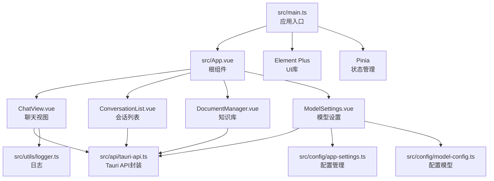
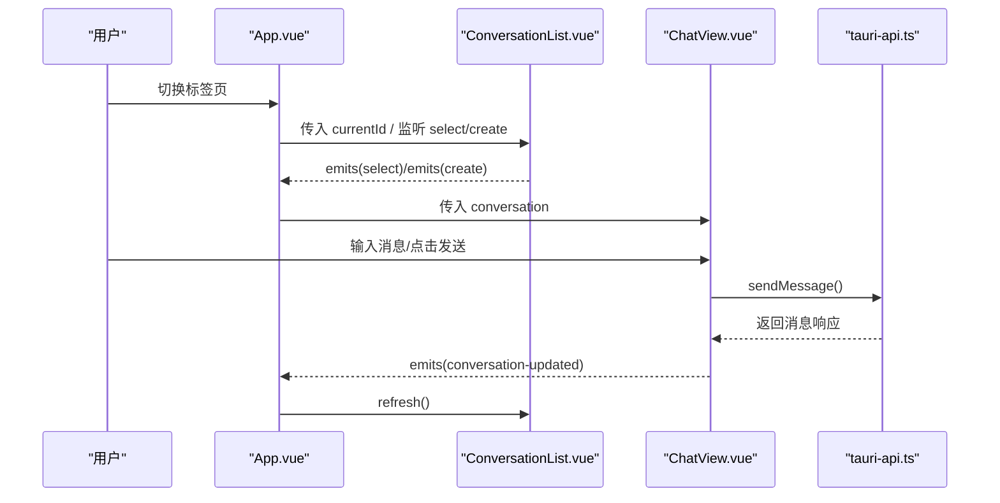
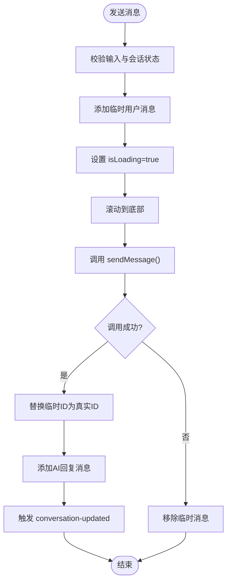
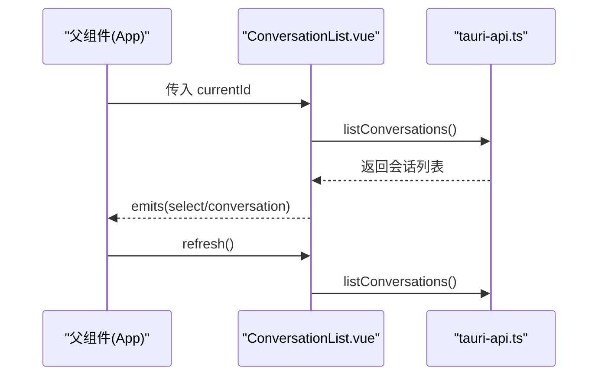
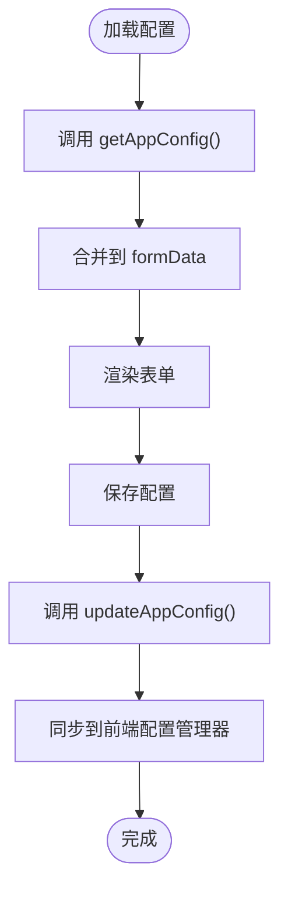
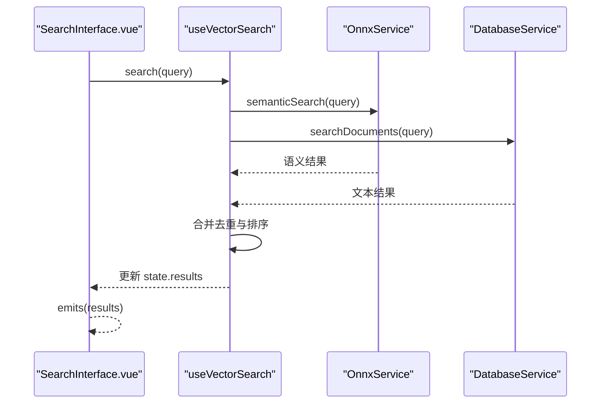
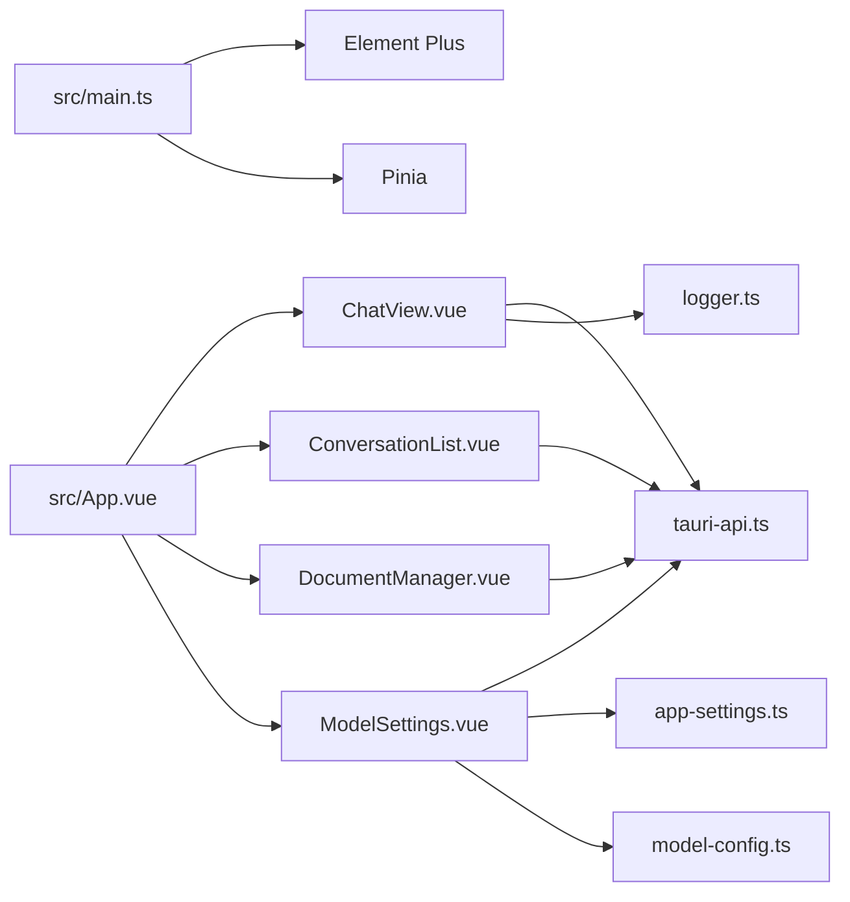

# Vue组件架构

<cite>
**本文引用的文件**
- [src/App.vue](file://src/App.vue)
- [src/main.ts](file://src/main.ts)
- [src/components/business/ChatView.vue](file://src/components/business/ChatView.vue)
- [src/components/business/ConversationList.vue](file://src/components/business/ConversationList.vue)
- [src/components/business/DocumentManager.vue](file://src/components/business/DocumentManager.vue)
- [src/components/settings/ModelSettings.vue](file://src/components/settings/ModelSettings.vue)
- [src/components/SearchInterface.vue](file://src/components/SearchInterface.vue)
- [src/api/tauri-api.ts](file://src/api/tauri-api.ts)
- [src/config/app-settings.ts](file://src/config/app-settings.ts)
- [src/config/model-config.ts](file://src/config/model-config.ts)
- [src/utils/logger.ts](file://src/utils/logger.ts)
- [package.json](file://package.json)
</cite>

## 目录
1. [简介](#简介)
2. [项目结构](#项目结构)
3. [核心组件](#核心组件)
4. [架构总览](#架构总览)
5. [详细组件分析](#详细组件分析)
6. [依赖关系分析](#依赖关系分析)
7. [性能考量](#性能考量)
8. [故障排查指南](#故障排查指南)
9. [结论](#结论)
10. [附录](#附录)

## 简介
本文件系统性梳理 Malou Agent 的 Vue 3 Composition API 架构，重点覆盖以下方面：
- 响应式数据管理：通过 ref、reactive、computed、watch 实现状态驱动的UI。
- 计算属性与侦听器：在组件内对配置、模型列表、消息列表进行派生与监听。
- 组件层次结构：业务组件（ChatView、ConversationList、DocumentManager）与设置组件（ModelSettings）的职责划分。
- 组件通信：props 传递、emits 事件、父子组件交互模式。
- 生命周期管理：onMounted、watch、nextTick 的使用场景。
- 模板语法与作用域样式：Element Plus 组件与 scoped 样式结合。
- Tauri 集成：通过 invoke 调用后端能力，处理异步与错误状态。

## 项目结构
Malou Agent 采用基于功能分层的目录组织：
- src/components/business：业务组件（聊天、会话列表、文档管理）
- src/components/settings：设置组件（模型配置）
- src/api：封装 Tauri invoke 接口
- src/config：应用配置模型与本地持久化
- src/utils：通用工具（日志）
- src/App.vue：根组件，负责页面布局与跨组件协调
- src/main.ts：应用入口，注册插件与挂载

图表来源
- [src/main.ts](file://src/main.ts#L1-L13)
- [src/App.vue](file://src/App.vue#L1-L121)
- [src/components/business/ChatView.vue](file://src/components/business/ChatView.vue#L1-L569)
- [src/components/business/ConversationList.vue](file://src/components/business/ConversationList.vue#L1-L367)
- [src/components/business/DocumentManager.vue](file://src/components/business/DocumentManager.vue#L1-L256)
- [src/components/settings/ModelSettings.vue](file://src/components/settings/ModelSettings.vue#L1-L580)
- [src/api/tauri-api.ts](file://src/api/tauri-api.ts#L1-L242)
- [src/config/app-settings.ts](file://src/config/app-settings.ts#L1-L195)
- [src/config/model-config.ts](file://src/config/model-config.ts#L1-L163)
- [src/utils/logger.ts](file://src/utils/logger.ts#L1-L95)

章节来源
- [src/App.vue](file://src/App.vue#L1-L121)
- [src/main.ts](file://src/main.ts#L1-L13)

## 核心组件
- ChatView：负责单一会话的消息渲染、发送、模型切换、清空记录、数据库连通性测试等。
- ConversationList：负责会话列表的加载、创建、删除、标题编辑、当前选中态同步。
- DocumentManager：负责文档的增删改查、搜索过滤、批量选择、对话框交互。
- ModelSettings：负责应用配置的加载、保存、导出/导入、远程/本地模型管理、ONNX 功能开关与资源限制。
- SearchInterface：提供向量搜索与文本搜索的组合式封装，供其他组件复用。

章节来源
- [src/components/business/ChatView.vue](file://src/components/business/ChatView.vue#L1-L569)
- [src/components/business/ConversationList.vue](file://src/components/business/ConversationList.vue#L1-L367)
- [src/components/business/DocumentManager.vue](file://src/components/business/DocumentManager.vue#L1-L256)
- [src/components/settings/ModelSettings.vue](file://src/components/settings/ModelSettings.vue#L1-L580)
- [src/components/SearchInterface.vue](file://src/components/SearchInterface.vue#L1-L611)

## 架构总览
Malou Agent 的前端采用“根组件 + 业务组件 + 设置组件”的分层设计，根组件 App.vue 作为页面容器，协调 Tab 切换与子组件交互；各业务组件通过统一的 Tauri API 封装与后端通信；配置管理由前端配置管理器与后端配置双向同步。

图表来源
- [src/App.vue](file://src/App.vue#L13-L31)
- [src/components/business/ConversationList.vue](file://src/components/business/ConversationList.vue#L17-L20)
- [src/components/business/ChatView.vue](file://src/components/business/ChatView.vue#L29-L32)
- [src/api/tauri-api.ts](file://src/api/tauri-api.ts#L108-L110)

## 详细组件分析

### ChatView 组件
- 响应式数据
  - messages：显示消息数组，包含发送者、时间戳、token 统计。
  - inputMessage：输入框绑定。
  - isLoading：发送状态指示。
  - messagesContainer：滚动容器引用。
  - appConfig/currentModel/availableModels：模型配置与选择。
- 计算属性
  - availableModels：聚合远程与本地启用模型，形成下拉选项。
  - currentModel：根据当前选择返回具体模型项。
- 侦听与生命周期
  - watch 对 props.conversation 变化进行响应，加载对应消息。
  - onMounted 加载应用配置。
  - nextTick 与滚动逻辑配合，保证 DOM 更新后再滚动到底部。
- 异步与错误处理
  - 发送消息时添加临时用户消息，成功后替换 ID；失败则回滚。
  - 清空记录与数据库测试分别调用对应 API，并通过 Element Plus 提示。
- 与 Tauri 集成
  - sendMessage/getConversationMessages/clearConversationMessages/testDatabase 等均通过 invoke 调用后端能力。
- 模板与样式
  - 使用 Element Plus 下拉、按钮、输入框等组件。
  - scoped 样式限定聊天气泡、输入区、加载指示器等区域。

图表来源
- [src/components/business/ChatView.vue](file://src/components/business/ChatView.vue#L163-L222)
- [src/api/tauri-api.ts](file://src/api/tauri-api.ts#L108-L110)

章节来源
- [src/components/business/ChatView.vue](file://src/components/business/ChatView.vue#L1-L569)
- [src/api/tauri-api.ts](file://src/api/tauri-api.ts#L1-L242)

### ConversationList 组件
- 响应式数据
  - conversations：会话列表。
  - loading：加载状态。
  - editingId/editTitle：标题编辑态。
- 事件与暴露
  - emits(select/create) 通知父组件选中或创建新会话。
  - defineExpose 暴露 refresh/loadConversations 供父组件调用。
- 交互逻辑
  - 创建会话后插入列表首项并同时触发 select/create。
  - 删除会话时如删除的是当前会话则自动选择下一个。
  - 编辑标题支持失焦/回车/ESC 三种方式。
- 模板与样式
  - 使用 Element Plus 列表、图标、按钮与加载状态。
  - scoped 样式控制选中态与悬停态。

图表来源
- [src/components/business/ConversationList.vue](file://src/components/business/ConversationList.vue#L13-L20)
- [src/components/business/ConversationList.vue](file://src/components/business/ConversationList.vue#L155-L158)
- [src/api/tauri-api.ts](file://src/api/tauri-api.ts#L78-L80)

章节来源
- [src/components/business/ConversationList.vue](file://src/components/business/ConversationList.vue#L1-L367)
- [src/api/tauri-api.ts](file://src/api/tauri-api.ts#L67-L101)

### DocumentManager 组件
- 响应式数据
  - documents：文档列表。
  - searchQuery：搜索关键词。
  - filteredDocuments：基于关键词的计算过滤结果。
  - showCreateDialog/editingDocument/selectedDocuments/documentForm/metadataJson：对话框与表单状态。
- 交互逻辑
  - 列表加载、刷新、删除（二次确认）、编辑（弹窗）。
  - 表单支持元数据 JSON 输入与校验。
- 模板与样式
  - Element Plus 表格、输入、对话框、按钮组合。
  - scoped 样式控制工具栏与预览区域。

章节来源
- [src/components/business/DocumentManager.vue](file://src/components/business/DocumentManager.vue#L1-L256)

### ModelSettings 组件
- 响应式数据
  - formData：完整的应用配置对象，来源于 useConfig 管理器。
  - availableModels：基于配置计算的可用模型列表。
  - loading：保存与加载状态。
- 交互逻辑
  - 加载配置：getAppConfig -> 合并到 formData。
  - 保存配置：updateAppConfig -> 同步到前端配置管理器。
  - 切换本地模型、ONNX 功能、当前模型等即时调用后端并提示。
  - 导出/导入配置：文件读写与二次确认。
- 模板与样式
  - Element Plus 标签页、表单、开关、滑块、数字输入等。
  - scoped 样式控制卡片、分隔线与细节区域。

图表来源
- [src/components/settings/ModelSettings.vue](file://src/components/settings/ModelSettings.vue#L88-L117)
- [src/api/tauri-api.ts](file://src/api/tauri-api.ts#L1-L242)
- [src/config/app-settings.ts](file://src/config/app-settings.ts#L1-L195)

章节来源
- [src/components/settings/ModelSettings.vue](file://src/components/settings/ModelSettings.vue#L1-L580)
- [src/config/app-settings.ts](file://src/config/app-settings.ts#L1-L195)
- [src/config/model-config.ts](file://src/config/model-config.ts#L1-L163)

### SearchInterface 组件与组合式函数
- 组合式函数 useVectorSearch
  - 状态：query/results/isLoading/error。
  - 方法：search（并行执行语义搜索与文本搜索，合并去重）、clear、refresh。
  - 依赖：OnnxService（embedText、semanticSearch）与 DatabaseService（searchDocuments）。
- 组件交互
  - 支持自动搜索与防抖，触发 emits(search/results)。
  - 截断内容展示，空状态提示。

图表来源
- [src/components/SearchInterface.vue](file://src/components/SearchInterface.vue#L269-L341)
- [src/components/SearchInterface.vue](file://src/components/SearchInterface.vue#L443-L506)

章节来源
- [src/components/SearchInterface.vue](file://src/components/SearchInterface.vue#L1-L611)

## 依赖关系分析
- 应用入口与插件
  - main.ts 注册 Element Plus 与 Pinia，并挂载应用。
- 组件间依赖
  - App.vue 依赖业务组件与设置组件，负责状态与事件的中转。
  - 业务组件均依赖 tauri-api.ts 进行后端调用。
  - ModelSettings 依赖前端配置管理器（app-settings.ts）与配置模型（model-config.ts）。
  - ChatView 依赖 logger.ts 输出日志。
- 第三方依赖
  - @tauri-apps/api：invoke 调用后端命令。
  - element-plus：UI 组件库。
  - pinia：状态管理（在 main.ts 中注册）。

图表来源
- [src/main.ts](file://src/main.ts#L1-L13)
- [src/App.vue](file://src/App.vue#L1-L121)
- [src/components/business/ChatView.vue](file://src/components/business/ChatView.vue#L1-L569)
- [src/components/business/ConversationList.vue](file://src/components/business/ConversationList.vue#L1-L367)
- [src/components/business/DocumentManager.vue](file://src/components/business/DocumentManager.vue#L1-L256)
- [src/components/settings/ModelSettings.vue](file://src/components/settings/ModelSettings.vue#L1-L580)
- [src/api/tauri-api.ts](file://src/api/tauri-api.ts#L1-L242)
- [src/config/app-settings.ts](file://src/config/app-settings.ts#L1-L195)
- [src/config/model-config.ts](file://src/config/model-config.ts#L1-L163)
- [src/utils/logger.ts](file://src/utils/logger.ts#L1-L95)

章节来源
- [package.json](file://package.json#L1-L31)

## 性能考量
- 异步调用与并发
  - ChatView 在发送消息时仅更新前端 UI，随后等待后端响应，避免阻塞主线程。
  - SearchInterface 使用 Promise.all 并行执行语义搜索与文本搜索，提升响应速度。
- DOM 更新与滚动
  - 使用 nextTick 确保消息列表渲染完成后滚动到底部，减少闪烁与布局抖动。
- 计算属性与缓存
  - availableModels/currentModel 通过 computed 缓存派生结果，降低重复计算成本。
- 防抖与节流
  - SearchInterface 支持自动搜索与防抖，避免频繁触发搜索请求。
- 资源限制
  - ModelSettings 提供 ONNX 资源限制（内存、线程），避免过度占用系统资源。

## 故障排查指南
- 发送消息失败
  - 现象：发送按钮禁用/加载中，消息未到达后端。
  - 排查：检查 props.conversation 是否为空；查看控制台错误；确认 isLoading 状态是否被正确重置。
  - 参考路径：[发送消息流程](file://src/components/business/ChatView.vue#L163-L222)
- 会话列表不刷新
  - 现象：新建/删除会话后列表未更新。
  - 排查：确认父组件是否调用 ConversationList.ref.refresh()；检查 emits(select/create) 是否正确触发。
  - 参考路径：[刷新方法暴露](file://src/components/business/ConversationList.vue#L155-L158)
- 配置保存无效
  - 现象：修改设置后未生效。
  - 排查：确认 updateAppConfig 调用成功；检查前端配置管理器 updateConfig 是否同步；查看本地存储是否可写。
  - 参考路径：[保存配置流程](file://src/components/settings/ModelSettings.vue#L102-L117)
- ONNX 功能异常
  - 现象：嵌入或搜索失败。
  - 排查：确认 OnnxService.initialize 成功；检查后端模型加载状态；查看日志输出。
  - 参考路径：[OnnxService](file://src/components/SearchInterface.vue#L20-L144)

章节来源
- [src/components/business/ChatView.vue](file://src/components/business/ChatView.vue#L163-L222)
- [src/components/business/ConversationList.vue](file://src/components/business/ConversationList.vue#L155-L158)
- [src/components/settings/ModelSettings.vue](file://src/components/settings/ModelSettings.vue#L102-L117)
- [src/components/SearchInterface.vue](file://src/components/SearchInterface.vue#L20-L144)

## 结论
Malou Agent 的 Vue 3 架构以 Composition API 为核心，围绕响应式数据、计算属性与侦听器构建清晰的状态驱动 UI。业务组件与设置组件职责明确，通过统一的 Tauri API 封装实现前后端解耦。配置管理与日志系统完善，为复杂功能（向量搜索、模型切换、ONNX 辅助）提供了稳定支撑。建议在后续迭代中进一步引入 Pinia 进行跨组件共享状态管理，并对高频异步操作增加重试与缓存策略。

## 附录
- 关键 API 定义参考
  - [会话与消息 API](file://src/api/tauri-api.ts#L67-L132)
  - [数据库测试与知识检索 API](file://src/api/tauri-api.ts#L169-L214)
  - [文档管理 API（占位）](file://src/api/tauri-api.ts#L216-L235)
- 配置模型与默认值
  - [配置模型定义](file://src/config/model-config.ts#L43-L56)
  - [默认配置](file://src/config/model-config.ts#L58-L116)
  - [配置管理器](file://src/config/app-settings.ts#L6-L180)
- 日志工具
  - [日志服务](file://src/utils/logger.ts#L12-L80)