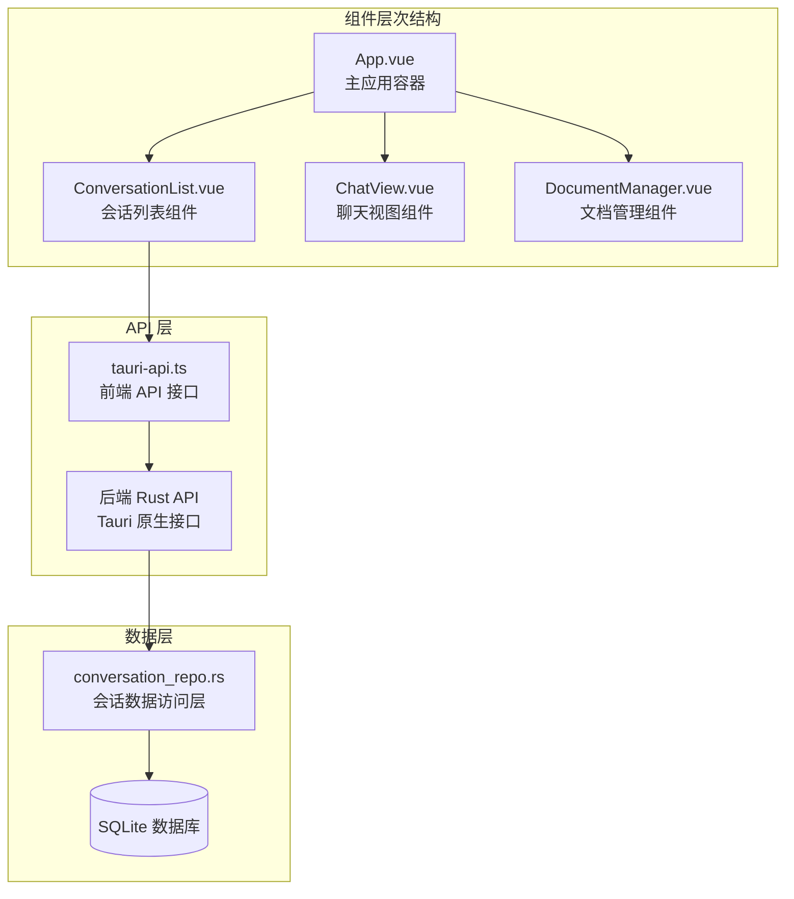
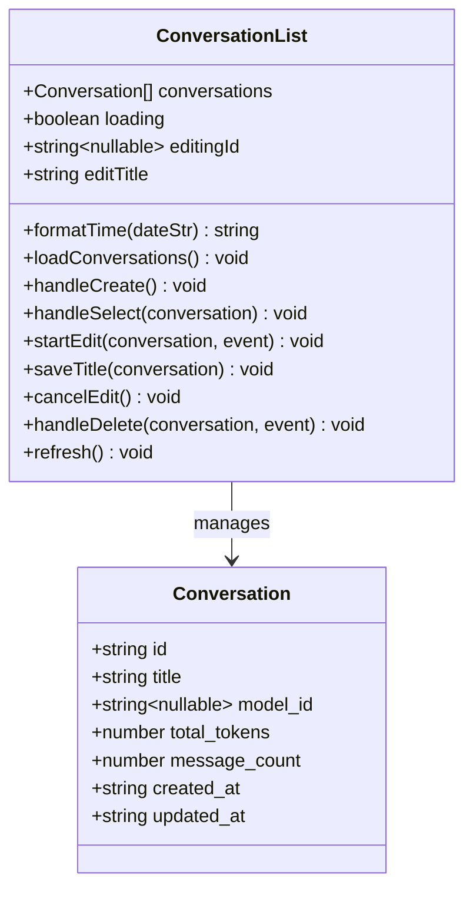
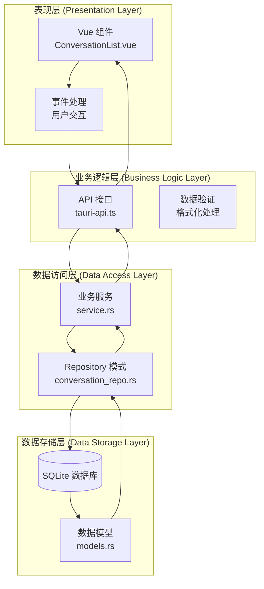
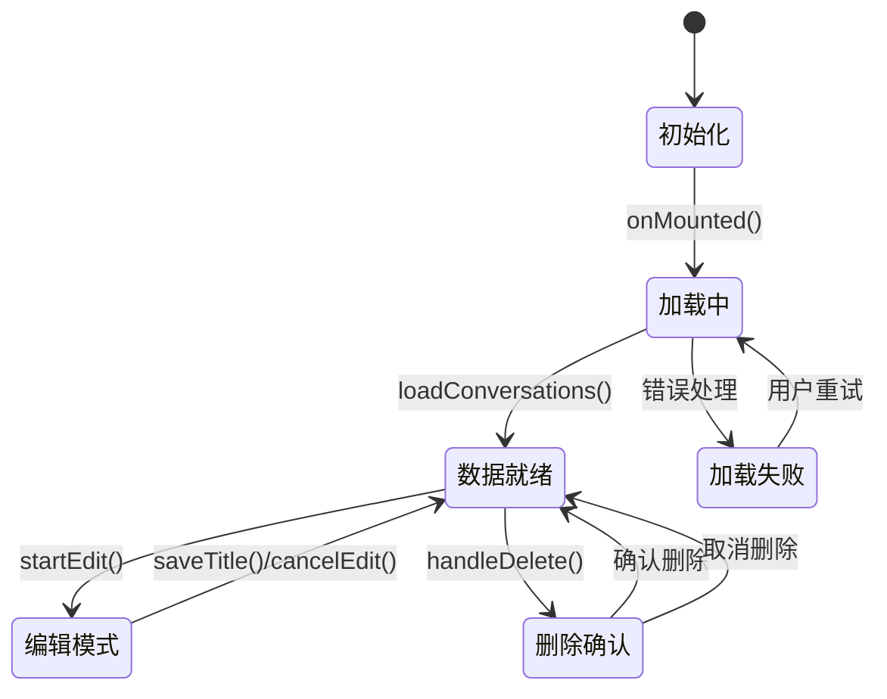
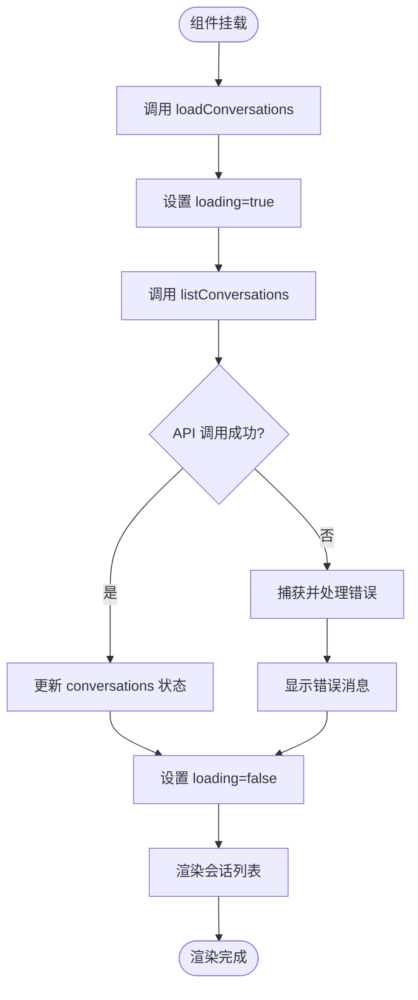
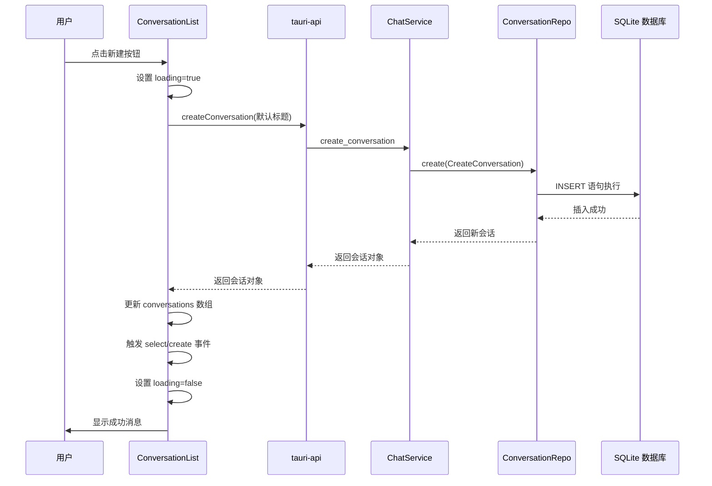
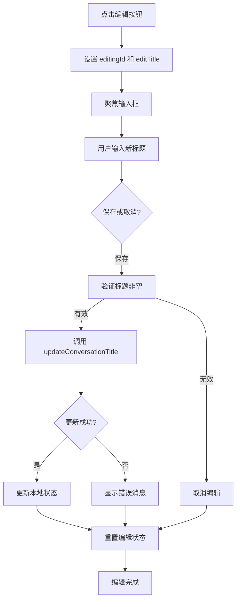
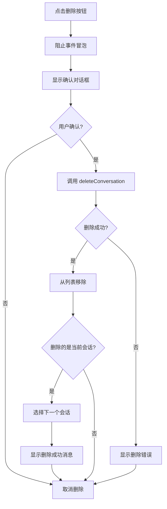
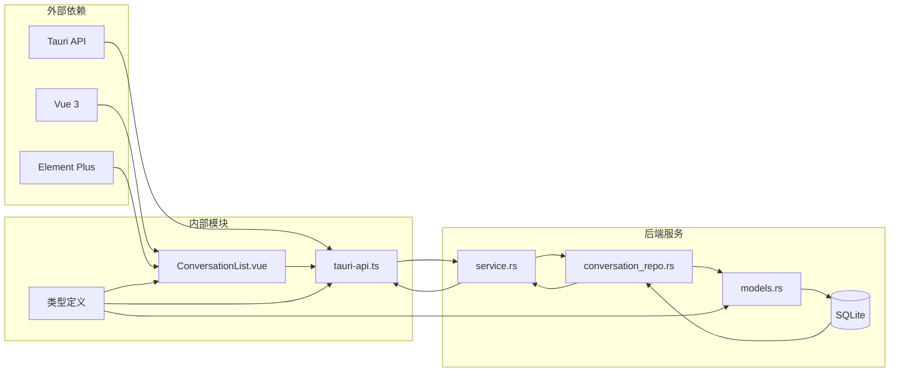
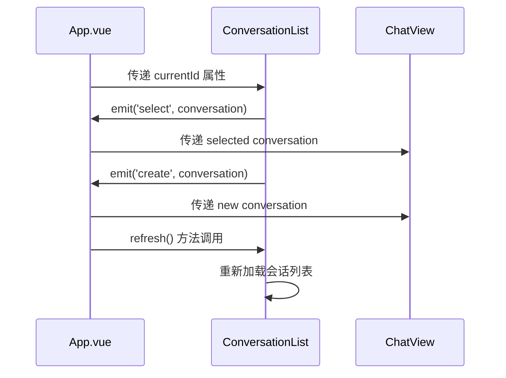

# 会话列表组件

<cite>
**本文档引用的文件**
- [ConversationList.vue](file://src/components/business/ConversationList.vue)
- [tauri-api.ts](file://src/api/tauri-api.ts)
- [App.vue](file://src/App.vue)
- [conversation_repo.rs](file://src-tauri/src/chat/conversation_repo.rs)
- [service.rs](file://src-tauri/src/chat/service.rs)
- [models.rs](file://src-tauri/src/database/models.rs)
</cite>

## 目录
1. [简介](#简介)
2. [项目结构](#项目结构)
3. [核心组件](#核心组件)
4. [架构概览](#架构概览)
5. [详细组件分析](#详细组件分析)
6. [依赖关系分析](#依赖关系分析)
7. [性能考虑](#性能考虑)
8. [故障排除指南](#故障排除指南)
9. [结论](#结论)

## 简介

会话列表组件是 Malou Agent 桌面应用的核心功能模块之一，负责管理用户的对话历史记录。该组件提供了完整的会话生命周期管理功能，包括会话列表的渲染、创建、编辑和删除操作。通过与后端 API 的紧密集成，组件实现了实时的数据同步和用户友好的交互体验。

该组件采用 Vue 3 Composition API 构建，结合 Element Plus UI 组件库，提供了现代化的用户界面和流畅的用户体验。组件支持响应式设计，能够在不同屏幕尺寸下提供一致的使用体验。

## 项目结构

会话列表组件位于业务组件目录中，与聊天视图、文档管理器等其他业务组件共同构成应用的核心功能模块。



**图表来源**
- [App.vue](file://src/App.vue#L1-L121)
- [ConversationList.vue](file://src/components/business/ConversationList.vue#L1-L367)
- [tauri-api.ts](file://src/api/tauri-api.ts#L1-L242)

**章节来源**
- [App.vue](file://src/App.vue#L1-L121)
- [ConversationList.vue](file://src/components/business/ConversationList.vue#L1-L367)

## 核心组件

会话列表组件是一个功能完整的 Vue 3 组件，具有以下核心特性：

### 主要功能特性
- **会话列表渲染**：显示用户的对话历史，按最后更新时间降序排列
- **会话创建**：一键创建新会话，自动生成默认标题
- **会话编辑**：支持就地编辑会话标题
- **会话删除**：安全删除确认机制，防止误操作
- **会话选择**：点击选择特定会话进行聊天
- **状态管理**：完整的加载状态、错误处理和用户反馈

### 数据模型
组件使用统一的 Conversation 接口定义，确保前后端数据一致性：



**图表来源**
- [tauri-api.ts](file://src/api/tauri-api.ts#L6-L14)
- [ConversationList.vue](file://src/components/business/ConversationList.vue#L22-L25)

**章节来源**
- [tauri-api.ts](file://src/api/tauri-api.ts#L6-L14)
- [ConversationList.vue](file://src/components/business/ConversationList.vue#L22-L25)

## 架构概览

会话列表组件采用分层架构设计，确保了良好的可维护性和扩展性。



**图表来源**
- [ConversationList.vue](file://src/components/business/ConversationList.vue#L1-L367)
- [tauri-api.ts](file://src/api/tauri-api.ts#L1-L242)
- [conversation_repo.rs](file://src-tauri/src/chat/conversation_repo.rs#L1-L161)
- [service.rs](file://src-tauri/src/chat/service.rs#L1-L224)
- [models.rs](file://src-tauri/src/database/models.rs#L1-L110)

## 详细组件分析

### 组件状态管理

会话列表组件使用 Vue 3 的响应式系统管理内部状态：



**图表来源**
- [ConversationList.vue](file://src/components/business/ConversationList.vue#L22-L25)
- [ConversationList.vue](file://src/components/business/ConversationList.vue#L54-L64)

组件的核心状态包括：
- `conversations`: 会话数组，存储所有会话数据
- `loading`: 加载状态指示器
- `editingId`: 当前编辑的会话 ID
- `editTitle`: 编辑中的标题内容

### 会话列表渲染逻辑

组件采用虚拟滚动和智能渲染策略，确保大量会话数据的高效显示：



**图表来源**
- [ConversationList.vue](file://src/components/business/ConversationList.vue#L54-L64)
- [tauri-api.ts](file://src/api/tauri-api.ts#L78-L80)

### 会话创建流程

新会话的创建过程包含完整的用户反馈和状态管理：



**图表来源**
- [ConversationList.vue](file://src/components/business/ConversationList.vue#L67-L79)
- [tauri-api.ts](file://src/api/tauri-api.ts#L71-L73)
- [service.rs](file://src-tauri/src/chat/service.rs#L38-L42)
- [conversation_repo.rs](file://src-tauri/src/chat/conversation_repo.rs#L14-L37)

### 会话编辑功能

标题编辑采用就地编辑模式，提供即时反馈和撤销机制：



**图表来源**
- [ConversationList.vue](file://src/components/business/ConversationList.vue#L86-L115)
- [tauri-api.ts](file://src/api/tauri-api.ts#L92-L94)

### 会话删除机制

删除操作采用双重确认机制，确保用户操作的安全性：



**图表来源**
- [ConversationList.vue](file://src/components/business/ConversationList.vue#L118-L147)
- [tauri-api.ts](file://src/api/tauri-api.ts#L99-L101)

### 时间格式化算法

组件实现了智能的时间显示格式化，根据时间差动态选择合适的显示格式：

```mermaid
flowchart TD
GetTimeDiff[计算时间差] --> LessOneMinute{小于1分钟?}
LessOneMinute --> |是| ShowJustNow[显示"刚刚"]
LessOneMinute --> |否| LessOneHour{小于1小时?}
LessOneHour --> |是| ShowMinutes[显示"X分钟前"]
LessOneHour --> |否| LessOneDay{小于24小时?}
LessOneDay --> |是| ShowHours[显示"X小时前"]
LessOneDay --> |否| LessSevenDays{小于7天?}
LessSevenDays --> |是| ShowDays[显示"X天前"]
LessSevenDays --> |否| ShowDate[显示日期]
ShowJustNow --> End([格式化完成])
ShowMinutes --> End
ShowHours --> End
ShowDays --> End
ShowDate --> End
```

**图表来源**
- [ConversationList.vue](file://src/components/business/ConversationList.vue#L28-L51)

**章节来源**
- [ConversationList.vue](file://src/components/business/ConversationList.vue#L28-L147)

## 依赖关系分析

会话列表组件的依赖关系体现了清晰的分层架构设计：



**图表来源**
- [ConversationList.vue](file://src/components/business/ConversationList.vue#L1-L11)
- [tauri-api.ts](file://src/api/tauri-api.ts#L1-L2)
- [service.rs](file://src-tauri/src/chat/service.rs#L1-L18)
- [conversation_repo.rs](file://src-tauri/src/chat/conversation_repo.rs#L1-L7)
- [models.rs](file://src-tauri/src/database/models.rs#L1-L13)

### 组件间通信

组件通过事件驱动的方式进行通信，确保松耦合的设计：



**图表来源**
- [App.vue](file://src/App.vue#L9-L26)
- [ConversationList.vue](file://src/components/business/ConversationList.vue#L17-L20)

**章节来源**
- [App.vue](file://src/App.vue#L9-L26)
- [ConversationList.vue](file://src/components/business/ConversationList.vue#L1-L367)

## 性能考虑

会话列表组件在设计时充分考虑了性能优化，特别是在处理大量会话数据时的表现。

### 数据加载优化
- **分页加载**：API 支持 limit 和 offset 参数，便于实现分页加载
- **懒加载策略**：组件在挂载时才触发数据加载，避免不必要的网络请求
- **缓存机制**：利用 Vue 的响应式系统，避免重复渲染相同数据

### 用户体验优化
- **加载状态指示**：完整的 loading 状态管理，提供明确的用户反馈
- **即时反馈**：编辑、删除等操作提供即时的视觉反馈
- **错误处理**：完善的错误捕获和用户提示机制

### 内存管理
- **响应式状态**：使用 Vue 3 的 ref 和 reactive 确保内存的有效管理
- **事件清理**：组件销毁时自动清理事件监听器
- **虚拟滚动**：对于大量数据场景，可考虑实现虚拟滚动优化

## 故障排除指南

### 常见问题及解决方案

#### 1. 会话列表无法加载
**症状**：组件显示加载状态但数据不更新
**可能原因**：
- 后端服务未启动
- 网络连接异常
- 数据库连接失败

**解决步骤**：
1. 检查后端服务状态
2. 验证网络连接
3. 查看浏览器控制台错误信息
4. 重新加载页面

#### 2. 创建会话失败
**症状**：点击新建按钮后出现错误提示
**可能原因**：
- 数据库写入权限不足
- 会话标题格式不正确
- 后端服务异常

**解决步骤**：
1. 检查数据库连接状态
2. 验证会话标题长度限制
3. 查看后端服务日志
4. 重启应用尝试

#### 3. 编辑标题无效
**症状**：修改标题后没有保存成功
**可能原因**：
- 输入为空或只包含空白字符
- 网络请求超时
- 权限不足

**解决步骤**：
1. 确保标题至少包含一个非空白字符
2. 检查网络连接稳定性
3. 验证用户权限
4. 刷新页面重试

#### 4. 删除确认对话框不显示
**症状**：点击删除按钮无任何反应
**可能原因**：
- Element Plus 版本不兼容
- JavaScript 错误阻止了对话框显示
- 事件冒泡被意外阻止

**解决步骤**：
1. 检查浏览器控制台是否有 JavaScript 错误
2. 验证 Element Plus 版本兼容性
3. 检查事件处理函数是否正确绑定
4. 更新到最新版本的依赖包

**章节来源**
- [ConversationList.vue](file://src/components/business/ConversationList.vue#L58-L63)
- [ConversationList.vue](file://src/components/business/ConversationList.vue#L75-L78)
- [ConversationList.vue](file://src/components/business/ConversationList.vue#L104-L109)
- [ConversationList.vue](file://src/components/business/ConversationList.vue#L142-L146)

## 结论

会话列表组件作为 Malou Agent 应用的核心功能模块，展现了现代前端开发的最佳实践。组件通过清晰的分层架构、完善的错误处理机制和优秀的用户体验设计，为用户提供了稳定可靠的会话管理功能。

### 主要优势
- **架构清晰**：采用分层设计，职责分离明确
- **用户体验优秀**：提供即时反馈和直观的操作界面
- **错误处理完善**：全面的错误捕获和用户提示机制
- **性能优化**：合理的数据加载和状态管理策略

### 技术亮点
- **响应式设计**：充分利用 Vue 3 的 Composition API
- **类型安全**：完整的 TypeScript 类型定义
- **异步处理**：优雅的 Promise 和 async/await 使用
- **UI 集成**：与 Element Plus 的深度集成

### 改进建议
- **虚拟滚动**：对于大量会话数据可考虑实现虚拟滚动
- **搜索过滤**：添加会话搜索和过滤功能
- **批量操作**：支持多选和批量删除操作
- **离线支持**：增强离线环境下的数据同步能力

该组件为整个应用奠定了坚实的基础，其设计理念和实现方式为类似的应用开发提供了宝贵的参考价值。