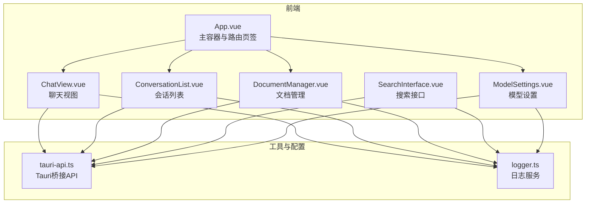
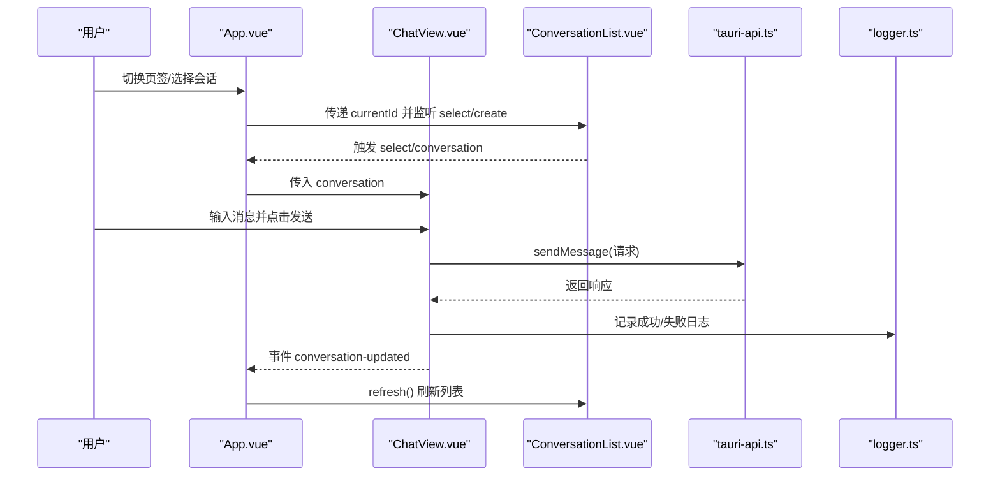
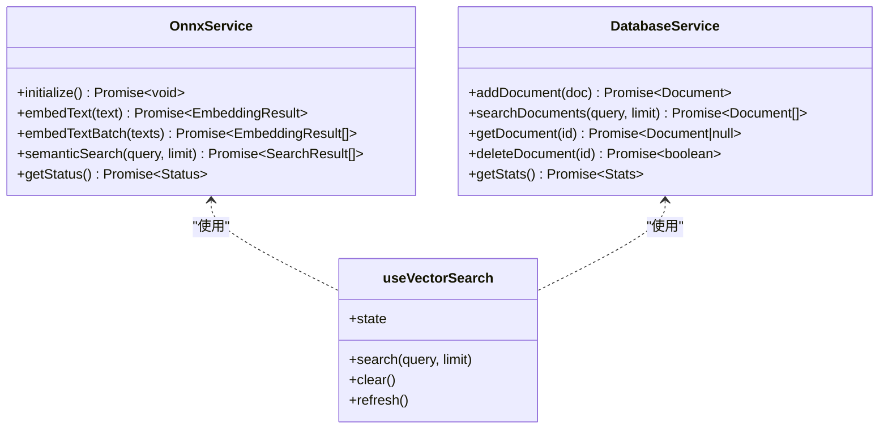
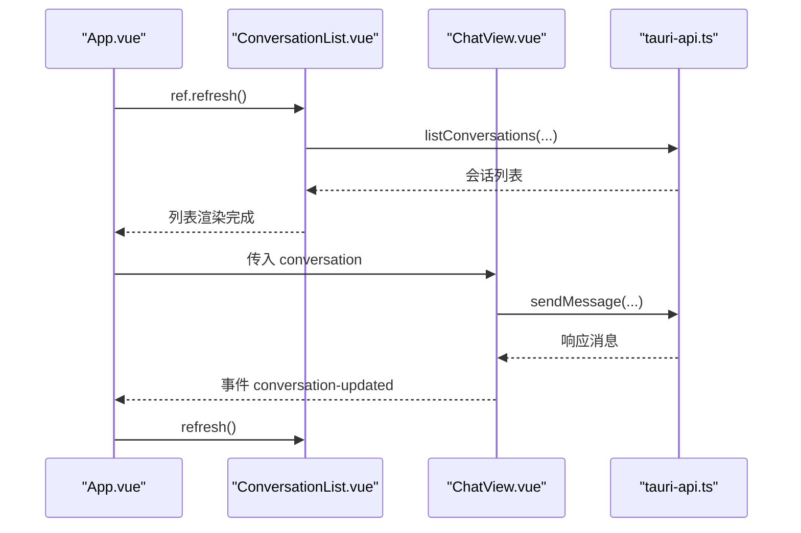
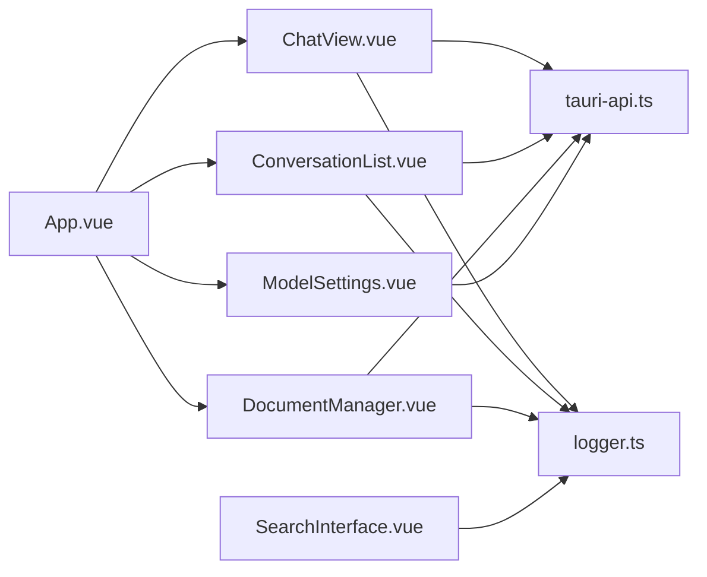

# 基础组件

<cite>
**本文引用的文件**
- [README.md](file://README.md)
- [package.json](file://package.json)
- [src/main.ts](file://src/main.ts)
- [src/App.vue](file://src/App.vue)
- [src/api/tauri-api.ts](file://src/api/tauri-api.ts)
- [src/utils/logger.ts](file://src/utils/logger.ts)
- [src/components/business/ChatView.vue](file://src/components/business/ChatView.vue)
- [src/components/business/ConversationList.vue](file://src/components/business/ConversationList.vue)
- [src/components/business/DocumentManager.vue](file://src/components/business/DocumentManager.vue)
- [src/components/SearchInterface.vue](file://src/components/SearchInterface.vue)
- [src/components/settings/ModelSettings.vue](file://src/components/settings/ModelSettings.vue)
- [docs/testing-and-optimization.md](file://docs/testing-and-optimization.md)
- [docs/configuration-management.md](file://docs/configuration-management.md)
- [TAURI_VUE_INTEGRATION_BEST_PRACTICES.md](file://TAURI_VUE_INTEGRATION_BEST_PRACTICES.md)
</cite>

## 目录
1. [简介](#简介)
2. [项目结构](#项目结构)
3. [核心组件](#核心组件)
4. [架构总览](#架构总览)
5. [组件详解](#组件详解)
6. [依赖关系分析](#依赖关系分析)
7. [性能考量](#性能考量)
8. [故障排查指南](#故障排查指南)
9. [结论](#结论)
10. [附录](#附录)

## 简介
本文件聚焦Malou Agent桌面应用中的“基础组件”设计与实现，涵盖通用UI组件、布局组件与工具组件的可复用性设计（props接口、事件系统、样式封装）、扩展机制（继承/组合/插槽）、性能优化策略（懒加载、虚拟化、缓存），并通过具体示例说明这些组件如何与业务组件协作，确保一致的用户体验。

## 项目结构
Malou Agent采用Vue 3 + Element Plus + Tauri的架构，前端通过Vite构建，后端由Rust提供能力（如ONNX推理、数据库访问）。基础组件主要分布在业务组件与设置组件中，并通过统一的API层与后端交互。

图表来源
- [src/App.vue](file://src/App.vue#L1-L121)
- [src/components/business/ChatView.vue](file://src/components/business/ChatView.vue#L1-L569)
- [src/components/business/ConversationList.vue](file://src/components/business/ConversationList.vue#L1-L367)
- [src/components/business/DocumentManager.vue](file://src/components/business/DocumentManager.vue#L1-L256)
- [src/components/SearchInterface.vue](file://src/components/SearchInterface.vue#L1-L611)
- [src/components/settings/ModelSettings.vue](file://src/components/settings/ModelSettings.vue#L1-L580)
- [src/api/tauri-api.ts](file://src/api/tauri-api.ts#L1-L242)
- [src/utils/logger.ts](file://src/utils/logger.ts#L1-L95)

章节来源
- [README.md](file://README.md#L1-L76)
- [package.json](file://package.json#L1-L31)
- [src/main.ts](file://src/main.ts#L1-L13)

## 核心组件
- 通用UI组件
  - Element Plus按钮、输入、下拉、对话框、表格、标签页等，作为基础交互控件被广泛复用。
- 布局组件
  - App.vue提供顶部导航与主内容区布局；各业务组件内部采用Flex布局进行分栏与自适应。
- 工具组件
  - 日志服务（logger.ts）提供全局日志记录与查询；搜索接口（SearchInterface.vue）封装向量与文本混合搜索。
- 业务组件
  - ChatView：会话消息展示、发送、模型切换、清空历史等。
  - ConversationList：会话列表、创建、编辑标题、删除、刷新。
  - DocumentManager：文档增删改查、搜索过滤、批量选择。
  - ModelSettings：模型配置管理、导出/导入、开关控制。

章节来源
- [src/App.vue](file://src/App.vue#L1-L121)
- [src/components/business/ChatView.vue](file://src/components/business/ChatView.vue#L1-L569)
- [src/components/business/ConversationList.vue](file://src/components/business/ConversationList.vue#L1-L367)
- [src/components/business/DocumentManager.vue](file://src/components/business/DocumentManager.vue#L1-L256)
- [src/components/SearchInterface.vue](file://src/components/SearchInterface.vue#L1-L611)
- [src/components/settings/ModelSettings.vue](file://src/components/settings/ModelSettings.vue#L1-L580)
- [src/utils/logger.ts](file://src/utils/logger.ts#L1-L95)

## 架构总览
基础组件通过props接收数据、通过事件向上通信、通过Element Plus样式与主题保持一致。业务组件负责编排与状态管理，工具组件提供横切关注点（日志、搜索、配置）。

图表来源
- [src/App.vue](file://src/App.vue#L1-L121)
- [src/components/business/ChatView.vue](file://src/components/business/ChatView.vue#L1-L569)
- [src/components/business/ConversationList.vue](file://src/components/business/ConversationList.vue#L1-L367)
- [src/api/tauri-api.ts](file://src/api/tauri-api.ts#L1-L242)
- [src/utils/logger.ts](file://src/utils/logger.ts#L1-L95)

## 组件详解

### 通用UI组件与可复用性设计
- Props接口定义
  - ChatView：接收 conversation 对象，决定是否渲染头部与输入区。
  - ConversationList：接收 currentId，高亮当前选中项。
  - DocumentManager：内部维护 loading/searchQuery 等状态，支持搜索过滤。
  - SearchInterface：支持 autoSearch 与 debounceMs 的行为开关。
- 事件系统
  - ChatView：触发 conversation-updated、open-settings。
  - ConversationList：触发 select、create。
  - DocumentManager：通过 ElTable 的 selection-change 事件收集多选。
- 样式封装
  - 各组件均使用 scoped 样式，避免全局污染；通过 Element Plus 类名与变量保持视觉一致性。

章节来源
- [src/components/business/ChatView.vue](file://src/components/business/ChatView.vue#L25-L32)
- [src/components/business/ConversationList.vue](file://src/components/business/ConversationList.vue#L13-L20)
- [src/components/business/DocumentManager.vue](file://src/components/business/DocumentManager.vue#L1-L256)
- [src/components/SearchInterface.vue](file://src/components/SearchInterface.vue#L447-L456)

### 布局组件与组合模式
- App.vue 作为根布局，使用 Element Container/ Header/Main/ Tabs 组合形成三段式布局；在聊天页签内采用左右分栏（侧边栏+主面板）。
- 业务组件内部也采用组合模式：例如 ChatView 内部组合了消息列表、输入区、模型选择器、动作按钮等子结构，通过 v-if/v-show 控制显隐。

章节来源
- [src/App.vue](file://src/App.vue#L34-L120)
- [src/components/business/ChatView.vue](file://src/components/business/ChatView.vue#L285-L400)

### 工具组件与扩展机制
- 日志服务（logger.ts）
  - 单例模式，提供 info/warn/error/debug 接口；限制日志条目上限，支持按级别/最近日志查询。
  - ChatView/ConversationList/DocumentManager 均在关键路径调用 logger 记录事件。
- 搜索接口（SearchInterface.vue）
  - OnnxService：封装 ONNX 嵌入与语义搜索，支持预热、批处理、状态查询。
  - DatabaseService：封装文档增删改查与统计。
  - useVectorSearch：组合式函数，统一状态与搜索流程，支持并行语义+文本搜索与结果合并。
  - SearchInterface.vue：作为可复用的搜索组件，支持自动搜索与防抖。

图表来源
- [src/components/SearchInterface.vue](file://src/components/SearchInterface.vue#L20-L144)
- [src/components/SearchInterface.vue](file://src/components/SearchInterface.vue#L162-L251)
- [src/components/SearchInterface.vue](file://src/components/SearchInterface.vue#L269-L341)

章节来源
- [src/utils/logger.ts](file://src/utils/logger.ts#L1-L95)
- [src/components/SearchInterface.vue](file://src/components/SearchInterface.vue#L1-L611)

### 业务组件协作示例
- ChatView 与 ConversationList
  - App.vue 通过 ref 调用 ConversationList 的暴露方法 refresh，在 ChatView 发送消息或清空历史后同步更新列表。
- ChatView 与 ModelSettings
  - ChatView 提供 open-settings 事件，App.vue 监听后切换至设置页签，实现跨组件导航。
- DocumentManager 与 API 层
  - 通过 tauri-api.ts 的 listDocuments/createDocument/updateDocument/deleteDocument 等接口与后端交互，统一错误提示与加载状态。

图表来源
- [src/App.vue](file://src/App.vue#L1-L121)
- [src/components/business/ChatView.vue](file://src/components/business/ChatView.vue#L1-L569)
- [src/components/business/ConversationList.vue](file://src/components/business/ConversationList.vue#L1-L367)
- [src/api/tauri-api.ts](file://src/api/tauri-api.ts#L1-L242)

章节来源
- [src/App.vue](file://src/App.vue#L1-L121)
- [src/components/business/ChatView.vue](file://src/components/business/ChatView.vue#L1-L569)
- [src/components/business/ConversationList.vue](file://src/components/business/ConversationList.vue#L1-L367)
- [src/api/tauri-api.ts](file://src/api/tauri-api.ts#L1-L242)

## 依赖关系分析
- 组件间耦合
  - App.vue 作为编排者，耦合度适中，通过 props 与事件解耦业务组件。
  - 业务组件对 API 层存在直接依赖，建议通过依赖注入或配置中心进一步抽象。
- 外部依赖
  - Element Plus 提供UI基础；Tauri 提供系统能力与跨平台运行时。
- 潜在循环依赖
  - 当前结构未见循环依赖；若引入更多组合式函数，需注意避免相互引用。

图表来源
- [src/App.vue](file://src/App.vue#L1-L121)
- [src/components/business/ChatView.vue](file://src/components/business/ChatView.vue#L1-L569)
- [src/components/business/ConversationList.vue](file://src/components/business/ConversationList.vue#L1-L367)
- [src/components/business/DocumentManager.vue](file://src/components/business/DocumentManager.vue#L1-L256)
- [src/components/SearchInterface.vue](file://src/components/SearchInterface.vue#L1-L611)
- [src/components/settings/ModelSettings.vue](file://src/components/settings/ModelSettings.vue#L1-L580)
- [src/api/tauri-api.ts](file://src/api/tauri-api.ts#L1-L242)
- [src/utils/logger.ts](file://src/utils/logger.ts#L1-L95)

章节来源
- [src/App.vue](file://src/App.vue#L1-L121)
- [src/api/tauri-api.ts](file://src/api/tauri-api.ts#L1-L242)

## 性能考量
- 懒加载与延迟初始化
  - OnnxService 支持 initialize 与预热（warmup），避免首次调用的冷启动开销。
- 虚拟化与分批处理
  - useVectorSearch 中对嵌入生成采用分批（batch）处理，降低内存峰值。
- 缓存与状态管理
  - useVectorSearch 维护搜索状态（query/results/loading/error），减少重复请求与无效渲染。
- 文档与实践参考
  - 文档中提供了“内存管理优化”的组合式函数模板（虚拟滚动、图片懒加载），可用于后续扩展。

章节来源
- [src/components/SearchInterface.vue](file://src/components/SearchInterface.vue#L36-L48)
- [src/components/SearchInterface.vue](file://src/components/SearchInterface.vue#L77-L91)
- [docs/testing-and-optimization.md](file://docs/testing-and-optimization.md#L129-L157)
- [TAURI_VUE_INTEGRATION_BEST_PRACTICES.md](file://TAURI_VUE_INTEGRATION_BEST_PRACTICES.md#L317-L350)

## 故障排查指南
- 搜索失败
  - 检查 OnnxService.getStatus 与后端服务状态；useVectorSearch 捕获异常并写入 state.error。
- 会话列表不刷新
  - 确认 ChatView 发出 conversation-updated 事件，App.vue 正确调用 ConversationList.refresh。
- 文档管理异常
  - 查看 tauri-api.ts 的文档相关接口是否抛出未实现错误；确认后端对应命令已实现。
- 日志定位
  - 使用 logger 实例记录关键路径，结合 getLogs/getRecentLogs 定位问题。

章节来源
- [src/components/SearchInterface.vue](file://src/components/SearchInterface.vue#L286-L310)
- [src/components/business/ChatView.vue](file://src/components/business/ChatView.vue#L206-L222)
- [src/api/tauri-api.ts](file://src/api/tauri-api.ts#L217-L235)
- [src/utils/logger.ts](file://src/utils/logger.ts#L62-L76)

## 结论
Malou Agent的基础组件遵循“低耦合、高内聚”的设计原则：通过明确的props/事件契约、统一的工具层（日志、搜索）与稳定的UI库，实现了良好的可复用性与可扩展性。未来可在以下方面持续优化：
- 将API层抽象为依赖注入的服务接口，便于替换与测试；
- 引入虚拟化与分页策略，提升大数据量场景下的性能；
- 增强错误边界与重试机制，提升稳定性。

## 附录
- 配置管理界面参考
  - 文档中提供了“主配置组件”的示例结构，可作为扩展基础组件的参考。

章节来源
- [docs/configuration-management.md](file://docs/configuration-management.md#L97-L120)