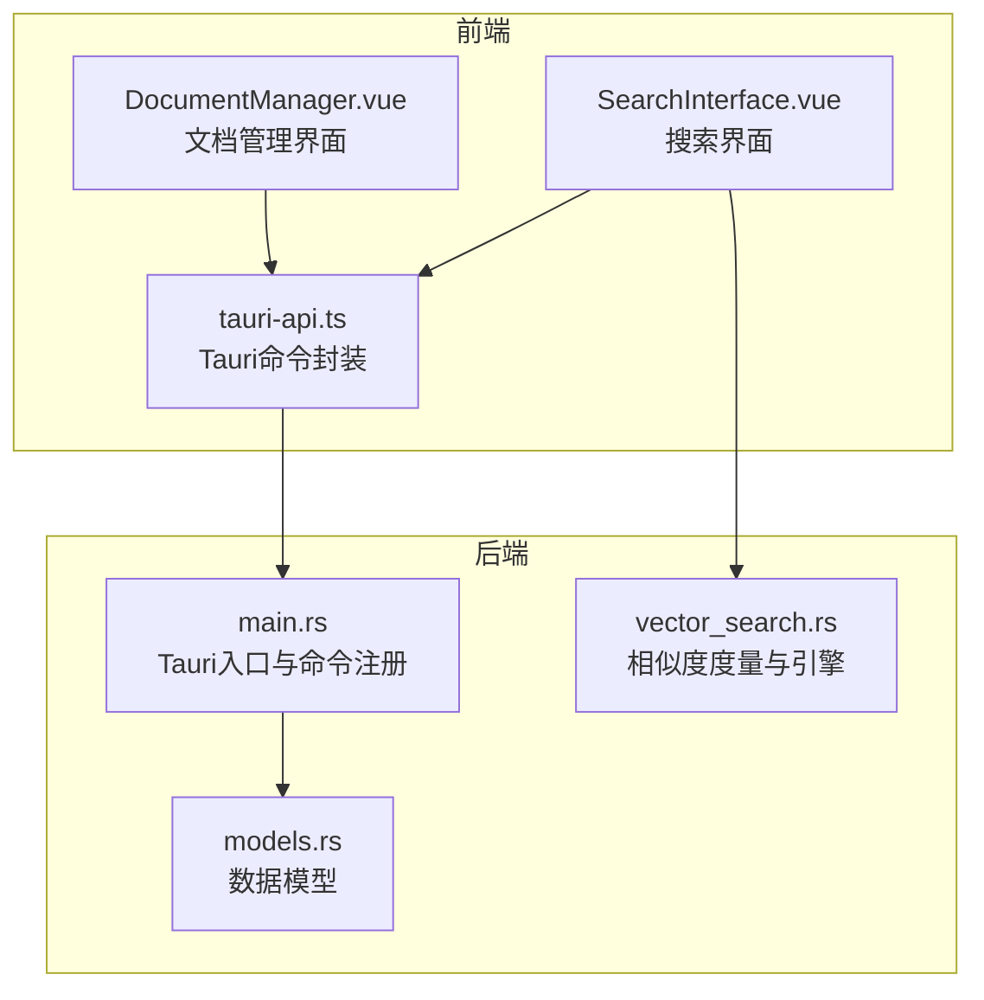
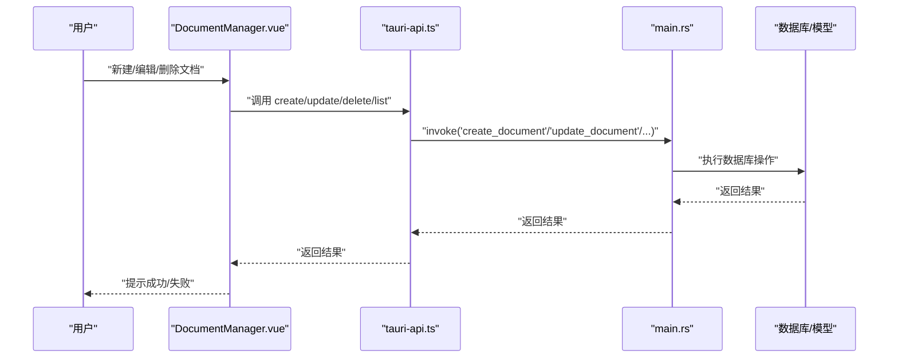
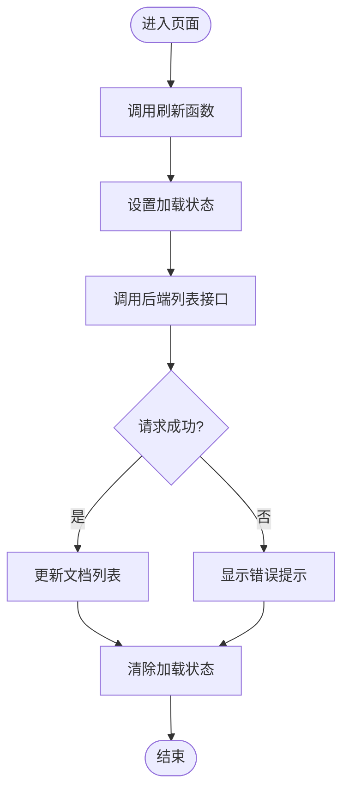
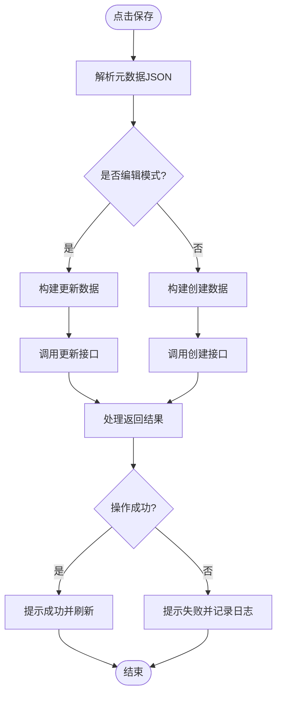
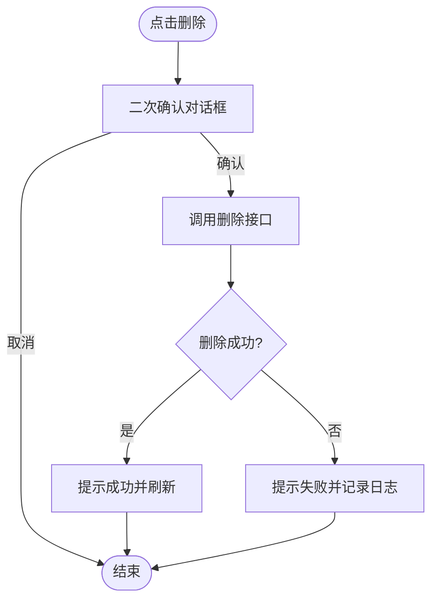
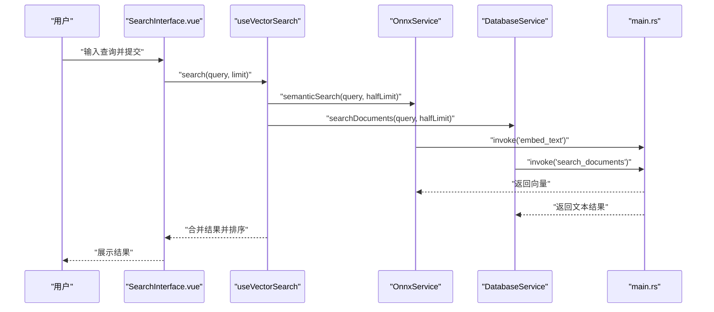
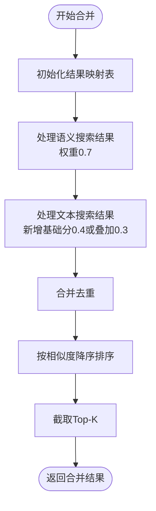
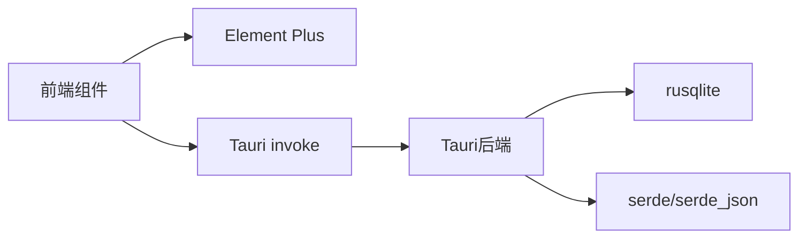

# 文档管理组件

<cite>
**本文引用的文件**
- [DocumentManager.vue](file://src/components/business/DocumentManager.vue)
- [SearchInterface.vue](file://src/components/SearchInterface.vue)
- [tauri-api.ts](file://src/api/tauri-api.ts)
- [vector_search.rs](file://src-tauri/src/vector_search.rs)
- [chromadb-integration.md](file://docs/chromadb-integration.md)
- [main.rs](file://src-tauri/src/main.rs)
- [Cargo.toml](file://src-tauri/Cargo.toml)
- [models.rs](file://src-tauri/src/database/models.rs)
- [db_test.rs](file://src-tauri/src/db_test.rs)
</cite>

## 目录
1. [简介](#简介)
2. [项目结构](#项目结构)
3. [核心组件](#核心组件)
4. [架构总览](#架构总览)
5. [详细组件分析](#详细组件分析)
6. [依赖关系分析](#依赖关系分析)
7. [性能考虑](#性能考虑)
8. [故障排查指南](#故障排查指南)
9. [结论](#结论)

## 简介
本文档系统性地解析“文档管理组件”的设计与实现，重点覆盖以下方面：
- 文档上传、删除、搜索与管理功能
- 与向量搜索系统的集成（文档索引创建、相似度搜索、结果合并与展示）
- 文件上传处理机制（验证、进度跟踪、错误处理）
- 搜索界面实现（全文搜索、过滤条件、结果排序）
- 提供具体代码示例路径，展示组件如何处理文件操作、异步请求与用户反馈

## 项目结构
该组件位于前端业务组件层，配合 Tauri 后端命令与数据库服务，形成完整的文档管理与向量检索能力。

图表来源
- [DocumentManager.vue](file://src/components/business/DocumentManager.vue#L1-L256)
- [SearchInterface.vue](file://src/components/SearchInterface.vue#L1-L611)
- [tauri-api.ts](file://src/api/tauri-api.ts#L1-L242)
- [main.rs](file://src-tauri/src/main.rs#L242-L321)
- [vector_search.rs](file://src-tauri/src/vector_search.rs#L1-L84)
- [models.rs](file://src-tauri/src/database/models.rs#L1-L110)

章节来源
- [DocumentManager.vue](file://src/components/business/DocumentManager.vue#L1-L256)
- [SearchInterface.vue](file://src/components/SearchInterface.vue#L1-L611)
- [tauri-api.ts](file://src/api/tauri-api.ts#L1-L242)
- [main.rs](file://src-tauri/src/main.rs#L242-L321)

## 核心组件
- 文档管理界面（DocumentManager.vue）：提供新建/编辑/删除文档、全文检索、表格展示与加载状态控制。
- 搜索界面（SearchInterface.vue）：提供搜索输入、并发语义搜索与文本搜索、结果合并与展示。
- Tauri API 封装（tauri-api.ts）：统一暴露后端命令，当前文档管理 API 仍为占位实现。
- 向量搜索引擎（vector_search.rs）：提供余弦相似度与欧氏距离计算、Top-K 检索。
- 后端入口（main.rs）：注册命令、初始化数据库与服务。
- 数据模型（models.rs）：会话、消息、Token 使用等模型定义。

章节来源
- [DocumentManager.vue](file://src/components/business/DocumentManager.vue#L90-L232)
- [SearchInterface.vue](file://src/components/SearchInterface.vue#L20-L144)
- [tauri-api.ts](file://src/api/tauri-api.ts#L180-L242)
- [vector_search.rs](file://src-tauri/src/vector_search.rs#L42-L84)
- [main.rs](file://src-tauri/src/main.rs#L242-L321)
- [models.rs](file://src-tauri/src/database/models.rs#L1-L110)

## 架构总览
文档管理与向量搜索的整体流程如下：

图表来源
- [DocumentManager.vue](file://src/components/business/DocumentManager.vue#L136-L231)
- [tauri-api.ts](file://src/api/tauri-api.ts#L216-L235)
- [main.rs](file://src-tauri/src/main.rs#L290-L317)

章节来源
- [DocumentManager.vue](file://src/components/business/DocumentManager.vue#L136-L231)
- [tauri-api.ts](file://src/api/tauri-api.ts#L216-L235)
- [main.rs](file://src-tauri/src/main.rs#L290-L317)

## 详细组件分析

### 文档管理组件（DocumentManager.vue）
- 功能要点
  - 列表展示：标题、内容摘要、创建/更新时间、操作列（编辑、删除）
  - 搜索过滤：基于标题与内容的本地过滤
  - 表单交互：新建/编辑对话框，支持元数据 JSON 输入
  - 加载与错误处理：全局加载状态、Element Plus 消息提示
  - 生命周期：组件挂载时自动刷新文档列表

- 关键流程图（刷新与搜索）

图表来源
- [DocumentManager.vue](file://src/components/business/DocumentManager.vue#L136-L146)

- 保存流程（新建/更新）

图表来源
- [DocumentManager.vue](file://src/components/business/DocumentManager.vue#L163-L202)

- 删除流程

图表来源
- [DocumentManager.vue](file://src/components/business/DocumentManager.vue#L204-L221)

章节来源
- [DocumentManager.vue](file://src/components/business/DocumentManager.vue#L1-L256)

### 搜索界面组件（SearchInterface.vue）
- 功能要点
  - 输入框与按钮：支持回车触发、禁用态控制
  - 并发搜索：同时发起语义搜索与文本搜索，合并去重并按相似度排序
  - 结果展示：标题、相似度分数、内容截断
  - 状态反馈：加载中、结果数量、错误提示
  - 自动搜索：可选防抖（debounce）策略

- 搜索与合并流程

图表来源
- [SearchInterface.vue](file://src/components/SearchInterface.vue#L286-L310)
- [SearchInterface.vue](file://src/components/SearchInterface.vue#L96-L112)
- [SearchInterface.vue](file://src/components/SearchInterface.vue#L194-L205)

- 合并与排序算法

图表来源
- [SearchInterface.vue](file://src/components/SearchInterface.vue#L346-L383)

章节来源
- [SearchInterface.vue](file://src/components/SearchInterface.vue#L1-L611)

### 向量搜索系统集成
- 相似度度量与引擎
  - 提供余弦相似度与欧氏距离两种度量接口
  - 引擎维护文档向量集合，支持 Top-K 检索与长度统计

- 与前端的协作
  - 前端通过 OnnxService 生成查询向量
  - 调用后端命令进行向量检索
  - 合并语义与文本搜索结果，提升召回质量

章节来源
- [vector_search.rs](file://src-tauri/src/vector_search.rs#L3-L84)
- [SearchInterface.vue](file://src/components/SearchInterface.vue#L20-L144)

### 文档管理 API 与后端集成
- 当前现状
  - 文档管理 API 在前端封装中仍为占位实现，抛出“尚未实现”异常
  - 后端入口已注册多种命令，但未包含文档管理相关命令

- 建议实现路径
  - 在后端实现文档 CRUD 命令（创建、查询、更新、删除）
  - 在前端替换占位 API，调用真实命令
  - 可参考数据库模型与测试用例，确保数据一致性

章节来源
- [tauri-api.ts](file://src/api/tauri-api.ts#L216-L235)
- [main.rs](file://src-tauri/src/main.rs#L290-L317)
- [models.rs](file://src-tauri/src/database/models.rs#L1-L110)
- [db_test.rs](file://src-tauri/src/db_test.rs#L36-L58)

### 文件上传处理机制（概念说明）
- 文件验证：建议在前端对文件大小、类型进行校验；后端对上传内容进行二次校验
- 进度跟踪：对于大文件上传，建议采用分片上传与进度回调
- 错误处理：统一错误码与提示，区分网络错误、业务错误与用户取消
- 用户反馈：结合 Element Plus 的消息与加载组件，提供即时反馈

（本节为通用实践说明，不直接分析具体源文件）

## 依赖关系分析
- 前端依赖
  - Element Plus：UI 组件与消息提示
  - Tauri invoke：与后端命令通信
  - Vue 组合式 API：响应式状态与生命周期

- 后端依赖
  - Tauri：命令注册与运行时
  - rusqlite：SQLite 数据库访问
  - serde/serde_json：序列化与反序列化

图表来源
- [Cargo.toml](file://src-tauri/Cargo.toml#L12-L25)
- [main.rs](file://src-tauri/src/main.rs#L242-L321)

章节来源
- [Cargo.toml](file://src-tauri/Cargo.toml#L1-L25)
- [main.rs](file://src-tauri/src/main.rs#L242-L321)

## 性能考虑
- 搜索性能
  - 并发搜索：前端对语义与文本搜索并行执行，缩短等待时间
  - 结果合并：使用 Map 去重，避免重复计算
  - Top-K 截断：限制结果规模，降低渲染压力

- 向量检索
  - 相似度计算复杂度与向量维度相关，建议在模型侧控制向量维度
  - 批量嵌入与分批处理，减少内存峰值

- 前端渲染
  - 内容截断与预览，避免长文本导致的 DOM 压力
  - 加载状态与骨架屏，改善用户体验

（本节为通用性能建议，不直接分析具体源文件）

## 故障排查指南
- 文档管理 API 未实现
  - 现象：调用创建/更新/删除接口抛出异常
  - 排查：确认后端是否已实现对应命令；检查命令名与参数
  - 参考：前端占位 API 与后端命令注册位置

- 搜索无结果或报错
  - 现象：搜索界面显示错误或空结果
  - 排查：检查 Onnx 模型初始化状态、嵌入生成是否成功、后端语义搜索命令是否可用
  - 参考：搜索组合式函数与服务类的状态与错误处理

- 数据库问题
  - 现象：数据库初始化失败或查询异常
  - 排查：查看初始化日志、表结构是否正确、测试用例是否通过
  - 参考：后端初始化流程与数据库测试

章节来源
- [tauri-api.ts](file://src/api/tauri-api.ts#L216-L235)
- [SearchInterface.vue](file://src/components/SearchInterface.vue#L286-L310)
- [main.rs](file://src-tauri/src/main.rs#L242-L321)
- [db_test.rs](file://src-tauri/src/db_test.rs#L36-L58)

## 结论
- 文档管理组件提供了完善的前端交互与状态管理，当前文档管理 API 仍需后端补全
- 搜索界面实现了语义与文本搜索的并发与融合，具备良好的扩展性
- 向量搜索系统以 Rust 实现，具备清晰的相似度度量与检索接口
- 建议优先完善后端文档管理命令与数据库模型，随后接入前端真实 API，并持续优化搜索与渲染性能