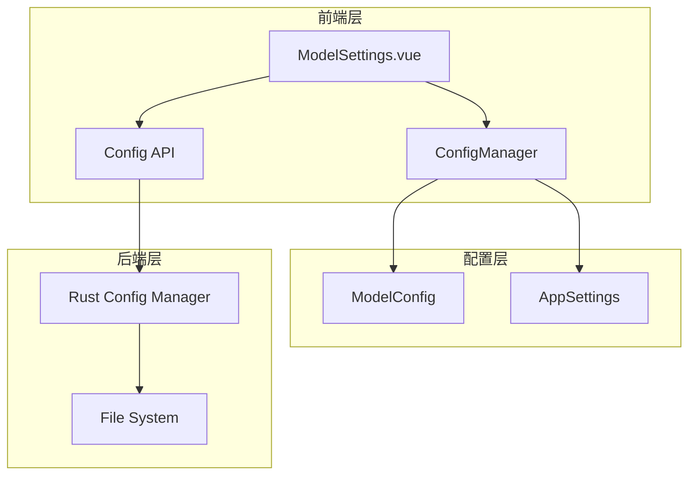
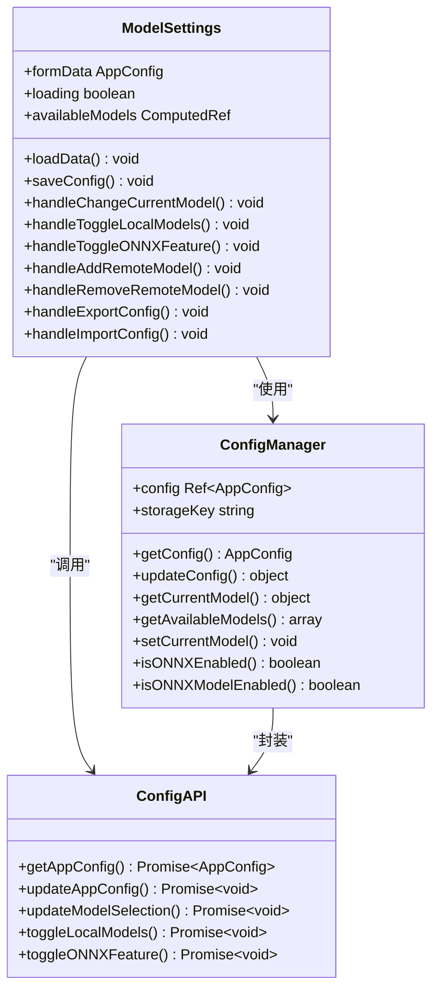
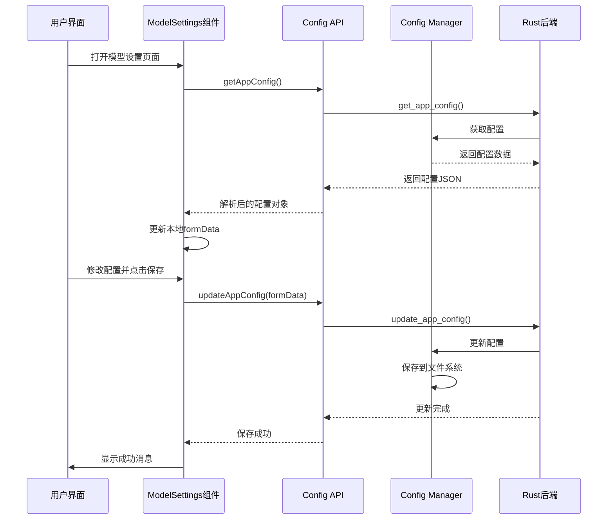
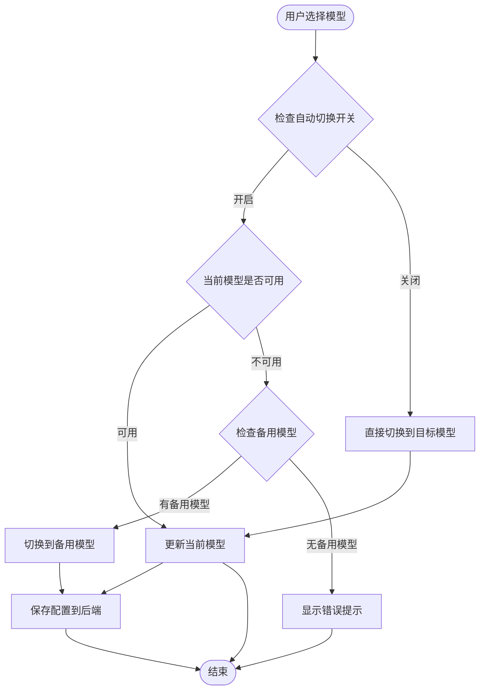
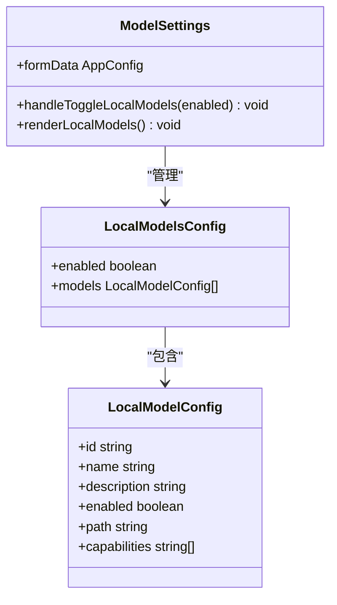
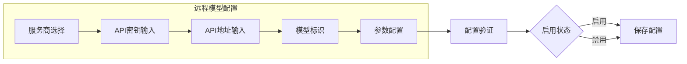
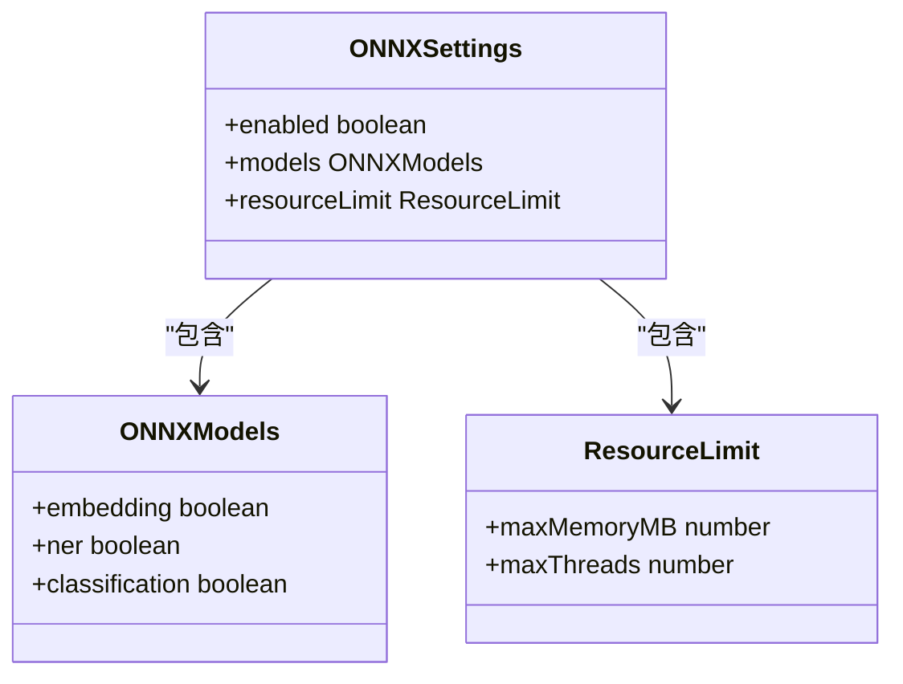
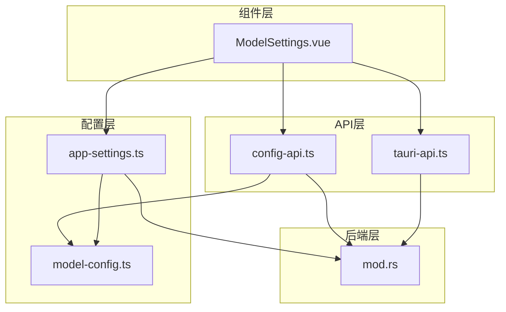

# 模型设置组件

<cite>
**本文档引用的文件**
- [ModelSettings.vue](file://src/components/settings/ModelSettings.vue)
- [model-config.ts](file://src/config/model-config.ts)
- [app-settings.ts](file://src/config/app-settings.ts)
- [config-api.ts](file://src/api/config-api.ts)
- [tauri-api.ts](file://src/api/tauri-api.ts)
- [mod.rs](file://src-tauri/src/config/mod.rs)
</cite>

## 目录
1. [简介](#简介)
2. [项目结构](#项目结构)
3. [核心组件](#核心组件)
4. [架构概览](#架构概览)
5. [详细组件分析](#详细组件分析)
6. [依赖关系分析](#依赖关系分析)
7. [性能考虑](#性能考虑)
8. [故障排除指南](#故障排除指南)
9. [结论](#结论)

## 简介

模型设置组件是Malou Agent桌面应用中的核心配置管理界面，负责管理AI模型的各种配置选项。该组件提供了完整的模型配置管理功能，包括本地模型设置、远程模型配置和ONNX辅助功能管理。通过直观的用户界面，用户可以轻松地配置和切换不同的AI模型，实现灵活的模型选择和管理。

## 项目结构

模型设置组件位于Vue.js前端应用中，采用组件化的架构设计。整个配置管理系统由前端Vue组件、配置管理器、API封装层和后端Rust实现共同组成。

**图表来源**
- [ModelSettings.vue](file://src/components/settings/ModelSettings.vue#L1-L580)
- [app-settings.ts](file://src/config/app-settings.ts#L1-L195)
- [mod.rs](file://src-tauri/src/config/mod.rs#L1-L334)

**章节来源**
- [ModelSettings.vue](file://src/components/settings/ModelSettings.vue#L1-L50)
- [app-settings.ts](file://src/config/app-settings.ts#L1-L50)

## 核心组件

### 模型设置组件架构

模型设置组件采用Vue 3 Composition API构建，实现了完整的响应式数据绑定和状态管理。组件包含四个主要配置区域：模型选择、本地模型、远程模型和ONNX辅助功能。

**图表来源**
- [ModelSettings.vue](file://src/components/settings/ModelSettings.vue#L1-L220)
- [app-settings.ts](file://src/config/app-settings.ts#L6-L180)
- [config-api.ts](file://src/api/config-api.ts#L1-L201)

### 数据模型结构

组件使用统一的配置数据结构来管理所有模型相关的设置：

| 配置类别 | 字段 | 类型 | 描述 |
|---------|------|------|------|
| 本地模型 | enabled | boolean | 是否启用本地模型 |
| 本地模型 | models | LocalModelConfig[] | 本地模型列表 |
| 远程模型 | remoteModels | RemoteModelConfig[] | 远程模型配置数组 |
| ONNX设置 | enabled | boolean | 是否启用ONNX功能 |
| ONNX设置 | models | object | ONNX功能开关 |
| ONNX设置 | resourceLimit | object | 资源限制配置 |
| 模型选择器 | currentModel | string | 当前选中的模型ID |
| 模型选择器 | autoSwitch | boolean | 是否自动切换模型 |
| 模型选择器 | fallbackModel | string | 备用模型ID |

**章节来源**
- [model-config.ts](file://src/config/model-config.ts#L43-L56)
- [ModelSettings.vue](file://src/components/settings/ModelSettings.vue#L17-L45)

## 架构概览

模型设置组件采用了分层架构设计，确保了良好的可维护性和扩展性。整个系统从底层的数据存储到上层的用户界面形成了清晰的层次结构。

**图表来源**
- [ModelSettings.vue](file://src/components/settings/ModelSettings.vue#L88-L117)
- [config-api.ts](file://src/api/config-api.ts#L6-L64)
- [mod.rs](file://src-tauri/src/config/mod.rs#L258-L276)

## 详细组件分析

### 模型选择功能

模型选择功能允许用户在可用的本地和远程模型之间进行切换。组件通过计算属性动态生成可用模型列表，并提供智能的自动切换机制。

**图表来源**
- [ModelSettings.vue](file://src/components/settings/ModelSettings.vue#L144-L153)
- [app-settings.ts](file://src/config/app-settings.ts#L78-L103)

### 本地模型管理

本地模型管理功能支持ONNX模型的启用/禁用控制，以及模型能力的可视化展示。组件提供了直观的开关控件和详细的模型信息展示。

**图表来源**
- [model-config.ts](file://src/config/model-config.ts#L3-L10)
- [ModelSettings.vue](file://src/components/settings/ModelSettings.vue#L120-L129)

### 远程模型配置

远程模型配置支持多种AI服务提供商的集成，包括OpenAI、Azure OpenAI和自定义API。每个远程模型都包含完整的认证和参数配置。

**图表来源**
- [model-config.ts](file://src/config/model-config.ts#L12-L22)
- [ModelSettings.vue](file://src/components/settings/ModelSettings.vue#L356-L439)

### ONNX辅助功能

ONNX辅助功能提供了轻量级的本地文本处理能力，包括文本向量化、命名实体识别和文本分类等任务。

**图表来源**
- [model-config.ts](file://src/config/model-config.ts#L24-L35)
- [ModelSettings.vue](file://src/components/settings/ModelSettings.vue#L442-L507)

**章节来源**
- [ModelSettings.vue](file://src/components/settings/ModelSettings.vue#L1-L580)
- [model-config.ts](file://src/config/model-config.ts#L1-L163)

## 依赖关系分析

模型设置组件的依赖关系体现了清晰的分层架构，确保了各层之间的松耦合和高内聚。

**图表来源**
- [ModelSettings.vue](file://src/components/settings/ModelSettings.vue#L1-L12)
- [config-api.ts](file://src/api/config-api.ts#L1-L201)
- [app-settings.ts](file://src/config/app-settings.ts#L1-L195)
- [mod.rs](file://src-tauri/src/config/mod.rs#L1-L334)

### 关键依赖关系

1. **组件到API的依赖**：ModelSettings组件直接依赖于配置API封装层
2. **API到后端的依赖**：配置API封装层依赖于Rust后端实现
3. **配置到数据模型的依赖**：配置管理器依赖于类型定义
4. **配置到后端的依赖**：配置管理器同时管理前端和后端配置

**章节来源**
- [ModelSettings.vue](file://src/components/settings/ModelSettings.vue#L1-L15)
- [config-api.ts](file://src/api/config-api.ts#L1-L201)
- [app-settings.ts](file://src/config/app-settings.ts#L1-L195)

## 性能考虑

模型设置组件在设计时充分考虑了性能优化，采用了多种策略来提升用户体验：

### 响应式数据优化
- 使用Vue 3的Composition API实现细粒度的状态管理
- 通过计算属性避免不必要的重新渲染
- 实现懒加载机制，仅在需要时加载配置数据

### 异步操作处理
- 所有网络请求都采用异步处理，避免阻塞UI线程
- 实现加载状态管理，提供良好的用户反馈
- 错误处理机制确保应用稳定性

### 内存管理
- 合理的组件生命周期管理
- 及时清理事件监听器和定时器
- 避免内存泄漏和性能瓶颈

## 故障排除指南

### 常见问题及解决方案

#### 配置加载失败
**问题描述**：组件无法加载配置数据
**可能原因**：
- 后端服务未启动
- 配置文件损坏
- 权限不足

**解决步骤**：
1. 检查后端服务状态
2. 验证配置文件完整性
3. 检查文件权限设置

#### 模型切换失败
**问题描述**：无法切换到指定模型
**可能原因**：
- 目标模型不可用
- 配置验证失败
- 网络连接问题

**解决步骤**：
1. 检查模型可用性状态
2. 验证配置参数正确性
3. 确认网络连接稳定

#### 配置保存失败
**问题描述**：配置更改无法保存
**可能原因**：
- 文件写入权限不足
- 磁盘空间不足
- 配置格式错误

**解决步骤**：
1. 检查磁盘空间和权限
2. 验证配置格式正确性
3. 重启应用尝试重新保存

**章节来源**
- [ModelSettings.vue](file://src/components/settings/ModelSettings.vue#L88-L117)
- [config-api.ts](file://src/api/config-api.ts#L137-L201)

## 结论

模型设置组件作为Malou Agent应用的核心配置管理界面，展现了现代前端应用的最佳实践。通过清晰的架构设计、完善的错误处理机制和友好的用户界面，该组件为用户提供了便捷的模型配置体验。

组件的主要优势包括：
- **模块化设计**：清晰的分层架构便于维护和扩展
- **响应式更新**：实时的状态同步确保配置一致性
- **用户友好**：直观的操作界面降低使用门槛
- **健壮性**：完善的错误处理保证系统稳定性

未来可以进一步优化的方向包括：
- 增加配置模板功能
- 实现配置版本管理
- 提供配置导入导出的批量操作
- 增强配置验证的实时反馈