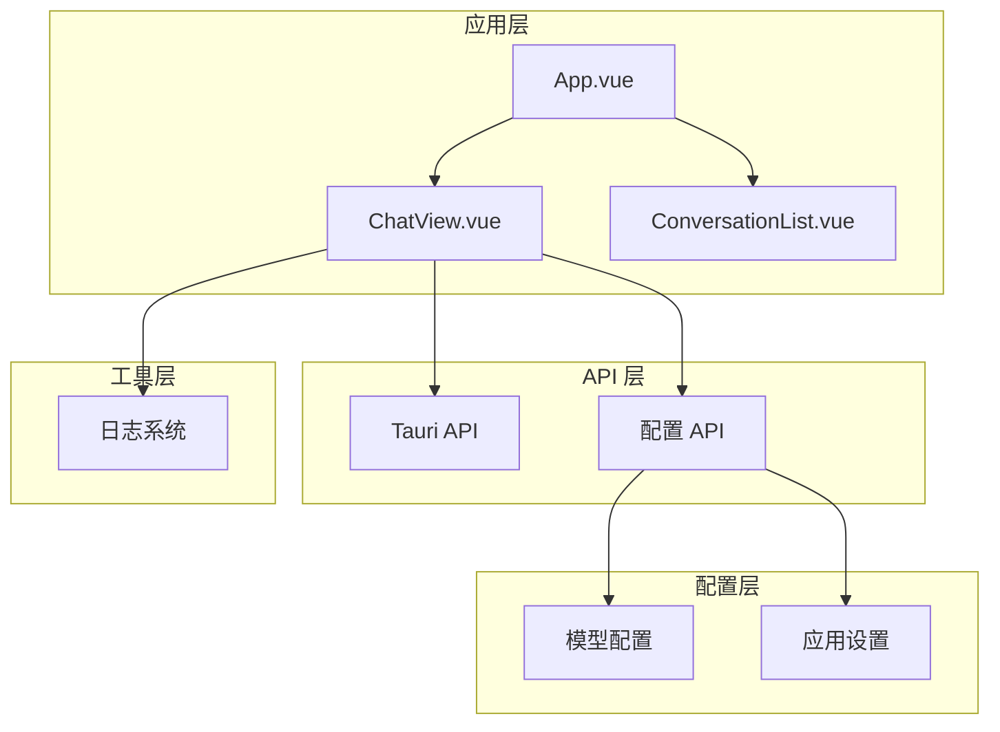
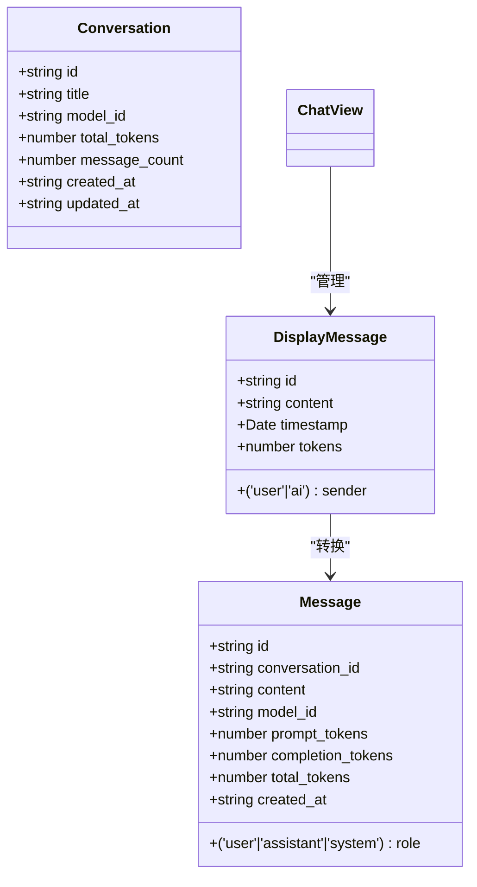
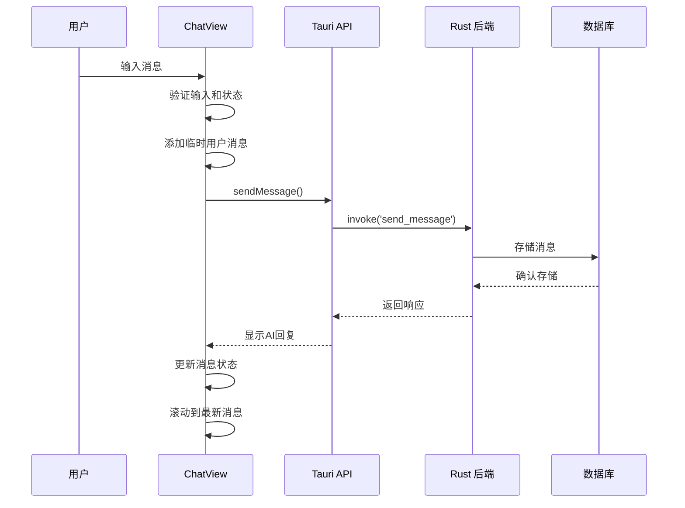
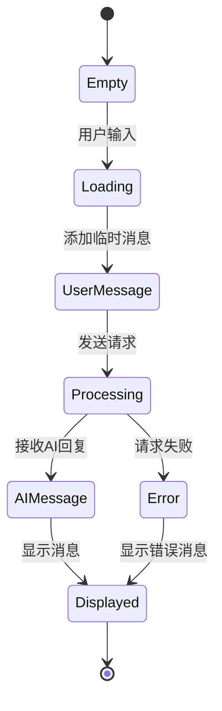
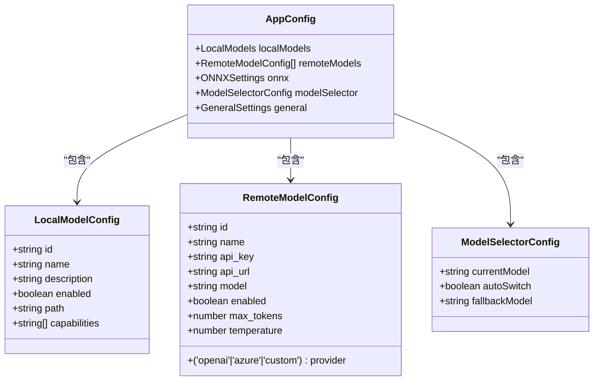
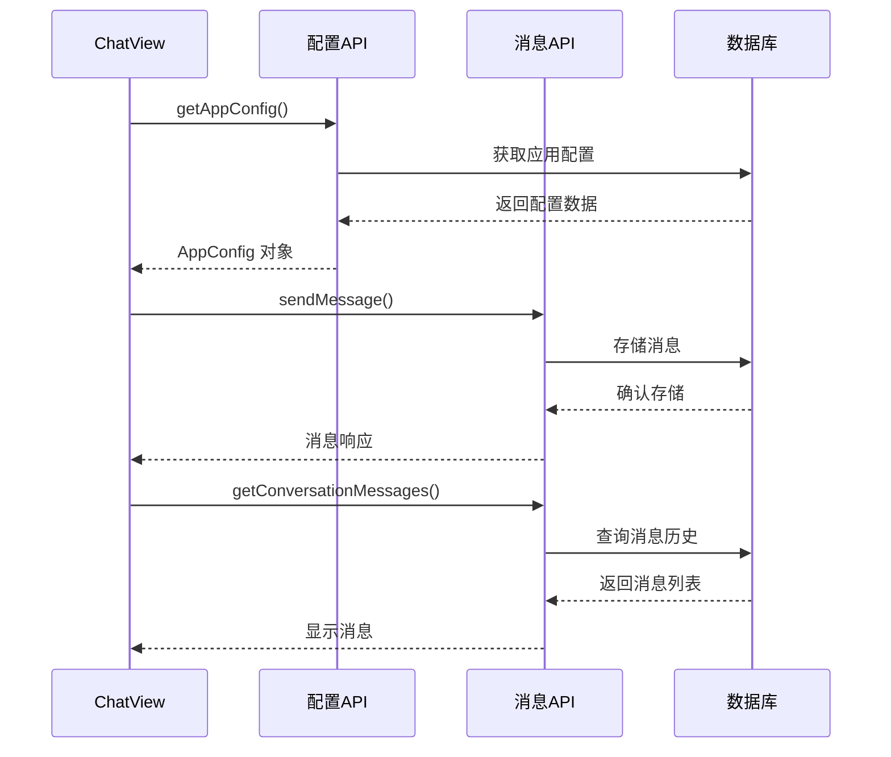
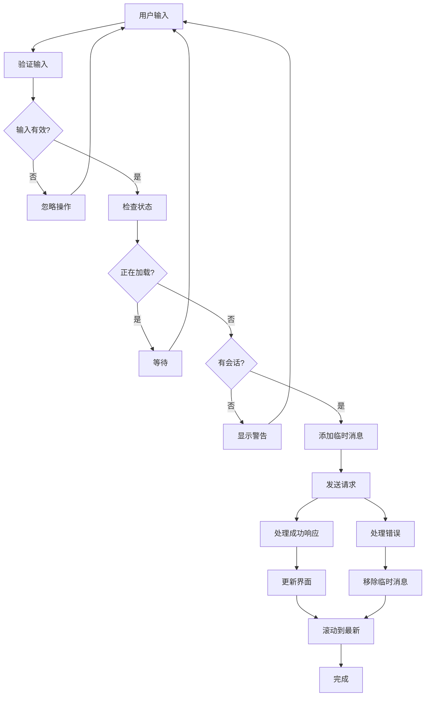
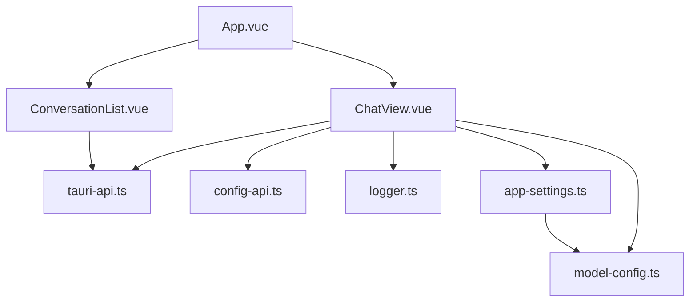

# 聊天视图组件

<cite>
**本文档中引用的文件**
- [ChatView.vue](file://src/components/business/ChatView.vue)
- [tauri-api.ts](file://src/api/tauri-api.ts)
- [config-api.ts](file://src/api/config-api.ts)
- [model-config.ts](file://src/config/model-config.ts)
- [app-settings.ts](file://src/config/app-settings.ts)
- [logger.ts](file://src/utils/logger.ts)
- [ConversationList.vue](file://src/components/business/ConversationList.vue)
- [App.vue](file://src/App.vue)
</cite>

## 目录
1. [简介](#简介)
2. [项目结构](#项目结构)
3. [核心组件](#核心组件)
4. [架构概览](#架构概览)
5. [详细组件分析](#详细组件分析)
6. [依赖关系分析](#依赖关系分析)
7. [性能考虑](#性能考虑)
8. [故障排除指南](#故障排除指南)
9. [结论](#结论)

## 简介

ChatView 是 Malou Agent 桌面应用中的核心聊天组件，负责提供实时对话体验。该组件实现了完整的消息管理系统，包括消息显示、用户输入处理、模型选择器和与 Tauri 后端的实时通信。通过 Composition API 的现代化开发模式，组件提供了良好的可维护性和扩展性。

## 项目结构

ChatView 组件位于业务组件目录中，与会话列表组件协同工作，形成完整的聊天界面。组件采用模块化的架构设计，清晰分离了数据管理、UI 展示和后端通信层。



**图表来源**
- [App.vue](file://src/App.vue#L1-L121)
- [ChatView.vue](file://src/components/business/ChatView.vue#L1-L569)

**章节来源**
- [App.vue](file://src/App.vue#L1-L121)
- [ChatView.vue](file://src/components/business/ChatView.vue#L1-L50)

## 核心组件

ChatView 组件是基于 Vue 3 Composition API 构建的现代化组件，具有以下核心特性：

### 主要功能模块

1. **消息管理系统** - 实时显示和管理聊天消息
2. **用户输入处理** - 支持文本输入和快捷键操作
3. **模型选择器** - 动态切换本地和远程模型
4. **实时聊天功能** - 与后端进行异步通信
5. **状态管理** - 完整的消息状态跟踪和滚动控制

### 关键数据结构

组件定义了 `DisplayMessage` 接口来标准化消息显示格式：



**图表来源**
- [ChatView.vue](file://src/components/business/ChatView.vue#L17-L23)
- [tauri-api.ts](file://src/api/tauri-api.ts#L6-L26)

**章节来源**
- [ChatView.vue](file://src/components/business/ChatView.vue#L17-L23)
- [tauri-api.ts](file://src/api/tauri-api.ts#L6-L26)

## 架构概览

ChatView 采用了分层架构设计，确保各层职责清晰分离：



**图表来源**
- [ChatView.vue](file://src/components/business/ChatView.vue#L163-L222)
- [tauri-api.ts](file://src/api/tauri-api.ts#L108-L110)

## 详细组件分析

### Composition API 使用模式

ChatView 组件充分利用了 Vue 3 Composition API 的强大功能：

#### 响应式状态管理

```mermaid
flowchart TD
Start([组件初始化]) --> Setup[setup 函数执行]
Setup --> Refs[创建响应式引用]
Refs --> Computed[计算属性]
Computed --> Watch[监听器]
Watch --> Lifecycle[生命周期钩子]
Lifecycle --> Ready[组件就绪]
Refs --> Messages[messages: DisplayMessage[]]
Refs --> InputMessage[inputMessage: string]
Refs --> IsLoading[isLoading: boolean]
Refs --> MessagesContainer[messagesContainer: HTMLElement]
Refs --> AppConfig[appConfig: AppConfig]
Refs --> ShowModelSelector[showModelSelector: boolean]
Computed --> AvailableModels[availableModels: 计算属性]
Computed --> CurrentModel[currentModel: 计算属性]
Watch --> ConversationWatch[监听会话变化]
Watch --> LoadMessages[自动加载消息]
Lifecycle --> OnMounted[onMounted: 加载配置]
```

**图表来源**
- [ChatView.vue](file://src/components/business/ChatView.vue#L1-L153)

#### 生命周期管理

组件正确使用了多个生命周期钩子来确保资源的有效管理和清理：

- `onMounted`: 初始化应用配置加载
- `watch`: 监听外部状态变化
- `nextTick`: 确保 DOM 更新后的操作

**章节来源**
- [ChatView.vue](file://src/components/business/ChatView.vue#L1-L153)

### 消息状态管理机制

#### DisplayMessage 接口定义

消息状态管理是组件的核心功能之一，通过标准化的消息格式确保了数据的一致性和可维护性：



**图表来源**
- [ChatView.vue](file://src/components/business/ChatView.vue#L163-L222)

#### 消息转换逻辑

组件实现了从 API 消息到显示消息的转换逻辑，确保数据格式的一致性：

**章节来源**
- [ChatView.vue](file://src/components/business/ChatView.vue#L107-L114)

### 模型选择器功能

#### 模型配置管理

ChatView 集成了灵活的模型选择功能，支持本地和远程模型的动态切换：



**图表来源**
- [model-config.ts](file://src/config/model-config.ts#L43-L56)
- [app-settings.ts](file://src/config/app-settings.ts#L6-L183)

**章节来源**
- [ChatView.vue](file://src/components/business/ChatView.vue#L44-L81)
- [model-config.ts](file://src/config/model-config.ts#L43-L56)

### 与 Tauri API 的集成

#### API 调用模式

组件通过统一的 API 层与后端进行通信，确保了良好的解耦和可测试性：



**图表来源**
- [ChatView.vue](file://src/components/business/ChatView.vue#L84-L105)
- [tauri-api.ts](file://src/api/tauri-api.ts#L108-L132)

#### 错误处理策略

组件实现了完善的错误处理机制，确保用户体验的连续性：

**章节来源**
- [ChatView.vue](file://src/components/business/ChatView.vue#L147-L149)
- [tauri-api.ts](file://src/api/tauri-api.ts#L1-L242)

### 用户交互事件处理

#### 输入处理流程

组件提供了完整的用户输入处理机制，包括键盘快捷键支持和输入验证：



**图表来源**
- [ChatView.vue](file://src/components/business/ChatView.vue#L163-L222)

**章节来源**
- [ChatView.vue](file://src/components/business/ChatView.vue#L163-L222)

## 依赖关系分析

### 组件间依赖



**图表来源**
- [ChatView.vue](file://src/components/business/ChatView.vue#L1-L16)
- [App.vue](file://src/App.vue#L1-L32)

### 外部依赖

组件依赖于多个关键库和框架：

- **Vue 3**: Composition API 和响应式系统
- **Element Plus**: UI 组件库
- **Tauri**: 跨平台桌面应用框架
- **日志系统**: 自定义日志管理

**章节来源**
- [ChatView.vue](file://src/components/business/ChatView.vue#L1-L16)
- [App.vue](file://src/App.vue#L1-L8)

## 性能考虑

### 内存管理

组件采用了多种优化策略来确保良好的性能表现：

1. **虚拟滚动**: 对于大量消息的场景，可以考虑实现虚拟滚动
2. **懒加载**: 消息内容的延迟加载
3. **缓存策略**: 配置信息的本地缓存

### 异步操作优化

- 使用 `nextTick` 确保 DOM 更新时机
- 合理的并发控制避免重复请求
- 错误状态的快速反馈机制

## 故障排除指南

### 常见问题及解决方案

#### 消息加载失败

**症状**: 聊天界面无法显示历史消息

**可能原因**:
- 后端服务未启动
- 网络连接问题
- 会话 ID 无效

**解决步骤**:
1. 检查后端服务状态
2. 验证网络连接
3. 确认会话 ID 有效性
4. 查看浏览器控制台错误信息

#### 模型切换失败

**症状**: 无法切换到新的 AI 模型

**可能原因**:
- 配置文件损坏
- API 调用失败
- 权限不足

**解决步骤**:
1. 检查配置文件格式
2. 验证 API 可用性
3. 确认用户权限
4. 重新加载应用配置

#### 输入处理异常

**症状**: 用户输入无法正常发送

**可能原因**:
- 表单验证失败
- 状态锁定
- 网络超时

**解决步骤**:
1. 检查输入字段验证规则
2. 确认组件状态正常
3. 验证网络连接稳定性
4. 查看错误日志

**章节来源**
- [ChatView.vue](file://src/components/business/ChatView.vue#L140-L143)
- [logger.ts](file://src/utils/logger.ts#L1-L95)

## 结论

ChatView 组件展现了现代 Vue 3 应用开发的最佳实践，通过 Composition API 的合理使用、清晰的架构设计和完善的错误处理机制，为用户提供了流畅的聊天体验。组件不仅功能完整，而且具有良好的可维护性和扩展性，为后续的功能增强奠定了坚实的基础。

该组件的成功实现证明了：
- Composition API 在复杂组件中的优势
- 分层架构设计的重要性
- 完善的错误处理和用户体验设计
- 与后端系统的高效集成能力

未来可以在现有基础上进一步优化性能，增加更多高级功能，并持续改进用户体验。