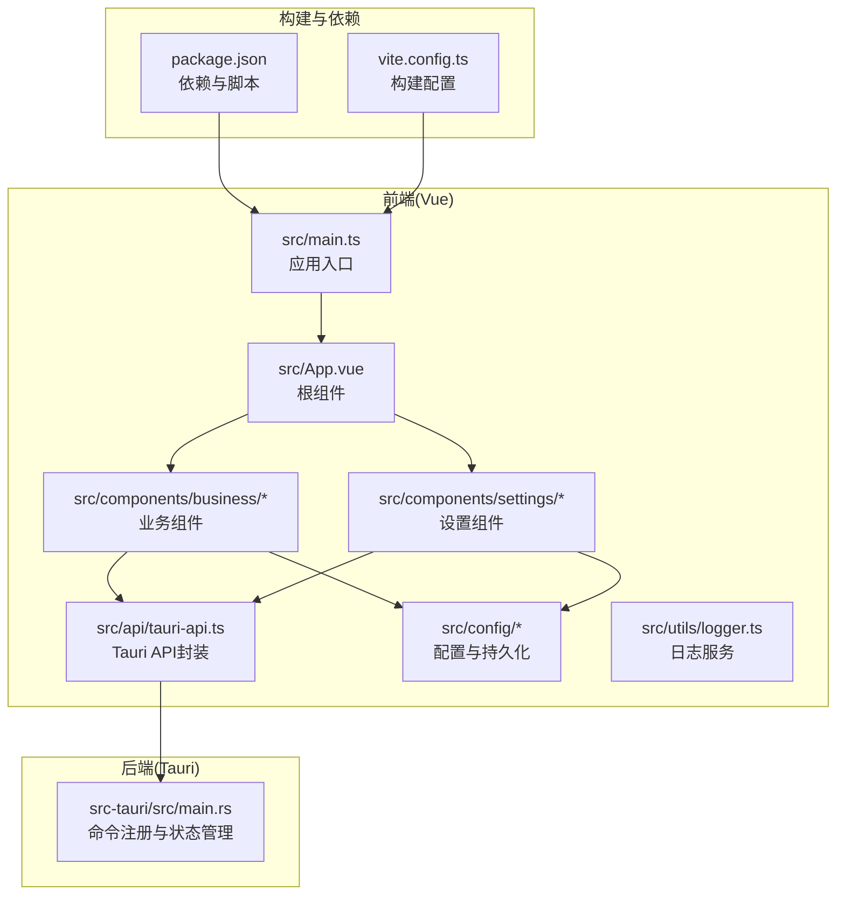
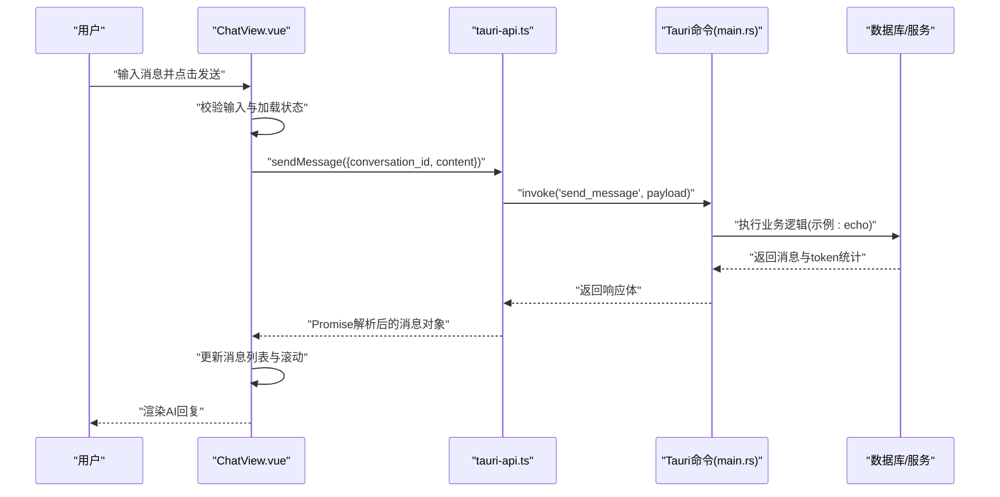
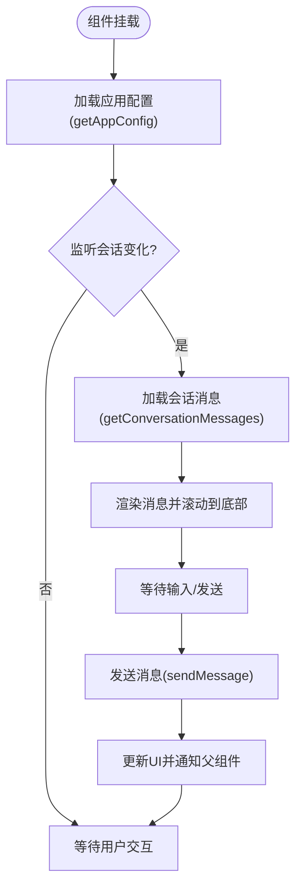
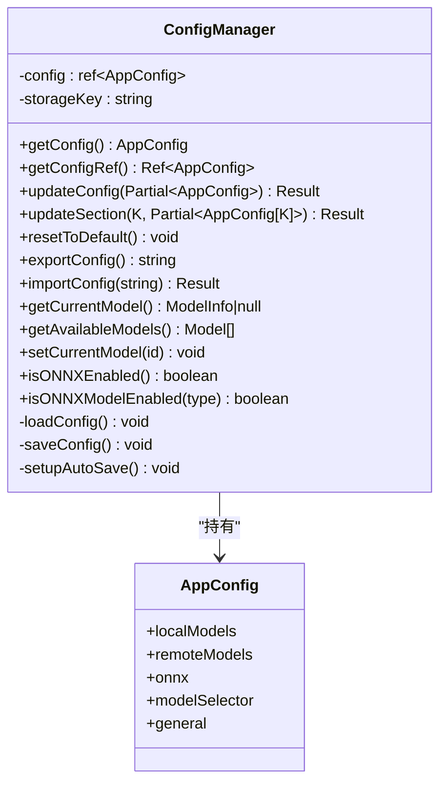
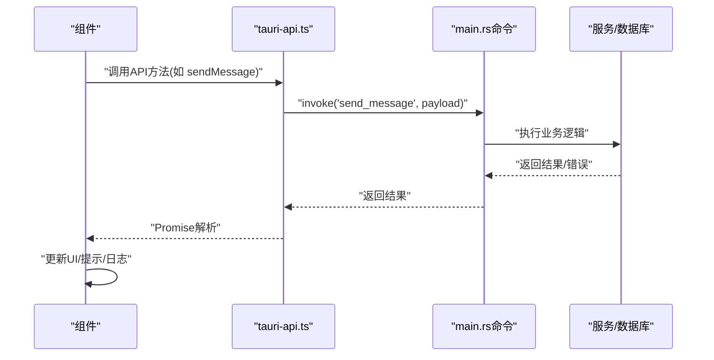
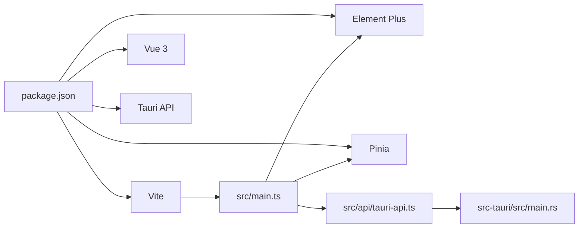

# 前端开发

<cite>
**本文引用的文件**
- [README.md](file://README.md)
- [package.json](file://package.json)
- [vite.config.ts](file://vite.config.ts)
- [src/main.ts](file://src/main.ts)
- [src/App.vue](file://src/App.vue)
- [src/api/tauri-api.ts](file://src/api/tauri-api.ts)
- [src/components/business/ChatView.vue](file://src/components/business/ChatView.vue)
- [src/components/business/ConversationList.vue](file://src/components/business/ConversationList.vue)
- [src/components/settings/ModelSettings.vue](file://src/components/settings/ModelSettings.vue)
- [src/config/app-settings.ts](file://src/config/app-settings.ts)
- [src/config/model-config.ts](file://src/config/model-config.ts)
- [src/utils/logger.ts](file://src/utils/logger.ts)
- [src-tauri/src/main.rs](file://src-tauri/src/main.rs)
</cite>

## 目录
1. [简介](#简介)
2. [项目结构](#项目结构)
3. [核心组件](#核心组件)
4. [架构总览](#架构总览)
5. [组件详解](#组件详解)
6. [依赖关系分析](#依赖关系分析)
7. [性能考量](#性能考量)
8. [故障排查指南](#故障排查指南)
9. [结论](#结论)
10. [附录](#附录)

## 简介
本文件面向Malou Agent前端开发者，系统性梳理Vue 3 Composition API在项目中的使用模式、组件层次结构与生命周期管理；解释Element Plus组件库的集成与自定义样式方案；阐述Pinia状态管理的实现与响应式数据绑定、状态持久化策略；详解Tauri API的集成方式、错误处理机制与请求响应模式；并总结组件通信、事件处理与用户交互设计的最佳实践。

## 项目结构
前端采用Vite + Vue 3 + TypeScript + Element Plus + Pinia的现代前端技术栈，结合Tauri v2实现桌面应用。核心目录组织如下：
- src/components：按业务域划分的组件集合，如 ChatView、ConversationList、ModelSettings 等
- src/api：封装Tauri命令调用，统一对外暴露类型安全的API
- src/config：应用配置模型与本地持久化管理
- src/utils：通用工具，如日志服务
- src-tauri：Rust后端，通过Tauri命令桥接前后端

图表来源
- [src/main.ts](file://src/main.ts#L1-L13)
- [src/App.vue](file://src/App.vue#L1-L121)
- [src/api/tauri-api.ts](file://src/api/tauri-api.ts#L1-L242)
- [src-tauri/src/main.rs](file://src-tauri/src/main.rs#L249-L323)

章节来源
- [README.md](file://README.md#L1-L76)
- [package.json](file://package.json#L1-L31)
- [vite.config.ts](file://vite.config.ts#L1-L17)

## 核心组件
- 根组件与路由容器：App.vue负责主布局、标签页切换与子组件编排
- 业务组件：
  - ChatView：聊天视图，负责消息渲染、输入、发送、模型切换、数据库测试与清空记录
  - ConversationList：会话列表，负责加载、创建、编辑标题、删除会话与刷新
- 设置组件：ModelSettings，负责模型配置、ONNX功能开关、远程模型管理与配置导入导出
- API封装：tauri-api.ts统一暴露Tauri命令，提供类型安全的接口
- 配置管理：app-settings.ts + model-config.ts 提供响应式配置、校验、合并与localStorage持久化
- 日志服务：logger.ts 提供内存日志与Vue组合式函数

章节来源
- [src/App.vue](file://src/App.vue#L1-L121)
- [src/components/business/ChatView.vue](file://src/components/business/ChatView.vue#L1-L569)
- [src/components/business/ConversationList.vue](file://src/components/business/ConversationList.vue#L1-L367)
- [src/components/settings/ModelSettings.vue](file://src/components/settings/ModelSettings.vue#L1-L580)
- [src/api/tauri-api.ts](file://src/api/tauri-api.ts#L1-L242)
- [src/config/app-settings.ts](file://src/config/app-settings.ts#L1-L195)
- [src/config/model-config.ts](file://src/config/model-config.ts#L1-L163)
- [src/utils/logger.ts](file://src/utils/logger.ts#L1-L95)

## 架构总览
前端通过Composition API进行状态与逻辑抽象，Element Plus提供UI能力，Pinia负责应用级状态管理，Tauri作为跨平台运行时承载Rust后端能力。数据流从组件发起API调用，经由tauri-api封装，最终由Tauri命令在Rust侧执行业务逻辑，并返回结果驱动UI更新。

图表来源
- [src/components/business/ChatView.vue](file://src/components/business/ChatView.vue#L163-L222)
- [src/api/tauri-api.ts](file://src/api/tauri-api.ts#L108-L110)
- [src-tauri/src/main.rs](file://src-tauri/src/main.rs#L140-L161)

## 组件详解

### 组件层次与生命周期
- App.vue
  - 负责顶层布局与标签页切换
  - 通过ref与事件向上抛出选择/创建/更新回调，协调子组件
  - 生命周期：挂载时无需额外初始化
- ConversationList.vue
  - 使用onMounted加载会话列表
  - 提供refresh方法供父组件触发刷新
  - 生命周期：挂载时加载，支持显式刷新
- ChatView.vue
  - 使用watch监听props.conversation变化，自动加载消息
  - 使用onMounted加载应用配置
  - 生命周期：挂载加载配置，监听会话变化加载消息
- ModelSettings.vue
  - 使用onMounted加载应用配置
  - 提供表单校验、保存与导入导出流程

图表来源
- [src/components/business/ChatView.vue](file://src/components/business/ChatView.vue#L117-L149)
- [src/components/business/ChatView.vue](file://src/components/business/ChatView.vue#L151-L153)
- [src/api/tauri-api.ts](file://src/api/tauri-api.ts#L115-L125)

章节来源
- [src/App.vue](file://src/App.vue#L1-L121)
- [src/components/business/ConversationList.vue](file://src/components/business/ConversationList.vue#L1-L367)
- [src/components/business/ChatView.vue](file://src/components/business/ChatView.vue#L1-L569)
- [src/components/settings/ModelSettings.vue](file://src/components/settings/ModelSettings.vue#L1-L580)

### Element Plus集成与自定义样式
- 全局引入：在应用入口安装Element Plus与全局CSS
- 组件使用：广泛使用ElTabs、ElTabPane、ElButton、ElInput、ElDropdown、ElMessageBox、ElMessage等
- 自定义样式：各组件通过scoped样式覆盖Element Plus默认样式，如消息气泡、输入区、侧边栏等
- 图标：通过@element-plus/icons-vue引入图标组件

章节来源
- [src/main.ts](file://src/main.ts#L1-L13)
- [src/App.vue](file://src/App.vue#L34-L76)
- [src/components/business/ChatView.vue](file://src/components/business/ChatView.vue#L285-L400)
- [src/components/business/ConversationList.vue](file://src/components/business/ConversationList.vue#L165-L238)
- [src/components/settings/ModelSettings.vue](file://src/components/settings/ModelSettings.vue#L222-L511)

### Pinia状态管理与响应式数据绑定
- 项目中未直接使用Pinia Store，而是通过自研配置管理器实现响应式配置与持久化
- 配置管理器提供：
  - 响应式配置引用（ref）
  - 配置更新与校验（validateConfig）
  - 合并与默认值（mergeConfig）
  - localStorage持久化与自动保存（watch）
  - 当前模型查询与可用模型列表
- 在组件中通过useConfig组合式函数获取配置引用与更新方法，实现双向绑定与实时生效

图表来源
- [src/config/app-settings.ts](file://src/config/app-settings.ts#L6-L180)
- [src/config/model-config.ts](file://src/config/model-config.ts#L43-L163)

章节来源
- [src/config/app-settings.ts](file://src/config/app-settings.ts#L1-L195)
- [src/config/model-config.ts](file://src/config/model-config.ts#L1-L163)

### Tauri API集成与错误处理
- API封装：tauri-api.ts对invoke进行统一封装，导出类型安全的方法，如createConversation、sendMessage、getAppConfig等
- 错误处理：组件内普遍使用try/catch捕获异常，结合ElMessage提示用户；同时记录到logger
- 请求响应模式：组件发起调用 → API封装 → Tauri命令 → Rust实现 → 返回Promise解析结果 → UI更新
- 兼容性：保留旧版API占位，便于后续替换

图表来源
- [src/api/tauri-api.ts](file://src/api/tauri-api.ts#L108-L110)
- [src-tauri/src/main.rs](file://src-tauri/src/main.rs#L140-L161)

章节来源
- [src/api/tauri-api.ts](file://src/api/tauri-api.ts#L1-L242)
- [src-tauri/src/main.rs](file://src-tauri/src/main.rs#L249-L323)

### 组件通信机制与事件处理
- App.vue作为容器，通过props向下传递当前会话，通过事件向上接收选择/创建/更新
- ConversationList通过事件向外抛出select/create，ChatView通过事件通知父组件更新
- ModelSettings通过API与配置管理器同步，实现配置变更的即时生效
- 事件与回调贯穿整个交互链路，保证组件间解耦与职责清晰

章节来源
- [src/App.vue](file://src/App.vue#L13-L31)
- [src/components/business/ConversationList.vue](file://src/components/business/ConversationList.vue#L17-L20)
- [src/components/business/ChatView.vue](file://src/components/business/ChatView.vue#L29-L32)
- [src/components/settings/ModelSettings.vue](file://src/components/settings/ModelSettings.vue#L102-L117)

### 用户交互设计
- 聊天界面：消息气泡区分用户与AI，支持滚动到底部、加载指示器、时间与token展示
- 会话列表：支持新建、编辑标题、删除、高亮当前选中项、时间格式化
- 设置界面：分页签管理模型选择、本地模型、远程模型、ONNX功能与资源限制
- 反馈与提示：统一使用ElMessage与ElMessageBox，配合logger记录

章节来源
- [src/components/business/ChatView.vue](file://src/components/business/ChatView.vue#L285-L400)
- [src/components/business/ConversationList.vue](file://src/components/business/ConversationList.vue#L165-L238)
- [src/components/settings/ModelSettings.vue](file://src/components/settings/ModelSettings.vue#L222-L511)
- [src/utils/logger.ts](file://src/utils/logger.ts#L1-L95)

## 依赖关系分析
- 构建与运行：Vite提供开发服务器与打包；别名@指向src；端口3002
- 依赖管理：Vue 3、Element Plus、Pinia、Vue Router、@tauri-apps/api等
- 前后端桥接：通过@tauri-apps/api的invoke调用Rust命令，main.rs中集中注册命令

图表来源
- [package.json](file://package.json#L1-L31)
- [vite.config.ts](file://vite.config.ts#L1-L17)
- [src/main.ts](file://src/main.ts#L1-L13)
- [src/api/tauri-api.ts](file://src/api/tauri-api.ts#L1-L3)
- [src-tauri/src/main.rs](file://src-tauri/src/main.rs#L249-L323)

章节来源
- [package.json](file://package.json#L1-L31)
- [vite.config.ts](file://vite.config.ts#L1-L17)

## 性能考量
- 组件渲染优化：合理使用computed与watch，避免不必要的重渲染；消息列表使用虚拟滚动可进一步优化（当前按需加载最近N条）
- 异步处理：统一使用async/await，避免阻塞UI；在发送消息时设置isLoading，减少重复提交
- 样式与资源：Element Plus按需引入可降低体积（当前全量引入），建议结合构建工具做裁剪
- 本地存储：配置持久化使用localStorage，注意序列化/反序列化开销与异常处理

## 故障排查指南
- 发送消息失败：检查网络与后端命令是否正确注册；查看ElMessage错误提示与logger日志
- 会话列表为空：确认listConversations调用与权限；检查loading状态与空态提示
- 配置无法保存：检查validateConfig返回的错误信息；确认localStorage写入权限
- 数据库测试异常：查看Rust侧test_database命令返回信息，确认数据库初始化与清理流程

章节来源
- [src/components/business/ChatView.vue](file://src/components/business/ChatView.vue#L140-L143)
- [src/components/business/ConversationList.vue](file://src/components/business/ConversationList.vue#L54-L64)
- [src/config/app-settings.ts](file://src/config/app-settings.ts#L152-L171)
- [src-tauri/src/main.rs](file://src-tauri/src/main.rs#L226-L245)

## 结论
Malou Agent前端以Vue 3 Composition API为核心，结合Element Plus与自研配置管理器，实现了清晰的组件层次与良好的用户体验。通过Tauri命令桥接Rust后端，形成稳定的前后端协作模式。建议后续在消息列表引入虚拟滚动、优化Element Plus按需引入，并完善Pinia Store以承载更复杂的状态场景。

## 附录
- 开发与构建脚本：参考package.json中的dev/build/tauri系列脚本
- 项目结构概览：参考README中的目录说明
- Tauri命令清单：参考src-tauri/src/main.rs中的命令注册

章节来源
- [README.md](file://README.md#L45-L61)
- [package.json](file://package.json#L6-L12)
- [src-tauri/src/main.rs](file://src-tauri/src/main.rs#L292-L319)