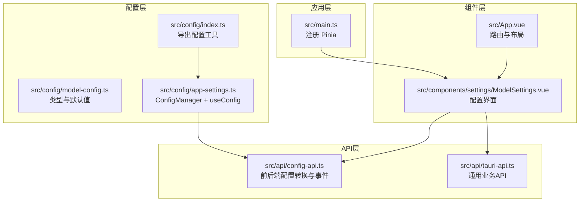
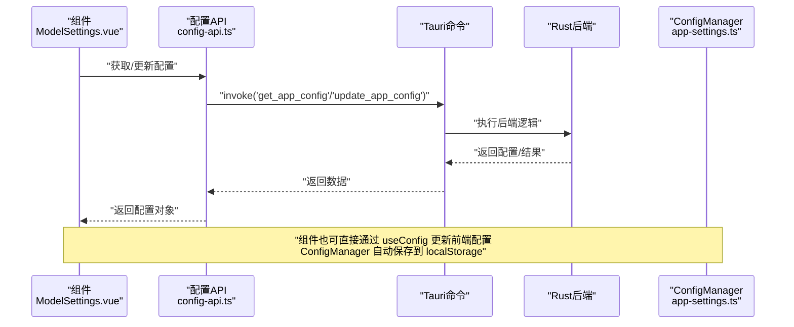
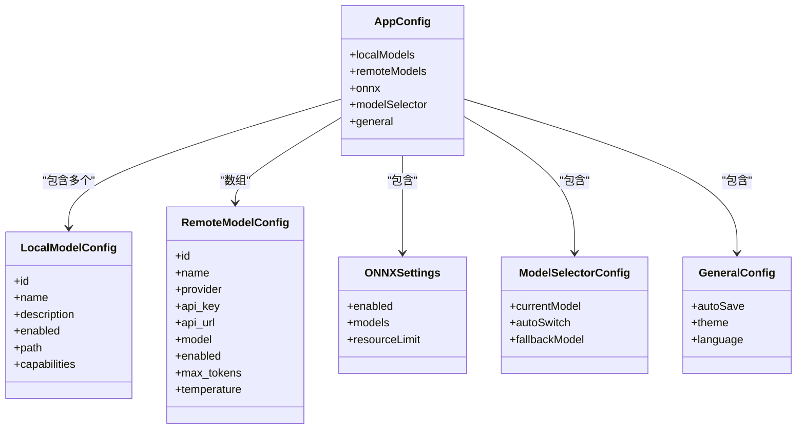
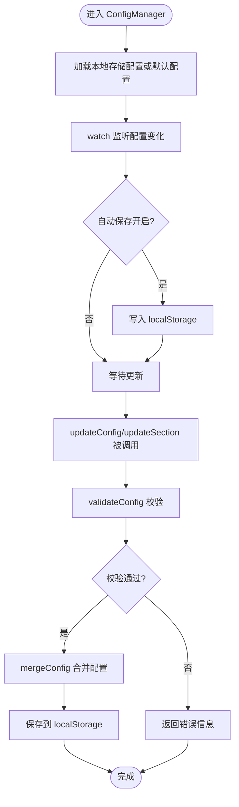
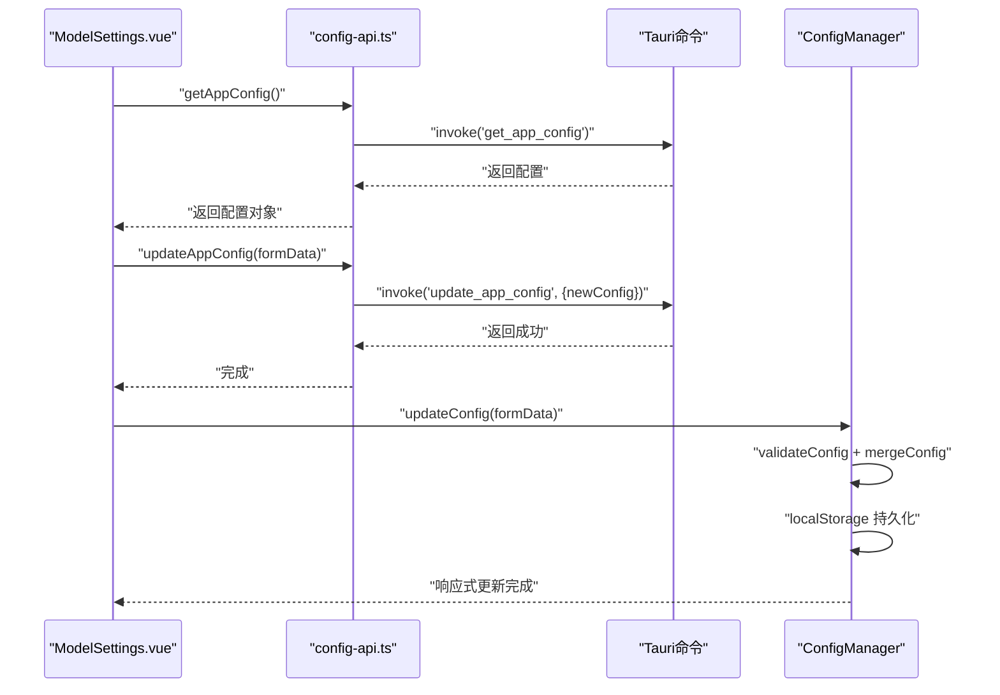
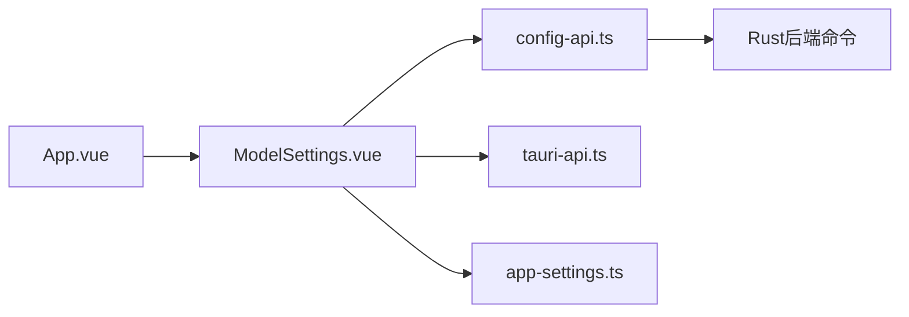

# 状态管理

<cite>
**本文引用的文件**
- [src/main.ts](file://src/main.ts)
- [src/config/model-config.ts](file://src/config/model-config.ts)
- [src/config/app-settings.ts](file://src/config/app-settings.ts)
- [src/config/index.ts](file://src/config/index.ts)
- [src/api/config-api.ts](file://src/api/config-api.ts)
- [src/api/tauri-api.ts](file://src/api/tauri-api.ts)
- [src/components/settings/ModelSettings.vue](file://src/components/settings/ModelSettings.vue)
- [src/App.vue](file://src/App.vue)
- [src/utils/config-test.ts](file://src/utils/config-test.ts)
- [docs/configuration-management.md](file://docs/configuration-management.md)
- [docs/testing-and-optimization.md](file://docs/testing-and-optimization.md)
- [TAURI_VUE_INTEGRATION_BEST_PRACTICES.md](file://TAURI_VUE_INTEGRATION_BEST_PRACTICES.md)
</cite>

## 目录
1. [简介](#简介)
2. [项目结构](#项目结构)
3. [核心组件](#核心组件)
4. [架构总览](#架构总览)
5. [详细组件分析](#详细组件分析)
6. [依赖关系分析](#依赖关系分析)
7. [性能考量](#性能考量)
8. [故障排查指南](#故障排查指南)
9. [结论](#结论)
10. [附录](#附录)

## 简介
本文件系统性梳理 Malou Agent 中的状态管理方案，重点围绕 Pinia 的使用与自定义配置管理器协同工作的方式，解释状态定义、计算属性与 Action 的设计模式；阐述应用配置（AppSettings）与模型配置（ModelConfig）的状态管理模式，包括响应式绑定与持久化策略；说明组件间共享机制（全局状态与局部状态）的使用场景；并给出最佳实践、性能优化与调试技巧，辅以具体代码示例路径帮助快速上手。

## 项目结构
Malou Agent 的状态管理由三层组成：
- 应用层初始化：在入口处注册 Pinia，使应用具备全局状态能力。
- 配置层：通过自定义 ConfigManager 提供响应式配置、校验、合并与持久化，并暴露组合式 API 供组件使用。
- API 层：封装 Tauri 命令，负责与后端交互，完成配置读写与模型切换等动作。

图表来源
- [src/main.ts](file://src/main.ts#L1-L13)
- [src/config/index.ts](file://src/config/index.ts#L1-L3)
- [src/config/model-config.ts](file://src/config/model-config.ts#L1-L163)
- [src/config/app-settings.ts](file://src/config/app-settings.ts#L1-L195)
- [src/api/config-api.ts](file://src/api/config-api.ts#L1-L201)
- [src/api/tauri-api.ts](file://src/api/tauri-api.ts#L1-L242)
- [src/components/settings/ModelSettings.vue](file://src/components/settings/ModelSettings.vue#L1-L580)
- [src/App.vue](file://src/App.vue#L1-L121)

章节来源
- [src/main.ts](file://src/main.ts#L1-L13)
- [src/config/index.ts](file://src/config/index.ts#L1-L3)

## 核心组件
- 全局状态初始化：在应用入口注册 Pinia，确保后续组件可使用组合式 Store 或自定义配置管理器。
- 配置管理器（ConfigManager）：提供响应式配置对象、配置校验与合并、自动保存到本地存储、模型选择与可用模型查询等能力。
- 配置 API：封装 Tauri 命令，负责前后端配置格式转换、事件分发与同步。
- 组件使用：在设置页等组件中通过组合式 API 获取配置、执行更新与模型切换等操作。

章节来源
- [src/main.ts](file://src/main.ts#L1-L13)
- [src/config/app-settings.ts](file://src/config/app-settings.ts#L1-L195)
- [src/api/config-api.ts](file://src/api/config-api.ts#L1-L201)
- [src/components/settings/ModelSettings.vue](file://src/components/settings/ModelSettings.vue#L1-L580)

## 架构总览
下图展示了从组件到配置管理器再到后端命令的调用链路，体现单向数据流与响应式更新：

图表来源
- [src/components/settings/ModelSettings.vue](file://src/components/settings/ModelSettings.vue#L1-L580)
- [src/api/config-api.ts](file://src/api/config-api.ts#L1-L201)
- [src/config/app-settings.ts](file://src/config/app-settings.ts#L1-L195)

## 详细组件分析

### 配置类型与默认值（ModelConfig）
- 定义了完整的配置结构，包括本地模型、远程模型、ONNX 设置、模型选择器与通用设置等字段。
- 提供默认配置常量与校验函数，保证配置合法性与一致性。
- 提供配置合并函数，支持按需覆盖部分字段。

图表来源
- [src/config/model-config.ts](file://src/config/model-config.ts#L1-L163)

章节来源
- [src/config/model-config.ts](file://src/config/model-config.ts#L1-L163)

### 配置管理器与持久化（AppSettings）
- 使用 Vue 响应式 ref 持有 AppConfig，提供 getConfig/getConfigRef/updateConfig 等方法。
- 支持按字段段更新（updateSection），并进行配置校验与合并。
- 自动保存：通过 watch 监听配置变化并在开启自动保存时写入 localStorage。
- 模型选择：提供当前模型查询、可用模型列表与切换能力。
- 导入/导出：支持 JSON 格式的配置导入与导出。

图表来源
- [src/config/app-settings.ts](file://src/config/app-settings.ts#L1-L195)
- [src/config/model-config.ts](file://src/config/model-config.ts#L1-L163)

章节来源
- [src/config/app-settings.ts](file://src/config/app-settings.ts#L1-L195)
- [src/config/model-config.ts](file://src/config/model-config.ts#L1-L163)

### 组件中的使用（ModelSettings.vue）
- 通过 useConfig 获取响应式配置与更新函数，实现双向绑定与实时更新。
- 通过 API 将配置同步到后端，同时在前端同步更新，保证一致性。
- 提供模型切换、ONNX 功能开关、远程模型增删等交互。

图表来源
- [src/components/settings/ModelSettings.vue](file://src/components/settings/ModelSettings.vue#L1-L580)
- [src/api/config-api.ts](file://src/api/config-api.ts#L1-L201)
- [src/config/app-settings.ts](file://src/config/app-settings.ts#L1-L195)

章节来源
- [src/components/settings/ModelSettings.vue](file://src/components/settings/ModelSettings.vue#L1-L580)
- [src/api/config-api.ts](file://src/api/config-api.ts#L1-L201)
- [src/config/app-settings.ts](file://src/config/app-settings.ts#L1-L195)

### 与 Pinia 的关系与扩展
- 应用已注册 Pinia，但当前仓库未提供基于 defineStore 的独立 Store 文件。
- 文档中提供了基于 Pinia 的典型实现思路（如 chatStore、configStore），可用于未来扩展或补充现有配置管理器。

章节来源
- [src/main.ts](file://src/main.ts#L1-L13)
- [TAURI_VUE_INTEGRATION_BEST_PRACTICES.md](file://TAURI_VUE_INTEGRATION_BEST_PRACTICES.md#L199-L315)

## 依赖关系分析
- 组件依赖配置 API 与 ConfigManager，形成“组件 → API → 后端”的单向数据流。
- 配置 API 负责前后端格式转换与事件分发，ConfigManager 负责前端响应式状态与持久化。
- App.vue 作为根组件协调页面布局与导航，间接影响状态在不同视图间的共享。

图表来源
- [src/components/settings/ModelSettings.vue](file://src/components/settings/ModelSettings.vue#L1-L580)
- [src/api/config-api.ts](file://src/api/config-api.ts#L1-L201)
- [src/api/tauri-api.ts](file://src/api/tauri-api.ts#L1-L242)
- [src/config/app-settings.ts](file://src/config/app-settings.ts#L1-L195)
- [src/App.vue](file://src/App.vue#L1-L121)

章节来源
- [src/components/settings/ModelSettings.vue](file://src/components/settings/ModelSettings.vue#L1-L580)
- [src/api/config-api.ts](file://src/api/config-api.ts#L1-L201)
- [src/api/tauri-api.ts](file://src/api/tauri-api.ts#L1-L242)
- [src/App.vue](file://src/App.vue#L1-L121)

## 性能考量
- 响应式更新粒度：通过 updateSection 精准更新配置片段，避免不必要的深度更新。
- 自动保存策略：仅在开启自动保存时触发持久化，减少频繁 IO。
- 虚拟滚动与懒加载：文档中提供了虚拟滚动与图片懒加载的实现思路，有助于提升长列表渲染性能。

章节来源
- [docs/testing-and-optimization.md](file://docs/testing-and-optimization.md#L129-L157)

## 故障排查指南
- 配置导入失败：检查 JSON 格式与必填字段，关注返回的错误信息。
- 配置校验失败：根据 validateConfig 的规则修正字段（如远程模型的 API 密钥与地址）。
- 自动保存异常：检查 localStorage 权限与容量限制。
- 配置同步问题：使用配置同步管理器定期拉取最新配置，监听配置变更事件。

章节来源
- [src/config/app-settings.ts](file://src/config/app-settings.ts#L1-L195)
- [src/api/config-api.ts](file://src/api/config-api.ts#L1-L201)

## 结论
Malou Agent 的状态管理采用“自定义配置管理器 + Tauri API”的组合方式，既满足了复杂配置的响应式与持久化需求，又保持了与后端的一致性。组件通过 useConfig 与 API 无缝协作，实现了良好的可维护性与扩展性。未来可结合 Pinia 的 Store 模式进一步抽象通用状态，或引入事件总线增强跨组件通信。

## 附录

### 最佳实践清单
- 状态结构设计
  - 使用明确的接口定义配置结构，分离“类型”与“默认值”，便于校验与扩展。
  - 将可选字段与必填字段清晰区分，提供合理的默认值。
- 响应式与持久化
  - 对于需要持久化的配置，优先使用 ConfigManager 的自动保存机制。
  - 对大对象更新使用 updateSection 精准更新，降低 watch 的深度比较成本。
- 异步状态更新
  - 在组件中先更新前端配置，再异步提交到后端；若后端失败则回滚前端状态。
  - 对批量更新场景，先在本地合并后再一次性提交，减少后端往返次数。
- 调试技巧
  - 使用浏览器开发者工具观察响应式对象的变化轨迹。
  - 在 ConfigManager 中增加日志输出，定位保存与加载阶段的问题。
  - 使用配置同步管理器定时拉取最新配置，验证多端一致性。

### 示例路径参考
- 在组件中使用配置管理器
  - 获取配置与更新：[src/components/settings/ModelSettings.vue](file://src/components/settings/ModelSettings.vue#L14-L117)
  - 模型切换与 ONNX 功能切换：[src/components/settings/ModelSettings.vue](file://src/components/settings/ModelSettings.vue#L131-L153)
- 配置 API 与后端交互
  - 获取/更新配置：[src/api/config-api.ts](file://src/api/config-api.ts#L5-L64)
  - 前后端格式转换：[src/api/config-api.ts](file://src/api/config-api.ts#L11-L114)
- 配置管理器核心逻辑
  - 响应式配置与自动保存：[src/config/app-settings.ts](file://src/config/app-settings.ts#L10-L179)
  - 配置校验与合并：[src/config/app-settings.ts](file://src/config/app-settings.ts#L26-L51), [src/config/model-config.ts](file://src/config/model-config.ts#L118-L163)
- 应用入口与 Pinia 注册
  - 注册 Pinia：[src/main.ts](file://src/main.ts#L1-L13)