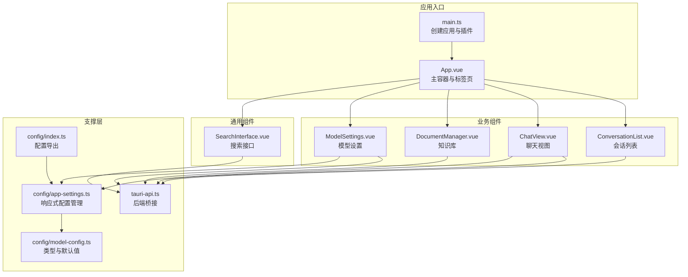
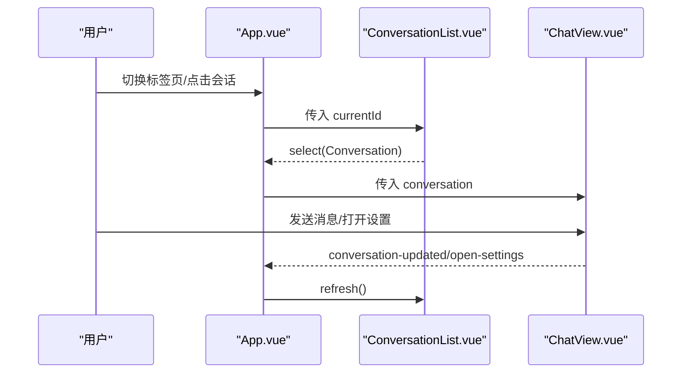
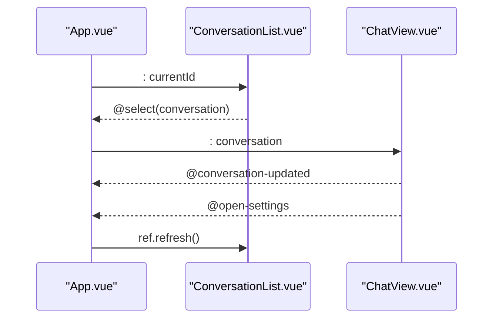
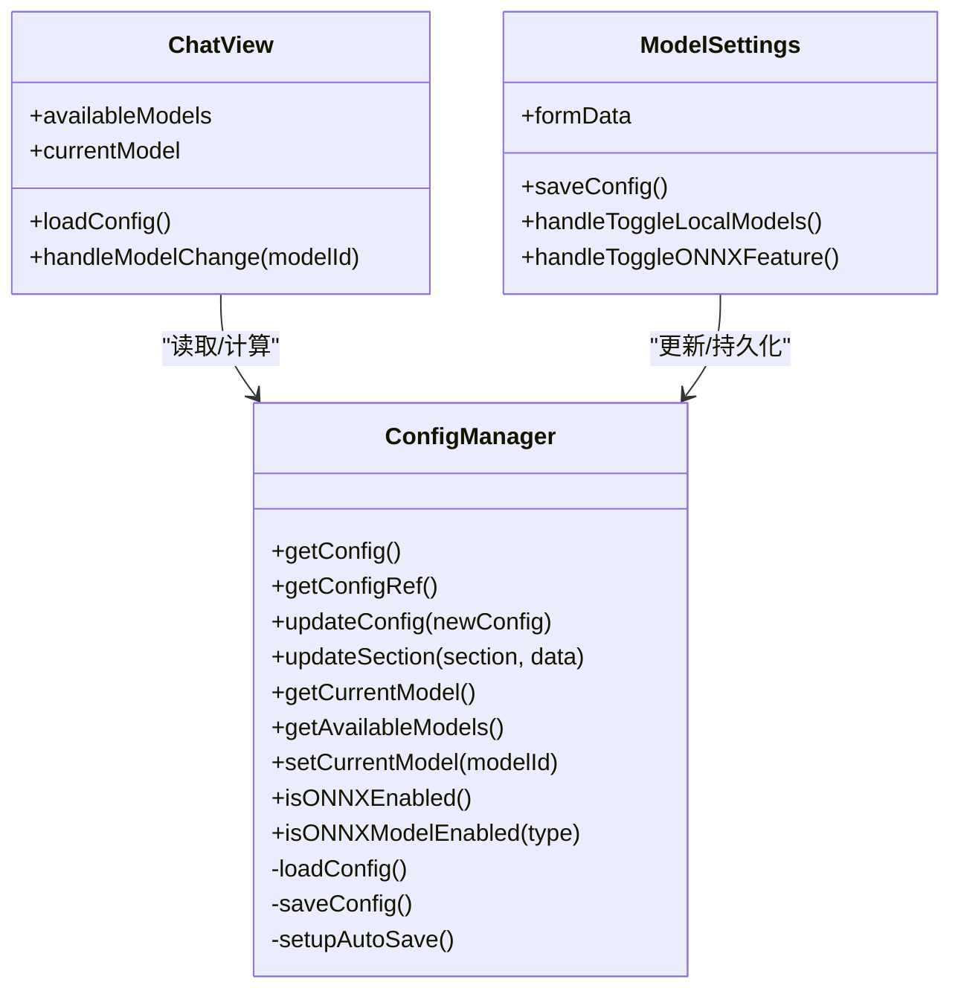
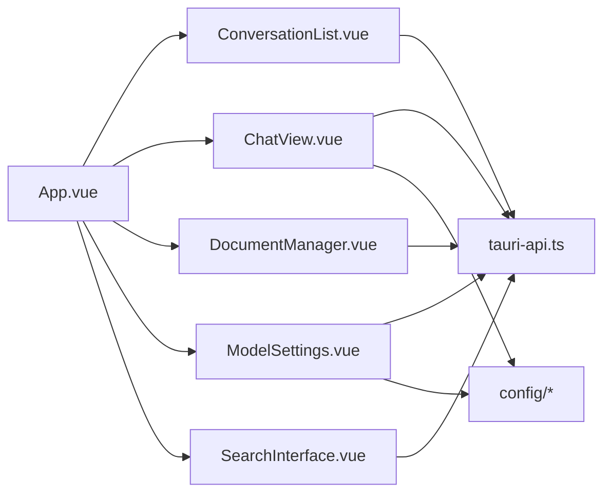

# 组件通信

<cite>
**本文引用的文件**
- [src\App.vue](file://src\App.vue)
- [src\components\business\ChatView.vue](file://src\components\business\ChatView.vue)
- [src\components\business\ConversationList.vue](file://src\components\business\ConversationList.vue)
- [src\components\business\DocumentManager.vue](file://src\components\business\DocumentManager.vue)
- [src\components\settings\ModelSettings.vue](file://src\components\settings\ModelSettings.vue)
- [src\components\SearchInterface.vue](file://src\components\SearchInterface.vue)
- [src\api\tauri-api.ts](file://src\api\tauri-api.ts)
- [src\config\index.ts](file://src\config\index.ts)
- [src\config\model-config.ts](file://src\config\model-config.ts)
- [src\config\app-settings.ts](file://src\config\app-settings.ts)
- [src\main.ts](file://src\main.ts)
</cite>

## 目录
1. [简介](#简介)
2. [项目结构](#项目结构)
3. [核心组件](#核心组件)
4. [架构总览](#架构总览)
5. [详细组件分析](#详细组件分析)
6. [依赖分析](#依赖分析)
7. [性能考量](#性能考量)
8. [故障排查指南](#故障排查指南)
9. [结论](#结论)
10. [附录](#附录)

## 简介
本文件系统性梳理 Malou Agent 中 Vue 组件间的通信机制，覆盖父子、兄弟与跨层级通信的典型模式；详解 props 类型定义、默认值与校验策略；阐述 emits 事件系统（事件定义、参数传递与监听）；说明 provide/inject 的使用场景与实现方式；讨论事件总线与全局事件的使用模式；并给出最佳实践与常见复杂交互场景的处理建议。

## 项目结构
Malou Agent 采用基于功能域的组件组织方式，主应用通过路由式标签页承载多个业务视图，核心业务组件围绕“会话”“聊天”“知识库”“设置”展开，API 层与配置层分别负责后端桥接与全局配置管理。

图表来源
- [src\main.ts](file://src\main.ts#L1-L13)
- [src\App.vue](file://src\App.vue#L1-L121)
- [src\components\business\ChatView.vue](file://src\components\business\ChatView.vue#L1-L569)
- [src\components\business\ConversationList.vue](file://src\components\business\ConversationList.vue#L1-L367)
- [src\components\business\DocumentManager.vue](file://src\components\business\DocumentManager.vue#L1-L256)
- [src\components\settings\ModelSettings.vue](file://src\components\settings\ModelSettings.vue#L1-L580)
- [src\components\SearchInterface.vue](file://src\components\SearchInterface.vue#L1-L611)
- [src\api\tauri-api.ts](file://src\api\tauri-api.ts#L1-L242)
- [src\config\index.ts](file://src\config\index.ts#L1-L3)
- [src\config\model-config.ts](file://src\config\model-config.ts#L1-L163)
- [src\config\app-settings.ts](file://src\config\app-settings.ts#L1-L195)

章节来源
- [src\App.vue](file://src\App.vue#L1-L121)
- [src\main.ts](file://src\main.ts#L1-L13)

## 核心组件
- App.vue：主容器，维护当前活动标签页与当前会话，作为父子通信的根节点。
- ConversationList.vue：子组件，负责会话列表的加载、选择、创建、删除与刷新；通过事件向上通知父组件。
- ChatView.vue：子组件，负责聊天消息的加载、发送、滚动与模型选择；通过事件向上通知父组件进行刷新与跳转。
- DocumentManager.vue：独立业务组件，负责文档的增删改查与表格展示。
- ModelSettings.vue：设置页组件，负责模型配置的读取、修改与保存，依赖配置管理器。
- SearchInterface.vue：通用搜索组件，内部封装向量搜索与文本搜索组合式逻辑，向外发出搜索与结果事件。
- tauri-api.ts：统一的后端桥接层，提供会话、消息、文档、配置等 API。
- config/*：配置类型定义、默认值与响应式配置管理。

章节来源
- [src\App.vue](file://src\App.vue#L1-L121)
- [src\components\business\ChatView.vue](file://src\components\business\ChatView.vue#L1-L569)
- [src\components\business\ConversationList.vue](file://src\components\business\ConversationList.vue#L1-L367)
- [src\components\business\DocumentManager.vue](file://src\components\business\DocumentManager.vue#L1-L256)
- [src\components\settings\ModelSettings.vue](file://src\components\settings\ModelSettings.vue#L1-L580)
- [src\components\SearchInterface.vue](file://src\components\SearchInterface.vue#L1-L611)
- [src\api\tauri-api.ts](file://src\api\tauri-api.ts#L1-L242)
- [src\config\index.ts](file://src\config\index.ts#L1-L3)
- [src\config\model-config.ts](file://src\config\model-config.ts#L1-L163)
- [src\config\app-settings.ts](file://src\config\app-settings.ts#L1-L195)

## 架构总览
Malou Agent 的组件通信以“自上而下”的 props 与“自下而上”的 emits 为主，配合响应式配置管理与后端桥接 API，形成清晰的单向数据流与事件驱动交互。

图表来源
- [src\App.vue](file://src\App.vue#L1-L121)
- [src\components\business\ConversationList.vue](file://src\components\business\ConversationList.vue#L1-L367)
- [src\components\business\ChatView.vue](file://src\components\business\ChatView.vue#L1-L569)

## 详细组件分析

### 父子组件通信：App.vue 与 ConversationList.vue、ChatView.vue
- 父传子（props）
  - App.vue 向 ConversationList 传递 currentId，用于高亮当前会话。
  - App.vue 向 ChatView 传递 conversation，用于渲染对应会话的消息。
- 子传父（emits）
  - ConversationList 在用户选择/创建会话时，向上抛出 select/create 事件，父组件据此更新当前会话。
  - ChatView 在会话更新/打开设置时，向上抛出 conversation-updated/open-settings 事件，父组件负责刷新列表与切换标签页。
- 引用暴露（defineExpose）
  - ConversationList 暴露 refresh/load 方法，父组件通过 ref 调用以刷新列表，避免重复加载或状态不一致。

图表来源
- [src\App.vue](file://src\App.vue#L1-L121)
- [src\components\business\ConversationList.vue](file://src\components\business\ConversationList.vue#L1-L367)
- [src\components\business\ChatView.vue](file://src\components\business\ChatView.vue#L1-L569)

章节来源
- [src\App.vue](file://src\App.vue#L1-L121)
- [src\components\business\ConversationList.vue](file://src\components\business\ConversationList.vue#L1-L367)
- [src\components\business\ChatView.vue](file://src\components\business\ChatView.vue#L1-L569)

### 兄弟组件通信：通过父组件中转
- 场景：会话列表变更后，需要同步更新聊天视图的会话信息。
- 实现：由 ConversationList 抛出 select 事件，App.vue 接收后将新的 conversation 传给 ChatView；同时在 ChatView 完成消息发送或清空后，通过 emits 通知 App.vue 调用 ConversationList.refresh() 刷新列表。
- 优点：集中控制，避免兄弟间直接耦合；缺点：父组件承担协调职责，需注意事件命名与参数一致性。

章节来源
- [src\App.vue](file://src\App.vue#L1-L121)
- [src\components\business\ConversationList.vue](file://src\components\business\ConversationList.vue#L1-L367)
- [src\components\business\ChatView.vue](file://src\components\business\ChatView.vue#L1-L569)

### 跨层级组件通信：配置管理与模型选择
- 场景：ChatView 需要根据全局配置动态展示可用模型并支持切换；ModelSettings 修改配置后需同步到前端。
- 实现：
  - ChatView 通过配置管理器读取当前模型与可用模型列表。
  - ModelSettings 通过配置管理器更新配置，内部自动持久化与响应式传播。
  - 两者均不直接依赖彼此，而是共享同一配置源，实现跨层级解耦。
- 优势：降低耦合度，便于扩展与测试；劣势：需要统一的配置接口与严格的类型约束。

图表来源
- [src\config\app-settings.ts](file://src\config\app-settings.ts#L1-L195)
- [src\config\model-config.ts](file://src\config\model-config.ts#L1-L163)
- [src\components\business\ChatView.vue](file://src\components\business\ChatView.vue#L1-L569)
- [src\components\settings\ModelSettings.vue](file://src\components\settings\ModelSettings.vue#L1-L580)

章节来源
- [src\config\app-settings.ts](file://src\config\app-settings.ts#L1-L195)
- [src\config\model-config.ts](file://src\config\model-config.ts#L1-L163)
- [src\components\business\ChatView.vue](file://src\components\business\ChatView.vue#L1-L569)
- [src\components\settings\ModelSettings.vue](file://src\components\settings\ModelSettings.vue#L1-L580)

### props 传递机制：类型、默认值与校验
- 类型定义
  - ConversationList 接收 currentId（字符串或 null），用于高亮当前项。
  - ChatView 接收 conversation（会话对象或 null），用于渲染消息与标题。
  - SearchInterface 接收 autoSearch、debounceMs 等可选配置。
- 默认值与校验
  - 通过 TypeScript 接口约束 props 类型，确保调用方传参正确。
  - 对于可选参数（如 SearchInterface 的 autoSearch/debounceMs），在组件内部提供合理默认值与防抖逻辑。
  - 配置层提供 validateConfig 与 mergeConfig，保证配置写入前的合法性与合并策略的一致性。

章节来源
- [src\components\business\ConversationList.vue](file://src\components\business\ConversationList.vue#L13-L20)
- [src\components\business\ChatView.vue](file://src\components\business\ChatView.vue#L25-L32)
- [src\components\SearchInterface.vue](file://src\components\SearchInterface.vue#L447-L455)
- [src\config\model-config.ts](file://src\config\model-config.ts#L119-L138)
- [src\config\model-config.ts](file://src\config\model-config.ts#L141-L163)

### emits 事件系统：定义、参数与监听
- 事件定义
  - ConversationList：select(conversation)、create(conversation)
  - ChatView：conversation-updated、open-settings
  - SearchInterface：search(query)、results(results[])
- 参数传递
  - 事件参数严格遵循接口定义，确保父组件接收时无需额外解析。
- 监听机制
  - App.vue 在模板中通过 @select/@create/@conversation-updated/@open-settings 监听事件，实现状态更新与 UI 切换。

章节来源
- [src\components\business\ConversationList.vue](file://src\components\business\ConversationList.vue#L17-L20)
- [src\components\business\ChatView.vue](file://src\components\business\ChatView.vue#L29-L32)
- [src\components\SearchInterface.vue](file://src\components\SearchInterface.vue#L452-L455)
- [src\App.vue](file://src\App.vue#L14-L31)

### provide/inject 模式：使用场景与实现
- 使用场景
  - 当需要在多层嵌套组件中共享配置、服务或工具函数，且不希望逐层透传 props 时，可采用 provide/inject。
  - 在 Malou Agent 中，配置管理器已通过全局实例与组合式函数提供能力，通常不需要额外的 provide/inject；但在更复杂的场景下，可将 ConfigManager 或 OnnxService 注入到深层组件，减少 props 穿透。
- 实现要点
  - 提供方：在根组件或高层组件中 provide 响应式引用或工厂函数。
  - 注入方：在子组件中 inject 获取，保持响应式联动。
  - 注意：注入值应具备稳定的类型与生命周期管理，避免循环依赖。

[本节为概念性说明，不直接分析具体文件，故无章节来源]

### 事件总线与全局事件：使用模式
- 使用模式
  - 对于非父子关系的远端组件通信，可引入轻量事件总线（如 mitt）实现全局广播/订阅。
  - 在 Malou Agent 中，当前主要通过 emits 与父组件协调，未见显式的全局事件总线实现。
- 最佳实践
  - 明确事件命名空间与参数契约；
  - 在组件卸载时注销监听，防止内存泄漏；
  - 仅在必要时使用全局事件，优先采用 props/emits。

[本节为概念性说明，不直接分析具体文件，故无章节来源]

### 复杂交互场景示例
- 会话创建与自动选择
  - ConversationList 创建会话后，同时触发 create/select 两个事件，App.vue 收到后立即设置当前会话并通知 ChatView 加载消息。
- 模型切换与回退
  - ChatView 切换模型时，通过 API 更新后端配置，并更新本地配置管理器；若首选模型不可用，配置管理器返回备用模型，确保 UI 与行为一致。
- 搜索与结果分发
  - SearchInterface 内部并行执行向量搜索与文本搜索，合并结果后通过 emits 将 query 与 results 上抛，父组件可据此更新面包屑或侧边栏。

章节来源
- [src\components\business\ConversationList.vue](file://src\components\business\ConversationList.vue#L66-L84)
- [src\components\business\ChatView.vue](file://src\components\business\ChatView.vue#L92-L105)
- [src\components\SearchInterface.vue](file://src\components\SearchInterface.vue#L286-L310)

## 依赖分析
- 组件依赖
  - App.vue 依赖 ConversationList、ChatView、DocumentManager、ModelSettings、SearchInterface。
  - ChatView 与 ConversationList 依赖 tauri-api.ts 提供的后端能力。
  - ModelSettings 与 ChatView 依赖 config/* 提供的类型与配置管理。
- 外部依赖
  - Element Plus 用于 UI 组件与样式。
  - @tauri-apps/api.core 用于与 Rust 后端通信。

图表来源
- [src\App.vue](file://src\App.vue#L1-L121)
- [src\components\business\ChatView.vue](file://src\components\business\ChatView.vue#L1-L569)
- [src\components\business\ConversationList.vue](file://src\components\business\ConversationList.vue#L1-L367)
- [src\components\business\DocumentManager.vue](file://src\components\business\DocumentManager.vue#L1-L256)
- [src\components\settings\ModelSettings.vue](file://src\components\settings\ModelSettings.vue#L1-L580)
- [src\components\SearchInterface.vue](file://src\components\SearchInterface.vue#L1-L611)
- [src\api\tauri-api.ts](file://src\api\tauri-api.ts#L1-L242)
- [src\config\index.ts](file://src\config\index.ts#L1-L3)

章节来源
- [src\api\tauri-api.ts](file://src\api\tauri-api.ts#L1-L242)
- [src\config\app-settings.ts](file://src\config\app-settings.ts#L1-L195)

## 性能考量
- 渲染优化
  - ChatView 在消息列表较长时，通过虚拟滚动或分页加载可进一步优化（当前按最近若干条加载）。
- 事件风暴防护
  - SearchInterface 使用防抖与并行搜索，减少频繁请求；兄弟组件通信时避免在高频事件中做重型计算。
- 状态同步
  - 通过 defineExpose 暴露的 refresh 方法，避免重复请求与重复渲染。
- 配置持久化
  - 配置管理器在深监听下自动保存，建议在批量更新时合并后再写入，减少存储压力。

[本节提供一般性指导，不直接分析具体文件，故无章节来源]

## 故障排查指南
- 事件未触发
  - 检查子组件 emits 定义与父组件监听绑定是否一致（事件名、参数类型）。
  - 章节来源
    - [src\components\business\ConversationList.vue](file://src\components\business\ConversationList.vue#L17-L20)
    - [src\components\business\ChatView.vue](file://src\components\business\ChatView.vue#L29-L32)
    - [src\App.vue](file://src\App.vue#L14-L31)
- 会话不刷新
  - 确认父组件是否调用 ConversationList.ref.refresh()；检查 defineExpose 是否正确暴露方法。
  - 章节来源
    - [src\components\business\ConversationList.vue](file://src\components\business\ConversationList.vue#L154-L158)
    - [src\App.vue](file://src\App.vue#L24-L26)
- 模型切换无效
  - 检查配置更新流程与 API 调用链；确认配置管理器的 getCurrentModel 与 getAvailableModels 返回预期值。
  - 章节来源
    - [src\components\business\ChatView.vue](file://src\components\business\ChatView.vue#L92-L105)
    - [src\config\app-settings.ts](file://src\config\app-settings.ts#L77-L103)
- 搜索结果异常
  - 检查防抖与并行请求的时序；确认合并策略与去重逻辑。
  - 章节来源
    - [src\components\SearchInterface.vue](file://src\components\SearchInterface.vue#L286-L310)
    - [src\components\SearchInterface.vue](file://src\components\SearchInterface.vue#L346-L383)

## 结论
Malou Agent 的组件通信以 props/emits 为核心，辅以响应式配置管理与后端桥接 API，实现了清晰、可维护的父子与跨层级通信。通过合理的事件命名、类型约束与状态同步机制，能够在复杂交互场景中保持良好的可扩展性与可测试性。建议在后续迭代中：
- 对高频事件增加节流/防抖；
- 对深层组件引入 provide/inject 以减少 props 穿透；
- 对全局事件采用命名空间与契约约束，避免滥用。

[本节为总结性内容，不直接分析具体文件，故无章节来源]

## 附录
- 代码片段路径参考
  - 父传子 props 示例：[src\App.vue](file://src\App.vue#L51-L63)
  - 子传父 emits 示例：[src\components\business\ConversationList.vue](file://src\components\business\ConversationList.vue#L72-L84)，[src\components\business\ChatView.vue](file://src\components\business\ChatView.vue#L207-L217)
  - defineExpose 暴露方法：[src\components\business\ConversationList.vue](file://src\components\business\ConversationList.vue#L154-L158)
  - 配置管理器使用：[src\components\settings\ModelSettings.vue](file://src\components\settings\ModelSettings.vue#L14-L14)
  - 搜索组合式逻辑：[src\components\SearchInterface.vue](file://src\components\SearchInterface.vue#L269-L341)

[本节为补充说明，不直接分析具体文件，故无章节来源]