# Rust后端设计

<cite>
**本文档引用的文件**
- [Cargo.toml](file://src-tauri/Cargo.toml)
- [main.rs](file://src-tauri/src/main.rs)
- [tauri.conf.json](file://src-tauri/tauri.conf.json)
- [chat/mod.rs](file://src-tauri/src/chat/mod.rs)
- [chat/service.rs](file://src-tauri/src/chat/service.rs)
- [chat/openai_client.rs](file://src-tauri/src/chat/openai_client.rs)
- [database/mod.rs](file://src-tauri/src/database/mod.rs)
- [database/connection.rs](file://src-tauri/src/database/connection.rs)
- [database/models.rs](file://src-tauri/src/database/models.rs)
- [token_tracker/tracker.rs](file://src-tauri/src/token_tracker/tracker.rs)
- [config/mod.rs](file://src-tauri/src/config/mod.rs)
- [vector_search.rs](file://src-tauri/src/vector_search.rs)
- [db_test.rs](file://src-tauri/src/db_test.rs)
- [README.md](file://README.md)
</cite>

## 目录
1. [引言](#引言)
2. [项目结构](#项目结构)
3. [核心组件](#核心组件)
4. [架构总览](#架构总览)
5. [详细组件分析](#详细组件分析)
6. [依赖关系分析](#依赖关系分析)
7. [性能考虑](#性能考虑)
8. [故障排除指南](#故障排除指南)
9. [结论](#结论)

## 引言
本文件面向Malou Agent的Rust后端，围绕Tauri v2桌面框架在桌面应用中的作用与优势展开，重点阐释IPC通信机制、安全沙箱与跨平台兼容性；同时深入讲解Rust所有权系统在后端开发中的应用、借用检查器如何保证内存安全；异步编程模式方面，涵盖Tokio运行时与Future/Stream的使用；最后给出Tauri命令系统的架构设计、内存管理最佳实践与性能优化建议。文档旨在帮助开发者全面理解Malou Agent后端的设计思路与实现细节。

## 项目结构
Malou Agent采用前后端分离的桌面应用架构：
- 前端：Vue 3 + TypeScript，通过Vite构建，Element Plus组件库，Pinia状态管理
- 后端：Tauri v2 + Rust，负责业务逻辑、数据库访问、外部API调用、配置管理与向量搜索

后端代码位于src-tauri目录，主要模块包括：
- 应用入口与命令系统：main.rs
- 聊天服务：chat子模块（会话/消息仓库、OpenAI客户端、服务层）
- 数据库：database子模块（连接、模型、Schema）
- Token追踪：token_tracker子模块
- 配置管理：config子模块
- 向量搜索：vector_search模块
- 其他：db_test测试模块

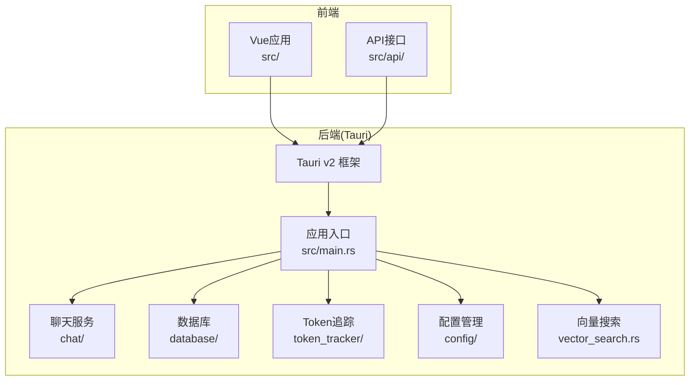

图表来源
- [main.rs](file://src-tauri/src/main.rs#L242-L315)
- [chat/mod.rs](file://src-tauri/src/chat/mod.rs#L1-L10)
- [database/mod.rs](file://src-tauri/src/database/mod.rs#L1-L7)
- [config/mod.rs](file://src-tauri/src/config/mod.rs#L1-L334)

章节来源
- [README.md](file://README.md#L1-L76)
- [tauri.conf.json](file://src-tauri/tauri.conf.json#L1-L32)

## 核心组件
- 应用状态与命令系统：通过AppState封装ChatService与OpenAI配置，并在main.rs中注册大量Tauri命令，实现前后端交互
- 聊天服务：封装会话与消息的增删改查、与OpenAI API交互、Token统计记录
- 数据库层：基于rusqlite的线程安全连接包装，支持WAL模式与外键约束
- 配置管理：AppConfig结构体定义多模型配置、ONNX设置、主题与语言等，持久化存储于应用配置目录
- Token追踪：按模型与日期维度统计Prompt/Completion/Total Token用量
- 向量搜索：提供余弦相似度与欧氏距离两种相似度度量，支持Top-K检索

章节来源
- [main.rs](file://src-tauri/src/main.rs#L53-L315)
- [chat/service.rs](file://src-tauri/src/chat/service.rs#L11-L224)
- [database/connection.rs](file://src-tauri/src/database/connection.rs#L7-L58)
- [config/mod.rs](file://src-tauri/src/config/mod.rs#L8-L334)
- [token_tracker/tracker.rs](file://src-tauri/src/token_tracker/tracker.rs#L4-L195)
- [vector_search.rs](file://src-tauri/src/vector_search.rs#L42-L84)

## 架构总览
Tauri v2作为桌面框架，提供安全沙箱与跨平台能力。Rust后端通过命令系统暴露API给前端，前端通过IPC调用后端命令，后端执行业务逻辑并返回结果。Tokio运行时支持异步I/O与并发，Rust所有权系统确保内存安全。

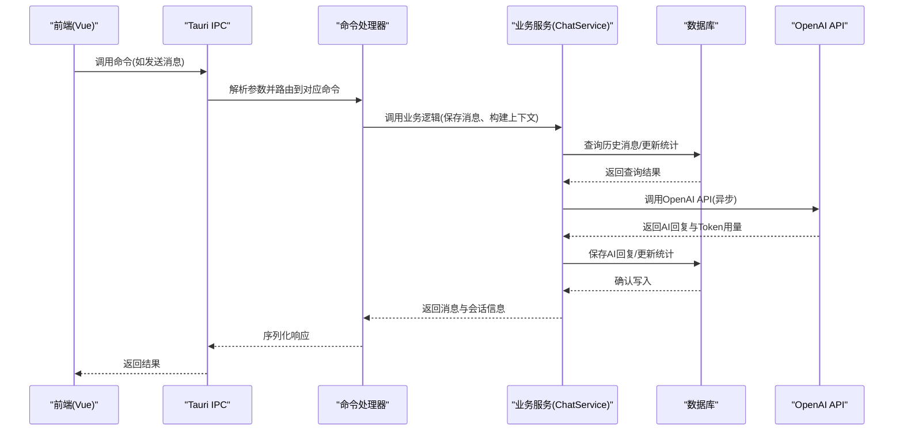

图表来源
- [main.rs](file://src-tauri/src/main.rs#L140-L161)
- [chat/service.rs](file://src-tauri/src/chat/service.rs#L94-L177)
- [chat/openai_client.rs](file://src-tauri/src/chat/openai_client.rs#L74-L116)
- [database/connection.rs](file://src-tauri/src/database/connection.rs#L50-L57)

## 详细组件分析

### Tauri命令系统与IPC通信
- 命令注册：在main.rs中通过generate_handler!集中注册所有命令，包括会话管理、消息管理、Token统计、OpenAI配置、配置管理等
- 参数序列化：命令参数与返回值均使用Serde进行序列化/反序列化，确保跨语言传输的类型安全
- 状态访问：命令通过tauri::State访问AppState，内部使用Mutex保护共享状态
- 异步命令：部分命令标记为async，如get_app_info、send_message等，利用Tokio运行时处理异步任务

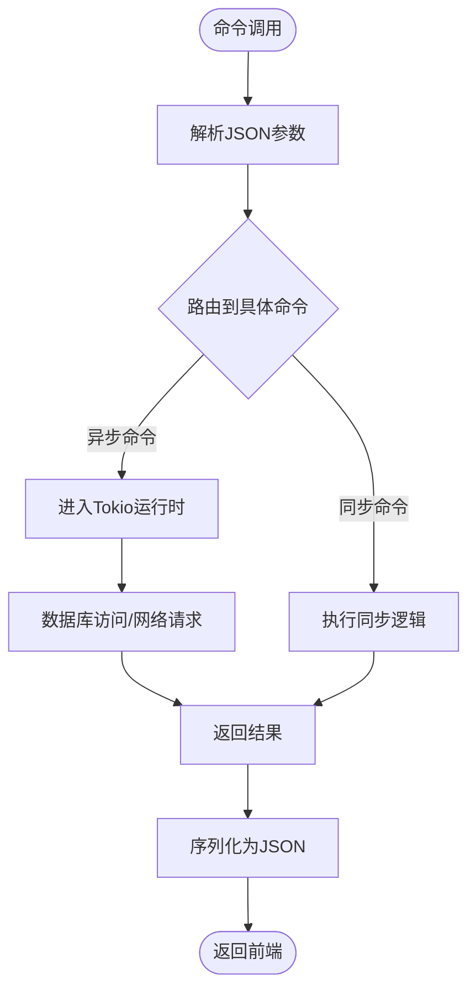

图表来源
- [main.rs](file://src-tauri/src/main.rs#L285-L312)
- [main.rs](file://src-tauri/src/main.rs#L60-L161)

章节来源
- [main.rs](file://src-tauri/src/main.rs#L60-L315)

### Rust所有权系统与内存安全
- 共享状态：AppState使用Mutex包装ChatService与OpenAI配置，确保多线程安全访问
- 数据库连接：Database内部持有Arc<Mutex<Connection>>，通过Arc克隆实现共享，Mutex保护SQLite连接
- 异步共享：ChatService使用Arc<RwLock<OpenAIClient>>，使OpenAI客户端支持Send + Sync，可在异步上下文中安全传递
- 类型安全：Serde derive自动生成序列化/反序列化实现，避免手动实现带来的内存安全风险

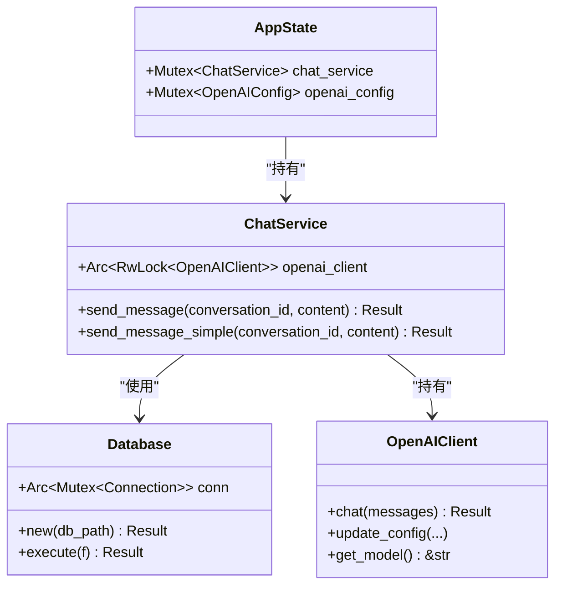

图表来源
- [main.rs](file://src-tauri/src/main.rs#L53-L56)
- [database/connection.rs](file://src-tauri/src/database/connection.rs#L8-L10)
- [chat/service.rs](file://src-tauri/src/chat/service.rs#L12-L18)
- [chat/openai_client.rs](file://src-tauri/src/chat/openai_client.rs#L5-L11)

章节来源
- [main.rs](file://src-tauri/src/main.rs#L53-L56)
- [database/connection.rs](file://src-tauri/src/database/connection.rs#L8-L10)
- [chat/service.rs](file://src-tauri/src/chat/service.rs#L12-L18)
- [chat/openai_client.rs](file://src-tauri/src/chat/openai_client.rs#L5-L11)

### 异步编程模式与Tokio运行时
- Tokio配置：Cargo.toml启用tokio full特性，提供完整的异步运行时
- 异步命令：send_message、get_token_usage_summary、get_token_usage_trend等命令为async
- 读写锁：ChatService使用Arc<RwLock<OpenAIClient>>，在需要调用异步API时先释放读锁再调用
- 数据库访问：Database::execute通过闭包封装数据库操作，配合Arc<Mutex<Connection>>实现线程安全

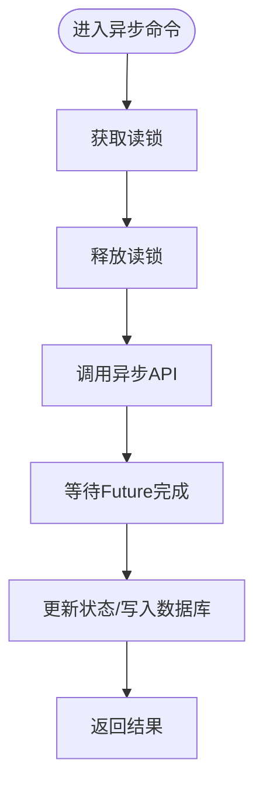

图表来源
- [chat/service.rs](file://src-tauri/src/chat/service.rs#L128-L135)
- [chat/service.rs](file://src-tauri/src/chat/service.rs#L94-L177)
- [database/connection.rs](file://src-tauri/src/database/connection.rs#L50-L57)

章节来源
- [Cargo.toml](file://src-tauri/Cargo.toml#L16-L16)
- [chat/service.rs](file://src-tauri/src/chat/service.rs#L128-L135)
- [database/connection.rs](file://src-tauri/src/database/connection.rs#L50-L57)

### 聊天服务与OpenAI集成
- 会话管理：创建、列出、获取、更新标题、删除会话
- 消息管理：获取消息列表、清空会话、发送消息（含简单回显与真实OpenAI调用）
- 上下文构建：从历史消息构建聊天上下文，限制最近N条消息
- Token统计：记录Prompt/Completion/Total Token用量，并更新会话统计
- OpenAI客户端：支持配置更新、异步聊天请求、错误处理

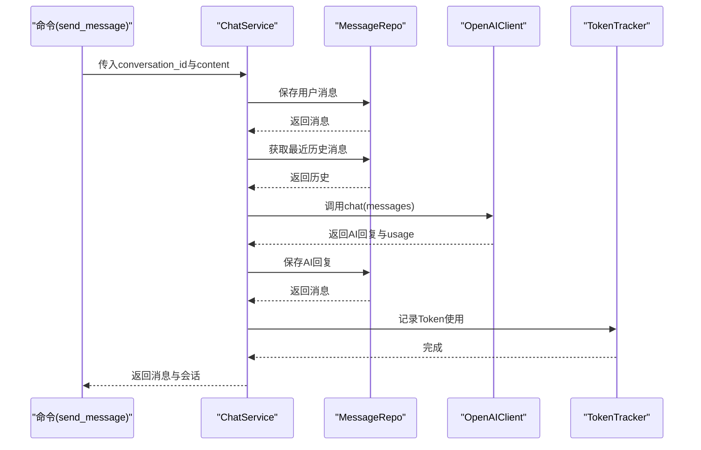

图表来源
- [main.rs](file://src-tauri/src/main.rs#L140-L161)
- [chat/service.rs](file://src-tauri/src/chat/service.rs#L94-L177)
- [chat/openai_client.rs](file://src-tauri/src/chat/openai_client.rs#L74-L116)
- [token_tracker/tracker.rs](file://src-tauri/src/token_tracker/tracker.rs#L14-L48)

章节来源
- [chat/service.rs](file://src-tauri/src/chat/service.rs#L37-L224)
- [chat/openai_client.rs](file://src-tauri/src/chat/openai_client.rs#L62-L141)

### 数据库层设计
- 连接管理：Database封装Arc<Mutex<Connection>>，提供execute闭包接口，确保线程安全
- Schema初始化：启动时执行Schema SQL，创建必要表结构
- 并发优化：启用WAL模式提升并发读写性能，开启外键约束保证数据一致性
- 默认路径：通过dirs库获取应用数据目录，生成默认数据库路径

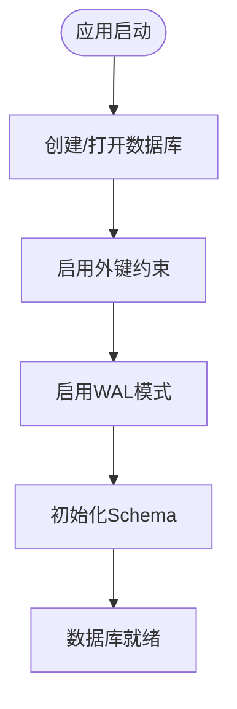

图表来源
- [database/connection.rs](file://src-tauri/src/database/connection.rs#L13-L43)
- [database/connection.rs](file://src-tauri/src/database/connection.rs#L68-L73)

章节来源
- [database/connection.rs](file://src-tauri/src/database/connection.rs#L7-L58)
- [database/models.rs](file://src-tauri/src/database/models.rs#L3-L110)

### 配置管理系统
- 配置结构：AppConfig包含本地模型、远程模型、ONNX设置、模型选择器、通用设置等
- 持久化：配置文件存储在应用配置目录，首次运行自动生成默认配置
- 动态更新：提供多种命令用于获取/更新配置、切换当前模型、启用/禁用本地模型、控制ONNX特性
- 模型选择：根据当前模型ID查找远程或本地模型，支持回退模型

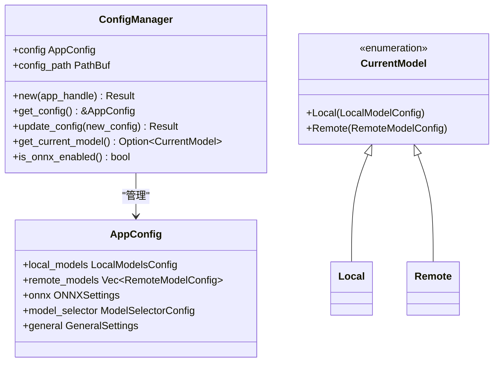

图表来源
- [config/mod.rs](file://src-tauri/src/config/mod.rs#L144-L248)
- [config/mod.rs](file://src-tauri/src/config/mod.rs#L58-L142)
- [config/mod.rs](file://src-tauri/src/config/mod.rs#L250-L255)

章节来源
- [config/mod.rs](file://src-tauri/src/config/mod.rs#L1-L334)

### Token追踪与统计
- 记录策略：按模型与日期聚合，若当日已有记录则累加，否则插入新记录
- 汇总查询：支持按起止日期范围统计总用量与请求数
- 趋势分析：按日期分组统计每日Token使用趋势
- 模型维度：支持按模型维度查询Token使用情况

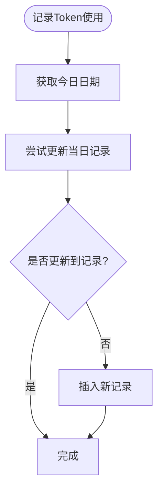

图表来源
- [token_tracker/tracker.rs](file://src-tauri/src/token_tracker/tracker.rs#L14-L48)

章节来源
- [token_tracker/tracker.rs](file://src-tauri/src/token_tracker/tracker.rs#L1-L195)

### 向量搜索与相似度度量
- 接口抽象：SimilarityMetric trait定义相似度计算接口，支持扩展不同度量方式
- 实现示例：CosineSimilarity与EuclideanDistance分别实现余弦相似度与欧氏距离
- 搜索流程：遍历所有文档向量，计算与查询向量的相似度，排序取Top-K结果
- 线程安全：VectorSearchEngine内部持有Arc<dyn SimilarityMetric>，便于在多线程环境中共享度量器

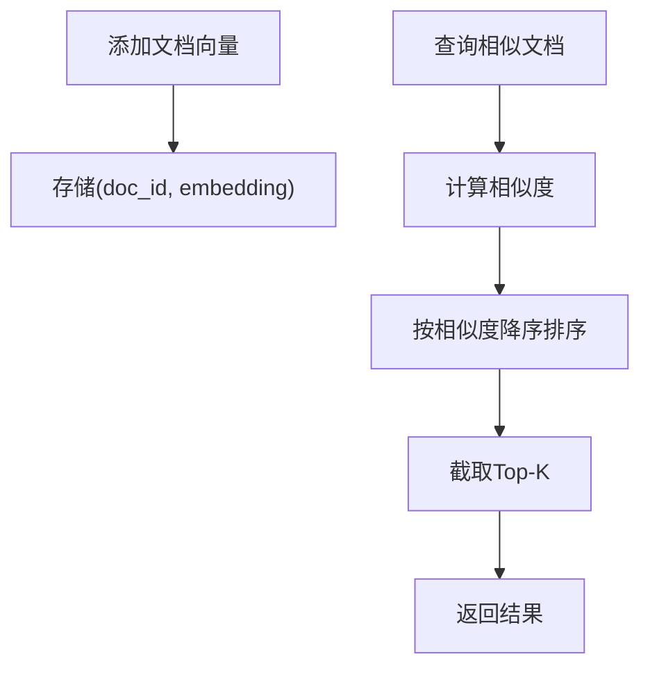

图表来源
- [vector_search.rs](file://src-tauri/src/vector_search.rs#L42-L84)
- [vector_search.rs](file://src-tauri/src/vector_search.rs#L10-L40)

章节来源
- [vector_search.rs](file://src-tauri/src/vector_search.rs#L1-L84)

## 依赖关系分析
后端依赖关系清晰，模块间耦合度低，职责明确：
- main.rs依赖各子模块，负责应用初始化与命令注册
- chat模块依赖database与token_tracker，向上提供聊天服务
- database模块提供连接与模型定义，被多个模块复用
- config模块独立管理配置，通过Tauri状态注入到应用
- vector_search模块提供通用相似度计算能力

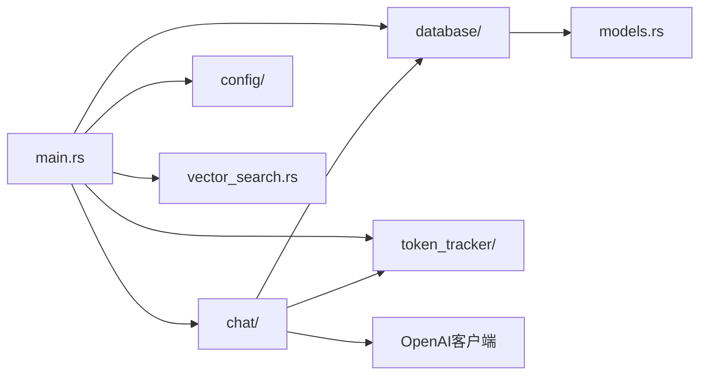

图表来源
- [main.rs](file://src-tauri/src/main.rs#L1-L13)
- [chat/mod.rs](file://src-tauri/src/chat/mod.rs#L1-L10)
- [database/mod.rs](file://src-tauri/src/database/mod.rs#L1-L7)

章节来源
- [Cargo.toml](file://src-tauri/Cargo.toml#L12-L25)
- [main.rs](file://src-tauri/src/main.rs#L1-L13)

## 性能考虑
- 数据库并发：启用WAL模式提升并发读写性能，减少锁竞争
- 线程安全：使用Arc<Mutex<Connection>>与Arc<RwLock<T>>确保共享资源安全访问
- 异步I/O：Tokio运行时处理网络请求与数据库操作，避免阻塞主线程
- 内存管理：优先使用Clone语义与共享引用，减少不必要的数据拷贝
- 锁粒度：在需要调用异步API时及时释放读锁，避免长时间持锁导致的死锁风险
- 序列化开销：合理使用Serde derive，避免深度嵌套结构导致的序列化成本

## 故障排除指南
- 数据库初始化失败：检查应用数据目录权限与路径，确认WAL与外键设置是否生效
- OpenAI API错误：检查API密钥、基础URL与模型配置，查看HTTP状态码与错误文本
- Token统计异常：确认记录逻辑是否正确累加，查询范围参数是否合法
- 配置加载失败：检查配置文件格式与路径，确保默认配置生成逻辑正常
- 命令调用超时：检查Tokio运行时配置与异步任务调度，避免长时间阻塞

章节来源
- [chat/openai_client.rs](file://src-tauri/src/chat/openai_client.rs#L94-L98)
- [config/mod.rs](file://src-tauri/src/config/mod.rs#L167-L178)
- [token_tracker/tracker.rs](file://src-tauri/src/token_tracker/tracker.rs#L50-L113)

## 结论
Malou Agent的Rust后端以Tauri v2为核心，结合Tokio异步运行时与Rust所有权系统，实现了安全、高效且跨平台的桌面应用后端。通过模块化的架构设计与完善的命令系统，前后端协作顺畅；通过数据库并发优化与线程安全封装，确保了高可用性与稳定性。未来可进一步完善OpenAI客户端的Send支持、向量数据库集成与插件化技能系统，持续提升用户体验与功能完整性。