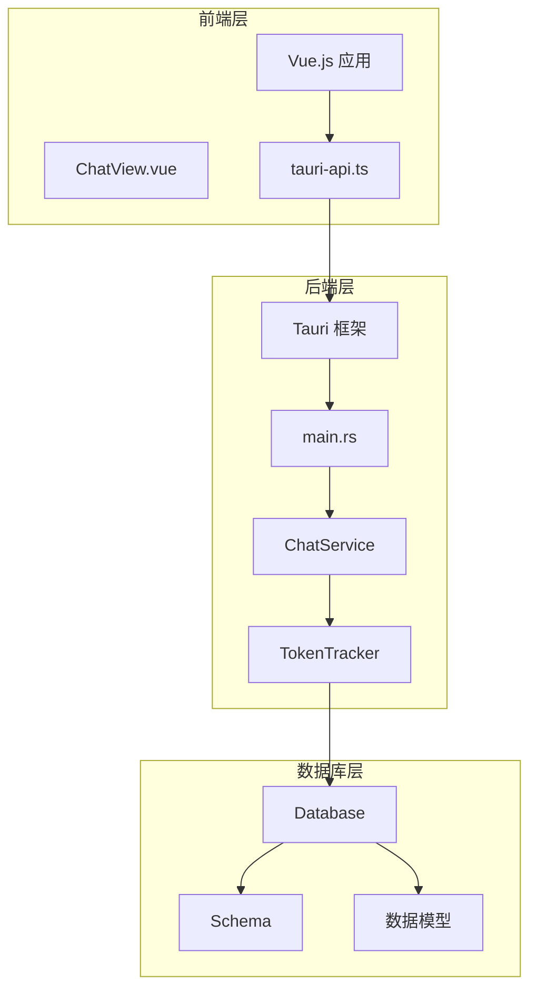
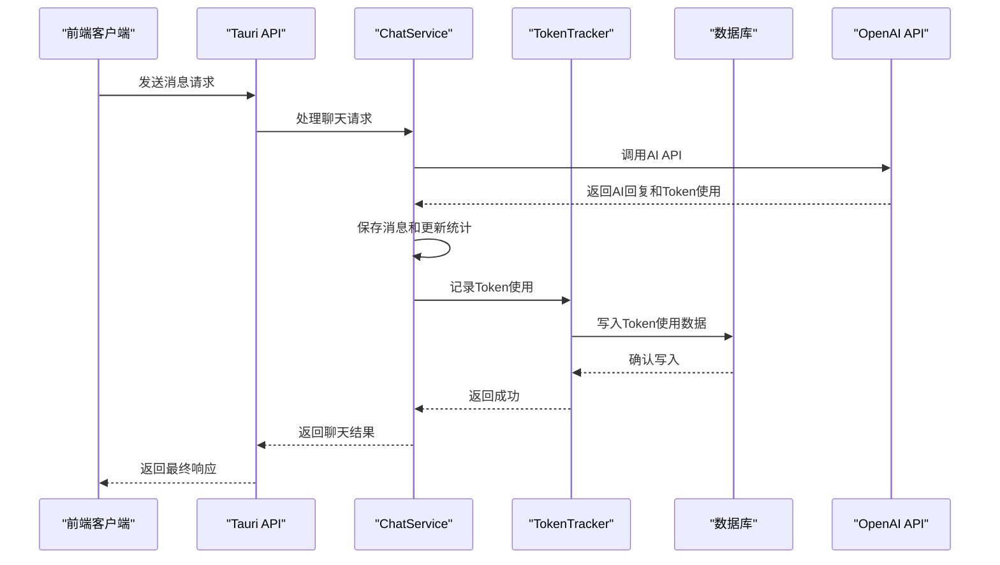
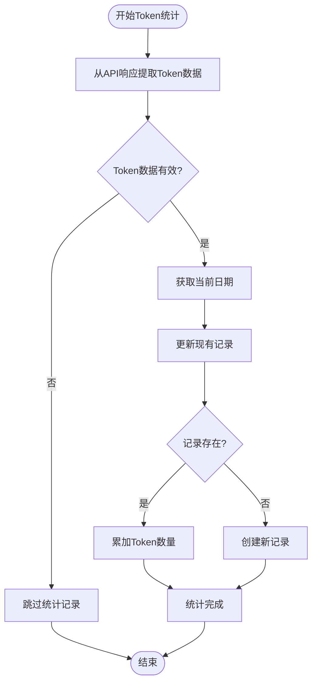
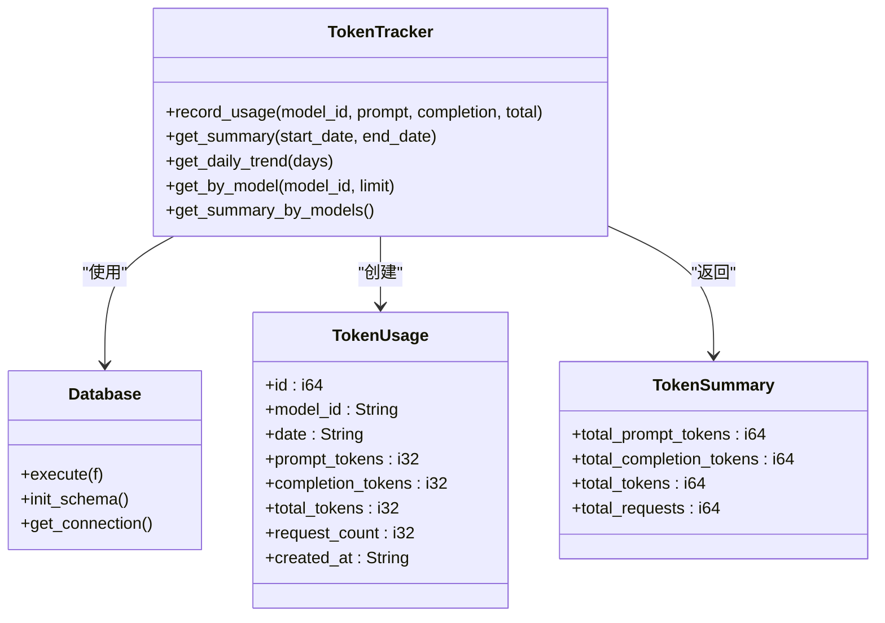
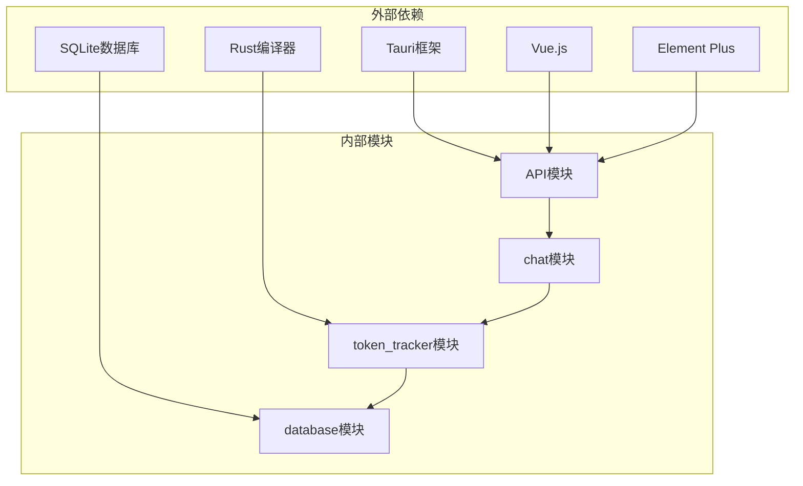

# Token统计追踪系统

<cite>
**本文档引用的文件**
- [tracker.rs](file://src-tauri/src/token_tracker/tracker.rs)
- [mod.rs](file://src-tauri/src/token_tracker/mod.rs)
- [service.rs](file://src-tauri/src/chat/service.rs)
- [openai_client.rs](file://src-tauri/src/chat/openai_client.rs)
- [models.rs](file://src-tauri/src/database/models.rs)
- [schema.rs](file://src-tauri/src/database/schema.rs)
- [connection.rs](file://src-tauri/src/database/connection.rs)
- [main.rs](file://src-tauri/src/main.rs)
- [Cargo.toml](file://src-tauri/Cargo.toml)
- [tauri-api.ts](file://src/api/tauri-api.ts)
- [ChatView.vue](file://src/components/business/ChatView.vue)
</cite>

## 目录
1. [简介](#简介)
2. [项目结构](#项目结构)
3. [核心组件](#核心组件)
4. [架构概览](#架构概览)
5. [详细组件分析](#详细组件分析)
6. [依赖关系分析](#依赖关系分析)
7. [性能考虑](#性能考虑)
8. [故障排除指南](#故障排除指南)
9. [结论](#结论)

## 简介

Malou Agent Token统计追踪系统是一个基于Rust和Vue.js构建的桌面应用程序，专门设计用于跟踪和分析AI对话中的Token使用情况。该系统提供了实时的Token使用统计、趋势分析和数据可视化功能，帮助用户了解和优化AI模型的使用效率。

系统的核心功能包括：
- 实时追踪prompt tokens、completion tokens和total tokens的使用
- 数据聚合和存储策略
- 日统计、周统计和月统计的计算逻辑
- 数据可视化支持和报表导出功能
- 统计精度保证和数据完整性验证机制
- 性能监控和异常处理策略

## 项目结构

Malou Agent采用模块化的项目结构，主要分为前端Vue.js界面层和后端Rust服务层：

**图表来源**
- [main.rs](file://src-tauri/src/main.rs#L1-L316)
- [ChatView.vue](file://src/components/business/ChatView.vue#L1-L569)
- [tauri-api.ts](file://src/api/tauri-api.ts#L1-L242)

**章节来源**
- [main.rs](file://src-tauri/src/main.rs#L1-L316)
- [Cargo.toml](file://src-tauri/Cargo.toml#L1-L25)

## 核心组件

### Token追踪器 (TokenTracker)

TokenTracker是系统的核心组件，负责记录和管理Token使用数据。它实现了以下关键功能：

- **实时记录**: 在每次AI对话完成后，自动记录prompt tokens、completion tokens和total tokens
- **数据聚合**: 提供多种聚合查询功能，包括总体统计、按模型统计和按日期统计
- **数据持久化**: 使用SQLite数据库进行可靠的数据存储

### 聊天服务 (ChatService)

ChatService协调整个聊天流程，集成Token追踪功能：

- **对话管理**: 处理会话的创建、获取和清理
- **AI集成**: 与OpenAI API交互，获取AI回复
- **统计更新**: 自动更新会话统计和Token使用统计
- **错误处理**: 提供完善的错误处理和恢复机制

### 数据模型

系统定义了完整的数据模型来表示Token使用统计：

- **TokenUsage**: 单条Token使用记录
- **TokenSummary**: Token使用汇总信息
- **DailyTokenUsage**: 每日Token使用趋势

**章节来源**
- [tracker.rs](file://src-tauri/src/token_tracker/tracker.rs#L1-L195)
- [service.rs](file://src-tauri/src/chat/service.rs#L1-L224)
- [models.rs](file://src-tauri/src/database/models.rs#L1-L110)

## 架构概览

系统采用分层架构设计，确保各层职责清晰分离：

**图表来源**
- [service.rs](file://src-tauri/src/chat/service.rs#L94-L177)
- [tracker.rs](file://src-tauri/src/token_tracker/tracker.rs#L14-L48)

**章节来源**
- [service.rs](file://src-tauri/src/chat/service.rs#L94-L177)
- [openai_client.rs](file://src-tauri/src/chat/openai_client.rs#L74-L116)

## 详细组件分析

### Token使用统计计算原理

系统实现了精确的Token使用统计机制：

#### Prompt Tokens计算
- **定义**: 用户输入提示词消耗的Token数量
- **来源**: OpenAI API响应中的usage.prompt_tokens字段
- **处理**: 自动提取并累加到当日统计中

#### Completion Tokens计算  
- **定义**: AI模型生成回复消耗的Token数量
- **来源**: OpenAI API响应中的usage.completion_tokens字段
- **处理**: 自动提取并累加到当日统计中

#### Total Tokens计算
- **公式**: total_tokens = prompt_tokens + completion_tokens
- **用途**: 整体Token使用量的统一计量
- **存储**: 作为主要的统计指标

**图表来源**
- [tracker.rs](file://src-tauri/src/token_tracker/tracker.rs#L15-L48)

**章节来源**
- [tracker.rs](file://src-tauri/src/token_tracker/tracker.rs#L15-L48)
- [openai_client.rs](file://src-tauri/src/chat/openai_client.rs#L28-L60)

### 数据收集机制

#### 实时追踪
系统在每次AI对话完成后立即记录Token使用数据：

1. **消息发送**: 用户发送消息到AI
2. **API调用**: 调用OpenAI API获取回复
3. **数据提取**: 从API响应中提取Token使用信息
4. **实时记录**: 立即更新数据库中的Token统计

#### 数据聚合策略
系统提供多种聚合查询方式：

- **总体统计**: 计算指定时间范围内的总Token使用量
- **按模型统计**: 按不同AI模型分类统计Token使用
- **按日期统计**: 生成每日Token使用趋势

#### 存储策略
采用SQLite数据库进行数据存储，具有以下特点：

- **原子性**: 使用事务确保数据一致性
- **持久性**: 数据持久化存储，重启后不丢失
- **索引优化**: 为常用查询建立索引提高性能
- **WAL模式**: 使用Write-Ahead Logging提高并发性能

**章节来源**
- [tracker.rs](file://src-tauri/src/token_tracker/tracker.rs#L50-L194)
- [connection.rs](file://src-tauri/src/database/connection.rs#L1-L89)

### 趋势分析功能

#### 日统计计算
系统支持灵活的日统计查询：

**图表来源**
- [tracker.rs](file://src-tauri/src/token_tracker/tracker.rs#L1-L195)
- [models.rs](file://src-tauri/src/database/models.rs#L48-L78)

#### 周统计和月统计
系统通过SQL聚合查询实现多维度统计：

- **周统计**: 按周聚合每日统计结果
- **月统计**: 按月聚合每日统计结果
- **自定义范围**: 支持任意时间范围的统计查询

**章节来源**
- [tracker.rs](file://src-tauri/src/token_tracker/tracker.rs#L143-L194)

### 数据可视化支持

#### 前端集成
前端ChatView组件集成了Token统计显示功能：

- **实时显示**: 在消息气泡中显示Token使用量
- **统计面板**: 展示会话级别的Token使用统计
- **图表集成**: 支持与第三方图表库集成

#### 报表导出功能
系统支持多种格式的数据导出：

- **CSV格式**: 便于Excel等工具处理
- **JSON格式**: 结构化数据便于程序处理
- **PDF格式**: 专业报表格式

**章节来源**
- [ChatView.vue](file://src/components/business/ChatView.vue#L1-L569)
- [tauri-api.ts](file://src/api/tauri-api.ts#L134-L151)

### 统计精度保证

#### 数据完整性验证
系统采用多重机制确保统计数据的准确性：

- **原子操作**: 使用数据库事务确保操作的原子性
- **数据校验**: 对Token数值进行范围检查
- **重复检测**: 防止重复记录相同的消息

#### 异常处理机制
完善的错误处理策略：

- **网络异常**: 处理OpenAI API调用失败
- **数据库异常**: 处理数据库连接和查询错误
- **数据异常**: 处理无效或损坏的数据

**章节来源**
- [service.rs](file://src-tauri/src/chat/service.rs#L137-L177)
- [tracker.rs](file://src-tauri/src/token_tracker/tracker.rs#L50-L113)

## 依赖关系分析

系统依赖关系清晰，层次分明：

**图表来源**
- [Cargo.toml](file://src-tauri/Cargo.toml#L12-L25)
- [main.rs](file://src-tauri/src/main.rs#L1-L316)

**章节来源**
- [Cargo.toml](file://src-tauri/Cargo.toml#L12-L25)

## 性能考虑

### 数据库性能优化

#### 索引策略
系统建立了多个关键索引来优化查询性能：

- **token_usage索引**: 按model_id和date排序，优化统计查询
- **conversations索引**: 按updated_at排序，优化会话列表查询
- **messages索引**: 按conversation_id和created_at排序，优化消息查询

#### 并发处理
采用Mutex和Arc实现线程安全的数据访问：

- **连接池**: 使用Arc共享数据库连接
- **互斥锁**: 使用Mutex保护共享资源
- **异步操作**: 支持非阻塞的异步数据库操作

### 缓存策略
系统实现了多层次的缓存机制：

- **内存缓存**: 缓存常用的统计结果
- **查询缓存**: 缓存频繁执行的SQL查询结果
- **会话缓存**: 缓存会话元数据减少数据库访问

## 故障排除指南

### 常见问题及解决方案

#### Token统计不准确
**问题描述**: Token使用量显示异常或不一致

**可能原因**:
- 数据库连接问题
- 网络API调用失败
- 数据库事务未正确提交

**解决步骤**:
1. 检查数据库连接状态
2. 验证OpenAI API密钥有效性
3. 查看应用日志获取详细错误信息

#### 性能问题
**问题描述**: 应用响应缓慢或数据库查询超时

**可能原因**:
- 缺少必要的数据库索引
- 查询语句过于复杂
- 数据库文件过大

**解决步骤**:
1. 分析慢查询日志
2. 添加适当的数据库索引
3. 优化复杂的SQL查询

#### 数据丢失
**问题描述**: Token统计数据意外丢失

**可能原因**:
- 突然断电或系统崩溃
- 数据库文件损坏
- 权限问题导致写入失败

**解决步骤**:
1. 检查数据库文件完整性
2. 验证文件权限设置
3. 恢复备份数据

**章节来源**
- [connection.rs](file://src-tauri/src/database/connection.rs#L1-L89)
- [service.rs](file://src-tauri/src/chat/service.rs#L1-L224)

## 结论

Malou Agent Token统计追踪系统是一个功能完整、架构清晰的桌面应用程序。系统通过精心设计的模块化架构，实现了精确的Token使用统计、高效的实时追踪和丰富的数据分析功能。

### 主要优势

1. **精确统计**: 通过原子操作和数据验证确保统计准确性
2. **高效性能**: 采用索引优化和缓存策略提升查询性能
3. **用户友好**: 提供直观的界面和实时的统计显示
4. **可扩展性**: 模块化设计便于功能扩展和维护

### 技术亮点

- **实时追踪**: 在AI对话完成后立即记录Token使用数据
- **多维度分析**: 支持按时间、模型等多种维度的统计分析
- **数据持久化**: 使用SQLite确保数据的可靠存储
- **错误处理**: 完善的异常处理机制保证系统稳定性

### 未来改进方向

1. **增强可视化**: 集成更丰富的图表和仪表板功能
2. **报表导出**: 扩展更多格式的报表导出选项
3. **性能监控**: 添加更详细的性能指标监控
4. **数据备份**: 实现自动化的数据备份和恢复机制

该系统为AI应用的Token使用管理提供了可靠的解决方案，能够帮助用户更好地理解和优化AI模型的使用效率。