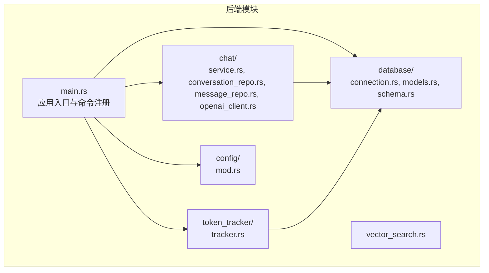
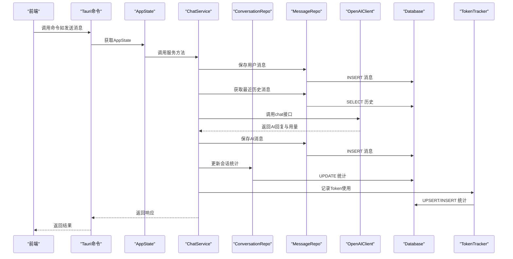
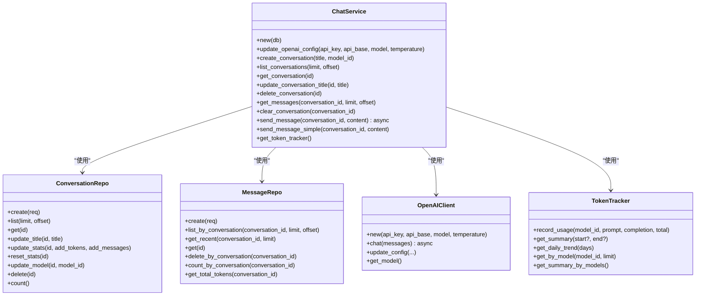
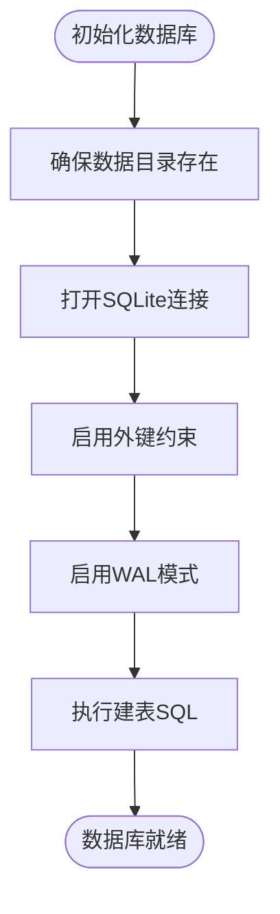
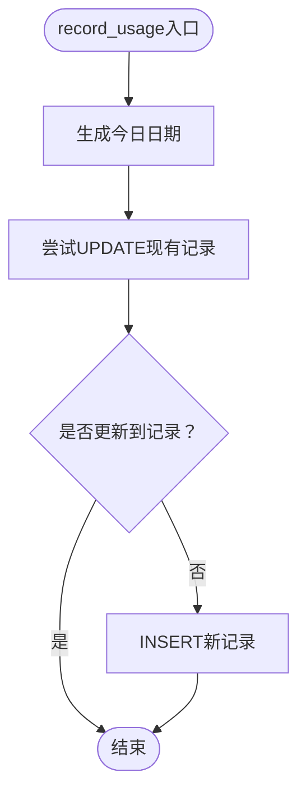
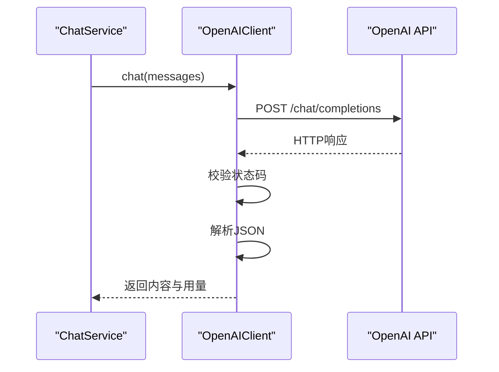
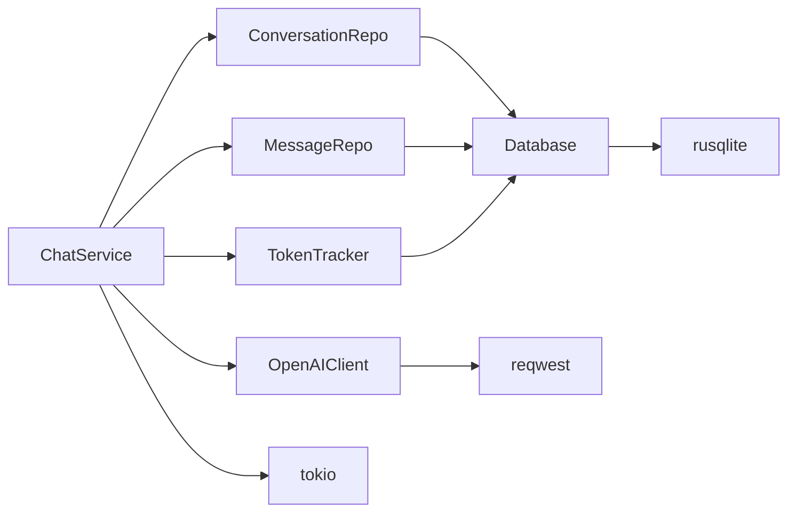

# 后端开发

<cite>
**本文引用的文件**
- [Cargo.toml](file://src-tauri/Cargo.toml)
- [main.rs](file://src-tauri/src/main.rs)
- [service.rs](file://src-tauri/src/chat/service.rs)
- [conversation_repo.rs](file://src-tauri/src/chat/conversation_repo.rs)
- [message_repo.rs](file://src-tauri/src/chat/message_repo.rs)
- [openai_client.rs](file://src-tauri/src/chat/openai_client.rs)
- [models.rs](file://src-tauri/src/database/models.rs)
- [schema.rs](file://src-tauri/src/database/schema.rs)
- [connection.rs](file://src-tauri/src/database/connection.rs)
- [tracker.rs](file://src-tauri/src/token_tracker/tracker.rs)
- [mod.rs（chat）](file://src-tauri/src/chat/mod.rs)
- [mod.rs（token_tracker）](file://src-tauri/src/token_tracker/mod.rs)
- [mod.rs（config）](file://src-tauri/src/config/mod.rs)
- [vector_search.rs](file://src-tauri/src/vector_search.rs)
- [db_test.rs](file://src-tauri/src/db_test.rs)
- [README.md](file://README.md)
</cite>

## 目录
1. [简介](#简介)
2. [项目结构](#项目结构)
3. [核心组件](#核心组件)
4. [架构总览](#架构总览)
5. [组件详解](#组件详解)
6. [依赖关系分析](#依赖关系分析)
7. [性能考量](#性能考量)
8. [故障排查指南](#故障排查指南)
9. [结论](#结论)
10. [附录](#附录)

## 简介
本技术文档面向Malou Agent后端（Rust + Tauri）开发，聚焦以下主题：
- 在Tauri框架中使用Rust进行桌面应用后端开发，涵盖异步编程模式、所有权系统与内存安全保证。
- ChatService核心服务的实现逻辑、会话管理与消息处理机制。
- 数据库设计模式、Repository模式实现与SQLite集成方案。
- Token使用统计追踪系统的实现原理与数据采集策略。
- OpenAI API集成的技术细节与错误处理机制。
- 性能优化建议与并发编程最佳实践。

## 项目结构
后端位于src-tauri目录，采用模块化组织：
- chat：聊天服务与数据访问层（会话、消息、OpenAI客户端）
- database：数据库连接、模型与Schema定义
- token_tracker：Token使用统计追踪
- config：应用配置管理（含ONNX与模型选择）
- vector_search：向量相似度与检索引擎（为后续向量数据库集成做准备）

图表来源
- [main.rs](file://src-tauri/src/main.rs#L249-L322)
- [service.rs](file://src-tauri/src/chat/service.rs#L1-L214)
- [conversation_repo.rs](file://src-tauri/src/chat/conversation_repo.rs#L1-L161)
- [message_repo.rs](file://src-tauri/src/chat/message_repo.rs#L1-L175)
- [openai_client.rs](file://src-tauri/src/chat/openai_client.rs#L1-L141)
- [connection.rs](file://src-tauri/src/database/connection.rs#L1-L89)
- [models.rs](file://src-tauri/src/database/models.rs#L1-L110)
- [schema.rs](file://src-tauri/src/database/schema.rs#L1-L68)
- [tracker.rs](file://src-tauri/src/token_tracker/tracker.rs#L1-L195)
- [mod.rs（chat）](file://src-tauri/src/chat/mod.rs#L1-L10)
- [mod.rs（token_tracker）](file://src-tauri/src/token_tracker/mod.rs#L1-L4)
- [mod.rs（config）](file://src-tauri/src/config/mod.rs#L1-L334)
- [vector_search.rs](file://src-tauri/src/vector_search.rs#L1-L84)

章节来源
- [main.rs](file://src-tauri/src/main.rs#L249-L322)
- [README.md](file://README.md#L45-L61)

## 核心组件
- 应用入口与命令注册：负责初始化数据库、创建ChatService、注入全局状态，并注册所有Tauri命令。
- ChatService：协调会话与消息的持久化、调用OpenAI API、维护会话统计与Token追踪。
- Repository层：ConversationRepo与MessageRepo封装SQLite访问，提供CRUD与聚合查询。
- OpenAI客户端：封装HTTP请求、鉴权头、响应解析与错误处理。
- 数据库层：Database连接管理、WAL模式、外键约束、Schema初始化；模型与索引定义。
- Token追踪器：按模型与日期聚合Token用量，提供汇总与趋势查询。
- 配置管理：应用配置、模型选择、ONNX资源限制等。
- 向量搜索：相似度度量与检索引擎，为后续向量数据库集成做准备。

章节来源
- [main.rs](file://src-tauri/src/main.rs#L249-L322)
- [service.rs](file://src-tauri/src/chat/service.rs#L1-L214)
- [conversation_repo.rs](file://src-tauri/src/chat/conversation_repo.rs#L1-L161)
- [message_repo.rs](file://src-tauri/src/chat/message_repo.rs#L1-L175)
- [openai_client.rs](file://src-tauri/src/chat/openai_client.rs#L1-L141)
- [connection.rs](file://src-tauri/src/database/connection.rs#L1-L89)
- [models.rs](file://src-tauri/src/database/models.rs#L1-L110)
- [schema.rs](file://src-tauri/src/database/schema.rs#L1-L68)
- [tracker.rs](file://src-tauri/src/token_tracker/tracker.rs#L1-L195)
- [mod.rs（config）](file://src-tauri/src/config/mod.rs#L1-L334)
- [vector_search.rs](file://src-tauri/src/vector_search.rs#L1-L84)

## 架构总览
下图展示从Tauri命令到后端服务、数据库与外部API的交互流程。

图表来源
- [main.rs](file://src-tauri/src/main.rs#L140-L161)
- [service.rs](file://src-tauri/src/chat/service.rs#L90-L167)
- [message_repo.rs](file://src-tauri/src/chat/message_repo.rs#L14-L52)
- [conversation_repo.rs](file://src-tauri/src/chat/conversation_repo.rs#L102-L116)
- [openai_client.rs](file://src-tauri/src/chat/openai_client.rs#L74-L116)
- [tracker.rs](file://src-tauri/src/token_tracker/tracker.rs#L14-L48)
- [connection.rs](file://src-tauri/src/database/connection.rs#L50-L57)

## 组件详解

### ChatService：会话与消息处理
- 职责：创建/查询/更新/删除会话；查询消息列表；发送消息并调用OpenAI；更新会话统计；记录Token使用。
- 异步模式：send_message为异步方法，内部通过Tokio运行时发起HTTP请求。
- 错误处理：统一将底层错误包装为字符串返回，便于Tauri命令层处理。
- 会话统计：每次新增消息与AI回复都会更新会话的总Token数与消息数。
- Token追踪：当API返回用量时，写入Token统计表。

图表来源
- [service.rs](file://src-tauri/src/chat/service.rs#L9-L26)
- [conversation_repo.rs](file://src-tauri/src/chat/conversation_repo.rs#L4-L12)
- [message_repo.rs](file://src-tauri/src/chat/message_repo.rs#L4-L12)
- [openai_client.rs](file://src-tauri/src/chat/openai_client.rs#L5-L11)
- [tracker.rs](file://src-tauri/src/token_tracker/tracker.rs#L4-L12)

章节来源
- [service.rs](file://src-tauri/src/chat/service.rs#L17-L214)

### Repository模式与SQLite集成
- Database：封装rusqlite连接，启用外键与WAL模式，提供execute闭包执行数据库操作，支持多处Clone共享连接。
- Schema：定义三张表（conversations、messages、token_usage）及必要索引；会话与消息外键关联，删除会话自动级联删除消息。
- ConversationRepo：提供会话的创建、列表、查询、标题更新、统计更新、模型更新、删除与计数。
- MessageRepo：提供消息的创建、按会话列表、最近N条、查询单条、删除会话全部消息、计数与总Token求和。
- 事务与并发：通过Arc<Mutex<Connection>>共享连接，execute闭包内加锁，确保线程安全；WAL模式提升并发读写性能。

图表来源
- [connection.rs](file://src-tauri/src/database/connection.rs#L13-L43)
- [schema.rs](file://src-tauri/src/database/schema.rs#L2-L62)

章节来源
- [connection.rs](file://src-tauri/src/database/connection.rs#L1-L89)
- [schema.rs](file://src-tauri/src/database/schema.rs#L1-L68)
- [conversation_repo.rs](file://src-tauri/src/chat/conversation_repo.rs#L1-L161)
- [message_repo.rs](file://src-tauri/src/chat/message_repo.rs#L1-L175)

### Token使用统计追踪
- 记录策略：按模型ID与日期聚合，若当日已有记录则累加，否则插入新记录。
- 查询能力：支持指定日期范围的汇总、按模型分组汇总、每日趋势（按日期升序）。
- 数据模型：TokenUsage、TokenSummary、DailyTokenUsage。

图表来源
- [tracker.rs](file://src-tauri/src/token_tracker/tracker.rs#L14-L48)

章节来源
- [tracker.rs](file://src-tauri/src/token_tracker/tracker.rs#L1-L195)
- [models.rs](file://src-tauri/src/database/models.rs#L48-L78)

### OpenAI API集成与错误处理
- 客户端行为：构造请求体（模型、消息、温度），设置Authorization与Content-Type，发送POST请求。
- 错误处理：状态码非成功时读取响应文本作为错误信息；JSON解析失败时返回错误；无choices时返回错误。
- 配置更新：支持动态更新API密钥、基础URL、模型与温度，并在ChatService中同步。

图表来源
- [openai_client.rs](file://src-tauri/src/chat/openai_client.rs#L74-L116)

章节来源
- [openai_client.rs](file://src-tauri/src/chat/openai_client.rs#L1-L141)
- [service.rs](file://src-tauri/src/chat/service.rs#L28-L31)

### Tauri命令与状态管理
- 全局状态：AppState包含ChatService与OpenAI配置，分别由Mutex保护。
- 命令注册：会话管理、消息管理、Token统计、OpenAI配置、数据库测试等命令。
- 异步命令：send_message为异步命令，内部调用ChatService的异步方法。

章节来源
- [main.rs](file://src-tauri/src/main.rs#L53-L56)
- [main.rs](file://src-tauri/src/main.rs#L292-L319)
- [main.rs](file://src-tauri/src/main.rs#L140-L161)

### 配置管理（ONNX与模型选择）
- 支持本地模型与远程模型配置，包含启用状态、能力、资源限制等。
- 提供命令接口：获取配置、更新配置、切换当前模型、开启/关闭本地模型、开启/关闭ONNX特性。
- 默认配置：包含示例本地与远程模型、ONNX开关与资源限制。

章节来源
- [mod.rs（config）](file://src-tauri/src/config/mod.rs#L1-L334)

### 向量搜索与相似度度量
- 提供CosineSimilarity与EuclideanDistance两种相似度度量接口。
- VectorSearchEngine支持添加文档向量、Top-K检索、长度与判空查询。
- 为后续ChromaDB或本地向量数据库集成奠定基础。

章节来源
- [vector_search.rs](file://src-tauri/src/vector_search.rs#L1-L84)

## 依赖关系分析
- 语言与运行时：Tokio提供异步运行时；Rust所有权与线程安全保障。
- 外部库：reqwest用于HTTP请求；rusqlite用于SQLite；uuid与chrono用于标识与时间；dirs用于跨平台数据目录。
- 模块耦合：ChatService依赖Repository层与TokenTracker；Repository层依赖Database；OpenAI客户端独立但被ChatService使用。

图表来源
- [Cargo.toml](file://src-tauri/Cargo.toml#L12-L24)
- [service.rs](file://src-tauri/src/chat/service.rs#L1-L15)
- [conversation_repo.rs](file://src-tauri/src/chat/conversation_repo.rs#L1-L2)
- [message_repo.rs](file://src-tauri/src/chat/message_repo.rs#L1-L2)
- [tracker.rs](file://src-tauri/src/token_tracker/tracker.rs#L1-L2)
- [openai_client.rs](file://src-tauri/src/chat/openai_client.rs#L1-L1)

章节来源
- [Cargo.toml](file://src-tauri/Cargo.toml#L1-L25)

## 性能考量
- 并发与锁粒度：Database通过Arc<Mutex<Connection>>共享连接，execute闭包内加锁；建议尽量缩短持有锁的时间，避免在锁内执行耗时操作。
- 索引优化：conversations与messages表已建立索引；建议根据查询模式评估是否需要复合索引。
- WAL模式：已启用WAL以提升并发读写性能，适合频繁读写的聊天场景。
- 异步I/O：OpenAI请求使用异步客户端，避免阻塞主线程；建议在ChatService中合理拆分任务，避免长时间占用服务实例。
- Token统计：按日聚合减少热点写入冲突；若并发极高，可考虑批量写入或队列缓冲。
- 内存与资源：ONNX相关配置提供资源限制，建议结合实际硬件调整最大内存与线程数。

## 故障排查指南
- 数据库初始化失败：检查数据目录权限与路径；确认外键与WAL设置是否生效。
- 会话/消息查询异常：核对SQL语句与参数绑定；确认索引是否存在。
- OpenAI请求失败：检查API密钥与基础URL；查看HTTP状态码与响应文本；确认网络连通性。
- Token统计为空：确认ChatService是否正确调用record_usage；检查日期格式与聚合逻辑。
- 配置更新无效：确认命令调用顺序与状态更新逻辑；检查配置文件路径与序列化问题。

章节来源
- [connection.rs](file://src-tauri/src/database/connection.rs#L13-L43)
- [openai_client.rs](file://src-tauri/src/chat/openai_client.rs#L94-L98)
- [tracker.rs](file://src-tauri/src/token_tracker/tracker.rs#L14-L48)
- [mod.rs（config）](file://src-tauri/src/config/mod.rs#L149-L206)

## 结论
Malou Agent后端以Tauri + Rust为基础，采用清晰的模块划分与Repository模式，结合SQLite与WAL模式实现高性能的本地存储；通过ChatService统一编排会话、消息与Token统计，并预留了OpenAI集成与ONNX配置管理能力。未来可在异步任务调度、批量写入与向量数据库集成方面进一步优化。

## 附录
- 数据库测试：提供临时数据库的创建、文档增删改查与清理流程，便于验证数据库层功能。
- 项目结构概览：README展示了前后端技术栈与目录结构。

章节来源
- [db_test.rs](file://src-tauri/src/db_test.rs#L1-L58)
- [README.md](file://README.md#L45-L61)