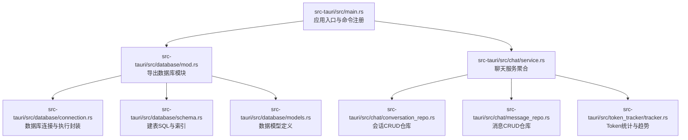
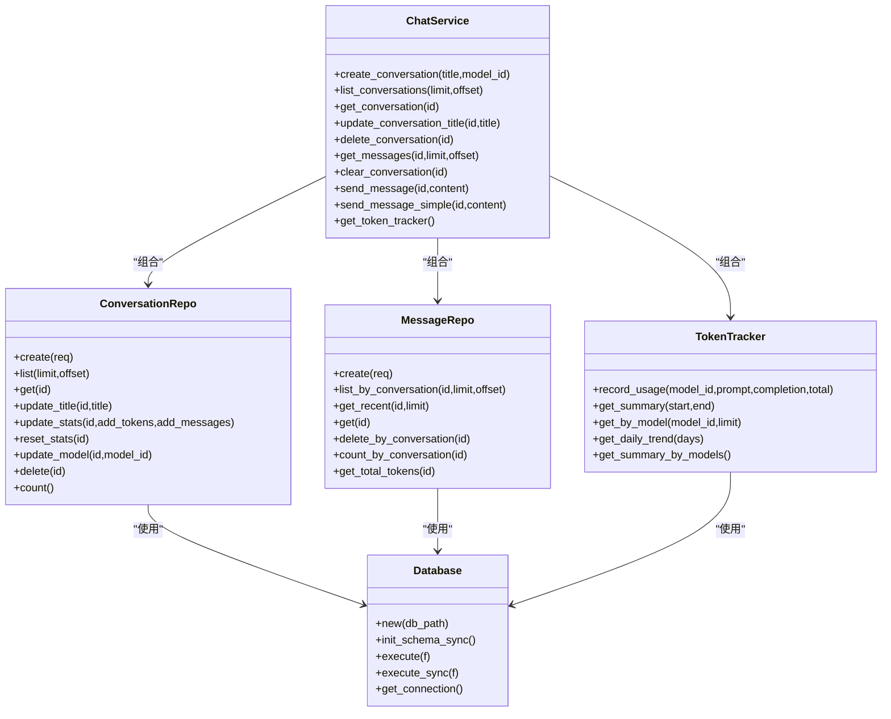
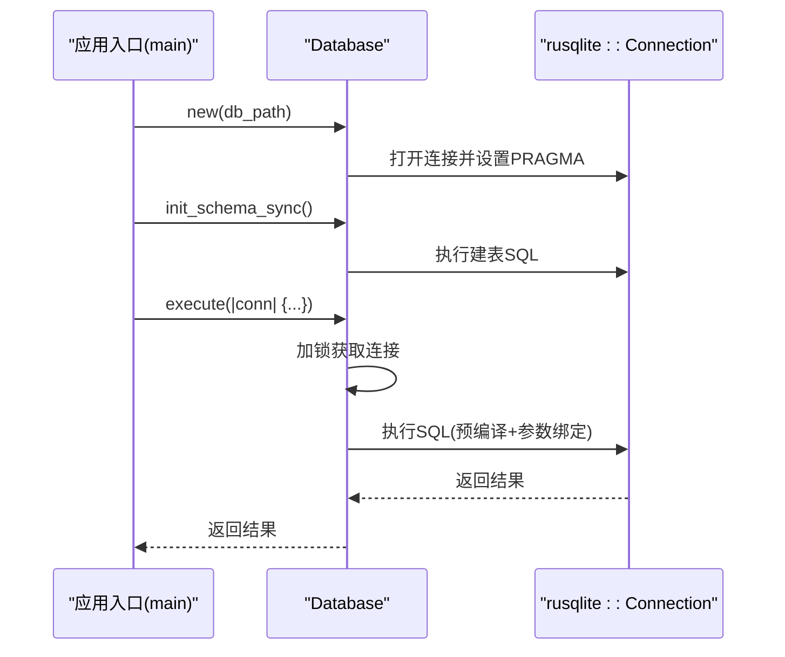
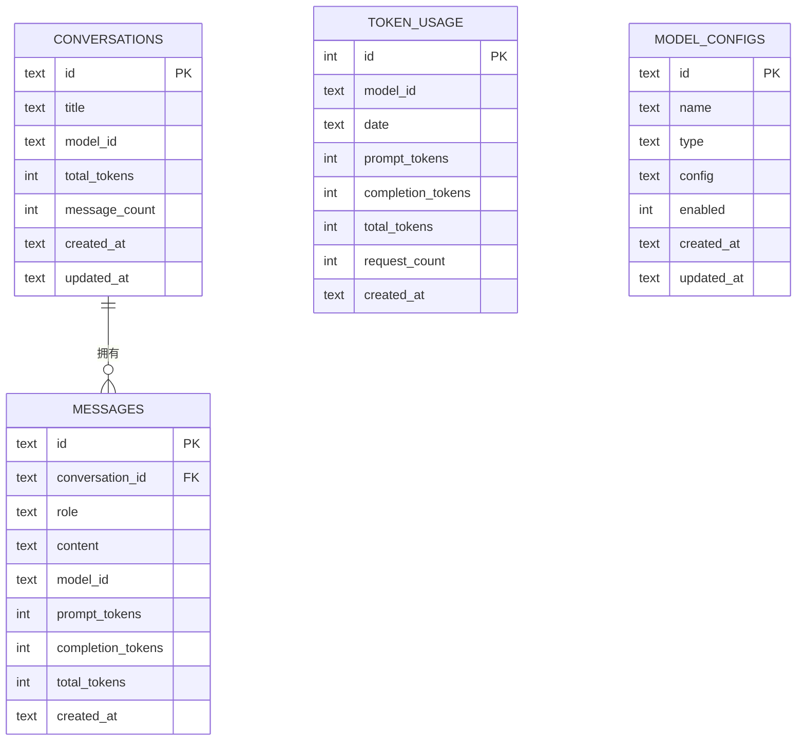
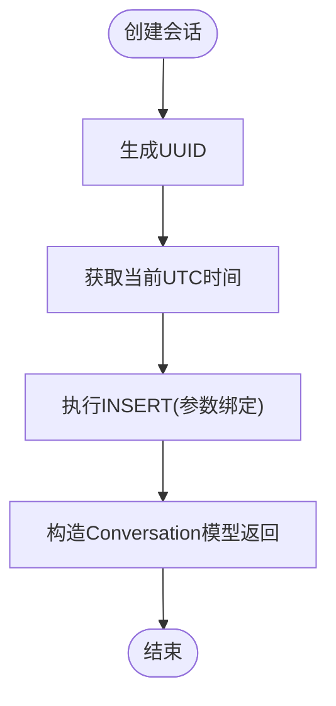
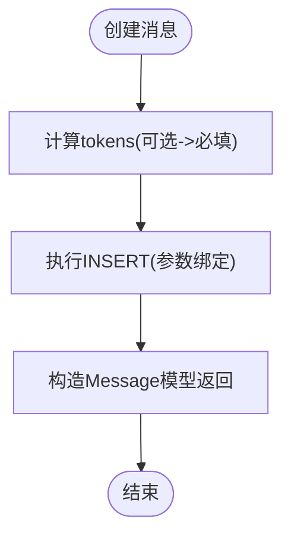
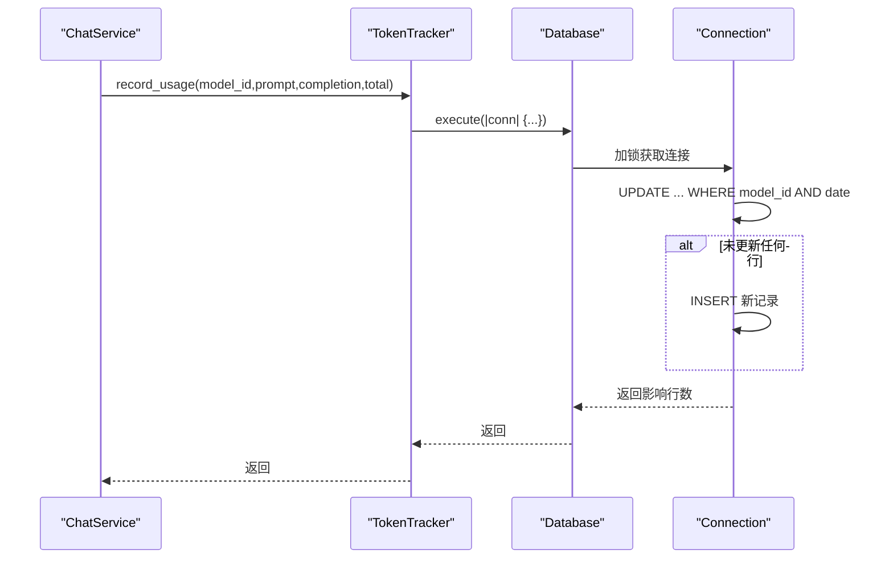
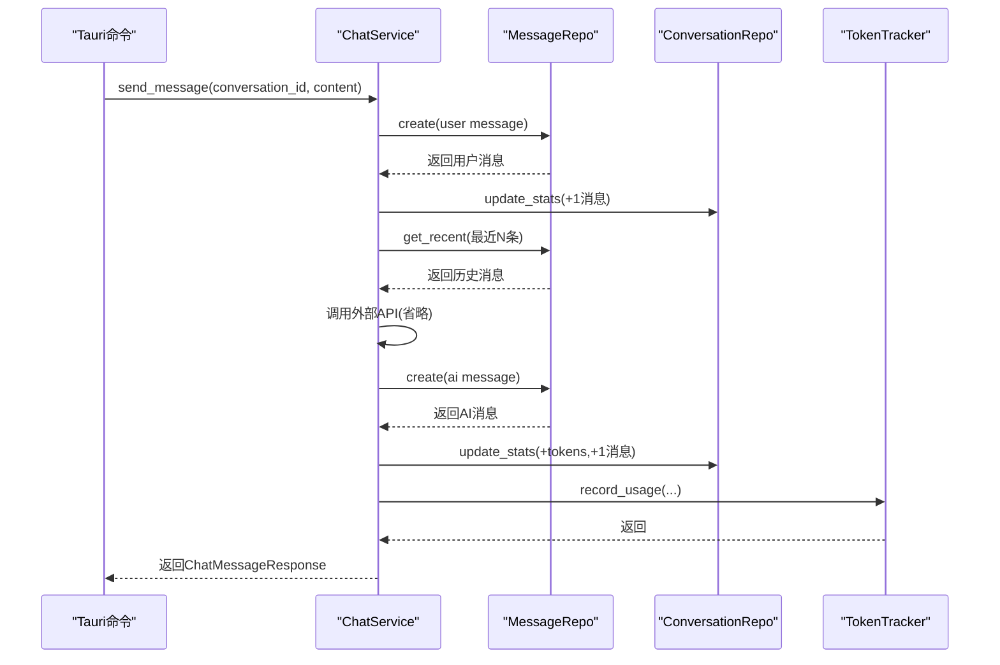
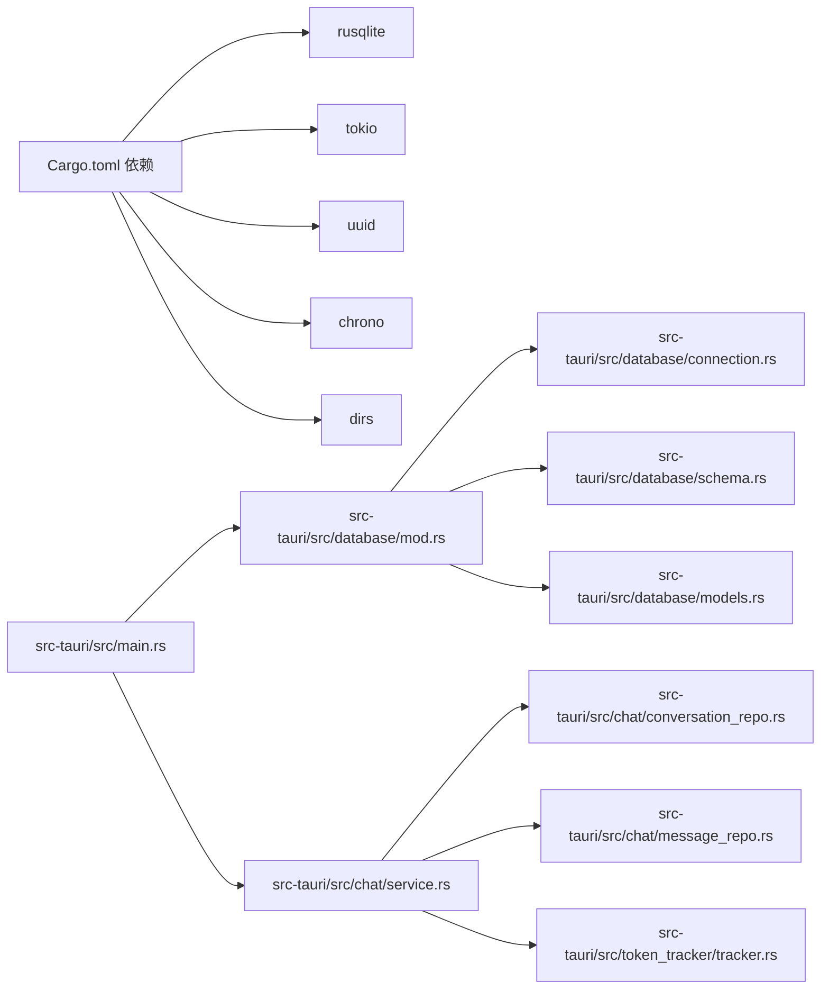

# 数据库操作

<cite>
**本文引用的文件**
- [src-tauri/src/main.rs](file://src-tauri/src/main.rs)
- [src-tauri/src/database/mod.rs](file://src-tauri/src/database/mod.rs)
- [src-tauri/src/database/connection.rs](file://src-tauri/src/database/connection.rs)
- [src-tauri/src/database/schema.rs](file://src-tauri/src/database/schema.rs)
- [src-tauri/src/database/models.rs](file://src-tauri/src/database/models.rs)
- [src-tauri/src/chat/conversation_repo.rs](file://src-tauri/src/chat/conversation_repo.rs)
- [src-tauri/src/chat/message_repo.rs](file://src-tauri/src/chat/message_repo.rs)
- [src-tauri/src/chat/service.rs](file://src-tauri/src/chat/service.rs)
- [src-tauri/src/token_tracker/tracker.rs](file://src-tauri/src/token_tracker/tracker.rs)
- [src-tauri/Cargo.toml](file://src-tauri/Cargo.toml)
- [src-tauri/src/db_test.rs](file://src-tauri/src/db_test.rs)
</cite>

## 目录
1. [简介](#简介)
2. [项目结构](#项目结构)
3. [核心组件](#核心组件)
4. [架构总览](#架构总览)
5. [详细组件分析](#详细组件分析)
6. [依赖关系分析](#依赖关系分析)
7. [性能考虑](#性能考虑)
8. [故障排查指南](#故障排查指南)
9. [结论](#结论)
10. [附录](#附录)

## 简介
本文件面向Malou Agent的数据库操作，围绕SQLite在Tauri后端中的实现进行系统性技术说明。重点覆盖以下方面：
- CRUD操作实现：插入、查询、更新、删除在仓库层与模型层的映射与参数绑定
- 事务管理：当前实现采用单连接串行化访问；介绍手动事务与嵌套事务的实践建议
- 查询优化：预编译语句、参数绑定、索引策略与查询计划分析
- 并发控制与锁机制：WAL模式、互斥锁、读写锁、死锁预防
- 批量操作：批量插入、批量更新、批量删除的实现思路与注意事项
- 错误处理与异常恢复：统一错误类型、错误传播与降级策略
- 性能监控与调优：基于现有实现的监控点与优化建议

## 项目结构
Malou Agent的数据库相关代码集中在Tauri后端的database与chat子模块中，并由主程序在启动阶段初始化数据库与表结构。

图表来源
- [src-tauri/src/main.rs](file://src-tauri/src/main.rs#L242-L320)
- [src-tauri/src/database/mod.rs](file://src-tauri/src/database/mod.rs#L1-L7)
- [src-tauri/src/database/connection.rs](file://src-tauri/src/database/connection.rs#L1-L125)
- [src-tauri/src/database/schema.rs](file://src-tauri/src/database/schema.rs#L1-L68)
- [src-tauri/src/database/models.rs](file://src-tauri/src/database/models.rs#L1-L110)
- [src-tauri/src/chat/service.rs](file://src-tauri/src/chat/service.rs#L1-L224)
- [src-tauri/src/chat/conversation_repo.rs](file://src-tauri/src/chat/conversation_repo.rs#L1-L169)
- [src-tauri/src/chat/message_repo.rs](file://src-tauri/src/chat/message_repo.rs#L1-L175)
- [src-tauri/src/token_tracker/tracker.rs](file://src-tauri/src/token_tracker/tracker.rs#L1-L195)

章节来源
- [src-tauri/src/main.rs](file://src-tauri/src/main.rs#L242-L320)
- [src-tauri/src/database/mod.rs](file://src-tauri/src/database/mod.rs#L1-L7)

## 核心组件
- 数据库连接与执行封装：通过互斥锁保护rusqlite连接，提供异步与同步两种执行入口，启动时初始化表结构。
- 仓库层（Repository）：会话与消息的CRUD操作，均通过参数化SQL与预编译语句实现，避免SQL注入并提升性能。
- 模型层（Models）：定义Conversation、Message、TokenUsage等数据结构，用于DAO与上层服务之间的数据传递。
- 聊天服务（ChatService）：聚合仓库与TokenTracker，协调消息创建、会话统计更新与Token使用记录。
- Token统计（TokenTracker）：按模型与日期维度统计Token用量，提供汇总与趋势查询。

章节来源
- [src-tauri/src/database/connection.rs](file://src-tauri/src/database/connection.rs#L14-L88)
- [src-tauri/src/chat/conversation_repo.rs](file://src-tauri/src/chat/conversation_repo.rs#L14-L160)
- [src-tauri/src/chat/message_repo.rs](file://src-tauri/src/chat/message_repo.rs#L14-L173)
- [src-tauri/src/token_tracker/tracker.rs](file://src-tauri/src/token_tracker/tracker.rs#L14-L193)
- [src-tauri/src/database/models.rs](file://src-tauri/src/database/models.rs#L3-L109)

## 架构总览
数据库层采用“连接封装 + 仓库层 + 服务层”的分层设计，确保：
- 单连接串行化访问，避免并发冲突
- 参数化SQL与预编译语句，提升安全性与性能
- 明确的错误传播路径，便于定位问题
- 通过索引与WAL模式提升并发读写性能

图表来源
- [src-tauri/src/database/connection.rs](file://src-tauri/src/database/connection.rs#L10-L12)
- [src-tauri/src/chat/conversation_repo.rs](file://src-tauri/src/chat/conversation_repo.rs#L4-L12)
- [src-tauri/src/chat/message_repo.rs](file://src-tauri/src/chat/message_repo.rs#L4-L12)
- [src-tauri/src/token_tracker/tracker.rs](file://src-tauri/src/token_tracker/tracker.rs#L4-L12)
- [src-tauri/src/chat/service.rs](file://src-tauri/src/chat/service.rs#L11-L28)

## 详细组件分析

### 数据库连接与执行封装
- 连接封装：使用Arc<Mutex<Connection>>保护rusqlite连接，配合unsafe impl Send/Sync确保跨线程可用。
- 初始化：启动时启用外键约束与WAL模式，随后执行建表SQL。
- 执行模型：提供异步execute与同步execute_sync，前者在Tokio上下文中加锁执行，后者在无运行时场景下抛出panic以避免错误静默。
- 默认路径：提供get_default_db_path生成应用数据目录下的数据库文件路径。

图表来源
- [src-tauri/src/main.rs](file://src-tauri/src/main.rs#L248-L257)
- [src-tauri/src/database/connection.rs](file://src-tauri/src/database/connection.rs#L16-L35)
- [src-tauri/src/database/connection.rs](file://src-tauri/src/database/connection.rs#L38-L60)
- [src-tauri/src/database/connection.rs](file://src-tauri/src/database/connection.rs#L67-L88)

章节来源
- [src-tauri/src/database/connection.rs](file://src-tauri/src/database/connection.rs#L10-L12)
- [src-tauri/src/database/connection.rs](file://src-tauri/src/database/connection.rs#L16-L35)
- [src-tauri/src/database/connection.rs](file://src-tauri/src/database/connection.rs#L38-L60)
- [src-tauri/src/database/connection.rs](file://src-tauri/src/database/connection.rs#L67-L88)
- [src-tauri/src/database/connection.rs](file://src-tauri/src/database/connection.rs#L104-L109)

### 表结构与索引
- 会话表：包含主键id、标题、模型id、Token统计、消息计数与时间戳。
- 消息表：包含主键id、会话id外键、角色、内容、Token统计与时间戳；外键级联删除。
- Token统计表：按模型与日期聚合，记录提示、补全、总量与请求数。
- 索引策略：会话按更新时间倒序索引；消息按会话+时间索引；Token统计按模型+日期索引。

图表来源
- [src-tauri/src/database/schema.rs](file://src-tauri/src/database/schema.rs#L2-L62)

章节来源
- [src-tauri/src/database/schema.rs](file://src-tauri/src/database/schema.rs#L2-L62)

### 会话CRUD（ConversationRepo）
- 插入：生成UUID作为id，UTC时间作为created_at/updated_at，使用参数绑定插入。
- 查询：支持分页列表（按更新时间倒序）、按id查询、统计计数。
- 更新：支持标题更新、Token统计与消息数增量更新、重置统计、模型切换。
- 删除：按id删除，外键约束触发消息级联删除。

图表来源
- [src-tauri/src/chat/conversation_repo.rs](file://src-tauri/src/chat/conversation_repo.rs#L14-L37)

章节来源
- [src-tauri/src/chat/conversation_repo.rs](file://src-tauri/src/chat/conversation_repo.rs#L14-L160)

### 消息CRUD（MessageRepo）
- 插入：根据可选字段计算prompt/completion/total tokens，参数绑定插入。
- 查询：按会话分页查询、获取最近N条消息（用于上下文构建）、按id查询、统计与求和。
- 删除：按会话批量删除消息。

图表来源
- [src-tauri/src/chat/message_repo.rs](file://src-tauri/src/chat/message_repo.rs#L14-L52)

章节来源
- [src-tauri/src/chat/message_repo.rs](file://src-tauri/src/chat/message_repo.rs#L14-L173)

### Token统计（TokenTracker）
- 记录：按模型+日期尝试更新，未命中则插入新记录，原子性保障。
- 汇总：支持按日期范围汇总、按模型查询、按日期聚合趋势、按模型汇总。
- 趋势：按日期分组聚合，返回最近N天的趋势数据。

图表来源
- [src-tauri/src/token_tracker/tracker.rs](file://src-tauri/src/token_tracker/tracker.rs#L14-L48)
- [src-tauri/src/database/connection.rs](file://src-tauri/src/database/connection.rs#L67-L74)

章节来源
- [src-tauri/src/token_tracker/tracker.rs](file://src-tauri/src/token_tracker/tracker.rs#L14-L193)

### 聊天服务（ChatService）
- 聚合：组合ConversationRepo、MessageRepo与TokenTracker，协调消息创建、会话统计更新与Token记录。
- 发送消息：保存用户消息→更新会话统计→获取历史消息→记录AI回复→更新会话统计→记录Token使用→返回结果。
- 简易发送：不调用外部API，直接回显消息，便于测试。

图表来源
- [src-tauri/src/chat/service.rs](file://src-tauri/src/chat/service.rs#L94-L177)
- [src-tauri/src/chat/message_repo.rs](file://src-tauri/src/chat/message_repo.rs#L14-L52)
- [src-tauri/src/chat/conversation_repo.rs](file://src-tauri/src/chat/conversation_repo.rs#L105-L120)
- [src-tauri/src/token_tracker/tracker.rs](file://src-tauri/src/token_tracker/tracker.rs#L14-L48)

章节来源
- [src-tauri/src/chat/service.rs](file://src-tauri/src/chat/service.rs#L20-L224)

## 依赖关系分析
- 外部依赖：rusqlite（SQLite驱动，启用bundled特性）、tokio（异步运行时）、uuid与chrono（ID与时间）、dirs（系统数据目录）。
- 内部模块：database（连接、模型、schema）、chat（仓库与服务）、token_tracker（统计）。

图表来源
- [src-tauri/Cargo.toml](file://src-tauri/Cargo.toml#L12-L25)
- [src-tauri/src/main.rs](file://src-tauri/src/main.rs#L1-L13)

章节来源
- [src-tauri/Cargo.toml](file://src-tauri/Cargo.toml#L12-L25)
- [src-tauri/src/main.rs](file://src-tauri/src/main.rs#L1-L13)

## 性能考虑
- WAL模式：启动时启用WAL以提升并发读写性能。
- 索引策略：会话按更新时间倒序索引；消息按会话+时间索引；Token统计按模型+日期索引，满足高频查询场景。
- 预编译与参数绑定：仓库层普遍使用prepare+params!，减少SQL解析与注入风险。
- 异步执行：通过tokio::sync::Mutex在异步上下文中串行化执行，避免锁竞争。
- 批量操作建议：当前仓库未提供批量接口，如需批量插入/更新/删除，可在仓库层扩展批量SQL（例如多值INSERT或批量UPDATE），并在调用方按批次拆分，结合参数绑定与事务提交以提升吞吐。

章节来源
- [src-tauri/src/database/connection.rs](file://src-tauri/src/database/connection.rs#L24-L28)
- [src-tauri/src/database/schema.rs](file://src-tauri/src/database/schema.rs#L14-L61)
- [src-tauri/src/chat/conversation_repo.rs](file://src-tauri/src/chat/conversation_repo.rs#L19-L26)
- [src-tauri/src/chat/message_repo.rs](file://src-tauri/src/chat/message_repo.rs#L22-L39)

## 故障排查指南
- 启动失败（数据库初始化）：检查数据库路径权限与父目录创建逻辑；确认PRAGMA设置是否成功。
- 同步调用错误：execute_sync在无Tokio运行时会panic，应确保在异步上下文中使用execute。
- 外键约束：删除会话时依赖外键级联删除消息，若失败需检查外键是否启用与依赖完整性。
- 锁竞争：当前为单连接串行化执行，高并发下建议引入连接池与事务块划分，避免长事务阻塞。
- 测试验证：提供db_test模块用于基本CRUD验证，可参考其流程进行回归测试。

章节来源
- [src-tauri/src/database/connection.rs](file://src-tauri/src/database/connection.rs#L48-L87)
- [src-tauri/src/database/schema.rs](file://src-tauri/src/database/schema.rs#L28-L29)
- [src-tauri/src/db_test.rs](file://src-tauri/src/db_test.rs#L1-L58)

## 结论
Malou Agent的数据库层以rusqlite为核心，通过连接封装、参数化SQL与索引策略实现了稳定高效的本地存储能力。当前实现采用单连接串行化访问，具备良好的一致性与可维护性；在性能与并发需求进一步提升时，可引入连接池、批量操作与更细粒度的事务划分，同时保持参数化与预编译的安全实践。

## 附录

### 事务管理机制说明
- 当前实现：单连接串行化执行，无显式BEGIN/COMMIT包裹；所有操作在execute闭包内串行执行。
- 手动事务：可在execute闭包内显式调用事务API（如rusqlite的Transaction），在业务关键路径中包裹多个写操作，确保原子性。
- 自动事务：可封装一个with_transaction方法，在execute内部创建事务对象，执行回调后commit/rollback。
- 嵌套事务：SQLite不支持真正的嵌套事务，可通过savepoint模拟；在复杂写入场景中，使用savepoint分段提交/回滚，降低长事务风险。

章节来源
- [src-tauri/src/database/connection.rs](file://src-tauri/src/database/connection.rs#L67-L74)

### 并发控制与锁机制
- WAL模式：提升并发读性能，减少写入阻塞。
- 互斥锁：Arc<Mutex<Connection>>保证同一时间仅有一个任务持有连接。
- 读写锁：TokenTracker与ChatService中对OpenAI客户端使用RwLock，实现读多写少场景的并发优化。
- 死锁预防：单连接串行化避免锁链；如引入连接池，需严格控制事务边界与锁顺序，避免循环等待。

章节来源
- [src-tauri/src/database/connection.rs](file://src-tauri/src/database/connection.rs#L27-L28)
- [src-tauri/src/chat/service.rs](file://src-tauri/src/chat/service.rs#L12-L18)

### 查询优化策略
- 预编译语句：仓库层普遍使用prepare，减少SQL解析成本。
- 参数绑定：使用params!与命名参数，避免字符串拼接与注入。
- 索引利用：按查询条件建立复合索引；对高频过滤字段（如conversation_id、date）优先建立索引。
- 查询计划分析：可使用EXPLAIN QUERY PLAN查看执行计划，结合索引与LIMIT优化慢查询。

章节来源
- [src-tauri/src/chat/conversation_repo.rs](file://src-tauri/src/chat/conversation_repo.rs#L42-L47)
- [src-tauri/src/chat/message_repo.rs](file://src-tauri/src/chat/message_repo.rs#L57-L63)
- [src-tauri/src/token_tracker/tracker.rs](file://src-tauri/src/token_tracker/tracker.rs#L118-L124)

### 批量操作优化
- 批量插入：使用多值INSERT或事务内多次执行，结合参数绑定。
- 批量更新/删除：按会话或模型维度分批处理，避免超大事务。
- 事务边界：将多个写操作放入单个事务，减少WAL写放大与提交次数。

章节来源
- [src-tauri/src/chat/conversation_repo.rs](file://src-tauri/src/chat/conversation_repo.rs#L105-L120)
- [src-tauri/src/chat/message_repo.rs](file://src-tauri/src/chat/message_repo.rs#L143-L151)

### 错误处理与异常恢复
- 统一错误类型：仓库层与服务层将底层错误转换为业务错误字符串，便于前端展示。
- 降级策略：当外部API不可用时，简易发送消息仍可工作，保障基本可用性。
- 日志与监控：建议在关键路径增加日志埋点与性能指标，结合现有错误处理机制完善监控体系。

章节来源
- [src-tauri/src/chat/service.rs](file://src-tauri/src/chat/service.rs#L38-L42)
- [src-tauri/src/main.rs](file://src-tauri/src/main.rs#L220-L238)