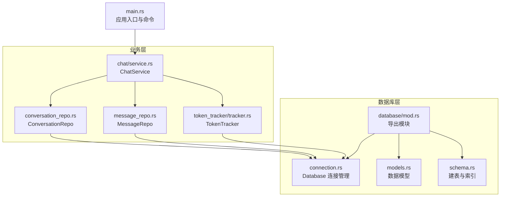
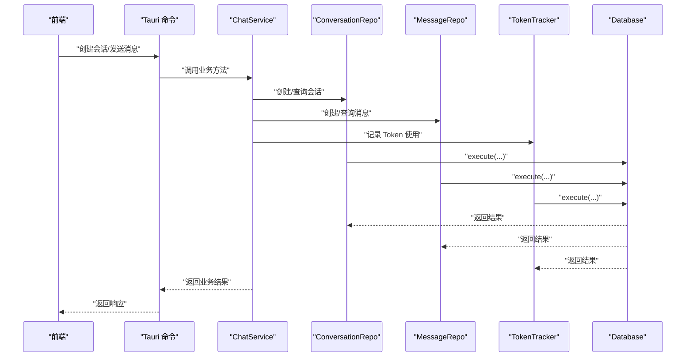
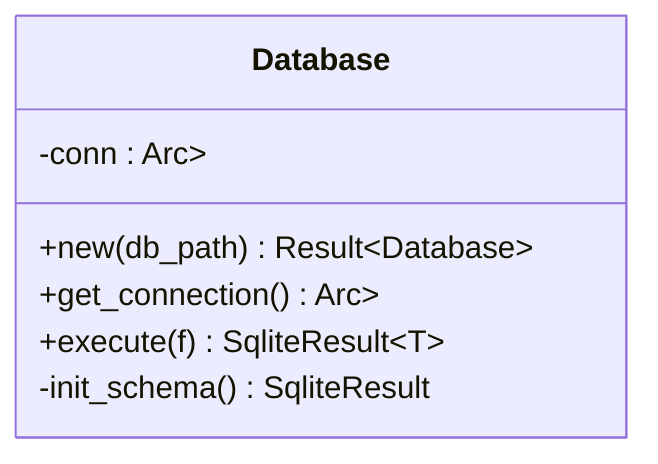
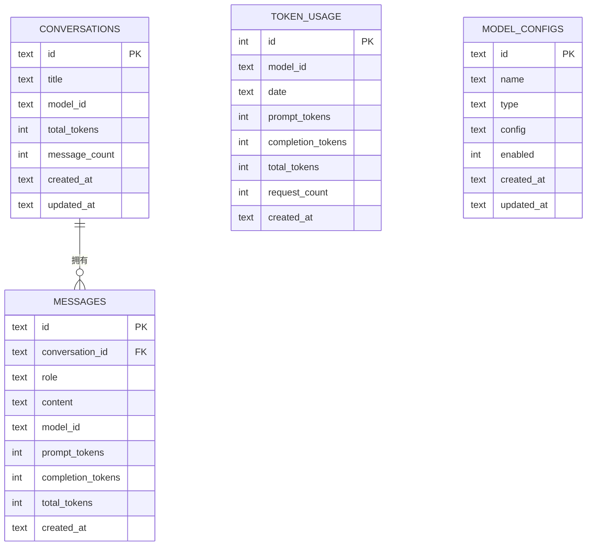
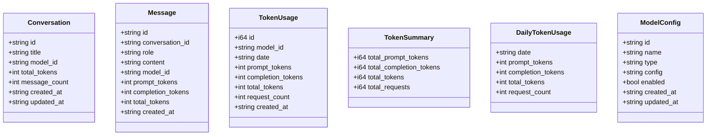
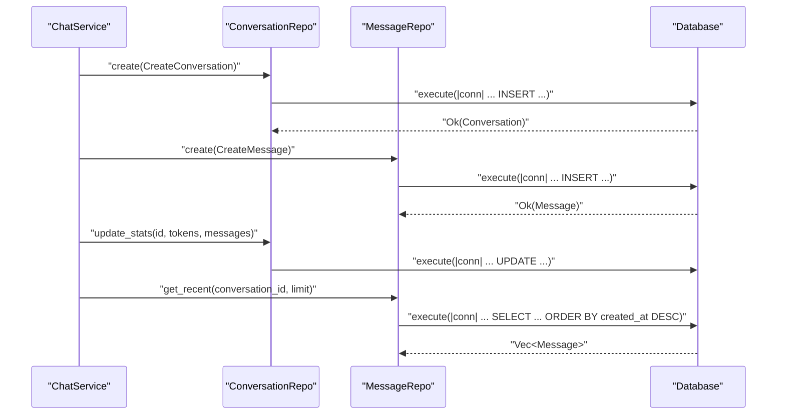
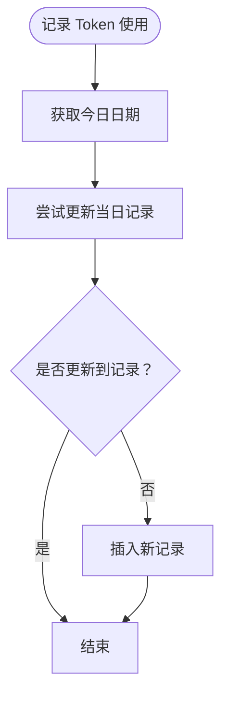
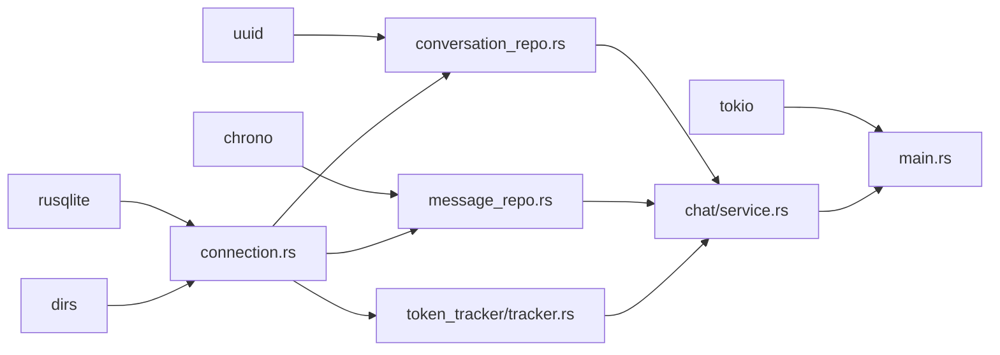

# 数据库设计

<cite>
**本文引用的文件**
- [src-tauri/src/database/connection.rs](file://src-tauri/src/database/connection.rs)
- [src-tauri/src/database/mod.rs](file://src-tauri/src/database/mod.rs)
- [src-tauri/src/database/models.rs](file://src-tauri/src/database/models.rs)
- [src-tauri/src/database/schema.rs](file://src-tauri/src/database/schema.rs)
- [src-tauri/Cargo.toml](file://src-tauri/Cargo.toml)
- [src-tauri/src/chat/conversation_repo.rs](file://src-tauri/src/chat/conversation_repo.rs)
- [src-tauri/src/chat/message_repo.rs](file://src-tauri/src/chat/message_repo.rs)
- [src-tauri/src/token_tracker/tracker.rs](file://src-tauri/src/token_tracker/tracker.rs)
- [src-tauri/src/chat/service.rs](file://src-tauri/src/chat/service.rs)
- [src-tauri/src/main.rs](file://src-tauri/src/main.rs)
- [src-tauri/src/db_test.rs](file://src-tauri/src/db_test.rs)
</cite>

## 目录
1. [简介](#简介)
2. [项目结构](#项目结构)
3. [核心组件](#核心组件)
4. [架构总览](#架构总览)
5. [详细组件分析](#详细组件分析)
6. [依赖关系分析](#依赖关系分析)
7. [性能考虑](#性能考虑)
8. [故障排查指南](#故障排查指南)
9. [结论](#结论)
10. [附录](#附录)

## 简介
本文件系统性阐述 Malou Agent 的数据库设计与实现，重点围绕 SQLite 数据库存储方案、rusqlite 集成、连接管理、表结构与索引策略、数据模型与查询映射、事务与并发控制、迁移与版本管理建议，以及性能优化实践。当前代码采用 rusqlite 同步 API 并通过互斥锁进行线程安全保护；同时在聊天服务中引入读写锁以支持并发访问 OpenAI 客户端，确保整体架构在桌面应用场景下的稳定性与可维护性。

## 项目结构
数据库相关代码集中在 Tauri 后端的 Rust 模块中，采用分层组织：
- database 模块：连接管理、数据模型、Schema 定义
- chat 模块：会话与消息的数据访问层（Repository）、聊天服务（Service）
- token_tracker 模块：Token 使用统计与查询
- main 入口：初始化数据库与服务，并注册命令

图表来源
- [src-tauri/src/database/mod.rs](file://src-tauri/src/database/mod.rs#L1-L7)
- [src-tauri/src/database/connection.rs](file://src-tauri/src/database/connection.rs#L1-L89)
- [src-tauri/src/database/models.rs](file://src-tauri/src/database/models.rs#L1-L110)
- [src-tauri/src/database/schema.rs](file://src-tauri/src/database/schema.rs#L1-L68)
- [src-tauri/src/chat/service.rs](file://src-tauri/src/chat/service.rs#L1-L224)
- [src-tauri/src/chat/conversation_repo.rs](file://src-tauri/src/chat/conversation_repo.rs#L1-L161)
- [src-tauri/src/chat/message_repo.rs](file://src-tauri/src/chat/message_repo.rs#L1-L175)
- [src-tauri/src/token_tracker/tracker.rs](file://src-tauri/src/token_tracker/tracker.rs#L1-L195)
- [src-tauri/src/main.rs](file://src-tauri/src/main.rs#L242-L315)

章节来源
- [src-tauri/src/database/mod.rs](file://src-tauri/src/database/mod.rs#L1-L7)
- [src-tauri/src/main.rs](file://src-tauri/src/main.rs#L242-L315)

## 核心组件
- Database：封装 rusqlite 连接，提供线程安全的执行闭包、初始化 Schema、默认数据库路径生成
- 数据模型：Conversation、Message、TokenUsage、TokenSummary、DailyTokenUsage、ModelConfig 等
- Schema：定义四张核心表及索引，含外键约束与字段约束
- Repository 层：ConversationRepo、MessageRepo 提供 CRUD 与聚合查询
- TokenTracker：基于日期与模型维度的 Token 统计与趋势查询
- ChatService：协调会话、消息、Token 统计与 OpenAI 客户端交互

章节来源
- [src-tauri/src/database/connection.rs](file://src-tauri/src/database/connection.rs#L8-L58)
- [src-tauri/src/database/models.rs](file://src-tauri/src/database/models.rs#L1-L110)
- [src-tauri/src/database/schema.rs](file://src-tauri/src/database/schema.rs#L1-L68)
- [src-tauri/src/chat/conversation_repo.rs](file://src-tauri/src/chat/conversation_repo.rs#L1-L161)
- [src-tauri/src/chat/message_repo.rs](file://src-tauri/src/chat/message_repo.rs#L1-L175)
- [src-tauri/src/token_tracker/tracker.rs](file://src-tauri/src/token_tracker/tracker.rs#L1-L195)
- [src-tauri/src/chat/service.rs](file://src-tauri/src/chat/service.rs#L1-L224)

## 架构总览
数据库层通过 Database 对 rusqlite 进行统一封装，业务层通过 Repository 与 Tracker 访问数据库，ChatService 协调业务流程并在必要时更新统计。应用入口负责初始化数据库与服务，并暴露 Tauri 命令供前端调用。

图表来源
- [src-tauri/src/main.rs](file://src-tauri/src/main.rs#L285-L312)
- [src-tauri/src/chat/service.rs](file://src-tauri/src/chat/service.rs#L37-L177)
- [src-tauri/src/chat/conversation_repo.rs](file://src-tauri/src/chat/conversation_repo.rs#L14-L37)
- [src-tauri/src/chat/message_repo.rs](file://src-tauri/src/chat/message_repo.rs#L14-L52)
- [src-tauri/src/token_tracker/tracker.rs](file://src-tauri/src/token_tracker/tracker.rs#L14-L48)
- [src-tauri/src/database/connection.rs](file://src-tauri/src/database/connection.rs#L50-L57)

## 详细组件分析

### 数据库连接与初始化
- 连接管理：使用 Arc<Mutex<Connection>> 保证多线程安全；提供 execute 闭包统一执行 SQL，避免锁持有过久
- 初始化：自动创建目录、开启外键约束与 WAL 模式、执行 Schema 初始化
- 默认路径：基于系统数据目录生成默认数据库路径

图表来源
- [src-tauri/src/database/connection.rs](file://src-tauri/src/database/connection.rs#L8-L58)

章节来源
- [src-tauri/src/database/connection.rs](file://src-tauri/src/database/connection.rs#L14-L58)
- [src-tauri/Cargo.toml](file://src-tauri/Cargo.toml#L22-L22)

### 表结构与索引策略
- conversations：会话主表，主键 id，包含标题、模型、Token 统计与消息计数，按 updated_at 倒序索引
- messages：消息表，主键 id，外键关联会话并级联删除，按 conversation_id+created_at 排序索引
- token_usage：Token 使用统计，按 model_id+date 倒序索引，支持按日期聚合
- model_configs：模型配置表，按 type+enabled 建索引，便于筛选启用的模型

图表来源
- [src-tauri/src/database/schema.rs](file://src-tauri/src/database/schema.rs#L2-L62)

章节来源
- [src-tauri/src/database/schema.rs](file://src-tauri/src/database/schema.rs#L2-L62)

### 数据模型与查询映射
- 数据模型：Conversation、Message、TokenUsage、TokenSummary、DailyTokenUsage、ModelConfig、Create* 请求体
- 查询映射：Repository 使用 rusqlite 的 prepare + query_map 将结果集映射为模型对象
- 时间字段：统一使用 RFC3339 字符串存储，便于跨语言传输与排序

图表来源
- [src-tauri/src/database/models.rs](file://src-tauri/src/database/models.rs#L3-L109)

章节来源
- [src-tauri/src/database/models.rs](file://src-tauri/src/database/models.rs#L1-L110)

### 会话与消息仓库（Repository）
- ConversationRepo：创建、列表、查询、更新标题/模型、更新统计、删除、计数
- MessageRepo：创建、按会话列表、最近 N 条、查询单条、按会话删除、计数、求和统计
- 统一通过 Database::execute 闭包执行 SQL，避免锁竞争

图表来源
- [src-tauri/src/chat/conversation_repo.rs](file://src-tauri/src/chat/conversation_repo.rs#L14-L132)
- [src-tauri/src/chat/message_repo.rs](file://src-tauri/src/chat/message_repo.rs#L14-L113)
- [src-tauri/src/database/connection.rs](file://src-tauri/src/database/connection.rs#L50-L57)

章节来源
- [src-tauri/src/chat/conversation_repo.rs](file://src-tauri/src/chat/conversation_repo.rs#L1-L161)
- [src-tauri/src/chat/message_repo.rs](file://src-tauri/src/chat/message_repo.rs#L1-L175)

### Token 统计与趋势
- 记录逻辑：按 model_id + date 聚合，若当日已有记录则累加，否则新增
- 聚合查询：支持按日期范围、按模型、按模型聚合的多种统计
- 趋势查询：按日期分组聚合，返回每日趋势

图表来源
- [src-tauri/src/token_tracker/tracker.rs](file://src-tauri/src/token_tracker/tracker.rs#L14-L48)

章节来源
- [src-tauri/src/token_tracker/tracker.rs](file://src-tauri/src/token_tracker/tracker.rs#L1-L195)

### 事务管理与并发控制
- 事务：当前实现未显式使用 BEGIN/COMMIT 包裹多个 DML；每个 Repository 方法内部通过单条 SQL 或少量原子操作完成，具备 ACID 的单条语义
- 并发：Database 使用 Mutex 保护 Connection；ChatService 使用 Arc<RwLock<OpenAIClient>> 支持并发读取与串行写入
- 建议：对需要强一致性的多步操作（如批量导入、复杂统计），可在 Repository 内部使用显式事务包裹

章节来源
- [src-tauri/src/database/connection.rs](file://src-tauri/src/database/connection.rs#L8-L58)
- [src-tauri/src/chat/service.rs](file://src-tauri/src/chat/service.rs#L12-L29)

### 数据迁移与版本管理
- 当前实现：Schema 通过常量字符串一次性初始化，未见版本号或迁移脚本
- 建议方案：
  - 引入版本表记录当前 schema 版本
  - 提供迁移函数：按版本顺序执行升级/降级脚本
  - 在 Database::new 中检测版本并自动迁移
  - 保留回滚策略与备份机制

章节来源
- [src-tauri/src/database/schema.rs](file://src-tauri/src/database/schema.rs#L64-L67)

### 性能优化
- 查询优化
  - 使用合适的索引：conversations(updated_at DESC)、messages(conversation_id, created_at ASC)、token_usage(model_id, date DESC)、model_configs(type, enabled)
  - 避免 SELECT *，仅查询必要列
  - 分页查询使用 LIMIT/OFFSET，结合合适索引
- 索引设计
  - 优先覆盖高频查询条件与排序字段
  - 控制索引数量，平衡写入性能
- 缓存策略
  - 会话列表与消息列表可短期缓存热门会话的最近视图
  - Token 统计结果可缓存一定时间窗口内的聚合结果
- 连接与锁
  - 保持数据库锁持有时间短，尽量在闭包内完成 SQL 执行
  - 避免在锁内进行耗时操作（如网络请求）

章节来源
- [src-tauri/src/database/schema.rs](file://src-tauri/src/database/schema.rs#L14-L61)
- [src-tauri/src/chat/conversation_repo.rs](file://src-tauri/src/chat/conversation_repo.rs#L40-L63)
- [src-tauri/src/chat/message_repo.rs](file://src-tauri/src/chat/message_repo.rs#L54-L81)

## 依赖关系分析
- 外部依赖：rusqlite（SQLite 驱动，启用 bundled 功能）、tokio（运行时）、uuid、chrono、dirs
- 内部依赖：database 模块被 chat 与 token_tracker 使用；main 负责初始化并注入服务

图表来源
- [src-tauri/Cargo.toml](file://src-tauri/Cargo.toml#L12-L25)
- [src-tauri/src/database/connection.rs](file://src-tauri/src/database/connection.rs#L1-L3)
- [src-tauri/src/chat/conversation_repo.rs](file://src-tauri/src/chat/conversation_repo.rs#L1-L2)
- [src-tauri/src/chat/message_repo.rs](file://src-tauri/src/chat/message_repo.rs#L1-L2)
- [src-tauri/src/token_tracker/tracker.rs](file://src-tauri/src/token_tracker/tracker.rs#L1-L2)
- [src-tauri/src/main.rs](file://src-tauri/src/main.rs#L1-L13)

章节来源
- [src-tauri/Cargo.toml](file://src-tauri/Cargo.toml#L12-L25)

## 性能考虑
- I/O 与锁：rusqlite 为同步 API，通过 Mutex 保护连接；建议将耗时 SQL 放在独立线程或使用 spawn_blocking（当前通过闭包封装，实际仍为同步执行）
- WAL 模式：已启用 WAL，提升并发读写性能
- 外键约束：开启外键约束，保证参照完整性，但可能影响写入性能，需权衡
- 索引：已建立关键索引，建议持续监控慢查询并补充缺失索引
- 分页与限制：Repository 已使用 LIMIT/OFFSET，避免一次性加载大量数据

章节来源
- [src-tauri/src/database/connection.rs](file://src-tauri/src/database/connection.rs#L22-L26)
- [src-tauri/src/chat/conversation_repo.rs](file://src-tauri/src/chat/conversation_repo.rs#L40-L63)
- [src-tauri/src/chat/message_repo.rs](file://src-tauri/src/chat/message_repo.rs#L54-L81)

## 故障排查指南
- 数据库初始化失败
  - 检查默认路径权限与父目录是否存在
  - 确认 SQLite 初始化 SQL 是否正确
- 查询异常
  - 检查参数绑定顺序与类型
  - 确认索引是否覆盖查询条件
- 并发问题
  - 确认未在持有数据库锁的情况下进行阻塞操作
  - 如需复杂事务，考虑引入显式事务包裹
- Token 统计异常
  - 检查日期格式与聚合逻辑
  - 确认同一天多次调用的累加逻辑

章节来源
- [src-tauri/src/database/connection.rs](file://src-tauri/src/database/connection.rs#L14-L36)
- [src-tauri/src/token_tracker/tracker.rs](file://src-tauri/src/token_tracker/tracker.rs#L14-L48)
- [src-tauri/src/db_test.rs](file://src-tauri/src/db_test.rs#L1-L58)

## 结论
Malou Agent 的数据库设计以 rusqlite 为核心，采用轻量级 SQLite 适配桌面应用场景。通过合理的表结构与索引、清晰的 Repository 分层、以及统一的连接管理，实现了会话与消息的稳定存储与高效查询。Token 统计模块提供了细粒度的成本追踪能力。未来可在事务管理、Schema 迁移与缓存策略方面进一步增强，以支撑更大规模与更复杂的业务需求。

## 附录
- 应用入口初始化流程：创建 Database → 构造 ChatService → 注册命令 → 启动应用
- 测试入口：db_test.rs 提供了数据库操作的示例流程（注意：当前文件中引用的 SQLiteDatabase 与文档相关模型在当前仓库中未直接出现，建议以现有 conversation_repo 与 message_repo 为准进行测试）

章节来源
- [src-tauri/src/main.rs](file://src-tauri/src/main.rs#L242-L315)
- [src-tauri/src/db_test.rs](file://src-tauri/src/db_test.rs#L1-L58)