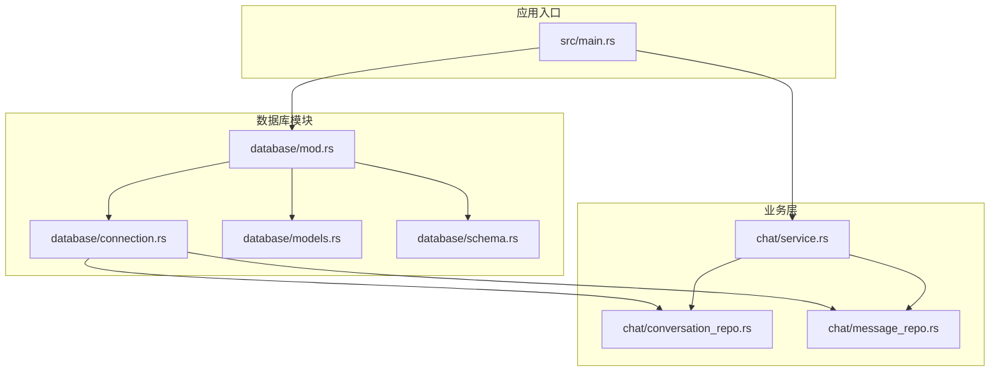
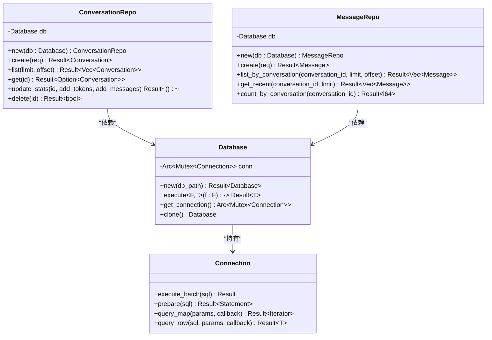
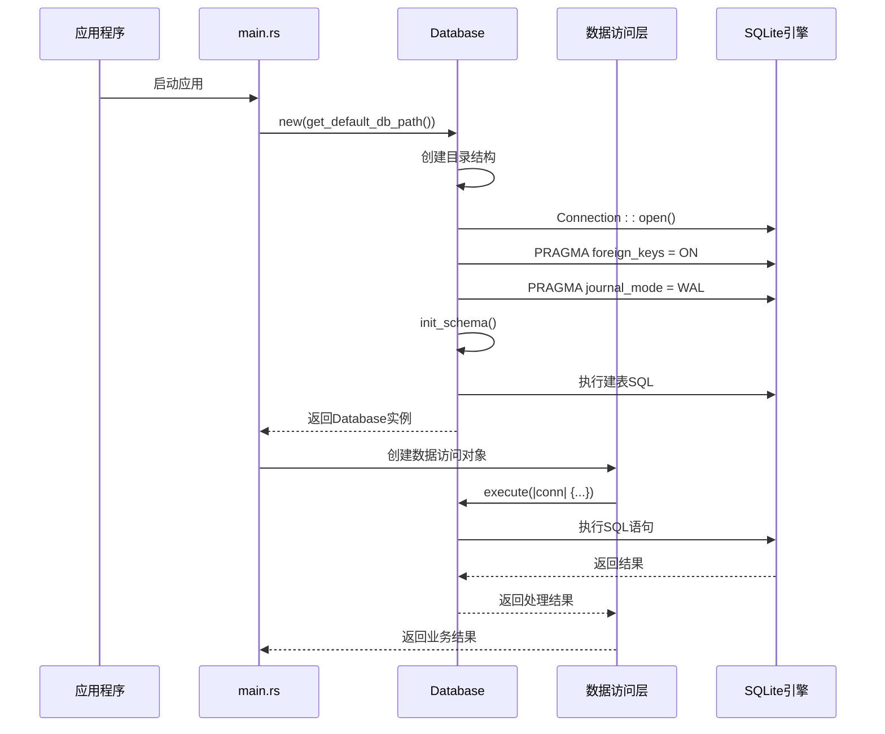
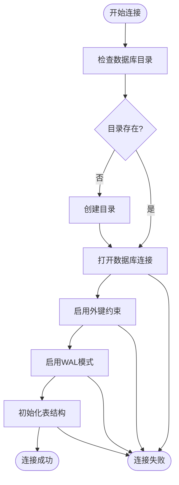
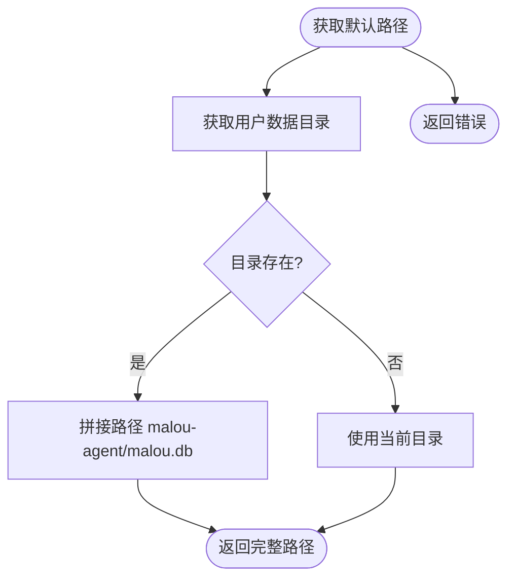
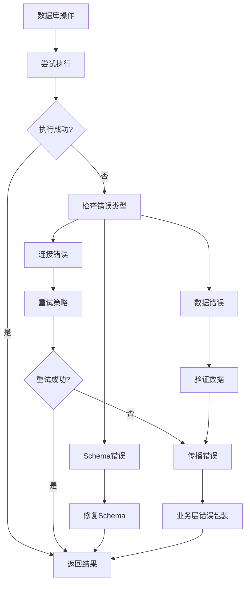
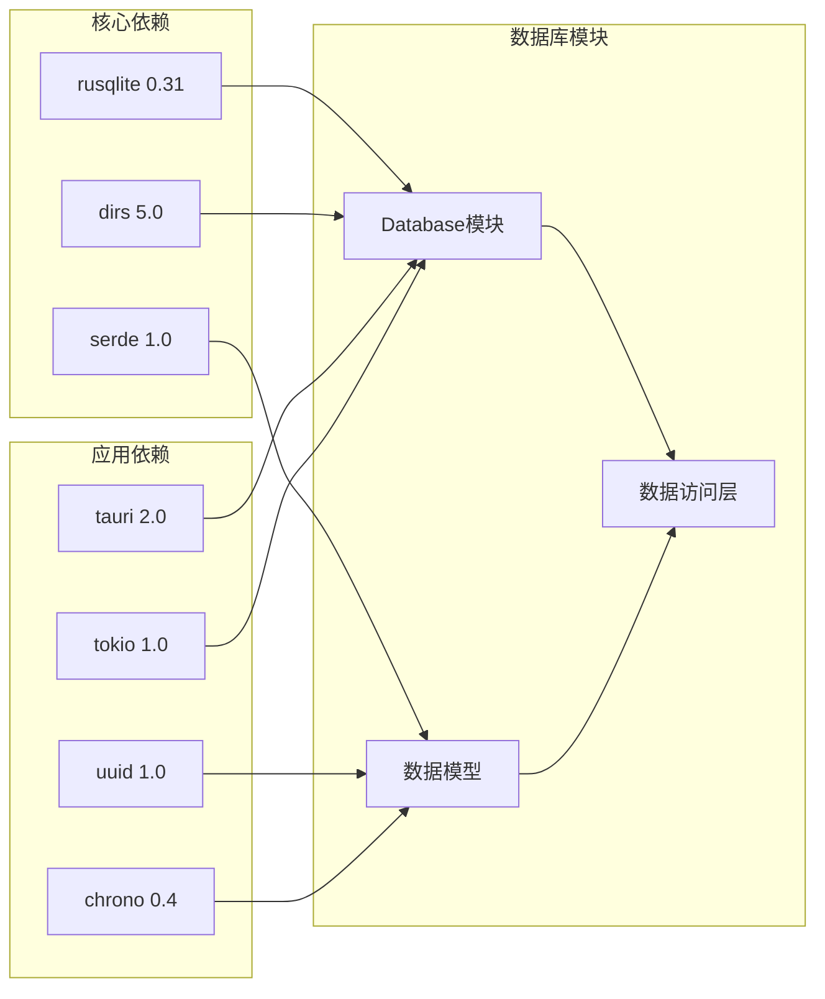
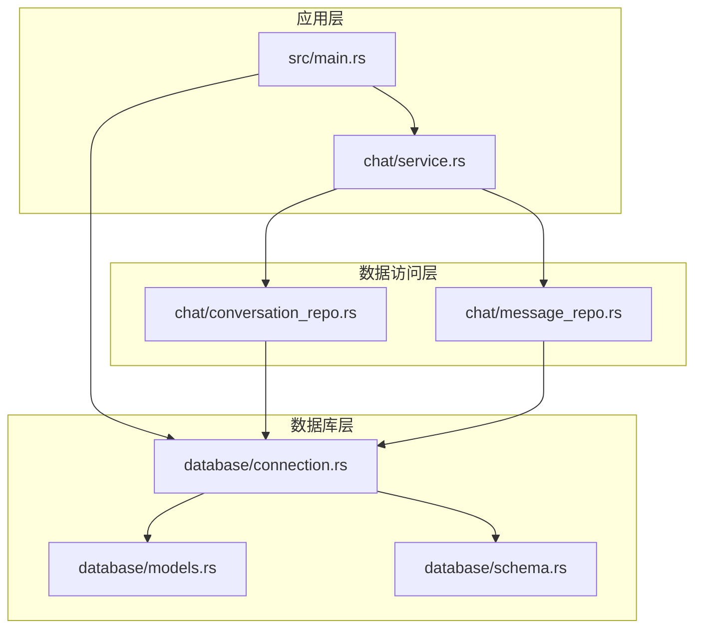
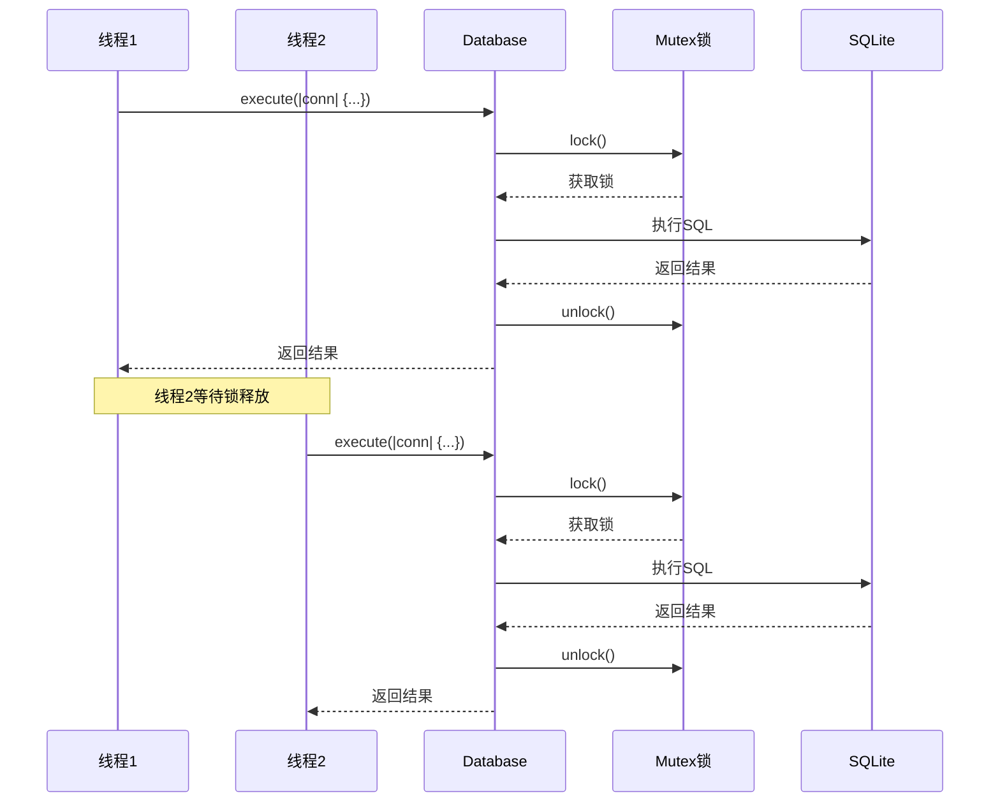

# 数据库连接管理

<cite>
**本文档引用的文件**
- [connection.rs](file://src-tauri/src/database/connection.rs)
- [mod.rs](file://src-tauri/src/database/mod.rs)
- [models.rs](file://src-tauri/src/database/models.rs)
- [schema.rs](file://src-tauri/src/database/schema.rs)
- [Cargo.toml](file://src-tauri/Cargo.toml)
- [conversation_repo.rs](file://src-tauri/src/chat/conversation_repo.rs)
- [message_repo.rs](file://src-tauri/src/chat/message_repo.rs)
- [service.rs](file://src-tauri/src/chat/service.rs)
- [main.rs](file://src-tauri/src/main.rs)
</cite>

## 目录
1. [简介](#简介)
2. [项目结构](#项目结构)
3. [核心组件](#核心组件)
4. [架构概览](#架构概览)
5. [详细组件分析](#详细组件分析)
6. [依赖关系分析](#依赖关系分析)
7. [性能考虑](#性能考虑)
8. [故障排除指南](#故障排除指南)
9. [结论](#结论)

## 简介

Malou Agent 的数据库连接管理基于 rusqlite crate 实现，采用 SQLite 作为本地存储解决方案。该系统提供了完整的数据库连接生命周期管理、连接池机制、错误处理和配置选项。本文档深入解析了数据库连接管理的设计与实现，包括连接建立、配置、管理以及故障恢复机制。

## 项目结构

Malou Agent 的数据库相关代码主要位于 `src-tauri/src/database/` 目录下，采用模块化设计：



**图表来源**
- [mod.rs](file://src-tauri/src/database/mod.rs#L1-L7)
- [connection.rs](file://src-tauri/src/database/connection.rs#L1-L89)
- [service.rs](file://src-tauri/src/chat/service.rs#L1-L224)

**章节来源**
- [mod.rs](file://src-tauri/src/database/mod.rs#L1-L7)
- [connection.rs](file://src-tauri/src/database/connection.rs#L1-L89)

## 核心组件

### Database 结构体设计

Database 结构体是整个数据库连接管理的核心，采用了共享所有权和互斥锁的组合设计：



**图表来源**
- [connection.rs](file://src-tauri/src/database/connection.rs#L8-L66)
- [conversation_repo.rs](file://src-tauri/src/chat/conversation_repo.rs#L5-L12)
- [message_repo.rs](file://src-tauri/src/chat/message_repo.rs#L5-L12)

### 数据模型体系

系统定义了完整的数据模型来支持对话记录管理：

| 数据模型 | 字段数量 | 主要用途 | 关系 |
|---------|---------|---------|------|
| Conversation | 7个字段 | 会话基本信息 | 一对多：消息 |
| Message | 9个字段 | 单条消息记录 | 外键：Conversation |
| TokenUsage | 7个字段 | Token使用统计 | 无外键 |
| ModelConfig | 8个字段 | 模型配置信息 | 无外键 |

**章节来源**
- [models.rs](file://src-tauri/src/database/models.rs#L1-L110)

## 架构概览

Malou Agent 采用了分层架构设计，数据库连接管理位于底层基础设施层：



**图表来源**
- [main.rs](file://src-tauri/src/main.rs#L242-L284)
- [connection.rs](file://src-tauri/src/database/connection.rs#L14-L36)
- [schema.rs](file://src-tauri/src/database/schema.rs#L65-L67)

## 详细组件分析

### Database 结构体实现

Database 结构体实现了线程安全的数据库连接管理：

#### 连接建立流程



**图表来源**
- [connection.rs](file://src-tauri/src/database/connection.rs#L14-L36)

#### 连接执行机制

Database 提供了两种执行模式：

1. **直接执行模式**：通过 `execute` 方法获取连接锁后执行
2. **连接克隆模式**：通过 `get_connection` 方法返回共享连接引用

**章节来源**
- [connection.rs](file://src-tauri/src/database/connection.rs#L12-L58)

### 默认数据库路径获取

系统提供了智能的默认数据库路径生成逻辑：



**图表来源**
- [connection.rs](file://src-tauri/src/database/connection.rs#L69-L73)

**章节来源**
- [connection.rs](file://src-tauri/src/database/connection.rs#L69-L73)

### 数据访问层设计

#### ConversationRepo 实现

ConversationRepo 负责会话数据的 CRUD 操作：

| 方法 | 功能 | SQL操作类型 | 性能特点 |
|------|------|------------|----------|
| create | 创建新会话 | INSERT | O(1) |
| list | 获取会话列表 | SELECT with ORDER BY | O(n log n) |
| get | 获取单个会话 | SELECT with WHERE | O(log n) |
| update_stats | 更新统计信息 | UPDATE | O(1) |
| delete | 删除会话 | DELETE | O(1) |

#### MessageRepo 实现

MessageRepo 负责消息数据的管理：

| 方法 | 功能 | SQL操作类型 | 性能特点 |
|------|------|------------|----------|
| create | 创建新消息 | INSERT | O(1) |
| list_by_conversation | 获取会话消息 | SELECT with ORDER BY | O(n log n) |
| get_recent | 获取最近消息 | SELECT with ORDER BY | O(k log n) |
| count_by_conversation | 统计消息数量 | SELECT COUNT | O(n) |
| get_total_tokens | 计算总Token数 | SELECT SUM | O(n) |

**章节来源**
- [conversation_repo.rs](file://src-tauri/src/chat/conversation_repo.rs#L14-L160)
- [message_repo.rs](file://src-tauri/src/chat/message_repo.rs#L14-L175)

### 连接生命周期管理

#### 连接创建策略

Database::new() 方法实现了完整的连接初始化流程：

1. **目录准备**：自动创建数据库文件所在目录
2. **连接建立**：使用 rusqlite::Connection::open() 建立连接
3. **配置设置**：
   - 外键约束：PRAGMA foreign_keys = ON
   - WAL模式：PRAGMA journal_mode = WAL
4. **Schema初始化**：执行建表SQL语句

#### 连接复用机制

通过 Arc<Mutex<Connection>> 实现连接的线程安全复用：

- **共享所有权**：多个数据访问对象共享同一个数据库连接
- **互斥保护**：确保同一时间只有一个线程可以访问数据库
- **自动清理**：当所有引用被释放时，连接自动关闭

#### 连接销毁策略

连接的生命周期完全由 Rust 的所有权系统管理：

- **自动销毁**：当 Database 实例超出作用域时自动释放
- **资源清理**：Arc 和 Mutex 自动处理内存管理
- **异常安全**：即使发生错误也能正确清理资源

**章节来源**
- [connection.rs](file://src-tauri/src/database/connection.rs#L8-L66)

### 错误处理机制

系统采用了分层的错误处理策略：



**图表来源**
- [connection.rs](file://src-tauri/src/database/connection.rs#L51-L57)
- [conversation_repo.rs](file://src-tauri/src/chat/conversation_repo.rs#L19-L26)

**章节来源**
- [connection.rs](file://src-tauri/src/database/connection.rs#L51-L57)
- [conversation_repo.rs](file://src-tauri/src/chat/conversation_repo.rs#L19-L26)

## 依赖关系分析

### 外部依赖

Malou Agent 的数据库系统主要依赖以下外部库：



**图表来源**
- [Cargo.toml](file://src-tauri/Cargo.toml#L12-L25)

### 内部依赖关系



**图表来源**
- [main.rs](file://src-tauri/src/main.rs#L1-L316)
- [service.rs](file://src-tauri/src/chat/service.rs#L1-L224)

**章节来源**
- [Cargo.toml](file://src-tauri/Cargo.toml#L12-L25)

## 性能考虑

### 连接池优化

虽然当前实现使用单连接模式，但通过 Arc<Mutex<Connection>> 实现了高效的连接复用：

- **零成本抽象**：Arc 提供共享所有权，无额外运行时开销
- **互斥优化**：Mutex 在单线程场景下开销最小
- **内存效率**：避免重复创建连接的内存分配

### 查询性能优化

系统通过索引和查询优化提升了性能：

| 表名 | 索引 | 查询优化 |
|------|------|----------|
| conversations | idx_conversations_updated | 按更新时间排序查询 |
| messages | idx_messages_conv | 会话消息查询 |
| token_usage | idx_token_model_date | 模型使用统计查询 |
| model_configs | idx_model_configs_type | 模型配置查询 |

### 并发性能



**图表来源**
- [connection.rs](file://src-tauri/src/database/connection.rs#L55-L56)

## 故障排除指南

### 常见问题及解决方案

#### 数据库连接失败

**症状**：应用启动时报错，提示数据库连接失败

**可能原因**：
1. 数据库文件权限不足
2. 父目录不存在且无法创建
3. SQLite 文件损坏

**解决方案**：
1. 检查应用程序对数据库目录的写入权限
2. 手动创建数据库目录并设置正确的权限
3. 删除损坏的数据库文件重新初始化

#### 外键约束错误

**症状**：删除会话时报错，提示外键约束冲突

**原因**：SQLite 外键约束启用导致级联删除失败

**解决方案**：
1. 确认外键约束已正确启用
2. 检查数据完整性
3. 使用级联删除确保相关数据一并清理

#### 查询性能问题

**症状**：大量数据查询时响应缓慢

**优化建议**：
1. 确保相关索引已创建
2. 优化查询条件
3. 考虑分页查询
4. 减少不必要的数据加载

**章节来源**
- [connection.rs](file://src-tauri/src/database/connection.rs#L22-L26)
- [schema.rs](file://src-tauri/src/database/schema.rs#L14-L61)

### 调试技巧

#### 启用详细日志

在 main.rs 中添加调试输出：

```rust
println!("数据库路径: {:?}", db_path);
println!("数据库初始化成功");
```

#### 测试数据库连接

使用内置的数据库测试命令：

```rust
#[tauri::command]
fn test_database(state: tauri::State<'_, AppState>) -> Result<String, String> {
    // 测试逻辑
}
```

**章节来源**
- [main.rs](file://src-tauri/src/main.rs#L220-L238)

## 结论

Malou Agent 的数据库连接管理系统展现了优秀的工程实践：

### 设计优势

1. **简洁高效**：通过 Arc<Mutex<Connection>> 实现了高效的单连接管理模式
2. **线程安全**：完整的并发控制确保多线程环境下的安全性
3. **配置灵活**：支持自定义数据库路径和多种 SQLite 配置选项
4. **错误处理**：分层的错误处理机制提供了良好的用户体验

### 技术亮点

1. **智能路径管理**：自动检测和创建数据库目录
2. **性能优化**：WAL 模式和索引优化提升查询性能
3. **数据完整性**：外键约束确保数据一致性
4. **可扩展性**：模块化设计便于功能扩展

### 改进建议

1. **连接池**：考虑实现真正的连接池以支持更高并发
2. **事务管理**：增加事务支持以提升批量操作性能
3. **监控指标**：添加数据库性能监控和统计信息
4. **备份机制**：实现数据库自动备份和恢复功能

该系统为 Malou Agent 提供了稳定可靠的本地数据存储基础，为后续功能扩展奠定了坚实的技术基础。