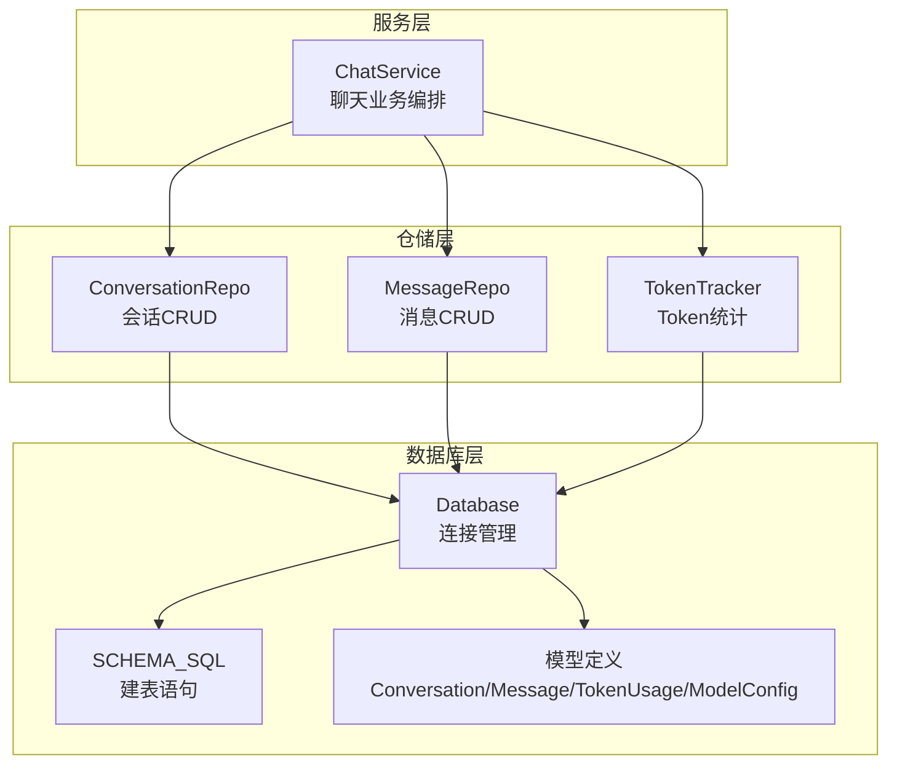
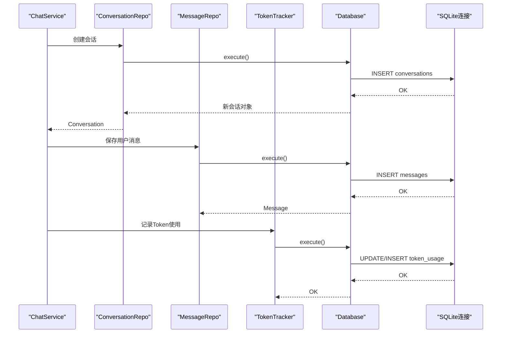
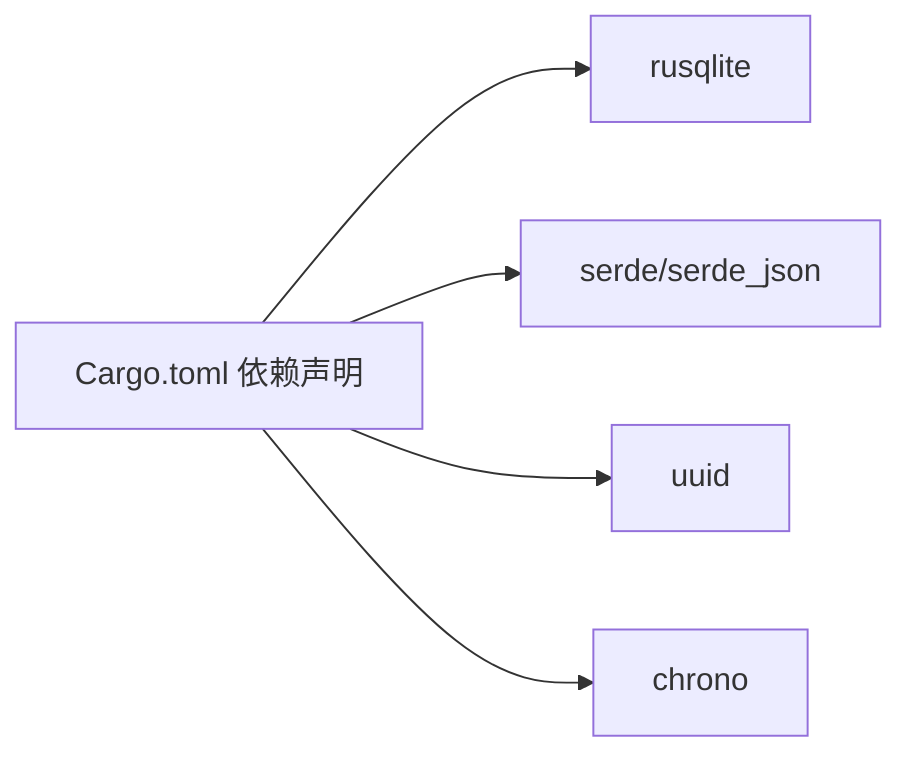

# 数据模型映射

<cite>
**本文引用的文件**
- [models.rs](file://src-tauri/src/database/models.rs)
- [schema.rs](file://src-tauri/src/database/schema.rs)
- [connection.rs](file://src-tauri/src/database/connection.rs)
- [conversation_repo.rs](file://src-tauri/src/chat/conversation_repo.rs)
- [message_repo.rs](file://src-tauri/src/chat/message_repo.rs)
- [tracker.rs](file://src-tauri/src/token_tracker/tracker.rs)
- [service.rs](file://src-tauri/src/chat/service.rs)
- [mod.rs](file://src-tauri/src/database/mod.rs)
- [Cargo.toml](file://src-tauri/Cargo.toml)
</cite>

## 目录
1. [简介](#简介)
2. [项目结构](#项目结构)
3. [核心组件](#核心组件)
4. [架构总览](#架构总览)
5. [详细组件分析](#详细组件分析)
6. [依赖分析](#依赖分析)
7. [性能考虑](#性能考虑)
8. [故障排查指南](#故障排查指南)
9. [结论](#结论)
10. [附录](#附录)

## 简介
本文件系统性梳理 Malou Agent 的数据模型映射与 ORM 实现，重点覆盖：
- Rust 结构体与 SQLite 表的字段映射与类型转换
- Serde 序列化/反序列化在模型中的使用
- 关联关系（一对一、一对多）的实现方式
- 查询构建器的使用（条件、排序、分页、聚合）
- 模型生命周期（创建、更新、删除、软删除策略）
- 批量操作与事务处理最佳实践
- 模型扩展与自定义序列化需求

## 项目结构
数据模型与数据库相关的核心位于 src-tauri/src/database 与 src-tauri/src/chat、src-tauri/src/token_tracker 等模块中。整体采用“模型 + 连接 + 仓储 + 服务”的分层设计，配合 SQLite 作为持久化存储，并通过 rusqlite 提供 ORM 能力。

图表来源
- [connection.rs](file://src-tauri/src/database/connection.rs#L1-L89)
- [schema.rs](file://src-tauri/src/database/schema.rs#L1-L68)
- [models.rs](file://src-tauri/src/database/models.rs#L1-L110)
- [conversation_repo.rs](file://src-tauri/src/chat/conversation_repo.rs#L1-L161)
- [message_repo.rs](file://src-tauri/src/chat/message_repo.rs#L1-L175)
- [tracker.rs](file://src-tauri/src/token_tracker/tracker.rs#L1-L195)
- [service.rs](file://src-tauri/src/chat/service.rs#L1-L224)

章节来源
- [mod.rs](file://src-tauri/src/database/mod.rs#L1-L7)
- [connection.rs](file://src-tauri/src/database/connection.rs#L1-L89)
- [schema.rs](file://src-tauri/src/database/schema.rs#L1-L68)

## 核心组件
- 数据库连接与初始化：负责打开 SQLite 文件、启用外键与 WAL、执行建表脚本。
- 模型定义：使用 Serde 注解进行序列化/反序列化，字段与表结构一一对应。
- 仓储层：封装 CRUD 与复杂查询，提供分页、排序、聚合等能力。
- 服务层：编排业务流程，协调仓储与外部 API 调用，记录 Token 使用。

章节来源
- [models.rs](file://src-tauri/src/database/models.rs#L1-L110)
- [connection.rs](file://src-tauri/src/database/connection.rs#L1-L89)
- [conversation_repo.rs](file://src-tauri/src/chat/conversation_repo.rs#L1-L161)
- [message_repo.rs](file://src-tauri/src/chat/message_repo.rs#L1-L175)
- [tracker.rs](file://src-tauri/src/token_tracker/tracker.rs#L1-L195)
- [service.rs](file://src-tauri/src/chat/service.rs#L1-L224)

## 架构总览
下图展示从服务层到仓储层再到数据库层的调用链路，以及模型与表之间的映射关系。

图表来源
- [service.rs](file://src-tauri/src/chat/service.rs#L95-L177)
- [conversation_repo.rs](file://src-tauri/src/chat/conversation_repo.rs#L15-L37)
- [message_repo.rs](file://src-tauri/src/chat/message_repo.rs#L15-L52)
- [tracker.rs](file://src-tauri/src/token_tracker/tracker.rs#L15-L48)
- [connection.rs](file://src-tauri/src/database/connection.rs#L50-L57)

## 详细组件分析

### 数据模型与表结构映射
- 会话表（conversations）
  - 字段映射：id、title、model_id、total_tokens、message_count、created_at、updated_at
  - 类型转换：字符串主键、整型计数、字符串时间戳（RFC3339）
  - 索引：按 updated_at 倒序
- 消息表（messages）
  - 字段映射：id、conversation_id、role、content、model_id、prompt_tokens、completion_tokens、total_tokens、created_at
  - 外键：conversation_id 引用 conversations(id)，删除时级联
  - 索引：按 conversation_id + created_at 排序
- Token 使用表（token_usage）
  - 字段映射：id（自增）、model_id、date、prompt_tokens、completion_tokens、total_tokens、request_count、created_at
  - 索引：按 model_id + date 倒序
- 模型配置表（model_configs）
  - 字段映射：id、name、type、config（JSON 字符串）、enabled、created_at、updated_at
  - 索引：按 type + enabled 排序

章节来源
- [schema.rs](file://src-tauri/src/database/schema.rs#L2-L62)
- [models.rs](file://src-tauri/src/database/models.rs#L4-L102)

### Serde 序列化/反序列化
- 所有模型均派生 Serde 的 Serialize/Deserialize，便于与前端或 API 层交互。
- 特殊字段如模型配置的 type 字段通过 serde rename 映射到 JSON 键名，避免关键字冲突。
- 时间戳统一使用字符串表示，便于跨语言传输与解析。

章节来源
- [models.rs](file://src-tauri/src/database/models.rs#L1-L110)
- [Cargo.toml](file://src-tauri/Cargo.toml#L12-L25)

### 关联关系实现
- 一对一/一对多：会话与消息之间为一对多关系，由 messages.conversation_id 外键约束保证。
- 级联删除：当删除会话时，消息通过外键约束自动级联删除。
- 聚合统计：会话表维护 total_tokens 与 message_count，消息表维护各条消息的 tokens，服务层在发送消息后更新会话统计。

章节来源
- [schema.rs](file://src-tauri/src/database/schema.rs#L18-L29)
- [conversation_repo.rs](file://src-tauri/src/chat/conversation_repo.rs#L102-L132)
- [message_repo.rs](file://src-tauri/src/chat/message_repo.rs#L164-L173)

### 查询构建器与分页/排序/聚合
- 分页与排序
  - 会话列表：按 updated_at 倒序，支持 limit/offset
  - 消息列表：按 created_at 正序，支持 limit/offset；最近 N 条消息按倒序取后反转
- 聚合查询
  - 会话消息总数：COUNT(*)
  - 会话总 Token：SUM(total_tokens)
  - Token 使用汇总：SUM(prompt_tokens)/SUM(completion_tokens)/SUM(total_tokens)/SUM(request_count)，支持日期范围过滤
  - 按模型/日期分组统计：GROUP BY model_id/date
- 条件查询
  - 会话/消息按 id 查询
  - Token 使用按 model_id + date 查询并更新或插入

章节来源
- [conversation_repo.rs](file://src-tauri/src/chat/conversation_repo.rs#L40-L63)
- [message_repo.rs](file://src-tauri/src/chat/message_repo.rs#L55-L113)
- [tracker.rs](file://src-tauri/src/token_tracker/tracker.rs#L51-L113)

### 模型生命周期管理
- 创建
  - 会话：生成 UUID 作为 id，设置 created_at/updated_at，初始统计为 0
  - 消息：生成 UUID 作为 id，计算 total_tokens = prompt_tokens + completion_tokens（可选）
- 更新
  - 会话标题、模型、统计（total_tokens、message_count）与时间戳
  - Token 使用：按 model_id + date 聚合更新
- 删除
  - 会话删除触发级联删除消息
  - 按会话删除消息
- 软删除策略
  - 当前未实现软删除字段；如需软删除，可在表中增加 deleted_at 或 deleted 标志位，并在查询中过滤

章节来源
- [conversation_repo.rs](file://src-tauri/src/chat/conversation_repo.rs#L15-L152)
- [message_repo.rs](file://src-tauri/src/chat/message_repo.rs#L15-L151)
- [tracker.rs](file://src-tauri/src/token_tracker/tracker.rs#L15-L48)

### 批量操作与事务处理最佳实践
- 批量插入/更新
  - 使用 prepare + execute_batch 或循环 execute，减少往返开销
  - 对于高并发场景，建议引入连接池（当前实现为单连接），可参考集成 r2d2_sqlite 的方案
- 事务
  - 当前仓储层未显式开启事务；对于强一致性的批量写入，建议在服务层或仓储层包裹事务，确保原子性
- 并发控制
  - 数据库连接通过 Arc<Mutex<Connection>> 包装，读写需注意锁粒度与持有时间

章节来源
- [connection.rs](file://src-tauri/src/database/connection.rs#L8-L66)
- [RUST_ONNX_VECTOR_DB_INTEGRATION_SCHEME.md](file://RUST_ONNX_VECTOR_DB_INTEGRATION_SCHEME.md#L380-L421)

### 模型扩展与自定义序列化
- 扩展字段
  - 可在模型结构体中新增字段，并同步修改建表语句与仓储映射
  - 对于 JSON 字段（如 config），保持字符串形式并通过 serde_json 解析
- 自定义序列化
  - 使用 serde rename、skip、with 等属性定制序列化行为
  - 对时间戳可统一使用 chrono 的 serde 特性，保证跨语言一致性

章节来源
- [models.rs](file://src-tauri/src/database/models.rs#L85-L102)
- [Cargo.toml](file://src-tauri/Cargo.toml#L12-L25)

## 依赖分析
- 外部依赖
  - rusqlite：SQLite 驱动与 ORM 能力
  - serde/serde_json：结构体序列化/反序列化
  - uuid：生成唯一标识
  - chrono：时间戳格式化与序列化
- 内部模块
  - database：模型、连接、建表
  - chat：会话/消息仓储与聊天服务
  - token_tracker：Token 使用统计

图表来源
- [Cargo.toml](file://src-tauri/Cargo.toml#L12-L25)

章节来源
- [Cargo.toml](file://src-tauri/Cargo.toml#L12-L25)

## 性能考虑
- WAL 模式：提升并发读写性能
- 外键约束：保证数据一致性，但可能影响写入性能，需权衡
- 索引策略：已针对高频查询建立索引（会话更新时间、消息会话+时间、Token 模型+日期、模型配置类型+启用状态）
- 分页与排序：使用 LIMIT/OFFSET，避免一次性加载大量数据
- 聚合查询：尽量在数据库侧完成 SUM/COUNT/GROUP BY，减少应用层计算

章节来源
- [connection.rs](file://src-tauri/src/database/connection.rs#L22-L26)
- [schema.rs](file://src-tauri/src/database/schema.rs#L14-L61)

## 故障排查指南
- 建表失败
  - 检查数据库路径权限与父目录是否存在
  - 确认 PRAGMA 外键与 WAL 设置成功
- 外键约束失败
  - 确保先创建会话再插入消息
  - 级联删除是否按预期工作
- 查询结果为空
  - 检查分页参数（limit/offset）与排序字段
  - 聚合查询的日期范围是否正确
- 序列化/反序列化异常
  - 确认时间戳格式与 serde_json 的兼容性
  - 检查 rename 字段与 JSON 键名匹配

章节来源
- [connection.rs](file://src-tauri/src/database/connection.rs#L14-L43)
- [schema.rs](file://src-tauri/src/database/schema.rs#L2-L62)
- [models.rs](file://src-tauri/src/database/models.rs#L1-L110)

## 结论
Malou Agent 的数据模型映射采用简洁清晰的分层架构：模型层通过 Serde 实现跨语言序列化，仓储层封装 CRUD 与查询逻辑，服务层编排业务流程并与外部 API 协作。SQLite 的建表语句与索引设计满足常见查询需求，未来可在连接池、事务与软删除等方面进一步增强。

## 附录

### 字段映射与类型对照表
- 会话（Conversation）
  - id: 字符串（UUID）
  - title: 字符串
  - model_id: 字符串（可空）
  - total_tokens: 整型
  - message_count: 整型
  - created_at/updated_at: 字符串（RFC3339）
- 消息（Message）
  - id: 字符串（UUID）
  - conversation_id: 字符串（UUID）
  - role: 字符串（"user"/"assistant"/"system"）
  - content: 字符串
  - model_id: 字符串（可空）
  - prompt_tokens/completion_tokens/total_tokens: 整型
  - created_at: 字符串（RFC3339）
- Token 使用（TokenUsage）
  - id: 整型（自增）
  - model_id: 字符串
  - date: 字符串（YYYY-MM-DD）
  - prompt_tokens/completion_tokens/total_tokens/request_count: 整型
  - created_at: 字符串（RFC3339）
- 模型配置（ModelConfig）
  - id: 字符串（UUID）
  - name: 字符串
  - type: 字符串（"local"/"remote"）
  - config: 字符串（JSON）
  - enabled: 布尔
  - created_at/updated_at: 字符串（RFC3339）

章节来源
- [models.rs](file://src-tauri/src/database/models.rs#L4-L102)
- [schema.rs](file://src-tauri/src/database/schema.rs#L2-L62)