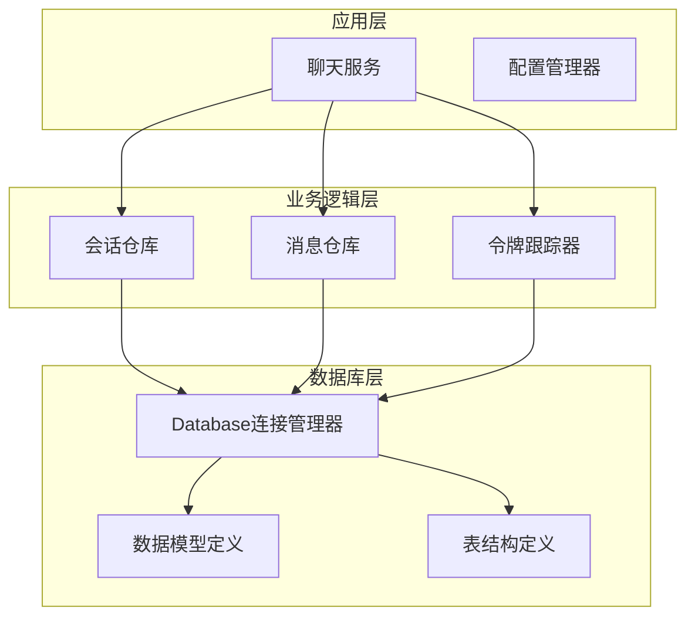
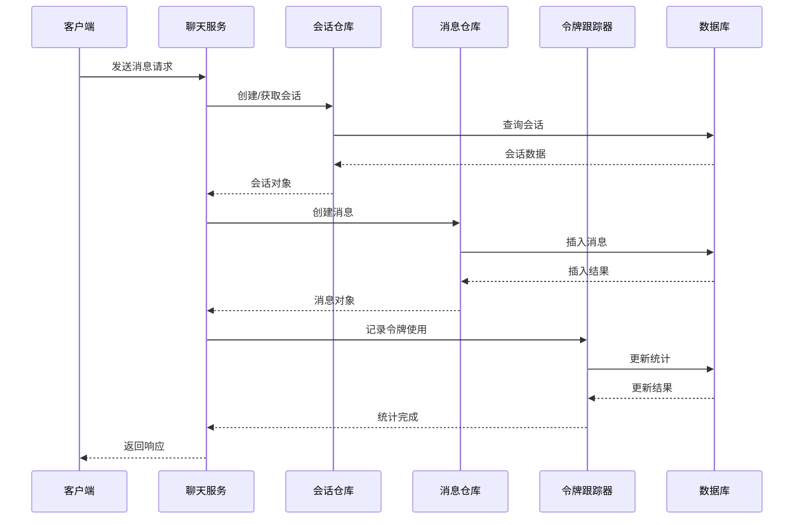
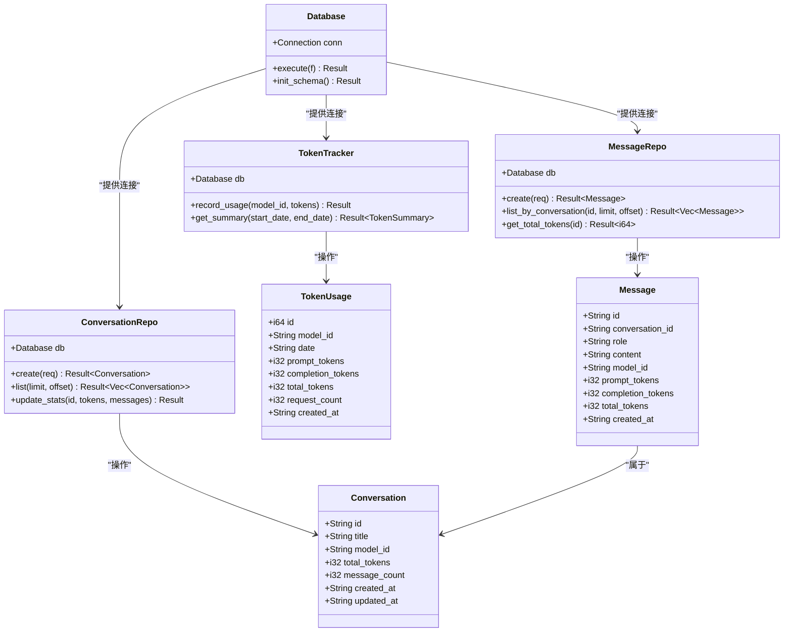
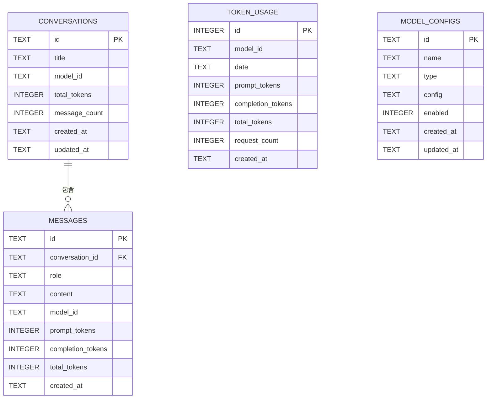

# 表结构设计

<cite>
**本文档引用的文件**
- [models.rs](file://src-tauri/src/database/models.rs)
- [schema.rs](file://src-tauri/src/database/schema.rs)
- [connection.rs](file://src-tauri/src/database/connection.rs)
- [conversation_repo.rs](file://src-tauri/src/chat/conversation_repo.rs)
- [message_repo.rs](file://src-tauri/src/chat/message_repo.rs)
- [tracker.rs](file://src-tauri/src/token_tracker/tracker.rs)
- [mod.rs](file://src-tauri/src/database/mod.rs)
</cite>

## 目录
1. [简介](#简介)
2. [项目结构](#项目结构)
3. [核心组件](#核心组件)
4. [架构概览](#架构概览)
5. [详细组件分析](#详细组件分析)
6. [依赖关系分析](#依赖关系分析)
7. [性能考虑](#性能考虑)
8. [故障排除指南](#故障排除指南)
9. [结论](#结论)

## 简介

Malou Agent是一个基于Tauri和Vue.js开发的智能聊天应用，采用SQLite作为本地数据库存储。本文档详细分析了应用的核心数据库表结构设计，包括会话表、消息表、统计表等关键组件，解释了设计理念、关系映射、约束条件和索引策略。

## 项目结构

应用采用模块化架构，数据库相关代码主要位于`src-tauri/src/database/`目录下，聊天功能相关的仓库层位于`src-tauri/src/chat/`目录，令牌跟踪功能位于`src-tauri/src/token_tracker/`目录。



**图表来源**
- [connection.rs](file://src-tauri/src/database/connection.rs#L8-L36)
- [models.rs](file://src-tauri/src/database/models.rs#L1-L110)
- [schema.rs](file://src-tauri/src/database/schema.rs#L1-L67)

**章节来源**
- [mod.rs](file://src-tauri/src/database/mod.rs#L1-L7)
- [connection.rs](file://src-tauri/src/database/connection.rs#L1-L89)

## 核心组件

### 数据库连接管理器

Database结构体负责管理SQLite连接，提供线程安全的连接池和自动初始化功能。

**章节来源**
- [connection.rs](file://src-tauri/src/database/connection.rs#L8-L58)

### 数据模型定义

应用定义了完整的数据模型，包括会话、消息、令牌使用统计和模型配置等核心实体。

**章节来源**
- [models.rs](file://src-tauri/src/database/models.rs#L1-L110)

## 架构概览

系统采用分层架构，从底层的SQLite存储到上层的业务逻辑，形成了清晰的数据流和控制流。



**图表来源**
- [conversation_repo.rs](file://src-tauri/src/chat/conversation_repo.rs#L14-L37)
- [message_repo.rs](file://src-tauri/src/chat/message_repo.rs#L14-L52)
- [tracker.rs](file://src-tauri/src/token_tracker/tracker.rs#L14-L48)

## 详细组件分析

### 会话表 (Conversations)

会话表是聊天功能的核心，存储用户创建的对话会话信息。

#### 字段定义与设计原则

| 字段名 | 数据类型 | 约束条件 | 设计说明 |
|--------|----------|----------|----------|
| id | TEXT | PRIMARY KEY, NOT NULL | UUID字符串，作为会话唯一标识符 |
| title | TEXT | NOT NULL | 会话标题，默认使用第一条消息内容 |
| model_id | TEXT | NULL | 关联使用的AI模型ID |
| total_tokens | INTEGER | DEFAULT 0 | 该会话累计使用的令牌总数 |
| message_count | INTEGER | DEFAULT 0 | 该会话消息数量统计 |
| created_at | TEXT | NOT NULL | ISO 8601格式的创建时间 |
| updated_at | TEXT | NOT NULL | ISO 8601格式的更新时间 |

#### 约束条件设计

- **主键约束**: `id`字段作为主键，确保每条会话的唯一性
- **默认值**: `total_tokens`和`message_count`默认为0，保证新会话的正确初始化
- **时间戳**: 使用ISO 8601字符串格式，便于跨平台兼容和排序

#### 索引策略

```sql
CREATE INDEX IF NOT EXISTS idx_conversations_updated ON conversations(updated_at DESC);
```

该索引专门用于支持按更新时间倒序排列的会话列表查询，优化了用户界面的性能表现。

**章节来源**
- [schema.rs](file://src-tauri/src/database/schema.rs#L4-L12)
- [conversation_repo.rs](file://src-tauri/src/chat/conversation_repo.rs#L14-L37)

### 消息表 (Messages)

消息表存储具体的聊天消息内容，与会话表形成一对多的关系。

#### 字段定义与设计原则

| 字段名 | 数据类型 | 约束条件 | 设计说明 |
|--------|----------|----------|----------|
| id | TEXT | PRIMARY KEY, NOT NULL | UUID字符串，消息唯一标识符 |
| conversation_id | TEXT | NOT NULL, FOREIGN KEY | 外键关联到会话表 |
| role | TEXT | NOT NULL | 消息角色："user"、"assistant"或"system" |
| content | TEXT | NOT NULL | 消息内容，支持长文本存储 |
| model_id | TEXT | NULL | 关联使用的AI模型ID |
| prompt_tokens | INTEGER | DEFAULT 0 | 提示词使用的令牌数 |
| completion_tokens | INTEGER | DEFAULT 0 | 生成内容使用的令牌数 |
| total_tokens | INTEGER | DEFAULT 0 | 该消息总令牌数 |
| created_at | TEXT | NOT NULL | ISO 8601格式的时间戳 |

#### 关系映射

消息表通过`conversation_id`字段与会话表建立外键关系，实现了以下约束：
- **引用完整性**: 确保消息必须属于存在的会话
- **级联删除**: 当会话被删除时，相关消息自动删除

#### 索引策略

```sql
CREATE INDEX IF NOT EXISTS idx_messages_conv ON messages(conversation_id, created_at ASC);
```

该复合索引优化了按会话查询消息列表的性能，支持：
- 按会话ID快速定位消息
- 按时间顺序返回消息
- 支持分页查询

**章节来源**
- [schema.rs](file://src-tauri/src/database/schema.rs#L17-L29)
- [message_repo.rs](file://src-tauri/src/chat/message_repo.rs#L14-L52)

### 令牌使用统计表 (Token Usage)

令牌统计表用于跟踪AI模型的使用情况，支持统计分析和成本控制。

#### 字段定义与设计原则

| 字段名 | 数据类型 | 约束条件 | 设计说明 |
|--------|----------|----------|----------|
| id | INTEGER | PRIMARY KEY, AUTOINCREMENT | 自增主键，用于内部标识 |
| model_id | TEXT | NOT NULL | AI模型ID |
| date | TEXT | NOT NULL | 统计日期（YYYY-MM-DD格式） |
| prompt_tokens | INTEGER | DEFAULT 0 | 提示词令牌总数 |
| completion_tokens | INTEGER | DEFAULT 0 | 生成内容令牌总数 |
| total_tokens | INTEGER | DEFAULT 0 | 总令牌数 |
| request_count | INTEGER | DEFAULT 0 | 请求次数统计 |
| created_at | TEXT | NOT NULL | 记录创建时间 |

#### 统计聚合设计

令牌统计表采用按模型和日期分组的方式，支持多种统计查询：
- **按模型统计**: 分析不同模型的使用情况
- **按日期统计**: 追踪使用趋势
- **时间范围查询**: 支持灵活的统计区间

#### 索引策略

```sql
CREATE INDEX IF NOT EXISTS idx_token_model_date ON token_usage(model_id, date DESC);
```

该复合索引优化了按模型和日期查询的性能，支持：
- 快速按模型筛选
- 按日期倒序排列
- 支持时间范围查询

**章节来源**
- [schema.rs](file://src-tauri/src/database/schema.rs#L34-L44)
- [tracker.rs](file://src-tauri/src/token_tracker/tracker.rs#L14-L48)

### 模型配置表 (Model Configs)

模型配置表存储AI模型的配置信息，支持本地和远程模型的统一管理。

#### 字段定义与设计原则

| 字段名 | 数据类型 | 约束条件 | 设计说明 |
|--------|----------|----------|----------|
| id | TEXT | PRIMARY KEY, NOT NULL | 模型唯一标识符 |
| name | TEXT | NOT NULL | 模型显示名称 |
| type | TEXT | NOT NULL | 模型类型："local"或"remote" |
| config | TEXT | NOT NULL | JSON格式的配置内容 |
| enabled | INTEGER | DEFAULT 1 | 是否启用（1/0布尔值） |
| created_at | TEXT | NOT NULL | 创建时间 |
| updated_at | TEXT | NOT NULL | 更新时间 |

#### 索引策略

```sql
CREATE INDEX IF NOT EXISTS idx_model_configs_type ON model_configs(type, enabled);
```

该索引优化了按模型类型和启用状态查询的性能，支持：
- 快速筛选可用模型
- 支持类型分组查询

**章节来源**
- [schema.rs](file://src-tauri/src/database/schema.rs#L49-L58)

## 依赖关系分析

### 数据模型依赖



**图表来源**
- [models.rs](file://src-tauri/src/database/models.rs#L4-L109)
- [connection.rs](file://src-tauri/src/database/connection.rs#L8-L58)
- [conversation_repo.rs](file://src-tauri/src/chat/conversation_repo.rs#L5-L12)
- [message_repo.rs](file://src-tauri/src/chat/message_repo.rs#L5-L12)
- [tracker.rs](file://src-tauri/src/token_tracker/tracker.rs#L5-L12)

### ER关系模型



**图表来源**
- [schema.rs](file://src-tauri/src/database/schema.rs#L4-L58)

**章节来源**
- [models.rs](file://src-tauri/src/database/models.rs#L1-L110)
- [schema.rs](file://src-tauri/src/database/schema.rs#L1-L67)

## 性能考虑

### 索引优化策略

1. **会话表索引**: `idx_conversations_updated`按更新时间倒序排列，优化了会话列表的显示性能
2. **消息表索引**: `idx_messages_conv`复合索引同时支持会话过滤和时间排序
3. **统计表索引**: `idx_token_model_date`优化了按模型和日期的统计查询

### 并发性能

数据库连接管理器启用了WAL模式和外键约束，提供了：
- **WAL模式**: 提高读写并发性能
- **外键约束**: 确保数据一致性
- **线程安全**: 使用Arc<Mutex<Connection>>确保多线程安全

### 内存管理

- **延迟加载**: 消息内容按需查询，避免不必要的内存占用
- **分页查询**: 支持大数据集的分页处理
- **连接池**: 单一连接的复用机制

## 故障排除指南

### 常见问题及解决方案

1. **数据库连接失败**
   - 检查数据库文件路径权限
   - 确认SQLite扩展已正确安装
   - 验证数据库文件未被其他进程锁定

2. **外键约束错误**
   - 确保先创建会话再创建消息
   - 检查会话ID的有效性
   - 验证数据类型匹配

3. **性能问题**
   - 检查索引是否正确创建
   - 优化查询语句的WHERE条件
   - 考虑增加适当的LIMIT子句

### 调试工具

- **SQL查询分析**: 使用EXPLAIN QUERY PLAN分析查询执行计划
- **性能监控**: 监控数据库连接数和查询响应时间
- **日志记录**: 记录关键数据库操作的执行时间和参数

**章节来源**
- [connection.rs](file://src-tauri/src/database/connection.rs#L22-L26)
- [conversation_repo.rs](file://src-tauri/src/chat/conversation_repo.rs#L146-L152)

## 结论

Malou Agent的数据库表结构设计体现了以下特点：

1. **简洁高效**: 采用标准的关系型数据库设计，满足聊天应用的核心需求
2. **性能优化**: 合理的索引策略和查询优化，确保良好的用户体验
3. **数据完整性**: 通过外键约束和事务处理保证数据一致性
4. **可扩展性**: 模块化的架构设计便于功能扩展和维护

该设计为聊天应用提供了可靠的数据存储基础，支持会话管理、消息存储、使用统计等功能，为后续的功能扩展奠定了坚实的基础。