# ChatService核心实现

<cite>
**本文档引用的文件**
- [service.rs](file://src-tauri/src/chat/service.rs)
- [mod.rs](file://src-tauri/src/chat/mod.rs)
- [conversation_repo.rs](file://src-tauri/src/chat/conversation_repo.rs)
- [message_repo.rs](file://src-tauri/src/chat/message_repo.rs)
- [openai_client.rs](file://src-tauri/src/chat/openai_client.rs)
- [models.rs](file://src-tauri/src/database/models.rs)
- [tracker.rs](file://src-tauri/src/token_tracker/tracker.rs)
- [main.rs](file://src-tauri/src/main.rs)
- [ChatView.vue](file://src/components/business/ChatView.vue)
- [tauri-api.ts](file://src/api/tauri-api.ts)
</cite>

## 目录
1. [简介](#简介)
2. [项目结构](#项目结构)
3. [核心组件](#核心组件)
4. [架构概览](#架构概览)
5. [详细组件分析](#详细组件分析)
6. [依赖关系分析](#依赖关系分析)
7. [性能考虑](#性能考虑)
8. [故障排除指南](#故障排除指南)
9. [结论](#结论)
10. [附录](#附录)

## 简介

ChatService是Malou Agent桌面AI助手的核心聊天服务组件，负责管理用户的对话会话、消息存储、与OpenAI API的交互以及Token使用统计。该服务采用Rust语言实现，结合了SQLite数据库持久化、异步编程模型和类型安全的设计原则。

本服务提供了完整的聊天功能，包括会话管理、消息处理、AI对话集成和使用统计等功能，为前端Vue应用提供了稳定可靠的后端服务支持。

## 项目结构

Malou Agent采用前后端分离的架构设计，核心聊天服务位于Tauri后端的Rust代码中，前端使用Vue.js构建用户界面。

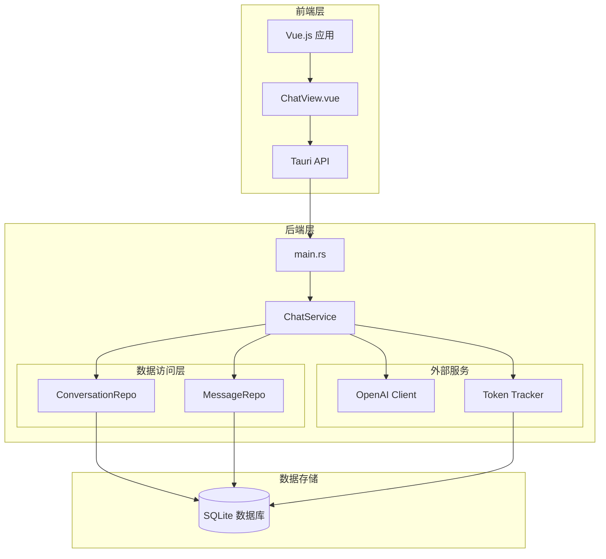

**图表来源**
- [main.rs](file://src-tauri/src/main.rs#L242-L315)
- [service.rs](file://src-tauri/src/chat/service.rs#L1-L224)

**章节来源**
- [main.rs](file://src-tauri/src/main.rs#L1-L316)
- [mod.rs](file://src-tauri/src/chat/mod.rs#L1-L10)

## 核心组件

ChatService作为核心服务类，包含了以下关键组件：

### 主要数据结构

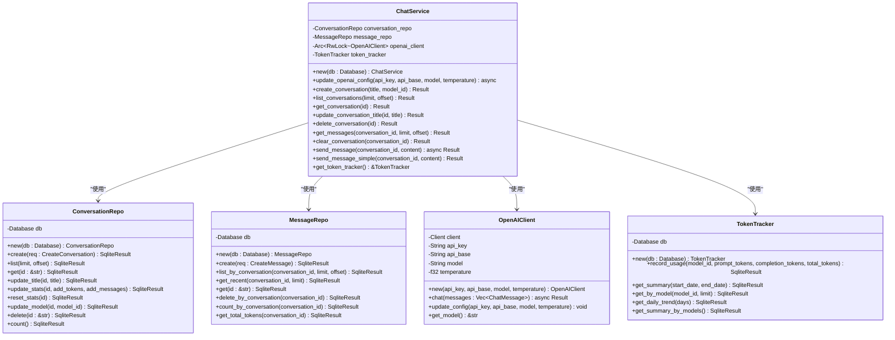

**图表来源**
- [service.rs](file://src-tauri/src/chat/service.rs#L13-L224)
- [conversation_repo.rs](file://src-tauri/src/chat/conversation_repo.rs#L5-L161)
- [message_repo.rs](file://src-tauri/src/chat/message_repo.rs#L5-L175)
- [openai_client.rs](file://src-tauri/src/chat/openai_client.rs#L5-L141)
- [tracker.rs](file://src-tauri/src/token_tracker/tracker.rs#L5-L195)

### 关键数据模型

系统使用了多个核心数据模型来表示聊天相关的实体：

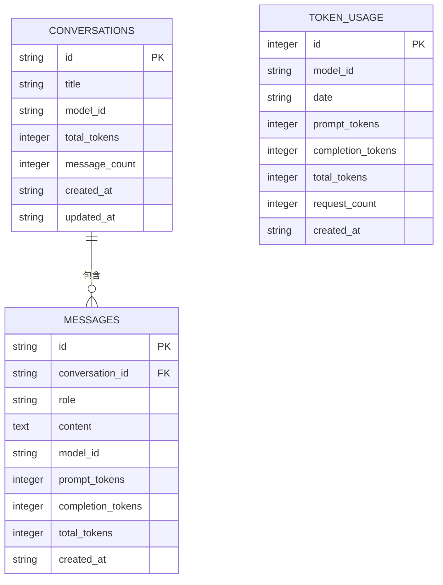

**图表来源**
- [models.rs](file://src-tauri/src/database/models.rs#L3-L109)

**章节来源**
- [service.rs](file://src-tauri/src/chat/service.rs#L1-L224)
- [models.rs](file://src-tauri/src/database/models.rs#L1-L110)

## 架构概览

ChatService采用了分层架构设计，将业务逻辑、数据访问和外部服务进行清晰分离：

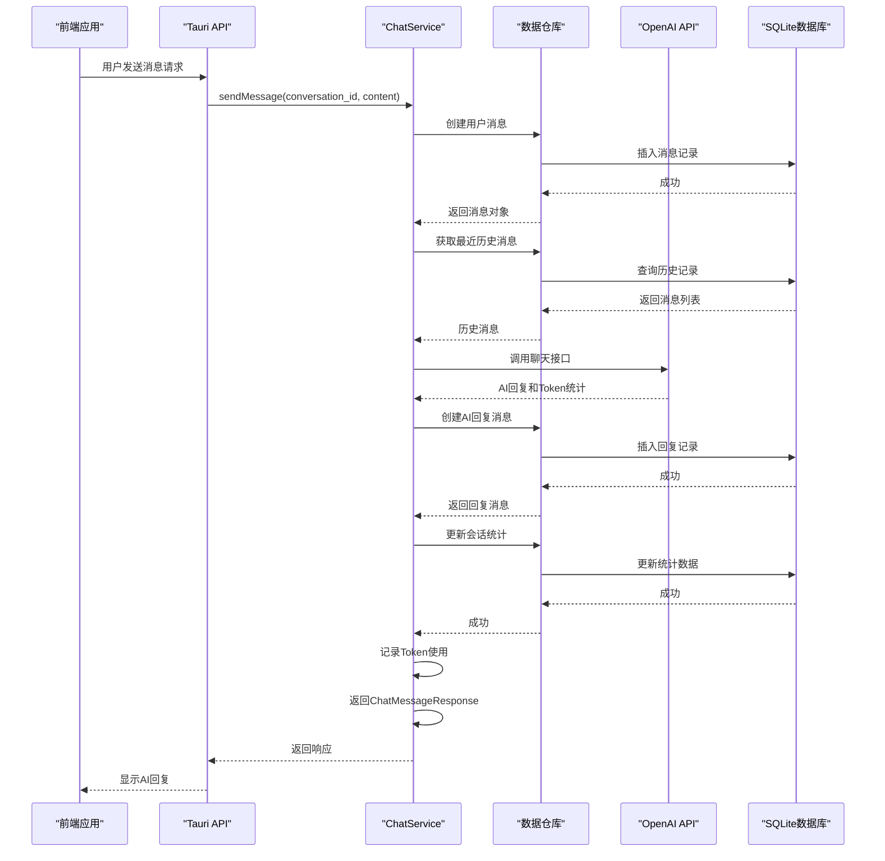

**图表来源**
- [service.rs](file://src-tauri/src/chat/service.rs#L95-L177)
- [main.rs](file://src-tauri/src/main.rs#L141-L161)

## 详细组件分析

### ChatService构造函数与初始化

ChatService的构造函数负责初始化所有依赖组件：

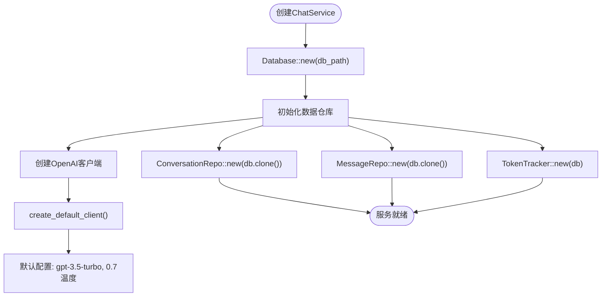

**图表来源**
- [service.rs](file://src-tauri/src/chat/service.rs#L22-L29)
- [openai_client.rs](file://src-tauri/src/chat/openai_client.rs#L133-L140)

### 会话管理功能

ChatService提供了完整的会话管理能力：

#### 创建会话
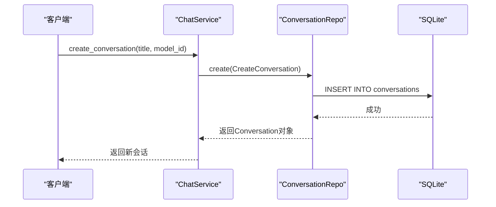

**图表来源**
- [service.rs](file://src-tauri/src/chat/service.rs#L38-L42)
- [conversation_repo.rs](file://src-tauri/src/chat/conversation_repo.rs#L15-L37)

#### 会话列表管理
- `list_conversations(limit, offset)`: 获取会话列表，按更新时间倒序排列
- `get_conversation(id)`: 获取指定会话的详细信息
- `update_conversation_title(id, title)`: 更新会话标题
- `delete_conversation(id)`: 删除会话（级联删除关联消息）

#### 会话统计管理
- `update_stats(id, add_tokens, add_messages)`: 更新会话的Token使用统计和消息数量
- `reset_stats(id)`: 重置会话统计为初始状态

**章节来源**
- [service.rs](file://src-tauri/src/chat/service.rs#L38-L70)
- [conversation_repo.rs](file://src-tauri/src/chat/conversation_repo.rs#L102-L132)

### 消息管理功能

消息管理功能提供了完整的消息生命周期管理：

#### 消息存储与检索
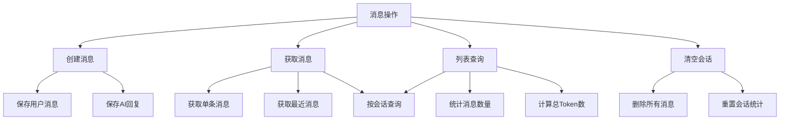

**图表来源**
- [message_repo.rs](file://src-tauri/src/chat/message_repo.rs#L14-L175)

#### 消息清理功能
- `clear_conversation(conversation_id)`: 清空指定会话的所有消息，并重置会话统计
- `delete_by_conversation(conversation_id)`: 删除会话关联的所有消息记录

**章节来源**
- [service.rs](file://src-tauri/src/chat/service.rs#L79-L92)
- [message_repo.rs](file://src-tauri/src/chat/message_repo.rs#L142-L151)

### 异步消息发送流程

ChatService实现了完整的异步消息发送流程，支持与OpenAI API的实时交互：

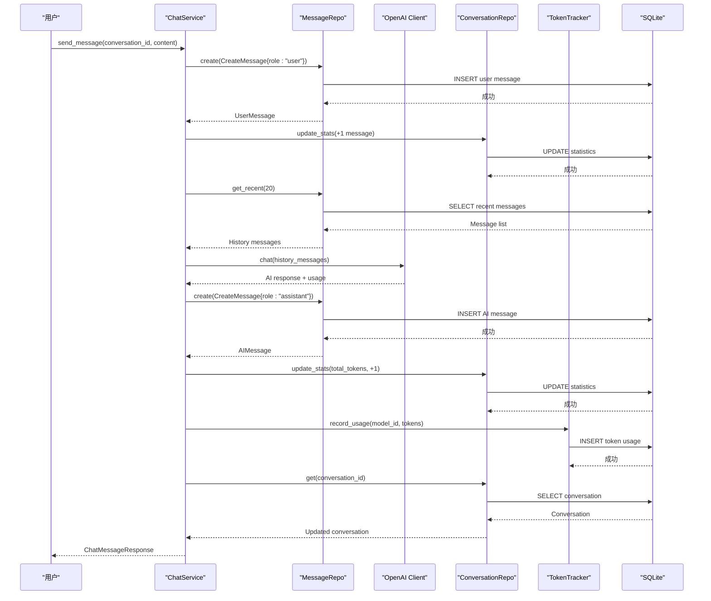

**图表来源**
- [service.rs](file://src-tauri/src/chat/service.rs#L95-L177)

#### 简单消息发送模式
对于开发和测试场景，ChatService提供了`send_message_simple`方法：
- 直接保存用户消息
- 更新会话统计
- 创建模拟的AI回复消息
- 返回模拟的回复结果

**章节来源**
- [service.rs](file://src-tauri/src/chat/service.rs#L94-L217)

### OpenAI客户端集成

ChatService集成了OpenAI API客户端，支持异步聊天请求：

#### 配置管理
- 支持动态更新API密钥、基础URL、模型名称和温度参数
- 使用Arc和RwLock确保线程安全的配置更新
- 默认配置：OpenAI API基础URL、GPT-3.5-Turbo模型、0.7温度

#### 请求处理
- 构建标准的OpenAI聊天请求格式
- 发送HTTP请求并处理响应
- 解析API响应，提取AI回复内容和Token使用统计
- 错误处理：网络错误、API错误、解析错误

**章节来源**
- [openai_client.rs](file://src-tauri/src/chat/openai_client.rs#L62-L130)

### Token使用统计

系统实现了完整的Token使用追踪功能：

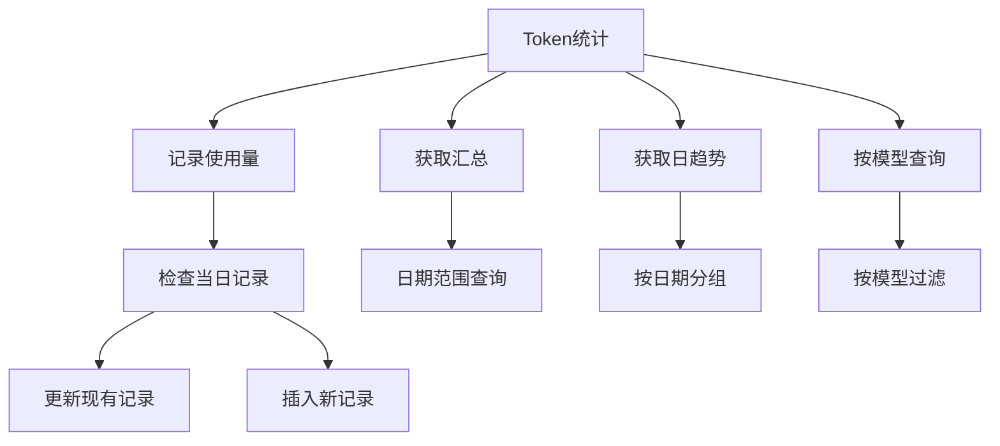

**图表来源**
- [tracker.rs](file://src-tauri/src/token_tracker/tracker.rs#L14-L195)

**章节来源**
- [tracker.rs](file://src-tauri/src/token_tracker/tracker.rs#L1-L195)

## 依赖关系分析

ChatService的依赖关系体现了清晰的分层架构：

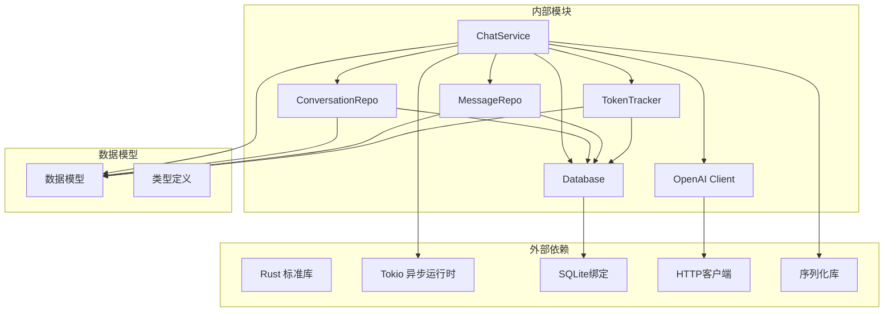

**图表来源**
- [service.rs](file://src-tauri/src/chat/service.rs#L1-L18)
- [main.rs](file://src-tauri/src/main.rs#L1-L12)

### 生命周期管理

ChatService遵循Rust的所有权模型，通过智能指针管理资源生命周期：

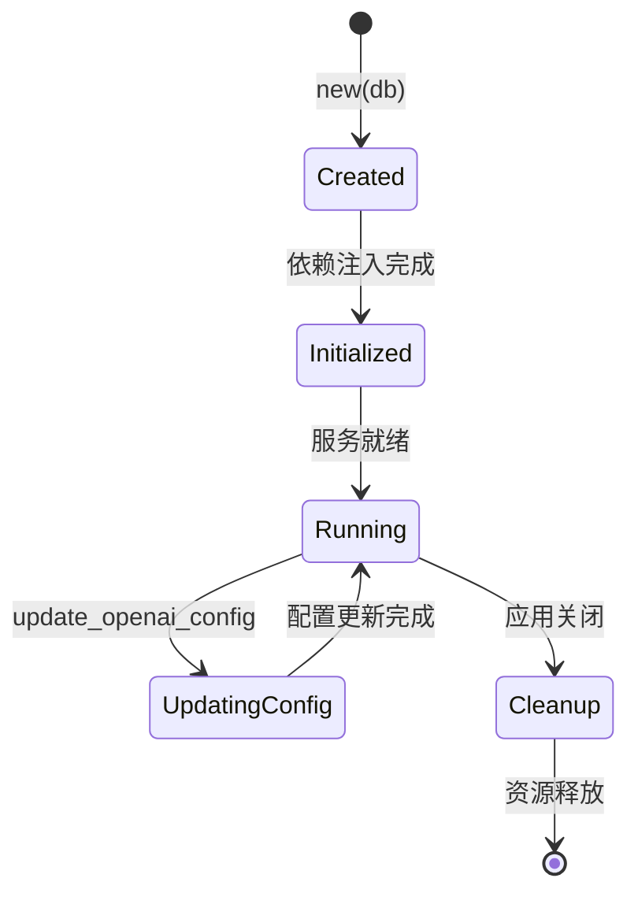

**图表来源**
- [service.rs](file://src-tauri/src/chat/service.rs#L22-L29)

**章节来源**
- [service.rs](file://src-tauri/src/chat/service.rs#L1-L224)
- [main.rs](file://src-tauri/src/main.rs#L242-L315)

## 性能考虑

### 异步编程模型
- 使用Tokio异步运行时处理并发操作
- 通过RwLock实现读写分离，提高并发性能
- 异步I/O操作避免阻塞主线程

### 数据库优化
- SQLite WAL模式提升并发性能
- 外键约束确保数据一致性
- 合理的索引设计优化查询性能

### 内存管理
- Arc智能指针共享数据库连接
- 适当的缓存策略减少重复查询
- 及时释放不再使用的资源

## 故障排除指南

### 常见错误类型

#### 数据库相关错误
- 连接失败：检查数据库路径和权限
- SQL执行错误：验证表结构和数据完整性
- 并发冲突：检查事务处理和锁机制

#### OpenAI API错误
- 认证失败：验证API密钥和基础URL
- 请求超时：检查网络连接和API限制
- 解析错误：验证响应格式和数据结构

#### 会话管理错误
- 会话不存在：确认会话ID的有效性
- 权限问题：检查用户访问权限
- 数据不一致：验证会话和消息的关联关系

### 调试建议

1. **启用详细日志**：在开发环境中增加日志输出
2. **单元测试**：为关键功能编写测试用例
3. **监控指标**：跟踪API调用成功率和响应时间
4. **错误恢复**：实现自动重试和降级策略

**章节来源**
- [service.rs](file://src-tauri/src/chat/service.rs#L32-L35)
- [openai_client.rs](file://src-tauri/src/chat/openai_client.rs#L94-L98)

## 结论

ChatService作为Malou Agent的核心组件，展现了现代Rust应用的最佳实践：

### 设计优势
- **类型安全**：完整的类型系统确保编译时错误检测
- **内存安全**：所有权模型防止内存泄漏和数据竞争
- **并发友好**：异步编程模型支持高并发场景
- **模块化设计**：清晰的职责分离便于维护和扩展

### 技术特色
- **异步架构**：充分利用Tokio运行时的性能优势
- **数据持久化**：SQLite提供轻量级可靠的数据存储
- **API集成**：OpenAI客户端封装简化外部服务调用
- **统计追踪**：完整的Token使用统计支持成本控制

### 扩展建议
1. **配置管理**：实现动态配置热更新
2. **缓存策略**：添加消息和会话缓存提升性能
3. **监控告警**：集成APM工具进行性能监控
4. **测试覆盖**：完善单元测试和集成测试

ChatService为桌面AI助手应用提供了坚实的技术基础，其设计原则和实现模式可以作为其他类似项目的参考模板。

## 附录

### API使用示例

#### 基本会话管理
```typescript
// 创建新会话
const conversation = await createConversation("我的第一个会话");

// 获取会话列表
const conversations = await listConversations(50, 0);

// 更新会话标题
await updateConversationTitle(conversation.id, "更新后的标题");

// 删除会话
const deleted = await deleteConversation(conversation.id);
```

#### 消息管理
```typescript
// 发送消息
const response = await sendMessage({
  conversation_id: conversation.id,
  content: "你好，AI助手"
});

// 获取会话消息
const messages = await getConversationMessages(conversation.id, 100, 0);

// 清空会话消息
const deletedCount = await clearConversationMessages(conversation.id);
```

#### Token统计
```typescript
// 获取Token使用汇总
const summary = await getTokenUsageSummary();

// 获取每日使用趋势
const trend = await getTokenUsageTrend(30);
```

**章节来源**
- [tauri-api.ts](file://src/api/tauri-api.ts#L68-L176)
- [ChatView.vue](file://src/components/business/ChatView.vue#L162-L222)