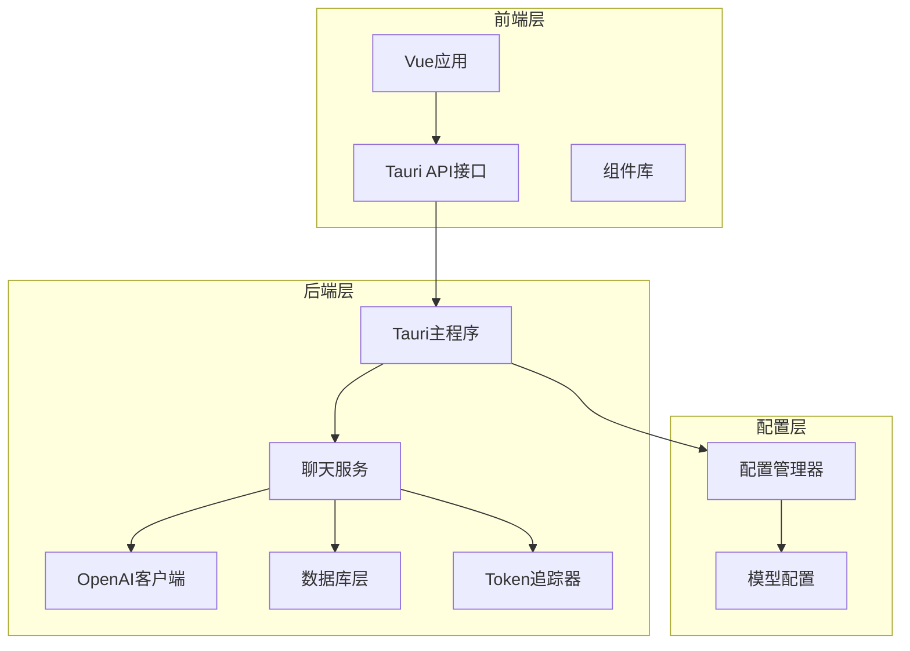
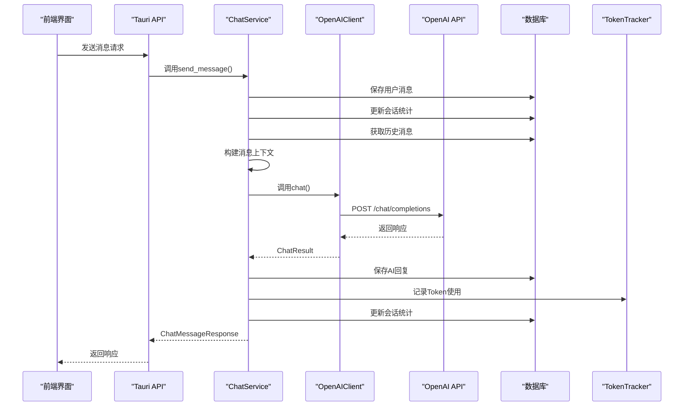
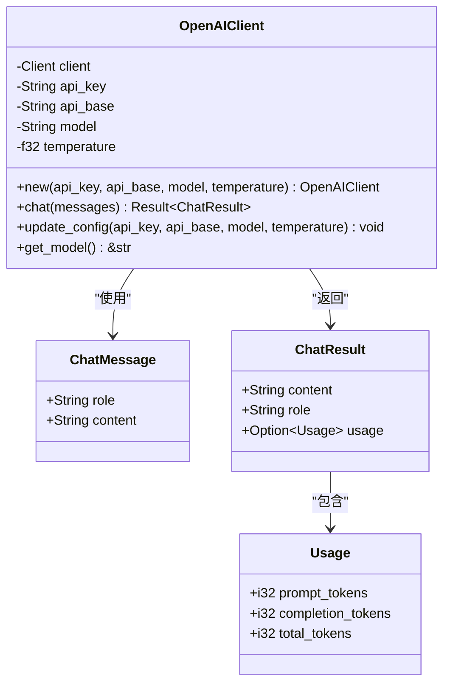
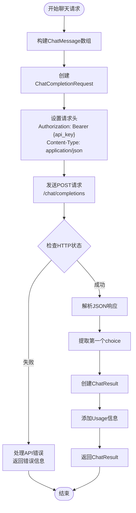
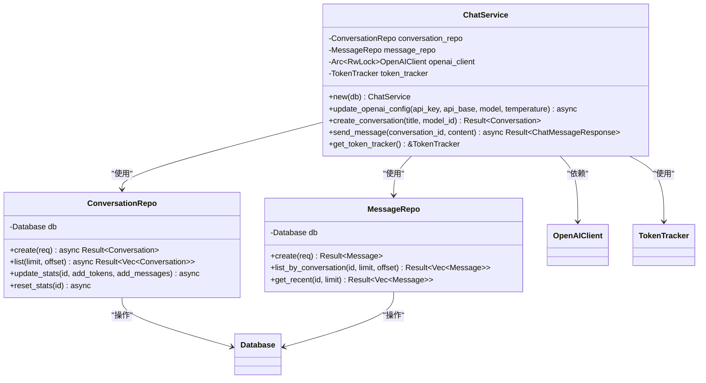
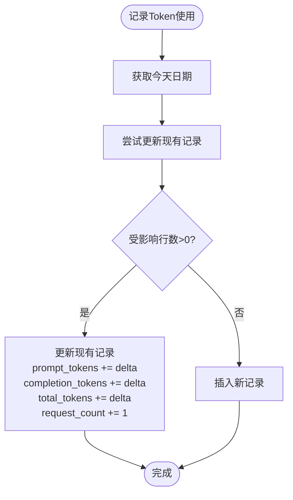
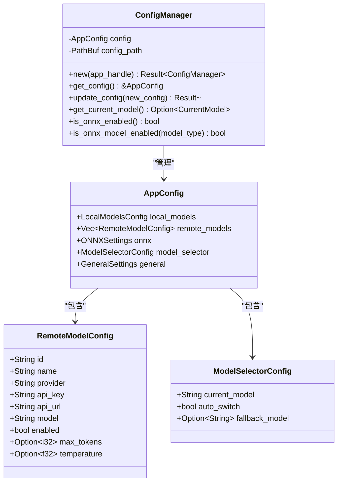
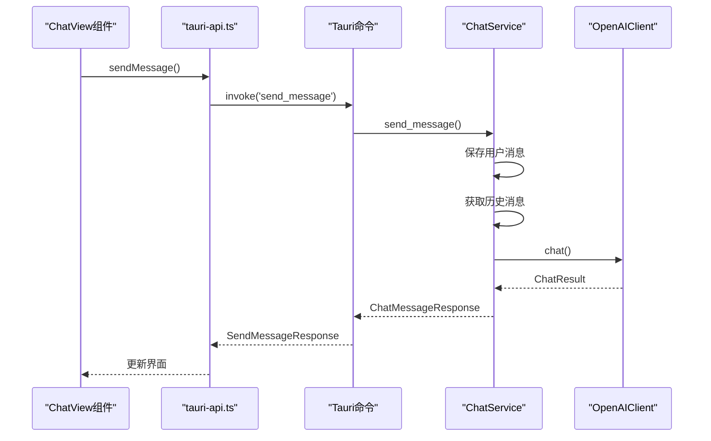
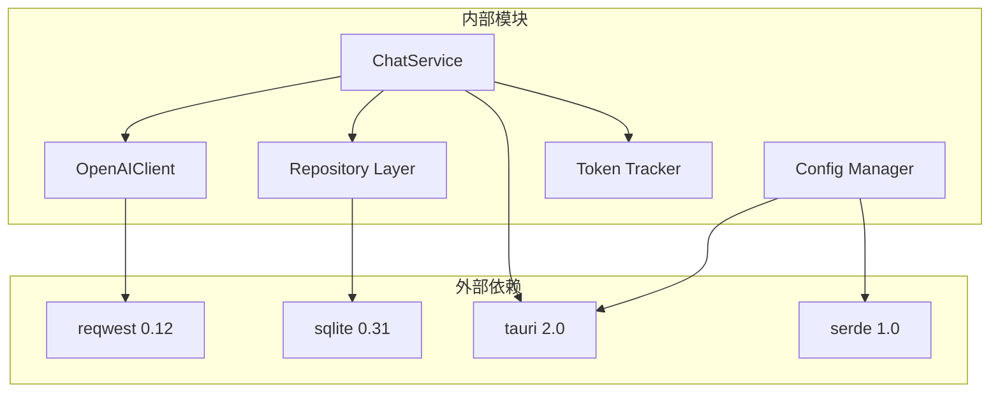

# OpenAI客户端集成

<cite>
**本文引用的文件**
- [openai_client.rs](file://src-tauri/src/chat/openai_client.rs)
- [service.rs](file://src-tauri/src/chat/service.rs)
- [conversation_repo.rs](file://src-tauri/src/chat/conversation_repo.rs)
- [message_repo.rs](file://src-tauri/src/chat/message_repo.rs)
- [models.rs](file://src-tauri/src/database/models.rs)
- [tracker.rs](file://src-tauri/src/token_tracker/tracker.rs)
- [main.rs](file://src-tauri/src/main.rs)
- [model-config.ts](file://src/config/model-config.ts)
- [mod.rs](file://src-tauri/src/config/mod.rs)
- [ChatView.vue](file://src/components/business/ChatView.vue)
- [ModelSettings.vue](file://src/components/settings/ModelSettings.vue)
- [tauri-api.ts](file://src/api/tauri-api.ts)
- [Cargo.toml](file://src-tauri/Cargo.toml)
</cite>

## 目录
1. [简介](#简介)
2. [项目结构](#项目结构)
3. [核心组件](#核心组件)
4. [架构概览](#架构概览)
5. [详细组件分析](#详细组件分析)
6. [依赖关系分析](#依赖关系分析)
7. [性能考虑](#性能考虑)
8. [故障排除指南](#故障排除指南)
9. [结论](#结论)
10. [附录](#附录)

## 简介
本项目是一个基于Tauri + Vue的桌面AI助手应用，集成了OpenAI客户端功能。系统采用前后端分离架构，前端负责用户界面和交互，后端负责业务逻辑、数据持久化和OpenAI API调用。本文档详细解释了OpenAIClient的设计架构、配置管理、API调用封装、响应处理机制，以及异步聊天请求的完整实现流程。

## 项目结构
项目采用模块化设计，主要分为以下层次：

**图表来源**
- [main.rs](file://src-tauri/src/main.rs#L242-L321)
- [service.rs](file://src-tauri/src/chat/service.rs#L11-L29)

**章节来源**
- [main.rs](file://src-tauri/src/main.rs#L1-L321)
- [Cargo.toml](file://src-tauri/Cargo.toml#L1-L25)

## 核心组件
系统的核心组件包括OpenAIClient、ChatService、数据访问层和配置管理器。每个组件都有明确的职责分工和清晰的接口定义。

### OpenAIClient组件
OpenAIClient是系统的核心API客户端，负责与OpenAI服务进行通信。它封装了HTTP请求、响应解析和错误处理逻辑。

### ChatService组件
ChatService作为业务服务层，协调各个组件的工作，处理复杂的业务逻辑，包括消息管理、会话管理和Token统计。

### 数据访问层
数据访问层包含ConversationRepo和MessageRepo，负责与SQLite数据库的交互，提供会话和消息的CRUD操作。

### 配置管理器
配置管理器负责管理应用的各种配置，包括模型配置、ONNX设置和用户偏好设置。

**章节来源**
- [openai_client.rs](file://src-tauri/src/chat/openai_client.rs#L4-L141)
- [service.rs](file://src-tauri/src/chat/service.rs#L11-L224)

## 架构概览
系统采用分层架构设计，确保各层之间的松耦合和高内聚。

**图表来源**
- [service.rs](file://src-tauri/src/chat/service.rs#L94-L177)
- [openai_client.rs](file://src-tauri/src/chat/openai_client.rs#L74-L116)

## 详细组件分析

### OpenAIClient设计架构

OpenAIClient采用结构体封装的方式，提供了简洁的API接口：

**图表来源**
- [openai_client.rs](file://src-tauri/src/chat/openai_client.rs#L4-L141)

#### 数据结构定义

系统定义了多个核心数据结构来处理OpenAI API的请求和响应：

**ChatMessage数据结构**
- `role`: 消息角色，支持"user"、"assistant"、"system"
- `content`: 消息内容，包含具体的文本信息

**ChatResult数据结构**
- `content`: AI生成的回复内容
- `role`: 回复角色，通常是"assistant"
- `usage`: Token使用统计信息，可选字段

**Usage数据结构**
- `prompt_tokens`: 提示Token数量
- `completion_tokens`: 补全Token数量  
- `total_tokens`: 总Token数量

**章节来源**
- [openai_client.rs](file://src-tauri/src/chat/openai_client.rs#L13-L60)

### 异步聊天请求实现流程

系统实现了完整的异步聊天请求流程，包括消息构建、HTTP请求发送和响应解析：

**图表来源**
- [openai_client.rs](file://src-tauri/src/chat/openai_client.rs#L74-L116)

#### 请求头设置策略

OpenAIClient在HTTP请求中设置了必要的头部信息：
- Authorization: Bearer {api_key} - 设置API密钥认证
- Content-Type: application/json - 指定请求体格式

#### 错误处理策略

系统实现了多层次的错误处理机制：
1. **网络请求错误**: 捕获HTTP请求失败并返回详细错误信息
2. **API响应错误**: 检查HTTP状态码，非成功状态返回API错误详情
3. **JSON解析错误**: 处理响应体解析失败的情况
4. **业务逻辑错误**: 处理没有返回内容等业务异常

**章节来源**
- [openai_client.rs](file://src-tauri/src/chat/openai_client.rs#L74-L116)

### ChatService业务逻辑

ChatService作为业务服务层，协调各个组件的工作，处理复杂的业务逻辑：

**图表来源**
- [service.rs](file://src-tauri/src/chat/service.rs#L11-L224)

#### 会话管理功能

ChatService提供了完整的会话管理功能：
- **创建会话**: 自动生成唯一ID，初始化统计数据
- **会话列表**: 支持分页查询，按更新时间排序
- **会话详情**: 获取单个会话的完整信息
- **会话更新**: 支持标题修改和统计更新
- **会话删除**: 级联删除关联消息

#### 消息管理功能

消息管理功能包括：
- **消息保存**: 自动计算Token使用量
- **历史消息**: 获取最近N条消息构建上下文
- **消息查询**: 支持分页和排序
- **批量清理**: 清空会话中的所有消息

**章节来源**
- [service.rs](file://src-tauri/src/chat/service.rs#L37-L92)

### Token追踪器实现

TokenTracker负责跟踪和统计AI服务的Token使用情况：

**图表来源**
- [tracker.rs](file://src-tauri/src/token_tracker/tracker.rs#L14-L48)

#### Token统计功能

TokenTracker提供了多种统计查询方式：
- **总体汇总**: 获取指定时间范围内的Token使用总量
- **按模型统计**: 查询特定模型的使用情况
- **每日趋势**: 获取Token使用的日趋势数据
- **模型对比**: 按Token使用量排序不同模型

**章节来源**
- [tracker.rs](file://src-tauri/src/token_tracker/tracker.rs#L50-L194)

### 配置管理系统

系统实现了灵活的配置管理机制，支持多模型配置和动态切换：

**图表来源**
- [mod.rs](file://src-tauri/src/config/mod.rs#L144-L248)

#### 模型配置支持

系统支持多种类型的模型配置：
- **远程模型**: 支持OpenAI、Azure OpenAI等第三方服务
- **本地模型**: 支持ONNX模型的本地推理
- **动态切换**: 支持自动切换和手动切换
- **配置验证**: 提供配置有效性检查

**章节来源**
- [model-config.ts](file://src/config/model-config.ts#L1-L163)
- [mod.rs](file://src-tauri/src/config/mod.rs#L58-L142)

### 前端集成实现

前端通过Tauri API与后端进行通信，实现了完整的聊天界面：

**图表来源**
- [ChatView.vue](file://src/components/business/ChatView.vue#L162-L222)
- [tauri-api.ts](file://src/api/tauri-api.ts#L108-L110)

#### 前端组件功能

前端组件提供了丰富的用户交互功能：
- **消息发送**: 支持键盘快捷键和按钮点击
- **实时更新**: 自动滚动到最新消息
- **加载状态**: 显示AI回复的加载指示器
- **错误处理**: 完善的错误提示和恢复机制
- **模型切换**: 动态切换不同的AI模型

**章节来源**
- [ChatView.vue](file://src/components/business/ChatView.vue#L1-L569)
- [tauri-api.ts](file://src/api/tauri-api.ts#L1-L242)

## 依赖关系分析

系统采用了清晰的依赖关系设计，确保模块间的低耦合和高内聚：

**图表来源**
- [Cargo.toml](file://src-tauri/Cargo.toml#L12-L25)

### 关键依赖特性

系统的关键依赖及其作用：
- **reqwest**: 异步HTTP客户端，支持JSON序列化
- **rusqlite**: SQLite数据库驱动，支持绑定编译
- **tauri**: 跨平台桌面应用框架
- **serde**: 序列化和反序列化框架
- **tokio**: 异步运行时环境

**章节来源**
- [Cargo.toml](file://src-tauri/Cargo.toml#L12-L25)

## 性能考虑

系统在设计时充分考虑了性能优化：

### 异步处理优化
- 使用Tokio异步运行时处理并发请求
- 采用Arc + RwLock实现线程安全的客户端共享
- 避免不必要的锁竞争，提高并发性能

### 内存管理优化
- 使用智能指针管理资源生命周期
- 实现零拷贝的数据传输
- 合理的缓存策略减少重复计算

### 数据库性能优化
- 使用预编译SQL语句提高执行效率
- 实现批量操作减少数据库往返
- 合理的索引设计优化查询性能

## 故障排除指南

### 常见问题及解决方案

**API密钥配置问题**
- 症状: 请求被拒绝或返回401错误
- 解决方案: 检查API密钥格式是否正确，确认密钥权限设置

**网络连接问题**
- 症状: 请求超时或连接失败
- 解决方案: 检查网络连接，确认API端点可达性

**数据库操作失败**
- 症状: 会话或消息保存失败
- 解决方案: 检查数据库文件权限，确认磁盘空间充足

**Token统计异常**
- 症状: Token使用量统计不准确
- 解决方案: 检查消息保存逻辑，确认Token计算准确性

**章节来源**
- [openai_client.rs](file://src-tauri/src/chat/openai_client.rs#L94-L98)
- [service.rs](file://src-tauri/src/chat/service.rs#L95-L177)

## 结论

本OpenAI客户端集成为桌面应用提供了完整的AI聊天功能。系统采用模块化设计，具有良好的扩展性和维护性。通过合理的架构设计和完善的错误处理机制，确保了系统的稳定性和可靠性。

主要优势包括：
- **模块化设计**: 清晰的职责分离和接口定义
- **异步处理**: 高效的并发处理能力
- **配置灵活**: 支持多模型配置和动态切换
- **数据持久化**: 完整的消息和统计存储
- **前端友好**: 丰富的用户交互体验

未来可以进一步优化的方向：
- 实现真正的异步OpenAI调用
- 增加重试机制和超时处理
- 扩展更多的AI模型支持
- 优化Token使用统计功能

## 附录

### 使用示例

**基本聊天流程**
1. 创建会话：`createConversation("新会话")`
2. 发送消息：`sendMessage({conversation_id, content})`
3. 获取消息：`getConversationMessages(conversation_id)`
4. 清空历史：`clearConversationMessages(conversation_id)`

**配置管理示例**
1. 获取配置：`getAppConfig()`
2. 更新模型：`updateModelSelection(model_id)`
3. 切换ONNX：`toggleONNXFeature(feature, enabled)`
4. 保存配置：`updateAppConfig(newConfig)`

### 最佳实践

**API密钥管理**
- 使用环境变量存储敏感信息
- 定期轮换API密钥
- 限制密钥权限范围

**错误处理**
- 实现重试机制处理临时故障
- 记录详细的错误日志
- 提供友好的用户反馈

**性能优化**
- 合理设置请求超时时间
- 实现请求去重避免重复调用
- 优化消息上下文长度

**安全考虑**
- 验证用户输入防止注入攻击
- 限制请求频率防止滥用
- 加密存储敏感配置信息