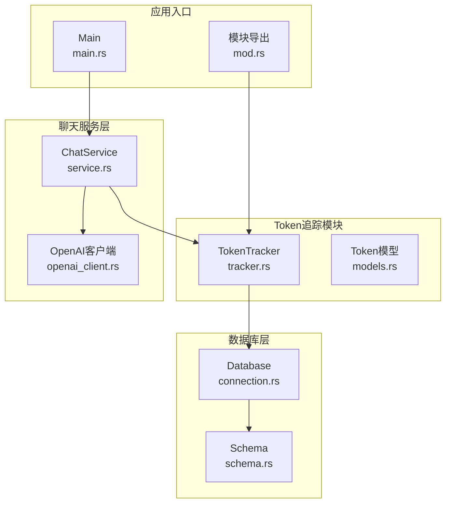
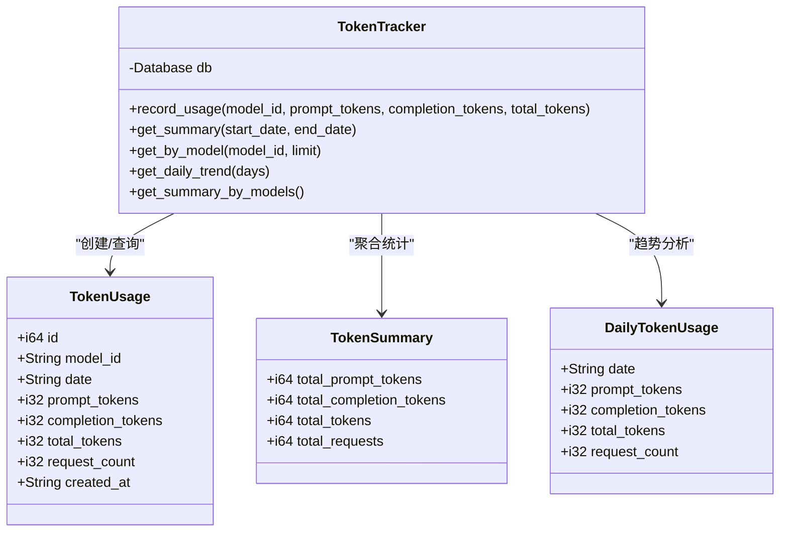
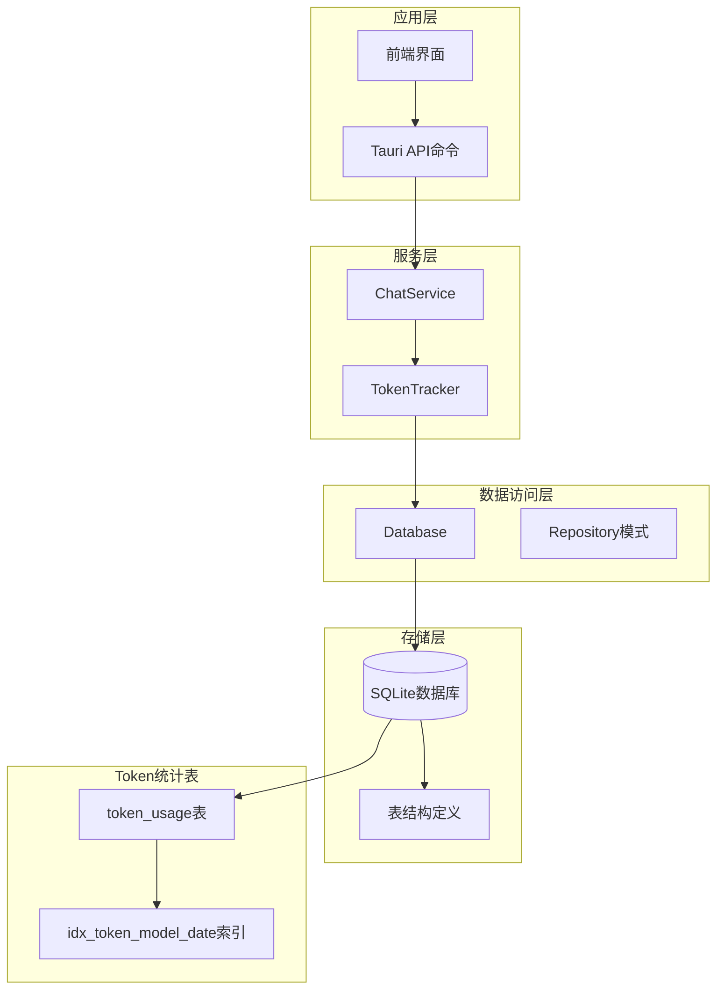
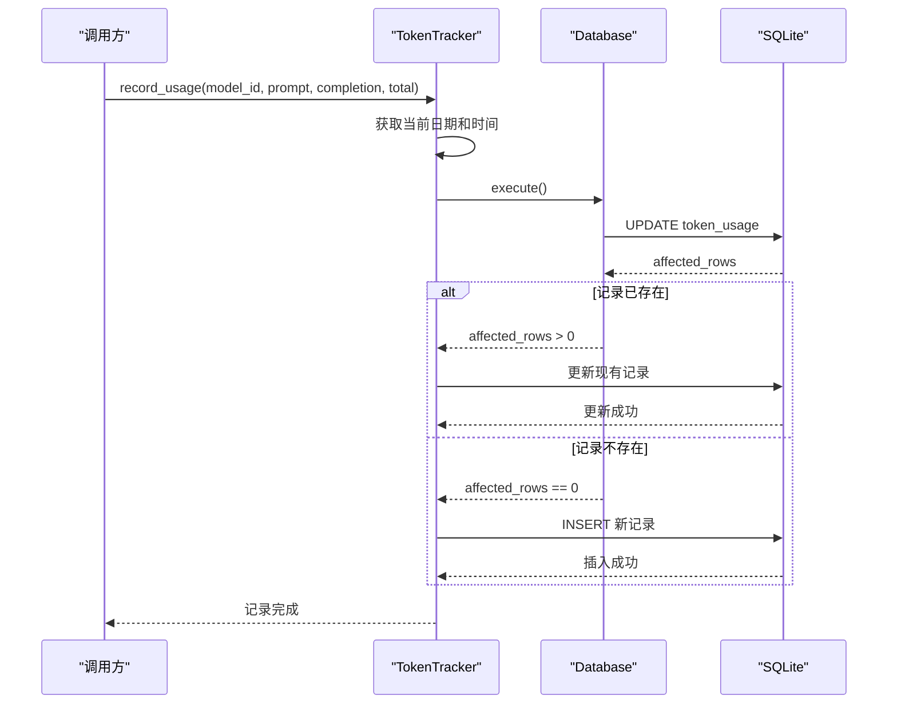
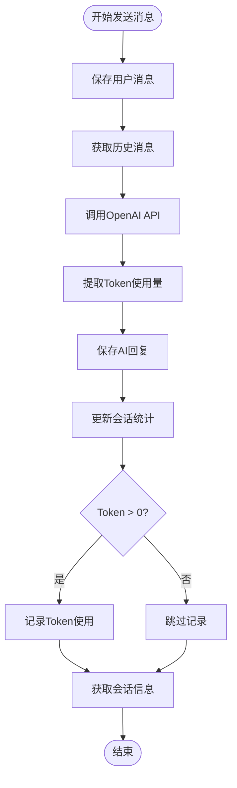
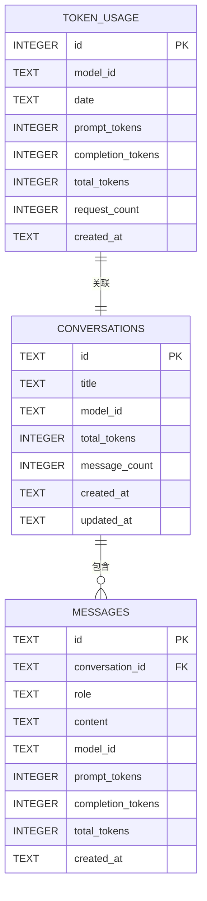
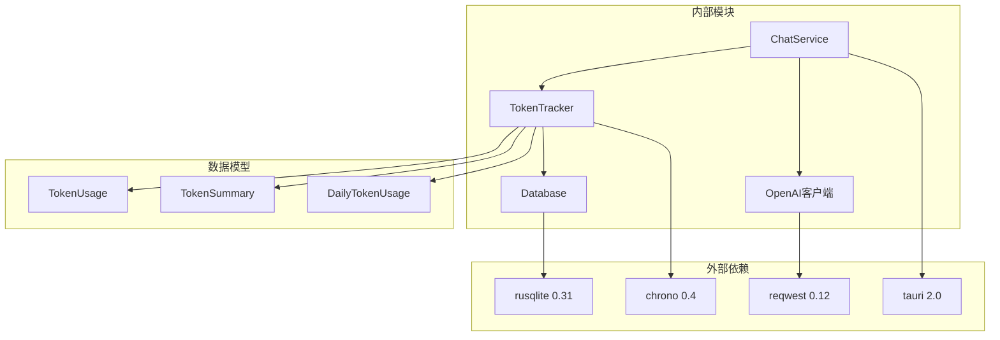

# Token使用追踪

<cite>
**本文档引用的文件**
- [src-tauri/src/token_tracker/mod.rs](file://src-tauri/src/token_tracker/mod.rs)
- [src-tauri/src/token_tracker/tracker.rs](file://src-tauri/src/token_tracker/tracker.rs)
- [src-tauri/src/chat/service.rs](file://src-tauri/src/chat/service.rs)
- [src-tauri/src/chat/openai_client.rs](file://src-tauri/src/chat/openai_client.rs)
- [src-tauri/src/database/models.rs](file://src-tauri/src/database/models.rs)
- [src-tauri/src/database/schema.rs](file://src-tauri/src/database/schema.rs)
- [src-tauri/src/database/connection.rs](file://src-tauri/src/database/connection.rs)
- [src-tauri/src/main.rs](file://src-tauri/src/main.rs)
- [src-tauri/Cargo.toml](file://src-tauri/Cargo.toml)
</cite>

## 目录
1. [简介](#简介)
2. [项目结构](#项目结构)
3. [核心组件](#核心组件)
4. [架构概览](#架构概览)
5. [详细组件分析](#详细组件分析)
6. [依赖关系分析](#依赖关系分析)
7. [性能考虑](#性能考虑)
8. [故障排除指南](#故障排除指南)
9. [结论](#结论)
10. [附录](#附录)

## 简介

Token使用追踪系统是Malou Agent桌面AI助手的重要组成部分，负责实时监控和统计用户的Token使用情况。该系统提供了完整的Token使用量追踪功能，包括prompt tokens、completion tokens和total tokens的记录与统计，支持按模型、时间维度的分类统计，并提供趋势分析和报表生成功能。

该系统采用SQLite作为数据存储，通过Tauri框架提供桌面应用程序界面，实现了从消息发送到Token统计的完整工作流程。系统设计注重实时性和准确性，确保每个AI对话都会被精确记录和统计。

## 项目结构

Token使用追踪系统位于Rust后端代码中，主要分布在以下目录结构：



**图表来源**
- [src-tauri/src/token_tracker/tracker.rs](file://src-tauri/src/token_tracker/tracker.rs#L1-L195)
- [src-tauri/src/chat/service.rs](file://src-tauri/src/chat/service.rs#L1-L224)
- [src-tauri/src/database/connection.rs](file://src-tauri/src/database/connection.rs#L1-L125)

**章节来源**
- [src-tauri/src/token_tracker/mod.rs](file://src-tauri/src/token_tracker/mod.rs#L1-L4)
- [src-tauri/src/token_tracker/tracker.rs](file://src-tauri/src/token_tracker/tracker.rs#L1-L195)
- [src-tauri/src/chat/service.rs](file://src-tauri/src/chat/service.rs#L1-L224)
- [src-tauri/src/database/connection.rs](file://src-tauri/src/database/connection.rs#L1-L125)

## 核心组件

### TokenTracker核心类

TokenTracker是整个系统的中心控制器，负责处理所有Token使用记录的逻辑。它采用单例模式设计，通过Database实例进行数据持久化操作。

**关键特性：**
- 实时Token使用记录
- 支持多种统计查询
- 自动去重和聚合
- 线程安全设计

### 数据模型体系

系统定义了完整的数据模型来表示Token使用情况：



**图表来源**
- [src-tauri/src/token_tracker/tracker.rs](file://src-tauri/src/token_tracker/tracker.rs#L4-L78)
- [src-tauri/src/database/models.rs](file://src-tauri/src/database/models.rs#L48-L78)

**章节来源**
- [src-tauri/src/token_tracker/tracker.rs](file://src-tauri/src/token_tracker/tracker.rs#L4-L78)
- [src-tauri/src/database/models.rs](file://src-tauri/src/database/models.rs#L48-L78)

## 架构概览

Token使用追踪系统采用分层架构设计，从上到下分为应用层、服务层、数据访问层和存储层：



**图表来源**
- [src-tauri/src/main.rs](file://src-tauri/src/main.rs#L163-L186)
- [src-tauri/src/chat/service.rs](file://src-tauri/src/chat/service.rs#L11-L28)
- [src-tauri/src/database/schema.rs](file://src-tauri/src/database/schema.rs#L34-L48)

系统的核心工作流程如下：

1. **消息发送流程**：用户通过前端界面发送消息
2. **AI调用流程**：ChatService调用OpenAI API获取响应
3. **Token提取流程**：从API响应中提取Token使用量
4. **记录保存流程**：TokenTracker记录Token使用情况
5. **统计查询流程**：提供各种统计查询接口

**章节来源**
- [src-tauri/src/main.rs](file://src-tauri/src/main.rs#L140-L177)
- [src-tauri/src/chat/service.rs](file://src-tauri/src/chat/service.rs#L94-L177)

## 详细组件分析

### TokenTracker实现详解

TokenTracker是系统的核心组件，负责处理所有Token使用记录的业务逻辑。其设计遵循单一职责原则，专注于Token使用量的记录、聚合和查询。

#### record_usage方法实现

record_usage方法是TokenTracker最核心的功能，实现了智能的Token使用记录机制：



**图表来源**
- [src-tauri/src/token_tracker/tracker.rs](file://src-tauri/src/token_tracker/tracker.rs#L14-L48)

该方法的实现特点：
- **原子性操作**：使用UPDATE语句尝试更新现有记录
- **智能回退**：当UPDATE影响行数为0时自动插入新记录
- **时间维度**：按日期进行分组统计，支持同一天多次使用的累加
- **完整性保证**：确保prompt_tokens、completion_tokens、total_tokens三者的一致性

#### 统计查询方法

系统提供了多种统计查询方法，满足不同的分析需求：

**总体统计查询**：
- 支持指定起止日期范围
- 自动处理边界条件
- 提供多种Token类型的汇总

**按模型统计**：
- 按模型ID分组统计
- 支持限制返回记录数量
- 按日期降序排列

**每日趋势分析**：
- 按自然日聚合统计
- 支持自定义天数范围
- 结果按日期正序排列便于趋势分析

**章节来源**
- [src-tauri/src/token_tracker/tracker.rs](file://src-tauri/src/token_tracker/tracker.rs#L50-L194)

### ChatService集成

ChatService作为聊天功能的核心服务，深度集成了TokenTracker功能：



**图表来源**
- [src-tauri/src/chat/service.rs](file://src-tauri/src/chat/service.rs#L94-L177)

集成的关键点：
- **时机选择**：仅在AI响应包含有效Token使用量时才记录
- **数据传递**：从OpenAI API响应中提取prompt_tokens、completion_tokens、total_tokens
- **错误处理**：使用ok()方法忽略记录失败，不影响主要业务流程

**章节来源**
- [src-tauri/src/chat/service.rs](file://src-tauri/src/chat/service.rs#L160-L165)

### 数据库设计

系统采用SQLite作为数据存储，设计了专门的表结构来存储Token使用信息：



**图表来源**
- [src-tauri/src/database/schema.rs](file://src-tauri/src/database/schema.rs#L34-L62)

**章节来源**
- [src-tauri/src/database/schema.rs](file://src-tauri/src/database/schema.rs#L1-L68)

## 依赖关系分析

Token使用追踪系统依赖于多个关键组件，形成了清晰的依赖层次：



**图表来源**
- [src-tauri/Cargo.toml](file://src-tauri/Cargo.toml#L12-L24)
- [src-tauri/src/token_tracker/tracker.rs](file://src-tauri/src/token_tracker/tracker.rs#L1-L2)
- [src-tauri/src/chat/service.rs](file://src-tauri/src/chat/service.rs#L1-L9)

**章节来源**
- [src-tauri/Cargo.toml](file://src-tauri/Cargo.toml#L1-L25)

## 性能考虑

### 数据库优化策略

系统采用了多项数据库优化策略来确保高性能：

1. **索引优化**：为token_usage表建立了复合索引(idx_token_model_date)，支持高效的按模型和日期查询
2. **WAL模式**：启用Write-Ahead Logging模式提高并发性能
3. **原子操作**：使用UPDATE语句的原子性避免竞态条件
4. **批量查询**：支持按日期范围的批量统计查询

### 内存管理

系统采用Tokio的Mutex包装rusqlite::Connection，确保线程安全的同时保持良好的性能：

- **异步支持**：Database::execute方法支持异步查询
- **连接池**：通过Arc<Mutex<Connection>>实现连接共享
- **手动实现Send/Sync**：通过Mutex保证线程安全

### 缓存策略

虽然当前版本未实现缓存，但系统设计允许后续添加缓存层：

- **统计结果缓存**：可以缓存常用的统计查询结果
- **模型配置缓存**：缓存模型配置信息减少查询开销
- **会话信息缓存**：缓存活跃会话的统计信息

## 故障排除指南

### 常见问题及解决方案

**问题1：Token记录失败**
- 检查数据库连接是否正常
- 验证token_usage表是否存在
- 确认SQLite权限设置

**问题2：统计查询结果异常**
- 检查日期格式是否正确
- 验证SQL查询语法
- 确认数据类型匹配

**问题3：并发访问冲突**
- 确认使用Database::execute方法
- 检查Tokio运行时环境
- 验证Mutex锁定机制

### 调试建议

1. **启用详细日志**：在开发环境中增加详细的日志输出
2. **单元测试**：为关键功能编写单元测试
3. **性能监控**：监控数据库查询性能
4. **错误处理**：完善错误处理和恢复机制

**章节来源**
- [src-tauri/src/database/connection.rs](file://src-tauri/src/database/connection.rs#L67-L88)

## 结论

Token使用追踪系统是一个设计精良、功能完整的解决方案，成功实现了以下目标：

1. **实时监控**：能够实时记录每次AI对话的Token使用情况
2. **多维度统计**：支持按模型、时间、请求等多种维度的统计分析
3. **高效查询**：通过合理的数据库设计和索引优化，提供快速的查询性能
4. **可扩展性**：模块化设计便于后续功能扩展和性能优化

系统的主要优势包括：
- 清晰的分层架构设计
- 完善的数据模型定义
- 高效的数据库查询策略
- 线程安全的并发处理
- 友好的API接口设计

未来可以考虑的改进方向：
- 添加Token配额管理和成本控制功能
- 实现更丰富的报表生成功能
- 增加数据导出和备份机制
- 优化大数据量下的查询性能

## 附录

### API接口定义

系统提供了完整的Token统计查询接口：

**总体统计查询**
- 接口：get_token_usage_summary
- 参数：start_date(可选), end_date(可选)
- 返回：TokenSummary对象

**每日趋势查询**
- 接口：get_token_usage_trend
- 参数：days(可选，默认30)
- 返回：DailyTokenUsage数组

**按模型查询**
- 接口：get_by_model
- 参数：model_id, limit
- 返回：TokenUsage数组

### 使用示例

#### 基本集成步骤

1. **初始化ChatService**：
```rust
let db = Database::new(db_path)?;
let chat_service = ChatService::new(db);
```

2. **发送消息并自动记录Token**：
```rust
let result = chat_service.send_message(conversation_id, content)?;
// Token使用量会自动记录到数据库
```

3. **查询统计信息**：
```rust
let summary = chat_service.get_token_tracker()
    .get_summary(None, None)?;
```

#### 高级使用场景

**自定义统计范围**：
```rust
let summary = chat_service.get_token_tracker()
    .get_summary(Some("2024-01-01"), Some("2024-12-31"))?;
```

**获取模型对比数据**：
```rust
let model_stats = chat_service.get_token_tracker()
    .get_summary_by_models()?;
```

**趋势分析**：
```rust
let trends = chat_service.get_token_tracker()
    .get_daily_trend(90)?; // 获取90天趋势
```

**章节来源**
- [src-tauri/src/main.rs](file://src-tauri/src/main.rs#L165-L186)
- [src-tauri/src/chat/service.rs](file://src-tauri/src/chat/service.rs#L219-L222)