# 会话数据访问层

<cite>
**本文档引用的文件**
- [conversation_repo.rs](file://src-tauri/src/chat/conversation_repo.rs)
- [models.rs](file://src-tauri/src/database/models.rs)
- [schema.rs](file://src-tauri/src/database/schema.rs)
- [connection.rs](file://src-tauri/src/database/connection.rs)
- [service.rs](file://src-tauri/src/chat/service.rs)
- [main.rs](file://src-tauri/src/main.rs)
- [mod.rs](file://src-tauri/src/chat/mod.rs)
- [db_test.rs](file://src-tauri/src/db_test.rs)
</cite>

## 目录
1. [简介](#简介)
2. [项目结构](#项目结构)
3. [核心组件](#核心组件)
4. [架构概览](#架构概览)
5. [详细组件分析](#详细组件分析)
6. [依赖关系分析](#依赖关系分析)
7. [性能考虑](#性能考虑)
8. [故障排除指南](#故障排除指南)
9. [结论](#结论)
10. [附录](#附录)

## 简介

本文档深入解析了Malou Agent项目中的ConversationRepo数据访问层，这是一个基于Rusqlite的SQLite数据持久化实现。该层采用Repository模式设计，为会话管理提供了完整的数据访问抽象，包括会话的创建、查询、更新和删除等核心操作。

Repository模式通过将数据访问逻辑封装在专门的数据访问类中，实现了业务逻辑与数据存储细节的分离，提高了代码的可维护性和可测试性。在本项目中，ConversationRepo负责管理会话数据的生命周期，包括统计信息的维护和事务处理。

## 项目结构

项目采用模块化的Rust架构设计，主要分为以下几个层次：

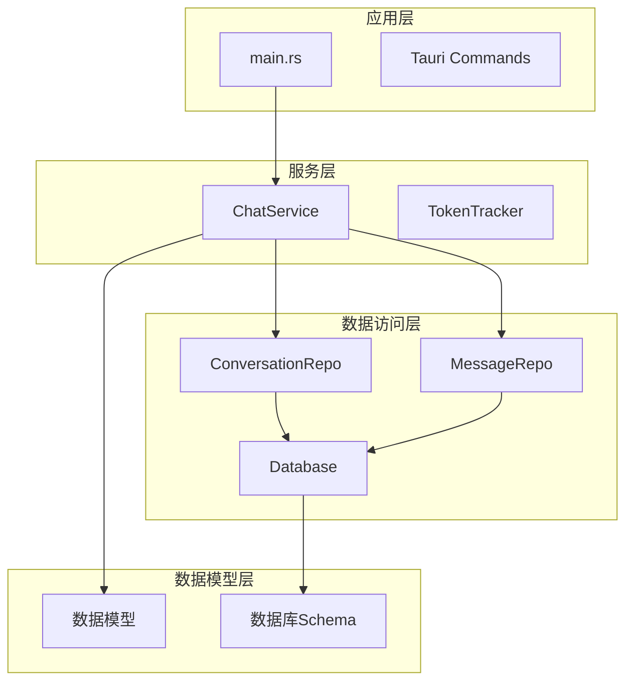

**图表来源**
- [main.rs](file://src-tauri/src/main.rs#L242-L315)
- [service.rs](file://src-tauri/src/chat/service.rs#L11-L29)
- [conversation_repo.rs](file://src-tauri/src/chat/conversation_repo.rs#L4-L7)

**章节来源**
- [main.rs](file://src-tauri/src/main.rs#L1-L316)
- [mod.rs](file://src-tauri/src/chat/mod.rs#L1-L10)

## 核心组件

### ConversationRepo结构体

ConversationRepo是会话数据访问层的核心实现，采用了以下设计原则：

- **单一职责原则**：专注于会话相关的数据操作
- **依赖注入**：通过构造函数接收Database实例
- **类型安全**：使用Rusqlite的类型安全参数绑定
- **错误处理**：统一返回SqliteResult类型

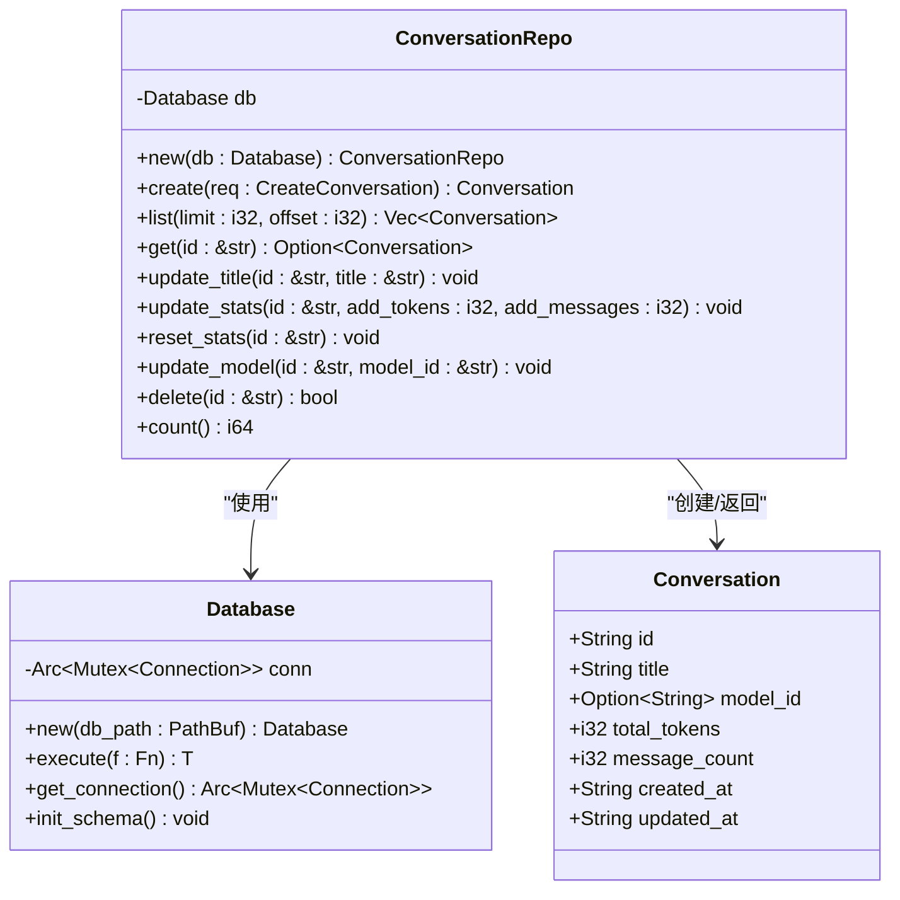

**图表来源**
- [conversation_repo.rs](file://src-tauri/src/chat/conversation_repo.rs#L4-L161)
- [connection.rs](file://src-tauri/src/database/connection.rs#L8-L58)
- [models.rs](file://src-tauri/src/database/models.rs#L4-L13)

**章节来源**
- [conversation_repo.rs](file://src-tauri/src/chat/conversation_repo.rs#L1-L161)
- [models.rs](file://src-tauri/src/database/models.rs#L1-L110)

## 架构概览

### 数据访问层架构

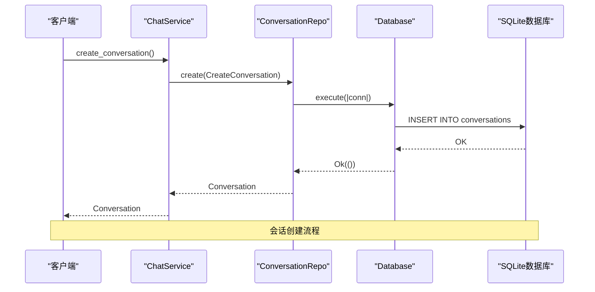

**图表来源**
- [service.rs](file://src-tauri/src/chat/service.rs#L37-L42)
- [conversation_repo.rs](file://src-tauri/src/chat/conversation_repo.rs#L14-L37)
- [connection.rs](file://src-tauri/src/database/connection.rs#L50-L57)

### 事务处理机制

系统采用单连接串行化执行的事务模型，确保数据一致性：

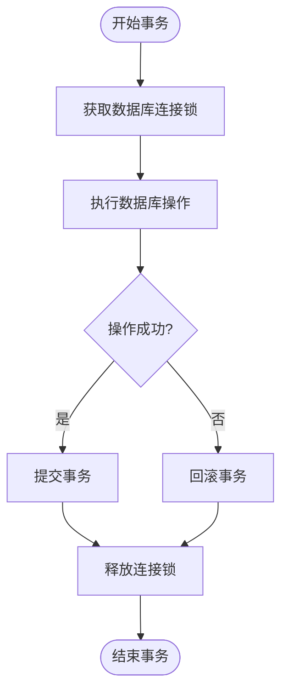

**图表来源**
- [connection.rs](file://src-tauri/src/database/connection.rs#L50-L57)

**章节来源**
- [connection.rs](file://src-tauri/src/database/connection.rs#L1-L89)

## 详细组件分析

### 1. 会话创建操作 (create)

会话创建是系统中最复杂的操作之一，涉及多个步骤：

#### 创建流程

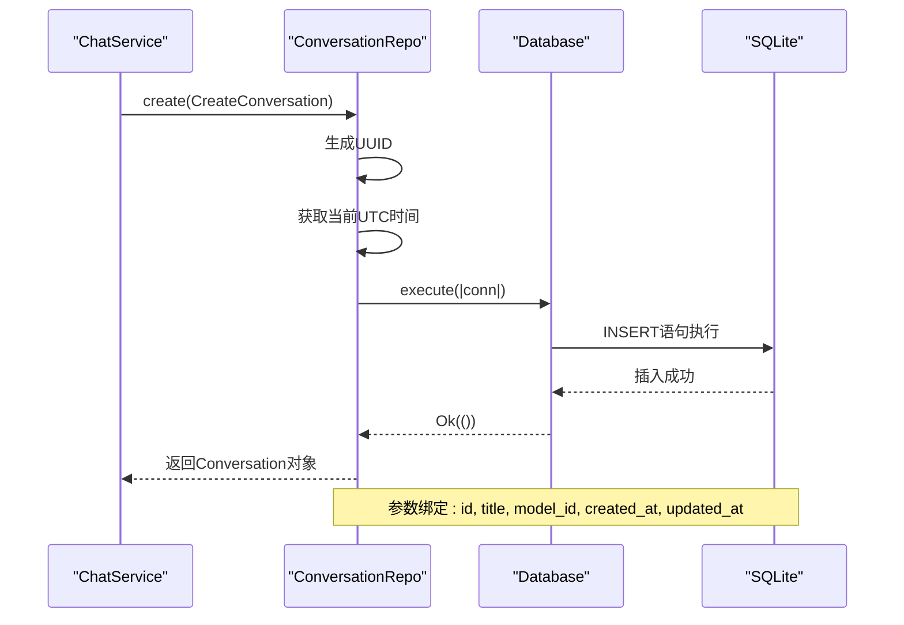

**图表来源**
- [conversation_repo.rs](file://src-tauri/src/chat/conversation_repo.rs#L14-L37)

#### SQL执行细节

- **参数绑定**：使用`params!`宏进行类型安全的参数绑定
- **默认值设置**：total_tokens和message_count初始为0
- **时间戳管理**：created_at和updated_at使用相同的UTC时间
- **UUID生成**：使用uuid::Uuid::new_v4()生成唯一标识符

**章节来源**
- [conversation_repo.rs](file://src-tauri/src/chat/conversation_repo.rs#L14-L37)

### 2. 会话列表查询 (list)

会话列表查询采用分页机制，支持大数据集的高效检索：

#### 查询实现

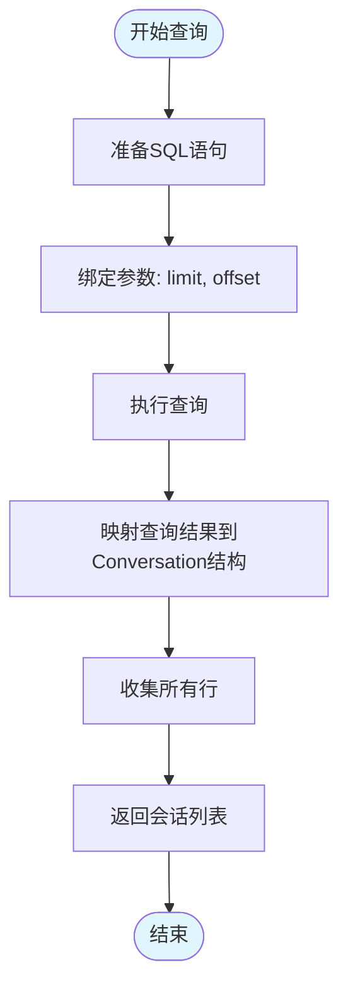

**图表来源**
- [conversation_repo.rs](file://src-tauri/src/chat/conversation_repo.rs#L39-L63)

#### 性能优化特性

- **索引利用**：使用`idx_conversations_updated`索引按updated_at降序排列
- **参数化查询**：防止SQL注入攻击
- **流式处理**：使用query_map进行内存友好的结果处理

**章节来源**
- [conversation_repo.rs](file://src-tauri/src/chat/conversation_repo.rs#L39-L63)
- [schema.rs](file://src-tauri/src/database/schema.rs#L14-L15)

### 3. 单个会话获取 (get)

单个会话获取操作采用精确匹配查询：

#### 查询流程

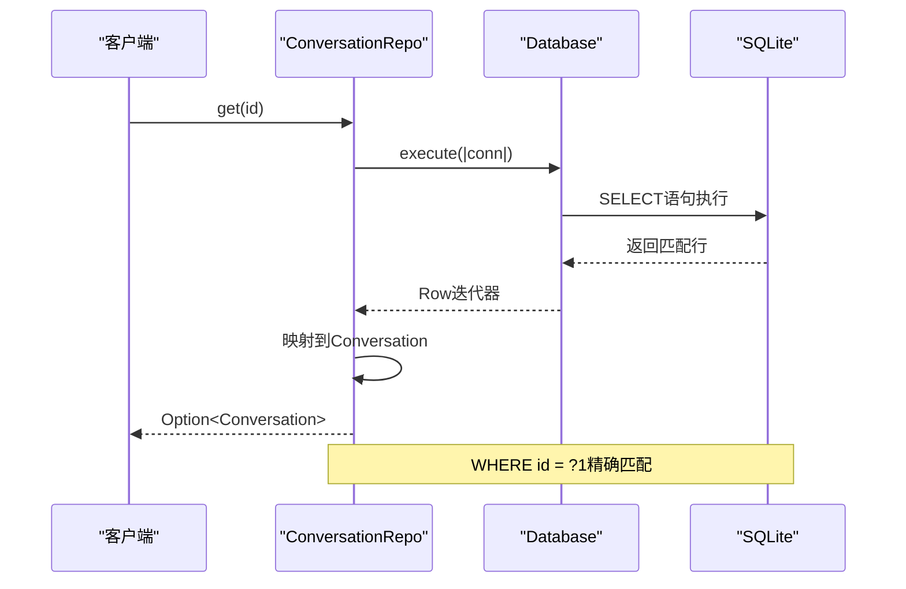

**图表来源**
- [conversation_repo.rs](file://src-tauri/src/chat/conversation_repo.rs#L65-L88)

**章节来源**
- [conversation_repo.rs](file://src-tauri/src/chat/conversation_repo.rs#L65-L88)

### 4. 会话标题更新 (update_title)

标题更新操作采用原子更新机制：

#### 更新策略

- **时间戳同步**：更新updated_at字段保持数据新鲜度
- **原子操作**：单条UPDATE语句完成标题和时间戳更新
- **参数绑定**：使用rusqlite的类型安全参数绑定

**章节来源**
- [conversation_repo.rs](file://src-tauri/src/chat/conversation_repo.rs#L90-L100)

### 5. 会话统计更新 (update_stats)

统计更新是系统的核心功能之一，负责维护会话的使用统计：

#### 统计更新机制

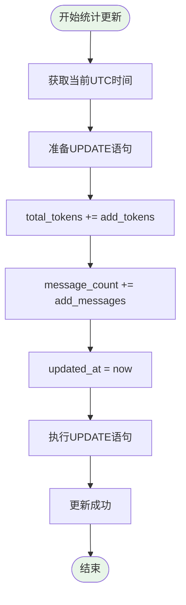

**图表来源**
- [conversation_repo.rs](file://src-tauri/src/chat/conversation_repo.rs#L102-L116)

#### 统计字段说明

- **total_tokens**：累计的Token使用量
- **message_count**：累计的消息数量
- **updated_at**：最后更新时间戳

**章节来源**
- [conversation_repo.rs](file://src-tauri/src/chat/conversation_repo.rs#L102-L116)

### 6. 统计重置 (reset_stats)

统计重置操作用于清空会话的历史统计信息：

#### 重置流程

- **零值设置**：将total_tokens和message_count设为0
- **时间戳更新**：更新updated_at为当前时间
- **原子操作**：单条UPDATE语句完成所有重置

**章节来源**
- [conversation_repo.rs](file://src-tauri/src/chat/conversation_repo.rs#L118-L132)

### 7. 会话删除 (delete)

会话删除操作采用级联删除机制：

#### 删除策略

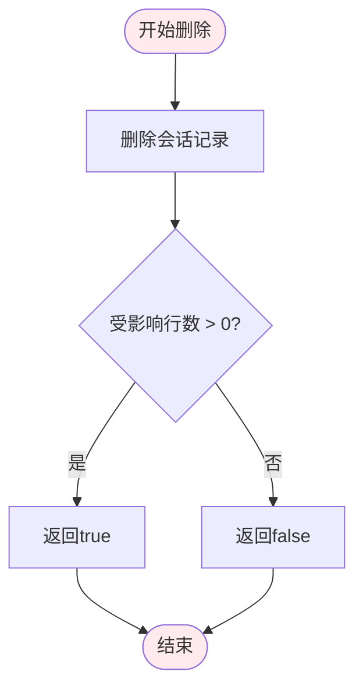

**图表来源**
- [conversation_repo.rs](file://src-tauri/src/chat/conversation_repo.rs#L146-L152)

**注意**：由于数据库层面设置了外键级联删除，相关的消息记录会自动删除。

**章节来源**
- [conversation_repo.rs](file://src-tauri/src/chat/conversation_repo.rs#L146-L152)

### 8. 模型更新 (update_model)

模型更新操作允许动态切换会话使用的AI模型：

#### 更新特性

- **模型ID更新**：支持动态切换模型
- **时间戳同步**：更新updated_at保持数据一致性
- **原子操作**：单条UPDATE语句完成更新

**章节来源**
- [conversation_repo.rs](file://src-tauri/src/chat/conversation_repo.rs#L134-L144)

## 依赖关系分析

### 组件依赖图

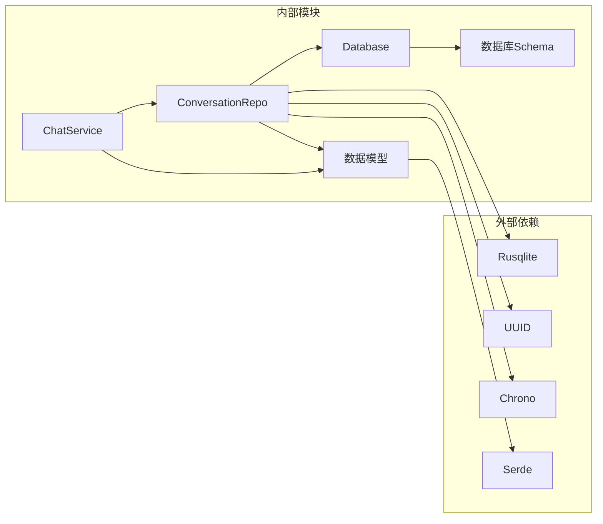

**图表来源**
- [conversation_repo.rs](file://src-tauri/src/chat/conversation_repo.rs#L1-L2)
- [connection.rs](file://src-tauri/src/database/connection.rs#L1-L5)
- [models.rs](file://src-tauri/src/database/models.rs#L1-L1)

### 外部依赖说明

- **Rusqlite**：SQLite数据库驱动，提供类型安全的数据库操作
- **UUID**：生成唯一标识符
- **Chrono**：处理日期时间操作
- **Serde**：序列化和反序列化支持

**章节来源**
- [conversation_repo.rs](file://src-tauri/src/chat/conversation_repo.rs#L1-L2)
- [models.rs](file://src-tauri/src/database/models.rs#L1-L1)

## 性能考虑

### 数据库性能优化

#### 索引策略

系统采用以下索引策略优化查询性能：

1. **会话查询索引**：`idx_conversations_updated`按更新时间倒序排列
2. **消息查询索引**：`idx_messages_conv`按会话ID和时间排序
3. **Token统计索引**：`idx_token_model_date`按模型和日期排序

#### 并发处理

- **连接池**：使用Arc<Mutex<Connection>>实现线程安全的连接共享
- **串行化执行**：同一时间只有一个操作可以访问数据库连接
- **WAL模式**：启用Write-Ahead Logging提高并发性能

### 内存使用优化

- **流式查询**：使用query_map进行内存友好的结果处理
- **参数化查询**：避免SQL字符串拼接减少内存分配
- **类型安全**：编译时检查减少运行时错误

## 故障排除指南

### 常见错误类型

#### 数据库连接错误

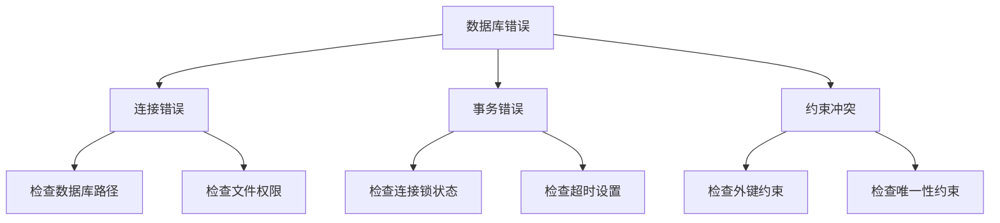

#### 错误处理策略

1. **连接错误**：检查数据库文件路径和权限
2. **事务错误**：确认连接锁状态和超时设置
3. **约束冲突**：验证数据完整性和外键关系

**章节来源**
- [connection.rs](file://src-tauri/src/database/connection.rs#L14-L36)

### 调试技巧

#### 日志记录

- **操作日志**：记录所有数据库操作的时间和结果
- **错误追踪**：捕获详细的错误信息和堆栈跟踪
- **性能监控**：记录查询执行时间和资源使用情况

#### 测试策略

- **单元测试**：针对每个Repository方法编写独立测试
- **集成测试**：测试完整的数据流和事务处理
- **压力测试**：验证高并发场景下的稳定性

**章节来源**
- [db_test.rs](file://src-tauri/src/db_test.rs#L1-L58)

## 结论

ConversationRepo数据访问层成功实现了Repository模式的核心理念，为会话管理提供了完整、类型安全且高性能的数据访问接口。通过精心设计的SQL查询、严格的参数绑定和完善的错误处理机制，该层确保了数据的一致性和系统的可靠性。

### 主要优势

1. **类型安全**：Rusqlite提供的编译时类型检查
2. **性能优化**：合理的索引策略和查询优化
3. **并发安全**：线程安全的连接管理和事务处理
4. **易于维护**：清晰的职责分离和模块化设计

### 技术亮点

- 原子性的统计更新操作
- 级联删除的外键约束
- 流式的查询结果处理
- 统一的错误处理机制

## 附录

### 使用示例

#### 基本会话操作

```rust
// 创建会话
let conversation = conversation_repo.create(CreateConversation {
    title: "新会话".to_string(),
    model_id: Some("gpt-3.5-turbo".to_string()),
})?;

// 获取会话列表
let conversations = conversation_repo.list(50, 0)?;

// 更新会话标题
conversation_repo.update_title(&id, "更新后的标题")?;

// 删除会话
let deleted = conversation_repo.delete(&id)?;
```

#### 统计更新示例

```rust
// 更新统计信息
conversation_repo.update_stats(&id, 150, 1)?; // +150 tokens, +1 message

// 重置统计
conversation_repo.reset_stats(&id)?;
```

### 最佳实践

1. **参数绑定**：始终使用`params!`宏进行参数绑定
2. **错误处理**：在业务层转换为有意义的错误消息
3. **事务边界**：合理划分事务范围，避免长时间持有连接
4. **索引优化**：根据查询模式添加适当的索引
5. **资源管理**：及时释放数据库连接和结果集