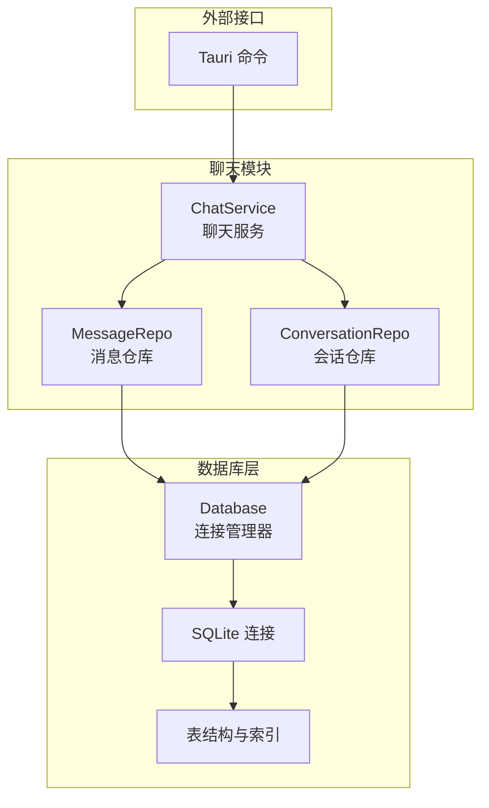
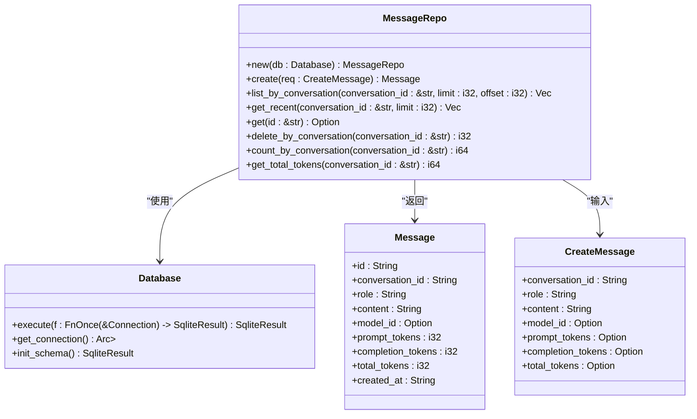
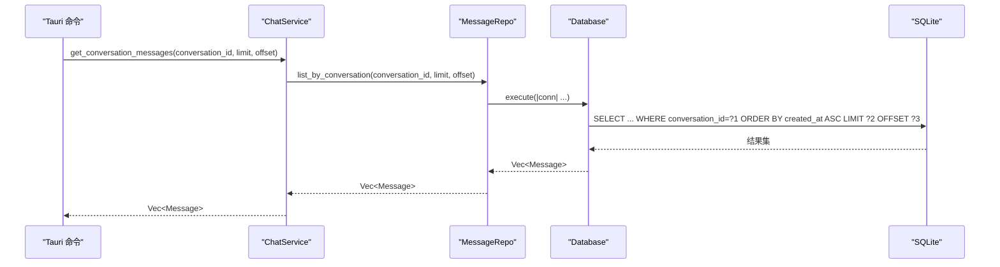
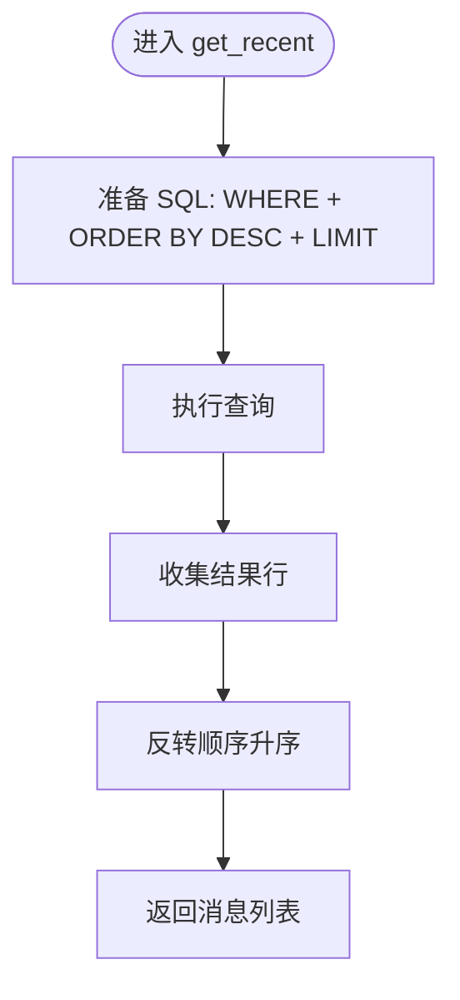
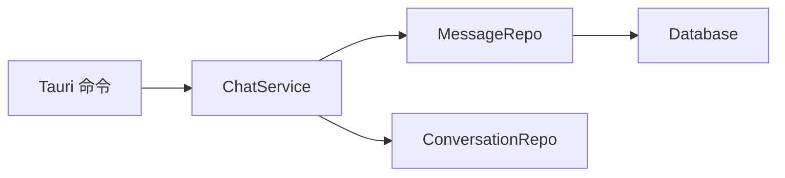

# 消息数据访问层

<cite>
**本文引用的文件**
- [message_repo.rs](file://src-tauri/src/chat/message_repo.rs)
- [models.rs](file://src-tauri/src/database/models.rs)
- [schema.rs](file://src-tauri/src/database/schema.rs)
- [connection.rs](file://src-tauri/src/database/connection.rs)
- [service.rs](file://src-tauri/src/chat/service.rs)
- [main.rs](file://src-tauri/src/main.rs)
- [mod.rs](file://src-tauri/src/chat/mod.rs)
</cite>

## 目录
1. [简介](#简介)
2. [项目结构](#项目结构)
3. [核心组件](#核心组件)
4. [架构概览](#架构概览)
5. [详细组件分析](#详细组件分析)
6. [依赖关系分析](#依赖关系分析)
7. [性能考虑](#性能考虑)
8. [故障排查指南](#故障排查指南)
9. [结论](#结论)
10. [附录](#附录)

## 简介
本文件为消息数据访问层（MessageRepo）的详细技术文档，聚焦于基于 SQLite 的消息 CRUD 操作与查询方法实现，包括：
- 会话消息列表查询（list_by_conversation）
- 会话消息删除（delete_by_conversation）
- 会话最近消息查询（get_recent）
- 排序、分页与过滤机制（limit、offset 参数）
- 消息内容存储格式与编码
- 批量操作性能优化与索引建议
- 消息统计更新与事务处理机制
- 典型查询场景的使用示例

## 项目结构
消息数据访问层位于 Rust 后端（Tauri）侧，采用 Repository 模式封装对 SQLite 的访问，并通过 ChatService 提供业务接口。关键文件如下：
- 数据模型与请求体：models.rs
- 数据库连接与执行器：connection.rs
- 表结构定义与索引：schema.rs
- 消息仓库实现：message_repo.rs
- 业务服务编排：service.rs
- 外部命令入口（Tauri）：main.rs
- 模块导出：mod.rs

图表来源
- [message_repo.rs](file://src-tauri/src/chat/message_repo.rs#L1-L175)
- [service.rs](file://src-tauri/src/chat/service.rs#L1-L224)
- [connection.rs](file://src-tauri/src/database/connection.rs#L1-L89)
- [schema.rs](file://src-tauri/src/database/schema.rs#L1-L68)
- [main.rs](file://src-tauri/src/main.rs#L1-L316)

章节来源
- [message_repo.rs](file://src-tauri/src/chat/message_repo.rs#L1-L175)
- [models.rs](file://src-tauri/src/database/models.rs#L1-L110)
- [schema.rs](file://src-tauri/src/database/schema.rs#L1-L68)
- [connection.rs](file://src-tauri/src/database/connection.rs#L1-L89)
- [service.rs](file://src-tauri/src/chat/service.rs#L1-L224)
- [main.rs](file://src-tauri/src/main.rs#L1-L316)
- [mod.rs](file://src-tauri/src/chat/mod.rs#L1-L10)

## 核心组件
- MessageRepo：消息数据访问层，负责消息的创建、查询、删除与统计。
- Database：数据库连接管理器，提供统一的执行器与连接生命周期管理。
- Message/ CreateMessage：消息实体与创建请求体，定义字段类型与默认值。
- ChatService：业务服务，协调消息与会话仓库，驱动消息发送与统计更新。
- Tauri 命令：对外暴露 get_conversation_messages、clear_conversation_messages 等命令。

章节来源
- [message_repo.rs](file://src-tauri/src/chat/message_repo.rs#L1-L175)
- [models.rs](file://src-tauri/src/database/models.rs#L22-L46)
- [connection.rs](file://src-tauri/src/database/connection.rs#L8-L58)
- [service.rs](file://src-tauri/src/chat/service.rs#L11-L29)
- [main.rs](file://src-tauri/src/main.rs#L120-L139)

## 架构概览
消息数据访问层遵循 Repository 模式，通过 Database.execute 将 SQL 操作封装在互斥锁保护的连接上，确保线程安全。消息表与会话表通过外键关联，消息查询依赖复合索引以提升性能。

图表来源
- [message_repo.rs](file://src-tauri/src/chat/message_repo.rs#L4-L175)
- [connection.rs](file://src-tauri/src/database/connection.rs#L8-L58)
- [models.rs](file://src-tauri/src/database/models.rs#L22-L46)

## 详细组件分析

### 消息创建（create）
- 功能：生成唯一 ID、计算 Token，默认值填充、写入数据库并返回实体。
- 关键点：
  - UUID 生成与 RFC3339 时间戳。
  - prompt_tokens、completion_tokens、total_tokens 的默认策略。
  - 单条 INSERT 写入，无显式事务块（rusqlite 默认自动提交）。

章节来源
- [message_repo.rs](file://src-tauri/src/chat/message_repo.rs#L14-L52)
- [models.rs](file://src-tauri/src/database/models.rs#L36-L46)

### 会话消息列表查询（list_by_conversation）
- 功能：按会话 ID 查询消息列表，支持 limit 与 offset 分页。
- SQL 特性：
  - WHERE conversation_id = ?1 过滤。
  - ORDER BY created_at ASC 升序排序。
  - LIMIT ?2 OFFSET ?3 实现分页。
- 性能：依赖复合索引 idx_messages_conv(conversation_id, created_at ASC)，避免全表扫描。

图表来源
- [service.rs](file://src-tauri/src/chat/service.rs#L72-L77)
- [message_repo.rs](file://src-tauri/src/chat/message_repo.rs#L54-L81)
- [main.rs](file://src-tauri/src/main.rs#L120-L129)

章节来源
- [message_repo.rs](file://src-tauri/src/chat/message_repo.rs#L54-L81)
- [schema.rs](file://src-tauri/src/database/schema.rs#L31-L32)
- [main.rs](file://src-tauri/src/main.rs#L120-L129)

### 会话最近消息查询（get_recent）
- 功能：获取最近 N 条消息，用于构建上下文。
- SQL 特性：
  - WHERE conversation_id = ?1 过滤。
  - ORDER BY created_at DESC 降序取最新。
  - LIMIT ?2 限制数量。
- 逻辑处理：从数据库取到的结果按时间升序反转，保证返回顺序为“从早到晚”。

图表来源
- [message_repo.rs](file://src-tauri/src/chat/message_repo.rs#L83-L113)

章节来源
- [message_repo.rs](file://src-tauri/src/chat/message_repo.rs#L83-L113)

### 单条消息查询（get）
- 功能：按消息 ID 查询单条消息。
- SQL 特性：WHERE id = ?1，返回 Option<Message>。

章节来源
- [message_repo.rs](file://src-tauri/src/chat/message_repo.rs#L115-L140)

### 会话消息删除（delete_by_conversation）
- 功能：删除指定会话下的所有消息。
- SQL 特性：DELETE FROM messages WHERE conversation_id = ?1。
- 返回：受影响的行数（i32）。

章节来源
- [message_repo.rs](file://src-tauri/src/chat/message_repo.rs#L142-L151)

### 统计查询
- count_by_conversation：COUNT(*) 统计消息数量。
- get_total_tokens：SUM(total_tokens) 聚合统计。

章节来源
- [message_repo.rs](file://src-tauri/src/chat/message_repo.rs#L153-L173)

### 数据模型与存储格式
- 消息实体字段：id、conversation_id、role、content、model_id、prompt_tokens、completion_tokens、total_tokens、created_at。
- 存储格式：content 为 TEXT 字段；created_at 为 TEXT（RFC3339 字符串）。
- 编码：UTF-8（SQLite 默认），前端 Vue 层以 UTF-8 解析。

章节来源
- [models.rs](file://src-tauri/src/database/models.rs#L22-L34)
- [schema.rs](file://src-tauri/src/database/schema.rs#L17-L29)

### 事务处理机制
- 当前实现未显式开启事务块；rusqlite 默认自动提交每条语句。
- 对于批量插入或跨多表更新，可考虑在调用方（如 ChatService）中包装事务以保证一致性。

章节来源
- [message_repo.rs](file://src-tauri/src/chat/message_repo.rs#L22-L39)
- [connection.rs](file://src-tauri/src/database/connection.rs#L22-L26)

## 依赖关系分析
- MessageRepo 依赖 Database.execute 提供的连接与执行环境。
- ChatService 作为上层编排者，调用 MessageRepo 与 ConversationRepo。
- Tauri 命令通过 ChatService 暴露业务能力，参数默认值在命令层设置。

图表来源
- [message_repo.rs](file://src-tauri/src/chat/message_repo.rs#L1-L12)
- [service.rs](file://src-tauri/src/chat/service.rs#L13-L29)
- [main.rs](file://src-tauri/src/main.rs#L120-L139)

章节来源
- [message_repo.rs](file://src-tauri/src/chat/message_repo.rs#L1-L12)
- [service.rs](file://src-tauri/src/chat/service.rs#L13-L29)
- [main.rs](file://src-tauri/src/main.rs#L120-L139)

## 性能考虑
- 索引使用
  - 消息表复合索引 idx_messages_conv(conversation_id, created_at ASC) 支持按会话与时间的高效查询。
  - 建议：若需按角色过滤，可评估增加 (conversation_id, role, created_at) 复合索引。
- 分页与排序
  - list_by_conversation 使用 LIMIT/OFFSET，适合中小规模数据；大规模数据建议使用基于游标（cursor-based pagination）替代 OFFSET。
- 批量操作
  - 单条插入无需事务；批量插入建议在调用方使用事务包裹，减少提交开销。
- WAL 模式
  - Database 初始化时启用 WAL，提升并发读写性能。

章节来源
- [schema.rs](file://src-tauri/src/database/schema.rs#L31-L32)
- [connection.rs](file://src-tauri/src/database/connection.rs#L22-L26)
- [message_repo.rs](file://src-tauri/src/chat/message_repo.rs#L54-L81)

## 故障排查指南
- 查询为空
  - 检查 conversation_id 是否正确传递。
  - 确认消息是否已插入（可通过 get(id) 验证）。
- 分页异常
  - 确认 limit 与 offset 类型为 i32，且非负。
  - 大量数据使用 OFFSET 时性能下降，建议游标分页。
- 删除后统计未更新
  - clear_conversation 会调用 delete_by_conversation 并重置会话统计，确认调用链是否执行。
- Token 统计异常
  - get_total_tokens 基于 SUM(total_tokens)，检查消息创建时 total_tokens 是否正确传入。

章节来源
- [message_repo.rs](file://src-tauri/src/chat/message_repo.rs#L142-L173)
- [service.rs](file://src-tauri/src/chat/service.rs#L79-L92)

## 结论
MessageRepo 以简洁的 SQL 查询与合理的索引设计实现了高效的会话消息管理。通过 ChatService 的编排，消息的创建、查询、删除与统计更新形成完整的业务闭环。建议在大规模数据与高并发场景下引入事务与游标分页策略，进一步提升稳定性与性能。

## 附录

### 查询场景示例（路径引用）
- 获取会话消息列表（分页）
  - 路径：[main.rs](file://src-tauri/src/main.rs#L120-L129)
  - 调用链：Tauri 命令 -> ChatService.get_messages -> MessageRepo.list_by_conversation
- 清空会话消息
  - 路径：[main.rs](file://src-tauri/src/main.rs#L131-L139)
  - 调用链：Tauri 命令 -> ChatService.clear_conversation -> MessageRepo.delete_by_conversation
- 获取最近消息（构建上下文）
  - 路径：[service.rs](file://src-tauri/src/chat/service.rs#L114-L117)
  - 调用链：ChatService.send_message -> MessageRepo.get_recent
- 统计查询
  - 路径：[message_repo.rs](file://src-tauri/src/chat/message_repo.rs#L153-L173)