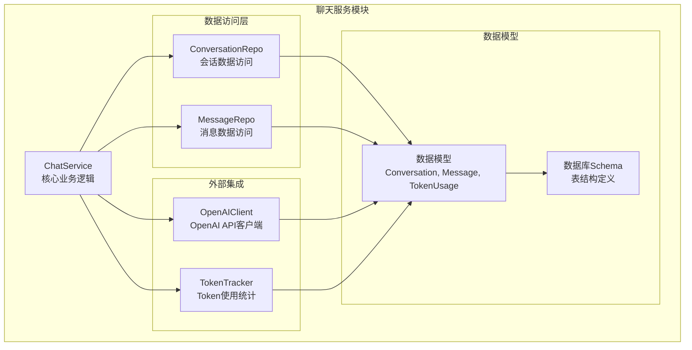
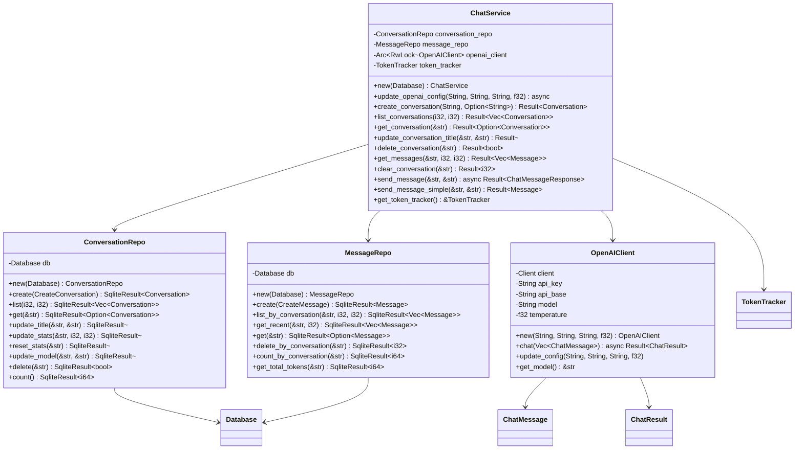
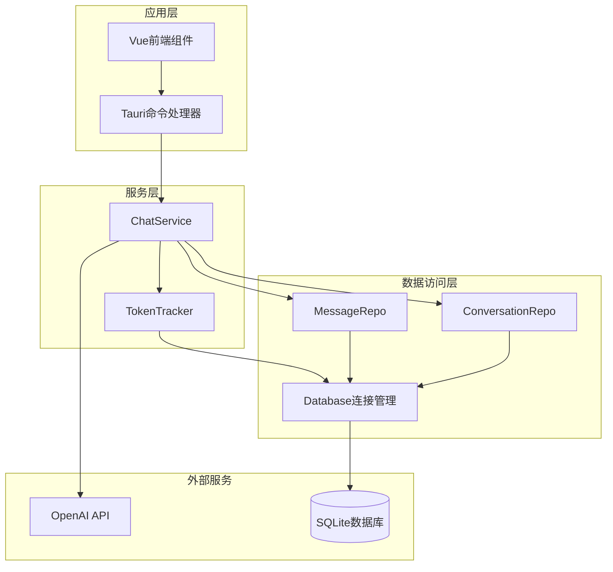
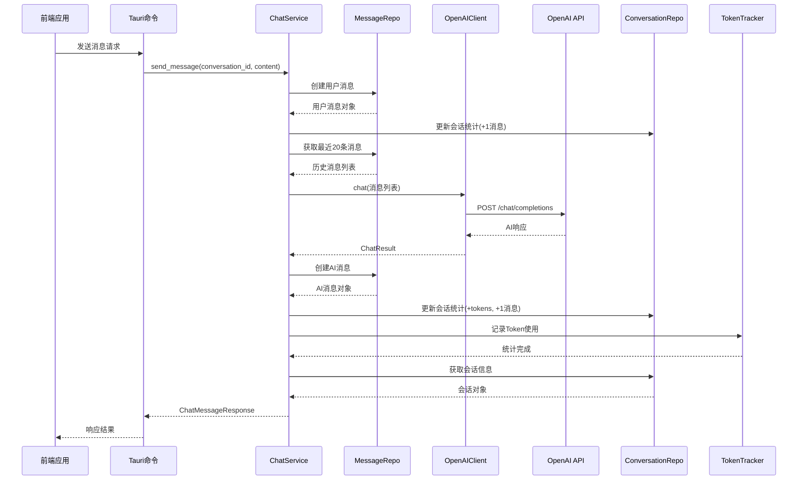
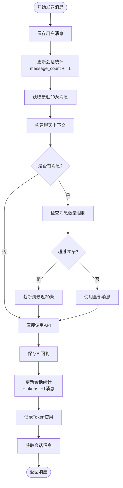
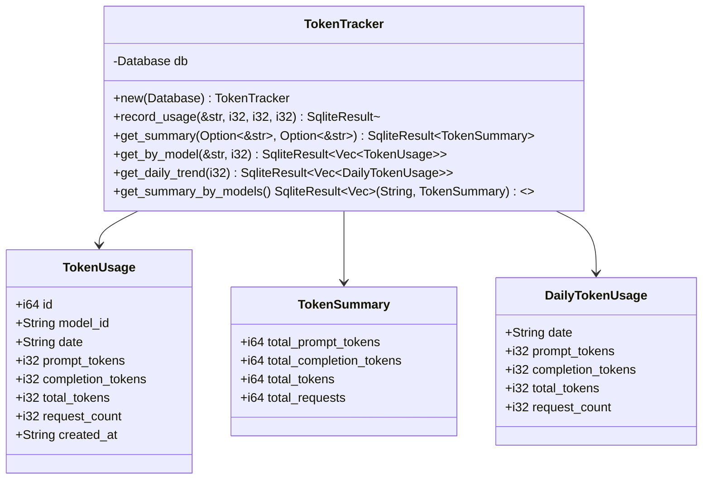
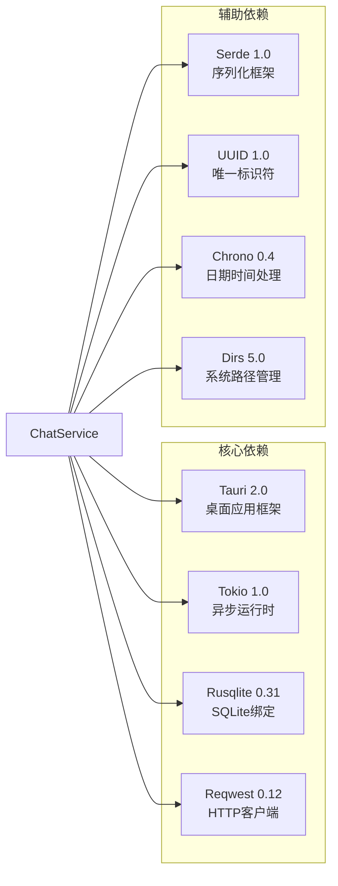
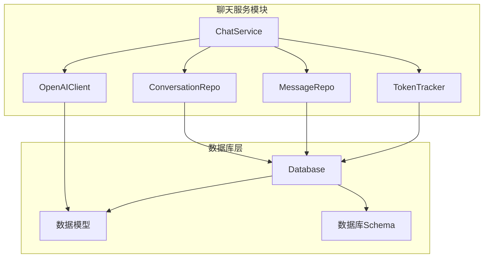

# 聊天服务模块

<cite>
**本文档引用的文件**
- [src-tauri/src/chat/mod.rs](file://src-tauri/src/chat/mod.rs)
- [src-tauri/src/chat/service.rs](file://src-tauri/src/chat/service.rs)
- [src-tauri/src/chat/conversation_repo.rs](file://src-tauri/src/chat/conversation_repo.rs)
- [src-tauri/src/chat/message_repo.rs](file://src-tauri/src/chat/message_repo.rs)
- [src-tauri/src/chat/openai_client.rs](file://src-tauri/src/chat/openai_client.rs)
- [src-tauri/src/database/models.rs](file://src-tauri/src/database/models.rs)
- [src-tauri/src/database/schema.rs](file://src-tauri/src/database/schema.rs)
- [src-tauri/src/database/connection.rs](file://src-tauri/src/database/connection.rs)
- [src-tauri/src/token_tracker/tracker.rs](file://src-tauri/src/token_tracker/tracker.rs)
- [src-tauri/src/token_tracker/mod.rs](file://src-tauri/src/token_tracker/mod.rs)
- [src-tauri/src/main.rs](file://src-tauri/src/main.rs)
- [src-tauri/Cargo.toml](file://src-tauri/Cargo.toml)
</cite>

## 目录
1. [简介](#简介)
2. [项目结构](#项目结构)
3. [核心组件](#核心组件)
4. [架构概览](#架构概览)
5. [详细组件分析](#详细组件分析)
6. [依赖关系分析](#依赖关系分析)
7. [性能考虑](#性能考虑)
8. [故障排除指南](#故障排除指南)
9. [结论](#结论)

## 简介

Malou Agent聊天服务模块是一个基于Rust和Tauri构建的桌面AI助手应用的核心组件。该模块实现了完整的聊天功能，包括会话管理、消息处理、上下文维护、OpenAI API集成以及Token使用统计等功能。系统采用Repository模式实现数据访问层，通过异步编程模型确保高性能和并发安全性。

## 项目结构

聊天服务模块位于`src-tauri/src/chat/`目录下，采用清晰的分层架构设计：

**图表来源**
- [src-tauri/src/chat/mod.rs](file://src-tauri/src/chat/mod.rs#L1-L10)
- [src-tauri/src/chat/service.rs](file://src-tauri/src/chat/service.rs#L1-L224)

**章节来源**
- [src-tauri/src/chat/mod.rs](file://src-tauri/src/chat/mod.rs#L1-L10)
- [src-tauri/src/chat/service.rs](file://src-tauri/src/chat/service.rs#L1-L224)

## 核心组件

### ChatService - 核心业务服务

ChatService是聊天服务模块的核心，负责协调各个子系统的协作。它使用Arc和RwLock包装OpenAI客户端，确保在多线程环境下的并发安全。

**图表来源**
- [src-tauri/src/chat/service.rs](file://src-tauri/src/chat/service.rs#L11-L224)
- [src-tauri/src/chat/conversation_repo.rs](file://src-tauri/src/chat/conversation_repo.rs#L4-L161)
- [src-tauri/src/chat/message_repo.rs](file://src-tauri/src/chat/message_repo.rs#L4-L175)
- [src-tauri/src/chat/openai_client.rs](file://src-tauri/src/chat/openai_client.rs#L5-L141)

### Repository模式实现

系统采用Repository模式实现数据访问层，提供清晰的抽象和良好的封装性：

**会话Repository (ConversationRepo)**
- 负责会话的CRUD操作
- 维护会话统计信息（Token使用量、消息数量）
- 支持会话列表查询和分页

**消息Repository (MessageRepo)**
- 负责消息的存储和检索
- 提供上下文构建功能（最近N条消息）
- 支持按会话查询和统计

**章节来源**
- [src-tauri/src/chat/conversation_repo.rs](file://src-tauri/src/chat/conversation_repo.rs#L1-L161)
- [src-tauri/src/chat/message_repo.rs](file://src-tauri/src/chat/message_repo.rs#L1-L175)

## 架构概览

聊天服务模块采用分层架构设计，各层职责明确，耦合度低：

**图表来源**
- [src-tauri/src/main.rs](file://src-tauri/src/main.rs#L242-L315)
- [src-tauri/src/chat/service.rs](file://src-tauri/src/chat/service.rs#L1-L224)

## 详细组件分析

### 消息发送流程

消息发送是聊天服务的核心流程，涉及多个步骤的协调工作：

**图表来源**
- [src-tauri/src/chat/service.rs](file://src-tauri/src/chat/service.rs#L94-L177)
- [src-tauri/src/chat/openai_client.rs](file://src-tauri/src/chat/openai_client.rs#L74-L116)

### 上下文维护机制

系统通过消息仓库的`get_recent`方法实现智能上下文维护：

**图表来源**
- [src-tauri/src/chat/service.rs](file://src-tauri/src/chat/service.rs#L114-L125)
- [src-tauri/src/chat/message_repo.rs](file://src-tauri/src/chat/message_repo.rs#L83-L113)

### OpenAI客户端集成

OpenAI客户端提供了完整的API封装，包括错误处理和配置管理：

**配置管理**
- 支持动态更新API密钥、基础URL、模型和温度参数
- 使用Arc<RwLock<>>确保线程安全的配置更新

**API调用封装**
- 异步HTTP请求处理
- 自动添加认证头和JSON内容类型
- 完整的错误处理和状态码检查

**数据模型映射**
- ChatMessage结构体映射OpenAI消息格式
- ChatResult封装响应内容和使用量统计

**章节来源**
- [src-tauri/src/chat/openai_client.rs](file://src-tauri/src/chat/openai_client.rs#L1-L141)

### Token使用统计

TokenTracker模块实现了完整的使用量跟踪功能：

**图表来源**
- [src-tauri/src/token_tracker/tracker.rs](file://src-tauri/src/token_tracker/tracker.rs#L4-L195)
- [src-tauri/src/database/models.rs](file://src-tauri/src/database/models.rs#L48-L78)

**章节来源**
- [src-tauri/src/token_tracker/tracker.rs](file://src-tauri/src/token_tracker/tracker.rs#L1-L195)

## 依赖关系分析

### 外部依赖

系统使用以下关键依赖包：

**图表来源**
- [src-tauri/Cargo.toml](file://src-tauri/Cargo.toml#L12-L25)

### 内部依赖关系

**图表来源**
- [src-tauri/src/chat/service.rs](file://src-tauri/src/chat/service.rs#L1-L18)
- [src-tauri/src/database/connection.rs](file://src-tauri/src/database/connection.rs#L8-L10)

**章节来源**
- [src-tauri/Cargo.toml](file://src-tauri/Cargo.toml#L1-L25)

## 性能考虑

### 并发安全设计

系统采用了多种并发安全机制：

1. **Arc<RwLock<>>模式**：OpenAI客户端使用Arc<RwLock<>>包装，支持多线程读取和独占写入
2. **Mutex保护**：应用状态使用Mutex保护，确保全局状态的一致性
3. **SQLite并发**：通过WAL模式提升并发性能，启用外键约束保证数据完整性

### 查询优化

1. **索引优化**：
   - 会话表按updated_at降序索引
   - 消息表按conversation_id和created_at组合索引
   - Token统计表按model_id和date组合索引

2. **查询限制**：
   - 默认获取最近20条消息构建上下文
   - 分页查询支持limit和offset参数

### 内存使用最佳实践

1. **异步流式处理**：使用Tokio异步运行时避免阻塞主线程
2. **延迟加载**：消息列表按需加载，支持分页
3. **资源管理**：正确管理数据库连接和HTTP客户端生命周期

### 缓存策略

1. **会话统计缓存**：会话级别的统计信息在内存中维护
2. **配置缓存**：OpenAI配置在内存中缓存，减少重复初始化

## 故障排除指南

### 常见问题及解决方案

**OpenAI API错误**
- 检查API密钥是否正确设置
- 验证网络连接和代理配置
- 查看API响应状态码和错误信息

**数据库连接问题**
- 确认数据库文件路径可写
- 检查SQLite扩展是否正确安装
- 验证外键约束和事务处理

**并发访问冲突**
- 确保使用正确的锁机制
- 避免在异步函数中持有锁过长时间
- 检查Arc和RwLock的使用方式

**章节来源**
- [src-tauri/src/chat/openai_client.rs](file://src-tauri/src/chat/openai_client.rs#L94-L98)
- [src-tauri/src/database/connection.rs](file://src-tauri/src/database/connection.rs#L22-L26)

## 结论

Malou Agent聊天服务模块展现了现代桌面应用开发的最佳实践。通过清晰的分层架构、完善的Repository模式实现、优雅的异步编程模型以及全面的错误处理机制，系统实现了高性能、高可用的聊天功能。

主要优势包括：
- **模块化设计**：职责分离明确，易于维护和扩展
- **并发安全**：采用多种并发控制机制确保线程安全
- **性能优化**：通过索引优化、缓存策略和异步处理提升性能
- **错误处理**：完善的错误处理和恢复机制
- **可扩展性**：清晰的接口设计便于功能扩展

未来可以考虑的改进方向：
- 实现完整的异步OpenAI集成
- 添加更多模型支持和配置选项
- 增强Token使用统计的可视化功能
- 优化消息上下文的智能截断算法