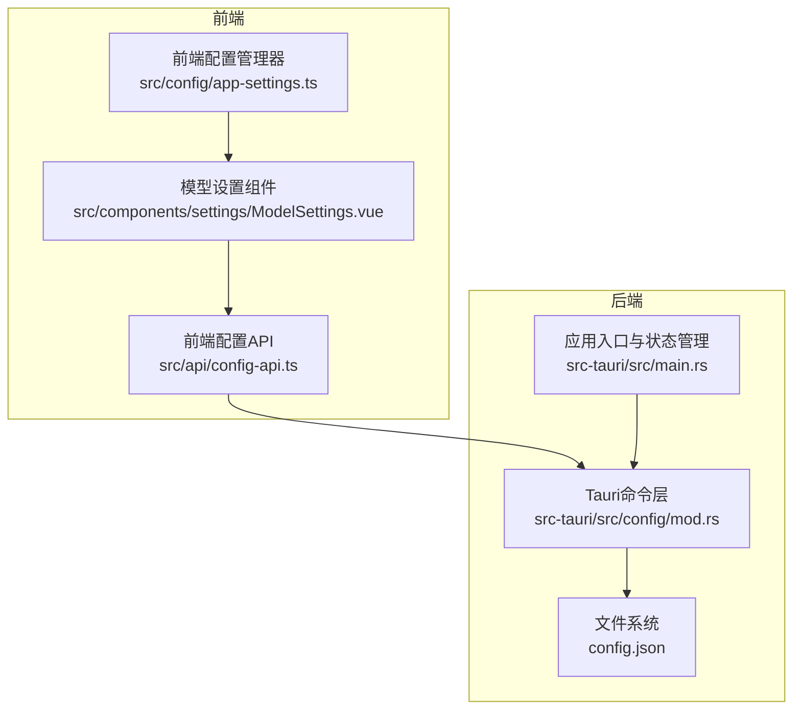
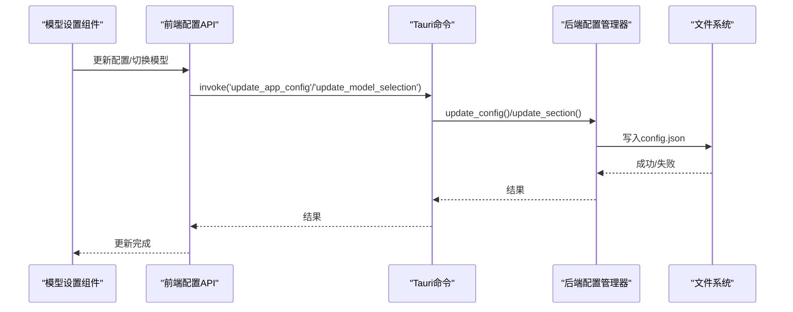
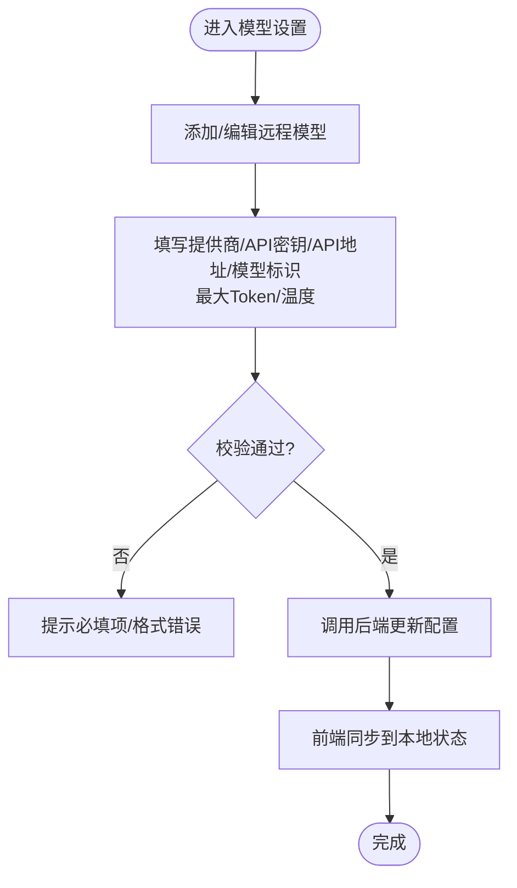
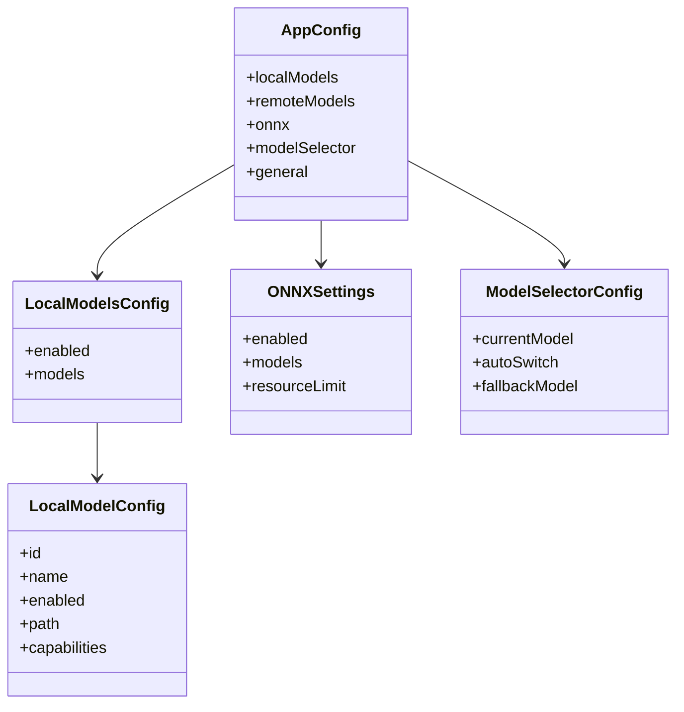
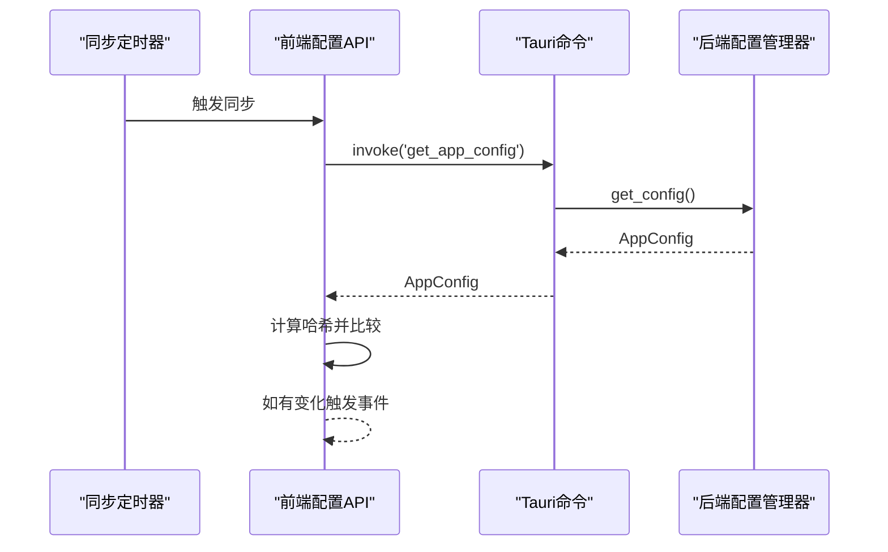
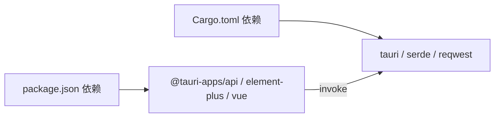

# 配置管理系统

<cite>
**本文档引用的文件**
- [src/config/index.ts](file://src/config/index.ts)
- [src/config/app-settings.ts](file://src/config/app-settings.ts)
- [src/config/model-config.ts](file://src/config/model-config.ts)
- [src/api/config-api.ts](file://src/api/config-api.ts)
- [src-tauri/src/config/mod.rs](file://src-tauri/src/config/mod.rs)
- [src-tauri/src/main.rs](file://src-tauri/src/main.rs)
- [src/components/settings/ModelSettings.vue](file://src/components/settings/ModelSettings.vue)
- [src/utils/config-test.ts](file://src/utils/config-test.ts)
- [docs/configuration-management.md](file://docs/configuration-management.md)
- [src-tauri/Cargo.toml](file://src-tauri/Cargo.toml)
- [package.json](file://package.json)
</cite>

## 目录
1. [简介](#简介)
2. [项目结构](#项目结构)
3. [核心组件](#核心组件)
4. [架构总览](#架构总览)
5. [详细组件分析](#详细组件分析)
6. [依赖关系分析](#依赖关系分析)
7. [性能考量](#性能考量)
8. [故障排除指南](#故障排除指南)
9. [结论](#结论)
10. [附录](#附录)

## 简介
本文件为 Malou Agent 配置管理系统的技术文档，围绕配置文件格式、存储位置与加载机制，以及 OpenAI 与本地模型的配置管理进行深入解析。文档还涵盖配置验证、默认值设置、错误处理、热更新与备份恢复能力，并讨论安全考虑（敏感信息保护与访问控制）。系统采用前端 Vue + Tauri 的混合架构，通过 Tauri 命令桥接前后端，实现配置的持久化与实时同步。

## 项目结构
配置管理涉及三层：前端 TypeScript/Vue 层负责用户界面与本地状态；Tauri Rust 层负责持久化存储与后端命令；二者通过 Tauri invoke 通信。

**图表来源**
- [src/api/config-api.ts](file://src/api/config-api.ts#L1-L201)
- [src-tauri/src/config/mod.rs](file://src-tauri/src/config/mod.rs#L1-L334)
- [src-tauri/src/main.rs](file://src-tauri/src/main.rs#L240-L316)

**章节来源**
- [src/config/index.ts](file://src/config/index.ts#L1-L3)
- [src/config/app-settings.ts](file://src/config/app-settings.ts#L1-L195)
- [src/config/model-config.ts](file://src/config/model-config.ts#L1-L163)
- [src/api/config-api.ts](file://src/api/config-api.ts#L1-L201)
- [src-tauri/src/config/mod.rs](file://src-tauri/src/config/mod.rs#L1-L334)
- [src-tauri/src/main.rs](file://src-tauri/src/main.rs#L240-L316)

## 核心组件
- 前端配置管理器：提供响应式配置读取、更新、合并、导出导入、模型选择与 ONNX 功能开关查询。
- 后端配置管理器：负责配置文件的读写、默认配置生成、当前模型解析与 ONNX 开关查询。
- 前端 API 封装：统一转换前后端配置结构，暴露获取/更新配置、模型切换、ONNX 功能切换等方法。
- 配置同步管理器：基于轮询的配置变更检测与事件派发，实现热更新。
- 模型设置组件：提供图形化界面，支持远程模型（含 OpenAI/Azure/自定义）、本地 ONNX 模型、ONNX 辅助功能与资源限制配置。

**章节来源**
- [src/config/app-settings.ts](file://src/config/app-settings.ts#L6-L183)
- [src-tauri/src/config/mod.rs](file://src-tauri/src/config/mod.rs#L144-L248)
- [src/api/config-api.ts](file://src/api/config-api.ts#L5-L134)
- [src/components/settings/ModelSettings.vue](file://src/components/settings/ModelSettings.vue#L1-L580)

## 架构总览
系统采用“前端响应式 + 后端持久化”的双层架构。前端通过 API 将配置转换为后端结构，后端以 JSON 文件形式持久化到应用配置目录。当前模型解析与 ONNX 开关由后端统一维护，前端仅负责展示与交互。

**图表来源**
- [src/api/config-api.ts](file://src/api/config-api.ts#L62-L124)
- [src-tauri/src/config/mod.rs](file://src-tauri/src/config/mod.rs#L193-L206)
- [src-tauri/src/main.rs](file://src-tauri/src/main.rs#L305-L312)

## 详细组件分析

### 配置文件格式与存储位置
- 前端默认配置与类型定义位于 TypeScript 模块，包含本地模型、远程模型、ONNX 设置、模型选择器与通用设置字段。
- 后端默认配置与类型定义位于 Rust 模块，结构与前端一一对应，使用 serde 序列化/反序列化。
- 存储位置：后端配置文件保存在应用配置目录下的 config.json，首次运行若不存在则自动生成默认配置。

**章节来源**
- [src/config/model-config.ts](file://src/config/model-config.ts#L43-L116)
- [src-tauri/src/config/mod.rs](file://src-tauri/src/config/mod.rs#L58-L142)
- [src-tauri/src/config/mod.rs](file://src-tauri/src/config/mod.rs#L167-L187)

### 加载机制与生命周期
- 前端：启动时从 localStorage 加载配置，若失败则回退到默认配置；支持自动保存与深度监听。
- 后端：启动时从应用配置目录加载 config.json，若不存在则生成默认配置并写入文件。

**章节来源**
- [src/config/app-settings.ts](file://src/config/app-settings.ts#L152-L171)
- [src-tauri/src/config/mod.rs](file://src-tauri/src/config/mod.rs#L149-L178)

### OpenAI 配置管理
- 远程模型配置项包含提供商、API 密钥、API 基础 URL、模型标识、最大 Token 数与温度参数。
- 前端组件提供表单控件，支持添加/删除远程模型、密码输入框（隐藏显示）、滑块调节温度、数值输入设置最大 Token。
- 后端命令提供获取/更新当前模型信息、切换模型选择等能力，便于在聊天服务中按需调用。

**图表来源**
- [src/components/settings/ModelSettings.vue](file://src/components/settings/ModelSettings.vue#L350-L440)
- [src/api/config-api.ts](file://src/api/config-api.ts#L62-L114)

**章节来源**
- [src/config/model-config.ts](file://src/config/model-config.ts#L12-L22)
- [src/components/settings/ModelSettings.vue](file://src/components/settings/ModelSettings.vue#L375-L437)
- [src-tauri/src/config/mod.rs](file://src-tauri/src/config/mod.rs#L189-L238)

### 本地模型配置管理（ONNX）
- 本地模型启用/禁用、模型路径、能力标签（如嵌入、NER、分类）与 ONNX 资源限制（最大内存、最大线程数）均可配置。
- 前端组件提供开关与输入控件，后端命令支持切换本地模型启用状态与 ONNX 功能开关。
- 当前模型解析优先匹配远程模型，其次匹配本地模型，最后回退到后备模型。

**图表来源**
- [src/config/model-config.ts](file://src/config/model-config.ts#L43-L56)
- [src/config/model-config.ts](file://src/config/model-config.ts#L6-L10)
- [src/config/model-config.ts](file://src/config/model-config.ts#L24-L35)
- [src/config/model-config.ts](file://src/config/model-config.ts#L37-L41)

**章节来源**
- [src/config/model-config.ts](file://src/config/model-config.ts#L6-L116)
- [src-tauri/src/config/mod.rs](file://src-tauri/src/config/mod.rs#L67-L78)
- [src-tauri/src/config/mod.rs](file://src-tauri/src/config/mod.rs#L208-L238)

### 配置验证机制
- 参数校验：远程模型启用时必须提供 API 密钥与 API 地址；启用本地模型时至少配置一个模型。
- 默认值设置：前后端均提供默认配置，确保首次运行与缺失字段时的健壮性。
- 错误处理：前端导入配置时捕获 JSON 解析异常；后端读写文件时捕获 IO 异常；命令执行返回错误字符串。

**章节来源**
- [src/config/model-config.ts](file://src/config/model-config.ts#L118-L138)
- [src/config/app-settings.ts](file://src/config/app-settings.ts#L65-L75)
- [src-tauri/src/config/mod.rs](file://src-tauri/src/config/mod.rs#L167-L187)

### 配置热更新与同步
- 前端提供配置同步管理器，定时轮询后端配置并计算哈希，若发生变化则触发 configChanged 事件，实现热更新。
- 前端配置管理器支持深度监听与自动保存，减少手动操作成本。

**图表来源**
- [src/api/config-api.ts](file://src/api/config-api.ts#L173-L199)
- [src-tauri/src/config/mod.rs](file://src-tauri/src/config/mod.rs#L189-L191)

**章节来源**
- [src/api/config-api.ts](file://src/api/config-api.ts#L136-L199)
- [src/config/app-settings.ts](file://src/config/app-settings.ts#L173-L179)

### 配置备份与恢复
- 前端组件提供导出/导入配置功能，便于用户备份与迁移。
- 文档中描述了通用设置中的备份间隔字段，可作为未来扩展的基础。

**章节来源**
- [src/components/settings/ModelSettings.vue](file://src/components/settings/ModelSettings.vue#L181-L215)
- [docs/configuration-management.md](file://docs/configuration-management.md#L147-L153)

### 安全考虑
- 敏感信息保护：远程模型 API 密钥在前端以密码输入框呈现，避免明文显示；建议后端对敏感字段进行加密存储与传输。
- 访问控制：Tauri 命令调用应结合权限模型与沙箱策略，限制不必要的系统访问。
- 传输安全：远程模型 API 建议使用 HTTPS，避免中间人攻击。

**章节来源**
- [src/components/settings/ModelSettings.vue](file://src/components/settings/ModelSettings.vue#L397-L403)
- [src-tauri/Cargo.toml](file://src-tauri/Cargo.toml#L24-L24)

## 依赖关系分析
- 前端依赖：@tauri-apps/api 提供 invoke 能力；Element Plus 提供图形化组件；Vue 响应式系统驱动状态。
- 后端依赖：tauri、serde、serde_json、reqwest（HTTP 客户端）等，支撑命令与网络通信。
- 前后端通信：通过 Tauri 命令注册与 invoke 调用建立稳定的数据通道。

**图表来源**
- [package.json](file://package.json#L14-L22)
- [src-tauri/Cargo.toml](file://src-tauri/Cargo.toml#L12-L25)

**章节来源**
- [package.json](file://package.json#L1-L31)
- [src-tauri/Cargo.toml](file://src-tauri/Cargo.toml#L1-L25)

## 性能考量
- 前端：使用深度监听与自动保存时注意节流/去抖，避免频繁写入；大配置对象更新时建议分段处理。
- 后端：配置文件读写采用一次性序列化/反序列化，建议在高并发场景下增加互斥锁或原子写入。
- 网络：远程模型调用应缓存常用配置，减少重复请求；ONNX 推理建议合理设置资源上限，避免抢占系统资源。

## 故障排除指南
- 配置导入失败：检查 JSON 格式与字段完整性；查看前端错误提示与控制台日志。
- 配置保存失败：检查本地存储权限与磁盘空间；后端检查文件写入权限与路径。
- 模型切换无效：确认目标模型处于启用状态且具备有效配置；检查当前模型解析逻辑与后备模型设置。
- 热更新无响应：确认同步定时器已启动；检查网络连通性与后端命令可用性。

**章节来源**
- [src/config/app-settings.ts](file://src/config/app-settings.ts#L65-L75)
- [src/api/config-api.ts](file://src/api/config-api.ts#L173-L199)
- [src-tauri/src/config/mod.rs](file://src-tauri/src/config/mod.rs#L167-L187)

## 结论
Malou Agent 的配置管理系统通过前后端协同，实现了灵活的模型配置、稳健的持久化与便捷的图形化管理。OpenAI 与本地模型的配置分离清晰，验证与默认值机制提升了系统的健壮性。建议后续增强后端敏感字段加密、完善备份策略与细粒度访问控制，进一步提升安全性与可运维性。

## 附录
- 快速测试：可通过工具脚本运行配置功能测试，验证获取、更新、前端管理器与当前模型获取流程。

**章节来源**
- [src/utils/config-test.ts](file://src/utils/config-test.ts#L5-L53)