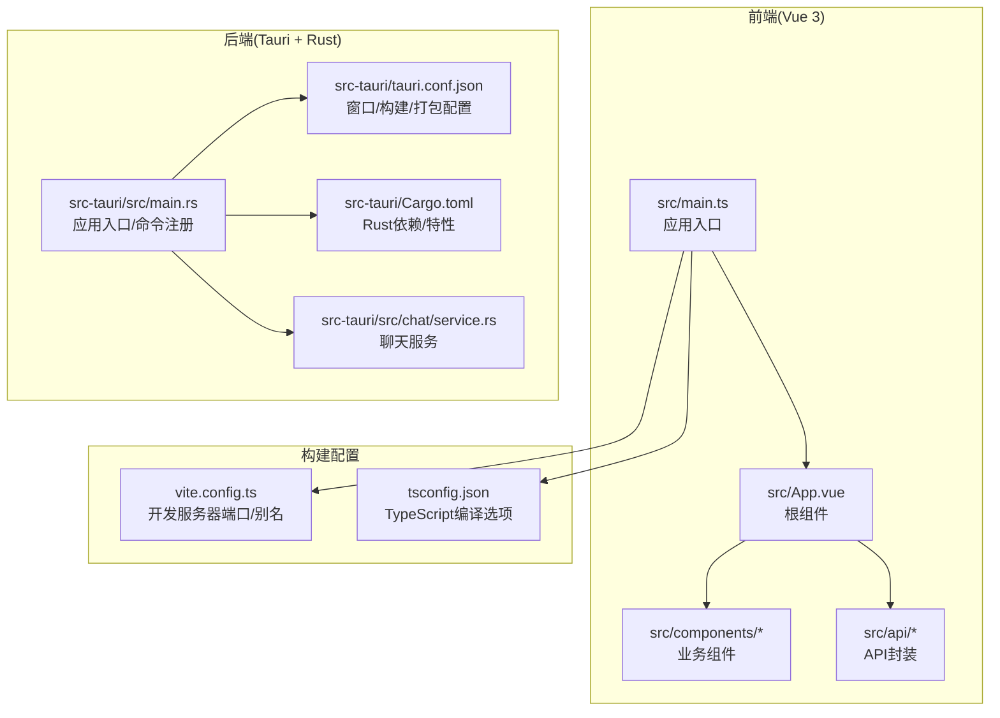
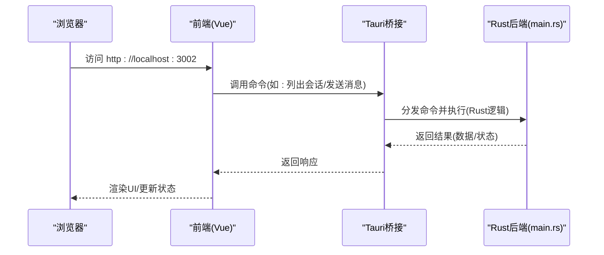
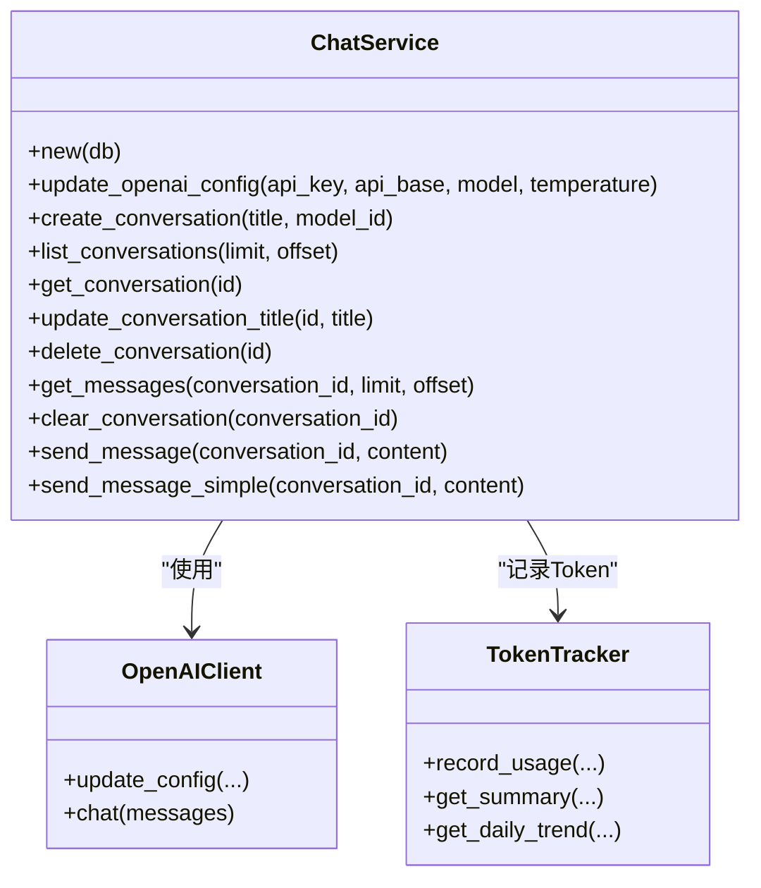
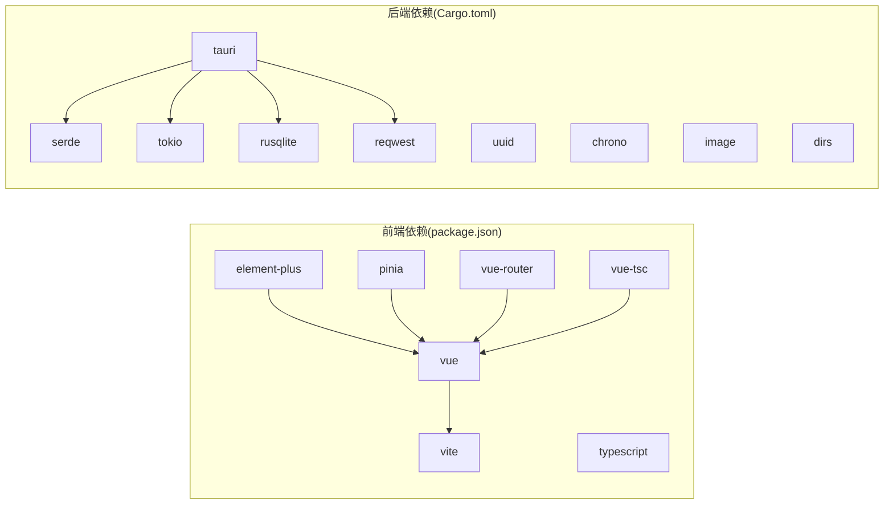

# 快速开始

<cite>
**本文引用的文件**
- [README.md](file://README.md)
- [docs/development-setup.md](file://docs/development-setup.md)
- [package.json](file://package.json)
- [vite.config.ts](file://vite.config.ts)
- [src/main.ts](file://src/main.ts)
- [src-tauri/Cargo.toml](file://src-tauri/Cargo.toml)
- [src-tauri/tauri.conf.json](file://src-tauri/tauri.conf.json)
- [src-tauri/src/main.rs](file://src-tauri/src/main.rs)
- [src-tauri/src/chat/service.rs](file://src-tauri/src/chat/service.rs)
- [tsconfig.json](file://tsconfig.json)
</cite>

## 目录
1. [简介](#简介)
2. [项目结构](#项目结构)
3. [核心组件](#核心组件)
4. [架构总览](#架构总览)
5. [详细组件分析](#详细组件分析)
6. [依赖关系分析](#依赖关系分析)
7. [性能注意事项](#性能注意事项)
8. [故障排除指南](#故障排除指南)
9. [结论](#结论)
10. [附录](#附录)

## 简介
Malou Agent 是一个基于 Tauri + Vue 3 的 Windows 桌面 AI 代理应用，具备智能聊天、文档管理、本地 ONNX 推理、向量数据库搜索与插件化技能系统等能力。本“快速开始”旨在帮助新手开发者在最短时间内完成环境准备、项目克隆、依赖安装、开发服务器启动，并提供常见问题排查与生产构建打包指引。

## 项目结构
项目采用前后端分离架构：
- 前端：Vue 3 + TypeScript + Vite + Element Plus + Pinia
- 后端：Tauri v2 + Rust + SQLite + ONNX 推理引擎 + 可选 ChromaDB 向量数据库
- 构建与打包：Vite 构建前端，Tauri 负责打包桌面应用

图表来源
- [src/main.ts](file://src/main.ts#L1-L13)
- [vite.config.ts](file://vite.config.ts#L1-L17)
- [tsconfig.json](file://tsconfig.json#L1-L24)
- [src-tauri/src/main.rs](file://src-tauri/src/main.rs#L1-L323)
- [src-tauri/tauri.conf.json](file://src-tauri/tauri.conf.json#L1-L32)
- [src-tauri/Cargo.toml](file://src-tauri/Cargo.toml#L1-L25)
- [src-tauri/src/chat/service.rs](file://src-tauri/src/chat/service.rs#L1-L214)

章节来源
- [README.md](file://README.md#L45-L61)
- [src/main.ts](file://src/main.ts#L1-L13)
- [vite.config.ts](file://vite.config.ts#L1-L17)
- [tsconfig.json](file://tsconfig.json#L1-L24)
- [src-tauri/src/main.rs](file://src-tauri/src/main.rs#L1-L323)
- [src-tauri/tauri.conf.json](file://src-tauri/tauri.conf.json#L1-L32)
- [src-tauri/Cargo.toml](file://src-tauri/Cargo.toml#L1-L25)
- [src-tauri/src/chat/service.rs](file://src-tauri/src/chat/service.rs#L1-L214)

## 核心组件
- 前端应用入口与依赖注入：在应用入口中注册 Pinia、Element Plus 并挂载根组件。
- Vite 开发服务器：默认监听本地端口，支持路径别名与严格端口模式。
- Tauri 应用入口：初始化数据库、配置管理器与聊天服务，注册命令供前端调用。
- Rust 聊天服务：负责会话/消息持久化、OpenAI 客户端交互与 Token 统计。

章节来源
- [src/main.ts](file://src/main.ts#L1-L13)
- [vite.config.ts](file://vite.config.ts#L13-L16)
- [src-tauri/src/main.rs](file://src-tauri/src/main.rs#L249-L322)
- [src-tauri/src/chat/service.rs](file://src-tauri/src/chat/service.rs#L1-L214)

## 架构总览
下图展示了从浏览器到桌面应用的典型开发流程：前端通过 Vite 启动开发服务器，Tauri 作为后端承载 Rust 命令与本地资源，二者通过 Tauri Bridge 进行通信。

图表来源
- [src-tauri/src/main.rs](file://src-tauri/src/main.rs#L292-L319)
- [src-tauri/tauri.conf.json](file://src-tauri/tauri.conf.json#L7-L9)
- [vite.config.ts](file://vite.config.ts#L13-L16)

## 详细组件分析

### 环境要求与安装步骤
- 系统要求
  - Windows 10/11
  - Node.js 18+
  - Rust 1.70+
  - npm 或 yarn
- 安装步骤
  - 安装 Node.js 依赖：在项目根目录执行安装命令
  - 安装 Rust 工具链与 Tauri CLI：按顺序安装 Rust 工具链并安装 Tauri CLI
  - 启动开发环境：分别启动前端开发服务器与桌面应用

章节来源
- [docs/development-setup.md](file://docs/development-setup.md#L3-L8)
- [docs/development-setup.md](file://docs/development-setup.md#L12-L15)
- [docs/development-setup.md](file://docs/development-setup.md#L17-L24)
- [docs/development-setup.md](file://docs/development-setup.md#L26-L33)

### 项目克隆与依赖安装
- 克隆仓库后，在项目根目录执行安装命令以安装前端依赖
- 安装完成后，进入 src-tauri 目录并通过 Tauri CLI 启动桌面应用

章节来源
- [README.md](file://README.md#L29-L43)
- [docs/development-setup.md](file://docs/development-setup.md#L12-L15)
- [docs/development-setup.md](file://docs/development-setup.md#L26-L33)

### 开发服务器启动
- 前端开发服务器：在项目根目录启动 Vite 开发服务器，默认监听本地端口
- 桌面应用：在新终端中进入 src-tauri 目录，使用 Tauri CLI 启动桌面应用

章节来源
- [docs/development-setup.md](file://docs/development-setup.md#L26-L33)
- [vite.config.ts](file://vite.config.ts#L13-L16)
- [src-tauri/tauri.conf.json](file://src-tauri/tauri.conf.json#L7-L9)

### 生产构建与打包
- 前端构建：在项目根目录执行构建命令生成 dist 目录
- 桌面应用打包：在 src-tauri 目录使用 Tauri CLI 执行打包命令，生成平台安装包

章节来源
- [README.md](file://README.md#L38-L43)
- [package.json](file://package.json#L8-L12)
- [src-tauri/tauri.conf.json](file://src-tauri/tauri.conf.json#L25-L31)

### 关键配置说明
- 前端配置
  - Vite 开发服务器端口与严格端口模式
  - TypeScript 编译选项与路径别名
- 后端配置
  - Tauri 应用名称、窗口尺寸、安全策略
  - 构建前/后命令与前端产物目录
  - 打包目标与图标

章节来源
- [vite.config.ts](file://vite.config.ts#L13-L16)
- [tsconfig.json](file://tsconfig.json#L1-L24)
- [src-tauri/tauri.conf.json](file://src-tauri/tauri.conf.json#L1-L32)

### Rust 聊天服务与命令
- Rust 主入口负责初始化数据库、配置管理器与聊天服务，并注册一系列命令供前端调用
- 聊天服务提供会话管理、消息管理、Token 统计与 OpenAI 配置等功能

图表来源
- [src-tauri/src/chat/service.rs](file://src-tauri/src/chat/service.rs#L1-L214)
- [src-tauri/src/main.rs](file://src-tauri/src/main.rs#L1-L323)

章节来源
- [src-tauri/src/main.rs](file://src-tauri/src/main.rs#L249-L322)
- [src-tauri/src/chat/service.rs](file://src-tauri/src/chat/service.rs#L1-L214)

## 依赖关系分析
- 前端依赖
  - Vue 3、Element Plus、Pinia、Vue Router
  - Vite、TypeScript、vue-tsc
- 后端依赖
  - Tauri v2、Serde、Tokio、UUID、Chrono、Image、Dirs
  - SQLite(rusqlite)、HTTP客户端(reqwest)

图表来源
- [package.json](file://package.json#L14-L29)
- [src-tauri/Cargo.toml](file://src-tauri/Cargo.toml#L12-L25)

章节来源
- [package.json](file://package.json#L14-L29)
- [src-tauri/Cargo.toml](file://src-tauri/Cargo.toml#L12-L25)

## 性能注意事项
- 前端开发服务器端口建议保持默认，避免端口冲突导致的启动失败
- TypeScript 严格模式有助于早期发现类型问题，减少运行时错误
- Rust 异步任务与 Tokio 运行时可提升并发处理能力；注意合理拆分任务与资源竞争
- SQLite 适合本地轻量场景；若需要高并发或复杂查询，可考虑外部数据库或优化索引

## 故障排除指南
- 编译错误
  - 清理缓存并重新安装依赖
- 数据库问题
  - 删除用户数据目录中的数据库文件后重启应用以重新初始化
- Tauri 相关问题
  - 更新 Tauri CLI 至最新版本

章节来源
- [docs/development-setup.md](file://docs/development-setup.md#L59-L82)

## 结论
通过本快速开始指南，您可以在 Windows 环境下完成 Malou Agent 的环境准备、项目启动与基本开发流程。建议在熟悉开发流程后再进行生产构建与打包，以获得更稳定的桌面应用体验。

## 附录
- 实际命令示例与预期输出
  - 安装前端依赖：在项目根目录执行安装命令，等待依赖下载完成
  - 启动前端开发服务器：在项目根目录执行启动命令，浏览器访问开发服务器地址
  - 启动桌面应用：在新终端中进入 src-tauri 目录并执行启动命令，观察控制台输出
  - 生产构建：在项目根目录执行构建命令，生成 dist 目录
  - 打包桌面应用：在 src-tauri 目录执行打包命令，生成平台安装包

章节来源
- [README.md](file://README.md#L29-L43)
- [docs/development-setup.md](file://docs/development-setup.md#L12-L15)
- [docs/development-setup.md](file://docs/development-setup.md#L26-L33)
- [docs/development-setup.md](file://docs/development-setup.md#L59-L82)
- [package.json](file://package.json#L8-L12)
- [src-tauri/tauri.conf.json](file://src-tauri/tauri.conf.json#L25-L31)