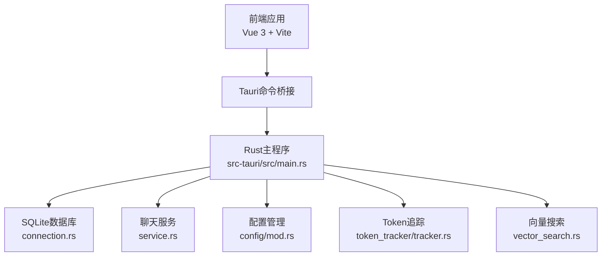
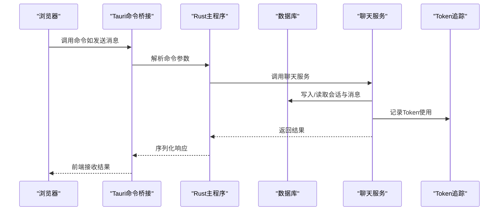
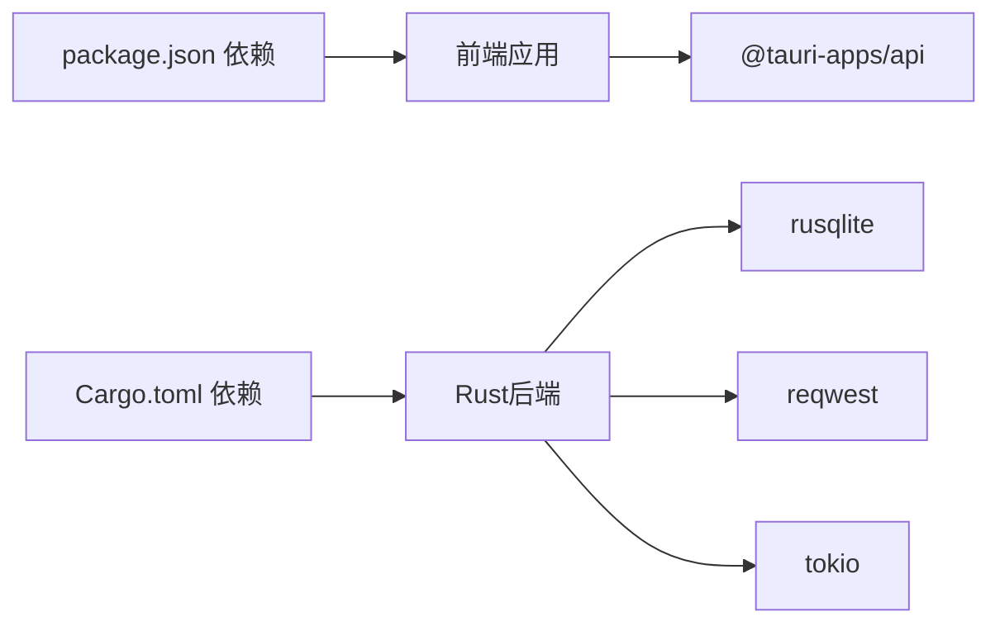

# 故障排除

<cite>
**本文引用的文件**
- [README.md](file://README.md)
- [package.json](file://package.json)
- [vite.config.ts](file://vite.config.ts)
- [tauri.conf.json](file://src-tauri/tauri.conf.json)
- [Cargo.toml（Rust）](file://src-tauri/Cargo.toml)
- [src/main.ts](file://src/main.ts)
- [src-tauri/src/main.rs](file://src-tauri/src/main.rs)
- [src-tauri/src/chat/service.rs](file://src-tauri/src/chat/service.rs)
- [src-tauri/src/database/connection.rs](file://src-tauri/src/database/connection.rs)
- [src-tauri/src/config/mod.rs](file://src-tauri/src/config/mod.rs)
- [src-tauri/src/token_tracker/tracker.rs](file://src-tauri/src/token_tracker/tracker.rs)
- [src-tauri/src/vector_search.rs](file://src-tauri/src/vector_search.rs)
- [src/utils/logger.ts](file://src/utils/logger.ts)
- [src/utils/logger-test.ts](file://src/utils/logger-test.ts)
</cite>

## 目录
1. [简介](#简介)
2. [项目结构](#项目结构)
3. [核心组件](#核心组件)
4. [架构总览](#架构总览)
5. [详细组件分析](#详细组件分析)
6. [依赖关系分析](#依赖关系分析)
7. [性能考虑](#性能考虑)
8. [故障排除指南](#故障排除指南)
9. [结论](#结论)
10. [附录](#附录)

## 简介
本指南面向Malou Agent项目的开发者与运维人员，聚焦于启动失败、性能问题、配置错误、兼容性与依赖冲突、日志与异常定位、性能瓶颈与资源优化、监控与告警等主题。文档结合前端Vue/Tauri与后端Rust的实际代码实现，提供可操作的排障步骤与最佳实践。

## 项目结构
Malou Agent采用前后端分离架构：前端使用Vue 3 + TypeScript + Vite，后端使用Tauri 2 + Rust。前端通过Tauri命令桥接调用Rust后端能力，后端负责数据库、聊天服务、ONNX模型配置、向量搜索与Token统计等。

图表来源
- [src/main.ts](file://src/main.ts#L1-L13)
- [src-tauri/src/main.rs](file://src-tauri/src/main.rs#L242-L315)
- [src-tauri/src/database/connection.rs](file://src-tauri/src/database/connection.rs#L1-L89)
- [src-tauri/src/chat/service.rs](file://src-tauri/src/chat/service.rs#L1-L224)
- [src-tauri/src/config/mod.rs](file://src-tauri/src/config/mod.rs#L1-L334)
- [src-tauri/src/token_tracker/tracker.rs](file://src-tauri/src/token_tracker/tracker.rs#L1-L195)
- [src-tauri/src/vector_search.rs](file://src-tauri/src/vector_search.rs#L1-L84)

章节来源
- [README.md](file://README.md#L1-L76)
- [package.json](file://package.json#L1-L31)
- [vite.config.ts](file://vite.config.ts#L1-L17)
- [tauri.conf.json](file://src-tauri/tauri.conf.json#L1-L32)

## 核心组件
- 前端应用入口与依赖注入：应用挂载、Pinia状态管理、Element Plus UI注册。
- Rust后端入口：初始化数据库、配置管理器、ChatService，并注册Tauri命令。
- 数据库层：SQLite连接、WAL模式、外键约束、模式初始化。
- 聊天服务：会话与消息管理、OpenAI客户端封装、Token统计。
- 配置管理：应用配置持久化、当前模型选择、ONNX功能开关与资源限制。
- Token追踪：按日聚合统计、按模型分组、趋势查询。
- 向量搜索：相似度度量与Top-K检索。
- 日志系统：前端日志类与测试脚本。

章节来源
- [src/main.ts](file://src/main.ts#L1-L13)
- [src-tauri/src/main.rs](file://src-tauri/src/main.rs#L242-L315)
- [src-tauri/src/database/connection.rs](file://src-tauri/src/database/connection.rs#L1-L89)
- [src-tauri/src/chat/service.rs](file://src-tauri/src/chat/service.rs#L1-L224)
- [src-tauri/src/config/mod.rs](file://src-tauri/src/config/mod.rs#L1-L334)
- [src-tauri/src/token_tracker/tracker.rs](file://src-tauri/src/token_tracker/tracker.rs#L1-L195)
- [src-tauri/src/vector_search.rs](file://src-tauri/src/vector_search.rs#L1-L84)
- [src/utils/logger.ts](file://src/utils/logger.ts#L1-L95)
- [src/utils/logger-test.ts](file://src/utils/logger-test.ts#L1-L20)

## 架构总览
下图展示从浏览器到Rust后端的关键调用链与数据流。

图表来源
- [src-tauri/src/main.rs](file://src-tauri/src/main.rs#L140-L161)
- [src-tauri/src/chat/service.rs](file://src-tauri/src/chat/service.rs#L94-L177)
- [src-tauri/src/token_tracker/tracker.rs](file://src-tauri/src/token_tracker/tracker.rs#L14-L48)
- [src-tauri/src/database/connection.rs](file://src-tauri/src/database/connection.rs#L50-L57)

## 详细组件分析

### 前端应用入口与开发服务器
- 应用挂载与插件注册：确保Element Plus与Pinia正确注入。
- 开发服务器端口与别名：Vite默认端口与路径别名配置。
- Tauri开发命令：前端与后端联调时的启动顺序与URL配置。

章节来源
- [src/main.ts](file://src/main.ts#L1-L13)
- [vite.config.ts](file://vite.config.ts#L1-L17)
- [tauri.conf.json](file://src-tauri/tauri.conf.json#L5-L10)

### Rust后端入口与命令注册
- 初始化流程：数据库路径、数据库初始化、ChatService创建、配置管理器初始化。
- 命令注册：会话管理、消息管理、Token统计、OpenAI配置、配置管理等命令。
- 线程安全：AppState持有互斥体，避免并发访问问题。

章节来源
- [src-tauri/src/main.rs](file://src-tauri/src/main.rs#L242-L315)

### 数据库连接与模式初始化
- 连接管理：Arc + Mutex包装rusqlite连接，支持多处克隆。
- 模式初始化：首次打开自动执行SQL脚本创建表。
- 性能优化：启用WAL模式与外键约束。

章节来源
- [src-tauri/src/database/connection.rs](file://src-tauri/src/database/connection.rs#L1-L89)

### 聊天服务与消息处理
- 会话与消息：创建、查询、清理、统计更新。
- 异步调用：OpenAI客户端通过Arc<RwLock<...>>实现Send + Sync。
- Token统计：根据返回usage记录prompt/completion/total tokens。
- 简易回退：在未启用远程模型时返回echo消息。

章节来源
- [src-tauri/src/chat/service.rs](file://src-tauri/src/chat/service.rs#L1-L224)

### 配置管理与模型选择
- 配置持久化：默认配置生成、JSON序列化写入。
- 当前模型选择：优先远程可用模型，否则回退本地模型。
- ONNX功能开关：按模型类型启用/禁用，配合资源限制。

章节来源
- [src-tauri/src/config/mod.rs](file://src-tauri/src/config/mod.rs#L1-L334)

### Token追踪与趋势分析
- 按日聚合：同一天多次请求累加，不存在则插入。
- 汇总查询：支持按时间范围聚合。
- 按模型分组：支持按模型维度统计。
- 日趋势：按日期聚合请求次数与Token总量。

章节来源
- [src-tauri/src/token_tracker/tracker.rs](file://src-tauri/src/token_tracker/tracker.rs#L1-L195)

### 向量搜索与相似度度量
- 接口抽象：SimilarityMetric统一cosine与欧氏距离。
- 检索流程：遍历文档集合计算相似度，排序取Top-K。
- 线程安全：度量实现满足Send + Sync。

章节来源
- [src-tauri/src/vector_search.rs](file://src-tauri/src/vector_search.rs#L1-L84)

### 日志系统与测试
- 前端日志类：统一级别、限制数量、控制台输出。
- 测试脚本：验证日志级别、过滤与最近日志获取。

章节来源
- [src/utils/logger.ts](file://src/utils/logger.ts#L1-L95)
- [src/utils/logger-test.ts](file://src/utils/logger-test.ts#L1-L20)

## 依赖关系分析
- 前端依赖：Vue 3、Element Plus、Pinia、Vite、@tauri-apps/api等。
- 后端依赖：Tauri 2、rusqlite、reqwest、tokio、serde、uuid、chrono等。
- 构建与打包：Vite前端构建、Tauri CLI打包。

图表来源
- [package.json](file://package.json#L14-L29)
- [Cargo.toml（Rust）](file://src-tauri/Cargo.toml#L9-L25)

章节来源
- [package.json](file://package.json#L1-L31)
- [Cargo.toml（Rust）](file://src-tauri/Cargo.toml#L1-L25)

## 性能考虑
- 数据库并发：WAL模式提升读写并发；外键约束保证一致性。
- 异步与锁：Tokio运行时与RwLock平衡读写性能；注意锁粒度与生命周期。
- Token统计：按日聚合减少写放大；按模型分组便于成本分析。
- 向量搜索：相似度计算复杂度与文档数量成正比，建议限制Top-K与预过滤。
- 前端渲染：组件拆分与状态最小化，避免不必要的重渲染。

章节来源
- [src-tauri/src/database/connection.rs](file://src-tauri/src/database/connection.rs#L22-L27)
- [src-tauri/src/chat/service.rs](file://src-tauri/src/chat/service.rs#L128-L135)
- [src-tauri/src/token_tracker/tracker.rs](file://src-tauri/src/token_tracker/tracker.rs#L25-L48)
- [src-tauri/src/vector_search.rs](file://src-tauri/src/vector_search.rs#L60-L75)

## 故障排除指南

### 启动失败
- 前端开发服务器无法启动
  - 检查Vite端口占用与严格端口配置。
  - 确认开发URL与Tauri配置一致。
  - 参考：[vite.config.ts](file://vite.config.ts#L13-L16)、[tauri.conf.json](file://src-tauri/tauri.conf.json#L6-L10)
- Tauri后端无法运行
  - 检查Rust工具链与Tauri CLI是否安装。
  - 查看控制台输出的数据库初始化路径与错误信息。
  - 参考：[src-tauri/src/main.rs](file://src-tauri/src/main.rs#L248-L254)
- 前端无法加载后端命令
  - 确认命令已在invoke_handler中注册。
  - 参考：[src-tauri/src/main.rs](file://src-tauri/src/main.rs#L285-L312)

章节来源
- [vite.config.ts](file://vite.config.ts#L13-L16)
- [tauri.conf.json](file://src-tauri/tauri.conf.json#L6-L10)
- [src-tauri/src/main.rs](file://src-tauri/src/main.rs#L248-L254)
- [src-tauri/src/main.rs](file://src-tauri/src/main.rs#L285-L312)

### 性能问题
- 数据库写入慢
  - 确认WAL模式已启用且无外键约束冲突。
  - 参考：[src-tauri/src/database/connection.rs](file://src-tauri/src/database/connection.rs#L22-L27)
- 聊天响应延迟高
  - 检查OpenAI客户端异步调用是否阻塞锁。
  - 参考：[src-tauri/src/chat/service.rs](file://src-tauri/src/chat/service.rs#L128-L135)
- Token统计查询慢
  - 确保按日期与模型建立索引（如需）。
  - 参考：[src-tauri/src/token_tracker/tracker.rs](file://src-tauri/src/token_tracker/tracker.rs#L144-L168)
- 向量搜索耗时
  - 控制Top-K大小与文档数量；必要时引入预过滤或索引。
  - 参考：[src-tauri/src/vector_search.rs](file://src-tauri/src/vector_search.rs#L60-L75)

章节来源
- [src-tauri/src/database/connection.rs](file://src-tauri/src/database/connection.rs#L22-L27)
- [src-tauri/src/chat/service.rs](file://src-tauri/src/chat/service.rs#L128-L135)
- [src-tauri/src/token_tracker/tracker.rs](file://src-tauri/src/token_tracker/tracker.rs#L144-L168)
- [src-tauri/src/vector_search.rs](file://src-tauri/src/vector_search.rs#L60-L75)

### 配置错误
- 配置文件未生成或损坏
  - 检查配置目录是否存在，确认默认配置写入。
  - 参考：[src-tauri/src/config/mod.rs](file://src-tauri/src/config/mod.rs#L167-L178)
- 当前模型不可用
  - 切换到可用的远程或本地模型，检查启用状态。
  - 参考：[src-tauri/src/config/mod.rs](file://src-tauri/src/config/mod.rs#L208-L238)
- ONNX功能未生效
  - 确认功能开关与资源限制合理。
  - 参考：[src-tauri/src/config/mod.rs](file://src-tauri/src/config/mod.rs#L240-L247)

章节来源
- [src-tauri/src/config/mod.rs](file://src-tauri/src/config/mod.rs#L167-L178)
- [src-tauri/src/config/mod.rs](file://src-tauri/src/config/mod.rs#L208-L238)
- [src-tauri/src/config/mod.rs](file://src-tauri/src/config/mod.rs#L240-L247)

### 系统兼容性与依赖冲突
- Windows兼容性
  - 确认Tauri窗口尺寸与可调整属性符合预期。
  - 参考：[tauri.conf.json](file://src-tauri/tauri.conf.json#L12-L20)
- Rust依赖版本
  - 对齐Tauri 2与相关crate版本，避免不兼容。
  - 参考：[Cargo.toml（Rust）](file://src-tauri/Cargo.toml#L12-L25)
- 前端依赖版本
  - 确保Vite与Vue生态版本匹配。
  - 参考：[package.json](file://package.json#L23-L29)

章节来源
- [tauri.conf.json](file://src-tauri/tauri.conf.json#L12-L20)
- [Cargo.toml（Rust）](file://src-tauri/Cargo.toml#L12-L25)
- [package.json](file://package.json#L23-L29)

### 日志与异常定位
- 前端日志
  - 使用统一Logger记录info/warn/error/debug，限制数量并输出到控制台。
  - 参考：[src/utils/logger.ts](file://src/utils/logger.ts#L26-L60)
- 后端日志
  - 关注数据库初始化、配置管理器初始化、命令执行错误。
  - 参考：[src-tauri/src/main.rs](file://src-tauri/src/main.rs#L244-L281)
- 异常堆栈与错误信息
  - Rust侧通过Result与错误字符串传播；前端捕获并记录。
  - 参考：[src-tauri/src/chat/service.rs](file://src-tauri/src/chat/service.rs#L94-L177)

章节来源
- [src/utils/logger.ts](file://src/utils/logger.ts#L26-L60)
- [src-tauri/src/main.rs](file://src-tauri/src/main.rs#L244-L281)
- [src-tauri/src/chat/service.rs](file://src-tauri/src/chat/service.rs#L94-L177)

### 性能瓶颈与资源优化
- CPU与内存
  - 控制并发与锁粒度；避免在锁内进行I/O或长耗时操作。
  - 参考：[src-tauri/src/chat/service.rs](file://src-tauri/src/chat/service.rs#L128-L135)
- 数据库压力
  - 批量写入与事务封装；避免频繁小事务。
  - 参考：[src-tauri/src/database/connection.rs](file://src-tauri/src/database/connection.rs#L50-L57)
- Token成本控制
  - 通过模型选择与提示词优化降低Token消耗。
  - 参考：[src-tauri/src/config/mod.rs](file://src-tauri/src/config/mod.rs#L208-L238)

章节来源
- [src-tauri/src/chat/service.rs](file://src-tauri/src/chat/service.rs#L128-L135)
- [src-tauri/src/database/connection.rs](file://src-tauri/src/database/connection.rs#L50-L57)
- [src-tauri/src/config/mod.rs](file://src-tauri/src/config/mod.rs#L208-L238)

### 监控指标与告警
- Token使用指标
  - 汇总与趋势：总Prompt/Completion/Total Tokens、请求次数。
  - 参考：[src-tauri/src/token_tracker/tracker.rs](file://src-tauri/src/token_tracker/tracker.rs#L50-L113)
- 建议的告警阈值
  - 每日Total Tokens超过阈值触发告警。
  - 请求失败率异常升高触发告警。
- 前端可视化
  - 结合最近日志与Token趋势展示，辅助定位异常时段。

章节来源
- [src-tauri/src/token_tracker/tracker.rs](file://src-tauri/src/token_tracker/tracker.rs#L50-L113)

## 结论
本指南基于Malou Agent的实际代码实现，提供了从启动、性能、配置到日志与监控的全链路排障方案。建议在开发与生产环境中持续关注数据库WAL模式、异步锁使用、模型选择与Token统计，并结合前端日志与后端控制台输出快速定位问题。

## 附录

### 常见问题与解决方案清单
- 启动失败
  - 端口冲突：修改Vite端口或释放占用端口。
  - URL不一致：统一前端devUrl与Tauri配置。
  - 依赖缺失：安装Tauri CLI与Rust工具链。
- 性能问题
  - 数据库：启用WAL、批量写入、避免外键冲突。
  - 异步：释放读锁后再调用异步方法。
  - 搜索：限制Top-K与文档数量。
- 配置错误
  - 配置文件：检查默认配置写入与权限。
  - 模型选择：切换到可用模型。
  - ONNX：检查功能开关与资源限制。

### 调试工具与技巧
- 前端
  - 浏览器开发者工具：网络、控制台、性能面板。
  - 日志测试脚本：验证日志级别与过滤。
  - 参考：[src/utils/logger-test.ts](file://src/utils/logger-test.ts#L1-L20)
- 后端
  - 控制台输出：数据库初始化、配置管理器初始化、命令执行。
  - 参考：[src-tauri/src/main.rs](file://src-tauri/src/main.rs#L244-L281)
- 性能分析
  - Rust：使用perf或Valgrind（Linux）；Windows使用性能分析器。
  - 前端：Vite DevTools与浏览器性能面板。