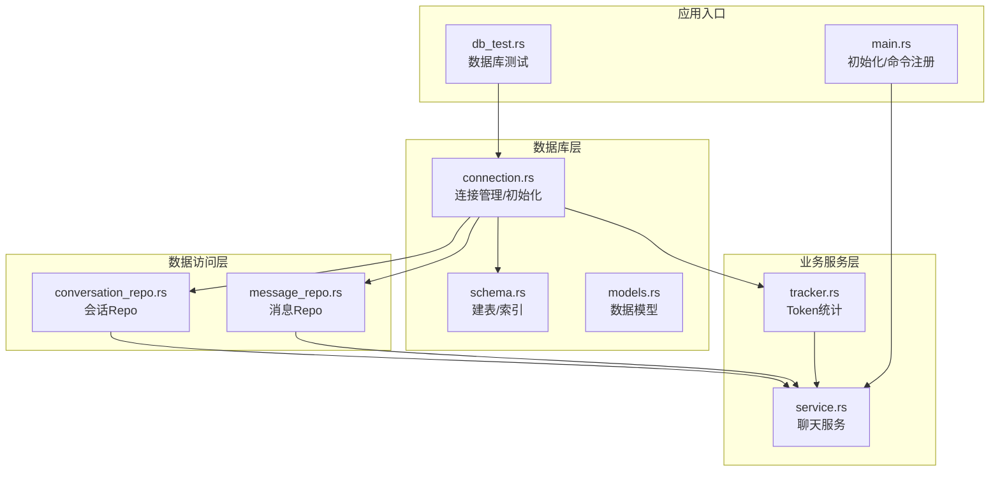
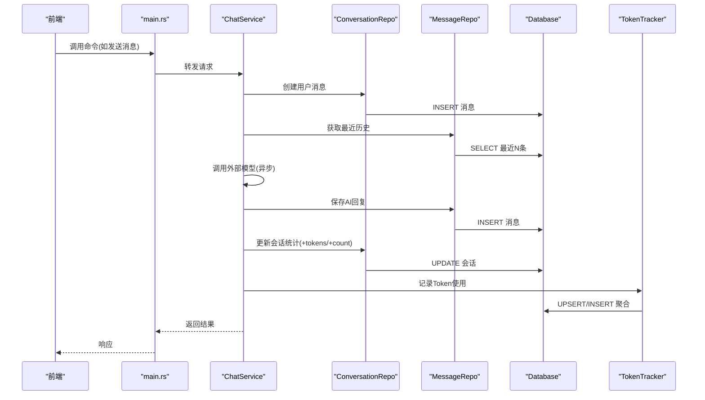
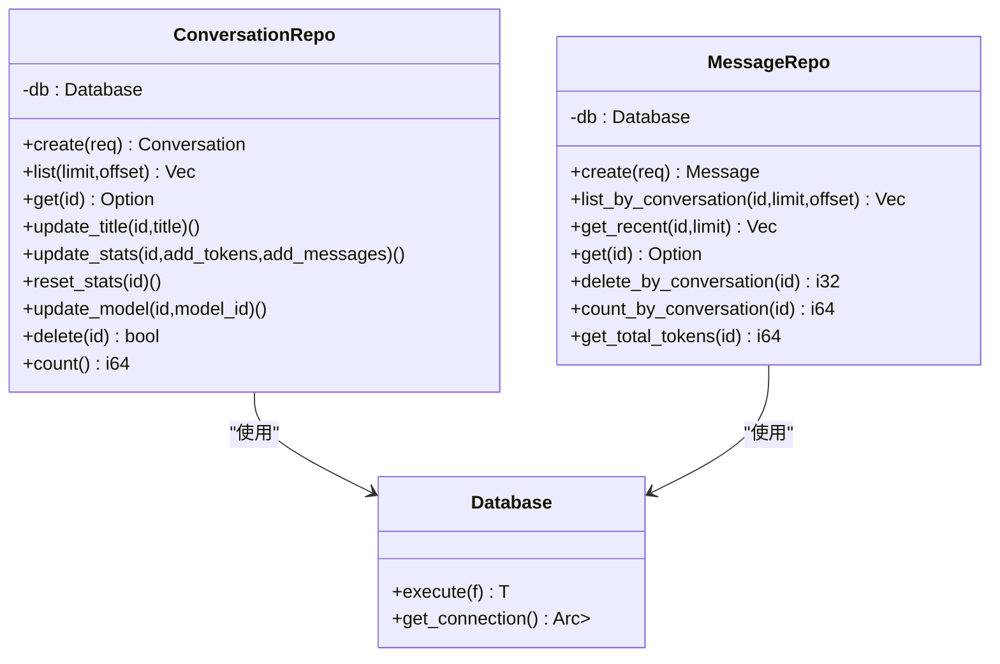
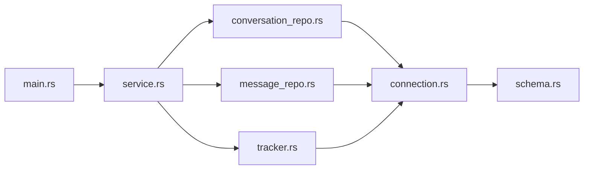
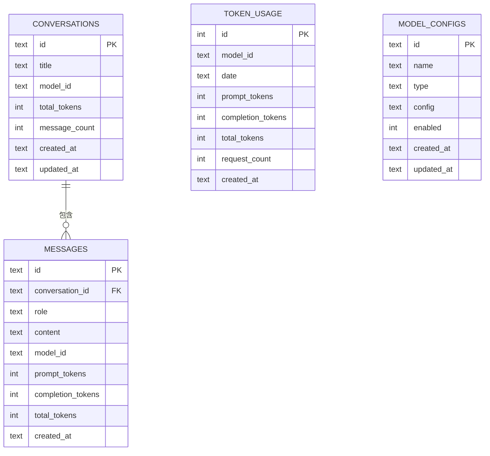
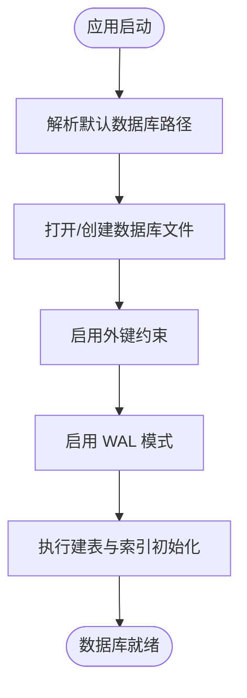
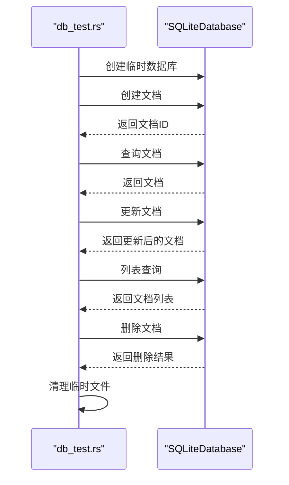

# 数据库设计

<cite>
**本文引用的文件**
- [src-tauri/src/database/connection.rs](file://src-tauri/src/database/connection.rs)
- [src-tauri/src/database/schema.rs](file://src-tauri/src/database/schema.rs)
- [src-tauri/src/database/models.rs](file://src-tauri/src/database/models.rs)
- [src-tauri/src/database/mod.rs](file://src-tauri/src/database/mod.rs)
- [src-tauri/src/chat/conversation_repo.rs](file://src-tauri/src/chat/conversation_repo.rs)
- [src-tauri/src/chat/message_repo.rs](file://src-tauri/src/chat/message_repo.rs)
- [src-tauri/src/token_tracker/tracker.rs](file://src-tauri/src/token_tracker/tracker.rs)
- [src-tauri/src/chat/service.rs](file://src-tauri/src/chat/service.rs)
- [src-tauri/src/main.rs](file://src-tauri/src/main.rs)
- [src-tauri/src/db_test.rs](file://src-tauri/src/db_test.rs)
- [RUST_ONNX_VECTOR_DB_INTEGRATION_SCHEME.md](file://RUST_ONNX_VECTOR_DB_INTEGRATION_SCHEME.md)
- [docs/configuration-management.md](file://docs/configuration-management.md)
</cite>

## 目录
1. [简介](#简介)
2. [项目结构](#项目结构)
3. [核心组件](#核心组件)
4. [架构总览](#架构总览)
5. [详细组件分析](#详细组件分析)
6. [依赖关系分析](#依赖关系分析)
7. [性能考量](#性能考量)
8. [故障排查指南](#故障排查指南)
9. [结论](#结论)
10. [附录](#附录)

## 简介
本文件系统化梳理 Malou Agent 的 SQLite 数据库设计与实现，覆盖表结构、字段与约束、索引策略、Repository 模式、事务与并发控制、数据一致性保障、迁移与备份恢复方案，以及查询示例与性能调优建议。目标是帮助开发者快速理解并高效维护本地数据库层。

## 项目结构
数据库相关代码集中在 Rust 后端模块中，采用分层组织：
- 数据库层：连接管理、Schema 定义、数据模型
- 数据访问层：会话与消息的 Repository 实现
- 业务服务层：聊天服务编排，协调 Repository 与 Token 追踪
- Token 统计：独立的统计模块，负责按日聚合与查询
- 应用入口：初始化数据库、注册命令、暴露给前端调用

图表来源
- [src-tauri/src/database/connection.rs](file://src-tauri/src/database/connection.rs#L1-L89)
- [src-tauri/src/database/schema.rs](file://src-tauri/src/database/schema.rs#L1-L68)
- [src-tauri/src/database/models.rs](file://src-tauri/src/database/models.rs#L1-L110)
- [src-tauri/src/chat/conversation_repo.rs](file://src-tauri/src/chat/conversation_repo.rs#L1-L161)
- [src-tauri/src/chat/message_repo.rs](file://src-tauri/src/chat/message_repo.rs#L1-L175)
- [src-tauri/src/token_tracker/tracker.rs](file://src-tauri/src/token_tracker/tracker.rs#L1-L194)
- [src-tauri/src/chat/service.rs](file://src-tauri/src/chat/service.rs#L1-L224)
- [src-tauri/src/main.rs](file://src-tauri/src/main.rs#L267-L341)
- [src-tauri/src/db_test.rs](file://src-tauri/src/db_test.rs#L1-L58)

章节来源
- [src-tauri/src/database/mod.rs](file://src-tauri/src/database/mod.rs#L1-L7)
- [src-tauri/src/main.rs](file://src-tauri/src/main.rs#L267-L341)

## 核心组件
- 数据库连接管理器：封装 SQLite 连接、启用外键与 WAL、初始化 Schema、提供线程安全的执行闭包
- 表结构与索引：会话、消息、Token 使用统计、模型配置表及对应索引
- 数据模型：会话、消息、Token 使用、Token 汇总、每日 Token 使用、模型配置等
- Repository 层：会话与消息的数据访问接口，封装 CRUD 与统计查询
- Token 统计：按日聚合、按模型分组、趋势查询
- 聊天服务：编排会话创建、消息持久化、调用外部模型、更新统计与记录 Token

章节来源
- [src-tauri/src/database/connection.rs](file://src-tauri/src/database/connection.rs#L1-L89)
- [src-tauri/src/database/schema.rs](file://src-tauri/src/database/schema.rs#L1-L68)
- [src-tauri/src/database/models.rs](file://src-tauri/src/database/models.rs#L1-L110)
- [src-tauri/src/chat/conversation_repo.rs](file://src-tauri/src/chat/conversation_repo.rs#L1-L161)
- [src-tauri/src/chat/message_repo.rs](file://src-tauri/src/chat/message_repo.rs#L1-L175)
- [src-tauri/src/token_tracker/tracker.rs](file://src-tauri/src/token_tracker/tracker.rs#L1-L194)
- [src-tauri/src/chat/service.rs](file://src-tauri/src/chat/service.rs#L1-L224)

## 架构总览
数据库层通过连接管理器统一初始化与执行；Repository 层对上提供类型安全的数据访问；聊天服务协调 Repository 与 Token 统计；应用入口负责初始化与命令注册。

图表来源
- [src-tauri/src/main.rs](file://src-tauri/src/main.rs#L140-L172)
- [src-tauri/src/chat/service.rs](file://src-tauri/src/chat/service.rs#L94-L177)
- [src-tauri/src/chat/conversation_repo.rs](file://src-tauri/src/chat/conversation_repo.rs#L14-L37)
- [src-tauri/src/chat/message_repo.rs](file://src-tauri/src/chat/message_repo.rs#L14-L52)
- [src-tauri/src/token_tracker/tracker.rs](file://src-tauri/src/token_tracker/tracker.rs#L14-L48)

## 详细组件分析

### 表结构与字段定义
- 会话表 conversations
  - 字段：id（主键）、title、model_id、total_tokens、message_count、created_at、updated_at
  - 约束：非空、默认值、主键
  - 索引：按 updated_at 降序排序
- 消息表 messages
  - 字段：id（主键）、conversation_id（外键，引用 conversations.id，级联删除）、role、content、model_id、prompt_tokens、completion_tokens、total_tokens、created_at
  - 约束：非空、默认值、主键、外键
  - 索引：(conversation_id, created_at) 升序
- Token 使用统计表 token_usage
  - 字段：id（自增主键）、model_id、date、prompt_tokens、completion_tokens、total_tokens、request_count、created_at
  - 约束：非空、默认值、主键
  - 索引：(model_id, date DESC)
- 模型配置表 model_configs
  - 字段：id（主键）、name、type、config（JSON）、enabled、created_at、updated_at
  - 约束：非空、默认值、主键
  - 索引：(type, enabled)

章节来源
- [src-tauri/src/database/schema.rs](file://src-tauri/src/database/schema.rs#L2-L62)

### 关系设计与主外键关联
- 会话与消息：一对多，messages.conversation_id → conversations.id（ON DELETE CASCADE）
- 外键约束：开启 PRAGMA foreign_keys = ON
- 级联删除：删除会话时自动删除其下所有消息

章节来源
- [src-tauri/src/database/connection.rs](file://src-tauri/src/database/connection.rs#L22-L26)
- [src-tauri/src/database/schema.rs](file://src-tauri/src/database/schema.rs#L28-L29)

### 索引优化策略
- conversations(updated_at DESC)：支持按最后更新时间倒序分页查询
- messages(conversation_id, created_at ASC)：支持按会话检索并按时间升序排列
- token_usage(model_id, date DESC)：支持按模型与日期范围聚合查询
- model_configs(type, enabled)：支持按类型与启用状态过滤

章节来源
- [src-tauri/src/database/schema.rs](file://src-tauri/src/database/schema.rs#L14-L15)
- [src-tauri/src/database/schema.rs](file://src-tauri/src/database/schema.rs#L31-L32)
- [src-tauri/src/database/schema.rs](file://src-tauri/src/database/schema.rs#L46-L47)
- [src-tauri/src/database/schema.rs](file://src-tauri/src/database/schema.rs#L60-L61)

### Repository 模式实现
- 会话 Repo
  - 能力：创建、列表、按 id 获取、更新标题、更新统计、重置统计、更新模型、删除、计数
  - 统计更新：原子性地累加 total_tokens 与 message_count，并更新 updated_at
- 消息 Repo
  - 能力：创建、按会话列表、获取最近 N 条（构建上下文）、按 id 获取、按会话批量删除、按会话计数、按会话求和 total_tokens
  - 上下文构建：最近 N 条消息，按时间升序返回（内部反转）

图表来源
- [src-tauri/src/database/connection.rs](file://src-tauri/src/database/connection.rs#L50-L57)
- [src-tauri/src/chat/conversation_repo.rs](file://src-tauri/src/chat/conversation_repo.rs#L9-L160)
- [src-tauri/src/chat/message_repo.rs](file://src-tauri/src/chat/message_repo.rs#L9-L174)

章节来源
- [src-tauri/src/chat/conversation_repo.rs](file://src-tauri/src/chat/conversation_repo.rs#L1-L161)
- [src-tauri/src/chat/message_repo.rs](file://src-tauri/src/chat/message_repo.rs#L1-L175)

### 事务管理、并发控制与一致性
- 并发控制
  - 连接持有：使用 Arc<Mutex<Connection>> 提供线程安全的连接访问
  - 执行闭包：通过 Database::execute 接受闭包，在锁范围内执行 SQL，避免跨线程共享连接
  - WAL 模式：启用 PRAGMA journal_mode = WAL，提升并发读写性能
- 一致性保障
  - 外键约束：PRAGMA foreign_keys = ON，确保参照完整性
  - 级联删除：messages.conversation_id 外键设置 ON DELETE CASCADE
  - 原子更新：会话统计更新使用单条 UPDATE 语句，避免竞态
- 事务与连接池
  - 当前未使用显式事务块或连接池；若未来扩展可参考文档中的连接池与事务模板进行改造

章节来源
- [src-tauri/src/database/connection.rs](file://src-tauri/src/database/connection.rs#L8-L36)
- [src-tauri/src/database/connection.rs](file://src-tauri/src/database/connection.rs#L50-L57)
- [src-tauri/src/chat/conversation_repo.rs](file://src-tauri/src/chat/conversation_repo.rs#L102-L116)
- [RUST_ONNX_VECTOR_DB_INTEGRATION_SCHEME.md](file://RUST_ONNX_VECTOR_DB_INTEGRATION_SCHEME.md#L380-L420)

### 数据迁移方案与版本升级策略
- 建议采用“迁移脚本”方式：
  - 新增/修改表：在初始化流程中执行 ALTER TABLE 或 CREATE TABLE IF NOT EXISTS
  - 索引变更：使用 CREATE INDEX IF NOT EXISTS / DROP INDEX IF EXISTS
  - 数据迁移：在应用启动时检测版本号，按顺序执行迁移脚本
  - 版本标记：新增一张 schema_version 表记录当前版本
- 升级流程
  - 启动时读取当前版本
  - 若低于最新版本，按顺序执行缺失的迁移
  - 迁移过程中保持 WAL 模式，必要时在只读迁移阶段关闭写入
- 备份策略
  - SQLite 支持热备份：在 WAL 模式下可安全复制数据库文件
  - 建议在升级前生成快照文件，失败时回滚

章节来源
- [src-tauri/src/database/schema.rs](file://src-tauri/src/database/schema.rs#L64-L67)
- [src-tauri/src/database/connection.rs](file://src-tauri/src/database/connection.rs#L25-L26)
- [docs/configuration-management.md](file://docs/configuration-management.md#L240-L244)

### 备份与恢复机制
- 备份
  - 文件级备份：直接复制 .db 文件（WAL 模式下可安全复制）
  - 备份保留：按时间戳命名，保留最近 N 份
- 恢复
  - 停止应用后替换数据库文件
  - 启动后验证表结构与关键索引是否存在
- 备份触发点
  - 应用退出时
  - 版本升级前

章节来源
- [docs/configuration-management.md](file://docs/configuration-management.md#L240-L244)
- [src-tauri/src/database/connection.rs](file://src-tauri/src/database/connection.rs#L14-L18)

### SQL 查询示例与性能分析
- 获取会话列表（分页）
  - 语句：SELECT ... FROM conversations ORDER BY updated_at DESC LIMIT ? OFFSET ?
  - 索引：conversations(updated_at DESC)，命中率高
- 按会话获取消息（上下文构建）
  - 语句：SELECT ... FROM messages WHERE conversation_id = ? ORDER BY created_at ASC LIMIT ?
  - 索引：messages(conversation_id, created_at ASC)，顺序扫描高效
- 获取最近 N 条消息（反转顺序）
  - 语句：SELECT ... FROM messages WHERE conversation_id = ? ORDER BY created_at DESC LIMIT ?，随后在应用层反转
  - 性能：避免在数据库层做复杂排序，减少排序开销
- Token 汇总（按日期范围）
  - 语句：SELECT SUM(...) FROM token_usage WHERE date BETWEEN ? AND ?
  - 索引：token_usage(model_id, date DESC)，支持范围查询
- 每日趋势（GROUP BY date）
  - 语句：SELECT date, SUM(...) FROM token_usage GROUP BY date ORDER BY date DESC LIMIT ?
  - 性能：按日期分组，适合折线图展示

章节来源
- [src-tauri/src/chat/conversation_repo.rs](file://src-tauri/src/chat/conversation_repo.rs#L40-L63)
- [src-tauri/src/chat/message_repo.rs](file://src-tauri/src/chat/message_repo.rs#L54-L81)
- [src-tauri/src/chat/message_repo.rs](file://src-tauri/src/chat/message_repo.rs#L83-L113)
- [src-tauri/src/token_tracker/tracker.rs](file://src-tauri/src/token_tracker/tracker.rs#L144-L168)

### 调优建议
- 使用 WAL 模式：已启用，适合高并发读写
- 合理使用索引：避免过度索引导致写入变慢；定期分析执行计划
- 分页与限制：列表查询添加 LIMIT/OFFSET，避免一次性加载大量数据
- 原子更新：统计字段使用单条 UPDATE，避免多次往返
- 读写分离：在高并发场景考虑只读副本或查询路由

章节来源
- [src-tauri/src/database/connection.rs](file://src-tauri/src/database/connection.rs#L25-L26)
- [src-tauri/src/chat/conversation_repo.rs](file://src-tauri/src/chat/conversation_repo.rs#L102-L116)

## 依赖关系分析
- 模块耦合
  - ChatService 依赖 ConversationRepo、MessageRepo、TokenTracker
  - Repo 依赖 Database 提供的连接与执行能力
  - main.rs 初始化 Database 并注入 ChatService
- 外部依赖
  - rusqlite：SQLite 驱动
  - uuid、chrono：生成 ID 与时间戳
  - tokio/RwLock：异步与并发控制

图表来源
- [src-tauri/src/main.rs](file://src-tauri/src/main.rs#L281-L282)
- [src-tauri/src/chat/service.rs](file://src-tauri/src/chat/service.rs#L20-L29)
- [src-tauri/src/chat/conversation_repo.rs](file://src-tauri/src/chat/conversation_repo.rs#L1-L12)
- [src-tauri/src/chat/message_repo.rs](file://src-tauri/src/chat/message_repo.rs#L1-L12)
- [src-tauri/src/token_tracker/tracker.rs](file://src-tauri/src/token_tracker/tracker.rs#L1-L7)
- [src-tauri/src/database/connection.rs](file://src-tauri/src/database/connection.rs#L1-L10)

章节来源
- [src-tauri/src/main.rs](file://src-tauri/src/main.rs#L267-L341)
- [src-tauri/src/chat/service.rs](file://src-tauri/src/chat/service.rs#L1-L224)

## 性能考量
- 读多写少场景：WAL 模式显著提升并发读性能
- 热点查询：利用索引覆盖常见查询路径（会话列表、消息按会话查询、Token 按模型+日期）
- 写入优化：批量插入与原子更新减少锁竞争
- 异步与阻塞：对外部 API 调用使用异步，数据库操作通过阻塞线程池执行，避免阻塞事件循环

章节来源
- [src-tauri/src/database/connection.rs](file://src-tauri/src/database/connection.rs#L25-L26)
- [src-tauri/src/chat/service.rs](file://src-tauri/src/chat/service.rs#L94-L177)

## 故障排查指南
- 连接失败
  - 检查数据库路径是否存在且可写
  - 确认父目录已创建
- 外键约束错误
  - 确认 foreign_keys 已启用
  - 检查删除顺序：先删消息再删会话
- 查询缓慢
  - 使用 EXPLAIN QUERY PLAN 分析执行计划
  - 确认相关索引是否被使用
- 数据不一致
  - 核对统计更新是否为原子操作
  - 检查是否正确处理了级联删除

章节来源
- [src-tauri/src/database/connection.rs](file://src-tauri/src/database/connection.rs#L14-L18)
- [src-tauri/src/database/connection.rs](file://src-tauri/src/database/connection.rs#L22-L26)
- [src-tauri/src/chat/conversation_repo.rs](file://src-tauri/src/chat/conversation_repo.rs#L102-L116)
- [src-tauri/src/chat/message_repo.rs](file://src-tauri/src/chat/message_repo.rs#L142-L151)

## 结论
Malou Agent 的数据库层以 SQLite 为核心，采用清晰的分层设计与合理的索引策略，满足会话与消息的高频读写需求，并通过 Token 统计模块实现成本与用量的可视化。当前实现具备良好的并发与一致性基础，建议后续引入迁移脚本与连接池以进一步增强可维护性与扩展性。

## 附录

### 数据模型 ER 图

图表来源
- [src-tauri/src/database/schema.rs](file://src-tauri/src/database/schema.rs#L4-L58)

### 数据库初始化流程

图表来源
- [src-tauri/src/database/connection.rs](file://src-tauri/src/database/connection.rs#L14-L43)

### 数据库功能测试流程

图表来源
- [src-tauri/src/db_test.rs](file://src-tauri/src/db_test.rs#L5-L58)