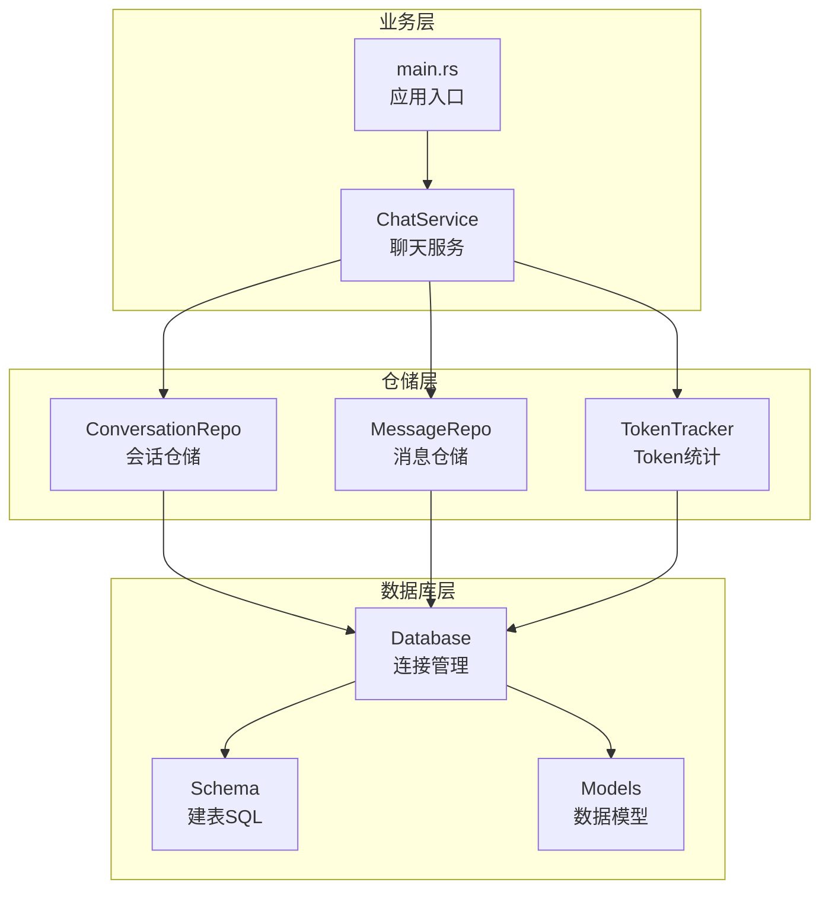
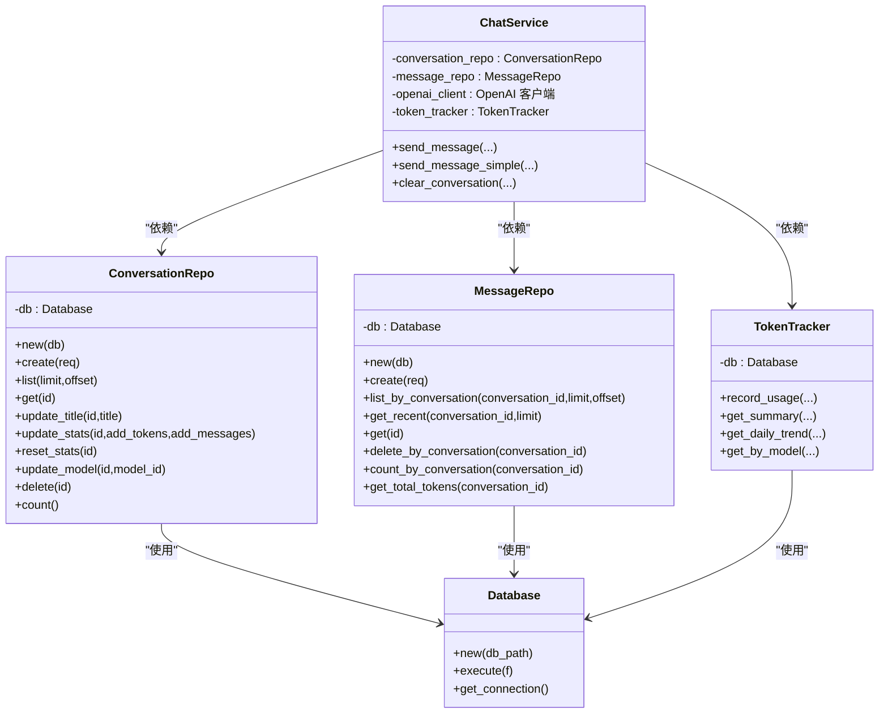
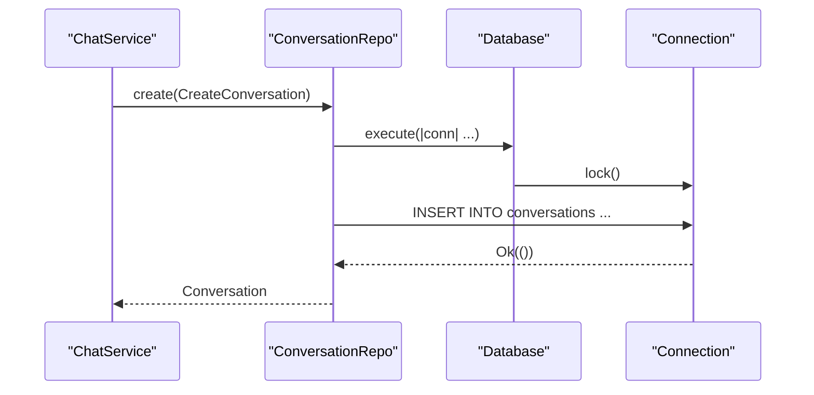
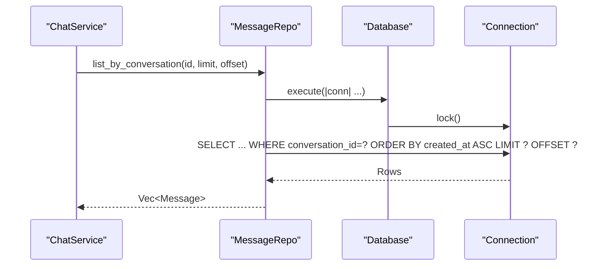
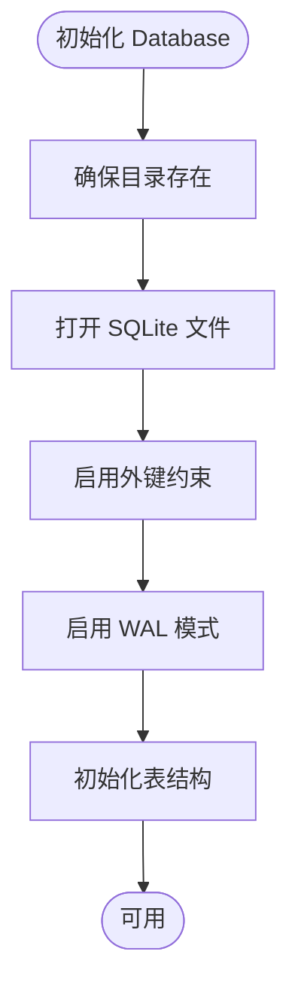
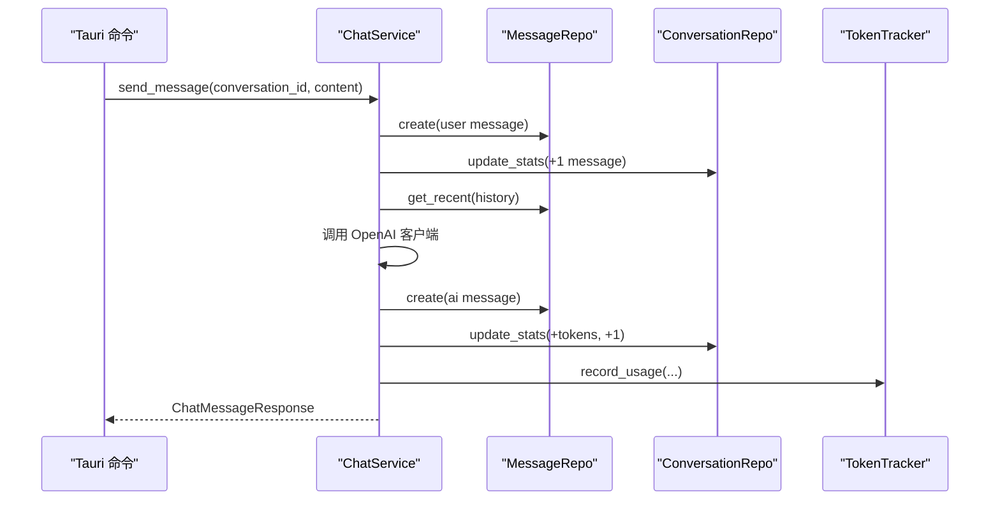
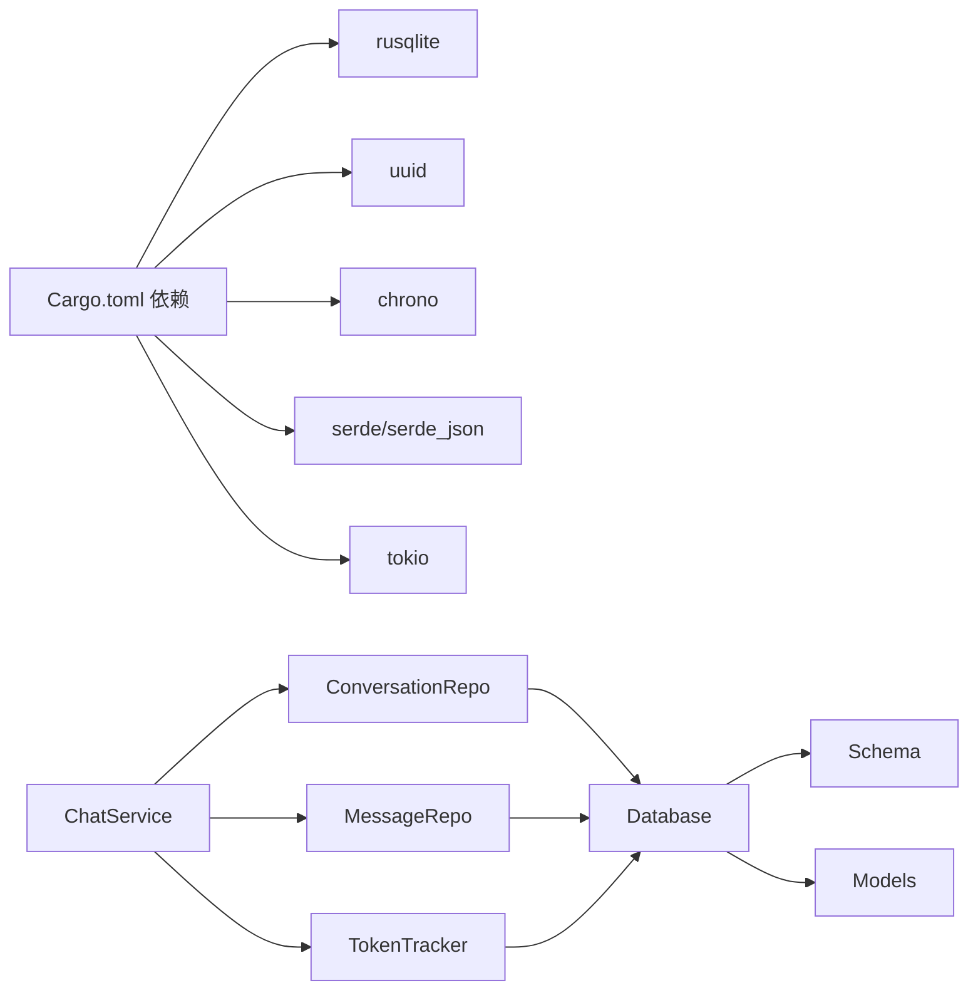

# 数据访问层

<cite>
**本文引用的文件**
- [conversation_repo.rs](file://src-tauri/src/chat/conversation_repo.rs)
- [message_repo.rs](file://src-tauri/src/chat/message_repo.rs)
- [connection.rs](file://src-tauri/src/database/connection.rs)
- [models.rs](file://src-tauri/src/database/models.rs)
- [schema.rs](file://src-tauri/src/database/schema.rs)
- [service.rs](file://src-tauri/src/chat/service.rs)
- [main.rs](file://src-tauri/src/main.rs)
- [Cargo.toml](file://src-tauri/Cargo.toml)
- [tracker.rs](file://src-tauri/src/token_tracker/tracker.rs)
</cite>

## 目录
1. [简介](#简介)
2. [项目结构](#项目结构)
3. [核心组件](#核心组件)
4. [架构总览](#架构总览)
5. [详细组件分析](#详细组件分析)
6. [依赖关系分析](#依赖关系分析)
7. [性能与并发特性](#性能与并发特性)
8. [错误处理与安全](#错误处理与安全)
9. [最佳实践与优化建议](#最佳实践与优化建议)
10. [故障排查指南](#故障排查指南)
11. [结论](#结论)

## 简介
本文件系统性梳理 Malou Agent 的数据访问层，重点围绕 Repository 模式在 Rust + SQLite 环境下的实现，详解 ConversationRepo 与 MessageRepo 的设计与职责边界，数据库连接管理、事务与并发控制机制，CRUD 实现细节（含查询优化、批量操作与错误处理），数据模型映射与 ORM 使用方式，以及 SQL 注入防护、性能优化、缓存策略与连接池配置建议。文档同时给出关键流程的时序图与类图，帮助读者快速理解与落地实践。

## 项目结构
数据访问层主要位于 src-tauri/src/database 与 src-tauri/src/chat 下：
- database 子模块负责数据库连接、表结构与数据模型定义
- chat 子模块负责业务仓库（ConversationRepo、MessageRepo）与服务编排（ChatService）
- token_tracker 子模块负责 Token 使用统计与查询

图表来源
- [connection.rs](file://src-tauri/src/database/connection.rs#L1-L89)
- [schema.rs](file://src-tauri/src/database/schema.rs#L1-L68)
- [models.rs](file://src-tauri/src/database/models.rs#L1-L110)
- [conversation_repo.rs](file://src-tauri/src/chat/conversation_repo.rs#L1-L161)
- [message_repo.rs](file://src-tauri/src/chat/message_repo.rs#L1-L175)
- [service.rs](file://src-tauri/src/chat/service.rs#L1-L224)
- [main.rs](file://src-tauri/src/main.rs#L1-L316)

章节来源
- [connection.rs](file://src-tauri/src/database/connection.rs#L1-L89)
- [schema.rs](file://src-tauri/src/database/schema.rs#L1-L68)
- [models.rs](file://src-tauri/src/database/models.rs#L1-L110)
- [conversation_repo.rs](file://src-tauri/src/chat/conversation_repo.rs#L1-L161)
- [message_repo.rs](file://src-tauri/src/chat/message_repo.rs#L1-L175)
- [service.rs](file://src-tauri/src/chat/service.rs#L1-L224)
- [main.rs](file://src-tauri/src/main.rs#L1-L316)

## 核心组件
- Database：SQLite 连接管理器，提供线程安全的连接封装与执行器，初始化外键与 WAL 模式，并加载表结构。
- ConversationRepo：会话仓储，负责会话的创建、查询、更新（标题、模型、统计）、删除与计数。
- MessageRepo：消息仓储，负责消息的创建、分页查询、最近消息获取、删除（按会话）、计数与 Token 统计。
- ChatService：业务服务，组合仓储与 TokenTracker，协调消息发送、上下文构建与统计更新。
- TokenTracker：Token 使用统计，按模型与日期聚合，支持汇总、趋势与按模型查询。
- 数据模型：Conversation、Message、CreateConversation、CreateMessage 等，用于 DTO 映射与序列化。

章节来源
- [connection.rs](file://src-tauri/src/database/connection.rs#L1-L89)
- [conversation_repo.rs](file://src-tauri/src/chat/conversation_repo.rs#L1-L161)
- [message_repo.rs](file://src-tauri/src/chat/message_repo.rs#L1-L175)
- [service.rs](file://src-tauri/src/chat/service.rs#L1-L224)
- [models.rs](file://src-tauri/src/database/models.rs#L1-L110)
- [tracker.rs](file://src-tauri/src/token_tracker/tracker.rs#L1-L195)

## 架构总览
数据访问层采用“仓储 + 服务”的分层设计：
- 仓储层面向具体实体（会话、消息）提供 CRUD 操作，屏蔽底层 SQL 细节
- 服务层编排业务流程，协调仓储与外部组件（如 OpenAI 客户端）
- 数据库层统一提供连接、事务与并发控制能力

图表来源
- [connection.rs](file://src-tauri/src/database/connection.rs#L1-L89)
- [conversation_repo.rs](file://src-tauri/src/chat/conversation_repo.rs#L1-L161)
- [message_repo.rs](file://src-tauri/src/chat/message_repo.rs#L1-L175)
- [service.rs](file://src-tauri/src/chat/service.rs#L1-L224)
- [tracker.rs](file://src-tauri/src/token_tracker/tracker.rs#L1-L195)

## 详细组件分析

### ConversationRepo 设计与职责
- 职责边界
  - 会话生命周期管理：创建、查询、更新（标题、模型、统计）、删除
  - 会话统计维护：累计 tokens 与消息数，更新时间戳
- 关键实现要点
  - 使用 UUID 生成主键，时间字段采用 RFC3339 字符串存储
  - 查询采用参数化 SQL，避免拼接
  - 分页查询通过 LIMIT/OFFSET 实现，索引按更新时间排序
  - 删除会话触发外键级联删除消息
- 性能与并发
  - 通过 Database.execute 在互斥锁内串行化执行，保证并发安全
  - 表与索引设计支持高频查询场景

图表来源
- [conversation_repo.rs](file://src-tauri/src/chat/conversation_repo.rs#L14-L37)
- [connection.rs](file://src-tauri/src/database/connection.rs#L50-L57)

章节来源
- [conversation_repo.rs](file://src-tauri/src/chat/conversation_repo.rs#L1-L161)

### MessageRepo 设计与职责
- 职责边界
  - 消息生命周期管理：创建、查询、删除（按会话）
  - 上下文构建：按时间顺序返回最近 N 条消息
  - 统计查询：按会话计数与 Token 汇总
- 关键实现要点
  - 外键约束确保会话删除时自动清理消息
  - 查询按会话与时间复合索引，支持高效分页与最近消息检索
  - Token 字段可选，支持回填计算
- 性能与并发
  - 与 ConversationRepo 相同的串行化执行模型

图表来源
- [message_repo.rs](file://src-tauri/src/chat/message_repo.rs#L54-L81)
- [connection.rs](file://src-tauri/src/database/connection.rs#L50-L57)

章节来源
- [message_repo.rs](file://src-tauri/src/chat/message_repo.rs#L1-L175)

### 数据库连接管理与并发控制
- 连接封装
  - Database 使用 Arc<Mutex<Connection>> 提供线程安全的连接持有
  - 提供 execute 闭包接口，确保每次操作都在锁保护下进行
- 初始化策略
  - 自动创建目录、打开数据库、启用外键与 WAL 模式
  - 初始化表结构（schema.rs）
- 并发控制
  - 通过互斥锁串行化所有数据库操作，避免竞态
  - 未使用连接池，适合本地 SQLite 场景

图表来源
- [connection.rs](file://src-tauri/src/database/connection.rs#L14-L43)

章节来源
- [connection.rs](file://src-tauri/src/database/connection.rs#L1-L89)

### 事务处理与并发控制机制
- 事务处理
  - 当前实现未显式开启事务；所有写操作在单次 execute 闭包中完成，天然具备原子性
  - 若需跨多语句的强一致性，可在 execute 闭包内使用 rusqlite 的事务 API
- 并发控制
  - 通过 Mutex 串行化所有数据库操作，避免并发冲突
  - 对于高并发场景，可考虑引入连接池（见“性能与并发特性”）

章节来源
- [connection.rs](file://src-tauri/src/database/connection.rs#L50-L57)
- [conversation_repo.rs](file://src-tauri/src/chat/conversation_repo.rs#L19-L26)
- [message_repo.rs](file://src-tauri/src/chat/message_repo.rs#L22-L39)

### CRUD 实现细节与查询优化
- 创建
  - 使用参数化 SQL 插入，避免 SQL 注入
  - 会话与消息均使用 UUID 主键
- 查询
  - 列表与最近消息查询均使用参数化条件与 LIMIT/OFFSET
  - 会话按更新时间倒序，消息按会话+时间复合索引
- 更新
  - 使用原子更新表达式累加 tokens 与消息数
- 删除
  - 会话删除触发外键级联删除消息
- 批量操作
  - 未实现专用批量接口；可通过循环调用单条操作或扩展 execute 闭包实现

章节来源
- [conversation_repo.rs](file://src-tauri/src/chat/conversation_repo.rs#L14-L161)
- [message_repo.rs](file://src-tauri/src/chat/message_repo.rs#L14-L175)
- [schema.rs](file://src-tauri/src/database/schema.rs#L14-L32)

### 数据模型映射与 ORM 使用
- 数据模型
  - 会话与消息模型通过 serde 序列化/反序列化，便于与前端交互
  - 字段类型与数据库表结构一一对应
- ORM 使用
  - 未使用第三方 ORM；直接使用 rusqlite 的 prepare/query_map 接口进行映射
  - 通过 query_map 将 Row 映射为结构体实例，简洁可靠

章节来源
- [models.rs](file://src-tauri/src/database/models.rs#L1-L110)
- [conversation_repo.rs](file://src-tauri/src/chat/conversation_repo.rs#L49-L58)
- [message_repo.rs](file://src-tauri/src/chat/message_repo.rs#L65-L76)

### SQL 注入防护措施
- 参数化查询
  - 所有写入与查询均使用 rusqlite 的参数占位符与 params! 宏
- 输入校验
  - 建议在上层（服务层或 API 层）增加输入长度、格式与字符集校验
- 外部依赖
  - 未发现直接拼接 SQL 的情况，整体安全性良好

章节来源
- [conversation_repo.rs](file://src-tauri/src/chat/conversation_repo.rs#L19-L24)
- [message_repo.rs](file://src-tauri/src/chat/message_repo.rs#L22-L36)

### Token 统计与服务编排
- TokenTracker
  - 支持按模型与日期聚合，提供汇总、趋势与按模型查询
  - 写入采用“先更新后插入”的幂等策略
- ChatService
  - 协调消息创建、上下文构建、AI 调用与统计更新
  - 通过 Arc<RwLock<OpenAI 客户端>> 实现 Send + Sync

图表来源
- [service.rs](file://src-tauri/src/chat/service.rs#L94-L177)
- [tracker.rs](file://src-tauri/src/token_tracker/tracker.rs#L14-L48)

章节来源
- [service.rs](file://src-tauri/src/chat/service.rs#L1-L224)
- [tracker.rs](file://src-tauri/src/token_tracker/tracker.rs#L1-L195)

## 依赖关系分析
- 外部依赖
  - rusqlite：SQLite 驱动与 ORM 风格的查询接口
  - uuid：生成唯一标识
  - chrono：时间戳处理
  - serde/serde_json：数据序列化
  - tokio：异步运行时（用于并发与任务）
- 内部依赖
  - ChatService 依赖 ConversationRepo、MessageRepo、TokenTracker
  - 仓储层依赖 Database
  - Database 依赖 schema.rs 与 models.rs

图表来源
- [Cargo.toml](file://src-tauri/Cargo.toml#L12-L25)
- [service.rs](file://src-tauri/src/chat/service.rs#L1-L224)
- [connection.rs](file://src-tauri/src/database/connection.rs#L1-L89)

章节来源
- [Cargo.toml](file://src-tauri/Cargo.toml#L1-L25)
- [service.rs](file://src-tauri/src/chat/service.rs#L1-L224)
- [connection.rs](file://src-tauri/src/database/connection.rs#L1-L89)

## 性能与并发特性
- 已有优化
  - WAL 模式提升并发读写性能
  - 外键约束保障数据一致性
  - 表与索引设计支持高频查询（会话更新时间索引、消息会话+时间复合索引）
- 并发模型
  - 通过 Mutex 串行化数据库操作，避免锁竞争
  - 未使用连接池，适合本地 SQLite 场景
- 可选优化方向
  - 引入连接池（r2d2/r2d2_sqlite 或自定义池）以提升并发吞吐
  - 对热点查询增加二级索引或物化视图
  - 批量写入合并（批量插入/更新）减少往返次数
  - 缓存热点会话与消息列表（短期缓存，注意与数据库一致性）

[本节为通用性能讨论，无需特定文件来源]

## 错误处理与安全
- 错误处理
  - 仓储层将底层 rusqlite 错误转换为 Result<String,...>，便于上层统一处理
  - ChatService 对仓储调用进行 map_err 包装，保留上下文信息
- 安全
  - 参数化 SQL 防止注入
  - 未发现明文密码或敏感信息硬编码
- 建议
  - 对外暴露的 API 层增加输入校验与速率限制
  - 对错误日志进行脱敏处理

章节来源
- [conversation_repo.rs](file://src-tauri/src/chat/conversation_repo.rs#L15-L37)
- [message_repo.rs](file://src-tauri/src/chat/message_repo.rs#L14-L52)
- [service.rs](file://src-tauri/src/chat/service.rs#L37-L42)

## 最佳实践与优化建议
- 仓储层
  - 保持 CRUD 方法单一职责，复杂查询拆分为多个方法
  - 对批量操作提供统一入口，避免重复 SQL
- 数据库层
  - 在高并发场景引入连接池，或使用异步封装（tokio::task::spawn_blocking）
  - 对频繁查询添加合适索引，避免全表扫描
- 服务层
  - 对长耗时操作（如外部 API 调用）使用异步并发
  - 统一错误码与错误消息格式
- 安全
  - 对用户输入进行长度、字符集与大小写规范化
  - 对敏感配置项（如 API Key）进行加密存储与最小权限访问

[本节为通用最佳实践，无需特定文件来源]

## 故障排查指南
- 数据库初始化失败
  - 检查数据库路径是否存在且可写
  - 确认外键与 WAL 设置是否成功
- 查询异常
  - 检查参数绑定是否正确（参数数量与类型）
  - 确认索引是否存在，查询是否命中索引
- 并发问题
  - 确认所有数据库操作均通过 Database.execute 执行
  - 如需更高并发，评估引入连接池方案
- Token 统计异常
  - 检查 record_usage 的幂等逻辑是否被破坏
  - 确认日期格式与聚合逻辑

章节来源
- [connection.rs](file://src-tauri/src/database/connection.rs#L14-L43)
- [conversation_repo.rs](file://src-tauri/src/chat/conversation_repo.rs#L40-L63)
- [message_repo.rs](file://src-tauri/src/chat/message_repo.rs#L54-L81)
- [tracker.rs](file://src-tauri/src/token_tracker/tracker.rs#L14-L48)

## 结论
Malou Agent 的数据访问层以 Repository 模式为核心，结合 SQLite 的 WAL 模式与合理索引，在本地场景下提供了稳定、可维护的数据持久化能力。通过参数化查询与统一的错误包装，系统在安全性与可维护性方面表现良好。未来可在高并发场景引入连接池与异步封装，进一步提升吞吐与响应能力；同时建议完善批量操作与缓存策略，以满足更复杂的业务需求。