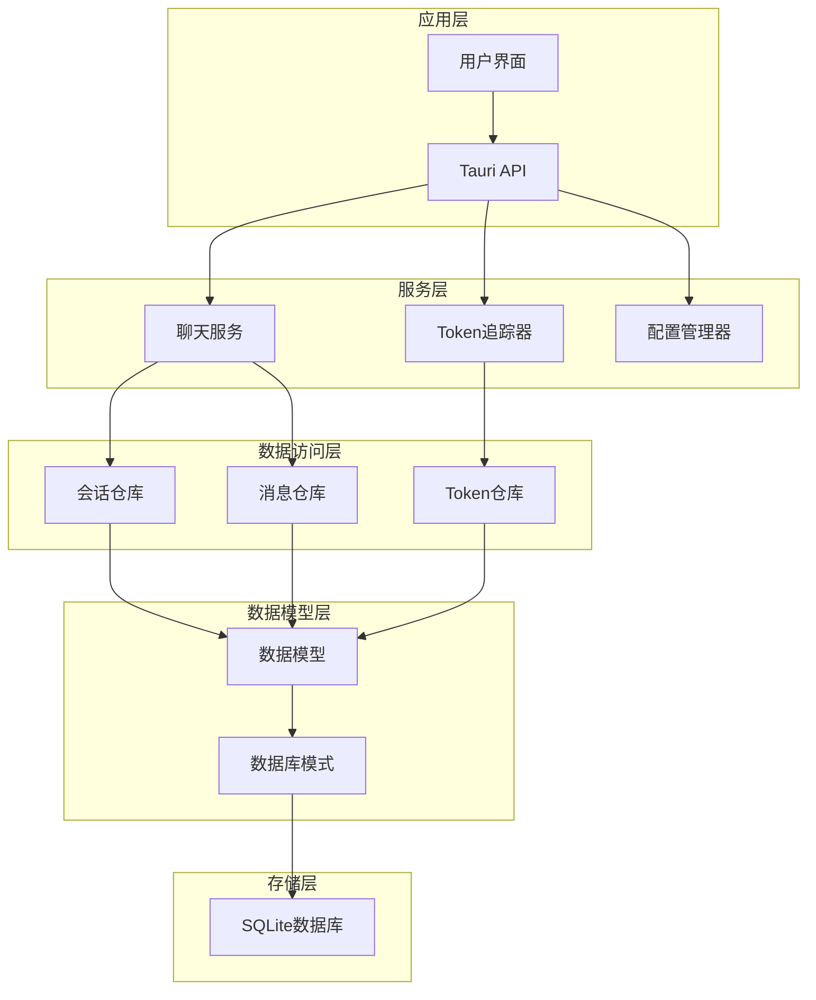
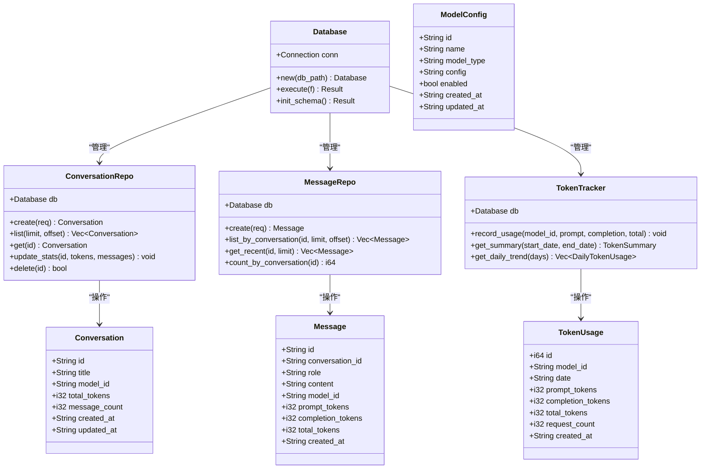
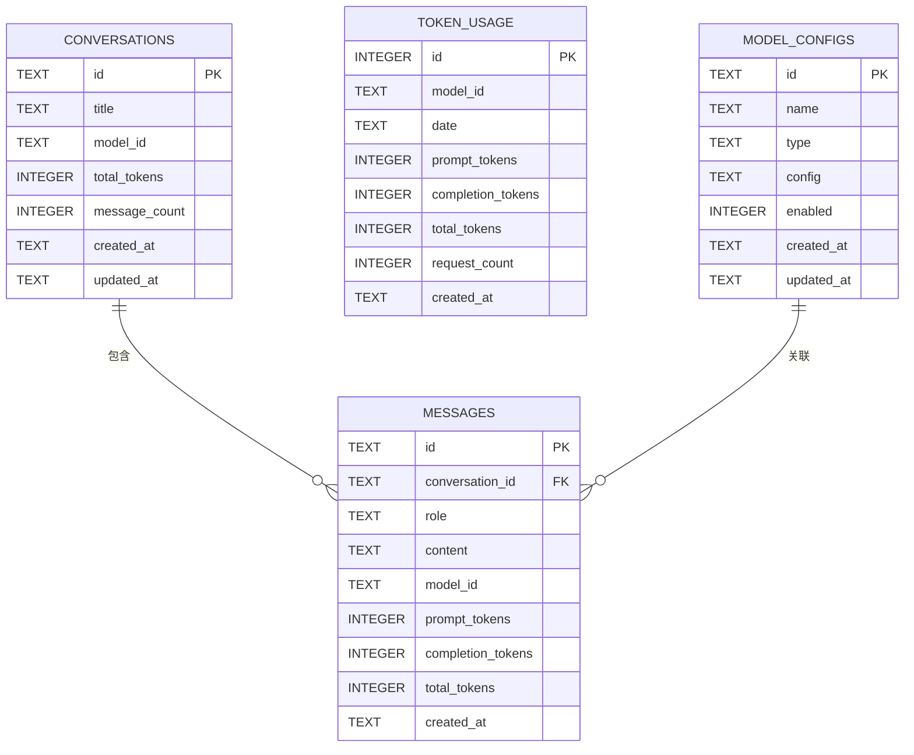

# 表结构设计

<cite>
**本文档引用的文件**
- [models.rs](file://src-tauri/src/database/models.rs)
- [schema.rs](file://src-tauri/src/database/schema.rs)
- [connection.rs](file://src-tauri/src/database/connection.rs)
- [conversation_repo.rs](file://src-tauri/src/chat/conversation_repo.rs)
- [message_repo.rs](file://src-tauri/src/chat/message_repo.rs)
- [tracker.rs](file://src-tauri/src/token_tracker/tracker.rs)
- [main.rs](file://src-tauri/src/main.rs)
- [model-config.ts](file://src/config/model-config.ts)
- [mod.rs](file://src-tauri/src/config/mod.rs)
</cite>

## 目录
1. [简介](#简介)
2. [项目结构](#项目结构)
3. [核心组件](#核心组件)
4. [架构概览](#架构概览)
5. [详细组件分析](#详细组件分析)
6. [依赖关系分析](#依赖关系分析)
7. [性能考虑](#性能考虑)
8. [故障排除指南](#故障排除指南)
9. [结论](#结论)

## 简介

Malou Agent是一个基于Tauri和Rust开发的Windows桌面AI助手应用。本文件详细阐述了数据库表结构设计，包括会话表(conversations)、消息表(messages)、Token使用统计表(token_usage)和模型配置表(model_configs)的设计理念、字段定义、约束条件和业务逻辑。

该数据库系统采用SQLite作为存储引擎，通过rusqlite库实现数据持久化，支持外键约束、索引优化和WAL模式以确保数据完整性和查询性能。

## 项目结构

Malou Agent的数据库架构采用分层设计模式，主要分为以下几个层次：



**图表来源**
- [main.rs](file://src-tauri/src/main.rs#L242-L315)
- [connection.rs](file://src-tauri/src/database/connection.rs#L1-L89)

**章节来源**
- [main.rs](file://src-tauri/src/main.rs#L1-L316)
- [connection.rs](file://src-tauri/src/database/connection.rs#L1-L89)

## 核心组件

Malou Agent数据库系统由四个核心表组成，每个表都有明确的业务职责和设计目标：

### 会话表 (conversations)
会话表用于存储用户的对话历史和元数据信息。每条会话代表一次独立的对话交互，包含会话的基本信息、统计指标和时间戳。

### 消息表 (messages)
消息表存储具体的对话内容，包括用户消息、AI回复和系统消息。每条消息与特定会话关联，支持按时间顺序检索。

### Token使用统计表 (token_usage)
Token使用统计表跟踪模型的Token消耗情况，支持按日期、模型维度进行统计分析。

### 模型配置表 (model_configs)
模型配置表存储不同模型的配置信息，支持本地和远程模型的统一管理。

**章节来源**
- [models.rs](file://src-tauri/src/database/models.rs#L1-L110)
- [schema.rs](file://src-tauri/src/database/schema.rs#L1-L68)

## 架构概览

数据库架构采用三层设计模式，确保了良好的数据分离和可维护性：



**图表来源**
- [connection.rs](file://src-tauri/src/database/connection.rs#L8-L58)
- [models.rs](file://src-tauri/src/database/models.rs#L4-L109)
- [conversation_repo.rs](file://src-tauri/src/chat/conversation_repo.rs#L5-L160)
- [message_repo.rs](file://src-tauri/src/chat/message_repo.rs#L5-L174)
- [tracker.rs](file://src-tauri/src/token_tracker/tracker.rs#L5-L194)

## 详细组件分析

### 会话表 (conversations)

#### 字段定义和约束

| 字段名 | 数据类型 | 约束条件 | 描述 |
|--------|----------|----------|------|
| id | TEXT | PRIMARY KEY | 会话唯一标识符，UUID格式 |
| title | TEXT | NOT NULL | 会话标题，用户可编辑 |
| model_id | TEXT | NULLABLE | 关联的模型ID，支持NULL值 |
| total_tokens | INTEGER | DEFAULT 0 | 该会话累计使用的Token数 |
| message_count | INTEGER | DEFAULT 0 | 该会话的消息总数 |
| created_at | TEXT | NOT NULL | 创建时间戳（RFC3339格式） |
| updated_at | TEXT | NOT NULL | 最后更新时间戳 |

#### 设计目的和业务含义

会话表是整个聊天系统的根实体，负责：
- 维护会话的基本元数据
- 跟踪会话的统计信息（Token使用量、消息数量）
- 提供会话级别的查询和管理功能

#### 主键设计原则

采用UUID作为主键的优势：
- 全局唯一性，避免冲突
- 无序性，有利于分布式部署
- 不暴露业务信息，增强安全性

#### 外键关系

会话表作为父表，被消息表通过外键关联：
- 外键：messages.conversation_id → conversations.id
- 级联删除：删除会话时自动删除其所有消息

#### 索引策略

```sql
CREATE INDEX IF NOT EXISTS idx_conversations_updated ON conversations(updated_at DESC);
```

索引设计考虑：
- 支持按更新时间倒序查询会话列表
- 优化会话历史浏览体验

**章节来源**
- [schema.rs](file://src-tauri/src/database/schema.rs#L3-L12)
- [conversation_repo.rs](file://src-tauri/src/chat/conversation_repo.rs#L14-L160)

### 消息表 (messages)

#### 字段定义和约束

| 字段名 | 数据类型 | 约束条件 | 描述 |
|--------|----------|----------|------|
| id | TEXT | PRIMARY KEY | 消息唯一标识符，UUID格式 |
| conversation_id | TEXT | NOT NULL, FOREIGN KEY | 关联的会话ID |
| role | TEXT | NOT NULL | 消息角色："user" | "assistant" | "system" |
| content | TEXT | NOT NULL | 消息内容，支持任意长度文本 |
| model_id | TEXT | NULLABLE | 使用的模型ID |
| prompt_tokens | INTEGER | DEFAULT 0 | 提示Token数 |
| completion_tokens | INTEGER | DEFAULT 0 | 生成Token数 |
| total_tokens | INTEGER | DEFAULT 0 | 总Token数 |
| created_at | TEXT | NOT NULL | 创建时间戳 |

#### 设计目的和业务含义

消息表负责存储具体的对话内容：
- 支持多角色消息（用户、AI、系统）
- 记录详细的Token使用统计
- 维护消息的时间顺序和关联关系

#### 主键和外键设计

- 主键：id（UUID）
- 外键：conversation_id → conversations.id (CASCADE)
- 级联删除：会话删除时自动清理相关消息

#### 索引策略

```sql
CREATE INDEX IF NOT EXISTS idx_messages_conv ON messages(conversation_id, created_at ASC);
```

复合索引设计考虑：
- 支持按会话查询消息列表
- 按时间升序排列，便于构建对话上下文
- 优化消息检索性能

#### 数据完整性保证

通过外键约束确保：
- 每条消息必须属于有效的会话
- 会话删除时不会产生孤立消息
- 数据一致性得到保障

**章节来源**
- [schema.rs](file://src-tauri/src/database/schema.rs#L17-L29)
- [message_repo.rs](file://src-tauri/src/chat/message_repo.rs#L14-L174)

### Token使用统计表 (token_usage)

#### 字段定义和约束

| 字段名 | 数据类型 | 约束条件 | 描述 |
|--------|----------|----------|------|
| id | INTEGER | PRIMARY KEY, AUTOINCREMENT | 自增ID |
| model_id | TEXT | NOT NULL | 模型唯一标识符 |
| date | TEXT | NOT NULL | 统计日期（YYYY-MM-DD格式） |
| prompt_tokens | INTEGER | DEFAULT 0 | 提示Token总数 |
| completion_tokens | INTEGER | DEFAULT 0 | 生成Token总数 |
| total_tokens | INTEGER | DEFAULT 0 | Token总数 |
| request_count | INTEGER | DEFAULT 0 | 请求次数 |
| created_at | TEXT | NOT NULL | 创建时间戳 |

#### 设计目的和业务含义

Token使用统计表用于：
- 跟踪不同模型的Token消耗情况
- 支持按日期维度的统计分析
- 提供成本控制和使用监控功能

#### 索引策略

```sql
CREATE INDEX IF NOT EXISTS idx_token_model_date ON token_usage(model_id, date DESC);
```

复合索引设计考虑：
- 支持按模型查询Token使用历史
- 按日期倒序排列，便于查看最新数据
- 优化统计查询性能

#### 数据聚合和查询

支持多种统计查询：
- 总体Token使用量统计
- 按模型的Token使用分布
- 按日期的Token使用趋势

**章节来源**
- [schema.rs](file://src-tauri/src/database/schema.rs#L34-L47)
- [tracker.rs](file://src-tauri/src/token_tracker/tracker.rs#L14-L194)

### 模型配置表 (model_configs)

#### 字段定义和约束

| 字段名 | 数据类型 | 约束条件 | 描述 |
|--------|----------|----------|------|
| id | TEXT | PRIMARY KEY | 模型唯一标识符 |
| name | TEXT | NOT NULL | 模型显示名称 |
| type | TEXT | NOT NULL | 模型类型："local" | "remote" |
| config | TEXT | NOT NULL | JSON格式的配置字符串 |
| enabled | INTEGER | DEFAULT 1 | 是否启用（1/0） |
| created_at | TEXT | NOT NULL | 创建时间戳 |
| updated_at | TEXT | NOT NULL | 更新时间戳 |

#### 设计目的和业务含义

模型配置表用于：
- 统一管理本地和远程模型配置
- 支持模型的启用/禁用控制
- 存储JSON格式的复杂配置信息

#### 索引策略

```sql
CREATE INDEX IF NOT EXISTS idx_model_configs_type ON model_configs(type, enabled);
```

复合索引设计考虑：
- 支持按模型类型和启用状态查询
- 优化模型筛选和选择功能
- 提高配置管理效率

#### 配置验证机制

前端提供了完整的配置验证规则：
- 远程模型必须配置API密钥和API地址
- 启用本地模型时必须配置至少一个模型
- 支持配置合并和默认值处理

**章节来源**
- [schema.rs](file://src-tauri/src/database/schema.rs#L49-L61)
- [model-config.ts](file://src/config/model-config.ts#L118-L138)
- [mod.rs](file://src-tauri/src/config/mod.rs#L144-L248)

## 依赖关系分析

数据库表之间的依赖关系体现了清晰的业务逻辑：



**图表来源**
- [schema.rs](file://src-tauri/src/database/schema.rs#L2-L61)

### 外键约束分析

1. **会话-消息关系**：一对多关系，确保消息的会话归属
2. **模型-消息关系**：多对一关系，支持消息与模型的关联
3. **级联删除**：会话删除时自动清理相关消息

### 索引依赖关系

- 会话表索引支持按时间排序的查询
- 消息表索引支持按会话和时间的组合查询
- Token表索引支持按模型和日期的统计查询
- 模型配置表索引支持按类型和状态的筛选查询

**章节来源**
- [schema.rs](file://src-tauri/src/database/schema.rs#L1-L68)
- [conversation_repo.rs](file://src-tauri/src/chat/conversation_repo.rs#L28-L28)
- [message_repo.rs](file://src-tauri/src/chat/message_repo.rs#L143-L151)

## 性能考虑

### 索引优化策略

1. **会话表索引**
   - `idx_conversations_updated`: 优化会话列表查询
   - 时间复杂度：O(log n + k)，k为结果数量

2. **消息表索引**
   - `idx_messages_conv`: 优化按会话的消息查询
   - 复合索引支持范围查询和排序

3. **Token表索引**
   - `idx_token_model_date`: 优化模型维度的统计查询
   - 支持按日期范围的高效查询

4. **模型配置表索引**
   - `idx_model_configs_type`: 优化模型筛选查询

### 查询性能优化

1. **分页查询**
   - 使用LIMIT和OFFSET限制结果集大小
   - 避免一次性加载大量数据

2. **批量操作**
   - 使用事务批量插入消息
   - 减少数据库往返次数

3. **缓存策略**
   - 内存中缓存常用配置
   - 减少重复查询开销

### 并发性能

1. **WAL模式**
   - 提高读写并发性能
   - 支持多线程安全访问

2. **连接池管理**
   - 使用Arc<Mutex<Connection>>管理连接
   - 避免连接竞争

**章节来源**
- [connection.rs](file://src-tauri/src/database/connection.rs#L22-L26)
- [conversation_repo.rs](file://src-tauri/src/chat/conversation_repo.rs#L40-L63)
- [message_repo.rs](file://src-tauri/src/chat/message_repo.rs#L54-L81)

## 故障排除指南

### 常见问题及解决方案

#### 数据库初始化失败
**症状**：应用启动时报数据库初始化错误
**原因**：数据库文件权限或路径问题
**解决**：检查数据库文件路径权限，确保应用程序有读写权限

#### 外键约束违反
**症状**：插入消息时报外键约束错误
**原因**：尝试插入不存在的会话ID
**解决**：先创建会话再插入消息，或验证会话ID的有效性

#### 查询性能问题
**症状**：大量数据查询响应缓慢
**解决**：检查索引是否正确使用，考虑添加适当的索引

#### Token统计异常
**症状**：Token使用量统计不准确
**原因**：并发写入导致的数据竞争
**解决**：使用事务确保数据一致性，检查并发访问模式

### 调试工具

1. **数据库测试命令**
   ```rust
   #[tauri::command]
   fn test_database(state: tauri::State<'_, AppState>) -> Result<String, String>
   ```

2. **连接状态检查**
   - 验证数据库连接是否正常
   - 检查外键约束是否启用

3. **查询性能监控**
   - 分析慢查询日志
   - 监控索引使用情况

**章节来源**
- [main.rs](file://src-tauri/src/main.rs#L219-L238)
- [connection.rs](file://src-tauri/src/database/connection.rs#L22-L26)

## 结论

Malou Agent的数据库表结构设计体现了以下特点：

1. **清晰的业务分离**：四个表各司其职，职责明确
2. **完善的约束机制**：外键约束确保数据完整性
3. **优化的索引策略**：针对常见查询场景进行索引优化
4. **良好的扩展性**：支持未来功能扩展和性能优化
5. **强健的错误处理**：提供完整的错误处理和调试机制

该设计在保证数据一致性的前提下，最大化了查询性能和用户体验。通过合理的索引策略和并发控制，能够有效支持大规模数据的存储和查询需求。