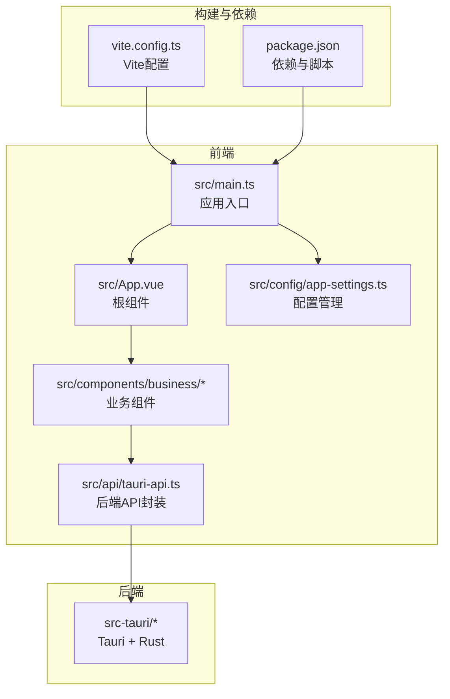
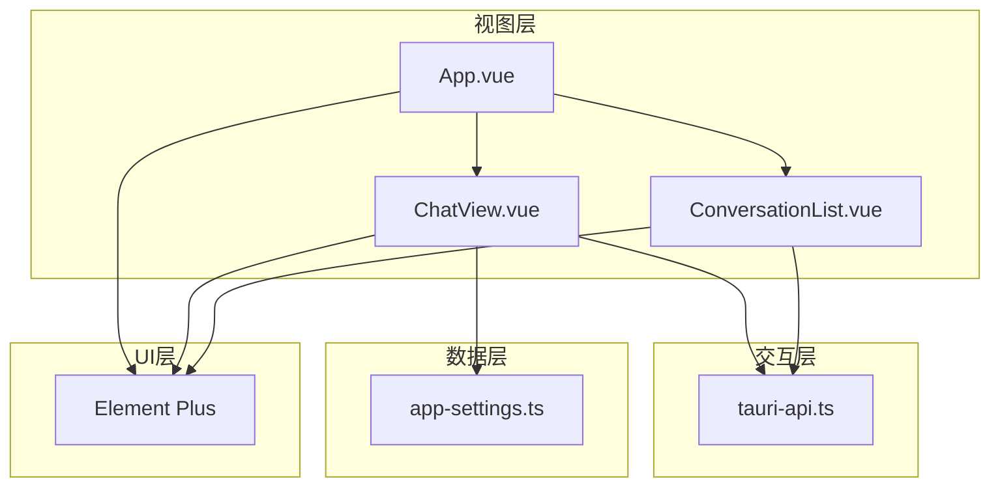
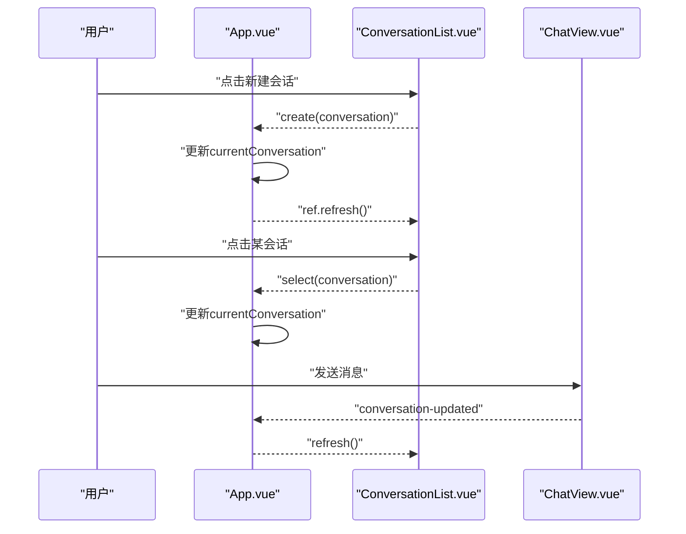
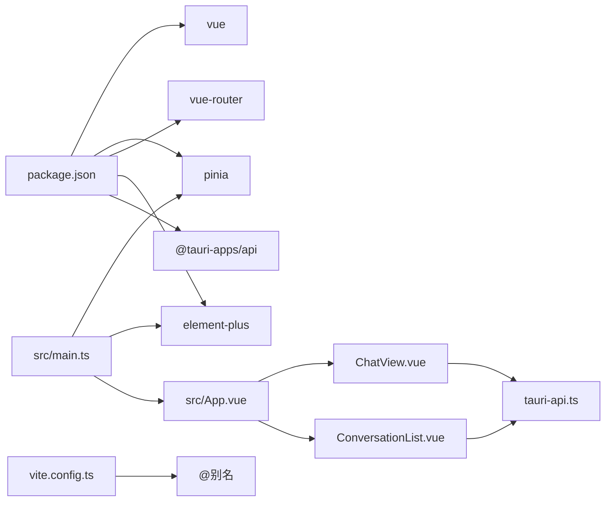

# 前端架构设计

<cite>
**本文引用的文件**
- [README.md](file://README.md)
- [package.json](file://package.json)
- [vite.config.ts](file://vite.config.ts)
- [src/main.ts](file://src/main.ts)
- [src/App.vue](file://src/App.vue)
- [src/components/business/ChatView.vue](file://src/components/business/ChatView.vue)
- [src/components/business/ConversationList.vue](file://src/components/business/ConversationList.vue)
- [src/api/tauri-api.ts](file://src/api/tauri-api.ts)
- [src/config/app-settings.ts](file://src/config/app-settings.ts)
</cite>

## 目录
1. [引言](#引言)
2. [项目结构](#项目结构)
3. [核心组件](#核心组件)
4. [架构总览](#架构总览)
5. [详细组件分析](#详细组件分析)
6. [依赖分析](#依赖分析)
7. [性能考虑](#性能考虑)
8. [故障排查指南](#故障排查指南)
9. [结论](#结论)
10. [附录](#附录)

## 引言
本文件面向Malou Agent前端架构，聚焦Vue 3单页应用的设计与实现，涵盖组件层次结构、路由与状态管理、Composition API使用模式、组件通信机制、响应式数据绑定、Element Plus集成与样式策略、生命周期与事件处理、错误边界、Pinia组织方式与持久化策略，以及组件复用、插槽与自定义指令等实践建议。文档以仓库现有代码为依据，结合概念性说明帮助读者快速理解并扩展系统。

## 项目结构
Malou Agent采用“前端Vue + 后端Tauri”的混合架构。前端通过Vite构建，使用Vue 3 + TypeScript + Element Plus + Pinia；后端通过Tauri桥接Rust能力，前端通过invoke调用后端能力。项目关键目录与职责如下：
- src：前端源码
  - components/business：业务组件（如聊天视图、会话列表、文档管理）
  - api：与后端交互的API封装（基于Tauri invoke）
  - config：应用配置与模型配置管理
  - stores：状态管理（当前未在仓库中发现具体文件，但已在main.ts注册Pinia）
  - composables：组合式逻辑（当前未在仓库中发现具体文件）
  - utils：工具类（如日志）
  - App.vue：根组件
  - main.ts：应用入口，初始化Pinia与Element Plus
- src-tauri：Rust后端，提供数据库、ONNX推理、向量搜索等能力
- docs：项目文档

图表来源
- [src/main.ts](file://src/main.ts#L1-L13)
- [src/App.vue](file://src/App.vue#L1-L121)
- [src/api/tauri-api.ts](file://src/api/tauri-api.ts#L1-L242)
- [src/config/app-settings.ts](file://src/config/app-settings.ts#L1-L195)
- [vite.config.ts](file://vite.config.ts#L1-L17)
- [package.json](file://package.json#L1-L31)

章节来源
- [README.md](file://README.md#L45-L61)
- [package.json](file://package.json#L14-L22)
- [vite.config.ts](file://vite.config.ts#L1-L17)
- [src/main.ts](file://src/main.ts#L1-L13)

## 核心组件
- 根组件App.vue：负责应用布局、标签页切换、业务组件编排与跨组件事件传递（会话选择、创建、设置打开）。
- 业务组件
  - ChatView.vue：聊天视图，负责消息渲染、输入处理、模型切换、数据库测试、清空历史等。
  - ConversationList.vue：会话列表，负责会话加载、创建、编辑标题、删除、高亮当前会话等。
- API封装：tauri-api.ts统一暴露invoke调用，屏蔽后端细节。
- 配置管理：app-settings.ts提供响应式配置、校验、合并、持久化与模型选择逻辑。

章节来源
- [src/App.vue](file://src/App.vue#L1-L121)
- [src/components/business/ChatView.vue](file://src/components/business/ChatView.vue#L1-L569)
- [src/components/business/ConversationList.vue](file://src/components/business/ConversationList.vue#L1-L367)
- [src/api/tauri-api.ts](file://src/api/tauri-api.ts#L1-L242)
- [src/config/app-settings.ts](file://src/config/app-settings.ts#L1-L195)

## 架构总览
前端采用“组件驱动 + API封装 + 配置管理”的分层架构：
- 视图层：App.vue作为容器，业务组件（ChatView、ConversationList）承载具体功能。
- 交互层：组件通过props、emits进行父子通信；通过API封装与后端交互。
- 数据层：配置管理（localStorage持久化）、响应式数据（ref、computed、watch）。
- UI层：Element Plus提供组件与主题样式。

图表来源
- [src/App.vue](file://src/App.vue#L1-L121)
- [src/components/business/ChatView.vue](file://src/components/business/ChatView.vue#L1-L569)
- [src/components/business/ConversationList.vue](file://src/components/business/ConversationList.vue#L1-L367)
- [src/api/tauri-api.ts](file://src/api/tauri-api.ts#L1-L242)
- [src/config/app-settings.ts](file://src/config/app-settings.ts#L1-L195)

## 详细组件分析

### 组件层次与通信机制
- 层次关系
  - App.vue为根容器，内含Header（标签页）、Main（内容区），内容区根据activeTab切换不同页面。
  - 聊天页采用左右布局：左侧ConversationList，右侧ChatView。
- 通信机制
  - 父子通信：ConversationList通过select/create事件向上抛出；App.vue接收后更新currentConversation并触发列表刷新。
  - 子到父：ChatView通过conversation-updated事件通知App.vue刷新会话列表；通过open-settings事件打开设置页。
  - 配置共享：ChatView内部读取应用配置（模型列表、当前模型），并在切换后反馈UI状态。

图表来源
- [src/App.vue](file://src/App.vue#L13-L31)
- [src/components/business/ConversationList.vue](file://src/components/business/ConversationList.vue#L66-L84)
- [src/components/business/ChatView.vue](file://src/components/business/ChatView.vue#L163-L222)

章节来源
- [src/App.vue](file://src/App.vue#L1-L121)
- [src/components/business/ConversationList.vue](file://src/components/business/ConversationList.vue#L1-L367)
- [src/components/business/ChatView.vue](file://src/components/business/ChatView.vue#L1-L569)

### Composition API使用模式
- 响应式数据
  - ref：用于基本状态（activeTab、currentConversation、messages、inputMessage、isLoading、appConfig等）。
  - computed：用于派生状态（availableModels、currentModel、formatTime等）。
  - watch：监听props变化（会话切换时重新加载消息）。
- 生命周期
  - onMounted：在ChatView中加载配置，在ConversationList中加载会话列表。
  - nextTick：在消息更新后滚动到底部，确保DOM更新完成。
- 组合式逻辑
  - 将消息转换、滚动控制、时间格式化等逻辑封装为局部函数，提升可读性与复用性。

章节来源
- [src/components/business/ChatView.vue](file://src/components/business/ChatView.vue#L1-L569)
- [src/components/business/ConversationList.vue](file://src/components/business/ConversationList.vue#L1-L367)

### 响应式数据绑定与样式管理
- 响应式绑定
  - v-model双向绑定输入框；v-if/v-else控制页面切换；v-for渲染消息与会话项；v-loading控制加载态。
- 样式策略
  - scoped样式隔离组件样式；Element Plus内置样式覆盖与主题变量；通过CSS变量与动画增强交互体验（如打字机效果）。

章节来源
- [src/App.vue](file://src/App.vue#L34-L120)
- [src/components/business/ChatView.vue](file://src/components/business/ChatView.vue#L285-L569)
- [src/components/business/ConversationList.vue](file://src/components/business/ConversationList.vue#L165-L367)

### Element Plus集成与主题定制
- 集成方式
  - 在main.ts中安装Element Plus插件，并引入全局样式。
  - 组件中直接使用ElMessage、ElMessageBox、ElDropdown、ElButton、ElInput等组件。
- 主题与样式
  - 通过Element Plus提供的组件样式与图标库实现一致的UI风格；未见自定义主题文件，建议在项目中新增主题覆盖文件以满足品牌需求。

章节来源
- [src/main.ts](file://src/main.ts#L1-L13)
- [src/components/business/ChatView.vue](file://src/components/business/ChatView.vue#L1-L569)
- [src/components/business/ConversationList.vue](file://src/components/business/ConversationList.vue#L1-L367)

### 错误边界与异常处理
- 组件内错误处理
  - API调用try/catch捕获异常，使用ElMessage提示用户；对不可恢复错误进行回滚（如发送失败时移除临时消息）。
- 用户交互保护
  - 通过禁用按钮与加载态避免重复提交；对空输入与无效会话进行前置校验。
- 日志记录
  - 使用logger记录成功与失败事件，便于问题定位与审计。

章节来源
- [src/components/business/ChatView.vue](file://src/components/business/ChatView.vue#L140-L222)
- [src/components/business/ConversationList.vue](file://src/components/business/ConversationList.vue#L54-L147)

### 状态管理与持久化策略
- 当前实现
  - main.ts注册了Pinia，但未发现stores目录下的具体store模块；配置管理通过app-settings.ts实现localStorage持久化。
- 推荐实践
  - 将全局配置与会话状态迁移至Pinia store，利用store的模块化与持久化插件（如pinia-plugin-persistedstate）实现跨页面状态共享与持久化。
  - 对高频变更的状态（如当前会话、模型选择）使用store集中管理，减少props钻取与事件传播层级。

章节来源
- [src/main.ts](file://src/main.ts#L1-L13)
- [src/config/app-settings.ts](file://src/config/app-settings.ts#L1-L195)

### 组件复用、插槽与自定义指令
- 组件复用
  - 通过props与emits抽象通用行为（如列表加载、编辑、删除），在多个场景下复用同一组件。
- 插槽使用
  - Element Plus组件支持具名插槽（如append插槽），用于扩展输入框附加按钮。
- 自定义指令
  - 未在现有代码中发现自定义指令；可在需要时通过指令实现通用交互（如防抖、占位符替换等）。

章节来源
- [src/components/business/ChatView.vue](file://src/components/business/ChatView.vue#L381-L397)
- [src/components/business/ConversationList.vue](file://src/components/business/ConversationList.vue#L194-L203)

## 依赖分析
- 前端依赖
  - Vue 3、Element Plus、Pinia、vue-router、@tauri-apps/api等。
- 构建与开发
  - Vite提供开发服务器与打包能力；别名@指向src目录，简化导入路径。
- 与后端耦合点
  - 通过tauri-api.ts的invoke调用后端能力，降低耦合度；API接口清晰，便于替换与扩展。

图表来源
- [package.json](file://package.json#L14-L22)
- [vite.config.ts](file://vite.config.ts#L8-L12)
- [src/main.ts](file://src/main.ts#L1-L13)
- [src/App.vue](file://src/App.vue#L1-L121)
- [src/components/business/ChatView.vue](file://src/components/business/ChatView.vue#L1-L569)
- [src/components/business/ConversationList.vue](file://src/components/business/ConversationList.vue#L1-L367)
- [src/api/tauri-api.ts](file://src/api/tauri-api.ts#L1-L242)

章节来源
- [package.json](file://package.json#L1-L31)
- [vite.config.ts](file://vite.config.ts#L1-L17)
- [src/main.ts](file://src/main.ts#L1-L13)

## 性能考虑
- 渲染优化
  - 使用v-show/v-if合理控制元素显隐；对长列表使用虚拟滚动（Element Plus提供相关能力）。
- 网络请求
  - 对频繁调用的API增加节流/防抖；对批量操作合并请求。
- 内存管理
  - 及时清理定时器与事件监听；避免在组件销毁后仍持有引用。
- 样式与资源
  - 按需引入Element Plus组件与图标，减少打包体积；合理拆分样式，避免全局污染。

## 故障排查指南
- 常见问题
  - 无法加载会话列表：检查后端服务是否启动、invoke调用是否返回正确数据类型。
  - 发送消息失败：确认当前会话存在、网络连通性、后端模型配置。
  - 模型切换无效：检查配置管理是否正确更新currentModel并持久化。
- 调试建议
  - 使用浏览器开发者工具查看网络请求与响应；在组件中打印关键状态；利用ElMessage输出中间状态。

章节来源
- [src/components/business/ChatView.vue](file://src/components/business/ChatView.vue#L140-L222)
- [src/components/business/ConversationList.vue](file://src/components/business/ConversationList.vue#L54-L147)
- [src/config/app-settings.ts](file://src/config/app-settings.ts#L136-L140)

## 结论
Malou Agent前端以Vue 3为核心，结合Element Plus与Pinia，形成清晰的组件化架构。通过API封装与配置管理，实现了前后端解耦与状态持久化。建议后续完善Pinia store模块与持久化策略，进一步提升状态一致性与可维护性；同时可引入指令与更细粒度的复用组件，增强开发效率与用户体验。

## 附录
- 快速开始
  - 安装依赖、启动开发服务器、构建生产包、运行桌面应用。
- 项目结构参考
  - 前端src目录、后端src-tauri目录、文档docs目录。

章节来源
- [README.md](file://README.md#L29-L43)
- [README.md](file://README.md#L45-L61)