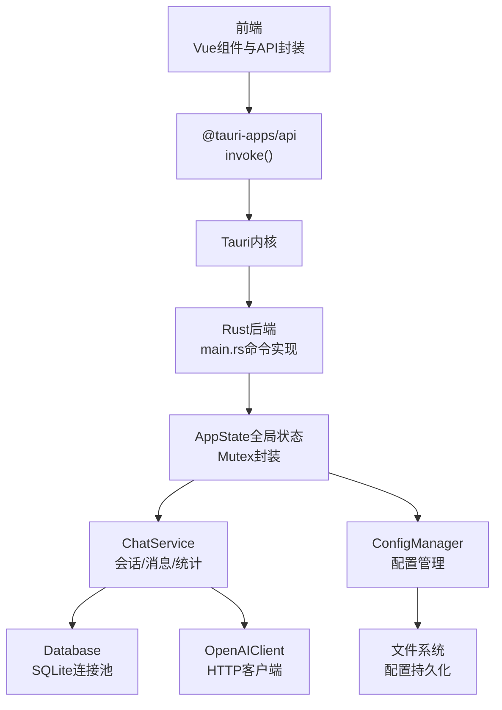
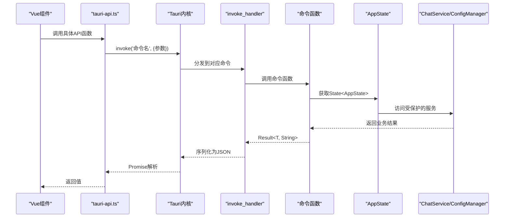
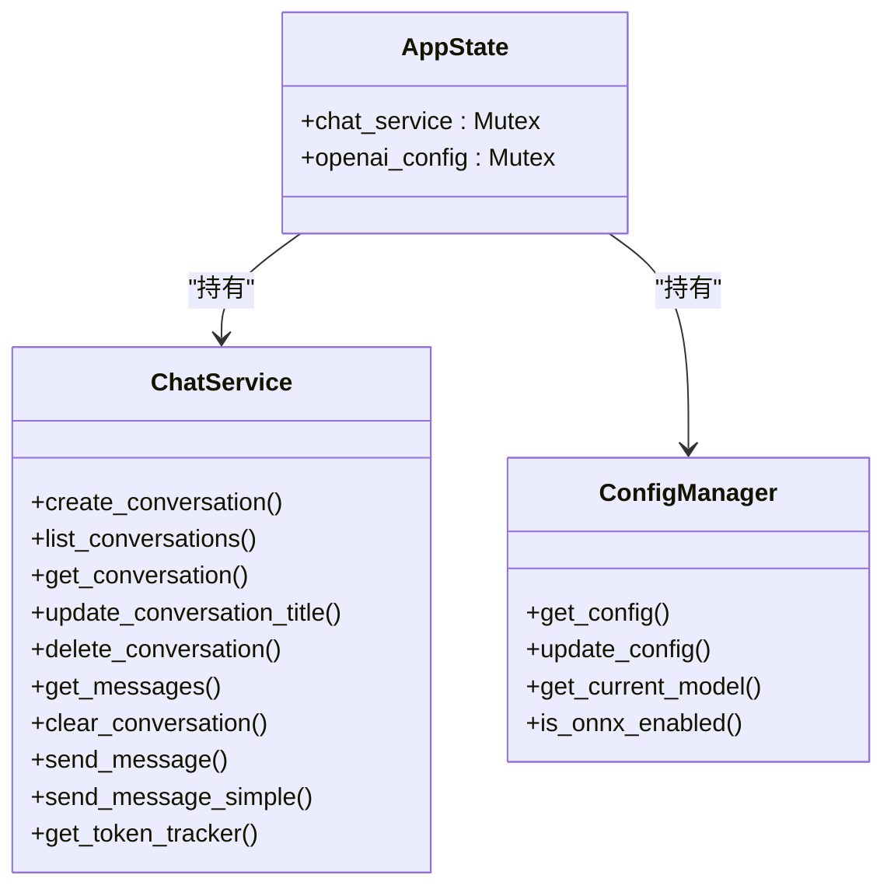
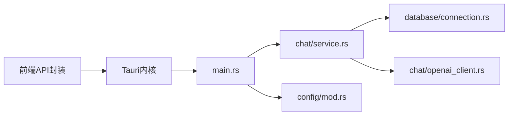

# Tauri命令系统

<cite>
**本文档引用的文件**
- [src-tauri/src/main.rs](file://src-tauri/src/main.rs)
- [src-tauri/Cargo.toml](file://src-tauri/Cargo.toml)
- [src-tauri/tauri.conf.json](file://src-tauri/tauri.conf.json)
- [src/api/tauri-api.ts](file://src/api/tauri-api.ts)
- [src-tauri/src/chat/service.rs](file://src-tauri/src/chat/service.rs)
- [src-tauri/src/config/mod.rs](file://src-tauri/src/config/mod.rs)
- [src-tauri/src/database/models.rs](file://src-tauri/src/database/models.rs)
- [src-tauri/src/token_tracker/tracker.rs](file://src-tauri/src/token_tracker/tracker.rs)
- [src-tauri/src/chat/openai_client.rs](file://src-tauri/src/chat/openai_client.rs)
- [src-tauri/src/database/connection.rs](file://src-tauri/src/database/connection.rs)
- [src-tauri/src/chat/conversation_repo.rs](file://src-tauri/src/chat/conversation_repo.rs)
- [src-tauri/src/chat/message_repo.rs](file://src-tauri/src/chat/message_repo.rs)
- [src/components/business/ChatView.vue](file://src/components/business/ChatView.vue)
- [src/main.ts](file://src/main.ts)
</cite>

## 目录
1. [简介](#简介)
2. [项目结构](#项目结构)
3. [核心组件](#核心组件)
4. [架构总览](#架构总览)
5. [详细组件分析](#详细组件分析)
6. [依赖关系分析](#依赖关系分析)
7. [性能考虑](#性能考虑)
8. [故障排查指南](#故障排查指南)
9. [结论](#结论)
10. [附录](#附录)

## 简介
本文件系统性阐述 Malou Agent 的 Tauri 命令系统，覆盖以下主题：
- Tauri 命令装饰器与命令注册机制
- 参数序列化与反序列化流程
- 全局状态 AppState 的设计与线程安全
- 并发控制与 Mutex/RwLock 的使用策略
- 异步命令处理、错误传播与返回值格式化
- 命令生命周期、状态传递与资源清理最佳实践
- 实际命令示例：会话管理、消息处理、配置管理

## 项目结构
Malou Agent 采用前后端分离的 Tauri 架构：
- 前端：Vue 3 + TypeScript，通过 @tauri-apps/api 调用后端命令
- 后端：Rust + Tauri，通过 #[tauri::command] 装饰器暴露命令，并在 main.rs 中集中注册

图表来源
- [src-tauri/src/main.rs](file://src-tauri/src/main.rs#L242-L315)
- [src/api/tauri-api.ts](file://src/api/tauri-api.ts#L1-L242)
- [src-tauri/src/chat/service.rs](file://src-tauri/src/chat/service.rs#L1-L224)
- [src-tauri/src/config/mod.rs](file://src-tauri/src/config/mod.rs#L144-L248)
- [src-tauri/src/database/connection.rs](file://src-tauri/src/database/connection.rs#L8-L58)

章节来源
- [src-tauri/src/main.rs](file://src-tauri/src/main.rs#L242-L315)
- [src/api/tauri-api.ts](file://src/api/tauri-api.ts#L1-L242)
- [src-tauri/Cargo.toml](file://src-tauri/Cargo.toml#L1-L25)
- [src-tauri/tauri.conf.json](file://src-tauri/tauri.conf.json#L1-L32)

## 核心组件
- 命令装饰器与注册
  - 后端通过 #[tauri::command] 装饰函数，使其可被前端调用
  - 在 main.rs 的 invoke_handler 中集中注册所有命令
- 全局状态 AppState
  - 包含 ChatService 与 OpenAIConfig，均以 Mutex 包裹，确保线程安全
- 命令实现模式
  - 大多数命令接收 State<AppState>，从 Mutex 中取出互斥访问
  - 返回值统一为 Result<T, String>，错误字符串由 Tauri 自动序列化为 JSON

章节来源
- [src-tauri/src/main.rs](file://src-tauri/src/main.rs#L53-L56)
- [src-tauri/src/main.rs](file://src-tauri/src/main.rs#L285-L312)

## 架构总览
Tauri 命令调用链路如下：

图表来源
- [src/api/tauri-api.ts](file://src/api/tauri-api.ts#L71-L176)
- [src-tauri/src/main.rs](file://src-tauri/src/main.rs#L285-L312)
- [src-tauri/src/main.rs](file://src-tauri/src/main.rs#L71-L116)

## 详细组件分析

### 命令装饰器与注册机制
- 装饰器
  - #[tauri::command] 将 Rust 函数暴露为 Tauri 命令，自动处理参数序列化与返回值反序列化
- 注册
  - 在 main.rs 的 Builder.setup 中创建 AppState 并 app.manage
  - 通过 generate_handler! 将命令列表注入 invoke_handler
- 参数与返回值
  - 参数与返回值类型必须可序列化（Serde 支持）
  - 命令函数签名支持 State、AppHandle 等 Tauri 上下文

章节来源
- [src-tauri/src/main.rs](file://src-tauri/src/main.rs#L242-L312)
- [src-tauri/Cargo.toml](file://src-tauri/Cargo.toml#L12-L16)

### 全局状态管理 AppState
- 结构
  - chat_service: Mutex<ChatService>
  - openai_config: Mutex<OpenAIConfig>
- 生命周期
  - 在 app.setup 阶段创建并 app.manage 注入
  - 前端通过命令访问时，使用 tauri::State<'_, AppState> 获取
- 线程安全
  - 所有共享状态均以 Mutex 包裹，命令中通过 lock().unwrap() 获取互斥访问
  - 存在死锁风险，应避免在持有锁期间进行长时间阻塞或再次加锁

图表来源
- [src-tauri/src/main.rs](file://src-tauri/src/main.rs#L53-L56)
- [src-tauri/src/chat/service.rs](file://src-tauri/src/chat/service.rs#L13-L28)
- [src-tauri/src/config/mod.rs](file://src-tauri/src/config/mod.rs#L144-L147)

章节来源
- [src-tauri/src/main.rs](file://src-tauri/src/main.rs#L259-L270)
- [src-tauri/src/main.rs](file://src-tauri/src/main.rs#L53-L56)

### 并发控制与线程安全
- Mutex 与 RwLock
  - AppState 内部状态使用 Mutex 保护
  - ChatService 内部对 OpenAIClient 使用 Arc<RwLock<...>>，支持并发读写
- 锁粒度与死锁规避
  - 命令中尽量缩短持锁时间，避免在锁内执行 I/O 或异步操作
  - 对于 ChatService 的异步调用，遵循“先释放读锁再发起异步”的模式
- 线程安全接口
  - OpenAIClient 的 chat 方法为异步，需在读锁释放后再调用
  - Database 通过 Arc<Mutex<Connection>> 提供连接共享，execute 接口内部加锁

章节来源
- [src-tauri/src/chat/service.rs](file://src-tauri/src/chat/service.rs#L12-L35)
- [src-tauri/src/chat/service.rs](file://src-tauri/src/chat/service.rs#L128-L135)
- [src-tauri/src/database/connection.rs](file://src-tauri/src/database/connection.rs#L8-L58)

### 异步处理、错误处理与返回值格式化
- 异步命令
  - ChatService 的 send_message 为异步，命令函数通过 lock().unwrap() 获取同步句柄
  - OpenAIClient.chat 为异步 HTTP 请求，内部正确处理错误并返回字符串
- 错误处理
  - 命令返回 Result<T, String>，错误字符串由 Tauri 自动序列化
  - 业务层通过 map_err(|e| format!("...: {}", e)) 统一包装错误
- 返回值格式化
  - 所有命令返回值类型均实现 Serde 序列化
  - 前端通过 invoke() 接收 JSON 并解析为 TypeScript 类型

章节来源
- [src-tauri/src/main.rs](file://src-tauri/src/main.rs#L144-L161)
- [src-tauri/src/chat/openai_client.rs](file://src-tauri/src/chat/openai_client.rs#L75-L116)
- [src-tauri/src/chat/service.rs](file://src-tauri/src/chat/service.rs#L95-L177)

### 命令生命周期管理、状态传递与资源清理
- 生命周期
  - app.setup 初始化数据库、ChatService、AppState，并注入全局状态
  - 命令在应用运行期间持续可用
- 状态传递
  - 命令通过 State<AppState> 获取全局状态，避免重复初始化
  - 配置类命令通过 AppHandle.state 获取 ConfigManager
- 资源清理
  - Database 使用 Arc<Mutex<Connection>>，随应用退出自动释放
  - ChatService 内部的 OpenAIClient 为轻量结构体，无需手动清理

章节来源
- [src-tauri/src/main.rs](file://src-tauri/src/main.rs#L242-L284)
- [src-tauri/src/config/mod.rs](file://src-tauri/src/config/mod.rs#L258-L276)

### 会话管理命令
- 命令清单
  - create_conversation、list_conversations、get_conversation、update_conversation_title、delete_conversation
- 实现要点
  - 通过 ConversationRepo 执行 CRUD 操作
  - 统一错误包装与返回值格式化
  - 支持分页参数（limit/offset）

章节来源
- [src-tauri/src/main.rs](file://src-tauri/src/main.rs#L71-L116)
- [src-tauri/src/chat/conversation_repo.rs](file://src-tauri/src/chat/conversation_repo.rs#L14-L152)

### 消息处理命令
- 命令清单
  - get_conversation_messages、clear_conversation_messages、send_message
- 实现要点
  - send_message 支持两种模式：真实 OpenAI 调用与简单回显（用于测试）
  - Token 统计与会话统计在 ChatService 中维护
  - 返回值包含消息详情与 Token 使用情况

章节来源
- [src-tauri/src/main.rs](file://src-tauri/src/main.rs#L120-L161)
- [src-tauri/src/chat/service.rs](file://src-tauri/src/chat/service.rs#L94-L177)

### 配置管理命令
- 命令清单
  - get_app_config、update_app_config、get_current_model_info、update_model_selection、toggle_local_models、toggle_onnx_feature
- 实现要点
  - ConfigManager 通过 Mutex 注入 AppState
  - 配置变更持久化到文件系统
  - 支持按字段片段更新（update_section）

章节来源
- [src-tauri/src/config/mod.rs](file://src-tauri/src/config/mod.rs#L258-L334)
- [src-tauri/src/config/mod.rs](file://src-tauri/src/config/mod.rs#L149-L206)

### Token 统计命令
- 命令清单
  - get_token_usage_summary、get_token_usage_trend
- 实现要点
  - TokenTracker 基于 SQLite 维护 Token 使用记录
  - 支持按日期范围聚合与每日趋势查询

章节来源
- [src-tauri/src/main.rs](file://src-tauri/src/main.rs#L165-L186)
- [src-tauri/src/token_tracker/tracker.rs](file://src-tauri/src/token_tracker/tracker.rs#L14-L194)

### OpenAI 配置命令
- 命令清单
  - get_openai_config、save_openai_config
- 实现要点
  - OpenAIConfig 存储在 AppState 中，save 仅更新内存状态
  - ChatService 的 OpenAI 客户端更新因线程限制暂未启用

章节来源
- [src-tauri/src/main.rs](file://src-tauri/src/main.rs#L189-L215)
- [src-tauri/src/chat/service.rs](file://src-tauri/src/chat/service.rs#L32-L35)

### 数据库测试命令
- 命令清单
  - test_database
- 实现要点
  - 串联会话创建、消息发送、消息查询与删除，验证数据库链路

章节来源
- [src-tauri/src/main.rs](file://src-tauri/src/main.rs#L219-L238)

### 前端集成示例
- 前端通过 tauri-api.ts 封装 invoke 调用
- ChatView.vue 展示了消息获取、发送与配置切换的实际使用

章节来源
- [src/api/tauri-api.ts](file://src/api/tauri-api.ts#L108-L176)
- [src/components/business/ChatView.vue](file://src/components/business/ChatView.vue#L117-L200)

## 依赖关系分析
- Rust 依赖
  - tauri、serde、tokio、uuid、chrono、reqwest、rusqlite
- 前端依赖
  - @tauri-apps/api 用于命令调用
- 关键耦合点
  - main.rs 与各模块通过 State/AppHandle 解耦
  - ChatService 与 Database、OpenAIClient 形成清晰边界

图表来源
- [src-tauri/Cargo.toml](file://src-tauri/Cargo.toml#L12-L24)
- [src-tauri/src/main.rs](file://src-tauri/src/main.rs#L1-L13)
- [src/api/tauri-api.ts](file://src/api/tauri-api.ts#L1-L242)

章节来源
- [src-tauri/Cargo.toml](file://src-tauri/Cargo.toml#L12-L24)
- [src-tauri/src/main.rs](file://src-tauri/src/main.rs#L1-L13)

## 性能考虑
- 并发读写
  - ChatService 对 OpenAIClient 使用 RwLock，允许多个读取并发，减少锁竞争
- 数据库并发
  - SQLite 采用 WAL 模式提升并发性能；Database.execute 内部加锁保证一致性
- 锁持有时间
  - 命令中尽量缩短持锁时间，避免在锁内进行网络或磁盘 I/O
- 序列化开销
  - 大对象（如消息列表）建议分页传输，减少单次序列化负载

## 故障排查指南
- 常见错误类型
  - 数据库初始化失败：检查 get_default_db_path 与权限
  - OpenAI API 错误：检查 API Key、Base URL 与网络连通性
  - 会话/消息操作失败：确认 conversation_id 有效且存在
- 排查步骤
  - 启用前端日志，捕获 invoke 返回的错误字符串
  - 在后端打印中间状态，定位锁竞争或死锁
  - 使用 test_database 命令快速验证数据库链路
- 修复建议
  - 对长时间阻塞操作使用异步任务，避免阻塞主线程
  - 对频繁读取场景优先使用只读锁，必要时降级为普通锁

章节来源
- [src-tauri/src/main.rs](file://src-tauri/src/main.rs#L248-L254)
- [src-tauri/src/chat/openai_client.rs](file://src-tauri/src/chat/openai_client.rs#L94-L98)
- [src-tauri/src/main.rs](file://src-tauri/src/main.rs#L220-L238)

## 结论
Malou Agent 的 Tauri 命令系统通过 #[tauri::command] 装饰器与集中注册机制，实现了前后端的清晰分层。AppState 以 Mutex 保护全局状态，结合 ChatService 的 RwLock 设计，兼顾了线程安全与并发性能。命令层统一返回 Result<T, String>，配合前端 invoke()，形成一致的错误传播与数据交换协议。建议在后续迭代中：
- 重构 ChatService 以支持 Send，从而允许 OpenAI 客户端配置热更新
- 引入更细粒度的锁策略与超时控制
- 增强命令幂等性与事务一致性保障

## 附录
- 命令注册清单（节选）
  - 基础命令：get_app_info、test_database
  - 会话管理：create_conversation、list_conversations、get_conversation、update_conversation_title、delete_conversation
  - 消息管理：send_message、get_conversation_messages、clear_conversation_messages
  - Token 统计：get_token_usage_summary、get_token_usage_trend
  - OpenAI 配置：get_openai_config、save_openai_config
  - 配置管理：get_app_config、update_app_config、get_current_model_info、update_model_selection、toggle_local_models、toggle_onnx_feature

章节来源
- [src-tauri/src/main.rs](file://src-tauri/src/main.rs#L285-L312)