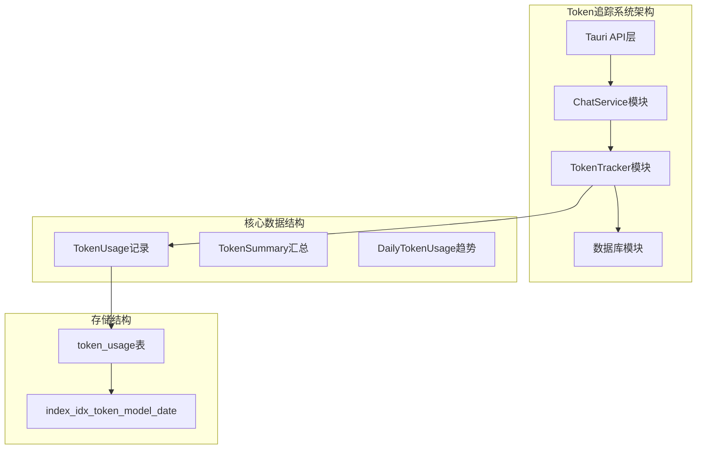
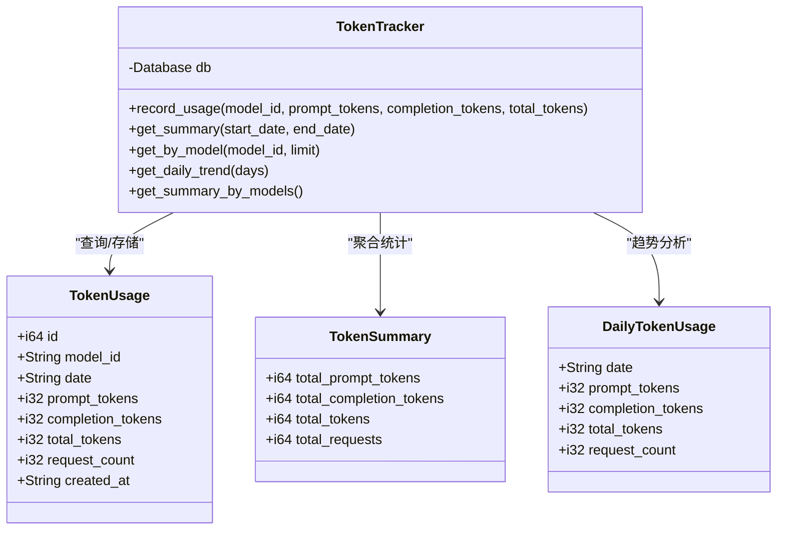
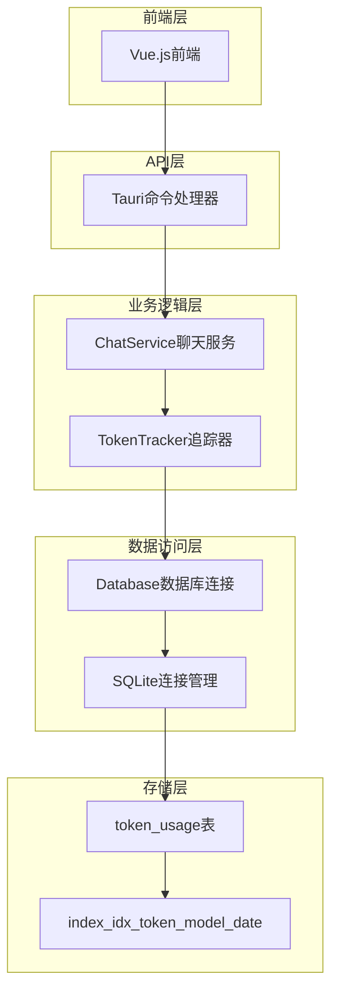
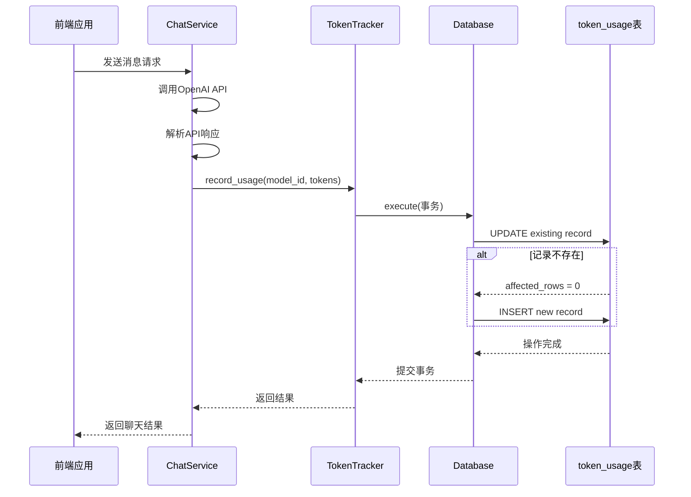
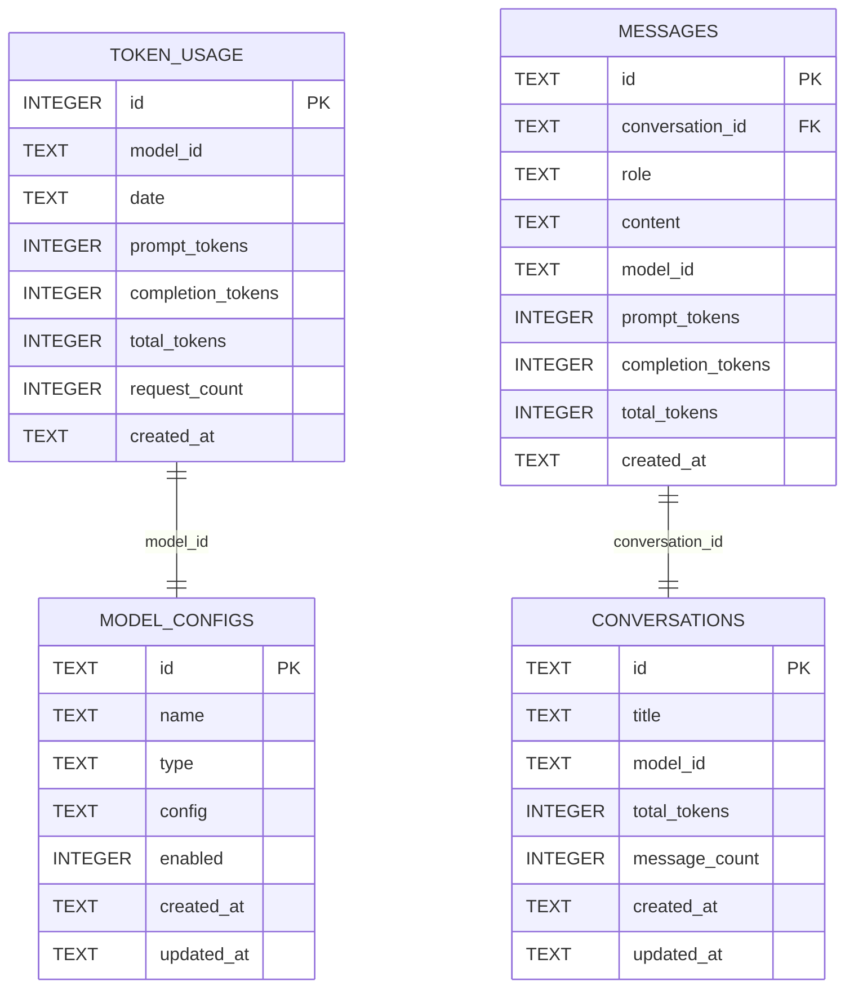
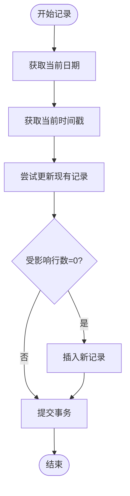
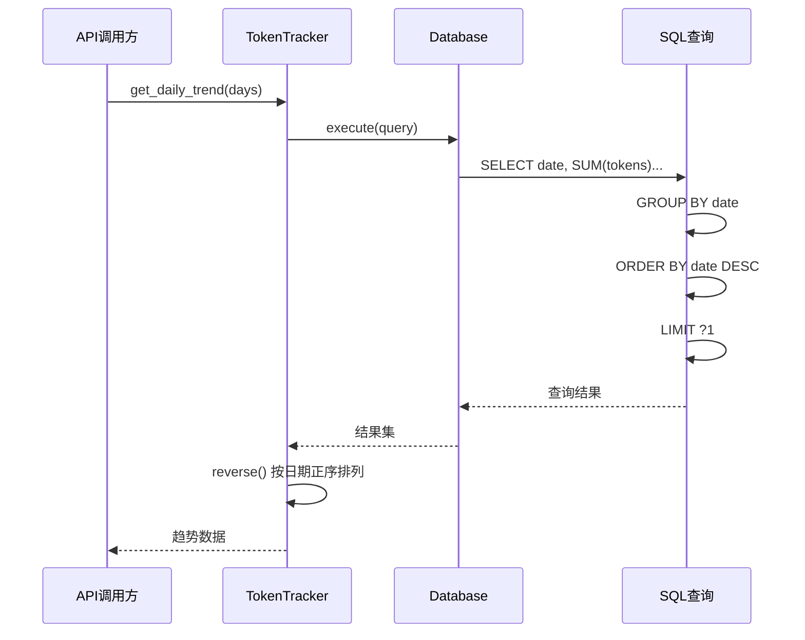
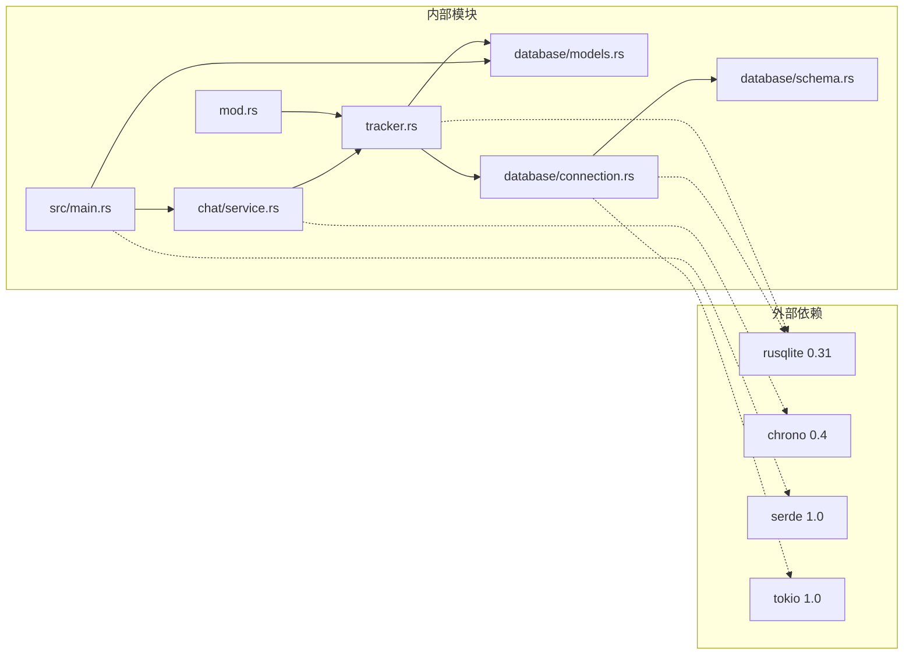
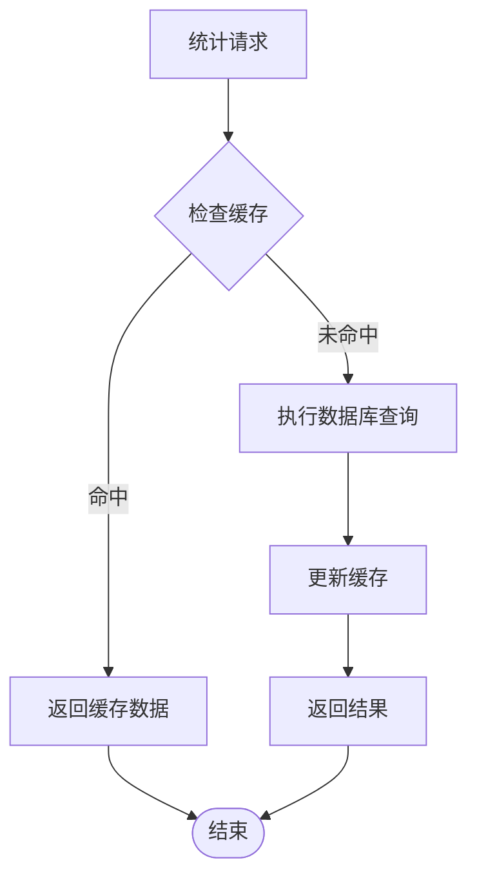

# Token追踪系统

<cite>
**本文档引用的文件**
- [src-tauri/src/token_tracker/mod.rs](file://src-tauri/src/token_tracker/mod.rs)
- [src-tauri/src/token_tracker/tracker.rs](file://src-tauri/src/token_tracker/tracker.rs)
- [src-tauri/src/database/models.rs](file://src-tauri/src/database/models.rs)
- [src-tauri/src/database/schema.rs](file://src-tauri/src/database/schema.rs)
- [src-tauri/src/database/connection.rs](file://src-tauri/src/database/connection.rs)
- [src-tauri/src/chat/service.rs](file://src-tauri/src/chat/service.rs)
- [src-tauri/src/main.rs](file://src-tauri/src/main.rs)
- [src-tauri/Cargo.toml](file://src-tauri/Cargo.toml)
</cite>

## 目录
1. [简介](#简介)
2. [项目结构](#项目结构)
3. [核心组件](#核心组件)
4. [架构概览](#架构概览)
5. [详细组件分析](#详细组件分析)
6. [依赖关系分析](#依赖关系分析)
7. [性能考虑](#性能考虑)
8. [故障排除指南](#故障排除指南)
9. [结论](#结论)

## 简介

Malou Agent Token追踪系统是一个基于Rust和SQLite的高性能Token使用统计追踪解决方案。该系统专注于AI模型的Token消耗监控，提供实时的使用统计、趋势分析和报表生成功能。

系统采用模块化设计，主要包含以下核心功能：
- **实时Token追踪**：记录每次API调用的Prompt Tokens、Completion Tokens和Total Tokens
- **多维度统计分析**：支持按日期、模型、时间段的综合统计
- **趋势预测能力**：提供每日使用趋势分析和使用模式识别
- **成本控制机制**：通过统计信息支持预算管理和成本分析
- **高性能存储**：基于SQLite的优化存储结构和查询机制

## 项目结构

Token追踪系统位于Rust后端代码中，采用清晰的模块化组织：

**图表来源**
- [src-tauri/src/token_tracker/mod.rs](file://src-tauri/src/token_tracker/mod.rs#L1-L4)
- [src-tauri/src/database/schema.rs](file://src-tauri/src/database/schema.rs#L34-L48)

**章节来源**
- [src-tauri/src/token_tracker/mod.rs](file://src-tauri/src/token_tracker/mod.rs#L1-L4)
- [src-tauri/src/database/schema.rs](file://src-tauri/src/database/schema.rs#L1-L68)

## 核心组件

### TokenTracker追踪器

TokenTracker是系统的核心组件，负责所有Token使用数据的收集、存储和查询。

**主要功能特性**：
- **原子性更新**：使用UPDATE语句进行原子性累加，避免竞态条件
- **智能插入**：当记录不存在时自动创建新记录
- **多维度查询**：支持按模型、日期范围、时间段的灵活查询
- **聚合统计**：提供总使用量、请求次数等关键指标

### 数据模型定义

系统定义了三种核心数据模型来支撑完整的统计分析：

**图表来源**
- [src-tauri/src/token_tracker/tracker.rs](file://src-tauri/src/token_tracker/tracker.rs#L4-L195)
- [src-tauri/src/database/models.rs](file://src-tauri/src/database/models.rs#L48-L78)

**章节来源**
- [src-tauri/src/token_tracker/tracker.rs](file://src-tauri/src/token_tracker/tracker.rs#L1-L195)
- [src-tauri/src/database/models.rs](file://src-tauri/src/database/models.rs#L1-L110)

## 架构概览

系统采用分层架构设计，确保高内聚低耦合：

**图表来源**
- [src-tauri/src/main.rs](file://src-tauri/src/main.rs#L242-L321)
- [src-tauri/src/chat/service.rs](file://src-tauri/src/chat/service.rs#L11-L29)
- [src-tauri/src/database/connection.rs](file://src-tauri/src/database/connection.rs#L8-L35)

**章节来源**
- [src-tauri/src/main.rs](file://src-tauri/src/main.rs#L1-L321)
- [src-tauri/src/chat/service.rs](file://src-tauri/src/chat/service.rs#L1-L224)

## 详细组件分析

### Token使用统计收集机制

Token使用统计的收集过程采用事件驱动的方式，在每次AI对话完成后自动触发：

**图表来源**
- [src-tauri/src/chat/service.rs](file://src-tauri/src/chat/service.rs#L160-L165)
- [src-tauri/src/token_tracker/tracker.rs](file://src-tauri/src/token_tracker/tracker.rs#L25-L47)

### 数据存储结构设计

系统采用优化的SQLite表结构来支持高效的统计查询：

**图表来源**
- [src-tauri/src/database/schema.rs](file://src-tauri/src/database/schema.rs#L34-L62)

**章节来源**
- [src-tauri/src/database/schema.rs](file://src-tauri/src/database/schema.rs#L1-L68)

### 计算算法实现

系统提供了多种统计计算算法来满足不同的分析需求：

#### 1. 实时更新算法

**图表来源**
- [src-tauri/src/token_tracker/tracker.rs](file://src-tauri/src/token_tracker/tracker.rs#L25-L47)

#### 2. 汇总统计算法

系统支持灵活的日期范围查询，采用条件分支优化不同查询场景：

| 查询场景 | SQL条件 | 性能特点 |
|---------|---------|----------|
| 全部数据 | 无WHERE条件 | 最快，适合小数据集 |
| 按开始日期 | WHERE date >= ?1 | 适合长期趋势分析 |
| 按结束日期 | WHERE date <= ?1 | 适合历史数据分析 |
| 日期范围 | WHERE date BETWEEN ?1 AND ?2 | 最灵活但较慢 |

**章节来源**
- [src-tauri/src/token_tracker/tracker.rs](file://src-tauri/src/token_tracker/tracker.rs#L51-L113)

### 每日使用趋势分析

系统提供强大的趋势分析功能，支持按天粒度的数据聚合：

**图表来源**
- [src-tauri/src/token_tracker/tracker.rs](file://src-tauri/src/token_tracker/tracker.rs#L144-L167)

**章节来源**
- [src-tauri/src/token_tracker/tracker.rs](file://src-tauri/src/token_tracker/tracker.rs#L143-L168)

### 汇总统计和报表生成

系统支持多层次的统计汇总，从全局到模型级别的详细分析：

#### 全局统计汇总
- 总Prompt Tokens使用量
- 总Completion Tokens使用量  
- 总Token消耗量
- 总请求次数

#### 模型级别统计
- 按模型ID分组的使用统计
- 支持按总使用量降序排列
- 便于识别高消耗模型

**章节来源**
- [src-tauri/src/token_tracker/tracker.rs](file://src-tauri/src/token_tracker/tracker.rs#L170-L193)

## 依赖关系分析

系统采用松耦合的设计，各组件间依赖关系清晰：

**图表来源**
- [src-tauri/Cargo.toml](file://src-tauri/Cargo.toml#L12-L25)
- [src-tauri/src/token_tracker/mod.rs](file://src-tauri/src/token_tracker/mod.rs#L1-L4)

**章节来源**
- [src-tauri/Cargo.toml](file://src-tauri/Cargo.toml#L1-L25)

## 性能考虑

### 存储优化策略

1. **索引优化**
   - `idx_token_model_date`: 按模型ID和日期的复合索引
   - 支持高效的按模型查询和日期范围查询

2. **WAL模式**
   - 启用Write-Ahead Logging模式提高并发性能
   - 支持更好的读写并发

3. **原子性操作**
   - 使用UPDATE语句进行原子性累加
   - 避免竞态条件和数据不一致

### 查询性能优化

1. **条件查询优化**
   - 根据查询参数动态选择最优SQL语句
   - 减少不必要的索引扫描

2. **结果集限制**
   - 趋势分析默认限制返回天数
   - 避免大数据集查询影响性能

3. **内存管理**
   - 使用Tokio Mutex保证线程安全
   - 避免不必要的数据复制

### 缓存机制设计

虽然当前版本未实现专用缓存，但系统具备良好的扩展性：

## 故障排除指南

### 常见问题及解决方案

#### 1. 数据库连接问题
**症状**：Token统计无法保存或查询失败
**原因**：SQLite连接异常或权限问题
**解决方案**：
- 检查数据库文件路径和权限
- 验证WAL模式是否正确启用
- 确认外键约束已启用

#### 2. 统计数据不准确
**症状**：Token使用量统计异常
**原因**：并发写入导致的数据竞争
**解决方案**：
- 确认UPDATE语句的原子性
- 检查事务提交机制
- 验证索引完整性

#### 3. 查询性能问题
**症状**：大量数据查询响应缓慢
**原因**：缺少适当的索引或查询条件不当
**解决方案**：
- 确认`idx_token_model_date`索引存在
- 优化日期范围查询条件
- 考虑增加查询结果限制

**章节来源**
- [src-tauri/src/database/connection.rs](file://src-tauri/src/database/connection.rs#L24-L28)
- [src-tauri/src/database/schema.rs](file://src-tauri/src/database/schema.rs#L46-L48)

## 结论

Malou Agent Token追踪系统是一个设计精良的统计分析解决方案，具有以下优势：

### 技术优势
- **高性能架构**：基于SQLite的优化存储和查询机制
- **实时统计**：原子性更新确保数据准确性
- **灵活查询**：支持多维度、多粒度的统计分析
- **线程安全**：Tokio异步模型保证并发安全性

### 功能特色
- **全面统计**：涵盖Prompt Tokens、Completion Tokens、Total Tokens的完整统计
- **趋势分析**：提供每日使用趋势和模式识别能力
- **模型对比**：支持多模型使用量对比分析
- **API集成**：通过Tauri命令提供完整的前端接口

### 扩展潜力
系统具备良好的扩展性，可以进一步增强：
- 实现专用缓存机制提升查询性能
- 添加预算控制和告警功能
- 集成更复杂的趋势预测算法
- 支持更多维度的统计分析

该系统为AI应用的成本控制和使用分析提供了坚实的技术基础，能够有效支持企业级的Token使用监控需求。