# 后端架构设计

<cite>
**本文档引用的文件**
- [Cargo.toml](file://src-tauri/Cargo.toml)
- [main.rs](file://src-tauri/src/main.rs)
- [tauri.conf.json](file://src-tauri/tauri.conf.json)
- [service.rs](file://src-tauri/src/chat/service.rs)
- [conversation_repo.rs](file://src-tauri/src/chat/conversation_repo.rs)
- [message_repo.rs](file://src-tauri/src/chat/message_repo.rs)
- [openai_client.rs](file://src-tauri/src/chat/openai_client.rs)
- [tracker.rs](file://src-tauri/src/token_tracker/tracker.rs)
- [connection.rs](file://src-tauri/src/database/connection.rs)
- [models.rs](file://src-tauri/src/database/models.rs)
- [schema.rs](file://src-tauri/src/database/schema.rs)
- [mod.rs](file://src-tauri/src/database/mod.rs)
- [chat_mod.rs](file://src-tauri/src/chat/mod.rs)
- [config_mod.rs](file://src-tauri/src/config/mod.rs)
- [vector_search.rs](file://src-tauri/src/vector_search.rs)
- [db_test.rs](file://src-tauri/src/db_test.rs)
</cite>

## 目录
1. [简介](#简介)
2. [项目结构](#项目结构)
3. [核心组件](#核心组件)
4. [架构概览](#架构概览)
5. [详细组件分析](#详细组件分析)
6. [依赖关系分析](#依赖关系分析)
7. [性能考虑](#性能考虑)
8. [故障排除指南](#故障排除指南)
9. [结论](#结论)
10. [附录](#附录)

## 简介
Malou Agent是一个基于Tauri的Rust桌面应用程序，专注于提供AI对话助手功能。该后端架构采用现代Rust编程语言和异步编程模式，结合内存安全保证，为桌面应用提供了稳定可靠的服务层。

本架构的核心特点包括：
- 基于Tauri的跨平台桌面应用框架
- Rust语言提供的内存安全保证
- 异步编程模式和Tokio运行时
- 分层架构设计（服务层、数据访问层、数据库层）
- Repository模式实现数据持久化
- 全局状态管理和并发控制
- 完整的命令系统和错误处理机制

## 项目结构
项目采用模块化组织方式，主要分为前端Vue应用和后端Tauri/Rust服务两大部分：

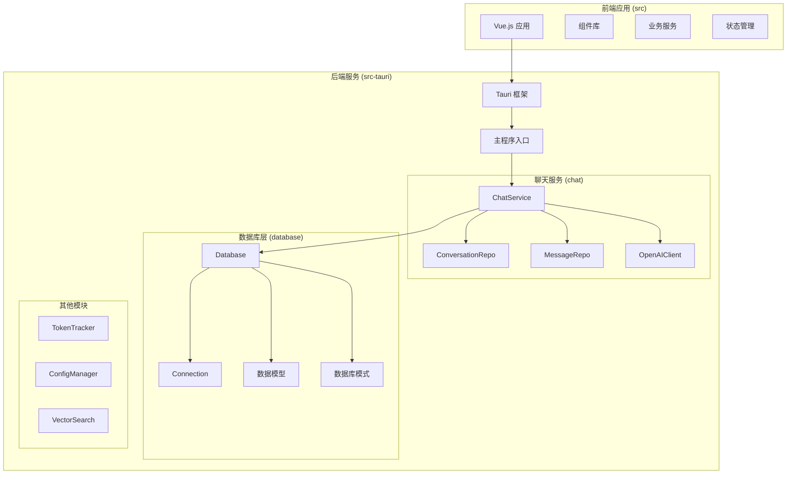

**图表来源**
- [main.rs](file://src-tauri/src/main.rs#L1-L316)
- [chat_mod.rs](file://src-tauri/src/chat/mod.rs#L1-L10)
- [mod.rs](file://src-tauri/src/database/mod.rs#L1-L7)

**章节来源**
- [main.rs](file://src-tauri/src/main.rs#L1-L316)
- [tauri.conf.json](file://src-tauri/tauri.conf.json#L1-L32)

## 核心组件
后端架构由多个核心组件构成，每个组件都有明确的职责和边界：

### 应用状态管理 (AppState)
应用状态通过Mutex进行保护，确保线程安全的全局状态管理：

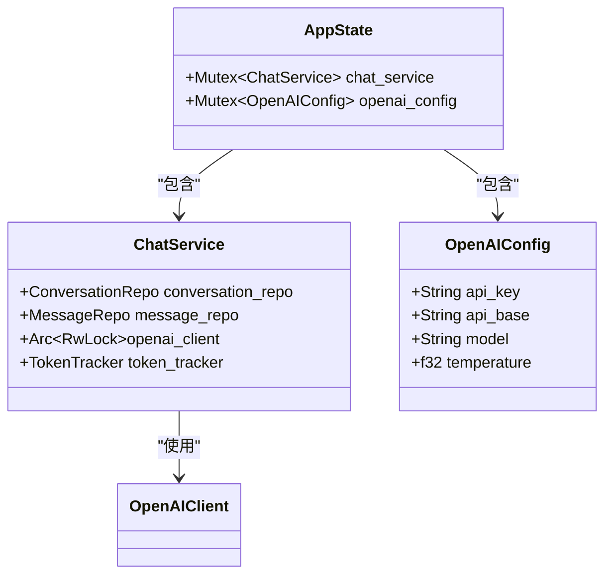

**图表来源**
- [main.rs](file://src-tauri/src/main.rs#L53-L56)
- [service.rs](file://src-tauri/src/chat/service.rs#L13-L18)

### 命令系统架构
Tauri命令系统提供了前端与后端的通信接口：

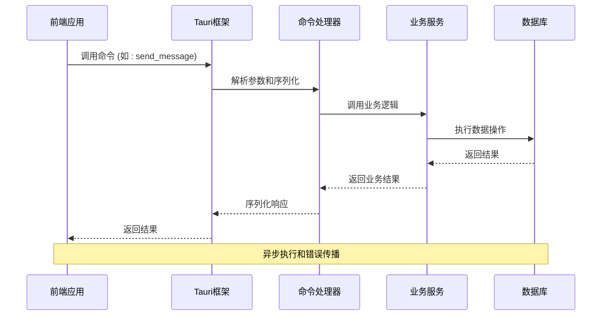

**图表来源**
- [main.rs](file://src-tauri/src/main.rs#L140-L161)
- [service.rs](file://src-tauri/src/chat/service.rs#L94-L177)

**章节来源**
- [main.rs](file://src-tauri/src/main.rs#L51-L316)

## 架构概览
整体架构采用分层设计，从上到下分别为：命令层、服务层、数据访问层和数据存储层：

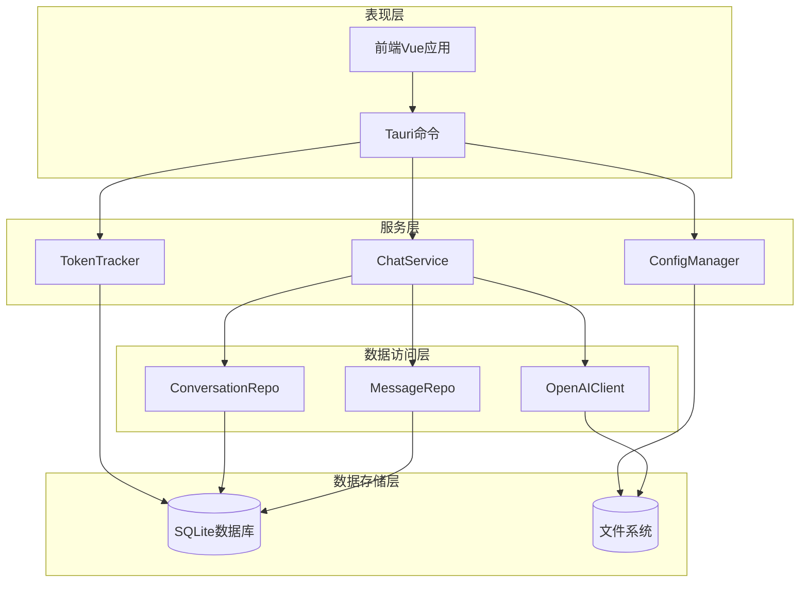

**图表来源**
- [main.rs](file://src-tauri/src/main.rs#L242-L316)
- [service.rs](file://src-tauri/src/chat/service.rs#L20-L29)

## 详细组件分析

### ChatService服务层设计
ChatService是核心业务服务，实现了完整的聊天功能：

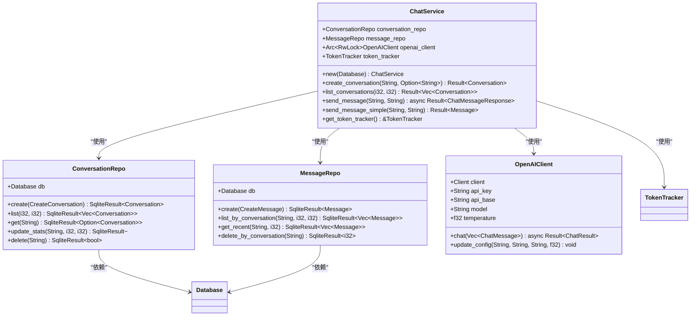

**图表来源**
- [service.rs](file://src-tauri/src/chat/service.rs#L11-L224)
- [conversation_repo.rs](file://src-tauri/src/chat/conversation_repo.rs#L4-L161)
- [message_repo.rs](file://src-tauri/src/chat/message_repo.rs#L4-L175)
- [openai_client.rs](file://src-tauri/src/chat/openai_client.rs#L4-L141)

#### 异步编程模式
ChatService采用了异步编程模式来处理I/O密集型操作：

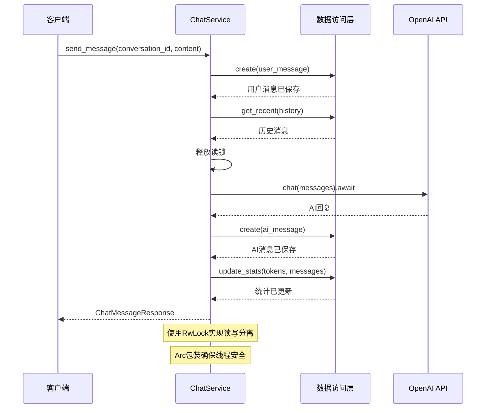

**图表来源**
- [service.rs](file://src-tauri/src/chat/service.rs#L94-L177)

**章节来源**
- [service.rs](file://src-tauri/src/chat/service.rs#L1-L224)

### Repository模式实现
Repository模式提供了清晰的数据访问抽象：

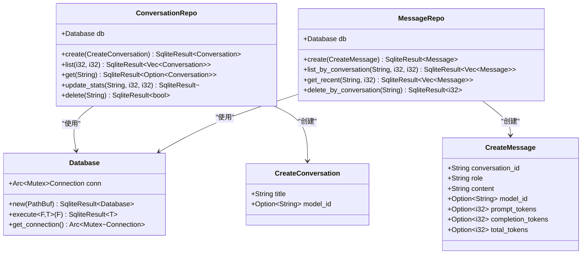

**图表来源**
- [conversation_repo.rs](file://src-tauri/src/chat/conversation_repo.rs#L14-L161)
- [message_repo.rs](file://src-tauri/src/chat/message_repo.rs#L14-L175)
- [connection.rs](file://src-tauri/src/database/connection.rs#L7-L58)

**章节来源**
- [conversation_repo.rs](file://src-tauri/src/chat/conversation_repo.rs#L1-L161)
- [message_repo.rs](file://src-tauri/src/chat/message_repo.rs#L1-L175)

### 数据库连接池管理
数据库连接通过Arc和Mutex实现线程安全共享：

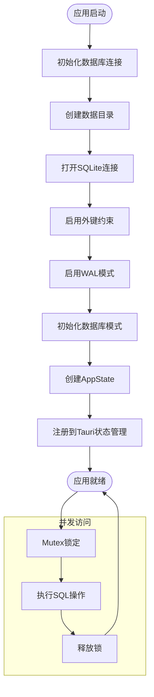

**图表来源**
- [connection.rs](file://src-tauri/src/database/connection.rs#L13-L43)
- [main.rs](file://src-tauri/src/main.rs#L248-L270)

**章节来源**
- [connection.rs](file://src-tauri/src/database/connection.rs#L1-L89)

### Token使用追踪系统
TokenTracker负责监控和统计API使用情况：

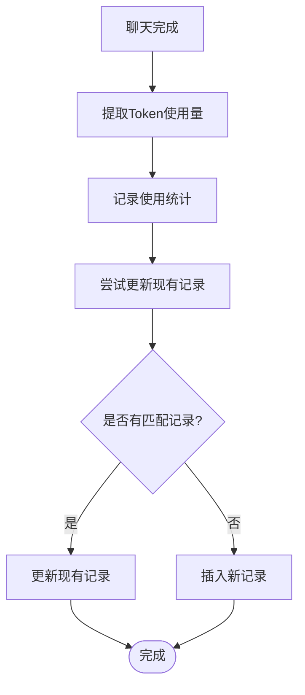

**图表来源**
- [tracker.rs](file://src-tauri/src/token_tracker/tracker.rs#L14-L48)

**章节来源**
- [tracker.rs](file://src-tauri/src/token_tracker/tracker.rs#L1-L195)

### 向量搜索引擎
向量搜索引擎支持多种相似度计算算法：

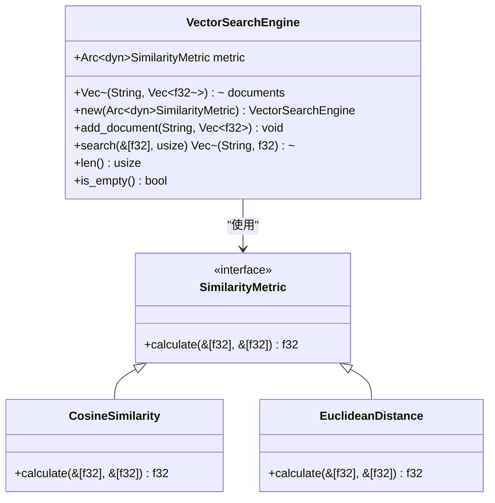

**图表来源**
- [vector_search.rs](file://src-tauri/src/vector_search.rs#L3-L84)

**章节来源**
- [vector_search.rs](file://src-tauri/src/vector_search.rs#L1-L84)

## 依赖关系分析
项目依赖关系清晰，采用模块化设计：

```mermaid
graph TB
subgraph "核心依赖"
Tauri[tauri = "2.0"]
Tokio[tokio = "1.0"]
Rusqlite[rusqlite = "0.31"]
Reqwest[reqwest = "0.12"]
end
subgraph "辅助依赖"
Serde[serde = "1.0"]
SerdeJson[serde_json = "1.0"]
UUID[uuid = "1.0"]
Chrono[chrono = "0.4"]
Image[image = "0.24"]
Dirs[dirs = "5.0"]
end
subgraph "项目模块"
MainModule[main.rs]
ChatModule[chat/]
DatabaseModule[database/]
TokenModule[token_tracker/]
ConfigModule[config/]
end
Tauri --> MainModule
Tokio --> MainModule
Rusqlite --> DatabaseModule
Reqwest --> ChatModule
Serde --> MainModule
UUID --> DatabaseModule
Chrono --> DatabaseModule
```

**图表来源**
- [Cargo.toml](file://src-tauri/Cargo.toml#L12-L25)

**章节来源**
- [Cargo.toml](file://src-tauri/Cargo.toml#L1-L25)

## 性能考虑
架构在多个层面考虑了性能优化：

### 并发控制策略
- 使用Arc<RwLock<T>>实现读多写少场景的高效并发
- Mutex保护全局状态，确保线程安全
- 异步I/O避免阻塞主线程

### 数据库性能优化
- WAL模式提升并发性能
- 外键约束确保数据一致性
- 合适的索引设计优化查询性能

### 内存管理
- RAII原则确保资源自动释放
- 智能指针避免内存泄漏
- 异步任务生命周期管理

## 故障排除指南
常见问题及解决方案：

### 命令执行错误
当Tauri命令执行失败时，错误信息会被转换为字符串返回给前端。检查点：
- 参数验证和序列化
- 数据库连接状态
- 文件系统权限

### 数据库连接问题
如果遇到数据库连接失败：
- 检查数据目录权限
- 验证数据库文件完整性
- 确认SQLite版本兼容性

### 异步任务超时
对于长时间运行的任务：
- 实现适当的超时机制
- 提供进度反馈
- 支持任务取消

**章节来源**
- [main.rs](file://src-tauri/src/main.rs#L140-L161)
- [connection.rs](file://src-tauri/src/database/connection.rs#L13-L43)

## 结论
Malou Agent的后端架构展现了现代Rust应用开发的最佳实践：

1. **内存安全保证**：完全基于Rust语言，提供编译时内存安全保障
2. **异步编程模式**：充分利用Tokio运行时，实现高效的并发处理
3. **清晰的架构分层**：Repository模式确保数据访问层的可测试性和可维护性
4. **完善的错误处理**：统一的错误类型和传播机制
5. **线程安全设计**：合理的并发控制策略确保多线程环境下的稳定性

该架构为桌面AI应用提供了坚实的技术基础，既保证了性能又确保了可靠性。

## 附录

### 数据库模式设计
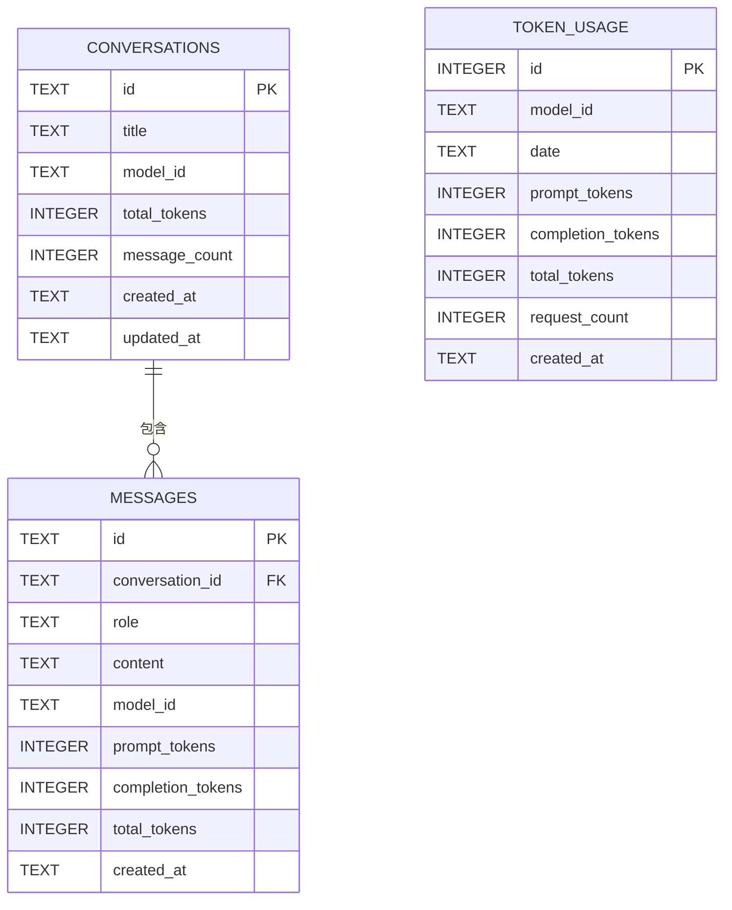

**图表来源**
- [schema.rs](file://src-tauri/src/database/schema.rs#L2-L62)

### 开发环境设置
- Rust工具链：建议使用最新稳定版本
- Tauri依赖：确保Node.js环境准备就绪
- 数据库：SQLite 3.35.0+版本
- 编辑器：VS Code配合Rust插件