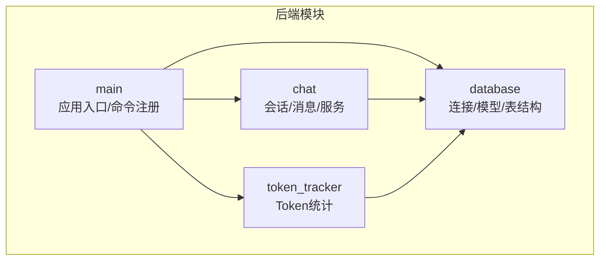
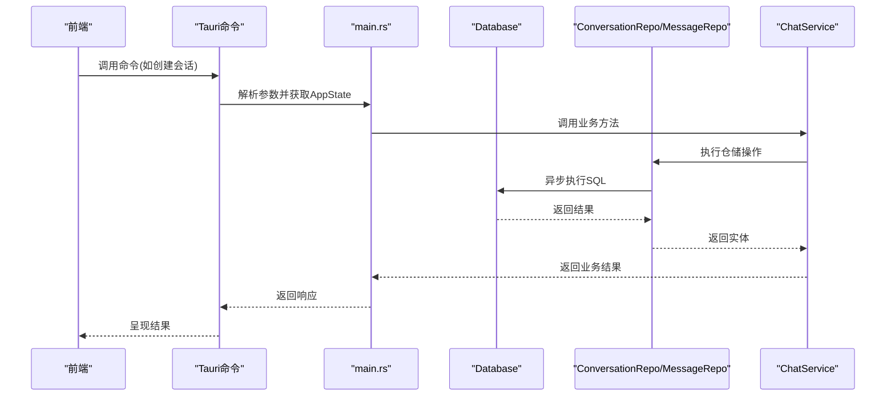
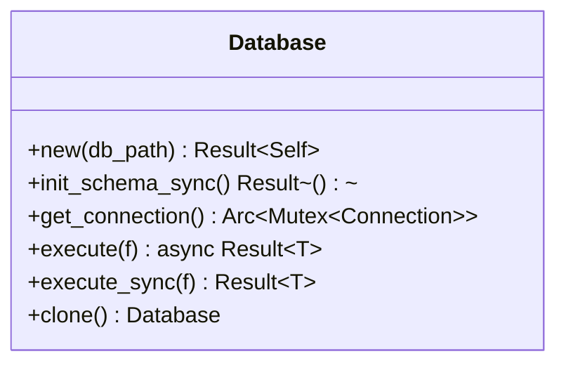
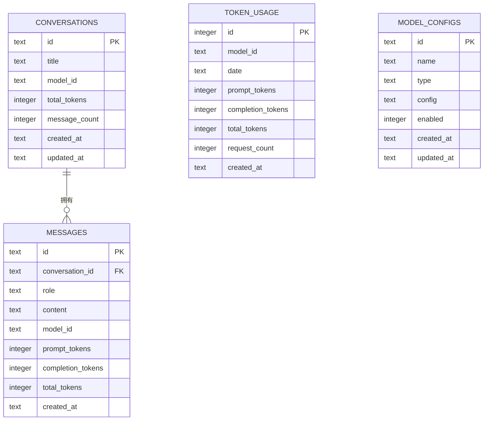
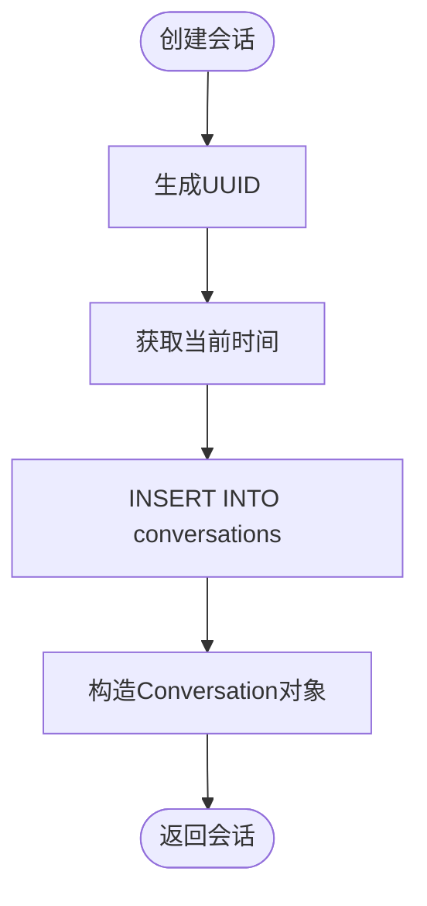
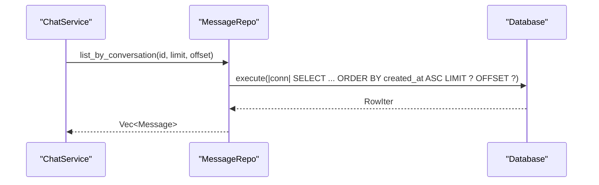
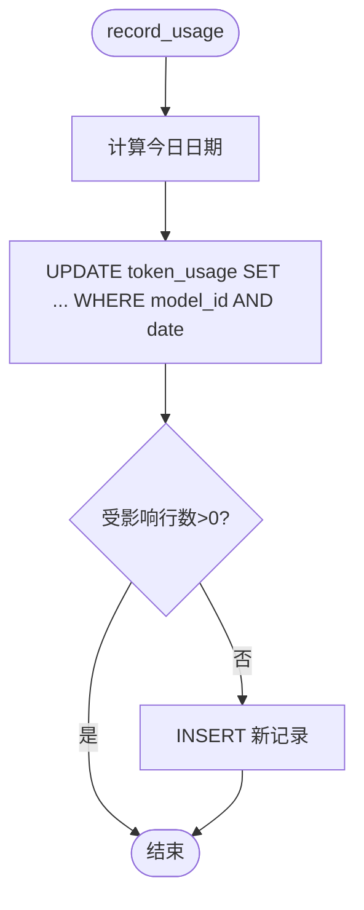
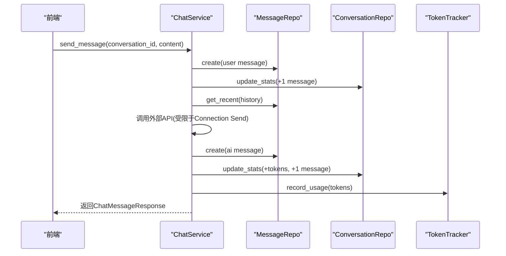
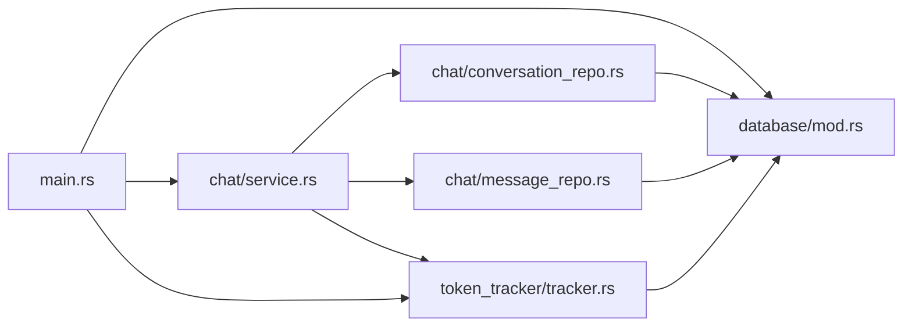

# 数据访问层

<cite>
**本文引用的文件**
- [src-tauri/src/database/mod.rs](file://src-tauri/src/database/mod.rs)
- [src-tauri/src/database/connection.rs](file://src-tauri/src/database/connection.rs)
- [src-tauri/src/database/models.rs](file://src-tauri/src/database/models.rs)
- [src-tauri/src/database/schema.rs](file://src-tauri/src/database/schema.rs)
- [src-tauri/src/chat/conversation_repo.rs](file://src-tauri/src/chat/conversation_repo.rs)
- [src-tauri/src/chat/message_repo.rs](file://src-tauri/src/chat/message_repo.rs)
- [src-tauri/src/chat/service.rs](file://src-tauri/src/chat/service.rs)
- [src-tauri/src/token_tracker/tracker.rs](file://src-tauri/src/token_tracker/tracker.rs)
- [src-tauri/src/main.rs](file://src-tauri/src/main.rs)
- [src-tauri/Cargo.toml](file://src-tauri/Cargo.toml)
</cite>

## 目录
1. [简介](#简介)
2. [项目结构](#项目结构)
3. [核心组件](#核心组件)
4. [架构总览](#架构总览)
5. [详细组件分析](#详细组件分析)
6. [依赖关系分析](#依赖关系分析)
7. [性能考量](#性能考量)
8. [故障排查指南](#故障排查指南)
9. [结论](#结论)
10. [附录](#附录)

## 简介
本文件系统性梳理 Malou Agent 的数据访问层，重点覆盖：
- Repository 模式的实现与职责边界
- 数据访问对象（DAO）设计与数据模型映射
- 数据库连接管理、事务处理与并发控制
- 实体模型定义、字段映射与数据校验
- 查询构建与分页、索引优化最佳实践
- 典型 CRUD 示例：会话创建、消息查询、批量清理与统计

## 项目结构
数据访问层位于 Rust 后端模块 src-tauri 下，采用“领域模型 + 数据库适配 + 仓储层 + 服务层”的分层组织：
- database 子模块：连接管理、表结构定义、实体模型
- chat 子模块：会话与消息的仓储与业务服务
- token_tracker 子模块：Token 使用统计与趋势分析
- main.rs：应用入口，负责初始化数据库、创建服务实例并注册命令

图表来源
- [src-tauri/src/main.rs](file://src-tauri/src/main.rs#L242-L321)
- [src-tauri/src/database/mod.rs](file://src-tauri/src/database/mod.rs#L1-L7)
- [src-tauri/src/chat/service.rs](file://src-tauri/src/chat/service.rs#L1-L224)
- [src-tauri/src/token_tracker/tracker.rs](file://src-tauri/src/token_tracker/tracker.rs#L1-L195)

章节来源
- [src-tauri/src/main.rs](file://src-tauri/src/main.rs#L242-L321)
- [src-tauri/src/database/mod.rs](file://src-tauri/src/database/mod.rs#L1-L7)

## 核心组件
- 数据库连接管理器：封装 SQLite 连接，提供异步/同步执行接口，启用外键与 WAL 模式，确保并发安全
- 实体模型：会话、消息、Token 使用、模型配置等结构化数据
- 表结构定义：集中声明建表语句与索引，便于迁移与维护
- 仓储层：ConversationRepo、MessageRepo 提供 CRUD 与聚合查询
- 服务层：ChatService 组合仓储与外部客户端，协调业务流程
- Token 统计：TokenTracker 负责按日聚合与趋势分析

章节来源
- [src-tauri/src/database/connection.rs](file://src-tauri/src/database/connection.rs#L1-L125)
- [src-tauri/src/database/models.rs](file://src-tauri/src/database/models.rs#L1-L110)
- [src-tauri/src/database/schema.rs](file://src-tauri/src/database/schema.rs#L1-L68)
- [src-tauri/src/chat/conversation_repo.rs](file://src-tauri/src/chat/conversation_repo.rs#L1-L161)
- [src-tauri/src/chat/message_repo.rs](file://src-tauri/src/chat/message_repo.rs#L1-L175)
- [src-tauri/src/chat/service.rs](file://src-tauri/src/chat/service.rs#L1-L224)
- [src-tauri/src/token_tracker/tracker.rs](file://src-tauri/src/token_tracker/tracker.rs#L1-L195)

## 架构总览
数据访问层遵循 Repository 模式，将业务逻辑与数据持久化解耦。应用启动时初始化数据库与表结构，随后在命令处理器中通过 ChatService 调用仓储完成 CRUD 操作。

图表来源
- [src-tauri/src/main.rs](file://src-tauri/src/main.rs#L71-L116)
- [src-tauri/src/chat/service.rs](file://src-tauri/src/chat/service.rs#L37-L70)
- [src-tauri/src/chat/conversation_repo.rs](file://src-tauri/src/chat/conversation_repo.rs#L14-L37)
- [src-tauri/src/chat/message_repo.rs](file://src-tauri/src/chat/message_repo.rs#L14-L52)
- [src-tauri/src/database/connection.rs](file://src-tauri/src/database/connection.rs#L67-L88)

## 详细组件分析

### 数据库连接管理器（Database）
- 设计要点
  - 使用 Arc<Mutex<Connection>> 包装 rusqlite::Connection，通过 tokio::sync::Mutex 提供异步互斥访问
  - 支持同步/异步两种执行模式：execute（异步）、execute_sync（同步）
  - 启用外键约束与 WAL 日志模式，提升并发与一致性
  - 提供 init_schema_sync，在应用启动时初始化表结构
- 并发与线程安全
  - 通过 Arc + Mutex 保证多线程共享；unsafe impl Send/Sync 仅在包装层有效，实际安全由 Mutex 保障
- 使用场景
  - 作为仓储层构造函数参数注入，统一提供 SQL 执行能力

图表来源
- [src-tauri/src/database/connection.rs](file://src-tauri/src/database/connection.rs#L10-L102)

章节来源
- [src-tauri/src/database/connection.rs](file://src-tauri/src/database/connection.rs#L1-L125)

### 实体模型与字段映射
- 会话（Conversation）：主键 id、标题、模型 id、Token 统计、消息计数、时间戳
- 消息（Message）：主键 id、所属会话、角色（user/assistant/system）、内容、Token 统计、时间戳
- Token 使用（TokenUsage）：自增 id、模型 id、日期、Prompt/Completion/Total Token、请求数、创建时间
- 模型配置（ModelConfig）：主键 id、名称、类型（local/remote）、配置 JSON、启用状态、时间戳
- 字段映射策略
  - 仓储层通过 rusqlite::query_map 将列名映射到结构体字段，保持命名一致
  - 时间字段统一使用 RFC3339 字符串存储，便于序列化与跨语言传输

图表来源
- [src-tauri/src/database/schema.rs](file://src-tauri/src/database/schema.rs#L2-L62)
- [src-tauri/src/database/models.rs](file://src-tauri/src/database/models.rs#L3-L91)

章节来源
- [src-tauri/src/database/models.rs](file://src-tauri/src/database/models.rs#L1-L110)
- [src-tauri/src/database/schema.rs](file://src-tauri/src/database/schema.rs#L1-L68)

### 会话仓储（ConversationRepo）
- 职责
  - 创建会话、列表查询、按 id 获取、更新标题/模型、统计更新/重置、删除（级联）
- 关键查询
  - 列表：按 updated_at 降序分页
  - 统计：原子更新 total_tokens 与 message_count，并更新 updated_at
- 并发控制
  - 通过 Database::execute 提供互斥访问，避免并发写冲突

图表来源
- [src-tauri/src/chat/conversation_repo.rs](file://src-tauri/src/chat/conversation_repo.rs#L14-L37)

章节来源
- [src-tauri/src/chat/conversation_repo.rs](file://src-tauri/src/chat/conversation_repo.rs#L1-L161)

### 消息仓储（MessageRepo）
- 职责
  - 创建消息、按会话列表查询、获取最近 N 条消息（构建上下文）、按 id 获取、按会话批量删除、统计消息数与总 Token
- 关键查询
  - 列表：按 created_at 升序分页
  - 最近 N 条：按 created_at 降序取 N 后反转，保证时间正序
  - 聚合：SUM(total_tokens)、COUNT(*)
- 并发控制
  - 通过 Database::execute 提供互斥访问

图表来源
- [src-tauri/src/chat/message_repo.rs](file://src-tauri/src/chat/message_repo.rs#L54-L81)
- [src-tauri/src/database/connection.rs](file://src-tauri/src/database/connection.rs#L67-L74)

章节来源
- [src-tauri/src/chat/message_repo.rs](file://src-tauri/src/chat/message_repo.rs#L1-L175)

### Token 统计（TokenTracker）
- 职责
  - 记录每日 Token 使用（按模型与日期聚合）
  - 提供总体汇总、按模型统计、每日趋势
- 关键查询
  - 记录：先尝试 UPDATE，未命中则 INSERT，实现幂等
  - 汇总：支持按日期范围过滤
  - 趋势：GROUP BY date，按日期升序输出
- 并发控制
  - 通过 Database::execute 提供互斥访问

图表来源
- [src-tauri/src/token_tracker/tracker.rs](file://src-tauri/src/token_tracker/tracker.rs#L14-L48)

章节来源
- [src-tauri/src/token_tracker/tracker.rs](file://src-tauri/src/token_tracker/tracker.rs#L1-L195)

### 服务层（ChatService）
- 职责
  - 组合 ConversationRepo 与 MessageRepo，协调消息发送、上下文构建、Token 统计记录
  - 与 OpenAI 客户端交互（当前受 rusqlite::Connection 不可 Send 的限制）
- 业务流程
  - 用户消息入库 → 更新会话统计 → 获取历史消息构建上下文 → 调用外部 API → 保存 AI 回复 → 更新会话统计与 Token 统计

图表来源
- [src-tauri/src/chat/service.rs](file://src-tauri/src/chat/service.rs#L94-L177)
- [src-tauri/src/token_tracker/tracker.rs](file://src-tauri/src/token_tracker/tracker.rs#L14-L48)

章节来源
- [src-tauri/src/chat/service.rs](file://src-tauri/src/chat/service.rs#L1-L224)

## 依赖关系分析
- 外部依赖
  - rusqlite：SQLite 驱动，提供 Connection、Statement、参数绑定与查询映射
  - tokio：异步运行时，配合 Mutex 提供并发安全
  - uuid/chrono：生成主键与时间戳
  - serde：结构体序列化/反序列化
- 内部模块依赖
  - main.rs 依赖 database、chat、token_tracker
  - chat/service 依赖 database、chat/repo、token_tracker
  - chat/repo 依赖 database
  - token_tracker 依赖 database

图表来源
- [src-tauri/src/main.rs](file://src-tauri/src/main.rs#L1-L14)
- [src-tauri/src/database/mod.rs](file://src-tauri/src/database/mod.rs#L1-L7)
- [src-tauri/src/chat/service.rs](file://src-tauri/src/chat/service.rs#L1-L18)

章节来源
- [src-tauri/src/main.rs](file://src-tauri/src/main.rs#L1-L321)
- [src-tauri/Cargo.toml](file://src-tauri/Cargo.toml#L12-L25)

## 性能考量
- 连接与并发
  - 使用 WAL 模式提升并发读写性能；通过 Arc<Mutex<Connection>> 保证互斥访问
  - 对于高并发场景，可考虑引入连接池或拆分读写分离（当前实现为单连接）
- 查询与索引
  - 会话列表按 updated_at 降序分页，索引 idx_conversations_updated 支持高效排序
  - 消息按 conversation_id + created_at 排序，索引 idx_messages_conv 支持会话内有序查询
  - Token 统计按 model_id + date 聚合，索引 idx_token_model_date 支持高效分组
- 分页与批量
  - 列表查询统一使用 LIMIT/OFFSET，建议结合游标分页或基于时间戳的增量拉取以降低偏移成本
  - 批量删除消息使用 DELETE WHERE，注意外键级联删除的代价
- 统计与聚合
  - 聚合查询使用 SUM/COUNT，建议定期归档历史数据以控制表规模
- 异步与阻塞
  - 当前仓储通过 Database::execute 包裹同步 rusqlite 调用；若需更高吞吐，可评估将数据库操作放入 tokio::task::spawn_blocking

章节来源
- [src-tauri/src/database/connection.rs](file://src-tauri/src/database/connection.rs#L24-L28)
- [src-tauri/src/database/schema.rs](file://src-tauri/src/database/schema.rs#L14-L61)
- [src-tauri/src/chat/conversation_repo.rs](file://src-tauri/src/chat/conversation_repo.rs#L39-L63)
- [src-tauri/src/chat/message_repo.rs](file://src-tauri/src/chat/message_repo.rs#L54-L81)
- [src-tauri/src/token_tracker/tracker.rs](file://src-tauri/src/token_tracker/tracker.rs#L143-L168)

## 故障排查指南
- 数据库初始化失败
  - 检查默认数据库路径是否存在且可写；确认 init_schema_sync 是否正确执行
- 查询异常
  - 确认 SQL 语句与列名一致；检查 rusqlite::query_map 的列索引是否匹配
- 并发问题
  - 确保所有数据库操作通过 Database::execute 或 execute_sync 执行；避免直接持有 Connection
- Token 统计不准确
  - 检查 record_usage 的 UPDATE/INSERT 分支；确认日期格式与模型 id 一致性
- 外部 API 调用受限
  - 当前 rusqlite::Connection 不支持 Send，导致 ChatService 无法直接异步调用外部客户端；需重构以支持 Send 或改用任务隔离

章节来源
- [src-tauri/src/main.rs](file://src-tauri/src/main.rs#L248-L259)
- [src-tauri/src/database/connection.rs](file://src-tauri/src/database/connection.rs#L67-L88)
- [src-tauri/src/token_tracker/tracker.rs](file://src-tauri/src/token_tracker/tracker.rs#L14-L48)

## 结论
Malou Agent 的数据访问层以 Repository 模式为核心，结合实体模型与表结构定义，提供了清晰的职责边界与良好的扩展性。通过 WAL 模式与索引优化，满足日常会话与消息管理的性能需求。未来可在连接池、游标分页、批量写入与异步外部调用等方面进一步优化。

## 附录

### CRUD 示例与最佳实践
- 会话创建
  - 步骤：生成 UUID → 写入会话表 → 返回实体
  - 参考路径：[会话创建](file://src-tauri/src/chat/conversation_repo.rs#L14-L37)
- 会话列表（分页）
  - 步骤：ORDER BY updated_at DESC → LIMIT/OFFSET
  - 参考路径：[会话列表](file://src-tauri/src/chat/conversation_repo.rs#L39-L63)
- 消息查询（按会话分页）
  - 步骤：WHERE conversation_id → ORDER BY created_at ASC → LIMIT/OFFSET
  - 参考路径：[消息列表](file://src-tauri/src/chat/message_repo.rs#L54-L81)
- 最近 N 条消息（构建上下文）
  - 步骤：WHERE conversation_id → ORDER BY created_at DESC → LIMIT N → 反转
  - 参考路径：[最近消息](file://src-tauri/src/chat/message_repo.rs#L83-L113)
- 批量清理（清空会话消息）
  - 步骤：DELETE FROM messages WHERE conversation_id → 重置会话统计
  - 参考路径：[批量删除](file://src-tauri/src/chat/message_repo.rs#L142-L151)，[重置统计](file://src-tauri/src/chat/conversation_repo.rs#L118-L132)
- Token 统计（每日聚合）
  - 步骤：UPDATE/INSERT 幂等 → GROUP BY date → ORDER BY date
  - 参考路径：[记录统计](file://src-tauri/src/token_tracker/tracker.rs#L14-L48)，[每日趋势](file://src-tauri/src/token_tracker/tracker.rs#L143-L168)