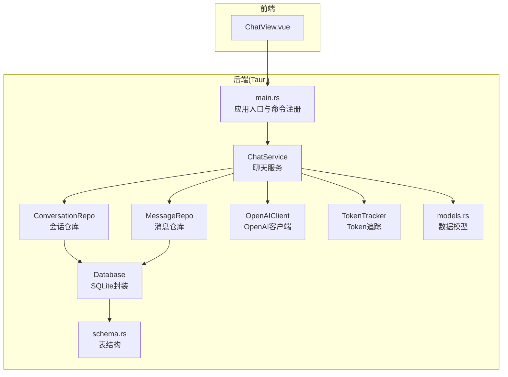
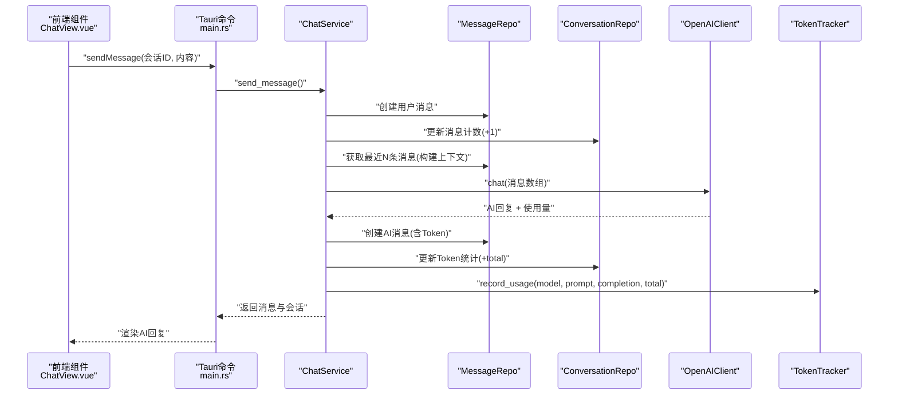
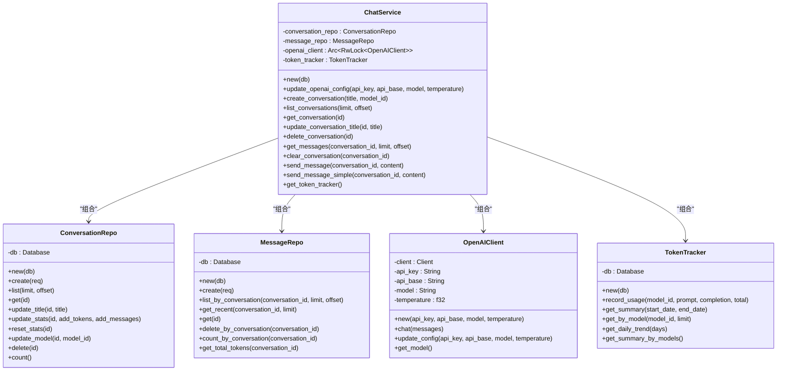
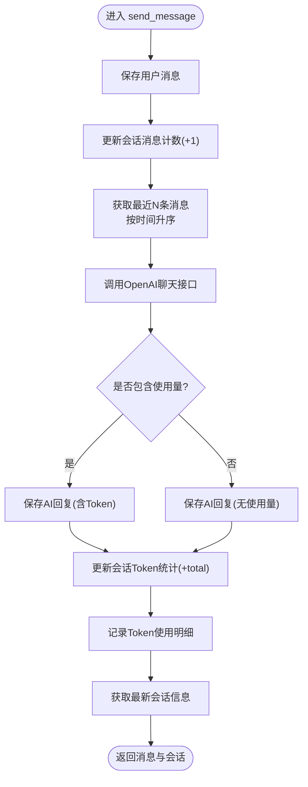
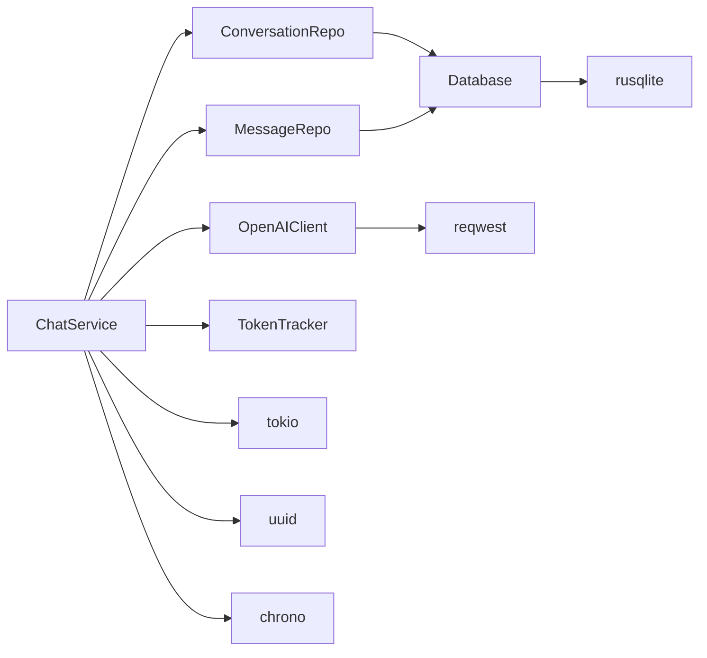

# 聊天服务层

<cite>
**本文档引用的文件**
- [src-tauri/src/chat/service.rs](file://src-tauri/src/chat/service.rs)
- [src-tauri/src/chat/mod.rs](file://src-tauri/src/chat/mod.rs)
- [src-tauri/src/chat/conversation_repo.rs](file://src-tauri/src/chat/conversation_repo.rs)
- [src-tauri/src/chat/message_repo.rs](file://src-tauri/src/chat/message_repo.rs)
- [src-tauri/src/chat/openai_client.rs](file://src-tauri/src/chat/openai_client.rs)
- [src-tauri/src/token_tracker/tracker.rs](file://src-tauri/src/token_tracker/tracker.rs)
- [src-tauri/src/database/models.rs](file://src-tauri/src/database/models.rs)
- [src-tauri/src/database/connection.rs](file://src-tauri/src/database/connection.rs)
- [src-tauri/src/database/schema.rs](file://src-tauri/src/database/schema.rs)
- [src-tauri/src/main.rs](file://src-tauri/src/main.rs)
- [src-tauri/Cargo.toml](file://src-tauri/Cargo.toml)
- [src/components/business/ChatView.vue](file://src/components/business/ChatView.vue)
- [src/main.ts](file://src/main.ts)
</cite>

## 目录
1. [简介](#简介)
2. [项目结构](#项目结构)
3. [核心组件](#核心组件)
4. [架构总览](#架构总览)
5. [详细组件分析](#详细组件分析)
6. [依赖关系分析](#依赖关系分析)
7. [性能考虑](#性能考虑)
8. [故障排查指南](#故障排查指南)
9. [结论](#结论)
10. [附录](#附录)

## 简介
本文件面向Malou Agent的聊天服务层，系统性阐述ChatService的设计模式、服务层职责分离与业务逻辑封装；详解会话管理、消息处理与上下文维护的核心算法；说明异步消息发送机制、错误恢复策略与性能优化技巧；并给出服务初始化流程、依赖注入与配置管理的实现细节。同时提供多轮对话处理、上下文截断与Token计算等关键业务场景的实现要点。

## 项目结构
聊天服务层位于Tauri后端模块中，采用分层设计：
- 服务层：ChatService负责编排会话、消息与外部OpenAI API交互，并维护Token统计。
- 数据访问层：ConversationRepo与MessageRepo分别封装会话与消息的持久化操作。
- 外部客户端：OpenAIClient封装OpenAI聊天接口调用。
- 统计追踪：TokenTracker负责Token用量的记录与查询。
- 数据模型：统一定义Conversation、Message、TokenUsage等数据结构。
- 数据库：基于SQLite，通过Database封装连接、事务与Schema初始化。
- 前端集成：Vue组件通过Tauri命令与后端交互，驱动聊天视图。

图表来源
- [src-tauri/src/main.rs](file://src-tauri/src/main.rs#L242-L315)
- [src-tauri/src/chat/service.rs](file://src-tauri/src/chat/service.rs#L1-L224)
- [src-tauri/src/chat/conversation_repo.rs](file://src-tauri/src/chat/conversation_repo.rs#L1-L161)
- [src-tauri/src/chat/message_repo.rs](file://src-tauri/src/chat/message_repo.rs#L1-L175)
- [src-tauri/src/chat/openai_client.rs](file://src-tauri/src/chat/openai_client.rs#L1-L141)
- [src-tauri/src/token_tracker/tracker.rs](file://src-tauri/src/token_tracker/tracker.rs#L1-L195)
- [src-tauri/src/database/connection.rs](file://src-tauri/src/database/connection.rs#L1-L89)
- [src-tauri/src/database/schema.rs](file://src-tauri/src/database/schema.rs#L1-L68)
- [src-tauri/src/database/models.rs](file://src-tauri/src/database/models.rs#L1-L110)

章节来源
- [src-tauri/src/main.rs](file://src-tauri/src/main.rs#L242-L315)
- [src-tauri/src/chat/mod.rs](file://src-tauri/src/chat/mod.rs#L1-L10)

## 核心组件
- ChatService：服务层核心，聚合会话与消息仓库、OpenAI客户端与Token追踪器，提供会话生命周期管理、消息发送与上下文构建、统计更新与Token记录。
- ConversationRepo：封装会话的创建、查询、更新、删除与统计更新。
- MessageRepo：封装消息的创建、查询、最近消息检索、批量清理与统计查询。
- OpenAIClient：封装OpenAI聊天接口调用，支持配置更新与模型查询。
- TokenTracker：封装Token使用记录的写入、汇总查询与趋势统计。
- Database：封装SQLite连接、WAL模式、外键约束与Schema初始化。
- 数据模型：统一的Conversation、Message、TokenUsage等结构体定义。

章节来源
- [src-tauri/src/chat/service.rs](file://src-tauri/src/chat/service.rs#L11-L224)
- [src-tauri/src/chat/conversation_repo.rs](file://src-tauri/src/chat/conversation_repo.rs#L4-L161)
- [src-tauri/src/chat/message_repo.rs](file://src-tauri/src/chat/message_repo.rs#L4-L175)
- [src-tauri/src/chat/openai_client.rs](file://src-tauri/src/chat/openai_client.rs#L5-L141)
- [src-tauri/src/token_tracker/tracker.rs](file://src-tauri/src/token_tracker/tracker.rs#L4-L195)
- [src-tauri/src/database/connection.rs](file://src-tauri/src/database/connection.rs#L7-L89)
- [src-tauri/src/database/models.rs](file://src-tauri/src/database/models.rs#L3-L110)

## 架构总览
聊天服务层遵循“服务编排 + 分层DAO + 外部客户端 + 统计追踪”的架构模式，通过Tauri命令暴露给前端Vue组件调用。整体流程包括：会话管理（创建/查询/更新/删除）、消息管理（保存用户消息、构建上下文、调用OpenAI、保存AI回复、更新统计）、Token统计（记录用量、汇总与趋势）。

图表来源
- [src-tauri/src/main.rs](file://src-tauri/src/main.rs#L140-L161)
- [src-tauri/src/chat/service.rs](file://src-tauri/src/chat/service.rs#L94-L177)
- [src-tauri/src/chat/message_repo.rs](file://src-tauri/src/chat/message_repo.rs#L14-L52)
- [src-tauri/src/chat/conversation_repo.rs](file://src-tauri/src/chat/conversation_repo.rs#L102-L116)
- [src-tauri/src/chat/openai_client.rs](file://src-tauri/src/chat/openai_client.rs#L74-L116)
- [src-tauri/src/token_tracker/tracker.rs](file://src-tauri/src/token_tracker/tracker.rs#L14-L48)

## 详细组件分析

### ChatService 设计与职责
- 设计模式：组合优于继承，通过聚合多个仓库与客户端实现功能编排；对OpenAI客户端使用Arc<RwLock<>>以支持并发安全。
- 职责分离：
  - 会话管理：创建、查询、更新标题、删除、列表与统计重置。
  - 消息管理：保存用户消息、获取最近消息构建上下文、保存AI回复、清空会话。
  - 上下文维护：从消息仓库获取最近N条消息，按时间升序组织，作为OpenAI请求的消息数组。
  - 异步调用：对外部OpenAI API的调用采用异步方法，避免阻塞主线程。
  - 统计与追踪：更新会话统计（消息数、Token总量），记录Token使用明细。
- 关键算法：
  - 上下文截断：通过“最近N条消息”限制上下文长度，平衡性能与效果。
  - Token计算：若响应包含使用量则累加至会话统计，并记录到Token追踪表。
- 错误处理：所有DAO与外部调用均进行错误映射与传播，保证上层可感知失败原因。

图表来源
- [src-tauri/src/chat/service.rs](file://src-tauri/src/chat/service.rs#L11-L224)
- [src-tauri/src/chat/conversation_repo.rs](file://src-tauri/src/chat/conversation_repo.rs#L4-L161)
- [src-tauri/src/chat/message_repo.rs](file://src-tauri/src/chat/message_repo.rs#L4-L175)
- [src-tauri/src/chat/openai_client.rs](file://src-tauri/src/chat/openai_client.rs#L5-L141)
- [src-tauri/src/token_tracker/tracker.rs](file://src-tauri/src/token_tracker/tracker.rs#L4-L195)

章节来源
- [src-tauri/src/chat/service.rs](file://src-tauri/src/chat/service.rs#L20-L224)

### 会话管理与消息处理算法
- 会话管理：
  - 创建：生成UUID作为主键，初始化统计字段与时间戳，插入conversations表。
  - 查询：支持分页列表、单条查询、标题更新、删除（级联删除消息）、统计重置、模型更新与计数。
- 消息处理：
  - 用户消息保存：创建消息记录，填充prompt/completion/total tokens占位。
  - 上下文构建：按时间倒序取最近N条消息，再反转为正序，形成消息序列。
  - AI回复保存：根据响应内容与使用量创建assistant消息，更新会话统计。
  - 清空会话：删除消息并重置会话统计。

图表来源
- [src-tauri/src/chat/service.rs](file://src-tauri/src/chat/service.rs#L94-L177)
- [src-tauri/src/chat/message_repo.rs](file://src-tauri/src/chat/message_repo.rs#L83-L113)
- [src-tauri/src/chat/conversation_repo.rs](file://src-tauri/src/chat/conversation_repo.rs#L102-L116)
- [src-tauri/src/token_tracker/tracker.rs](file://src-tauri/src/token_tracker/tracker.rs#L14-L48)

章节来源
- [src-tauri/src/chat/conversation_repo.rs](file://src-tauri/src/chat/conversation_repo.rs#L14-L132)
- [src-tauri/src/chat/message_repo.rs](file://src-tauri/src/chat/message_repo.rs#L14-L113)

### 上下文截断与Token计算
- 上下文截断：通过“最近N条消息”限制上下文长度，默认取最近20条，避免超出模型上下文窗口。
- Token计算：若响应包含使用量，则将prompt_tokens、completion_tokens、total_tokens累加到会话统计，并记录到token_usage表；否则按0处理。
- 统计维度：支持按模型、按日期、按时间段的汇总与趋势分析，便于成本控制与监控。

章节来源
- [src-tauri/src/chat/service.rs](file://src-tauri/src/chat/service.rs#L114-L177)
- [src-tauri/src/token_tracker/tracker.rs](file://src-tauri/src/token_tracker/tracker.rs#L14-L195)

### 异步消息发送机制与错误恢复
- 异步机制：OpenAI调用采用异步方法，先释放读锁再发起异步请求，避免死锁；服务层内部同步步骤与外部异步调用解耦。
- 错误恢复：
  - DAO层错误映射为字符串，便于前端展示。
  - OpenAI API错误包含HTTP状态码与响应文本，便于定位问题。
  - 前端在发送失败时回滚临时用户消息，保持界面一致性。
- 并发安全：OpenAI客户端通过Arc<RwLock<>>包装，支持多线程并发访问。

章节来源
- [src-tauri/src/chat/service.rs](file://src-tauri/src/chat/service.rs#L127-L135)
- [src-tauri/src/chat/openai_client.rs](file://src-tauri/src/chat/openai_client.rs#L74-L116)
- [src/components/business/ChatView.vue](file://src/components/business/ChatView.vue#L162-L222)

### 服务初始化流程、依赖注入与配置管理
- 初始化流程：
  - 应用启动时创建Database实例，初始化Schema与WAL模式。
  - 构造ChatService并注入Database，随后注入AppState并交由Tauri管理。
  - 注册Tauri命令，前端通过命令调用服务层能力。
- 依赖注入：
  - ChatService构造时注入ConversationRepo、MessageRepo、OpenAIClient与TokenTracker。
  - OpenAI配置通过命令更新内存状态，但当前架构下ChatService不支持Send，配置更新需后续重构以支持跨线程共享。
- 配置管理：
  - OpenAI配置存储于AppState的Mutex中，提供读取与保存命令。
  - 数据库路径通过工具函数获取默认位置，确保应用数据隔离。

章节来源
- [src-tauri/src/main.rs](file://src-tauri/src/main.rs#L242-L315)
- [src-tauri/src/chat/service.rs](file://src-tauri/src/chat/service.rs#L20-L35)
- [src-tauri/src/database/connection.rs](file://src-tauri/src/database/connection.rs#L12-L58)

## 依赖关系分析
- 外部依赖：reqwest用于HTTP请求，tokio提供异步运行时，rusqlite提供SQLite访问，uuid与chrono用于标识与时间处理。
- 内部依赖：ChatService依赖ConversationRepo、MessageRepo、OpenAIClient、TokenTracker；DAO层依赖Database；模型定义被服务与DAO共享。

图表来源
- [src-tauri/Cargo.toml](file://src-tauri/Cargo.toml#L12-L24)
- [src-tauri/src/chat/service.rs](file://src-tauri/src/chat/service.rs#L1-L18)
- [src-tauri/src/chat/openai_client.rs](file://src-tauri/src/chat/openai_client.rs#L1-L11)
- [src-tauri/src/database/connection.rs](file://src-tauri/src/database/connection.rs#L1-L10)

章节来源
- [src-tauri/Cargo.toml](file://src-tauri/Cargo.toml#L12-L24)

## 性能考虑
- 数据库性能：
  - WAL模式提升并发读写性能，适合频繁的会话与消息读写。
  - 外键约束开启保证数据一致性，配合Cascade删除简化清理流程。
  - 为conversations与messages建立索引，优化分页与按会话查询。
- 上下文截断：
  - 限制最近消息数量，降低请求体积与延迟，避免超出模型上下文长度。
- 异步与并发：
  - OpenAI调用异步化，避免阻塞；Arc<RwLock<>>支持并发读取，写入时互斥。
- 前端体验：
  - 发送时显示加载态，失败时回滚临时消息，提升交互稳定性。

章节来源
- [src-tauri/src/database/connection.rs](file://src-tauri/src/database/connection.rs#L22-L27)
- [src-tauri/src/database/schema.rs](file://src-tauri/src/database/schema.rs#L14-L32)
- [src-tauri/src/chat/service.rs](file://src-tauri/src/chat/service.rs#L114-L135)
- [src/components/business/ChatView.vue](file://src/components/business/ChatView.vue#L162-L222)

## 故障排查指南
- OpenAI API错误：
  - 检查HTTP状态码与响应文本，确认API密钥、基础URL与模型设置正确。
  - 若响应为空或格式异常，检查网络连通性与代理设置。
- 数据库相关：
  - 确认数据库路径存在且具备读写权限；Schema初始化成功。
  - 若出现外键约束错误，检查会话与消息的关联关系。
- 前端交互：
  - 发送失败时查看控制台日志，确认命令调用链路与错误信息。
  - 清空聊天记录后确认界面提示与统计数据同步更新。

章节来源
- [src-tauri/src/chat/openai_client.rs](file://src-tauri/src/chat/openai_client.rs#L94-L98)
- [src-tauri/src/database/connection.rs](file://src-tauri/src/database/connection.rs#L12-L43)
- [src/components/business/ChatView.vue](file://src/components/business/ChatView.vue#L209-L222)

## 结论
Malou Agent聊天服务层通过清晰的分层设计与职责分离，实现了稳定的会话与消息管理、可靠的上下文构建与Token统计。当前架构在并发与异步方面具备良好基础，但在跨线程共享配置与真实OpenAI调用方面仍需进一步重构以满足生产需求。建议后续工作包括：重构ChatService以支持Send、完善OpenAI配置的跨线程共享、增强错误恢复与可观测性。

## 附录
- 前端集成要点：
  - Vue组件通过Tauri命令与后端交互，负责UI渲染与用户输入处理。
  - 应用初始化时引入Pinia与ElementPlus，提供状态管理与UI组件库支持。

章节来源
- [src/components/business/ChatView.vue](file://src/components/business/ChatView.vue#L1-L569)
- [src/main.ts](file://src/main.ts#L1-L13)