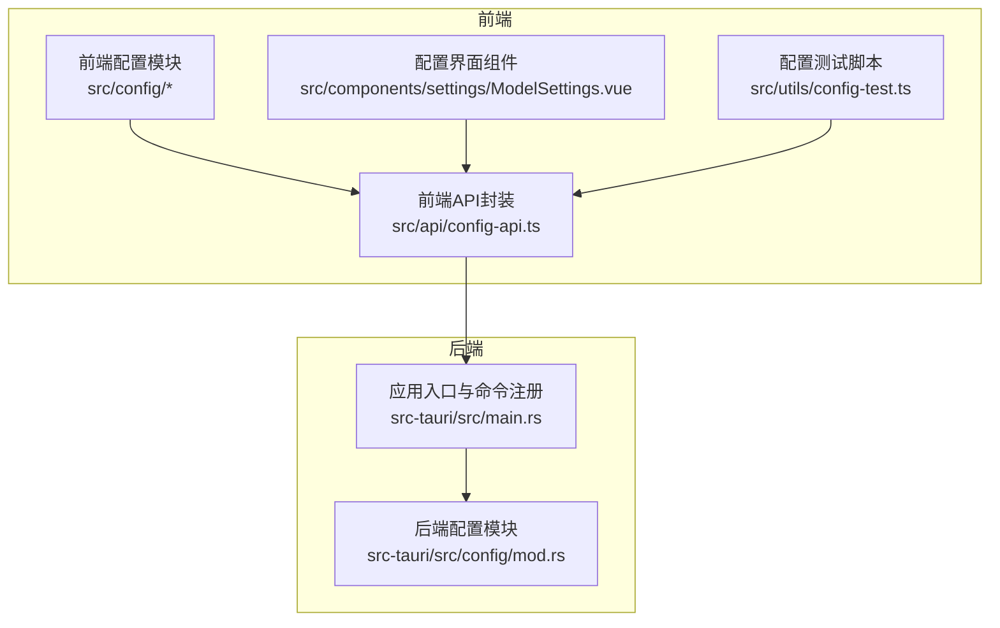
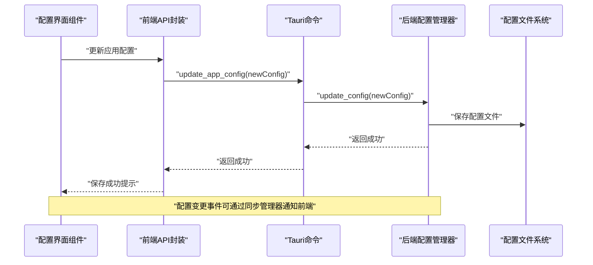
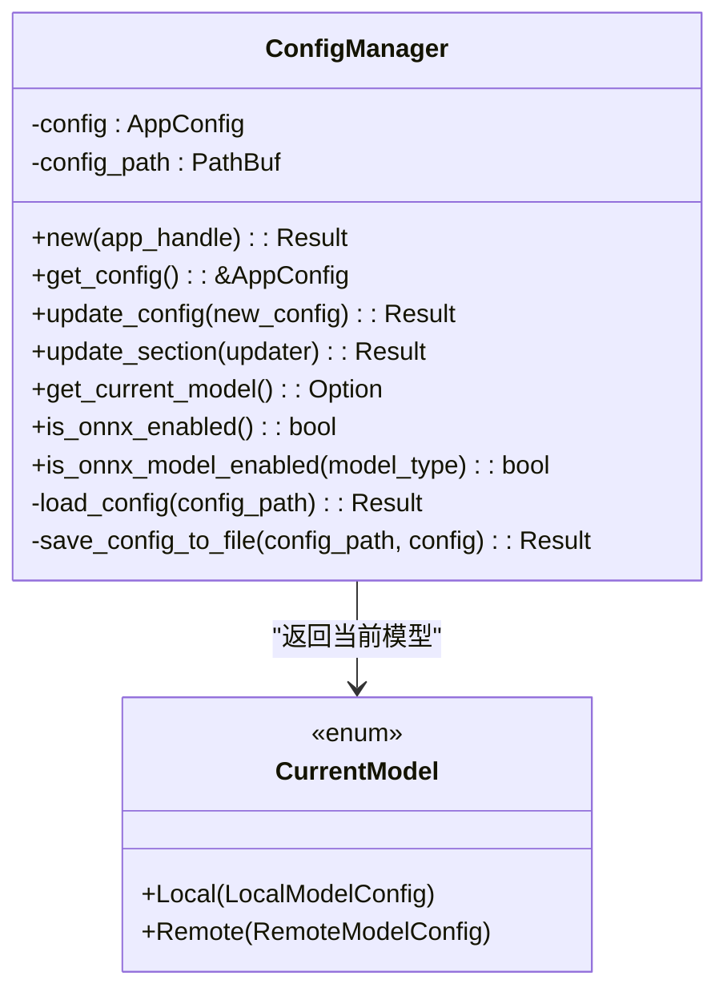
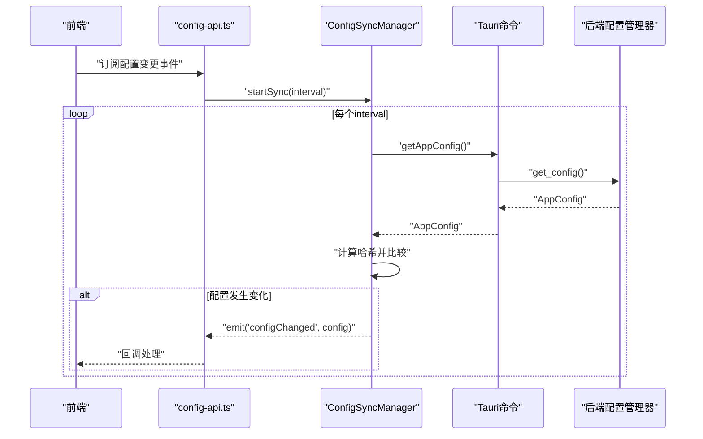
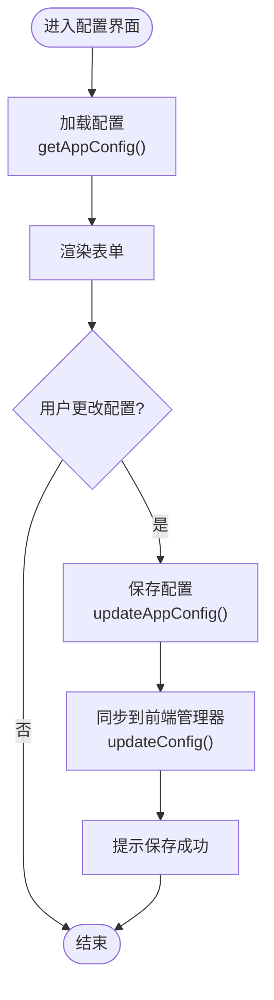
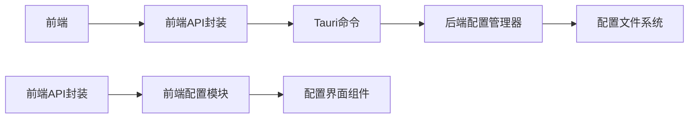

# 配置管理系统

<cite>
**本文档引用的文件**
- [src/config/index.ts](file://src/config/index.ts)
- [src/config/app-settings.ts](file://src/config/app-settings.ts)
- [src/config/model-config.ts](file://src/config/model-config.ts)
- [src/api/config-api.ts](file://src/api/config-api.ts)
- [src-tauri/src/config/mod.rs](file://src-tauri/src/config/mod.rs)
- [src-tauri/src/main.rs](file://src-tauri/src/main.rs)
- [src/components/settings/ModelSettings.vue](file://src/components/settings/ModelSettings.vue)
- [src/utils/config-test.ts](file://src/utils/config-test.ts)
- [docs/configuration-management.md](file://docs/configuration-management.md)
- [README.md](file://README.md)
</cite>

## 目录
1. [简介](#简介)
2. [项目结构](#项目结构)
3. [核心组件](#核心组件)
4. [架构总览](#架构总览)
5. [详细组件分析](#详细组件分析)
6. [依赖关系分析](#依赖关系分析)
7. [性能考虑](#性能考虑)
8. [故障排除指南](#故障排除指南)
9. [结论](#结论)
10. [附录](#附录)

## 简介
本文件面向Malou Agent配置管理系统，系统采用前后端分离架构：前端使用Vue 3 + TypeScript进行配置界面与状态管理，后端使用Rust + Tauri提供持久化配置与命令接口。配置管理涵盖应用配置、模型配置与用户偏好，支持验证规则、默认值、动态更新、导出导入、事件通知与热同步等功能。文档将从设计架构、数据流、处理逻辑、集成点、错误处理与性能特征等方面进行全面阐述，并提供具体配置场景示例。

## 项目结构
配置管理相关的核心文件分布如下：
- 前端配置管理与API封装：src/config、src/api
- 后端配置管理与Tauri命令：src-tauri/src/config、src-tauri/src/main.rs
- 配置界面组件：src/components/settings/ModelSettings.vue
- 测试与文档：src/utils/config-test.ts、docs/configuration-management.md
- 顶层说明：README.md



图表来源
- [src/config/index.ts](file://src/config/index.ts#L1-L3)
- [src/config/app-settings.ts](file://src/config/app-settings.ts#L1-L195)
- [src/config/model-config.ts](file://src/config/model-config.ts#L1-L163)
- [src/api/config-api.ts](file://src/api/config-api.ts#L1-L201)
- [src-tauri/src/config/mod.rs](file://src-tauri/src/config/mod.rs#L1-L334)
- [src-tauri/src/main.rs](file://src-tauri/src/main.rs#L1-L321)

章节来源
- [README.md](file://README.md#L45-L61)

## 核心组件
- 前端配置管理器（ConfigManager）
  - 提供响应式配置状态、更新、重置、导出导入、模型选择查询与ONNX功能开关检查
  - 支持分节更新与深度监听自动保存
- 后端配置管理器（ConfigManager）
  - 负责配置文件的读写、默认配置生成、当前模型解析与ONNX能力查询
  - 提供Tauri命令接口供前端调用
- 前端API封装（config-api.ts）
  - 将后端命令封装为前端可调用的函数，包含配置转换、事件监听与同步管理
- 配置界面组件（ModelSettings.vue）
  - 提供模型选择、本地/远程模型配置、ONNX功能开关与资源限制设置
- 测试脚本（config-test.ts）
  - 验证配置获取、更新、前端管理器与当前模型获取流程

章节来源
- [src/config/app-settings.ts](file://src/config/app-settings.ts#L6-L183)
- [src-tauri/src/config/mod.rs](file://src-tauri/src/config/mod.rs#L144-L248)
- [src/api/config-api.ts](file://src/api/config-api.ts#L1-L201)
- [src/components/settings/ModelSettings.vue](file://src/components/settings/ModelSettings.vue#L1-L580)
- [src/utils/config-test.ts](file://src/utils/config-test.ts#L1-L66)

## 架构总览
系统采用“前端响应式状态 + 后端持久化配置”的双层架构：
- 前端负责UI交互、实时状态与本地自动保存；后端负责配置文件的持久化与跨进程命令执行
- 前后端通过Tauri命令通信，前端API封装负责数据格式转换与事件分发
- 配置变更通过命令写回后端，前端可监听后端配置变化并触发事件



图表来源
- [src/api/config-api.ts](file://src/api/config-api.ts#L62-L114)
- [src-tauri/src/config/mod.rs](file://src-tauri/src/config/mod.rs#L268-L276)
- [src-tauri/src/main.rs](file://src-tauri/src/main.rs#L309-L317)

## 详细组件分析

### 前端配置管理器（ConfigManager）
- 设计要点
  - 使用响应式ref持有AppConfig，提供getConfig、getConfigRef、updateConfig、updateSection等方法
  - 支持validateConfig与mergeConfig，确保配置合法性与增量更新
  - 自动保存：通过watch监听配置变化并在general.autoSave为true时保存至localStorage
  - 模型选择：getCurrentModel根据modelSelector.currentModel查找当前模型，支持本地与远程模型，以及后备模型
  - ONNX功能：isONNXEnabled与isONNXModelEnabled用于判断ONNX功能与子功能开关
- 数据结构与复杂度
  - 配置对象结构清晰，查询与更新均为O(n)遍历（n为模型数量），在合理规模内性能可接受
  - 深度监听用于自动保存，避免频繁I/O，仅在配置变化且允许自动保存时触发
- 错误处理
  - 导入配置时JSON解析异常会被捕获并返回错误信息
  - 保存/加载配置失败会记录错误日志，不影响其他功能
- 性能影响
  - 深度监听在大型配置树上可能带来开销，建议在不需要时关闭自动保存或减少不必要的配置变更

```mermaid
classDiagram
class ConfigManager {
-config : ref<AppConfig>
-storageKey : string
+getConfig() : AppConfig
+getConfigRef()
+updateConfig(newConfig) : {success, errors?}
+updateSection(section, data) : {success, errors?}
+resetToDefault() : void
+exportConfig() : string
+importConfig(configStr) : {success, errors?}
+getCurrentModel()
+getAvailableModels() : Array
+setCurrentModel(modelId) : void
+isONNXEnabled() : boolean
+isONNXModelEnabled(modelType) : boolean
-loadConfig() : void
-saveConfig() : void
-setupAutoSave() : void
}
```

图表来源
- [src/config/app-settings.ts](file://src/config/app-settings.ts#L6-L183)

章节来源
- [src/config/app-settings.ts](file://src/config/app-settings.ts#L6-L183)

### 后端配置管理器（ConfigManager）
- 设计要点
  - 使用Rust结构体定义配置模型，包含本地模型、远程模型、ONNX设置、模型选择器与通用设置
  - 默认配置通过Default trait生成，首次运行自动创建配置文件
  - 提供get_app_config、update_app_config、get_current_model_info、update_model_selection、toggle_local_models、toggle_onnx_feature等命令
  - 当前模型解析优先远程模型，其次本地模型，最后后备模型
- 数据结构与复杂度
  - 配置结构与前端一致，序列化/反序列化使用serde_json，时间复杂度O(n)
  - 更新操作通过update_section闭包安全地修改配置并持久化
- 错误处理
  - 文件读写异常被捕获并转换为字符串错误返回给前端
  - ONNX功能查询通过HashMap查找，不存在键时返回默认false
- 性能影响
  - 配置文件读写在应用启动与更新时发生，通常影响较小
  - 建议避免频繁更新配置，以减少磁盘IO



图表来源
- [src-tauri/src/config/mod.rs](file://src-tauri/src/config/mod.rs#L144-L248)

章节来源
- [src-tauri/src/config/mod.rs](file://src-tauri/src/config/mod.rs#L144-L248)

### 前端API封装与事件同步
- 设计要点
  - convertFromBackendConfig/convertToBackendConfig负责前后端配置格式转换
  - ConfigEventManager提供事件订阅与发布机制，ConfigSyncManager周期性拉取后端配置并与上次哈希比较，触发configChanged事件
  - 提供updateModelSelection、toggleLocalModels、toggleONNXFeature等便捷命令
- 数据流
  - 前端通过invoke调用后端命令，后端返回结果或抛出错误
  - 同步管理器定期轮询，检测配置变化并通过事件通知前端
- 错误处理
  - 同步失败会记录错误但不中断主流程
  - 命令调用异常由前端统一捕获并提示



图表来源
- [src/api/config-api.ts](file://src/api/config-api.ts#L137-L199)
- [src-tauri/src/config/mod.rs](file://src-tauri/src/config/mod.rs#L258-L285)

章节来源
- [src/api/config-api.ts](file://src/api/config-api.ts#L1-L201)

### 配置界面组件（ModelSettings.vue）
- 设计要点
  - 提供模型选择、本地/远程模型配置、ONNX功能开关与资源限制设置
  - 支持添加/删除远程模型、导出/导入配置文件
  - 与前端API封装配合，实现配置的双向同步
- 交互流程
  - 加载配置：调用getAppConfig填充表单
  - 保存配置：调用updateAppConfig并将结果同步到前端配置管理器
  - 功能切换：调用toggleLocalModels/toggleONNXFeature即时生效
  - 模型切换：调用updateModelSelection更新当前模型



图表来源
- [src/components/settings/ModelSettings.vue](file://src/components/settings/ModelSettings.vue#L88-L117)

章节来源
- [src/components/settings/ModelSettings.vue](file://src/components/settings/ModelSettings.vue#L1-L580)

### 配置验证规则、默认值与兼容性
- 默认值
  - 前端与后端均提供DEFAULT_CONFIG/AppConfig::default，包含本地模型、远程模型、ONNX设置、模型选择器与通用设置的默认值
- 验证规则
  - 前端validateConfig校验远程模型的API密钥与API地址必填，以及启用本地模型时必须至少有一个模型
  - 后端未显式提供配置验证函数，但通过命令更新时会直接写入配置文件
- 兼容性
  - 前后端通过convertFromBackendConfig/convertToBackendConfig进行字段映射，确保新增字段时保持兼容
  - ONNX设置在后端使用HashMap存储子功能开关，在前端使用固定键名，新增功能需同时扩展两端

章节来源
- [src/config/model-config.ts](file://src/config/model-config.ts#L119-L138)
- [src-tauri/src/config/mod.rs](file://src-tauri/src/config/mod.rs#L80-L142)
- [src/api/config-api.ts](file://src/api/config-api.ts#L12-L59)

### 配置迁移、版本管理与备份恢复
- 配置迁移
  - 后端在首次运行时若配置文件不存在则创建默认配置，实现新版本首次运行的自动迁移
- 版本管理
  - 通过默认配置与字段映射实现向后兼容；新增字段时需在convert函数中提供默认值
- 备份恢复
  - 前端提供导出/导入配置功能，便于用户手动备份与恢复
  - 后端未提供专用的备份/恢复命令，建议结合文件系统进行备份

章节来源
- [src-tauri/src/config/mod.rs](file://src-tauri/src/config/mod.rs#L167-L178)
- [src/components/settings/ModelSettings.vue](file://src/components/settings/ModelSettings.vue#L182-L215)

### 具体配置场景示例
- 模型切换
  - 前端：调用updateModelSelection(modelId)，更新modelSelector.currentModel
  - 后端：get_current_model_info返回当前模型，优先远程模型，其次本地模型，最后后备模型
- 功能开关
  - 本地模型开关：toggleLocalModels(enabled)，更新localModels.enabled
  - ONNX功能开关：toggleONNXFeature(feature, enabled)，更新onnx.models[feature]
- 个性化设置
  - 主题/语言/自动保存：通过updateAppConfig更新general字段
  - ONNX资源限制：更新onnx.resourceLimit.maxMemoryMB与maxThreads

章节来源
- [src/api/config-api.ts](file://src/api/config-api.ts#L122-L134)
- [src-tauri/src/config/mod.rs](file://src-tauri/src/config/mod.rs#L208-L238)
- [src-tauri/src/config/mod.rs](file://src-tauri/src/config/mod.rs#L304-L317)
- [src-tauri/src/config/mod.rs](file://src-tauri/src/config/mod.rs#L319-L333)

## 依赖关系分析
- 前端依赖
  - Vue响应式系统用于状态管理与自动保存
  - Tauri invoke用于调用后端命令
  - Element Plus用于UI组件
- 后端依赖
  - serde/serde_json用于配置序列化/反序列化
  - dirs用于获取应用配置目录
  - tauri::Manager用于状态管理与命令注册
- 耦合与内聚
  - 前后端通过命令接口耦合，数据格式通过convert函数解耦
  - 配置管理器职责单一，内聚性良好



图表来源
- [src/api/config-api.ts](file://src/api/config-api.ts#L1-L201)
- [src-tauri/src/config/mod.rs](file://src-tauri/src/config/mod.rs#L1-L334)
- [src-tauri/src/main.rs](file://src-tauri/src/main.rs#L289-L317)

章节来源
- [src-tauri/src/main.rs](file://src-tauri/src/main.rs#L289-L317)

## 性能考虑
- 自动保存策略
  - 仅在general.autoSave为true时保存，避免频繁I/O
  - 深度监听可能带来性能开销，建议在批量更新时临时关闭自动保存
- 配置同步
  - ConfigSyncManager默认每5秒轮询一次，可根据实际需求调整间隔
  - 哈希比较避免重复事件触发
- 文件读写
  - 首次运行创建默认配置，后续读写为常规操作
  - 建议在应用退出时再进行一次保存，确保数据一致性

## 故障排除指南
- 配置导入失败
  - 检查JSON格式是否正确，前端会在导入时捕获并提示错误
- 保存配置失败
  - 检查localStorage权限与空间，前端会捕获异常并记录错误
- 同步失败
  - 检查网络与后端命令是否可用，同步管理器会记录错误但不会中断流程
- 模型切换无效
  - 确认modelSelector.currentModel是否存在于可用模型列表，检查远程模型API密钥与地址

章节来源
- [src/config/app-settings.ts](file://src/config/app-settings.ts#L65-L75)
- [src/api/config-api.ts](file://src/api/config-api.ts#L178-L189)
- [src-tauri/src/config/mod.rs](file://src-tauri/src/config/mod.rs#L208-L238)

## 结论
Malou Agent配置管理系统通过前后端协作实现了完整的配置生命周期管理：从默认配置生成、验证与合并、动态更新、事件通知到导出导入与备份恢复。系统在保证易用性的同时，兼顾了性能与稳定性。建议在后续迭代中完善后端配置验证、增加版本迁移工具与自动备份功能，进一步提升用户体验与可靠性。

## 附录
- 相关文档
  - [docs/configuration-management.md](file://docs/configuration-management.md#L1-L304)
- 测试参考
  - [src/utils/config-test.ts](file://src/utils/config-test.ts#L1-L66)